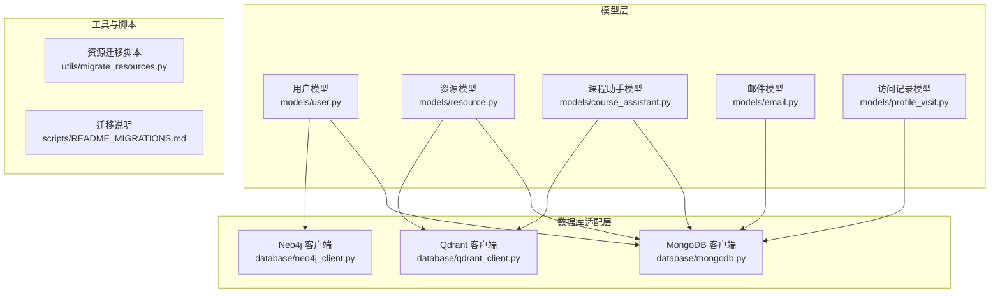
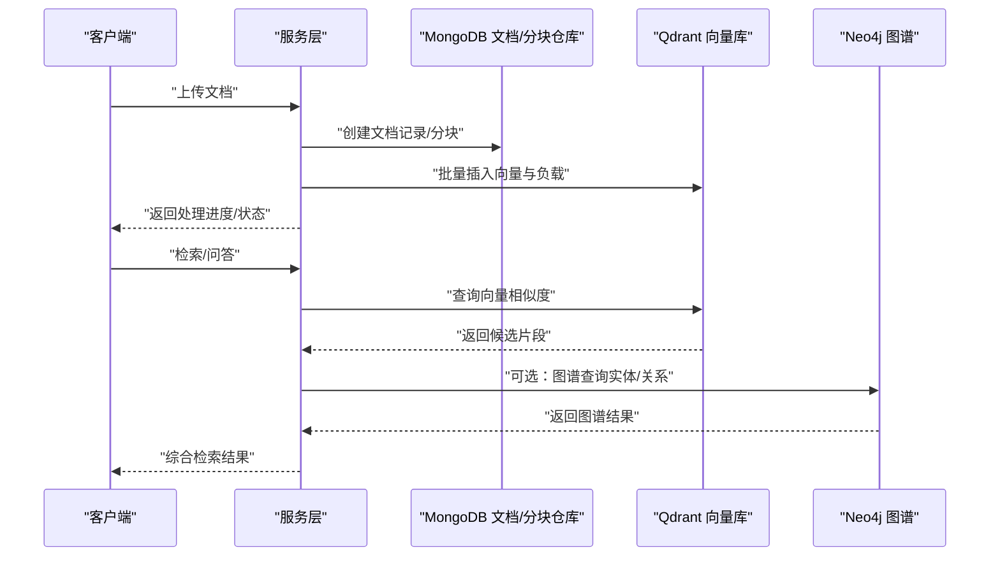
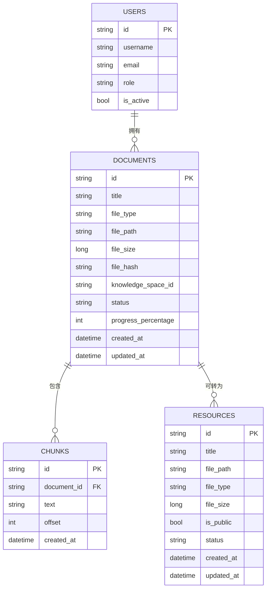
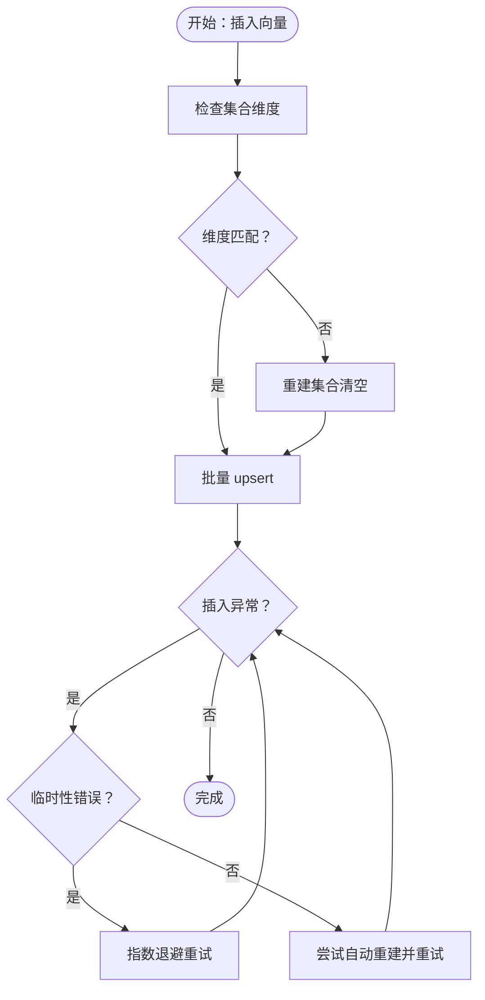
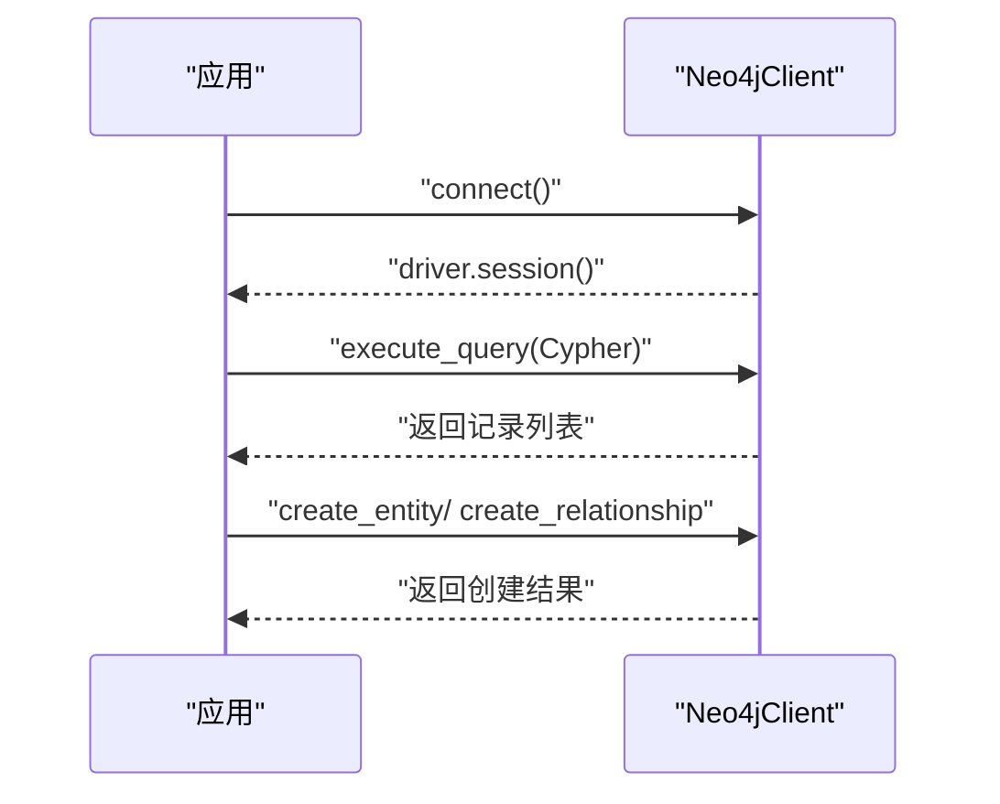
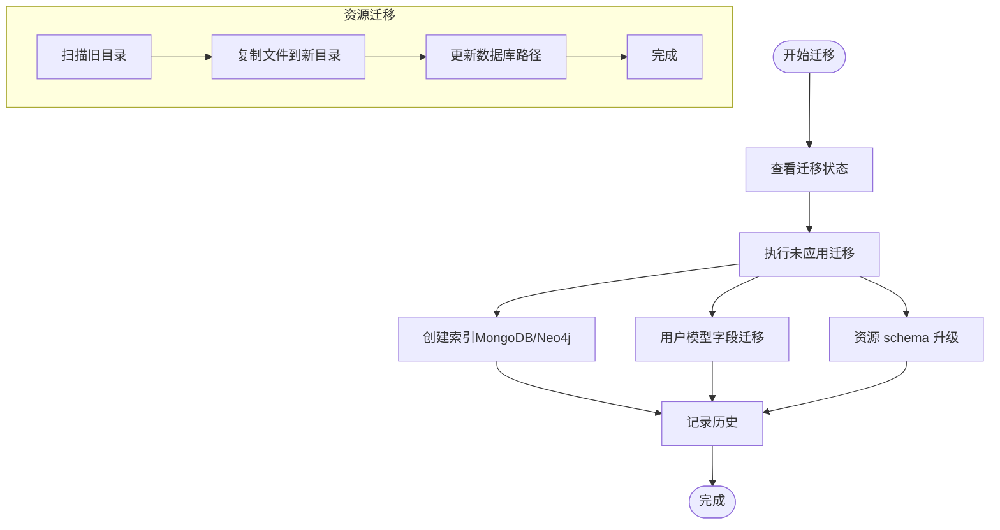
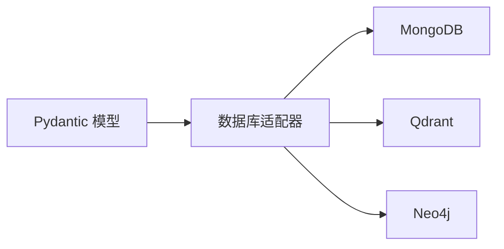

# 数据模型设计

<cite>
**本文引用的文件**
- [database/mongodb.py](file://database/mongodb.py)
- [database/qdrant_client.py](file://database/qdrant_client.py)
- [database/neo4j_client.py](file://database/neo4j_client.py)
- [models/user.py](file://models/user.py)
- [models/resource.py](file://models/resource.py)
- [models/course_assistant.py](file://models/course_assistant.py)
- [models/email.py](file://models/email.py)
- [models/profile_visit.py](file://models/profile_visit.py)
- [utils/migrate_resources.py](file://utils/migrate_resources.py)
- [scripts/README_MIGRATIONS.md](file://scripts/README_MIGRATIONS.md)
- [docker-compose.yml](file://docker-compose.yml)
</cite>

## 目录
1. [引言](#引言)
2. [项目结构](#项目结构)
3. [核心组件](#核心组件)
4. [架构总览](#架构总览)
5. [详细组件分析](#详细组件分析)
6. [依赖分析](#依赖分析)
7. [性能考虑](#性能考虑)
8. [故障排查指南](#故障排查指南)
9. [结论](#结论)
10. [附录](#附录)

## 引言
本设计文档面向 Advanced RAG 项目，系统化阐述数据层的整体设计，覆盖以下方面：
- MongoDB 文档模型、用户模型、对话与助手模型的实体关系、字段定义与数据类型
- Qdrant 向量数据库的集合配置、嵌入向量管理、索引与查询策略
- Neo4j 图数据库的图结构设计、节点与关系建模、查询优化
- 数据验证规则、业务规则、主键/外键约束、索引设计与约束条件
- 数据访问模式、缓存策略与性能考量
- 数据生命周期、保留与归档策略
- 数据迁移路径与版本管理策略
- 数据安全、隐私与访问控制机制

## 项目结构
项目采用“模型-数据库-服务-路由”的分层组织，数据模型以 Pydantic 模型定义，数据库适配器分别封装 MongoDB、Qdrant、Neo4j 的连接与操作。

图表来源
- [database/mongodb.py](file://database/mongodb.py)
- [database/qdrant_client.py](file://database/qdrant_client.py)
- [database/neo4j_client.py](file://database/neo4j_client.py)
- [models/user.py](file://models/user.py)
- [models/resource.py](file://models/resource.py)
- [models/course_assistant.py](file://models/course_assistant.py)
- [models/email.py](file://models/email.py)
- [models/profile_visit.py](file://models/profile_visit.py)
- [utils/migrate_resources.py](file://utils/migrate_resources.py)
- [scripts/README_MIGRATIONS.md](file://scripts/README_MIGRATIONS.md)

章节来源
- [database/mongodb.py](file://database/mongodb.py)
- [database/qdrant_client.py](file://database/qdrant_client.py)
- [database/neo4j_client.py](file://database/neo4j_client.py)
- [models/user.py](file://models/user.py)
- [models/resource.py](file://models/resource.py)
- [models/course_assistant.py](file://models/course_assistant.py)
- [models/email.py](file://models/email.py)
- [models/profile_visit.py](file://models/profile_visit.py)
- [utils/migrate_resources.py](file://utils/migrate_resources.py)
- [scripts/README_MIGRATIONS.md](file://scripts/README_MIGRATIONS.md)

## 核心组件
- MongoDB：异步与同步客户端，文档仓库与分块仓库，提供连接池、重试与健康检查
- Qdrant：向量集合创建、批量插入、相似度检索、按文档ID删除与滚动查询
- Neo4j：连接、Cypher 查询执行、实体与关系创建（MERGE）

章节来源
- [database/mongodb.py](file://database/mongodb.py)
- [database/qdrant_client.py](file://database/qdrant_client.py)
- [database/neo4j_client.py](file://database/neo4j_client.py)

## 架构总览
整体数据流围绕“文档入库—分块—向量化—写入向量库—检索—返回结果”展开，并通过模型层进行数据契约约束与验证。

图表来源
- [database/mongodb.py](file://database/mongodb.py)
- [database/qdrant_client.py](file://database/qdrant_client.py)
- [database/neo4j_client.py](file://database/neo4j_client.py)

## 详细组件分析

### MongoDB 文档模型与仓库
- 集合划分
  - users：用户信息与权限
  - documents：文档元数据（标题、类型、路径、哈希、状态、进度）
  - chunks：分块元数据（与文档关联）
  - resources：资源（文件/链接、标签、公开状态）
  - migration_history：迁移历史
- 仓库职责
  - DocumentRepository：文档创建、状态与进度更新、列表与计数、标题更新、删除、移动、转资源
  - ChunkRepository：分块创建与管理（基于同步客户端）
  - ResourceRepository：资源创建、更新、状态维护
- 连接与性能
  - 异步客户端用于 API 层，支持连接池参数与健康检查
  - 同步客户端用于批处理（文档/分块），支持 ping 与集合存在性检查
- 索引与约束
  - 迁移脚本提供索引创建（见迁移说明）
  - 主键：MongoDB ObjectId；外键：通过字段（如 assistant_id、knowledge_space_id、document_id）表达

图表来源
- [database/mongodb.py](file://database/mongodb.py)
- [models/resource.py](file://models/resource.py)

章节来源
- [database/mongodb.py](file://database/mongodb.py)
- [models/resource.py](file://models/resource.py)

### Qdrant 向量数据库
- 集合命名与向量维度
  - 默认集合名：advanced_rag_knowledge
  - 向量维度由嵌入模型决定（如 768），自动校验与重建
- 插入与重试
  - 批量 upsert，支持维度不匹配自动重建
  - 临时性错误（超时/连接/网关）指数退避重试
- 查询策略
  - query_points 向量检索，支持过滤条件（如 document_id）
  - score_threshold 控制召回质量
- 生命周期管理
  - 按 document_id 删除/滚动查询，便于文档级清理
  - 集合信息查询（点数统计）

图表来源
- [database/qdrant_client.py](file://database/qdrant_client.py)

章节来源
- [database/qdrant_client.py](file://database/qdrant_client.py)

### Neo4j 图数据库
- 连接与环境
  - 支持容器内 localhost 替换为 host.docker.internal
  - 验证连接（verify_connectivity）
- 查询与建模
  - 执行 Cypher 查询（execute_query）
  - MERGE 创建实体与关系，避免重复
- 应用场景
  - 用户关系、资源关联、实体抽取与链接（结合检索结果）

图表来源
- [database/neo4j_client.py](file://database/neo4j_client.py)

章节来源
- [database/neo4j_client.py](file://database/neo4j_client.py)

### 模型与验证规则
- 用户模型（user.py）
  - 字段：id、username、email、full_name、user_type、role、在线状态与时间、头像、角色与细粒度权限、资料扩展字段（教育、工作、研究、技能、兴趣、个性、简介、联系方式、可见性、学院/专业）
  - 验证：邮箱格式（含 .local 开发域）
- 资源模型（resource.py）
  - 字段：id、title、description、file_path、file_type、file_size、url、cover/thumbnail、assistant_id、uploader_id、status、is_public、tags、schema_version、时间戳
  - 验证：URL 格式
- 课程助手模型（course_assistant.py）
  - 字段：id、name、description、system_prompt、collection_name（Qdrant 集合名）、is_default、greeting_message、quick_prompts、inference_model、embedding_model、icon_url、时间戳
  - 验证：名称与集合名规范
- 邮件模型（email.py）
  - 字段：收件人（用户ID或用户类型/班级/年级）、主题、内容、优先级、是否需要关系、附件、状态、时间戳
  - 验证：收件人二选一规则
- 访问记录模型（profile_visit.py）
  - 字段：访客ID、被访用户ID、访问时间、IP（可选）

章节来源
- [models/user.py](file://models/user.py)
- [models/resource.py](file://models/resource.py)
- [models/course_assistant.py](file://models/course_assistant.py)
- [models/email.py](file://models/email.py)
- [models/profile_visit.py](file://models/profile_visit.py)

### 数据访问模式与缓存策略
- MongoDB
  - 异步客户端用于高并发 API 请求，连接池参数可调
  - 同步客户端用于批处理（文档/分块），减少 IO 干扰
  - 建议：热点查询加索引（迁移脚本已规划）
- Qdrant
  - gRPC 优先，连接复用，降低 HTTP/httpx 依赖带来的 502 风险
  - 批量 upsert + 指数退避重试，提升稳定性
- Neo4j
  - 会话级查询，MERGE 避免重复，适合增量建图

章节来源
- [database/mongodb.py](file://database/mongodb.py)
- [database/qdrant_client.py](file://database/qdrant_client.py)
- [database/neo4j_client.py](file://database/neo4j_client.py)

### 性能特性与优化
- 连接池与超时
  - MongoDB：maxPoolSize/minPoolSize/maxIdleTimeMS/serverSelectionTimeout/connectTimeout/socketTimeout
  - Qdrant：prefer_grpc、timeout、重试与退避
- 查询优化
  - MongoDB：迁移脚本计划索引（见迁移说明）
  - Qdrant：按 document_id 过滤、score_threshold、集合维度一致性
- I/O 优化
  - 批量插入、滚动查询（按需分页）

章节来源
- [database/mongodb.py](file://database/mongodb.py)
- [database/qdrant_client.py](file://database/qdrant_client.py)
- [scripts/README_MIGRATIONS.md](file://scripts/README_MIGRATIONS.md)

### 数据生命周期、保留与归档
- 文档与分块
  - 状态机：processing → completed/failed；进度百分比与阶段详情
  - 按知识空间/助手维度归档与清理（通过集合与过滤字段）
- 资源
  - 状态：active/down/deleted；公开/私有控制
- 向量
  - 按 document_id 删除与滚动查询，支持文档级归档
- 迁移与版本
  - 迁移历史记录在 migration_history 集合
  - 资源 schema_version 字段用于兼容升级

章节来源
- [database/mongodb.py](file://database/mongodb.py)
- [database/qdrant_client.py](file://database/qdrant_client.py)
- [models/resource.py](file://models/resource.py)
- [scripts/README_MIGRATIONS.md](file://scripts/README_MIGRATIONS.md)

### 数据迁移路径与版本管理
- 迁移脚本
  - 支持：创建 MongoDB/Neo4j 索引、用户模型字段迁移、资源 schema 升级
  - 历史记录：migration_history 集合
  - 交互：--status、--migrations、--force
- 资源迁移
  - 从旧目录复制文件到新挂载点，更新数据库路径
  - 支持相对路径规范化与多旧目录扫描

图表来源
- [scripts/README_MIGRATIONS.md](file://scripts/README_MIGRATIONS.md)
- [utils/migrate_resources.py](file://utils/migrate_resources.py)

章节来源
- [scripts/README_MIGRATIONS.md](file://scripts/README_MIGRATIONS.md)
- [utils/migrate_resources.py](file://utils/migrate_resources.py)

### 数据安全、隐私与访问控制
- 认证与授权
  - MongoDB：支持用户名/密码与 authSource 配置
  - Qdrant：本地 HTTP 通常无需 API key；HTTPS/gRPC 优先
  - Neo4j：bolt 连接，用户名/密码
- 隐私与可见性
  - 用户资料可见性：public/private/friends
  - 资源公开状态：is_public 控制
- 访问控制
  - 用户角色：admin/teacher/user/developer
  - 细粒度权限：助手/文档/资源/标签/基础提示词/邮件发送权限
- 网络与容器
  - docker-compose 提供服务编排
  - 容器内 Neo4j URI 自动替换 localhost 为 host.docker.internal

章节来源
- [database/mongodb.py](file://database/mongodb.py)
- [database/qdrant_client.py](file://database/qdrant_client.py)
- [database/neo4j_client.py](file://database/neo4j_client.py)
- [models/user.py](file://models/user.py)
- [docker-compose.yml](file://docker-compose.yml)

## 依赖分析
- 组件耦合
  - 服务层依赖数据库适配器；模型层为契约，解耦数据访问与业务逻辑
- 外部依赖
  - MongoDB（异步/同步）、Qdrant（gRPC/HTTP）、Neo4j（bolt）
- 潜在循环
  - 未发现直接循环依赖；模型与适配器通过接口解耦

图表来源
- [database/mongodb.py](file://database/mongodb.py)
- [database/qdrant_client.py](file://database/qdrant_client.py)
- [database/neo4j_client.py](file://database/neo4j_client.py)
- [models/user.py](file://models/user.py)
- [models/resource.py](file://models/resource.py)
- [models/course_assistant.py](file://models/course_assistant.py)
- [models/email.py](file://models/email.py)
- [models/profile_visit.py](file://models/profile_visit.py)

## 性能考虑
- 连接与并发
  - MongoDB 连接池参数调优，避免高并发下的连接抖动
  - Qdrant 优先 gRPC，减少 HTTP 层开销
- 查询与索引
  - 迁移脚本计划索引，加速常用过滤字段（如 knowledge_space_id、assistant_id、document_id）
- 写入与重试
  - 向量批量 upsert + 指数退避，提升吞吐与稳定性
- I/O 与缓存
  - 分块与向量分离存储，按需加载；缓存热点查询结果（建议在应用层实现）

## 故障排查指南
- MongoDB
  - 连接失败：检查 MONGODB_URI/MONGODB_HOST/PORT/用户名密码/权限
  - 首次请求重试：依赖 require_mongodb 的兜底逻辑
- Qdrant
  - 502/超时：切换 gRPC 端口，启用 prefer_grpc；检查网络与 API key 配置
  - 维度不匹配：自动重建集合（数据清空），注意向量维度一致性
- Neo4j
  - 连接失败：确认 NEO4J_URI/USER/PASSWORD；容器内 URI 替换
  - 查询失败：检查 Cypher 语法与参数绑定
- 迁移
  - 查看 migration_history；按迁移说明逐条排查

章节来源
- [database/mongodb.py](file://database/mongodb.py)
- [database/qdrant_client.py](file://database/qdrant_client.py)
- [database/neo4j_client.py](file://database/neo4j_client.py)
- [scripts/README_MIGRATIONS.md](file://scripts/README_MIGRATIONS.md)

## 结论
本设计文档基于现有代码实现了 MongoDB、Qdrant、Neo4j 的数据模型与访问模式映射，明确了字段定义、验证规则、索引与约束、查询策略、迁移与版本管理、以及安全与隐私控制。建议在生产环境配合迁移脚本与监控体系，持续优化索引与查询路径，保障高并发与高可用。

## 附录
- 示例数据
  - 用户：包含角色、权限、资料可见性、在线状态
  - 资源：标题、类型、大小、公开状态、标签、上传者
  - 助手：名称、系统提示词、集合名、默认标志、图标
  - 邮件：收件人（ID/类型/班级/年级）、主题、内容、优先级、状态
  - 访问记录：访客ID、被访用户ID、访问时间、IP
- 环境与部署
  - docker-compose 提供服务编排参考

章节来源
- [models/user.py](file://models/user.py)
- [models/resource.py](file://models/resource.py)
- [models/course_assistant.py](file://models/course_assistant.py)
- [models/email.py](file://models/email.py)
- [models/profile_visit.py](file://models/profile_visit.py)
- [docker-compose.yml](file://docker-compose.yml)