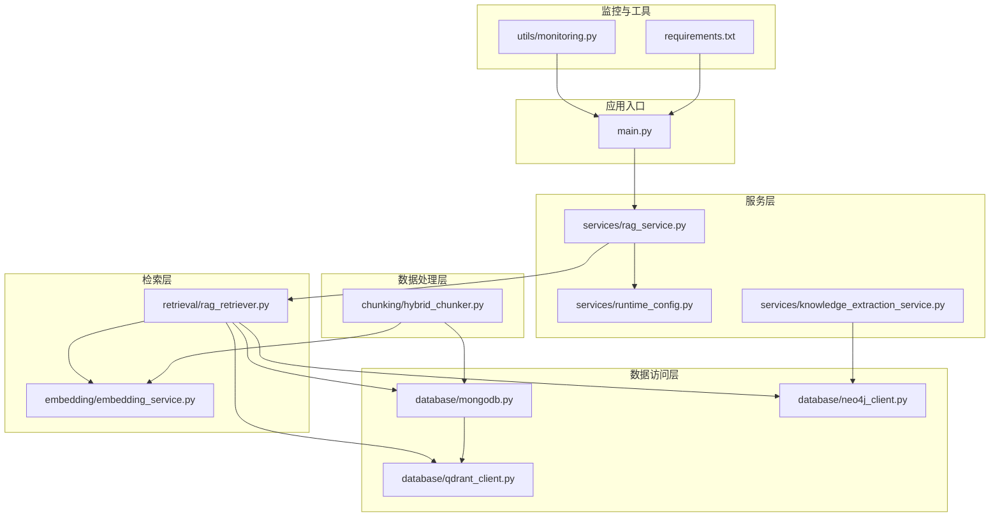
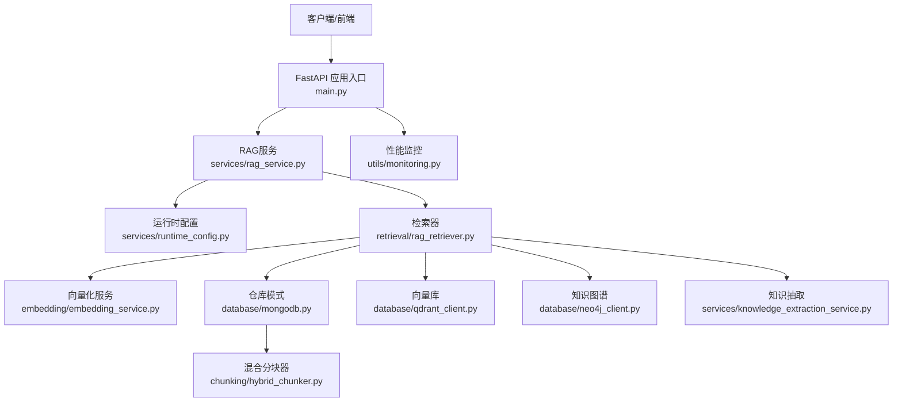
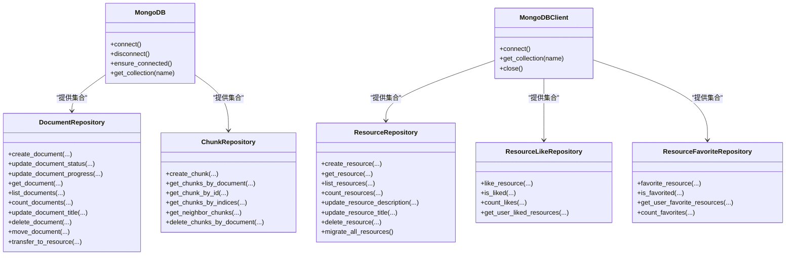
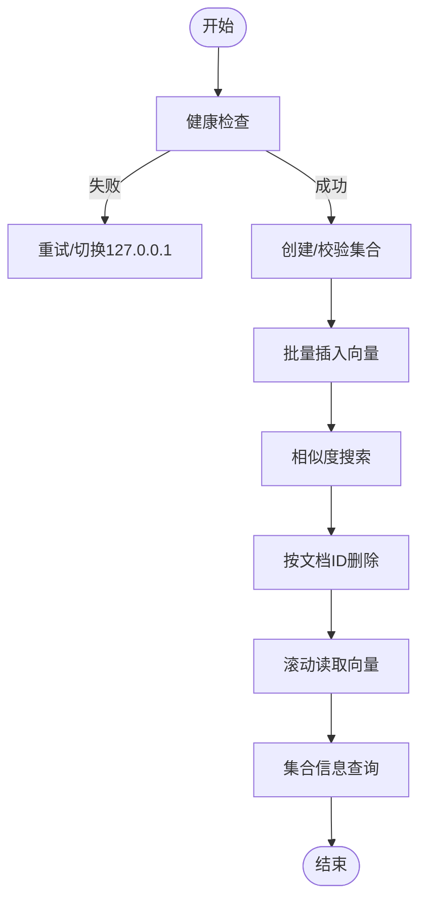
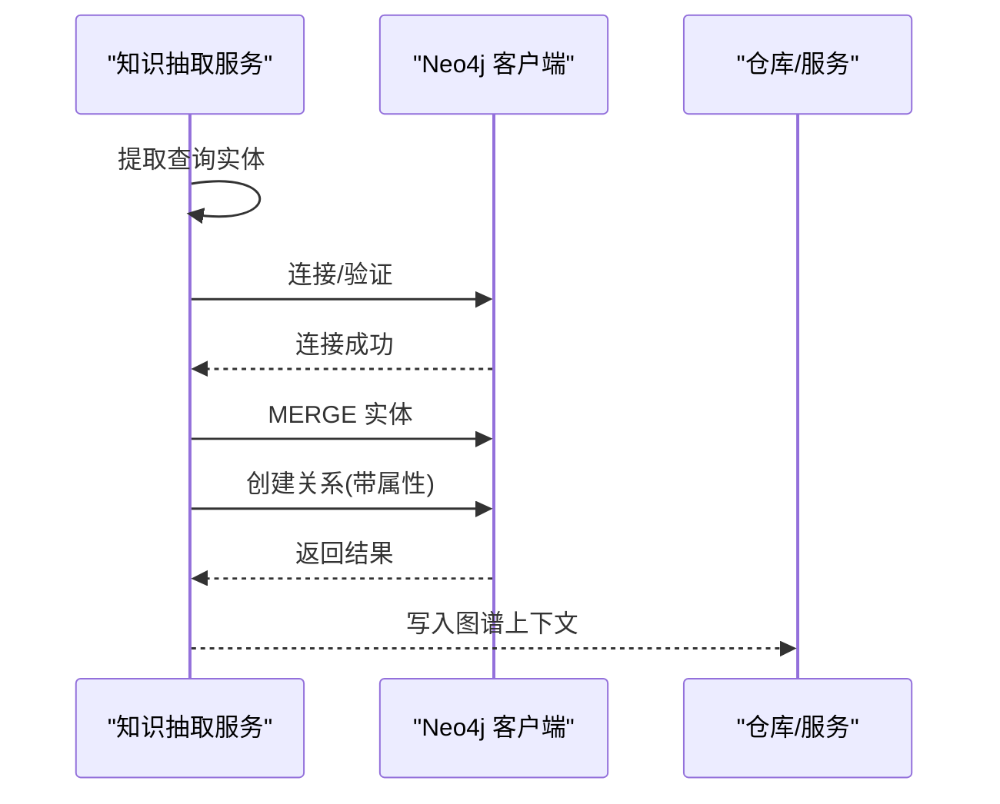
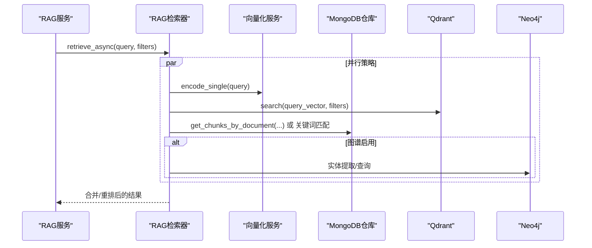
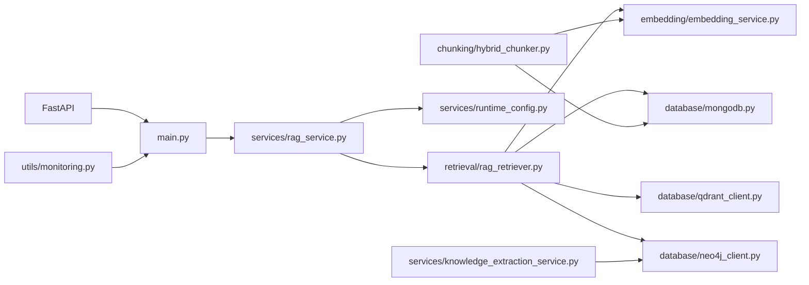

# 数据集成模式

<cite>
**本文引用的文件**
- [main.py](file://main.py)
- [requirements.txt](file://requirements.txt)
- [database/mongodb.py](file://database/mongodb.py)
- [database/neo4j_client.py](file://database/neo4j_client.py)
- [database/qdrant_client.py](file://database/qdrant_client.py)
- [embedding/embedding_service.py](file://embedding/embedding_service.py)
- [retrieval/rag_retriever.py](file://retrieval/rag_retriever.py)
- [services/rag_service.py](file://services/rag_service.py)
- [services/runtime_config.py](file://services/runtime_config.py)
- [services/knowledge_extraction_service.py](file://services/knowledge_extraction_service.py)
- [chunking/hybrid_chunker.py](file://chunking/hybrid_chunker.py)
- [utils/monitoring.py](file://utils/monitoring.py)
</cite>

## 目录
1. [引言](#引言)
2. [项目结构](#项目结构)
3. [核心组件](#核心组件)
4. [架构总览](#架构总览)
5. [详细组件分析](#详细组件分析)
6. [依赖分析](#依赖分析)
7. [性能考虑](#性能考虑)
8. [故障排查指南](#故障排查指南)
9. [结论](#结论)
10. [附录](#附录)

## 引言
本文件系统化梳理该代码库的数据集成模式，围绕多数据库架构设计、数据分层存储、访问模式与一致性保障、数据同步策略、访问层仓库模式与连接池管理、事务处理、数据转换与映射、缓存策略、数据流与架构图、性能监控与优化建议，以及数据安全与隐私保护等方面展开。文档旨在帮助开发者与运维人员快速理解并高效扩展该系统的数据层与检索增强生成（RAG）能力。

## 项目结构
该项目采用分层清晰的模块化组织，数据相关能力集中在 database、embedding、retrieval、services、chunking、utils 等子包中，配合 FastAPI 应用入口 main.py 提供统一的 API 服务与生命周期管理。

图表来源
- [main.py:1-171](file://main.py#L1-L171)
- [services/rag_service.py:1-323](file://services/rag_service.py#L1-L323)
- [retrieval/rag_retriever.py:1-393](file://retrieval/rag_retriever.py#L1-L393)
- [embedding/embedding_service.py:1-333](file://embedding/embedding_service.py#L1-L333)
- [database/mongodb.py:1-1341](file://database/mongodb.py#L1-L1341)
- [database/neo4j_client.py:1-104](file://database/neo4j_client.py#L1-L104)
- [database/qdrant_client.py:1-544](file://database/qdrant_client.py#L1-L544)
- [services/runtime_config.py:1-218](file://services/runtime_config.py#L1-L218)
- [services/knowledge_extraction_service.py:1-229](file://services/knowledge_extraction_service.py#L1-L229)
- [chunking/hybrid_chunker.py:1-179](file://chunking/hybrid_chunker.py#L1-L179)
- [utils/monitoring.py:1-185](file://utils/monitoring.py#L1-L185)
- [requirements.txt:1-42](file://requirements.txt#L1-L42)

章节来源
- [main.py:1-171](file://main.py#L1-L171)
- [requirements.txt:1-42](file://requirements.txt#L1-L42)

## 核心组件
- 多数据库架构
  - MongoDB：文档元数据、分块、资源、点赞/收藏等结构化数据存储与仓库模式实现。
  - Qdrant：向量数据库，支撑向量检索与相似度搜索。
  - Neo4j：知识图谱，实体与关系抽取与存储。
- 向量化服务：基于 Ollama 的嵌入服务，支持模型名称规范化与自动检测。
- 检索器：混合检索（向量 + 关键词 + 图谱），支持重排与动态裁剪。
- 运行时配置：MongoDB 持久化 + TTL 缓存，支持模块开关与参数调节。
- 数据处理：混合分块器，保留代码/公式/表格完整性并进行语义分块与去重。
- 监控：请求耗时、错误率、系统 CPU/内存/磁盘指标采集与慢请求告警。

章节来源
- [database/mongodb.py:1-1341](file://database/mongodb.py#L1-L1341)
- [database/qdrant_client.py:1-544](file://database/qdrant_client.py#L1-L544)
- [database/neo4j_client.py:1-104](file://database/neo4j_client.py#L1-L104)
- [embedding/embedding_service.py:1-333](file://embedding/embedding_service.py#L1-L333)
- [retrieval/rag_retriever.py:1-393](file://retrieval/rag_retriever.py#L1-L393)
- [services/runtime_config.py:1-218](file://services/runtime_config.py#L1-L218)
- [chunking/hybrid_chunker.py:1-179](file://chunking/hybrid_chunker.py#L1-L179)
- [utils/monitoring.py:1-185](file://utils/monitoring.py#L1-L185)

## 架构总览
该系统采用“多数据库分层 + 检索增强生成”的数据集成架构：
- 存储层：MongoDB（结构化）、Qdrant（向量）、Neo4j（图谱）。
- 访问层：仓库模式封装集合操作，统一连接与生命周期管理。
- 检索层：向量化 + 多策略融合检索 + 可选重排 + 动态裁剪。
- 处理层：混合分块器 + 知识抽取 + 运行时配置。
- 监控层：请求性能与系统指标采集。

图表来源
- [main.py:1-171](file://main.py#L1-L171)
- [services/rag_service.py:1-323](file://services/rag_service.py#L1-L323)
- [services/runtime_config.py:1-218](file://services/runtime_config.py#L1-L218)
- [retrieval/rag_retriever.py:1-393](file://retrieval/rag_retriever.py#L1-L393)
- [embedding/embedding_service.py:1-333](file://embedding/embedding_service.py#L1-L333)
- [database/mongodb.py:1-1341](file://database/mongodb.py#L1-L1341)
- [database/qdrant_client.py:1-544](file://database/qdrant_client.py#L1-L544)
- [database/neo4j_client.py:1-104](file://database/neo4j_client.py#L1-L104)
- [services/knowledge_extraction_service.py:1-229](file://services/knowledge_extraction_service.py#L1-L229)
- [chunking/hybrid_chunker.py:1-179](file://chunking/hybrid_chunker.py#L1-L179)
- [utils/monitoring.py:1-185](file://utils/monitoring.py#L1-L185)

## 详细组件分析

### 数据库与仓库模式（MongoDB）
- 连接与池化
  - 异步客户端与同步客户端分离，支持环境变量驱动的连接字符串解析与连接池参数配置（最大/最小池大小、空闲超时、选择/连接/Socket 超时）。
  - 提供依赖注入式连接校验与首次请求兜底重连。
- 仓库模式
  - DocumentRepository：文档元数据的创建、状态/进度更新、查询、计数、标题更新、删除、移动、转换为资源等。
  - ChunkRepository：分块的创建、查询、邻居扩展、删除等。
  - ResourceRepository/ResourceLikeRepository/ResourceFavoriteRepository：资源、点赞、收藏的仓储操作与版本迁移。
- 一致性与事务
  - 采用集合级别的原子写入与更新，结合 ObjectId 与字段版本控制（schema_version）实现弱一致性的数据演进与迁移。

图表来源
- [database/mongodb.py:1-1341](file://database/mongodb.py#L1-L1341)

章节来源
- [database/mongodb.py:1-1341](file://database/mongodb.py#L1-L1341)

### 向量数据库（Qdrant）
- 连接与健康检查
  - 优先 gRPC 连接以提升性能与稳定性，自动规避 httpx 502 问题；支持本地/远程地址与 API Key 的安全提示。
  - 健康检查与重试策略，自动重建集合（当维度不匹配时）。
- 向量操作
  - 批量插入（带维度校验与自动重建）、相似度搜索（支持过滤条件与阈值）、按文档 ID 删除、滚动读取向量、集合信息查询。
  - 插入与搜索具备指数退避重试与临时性错误识别。

图表来源
- [database/qdrant_client.py:1-544](file://database/qdrant_client.py#L1-L544)

章节来源
- [database/qdrant_client.py:1-544](file://database/qdrant_client.py#L1-L544)

### 知识图谱（Neo4j）
- 连接与容器适配
  - 支持容器内 localhost 替换为 host.docker.internal；连接校验失败时缓存冷却，避免频繁日志刷屏。
- 查询与实体/关系管理
  - Cypher 查询执行、实体 MERGE、关系创建；知识抽取服务在图谱可用时异步构建实体-关系-实体三元组。

图表来源
- [database/neo4j_client.py:1-104](file://database/neo4j_client.py#L1-L104)
- [services/knowledge_extraction_service.py:1-229](file://services/knowledge_extraction_service.py#L1-L229)

章节来源
- [database/neo4j_client.py:1-104](file://database/neo4j_client.py#L1-L104)
- [services/knowledge_extraction_service.py:1-229](file://services/knowledge_extraction_service.py#L1-L229)

### 向量化服务（Embedding）
- 模型发现与规范化
  - 自动检测可用 embedding 模型，支持标签规范化与回退策略；提供模型列表查询。
- 嵌入生成
  - 单文本/批量嵌入，超时与连接错误的递增等待重试；对过长文本进行字符截断以避免上下文超限。
- 维度探测
  - 首次调用时探测向量维度，后续复用。

章节来源
- [embedding/embedding_service.py:1-333](file://embedding/embedding_service.py#L1-L333)

### 检索器（RAGRetriever）
- 检索策略
  - 并行执行：向量检索、关键词检索、图谱检索（受运行时配置控制）。
  - 结果合并与打分：向量基础分、关键词 Boost、图谱附加分；可选 CrossEncoder 重排与动态裁剪。
- 动态参数
  - 基于查询特征（对比/列举/条款）在线调整预取与最终返回数量。
- 依赖与协作
  - 依赖嵌入服务、MongoDB 分块仓库、Qdrant 向量库、Neo4j 知识图谱与知识抽取服务。

图表来源
- [services/rag_service.py:1-323](file://services/rag_service.py#L1-L323)
- [retrieval/rag_retriever.py:1-393](file://retrieval/rag_retriever.py#L1-L393)
- [embedding/embedding_service.py:1-333](file://embedding/embedding_service.py#L1-L333)
- [database/mongodb.py:1-1341](file://database/mongodb.py#L1-L1341)
- [database/qdrant_client.py:1-544](file://database/qdrant_client.py#L1-L544)
- [database/neo4j_client.py:1-104](file://database/neo4j_client.py#L1-L104)
- [services/knowledge_extraction_service.py:1-229](file://services/knowledge_extraction_service.py#L1-L229)

章节来源
- [services/rag_service.py:1-323](file://services/rag_service.py#L1-L323)
- [retrieval/rag_retriever.py:1-393](file://retrieval/rag_retriever.py#L1-L393)

### 运行时配置（RuntimeConfig）
- 持久化与缓存
  - MongoDB 持久化，TTL 缓存（默认 10s），异步/同步读取接口。
- 模块开关与参数
  - 支持低/高/自定义模式预设，模块开关（kg_extract、kg_retrieve、rerank、embedding 等）与并发/批大小等参数。
- 与检索器协作
  - 检索器在运行时读取配置，动态启用/禁用图谱检索与重排。

章节来源
- [services/runtime_config.py:1-218](file://services/runtime_config.py#L1-L218)
- [retrieval/rag_retriever.py:1-393](file://retrieval/rag_retriever.py#L1-L393)

### 数据转换与映射（混合分块器）
- 分块策略
  - 提取代码块、公式、表格等特殊结构，保持完整性；普通文本使用语义分块器。
  - 去重（基于文本哈希），细粒度元数据（content_type）。
- 与向量化/入库流程衔接
  - 产出的分块经仓库写入 MongoDB，随后由向量化服务生成向量并写入 Qdrant。

章节来源
- [chunking/hybrid_chunker.py:1-179](file://chunking/hybrid_chunker.py#L1-L179)
- [database/mongodb.py:1-1341](file://database/mongodb.py#L1-L1341)
- [embedding/embedding_service.py:1-333](file://embedding/embedding_service.py#L1-L333)
- [database/qdrant_client.py:1-544](file://database/qdrant_client.py#L1-L544)

### 缓存策略
- 运行时配置缓存
  - MongoDB 持久化 + TTL 缓存，降低频繁读取成本。
- 向量库缓存
  - Qdrant 通过 gRPC 连接复用与健康检查减少网络抖动影响。
- 日志与监控
  - 性能监控器记录请求耗时与错误，慢请求告警，辅助定位热点与瓶颈。

章节来源
- [services/runtime_config.py:1-218](file://services/runtime_config.py#L1-L218)
- [database/qdrant_client.py:1-544](file://database/qdrant_client.py#L1-L544)
- [utils/monitoring.py:1-185](file://utils/monitoring.py#L1-L185)

### 数据同步策略
- 实时同步
  - 文档入库流程：混合分块 → 写入 MongoDB 分块集合 → 向量化 → 写入 Qdrant 向量库 → 可选知识图谱抽取与写入 Neo4j。
- 批量同步
  - 资源迁移（schema_version）与批量迁移接口，确保历史数据平滑升级。
- 冲突解决
  - 通过 ObjectId 与唯一字段（如 file_hash）进行幂等写入；集合维度不匹配时自动重建；插入/搜索失败时指数退避重试。

章节来源
- [database/mongodb.py:1-1341](file://database/mongodb.py#L1-L1341)
- [database/qdrant_client.py:1-544](file://database/qdrant_client.py#L1-L544)
- [services/knowledge_extraction_service.py:1-229](file://services/knowledge_extraction_service.py#L1-L229)

### 数据访问层设计
- 仓库模式
  - 针对集合的操作封装（创建、查询、更新、删除、聚合统计），统一 ObjectId 转换与字段兼容。
- 连接池管理
  - MongoDB 异步/同步客户端均配置连接池参数；Qdrant 优先 gRPC 连接与超时控制。
- 事务处理
  - 采用单文档/单集合级别原子操作；跨库一致性通过应用层编排与幂等写入保障。

章节来源
- [database/mongodb.py:1-1341](file://database/mongodb.py#L1-L1341)
- [database/qdrant_client.py:1-544](file://database/qdrant_client.py#L1-L544)

## 依赖分析
- 外部依赖
  - FastAPI、Uvicorn、Pymongo/Motor、Qdrant-Client、Neo4j、Sentence-Transformers、Requests、PyMuPDF、PyPDF2、Unstructured、LangChain 等。
- 模块耦合
  - RAG服务依赖检索器与运行时配置；检索器依赖嵌入服务、MongoDB、Qdrant、Neo4j；知识抽取服务依赖 Neo4j 与 Ollama；监控独立于业务链路。

图表来源
- [requirements.txt:1-42](file://requirements.txt#L1-L42)
- [main.py:1-171](file://main.py#L1-L171)
- [services/rag_service.py:1-323](file://services/rag_service.py#L1-L323)
- [retrieval/rag_retriever.py:1-393](file://retrieval/rag_retriever.py#L1-L393)
- [embedding/embedding_service.py:1-333](file://embedding/embedding_service.py#L1-L333)
- [database/mongodb.py:1-1341](file://database/mongodb.py#L1-L1341)
- [database/qdrant_client.py:1-544](file://database/qdrant_client.py#L1-L544)
- [database/neo4j_client.py:1-104](file://database/neo4j_client.py#L1-L104)
- [services/runtime_config.py:1-218](file://services/runtime_config.py#L1-L218)
- [services/knowledge_extraction_service.py:1-229](file://services/knowledge_extraction_service.py#L1-L229)
- [chunking/hybrid_chunker.py:1-179](file://chunking/hybrid_chunker.py#L1-L179)
- [utils/monitoring.py:1-185](file://utils/monitoring.py#L1-L185)

章节来源
- [requirements.txt:1-42](file://requirements.txt#L1-L42)

## 性能考虑
- 连接与超时
  - MongoDB 连接池参数与超时配置；Qdrant 优先 gRPC 与超时控制；嵌入服务递增等待重试。
- 检索与重排
  - 向量检索预取 k 与最终 k 的动态调整；可选 CrossEncoder 重排，控制输入 token 预算。
- 监控指标
  - 请求耗时（均值、P50/P95/P99）、错误计数、系统 CPU/内存/磁盘占用；慢请求告警。
- 优化建议
  - 合理设置连接池大小与超时，避免过载；对高频查询启用重排并控制最大 token；利用 gRPC 降低网络开销；定期清理无效向量与资源。

章节来源
- [database/mongodb.py:1-1341](file://database/mongodb.py#L1-L1341)
- [database/qdrant_client.py:1-544](file://database/qdrant_client.py#L1-L544)
- [embedding/embedding_service.py:1-333](file://embedding/embedding_service.py#L1-L333)
- [retrieval/rag_retriever.py:1-393](file://retrieval/rag_retriever.py#L1-L393)
- [utils/monitoring.py:1-185](file://utils/monitoring.py#L1-L185)

## 故障排查指南
- 数据库连接失败
  - 检查 .env 配置（MONGODB_URI/MONGODB_HOST/PORT/用户名/密码/认证源）；查看连接池参数与超时设置；确认容器内 localhost 替换为 host.docker.internal。
- Qdrant 插入/搜索异常
  - 检查集合维度是否匹配；确认 gRPC 连接可用；关注临时性错误（502/503/504/超时）并启用重试；必要时重建集合。
- Neo4j 连接失败
  - 检查 URI/用户名/密码；容器内地址替换；连接失败时启用冷却避免日志刷屏。
- 慢请求与高错误率
  - 通过性能监控器查看 P95/P99 与错误计数；定位热点接口与依赖；优化检索参数与重排策略。
- 运行时配置不生效
  - 确认 TTL 缓存时间与强制刷新；检查 MongoDB 集合 app_settings 的 runtime_config 文档。

章节来源
- [database/mongodb.py:1-1341](file://database/mongodb.py#L1-L1341)
- [database/qdrant_client.py:1-544](file://database/qdrant_client.py#L1-L544)
- [database/neo4j_client.py:1-104](file://database/neo4j_client.py#L1-L104)
- [utils/monitoring.py:1-185](file://utils/monitoring.py#L1-L185)
- [services/runtime_config.py:1-218](file://services/runtime_config.py#L1-L218)

## 结论
该数据集成模式通过“多数据库分层 + 仓库模式 + 混合检索 + 运行时配置 + 监控告警”的组合，实现了从文档入库、向量化、检索增强到知识图谱构建的全链路能力。系统在连接池、重试与动态参数方面具备良好的弹性与可观测性，适合在生产环境中持续演进与扩展。

## 附录
- 环境变量与配置文件
  - 通过 .env.production/.env.development 与 .env 优先级加载；应用入口根据 ENVIRONMENT/NODE_ENV 选择配置文件。
- 依赖清单
  - 详见 requirements.txt，涵盖 Web 框架、数据库、向量与检索、文档解析、文本处理等模块。

章节来源
- [main.py:1-171](file://main.py#L1-L171)
- [requirements.txt:1-42](file://requirements.txt#L1-L42)