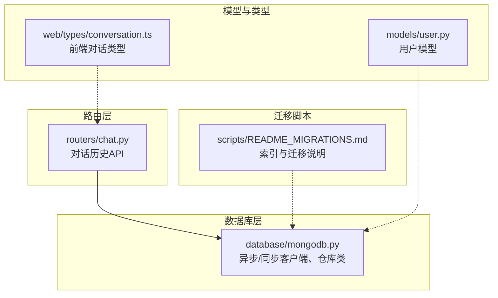
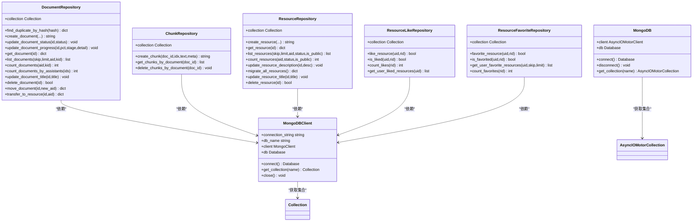
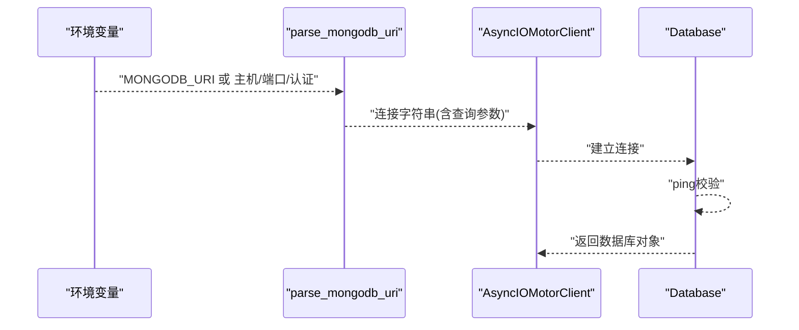
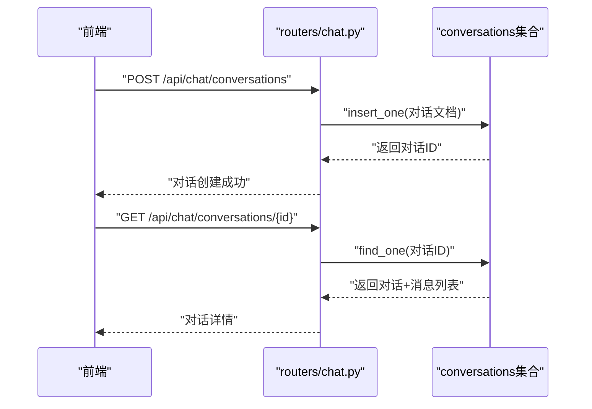
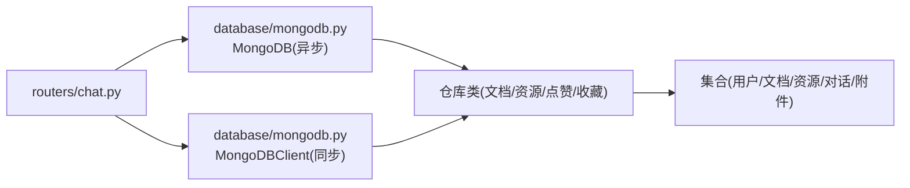

# MongoDB数据库设计

<cite>
**本文引用的文件**
- [database/mongodb.py](file://database/mongodb.py)
- [routers/chat.py](file://routers/chat.py)
- [scripts/README_MIGRATIONS.md](file://scripts/README_MIGRATIONS.md)
- [models/user.py](file://models/user.py)
- [web/types/conversation.ts](file://web/types/conversation.ts)
</cite>

## 目录
1. [简介](#简介)
2. [项目结构](#项目结构)
3. [核心组件](#核心组件)
4. [架构总览](#架构总览)
5. [详细组件分析](#详细组件分析)
6. [依赖关系分析](#依赖关系分析)
7. [性能考量](#性能考量)
8. [故障排查指南](#故障排查指南)
9. [结论](#结论)
10. [附录](#附录)

## 简介
本文件面向Advanced RAG项目的MongoDB数据库设计，围绕以下主题展开：
- 异步连接池配置与同步客户端设计
- 连接字符串解析与URI处理
- 数据库连接管理策略（连接池参数优化）
- 数据模型设计原则（集合命名规范、文档结构、字段类型）
- 用户数据、文档元数据、对话历史等核心集合设计
- 索引策略、查询优化与性能调优
- 错误处理机制、连接重试策略与故障恢复

## 项目结构
MongoDB相关代码集中在database子模块，配合路由层对对话历史进行读写，迁移脚本负责索引与模型版本迁移。

**图表来源**
- [database/mongodb.py](file://database/mongodb.py)
- [routers/chat.py](file://routers/chat.py)
- [scripts/README_MIGRATIONS.md](file://scripts/README_MIGRATIONS.md)
- [models/user.py](file://models/user.py)
- [web/types/conversation.ts](file://web/types/conversation.ts)

**章节来源**
- [database/mongodb.py](file://database/mongodb.py)
- [routers/chat.py](file://routers/chat.py)
- [scripts/README_MIGRATIONS.md](file://scripts/README_MIGRATIONS.md)

## 核心组件
- 异步MongoDB客户端：基于motor.motor_asyncio.AsyncIOMotorClient，提供连接池配置、连接建立与集合获取能力。
- 同步MongoDB客户端：基于pymongo.MongoClient，用于文档处理与批处理场景。
- 仓库类：DocumentRepository、ChunkRepository、ResourceRepository、ResourceLikeRepository、ResourceFavoriteRepository，封装集合操作与业务逻辑。
- 连接字符串解析：parse_mongodb_uri，支持从MONGODB_URI解析数据库名与连接参数，兼容认证与查询参数。
- 路由层集成：routers/chat.py对对话历史集合进行增删改查与流式响应。

**章节来源**
- [database/mongodb.py](file://database/mongodb.py)
- [routers/chat.py](file://routers/chat.py)

## 架构总览
下图展示异步客户端、同步客户端与仓库类之间的关系，以及与路由层的交互。

**图表来源**
- [database/mongodb.py](file://database/mongodb.py)

**章节来源**
- [database/mongodb.py](file://database/mongodb.py)

## 详细组件分析

### 异步连接池配置与URI处理
- 连接字符串解析：parse_mongodb_uri从MONGODB_URI中分离数据库名与连接参数，支持带/不带认证信息、保留原有查询参数。
- 连接池参数：maxPoolSize、minPoolSize、maxIdleTimeMS、serverSelectionTimeoutMS、connectTimeoutMS、socketTimeoutMS，均来自环境变量，统一注入到连接字符串查询参数中。
- 连接建立：AsyncIOMotorClient在连接后执行ping校验，确保连接可用；异常时清理client并抛出错误。

**图表来源**
- [database/mongodb.py](file://database/mongodb.py)

**章节来源**
- [database/mongodb.py](file://database/mongodb.py)

### 同步客户端设计（文档处理）
- 适用场景：文档解析、分块、向量化等批处理流程，使用pymongo.MongoClient。
- 连接策略：优先使用MONGODB_URI，其次使用MONGODB_HOST/MONGODB_PORT/MONGODB_USERNAME/MONGODB_PASSWORD/MONGODB_AUTH_SOURCE组合。
- 连接验证：执行ping命令与列举集合（降级处理权限不足）。

**章节来源**
- [database/mongodb.py](file://database/mongodb.py)

### 数据模型设计原则
- 集合命名规范：采用小写加下划线，如users、documents、chunks、resources、resource_likes、resource_favorites、conversations、course_assistants、conversation_attachments。
- 文档结构设计：遵循“最小必要字段+可扩展metadata”的原则；使用created_at/updated_at时间戳；状态字段status与进度字段progress_percentage便于追踪。
- 字段类型选择：字符串、整数、布尔、数组、嵌套对象；使用ObjectId作为主键类型；时间字段统一为datetime。

**章节来源**
- [database/mongodb.py](file://database/mongodb.py)
- [routers/chat.py](file://routers/chat.py)

### 用户数据集合（users）
- 用途：存储用户基本信息与认证相关字段。
- 设计要点：与models.user.py模型对应，字段包含基础信息、可见性设置、教育与工作经历等；可扩展metadata字段。
- 索引建议：用户名/邮箱唯一索引、角色/状态复合索引（迁移脚本中定义）。

**章节来源**
- [models/user.py](file://models/user.py)
- [database/mongodb.py](file://database/mongodb.py)

### 文档元数据集合（documents）
- 用途：记录上传文档的元信息、状态与处理进度。
- 关键字段：title、file_type、file_path、file_size、file_hash、metadata、assistant_id/knowledge_space_id、status、progress_percentage、current_stage、stage_details、created_at、updated_at。
- 业务能力：去重检查（file_hash）、状态与进度更新、标题更新、移动到其他助手、转为资源等。

**章节来源**
- [database/mongodb.py](file://database/mongodb.py)

### 分块集合（chunks）
- 用途：存储文档分块后的文本与元数据，便于向量化与检索。
- 关键字段：document_id、chunk_index、text、metadata、created_at。
- 业务能力：按文档ID查询块列表、批量删除。

**章节来源**
- [database/mongodb.py](file://database/mongodb.py)

### 资源集合（resources）
- 用途：资源社区共享的文档/链接，支持公开与状态管理。
- 版本迁移：schema_version字段与迁移逻辑，确保v1到v2的平滑升级。
- 关键字段：title、description、file_type、file_size、assistant_id、schema_version、created_at、updated_at、status、is_public、tags、uploader_id、thumbnail_url等。
- 业务能力：创建、查询、计数、描述/标题更新、删除、批量迁移。

**章节来源**
- [database/mongodb.py](file://database/mongodb.py)

### 资源点赞/收藏集合（resource_likes、resource_favorites）
- 用途：记录用户对资源的互动行为。
- 设计：联合索引(user_id, resource_id)，支持去重插入与快速查询。

**章节来源**
- [database/mongodb.py](file://database/mongodb.py)

### 对话历史集合（conversations）
- 用途：存储用户与助手的对话历史，支持消息流式输出。
- 文档结构：id、user_id、title、messages（包含message_id、role、content、timestamp、sources、recommended_resources）、assistant_id、created_at、updated_at。
- 路由集成：创建、列表、详情、追加消息、更新标题、删除、编辑用户消息、重新生成回答等。

**图表来源**
- [routers/chat.py](file://routers/chat.py)

**章节来源**
- [routers/chat.py](file://routers/chat.py)
- [web/types/conversation.ts](file://web/types/conversation.ts)

### 助手集合（course_assistants）
- 用途：课程/知识助手配置，支持默认助手查询。
- 路由集成：创建对话时可查询默认助手。

**章节来源**
- [routers/chat.py](file://routers/chat.py)

### 对话附件集合（conversation_attachments）
- 用途：跟踪对话附件上传与处理状态，与documents集合状态联动。
- 字段：file_id、conversation_id、document_id、knowledge_space_id、filename、file_path、file_size、file_type、status、progress_percentage、current_stage、stage_details、message、created_at、updated_at。

**章节来源**
- [routers/chat.py](file://routers/chat.py)

### 索引策略与查询优化
- 迁移脚本定义MongoDB索引：为用户、助手、文档、资源等集合创建必要索引，提升查询性能。
- 建议索引方向：按查询条件建立单列/复合索引；对高频过滤字段（如assistant_id、knowledge_space_id、status、is_public、file_hash）建立索引。
- 查询优化：使用投影、分页(skip/limit)、排序(created_at/updated_at)；避免全表扫描；对大文档采用分块存储与向量化（chunks + Qdrant）。

**章节来源**
- [scripts/README_MIGRATIONS.md](file://scripts/README_MIGRATIONS.md)
- [database/mongodb.py](file://database/mongodb.py)

## 依赖关系分析
- 路由层依赖异步MongoDB客户端获取集合，执行CRUD与聚合。
- 仓库类封装集合操作，隔离业务逻辑与数据访问。
- 同步客户端用于文档批处理，避免阻塞事件循环。
- 迁移脚本负责索引与模型版本迁移，保障线上一致性。

**图表来源**
- [database/mongodb.py](file://database/mongodb.py)
- [routers/chat.py](file://routers/chat.py)

**章节来源**
- [database/mongodb.py](file://database/mongodb.py)
- [routers/chat.py](file://routers/chat.py)

## 性能考量
- 连接池参数优化
  - maxPoolSize：每个worker最大连接数，建议根据并发与CPU核数设定（默认100）。
  - minPoolSize：保持最小连接数，降低冷启动延迟（默认10）。
  - maxIdleTimeMS：连接空闲超时（默认30秒），平衡内存占用与连接复用。
  - serverSelectionTimeoutMS、connectTimeoutMS、socketTimeoutMS：控制超时，避免长时间阻塞。
- 查询性能
  - 使用索引覆盖常见过滤字段（assistant_id、knowledge_space_id、status、is_public）。
  - 对大列表查询使用分页与投影，减少网络传输。
- 写入性能
  - 批量插入/更新时使用合适的批量大小，避免单次过大事务。
  - 对频繁更新的字段（updated_at）建立索引，加速排序与过滤。
- 异步与同步分离
  - API路由使用异步客户端，保证高并发下的非阻塞。
  - 文档批处理使用同步客户端，简化复杂事务与外部工具集成。

[本节为通用性能指导，不直接分析具体文件]

## 故障排查指南
- 连接失败
  - 检查MONGODB_URI或MONGODB_HOST/MONGODB_PORT配置是否正确。
  - 确认认证信息（用户名/密码/认证源）与数据库名解析。
  - Docker环境下使用host.docker.internal或127.0.0.1。
- 连接池问题
  - 调整maxPoolSize/minPoolSize/maxIdleTimeMS，观察连接复用与内存占用。
  - 监控serverSelectionTimeoutMS/connectTimeoutMS/socketTimeoutMS，避免超时导致的请求失败。
- 查询慢
  - 使用迁移脚本创建索引；对高频查询字段建立单列/复合索引。
  - 检查是否遗漏投影或分页。
- 数据不一致
  - 使用仓库类提供的原子更新接口（如状态/进度更新）。
  - 对资源迁移使用批量迁移脚本，记录迁移统计。

**章节来源**
- [database/mongodb.py](file://database/mongodb.py)
- [scripts/README_MIGRATIONS.md](file://scripts/README_MIGRATIONS.md)

## 结论
Advanced RAG的MongoDB设计通过异步/同步双客户端、完善的仓库类与路由集成，实现了高性能、可维护的文档与对话数据管理。结合迁移脚本与索引策略，系统在高并发与大规模数据场景下具备良好的扩展性与稳定性。

## 附录
- 环境变量参考
  - MONGODB_URI：完整连接字符串（推荐）
  - MONGODB_HOST/MONGODB_PORT/MONGODB_USERNAME/MONGODB_PASSWORD/MONGODB_AUTH_SOURCE：独立配置
  - MONGODB_DB_NAME：数据库名（默认advanced_rag）
  - MONGODB_MAX_POOL_SIZE/MONGODB_MIN_POOL_SIZE/MONGODB_MAX_IDLE_TIME_MS/MONGODB_SERVER_SELECTION_TIMEOUT_MS/MONGODB_CONNECT_TIMEOUT_MS/MONGODB_SOCKET_TIMEOUT_MS：连接池参数
- 迁移脚本
  - 001_create_mongodb_indexes：创建MongoDB索引
  - 002_create_neo4j_indexes：创建Neo4j索引
  - 003_migrate_user_model_fields：迁移用户模型字段

**章节来源**
- [database/mongodb.py](file://database/mongodb.py)
- [scripts/README_MIGRATIONS.md](file://scripts/README_MIGRATIONS.md)