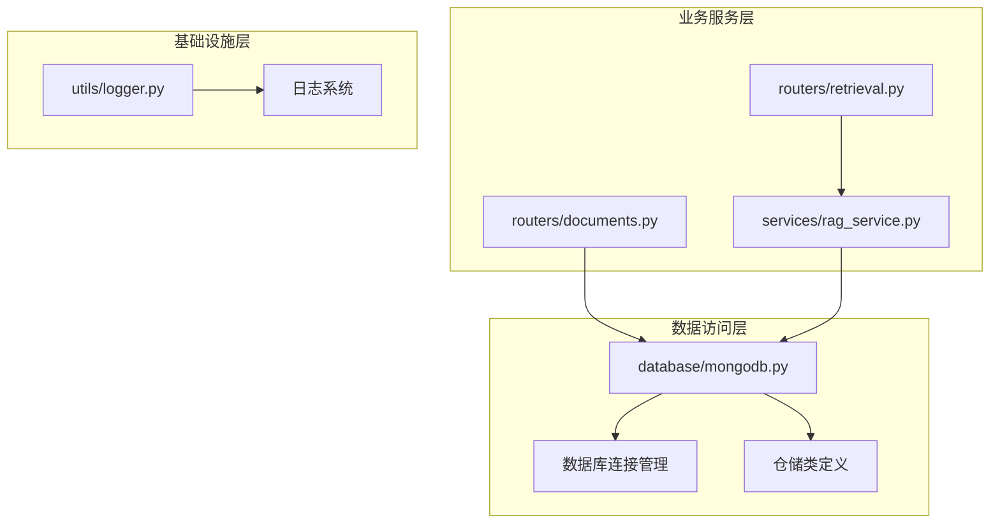
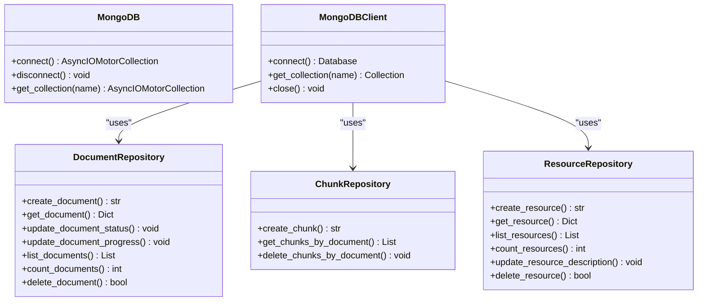
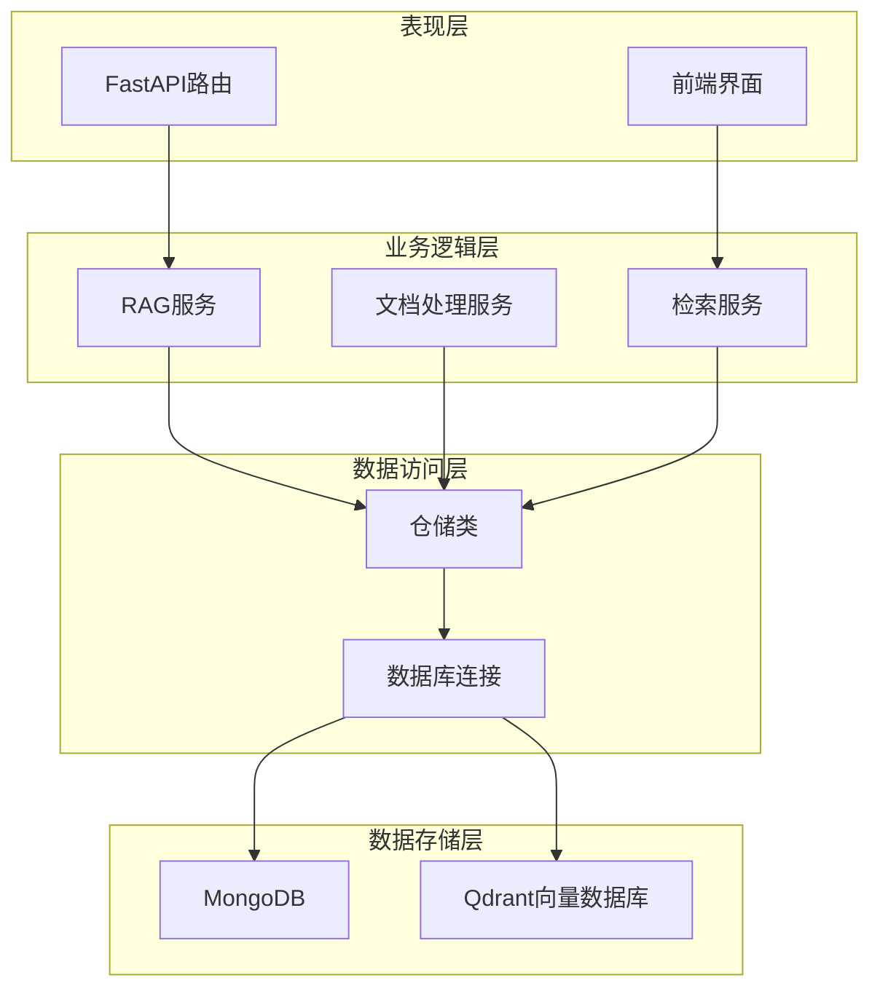
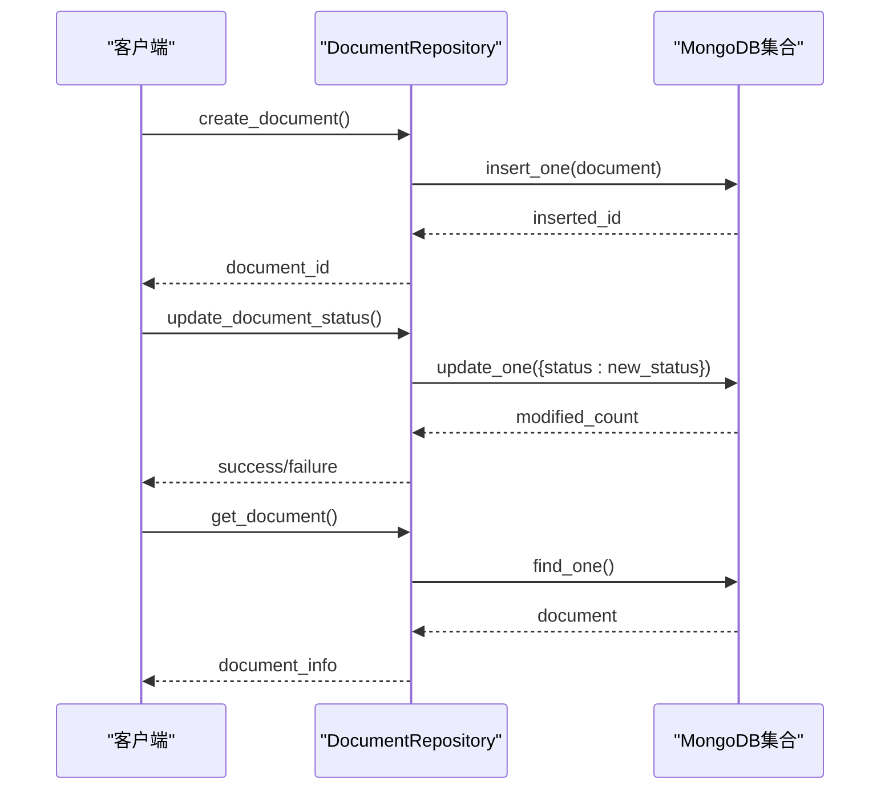
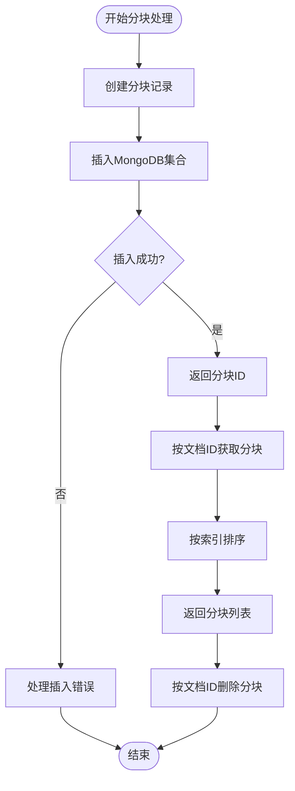
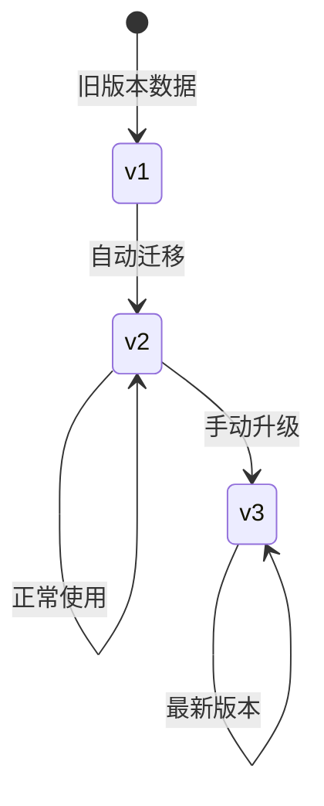
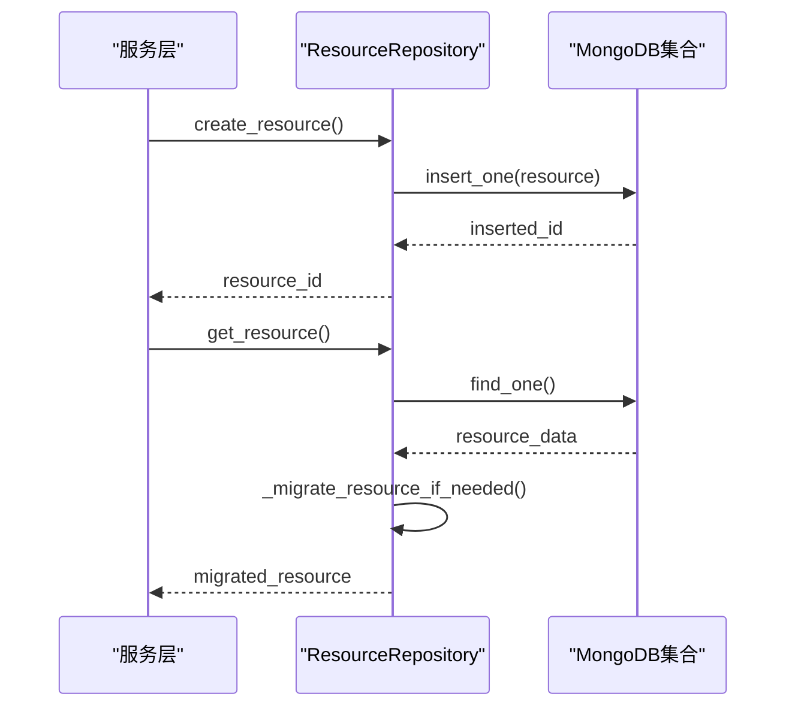
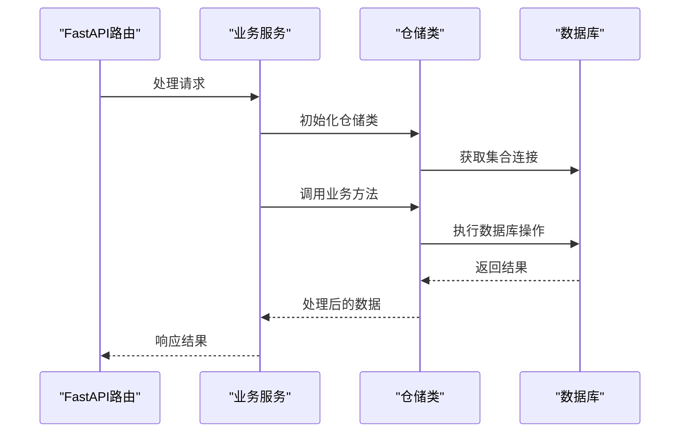
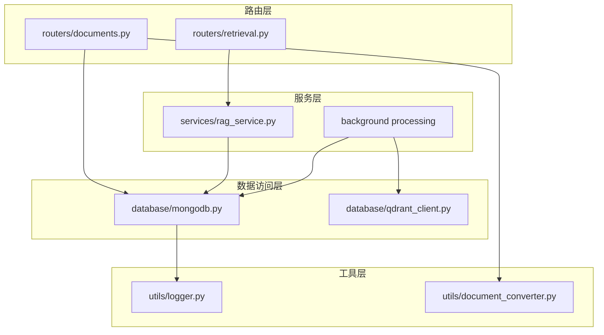

# 仓储模式实现

<cite>
**本文引用的文件**
- [database/mongodb.py](file://database/mongodb.py)
- [routers/documents.py](file://routers/documents.py)
- [routers/retrieval.py](file://routers/retrieval.py)
- [services/rag_service.py](file://services/rag_service.py)
- [utils/logger.py](file://utils/logger.py)
</cite>

## 目录
1. [简介](#简介)
2. [项目结构](#项目结构)
3. [核心组件](#核心组件)
4. [架构概览](#架构概览)
5. [详细组件分析](#详细组件分析)
6. [依赖关系分析](#依赖关系分析)
7. [性能考虑](#性能考虑)
8. [故障排除指南](#故障排除指南)
9. [结论](#结论)

## 简介

本文档深入分析了Advanced RAG项目中的仓储模式实现，重点介绍了DocumentRepository和ChunkRepository等仓储类的设计与实现。仓储模式作为一种重要的数据访问层抽象，通过将数据访问逻辑封装在专门的类中，实现了业务逻辑与数据持久化之间的解耦。

在本项目中，仓储模式主要应用于MongoDB数据库，提供了统一的数据访问接口，支持文档管理、分块处理、资源管理和用户交互等功能。通过仓储模式，开发者可以专注于业务逻辑的实现，而不需要关心底层数据库的具体操作细节。

## 项目结构

Advanced RAG项目采用模块化设计，仓储模式的实现分布在以下关键目录中：

**图表来源**
- [database/mongodb.py:1-1290](file://database/mongodb.py#L1-L1290)
- [routers/documents.py:1-800](file://routers/documents.py#L1-L800)
- [services/rag_service.py:1-248](file://services/rag_service.py#L1-L248)

**章节来源**
- [database/mongodb.py:1-1290](file://database/mongodb.py#L1-L1290)
- [routers/documents.py:1-800](file://routers/documents.py#L1-L800)
- [services/rag_service.py:1-248](file://services/rag_service.py#L1-L248)

## 核心组件

### MongoDB连接管理

项目实现了两种不同类型的MongoDB客户端，分别用于不同的使用场景：

1. **异步客户端（API服务使用）**：基于Motor库，适用于FastAPI路由处理
2. **同步客户端（文档处理使用）**：基于PyMongo库，适用于后台文档处理任务

这两种客户端都提供了统一的连接管理接口，支持环境变量配置、连接池优化和错误处理。

### 仓储类体系

项目实现了多个仓储类，每个类负责特定领域的数据访问：

**图表来源**
- [database/mongodb.py:92-195](file://database/mongodb.py#L92-L195)
- [database/mongodb.py:209-313](file://database/mongodb.py#L209-L313)
- [database/mongodb.py:315-768](file://database/mongodb.py#L315-L768)
- [database/mongodb.py:770-807](file://database/mongodb.py#L770-L807)
- [database/mongodb.py:809-1176](file://database/mongodb.py#L809-L1176)

**章节来源**
- [database/mongodb.py:92-195](file://database/mongodb.py#L92-L195)
- [database/mongodb.py:209-313](file://database/mongodb.py#L209-L313)
- [database/mongodb.py:315-768](file://database/mongodb.py#L315-L768)
- [database/mongodb.py:770-807](file://database/mongodb.py#L770-L807)
- [database/mongodb.py:809-1176](file://database/mongodb.py#L809-L1176)

## 架构概览

Advanced RAG项目的仓储模式架构体现了清晰的分层设计：

**图表来源**
- [routers/documents.py:1-800](file://routers/documents.py#L1-L800)
- [services/rag_service.py:1-248](file://services/rag_service.py#L1-L248)
- [database/mongodb.py:1-1290](file://database/mongodb.py#L1-L1290)

## 详细组件分析

### DocumentRepository - 文档元数据仓储

DocumentRepository是项目中最复杂的仓储类，负责文档生命周期的完整管理：

#### 核心功能特性

1. **文档状态管理**：支持文档处理状态的实时更新
2. **进度追踪**：提供详细的文档处理进度监控
3. **重复检测**：基于文件哈希的重复内容检测
4. **知识空间集成**：支持多知识空间的文档组织

#### CRUD操作实现

**图表来源**
- [database/mongodb.py:339-460](file://database/mongodb.py#L339-L460)
- [database/mongodb.py:462-596](file://database/mongodb.py#L462-L596)

#### 批量操作支持

DocumentRepository提供了多种批量操作能力：

- **统计查询**：支持按助手ID、知识空间ID等条件统计文档数量
- **列表查询**：支持分页查询和条件过滤
- **状态批量更新**：支持按条件批量更新文档状态

**章节来源**
- [database/mongodb.py:339-460](file://database/mongodb.py#L339-L460)
- [database/mongodb.py:462-596](file://database/mongodb.py#L462-L596)
- [database/mongodb.py:526-550](file://database/mongodb.py#L526-L550)
- [database/mongodb.py:479-524](file://database/mongodb.py#L479-L524)

### ChunkRepository - 文档分块仓储

ChunkRepository专门负责文档分块数据的管理：

#### 设计特点

1. **简单高效**：专注于分块数据的增删查操作
2. **批量删除**：支持按文档ID批量删除分块
3. **有序查询**：按分块索引顺序返回数据

#### 核心操作流程

**图表来源**
- [database/mongodb.py:776-806](file://database/mongodb.py#L776-L806)

**章节来源**
- [database/mongodb.py:770-807](file://database/mongodb.py#L770-L807)

### ResourceRepository - 资源仓储

ResourceRepository负责资源数据的管理，支持版本迁移和自动兼容：

#### 版本管理机制

#### 资源操作流程

**图表来源**
- [database/mongodb.py:818-865](file://database/mongodb.py#L818-L865)
- [database/mongodb.py:867-883](file://database/mongodb.py#L867-L883)
- [database/mongodb.py:885-948](file://database/mongodb.py#L885-L948)

**章节来源**
- [database/mongodb.py:809-1176](file://database/mongodb.py#L809-L1176)

### 仓储类使用模式

仓储类在项目中的使用遵循统一的模式：

**图表来源**
- [routers/documents.py:31-45](file://routers/documents.py#L31-L45)
- [services/rag_service.py:105-131](file://services/rag_service.py#L105-L131)

**章节来源**
- [routers/documents.py:31-45](file://routers/documents.py#L31-L45)
- [services/rag_service.py:105-131](file://services/rag_service.py#L105-L131)

## 依赖关系分析

### 组件间依赖关系

**图表来源**
- [routers/documents.py:1-800](file://routers/documents.py#L1-L800)
- [routers/retrieval.py:1-135](file://routers/retrieval.py#L1-L135)
- [services/rag_service.py:1-248](file://services/rag_service.py#L1-L248)
- [database/mongodb.py:1-1290](file://database/mongodb.py#L1-L1290)

### 仓储类依赖分析

仓储类之间存在明确的职责分离：

- **DocumentRepository**：独立管理，依赖MongoDBClient
- **ChunkRepository**：依赖DocumentRepository进行数据关联
- **ResourceRepository**：独立管理，提供版本兼容性
- **辅助仓储**：ResourceLikeRepository、ResourceFavoriteRepository等

**章节来源**
- [database/mongodb.py:1-1290](file://database/mongodb.py#L1-L1290)

## 性能考虑

### 连接池优化

项目实现了智能的连接池配置，支持高并发场景：

- **最大连接数**：可配置的连接池大小
- **最小连接数**：保持活跃的连接数量
- **连接超时**：合理的连接和Socket超时设置
- **空闲连接回收**：定期清理长时间空闲的连接

### 查询优化策略

1. **索引使用**：在常用查询字段上建立适当的索引
2. **投影优化**：只返回需要的字段，减少网络传输
3. **分页处理**：支持大规模数据的分页查询
4. **批量操作**：提供批量插入和更新操作

### 异步处理

- **异步MongoDB客户端**：用于API响应的快速处理
- **同步MongoDB客户端**：用于后台文档处理的稳定性
- **线程池管理**：合理分配CPU密集型任务

## 故障排除指南

### 常见问题及解决方案

#### 数据库连接问题

**症状**：仓储类初始化失败或查询超时

**诊断步骤**：
1. 检查环境变量配置
2. 验证MongoDB服务状态
3. 查看连接池配置

**解决方案**：
- 确认MONGODB_URI或单独的连接参数配置正确
- 检查防火墙和网络连接
- 调整连接池大小和超时参数

#### 数据一致性问题

**症状**：数据更新后查询结果不一致

**诊断步骤**：
1. 检查事务支持情况
2. 验证写入确认机制
3. 查看并发访问冲突

**解决方案**：
- 使用适当的查询一致性级别
- 实现重试机制
- 优化并发控制策略

#### 性能问题

**症状**：查询响应缓慢或内存占用过高

**诊断步骤**：
1. 分析查询执行计划
2. 检查索引使用情况
3. 监控连接池状态

**解决方案**：
- 优化查询条件和索引
- 实现分页和限制返回数量
- 调整连接池配置

**章节来源**
- [utils/logger.py:15-88](file://utils/logger.py#L15-L88)

## 结论

Advanced RAG项目中的仓储模式实现展现了现代Web应用的最佳实践：

### 主要优势

1. **清晰的职责分离**：每个仓储类专注于特定领域的数据访问
2. **统一的接口设计**：提供一致的CRUD操作接口
3. **良好的扩展性**：支持自定义查询和业务逻辑扩展
4. **完善的错误处理**：提供全面的异常处理和日志记录

### 技术亮点

1. **双客户端架构**：满足不同场景下的性能需求
2. **版本兼容性**：支持数据结构的平滑演进
3. **异步处理**：充分利用异步I/O提升性能
4. **连接池优化**：合理配置连接资源

### 改进建议

1. **事务支持**：考虑在需要的地方实现事务处理
2. **缓存策略**：实现适当的缓存机制提升查询性能
3. **监控指标**：添加更详细的性能监控和告警
4. **测试覆盖**：完善单元测试和集成测试

通过仓储模式的有效实现，Advanced RAG项目建立了稳定可靠的数据访问层，为上层业务逻辑提供了坚实的基础。