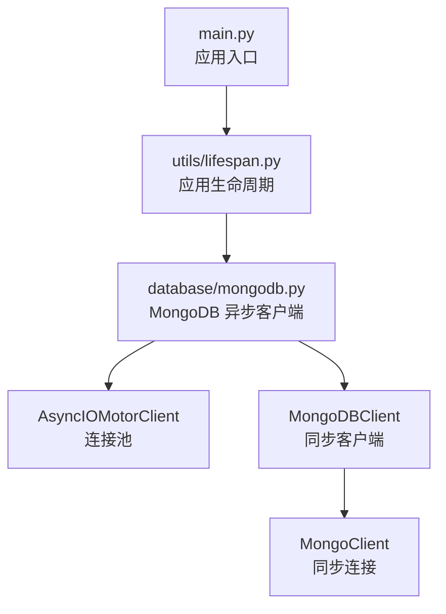
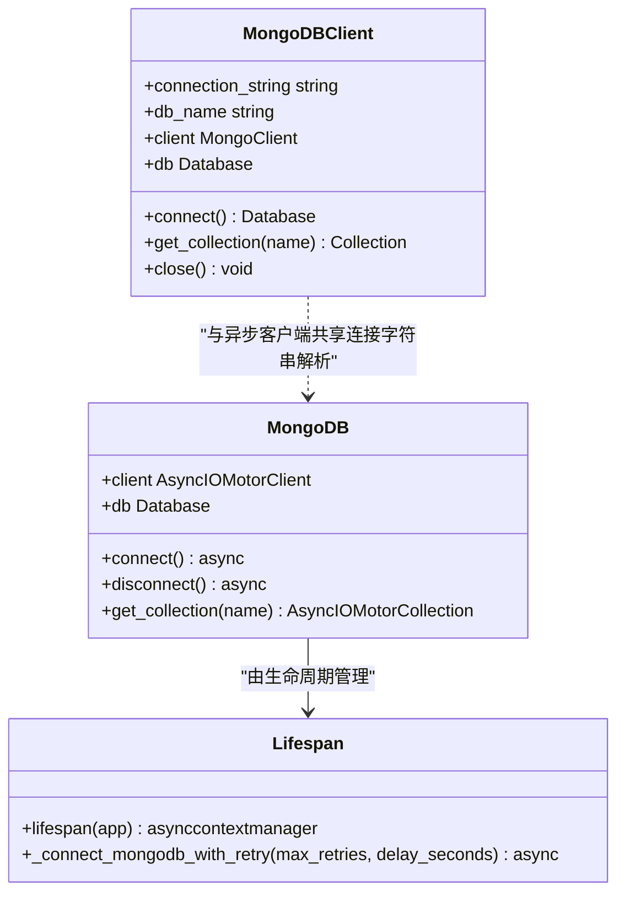
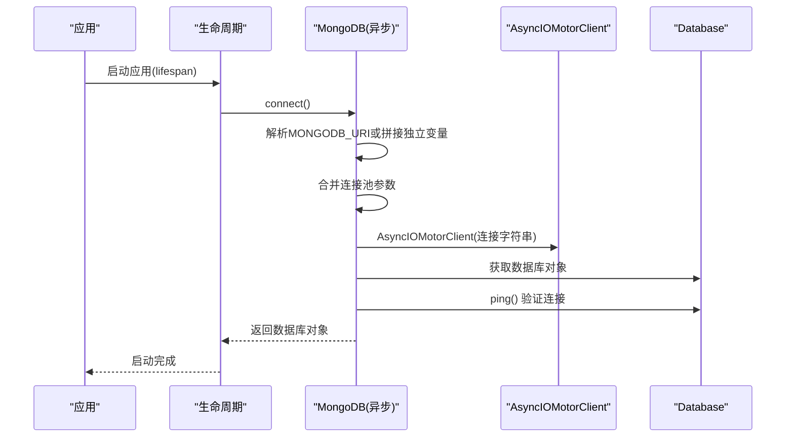
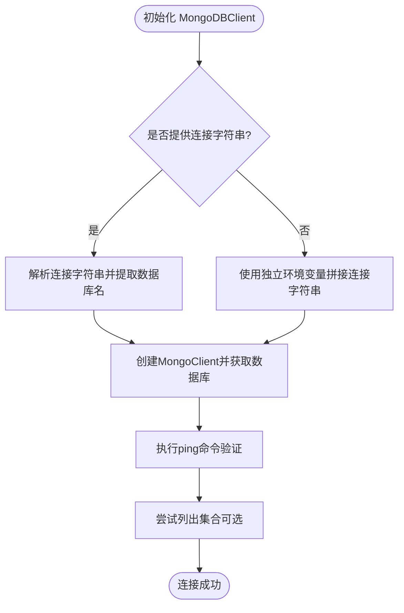
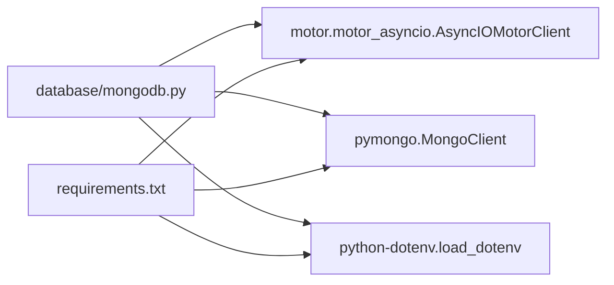

# 数据库连接管理

<cite>
**本文引用的文件**
- [database/mongodb.py](file://database/mongodb.py)
- [utils/lifespan.py](file://utils/lifespan.py)
- [main.py](file://main.py)
- [requirements.txt](file://requirements.txt)
- [database/neo4j_client.py](file://database/neo4j_client.py)
- [database/qdrant_client.py](file://database/qdrant_client.py)
</cite>

## 目录
1. [简介](#简介)
2. [项目结构](#项目结构)
3. [核心组件](#核心组件)
4. [架构总览](#架构总览)
5. [详细组件分析](#详细组件分析)
6. [依赖关系分析](#依赖关系分析)
7. [性能考量](#性能考量)
8. [故障排查指南](#故障排查指南)
9. [结论](#结论)

## 简介
本文件系统化阐述本项目的数据库连接管理，重点覆盖：
- MongoDB 异步连接池配置与使用（AsyncIOMotorClient）
- 连接字符串解析与 URI 处理机制
- 同步 MongoDB 客户端（MongoDBClient）的设计理念与使用场景
- 连接池参数配置详解与调优策略
- 连接建立、验证与断开流程
- 错误处理、重试策略与故障恢复方案

## 项目结构
数据库相关的核心实现集中在 database/mongodb.py，配合 FastAPI 应用生命周期管理 utils/lifespan.py，以及主入口 main.py 的环境变量加载与应用启动。

图表来源
- [main.py:55-60](file://main.py#L55-L60)
- [utils/lifespan.py:26-88](file://utils/lifespan.py#L26-L88)
- [database/mongodb.py:92-196](file://database/mongodb.py#L92-L196)

章节来源
- [main.py:1-157](file://main.py#L1-L157)
- [utils/lifespan.py:1-88](file://utils/lifespan.py#L1-L88)
- [database/mongodb.py:1-1290](file://database/mongodb.py#L1-L1290)

## 核心组件
- 异步 MongoDB 客户端：封装 AsyncIOMotorClient，负责高并发下的连接池管理与数据库操作。
- 同步 MongoDB 客户端：封装 MongoClient，用于文档处理等同步任务。
- 连接字符串解析器：统一解析 MONGODB_URI 或拆分的环境变量，生成连接字符串与数据库名。
- 应用生命周期管理：在应用启动时建立连接，在关闭时释放连接。

章节来源
- [database/mongodb.py:92-196](file://database/mongodb.py#L92-L196)
- [database/mongodb.py:209-313](file://database/mongodb.py#L209-L313)
- [database/mongodb.py:39-89](file://database/mongodb.py#L39-L89)
- [utils/lifespan.py:26-88](file://utils/lifespan.py#L26-L88)

## 架构总览
异步与同步客户端并存，分别服务于不同场景：
- 异步客户端：API 服务在 FastAPI 生命周期中建立连接，适合高并发请求。
- 同步客户端：文档解析、分块等 CPU 密集型任务，避免阻塞事件循环。

图表来源
- [database/mongodb.py:92-196](file://database/mongodb.py#L92-L196)
- [database/mongodb.py:209-313](file://database/mongodb.py#L209-L313)
- [utils/lifespan.py:26-88](file://utils/lifespan.py#L26-L88)

## 详细组件分析

### 异步 MongoDB 客户端（AsyncIOMotorClient）
- 初始化与连接建立
  - 优先读取 MONGODB_URI 环境变量；若为空，则使用 MONGODB_HOST/MONGODB_PORT/MONGODB_USERNAME/MONGODB_PASSWORD/MONGODB_AUTH_SOURCE/MONGODB_DB_NAME 等独立变量拼接连接字符串。
  - 连接池参数通过环境变量注入，包括 maxPoolSize、minPoolSize、maxIdleTimeMS、serverSelectionTimeoutMS、connectTimeoutMS、socketTimeoutMS。
  - 若连接字符串本身已包含查询参数，会与连接池参数合并，避免覆盖。
  - 建立连接后执行 ping 命令进行可用性验证。
- 断开连接
  - 提供 disconnect 方法，关闭底层连接。
- 集合获取
  - 通过 get_collection 获取集合对象，未连接时抛出明确错误。

图表来源
- [utils/lifespan.py:26-31](file://utils/lifespan.py#L26-L31)
- [database/mongodb.py:99-184](file://database/mongodb.py#L99-L184)

章节来源
- [database/mongodb.py:92-196](file://database/mongodb.py#L92-L196)
- [utils/lifespan.py:8-24](file://utils/lifespan.py#L8-L24)

### 同步 MongoDB 客户端（MongoDBClient）
- 设计理念
  - 专用于文档处理、分块等同步任务，避免在异步上下文中阻塞事件循环。
  - 与异步客户端共享连接字符串解析逻辑，确保一致性。
- 连接建立与验证
  - 连接前对连接字符串进行脱敏日志输出，保护敏感信息。
  - 建立连接后执行 ping 命令验证，同时尝试列出集合（权限不足时不中断）。
- 使用场景
  - 文档元数据仓库（DocumentRepository）、分块仓库（ChunkRepository）等同步操作。

图表来源
- [database/mongodb.py:209-313](file://database/mongodb.py#L209-L313)

章节来源
- [database/mongodb.py:209-313](file://database/mongodb.py#L209-L313)

### 连接字符串解析与 URI 处理
- 解析逻辑
  - 使用 urllib.parse 解析 MONGODB_URI，提取 scheme、hostname、port、username、password、path、query 等组件。
  - 从路径中提取数据库名；若为空则回退到 MONGODB_DB_NAME 或默认值。
  - 构造不含数据库名的连接字符串，保留认证信息与查询参数。
- 合并与注入
  - 若连接字符串已包含查询参数，解析后与连接池参数合并；否则直接追加。
  - 连接池参数键值来自环境变量，确保在不同部署环境下灵活调整。

章节来源
- [database/mongodb.py:39-89](file://database/mongodb.py#L39-L89)
- [database/mongodb.py:129-150](file://database/mongodb.py#L129-L150)

### 连接池参数配置与调优策略
- 参数清单与作用
  - maxPoolSize：每个 worker 的最大连接数，建议在高并发下设置为 100-200。
  - minPoolSize：最小连接池大小，保持一定数量的连接以降低冷启动开销。
  - maxIdleTimeMS：连接空闲超时时间，建议 30000ms，平衡资源占用与连接复用。
  - serverSelectionTimeoutMS：服务器选择超时，建议 5000ms，避免长时间等待。
  - connectTimeoutMS：连接超时，建议 10000ms，保证网络波动下的稳定性。
  - socketTimeoutMS：socket 超时，建议 30000ms，适配长查询或大响应。
- 调优建议
  - 生产环境：结合 UVICORN_WORKERS 数量与数据库承载能力，合理设置 maxPoolSize 与 minPoolSize。
  - 容器环境：注意 host.docker.internal 与 localhost 的映射，避免连接失败。
  - 日志与监控：通过连接池参数与 ping 验证，结合日志定位连接问题。

章节来源
- [database/mongodb.py:122-136](file://database/mongodb.py#L122-L136)
- [database/mongodb.py:154-184](file://database/mongodb.py#L154-L184)

### 连接建立、验证与断开流程
- 建立连接
  - 读取环境变量，解析或拼接连接字符串，注入连接池参数，创建 AsyncIOMotorClient。
- 验证连接
  - 通过数据库命令 ping 验证可用性；失败时记录详细提示并抛出异常。
- 断开连接
  - 应用关闭时调用 disconnect，确保连接池资源回收。

章节来源
- [database/mongodb.py:99-184](file://database/mongodb.py#L99-L184)
- [utils/lifespan.py:82-87](file://utils/lifespan.py#L82-L87)

### 错误处理机制、重试策略与故障恢复
- 异常捕获与提示
  - 连接失败时记录错误与提示信息，包含常见排查要点（服务状态、环境变量、Docker 映射）。
- 启动重试
  - 应用启动时提供带重试的连接函数，指数退避重试，提升启动成功率。
- 故障恢复
  - 连接失败后主动关闭客户端并清理状态，避免悬挂连接。
  - 对于依赖服务（如 Qdrant），提供健康检查与自动降级策略（如 gRPC 优先、重试与回退）。

章节来源
- [database/mongodb.py:168-184](file://database/mongodb.py#L168-L184)
- [utils/lifespan.py:8-24](file://utils/lifespan.py#L8-L24)

## 依赖关系分析
- 依赖库
  - motor：异步 MongoDB 驱动，提供 AsyncIOMotorClient。
  - pymongo：同步 MongoDB 驱动，提供 MongoClient。
  - python-dotenv：加载 .env 文件，支持多层级路径查找。
- 版本要求
  - requirements.txt 中声明了 motor、pymongo、python-dotenv 等依赖版本范围。

图表来源
- [database/mongodb.py:1-10](file://database/mongodb.py#L1-L10)
- [requirements.txt:9-17](file://requirements.txt#L9-L17)

章节来源
- [requirements.txt:1-38](file://requirements.txt#L1-L38)
- [database/mongodb.py:1-10](file://database/mongodb.py#L1-L10)

## 性能考量
- 连接池参数
  - 合理设置 maxPoolSize 与 minPoolSize，避免连接过多导致数据库压力过大或过少导致频繁创建连接。
  - maxIdleTimeMS 控制空闲连接回收，减少资源占用。
- 并发与工作进程
  - 结合 UVICORN_WORKERS 数量与数据库承载能力，避免连接池参数与工作进程冲突。
- 连接复用与协议
  - 在其他数据库客户端中采用 gRPC 优先策略（如 Qdrant），提升连接复用与性能稳定性。

章节来源
- [database/mongodb.py:122-136](file://database/mongodb.py#L122-L136)
- [main.py:139-157](file://main.py#L139-L157)

## 故障排查指南
- 常见问题与定位
  - 环境变量未正确加载：检查 .env 文件路径与加载顺序，确认 MONGODB_URI 或独立变量配置。
  - Docker 环境映射：确认 localhost 与 host.docker.internal 的映射关系。
  - 权限不足：ping 验证可能需要相应权限，列出集合可能需要额外权限。
- 启动失败
  - 使用带重试的连接函数，观察日志中的错误与提示，逐步排查网络、认证与配置问题。
- 运行期异常
  - 记录异常堆栈与上下文，结合连接池参数与数据库负载评估问题范围。

章节来源
- [database/mongodb.py:168-184](file://database/mongodb.py#L168-L184)
- [utils/lifespan.py:8-24](file://utils/lifespan.py#L8-L24)

## 结论
本项目的数据库连接管理通过异步与同步客户端分离设计，实现了高并发 API 服务与同步任务的均衡处理。连接字符串解析与连接池参数配置提供了灵活的部署适配能力；生命周期管理与重试机制保障了启动阶段的稳定性；完善的错误处理与日志输出便于问题定位与故障恢复。建议在生产环境中结合实际负载与数据库能力，持续优化连接池参数与工作进程配置，确保系统稳定高效运行。