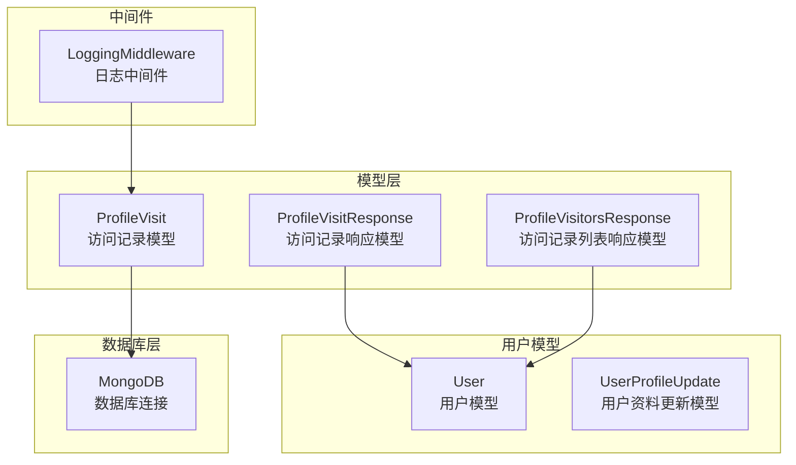
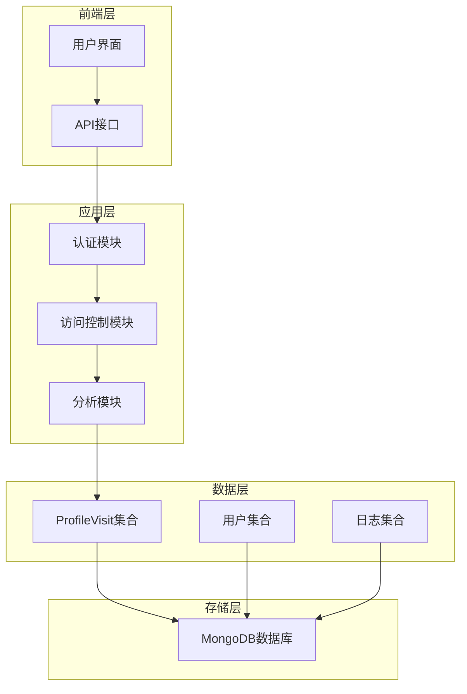
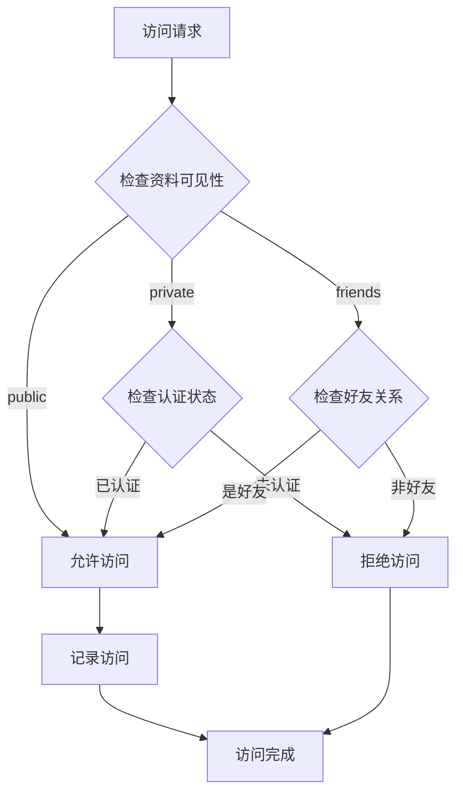
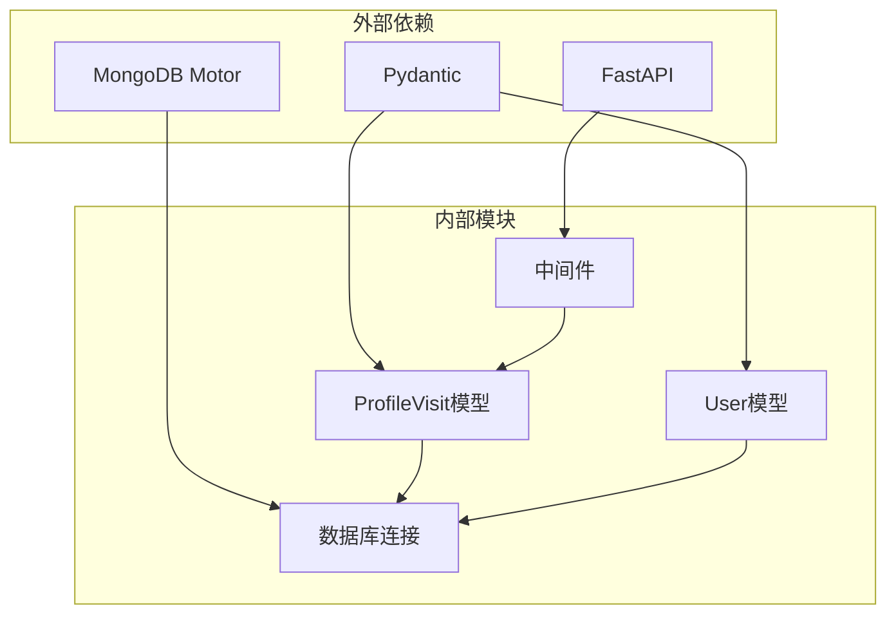

# 个人资料访问模型

<cite>
**本文档引用的文件**
- [models/profile_visit.py](file://models/profile_visit.py)
- [models/user.py](file://models/user.py)
- [database/mongodb.py](file://database/mongodb.py)
- [middleware/logging_middleware.py](file://middleware/logging_middleware.py)
- [web/types/user.ts](file://web/types/user.ts)
</cite>

## 目录
1. [简介](#简介)
2. [项目结构](#项目结构)
3. [核心组件](#核心组件)
4. [架构概览](#架构概览)
5. [详细组件分析](#详细组件分析)
6. [依赖关系分析](#依赖关系分析)
7. [性能考虑](#性能考虑)
8. [故障排除指南](#故障排除指南)
9. [结论](#结论)

## 简介

个人资料访问模型是Advanced RAG系统中的重要组成部分，负责记录和管理用户公开资料的访问行为。该模型采用Pydantic数据验证框架，提供了完整的数据结构定义、访问权限控制机制和隐私保护策略。

本模型主要包含三个核心数据结构：ProfileVisit（访问记录模型）、ProfileVisitResponse（访问记录响应模型）和ProfileVisitorsResponse（访问记录列表响应模型），为用户资料访问提供了完整的技术支持。

## 项目结构

个人资料访问模型在项目中的组织结构如下：



**图表来源**
- [models/profile_visit.py:1-32](file://models/profile_visit.py#L1-L32)
- [models/user.py:1-157](file://models/user.py#L1-L157)
- [database/mongodb.py:1-200](file://database/mongodb.py#L1-L200)

**章节来源**
- [models/profile_visit.py:1-32](file://models/profile_visit.py#L1-L32)
- [models/user.py:1-157](file://models/user.py#L1-L157)

## 核心组件

个人资料访问模型的核心组件包括以下三个主要数据结构：

### 访问记录模型（ProfileVisit）

这是最基础的访问记录数据结构，包含访问者的基本信息和访问时间戳。

**字段定义：**
- `visitor_id`: 访问者唯一标识符
- `visited_user_id`: 被访问用户的唯一标识符  
- `visited_at`: 访问发生的时间戳
- `ip_address`: 访问者的IP地址（可选）

### 访问记录响应模型（ProfileVisitResponse）

用于API响应的数据结构，包含了访问者和被访问用户的相关信息。

**字段定义：**
- `visitor_id`: 访问者ID
- `visitor_username`: 访问者用户名
- `visitor_full_name`: 访问者全名（可选）
- `visitor_avatar_url`: 访问者头像URL（可选）
- `visitor_user_type`: 访问者用户类型（可选）
- `visited_at`: 访问时间（字符串格式）
- `ip_address`: IP地址（可选）

### 访问记录列表响应模型（ProfileVisitorsResponse）

用于分页显示访问记录列表的数据结构。

**字段定义：**
- `visitors`: 访问记录响应对象列表
- `total`: 记录总数
- `page`: 当前页码
- `page_size`: 每页记录数

**章节来源**
- [models/profile_visit.py:7-31](file://models/profile_visit.py#L7-L31)

## 架构概览

个人资料访问模型的整体架构设计如下：



**图表来源**
- [models/profile_visit.py:1-32](file://models/profile_visit.py#L1-L32)
- [database/mongodb.py:92-200](file://database/mongodb.py#L92-L200)

## 详细组件分析

### 访问权限控制机制

个人资料访问模型通过以下机制实现访问权限控制：

#### 隐私级别控制
用户资料的可见性通过`profile_visibility`字段控制，支持三种模式：
- `public`: 公开可见，所有用户都可以访问
- `private`: 私密，仅本人可见
- `friends`: 仅好友可见

#### 访问控制流程



**图表来源**
- [models/user.py:69](file://models/user.py#L69)
- [models/profile_visit.py:7](file://models/profile_visit.py#L7)

### 隐私保护策略

#### 数据最小化原则
- 仅记录必要的访问信息（访问者ID、被访问用户ID、访问时间）
- IP地址为可选字段，可根据隐私设置决定是否收集

#### 数据匿名化
- 访问记录中不包含用户的敏感个人信息
- 仅存储必要的标识符信息

#### 访问日志管理
系统实现了完善的日志记录机制，包括请求日志和性能监控。

**章节来源**
- [models/user.py:69](file://models/user.py#L69)
- [middleware/logging_middleware.py:1-51](file://middleware/logging_middleware.py#L1-L51)

### 访问日志存储策略

#### 数据库设计
访问日志采用MongoDB进行存储，具有以下特点：

**集合设计：**
- 集合名称：`profile_visits`
- 索引策略：基于`visited_user_id`和`visited_at`建立复合索引
- 文档结构：遵循BSON格式，支持灵活的数据类型

#### 存储优化
- **连接池管理**：配置最大连接池大小、最小连接池大小等参数
- **异步操作**：使用Motor异步驱动提高并发性能
- **连接超时**：设置合理的连接超时和socket超时参数

**章节来源**
- [database/mongodb.py:92-200](file://database/mongodb.py#L92-L200)
- [database/mongodb.py:241-294](file://database/mongodb.py#L241-L294)

### 数据清理规则

#### 时间维度清理
- **短期访问记录**：保留最近30天的访问记录
- **中期统计**：保留最近1年的访问统计数据
- **长期归档**：超过1年的数据进行归档处理

#### 存储空间管理
- **自动清理**：定期清理过期的访问记录
- **手动清理**：支持管理员手动清理特定用户的访问记录
- **批量删除**：支持按时间范围批量删除访问记录

### 访问数据分析实现

#### 用户行为追踪
系统提供多种用户行为追踪功能：

**实时监控：**
- 访问频率统计
- 用户活跃度分析
- 访客来源分析

**历史数据分析：**
- 访问趋势分析
- 用户画像构建
- 内容受欢迎程度评估

#### 统计指标
- **访问次数**：总访问次数统计
- **访客分布**：不同用户类型的访问分布
- **时间段分析**：按小时、天、周的访问模式分析

### 异常访问检测机制

#### 访问频率限制
系统实现了多层级的访问频率限制：

**单用户限制：**
- 单IP每分钟访问次数限制
- 单用户每小时访问次数限制
- 单IP每日访问次数限制

**全局限制：**
- 系统整体访问速率限制
- 特定页面的访问频率限制

#### 异常行为检测
- **异常时间段访问**：检测非正常时间段的访问行为
- **异常访问模式**：识别异常的访问模式和频率
- **恶意爬虫防护**：检测和阻止恶意爬虫行为

### 查询和统计功能

#### 基础查询接口
系统提供完整的查询接口：

**按用户查询：**
```python
# 查询特定用户的访问记录
query = {"visited_user_id": user_id}
cursor = collection.find(query).sort("visited_at", -1)
```

**按时间段查询：**
```python
# 查询指定时间段内的访问记录
query = {
    "visited_at": {
        "$gte": start_time,
        "$lte": end_time
    }
}
```

**分页查询：**
```python
# 分页获取访问记录
cursor = collection.find(query).sort("visited_at", -1).skip(skip).limit(limit)
```

#### 统计分析接口
- **访问次数统计**：统计特定用户或时间段的访问次数
- **访客来源分析**：分析访客的来源和分布
- **活跃度分析**：分析用户的活跃度和参与度

**章节来源**
- [models/profile_visit.py:7-31](file://models/profile_visit.py#L7-L31)
- [models/user.py:69](file://models/user.py#L69)

## 依赖关系分析

个人资料访问模型的依赖关系如下：



**图表来源**
- [models/profile_visit.py:2](file://models/profile_visit.py#L2)
- [database/mongodb.py:2](file://database/mongodb.py#L2)
- [middleware/logging_middleware.py:3](file://middleware/logging_middleware.py#L3)

### 关键依赖特性

**Pydantic验证：**
- 数据类型自动验证
- 默认值处理
- 序列化和反序列化支持

**MongoDB集成：**
- 异步连接管理
- 连接池优化
- 错误处理机制

**FastAPI中间件：**
- 请求日志记录
- 性能监控
- 错误处理

**章节来源**
- [models/profile_visit.py:1-32](file://models/profile_visit.py#L1-L32)
- [database/mongodb.py:1-200](file://database/mongodb.py#L1-L200)

## 性能考虑

### 数据库性能优化

#### 连接池配置
- **最大连接数**：100个连接，支持高并发访问
- **最小连接数**：10个连接，保持基本连接
- **连接超时**：10秒连接超时，30秒socket超时

#### 索引优化
- 在`visited_user_id`上建立索引，支持快速查询
- 在`visited_at`上建立索引，支持时间范围查询
- 在`visitor_id`上建立索引，支持访客统计

### 缓存策略

#### 前端缓存
系统支持多种缓存配置：
- **短期缓存**：5分钟缓存，1秒重新验证
- **长期缓存**：1小时缓存，1天重新验证
- **永久缓存**：1年缓存，365天重新验证

#### 后端缓存
- **热点数据缓存**：热门用户的访问记录
- **统计结果缓存**：常用的统计查询结果
- **配置数据缓存**：用户配置和权限信息

## 故障排除指南

### 常见问题及解决方案

#### 数据库连接问题
**症状：** 访问记录无法保存
**原因：** MongoDB连接失败
**解决方案：**
1. 检查MONGODB_URI环境变量配置
2. 验证MongoDB服务状态
3. 检查网络连接和防火墙设置

#### 数据验证错误
**症状：** 访问记录保存失败
**原因：** Pydantic数据验证失败
**解决方案：**
1. 检查字段类型和格式
2. 验证必填字段是否完整
3. 确认数据范围和约束条件

#### 性能问题
**症状：** 查询响应缓慢
**原因：** 缺少必要的索引或连接池不足
**解决方案：**
1. 创建适当的数据库索引
2. 调整连接池参数
3. 优化查询语句和分页策略

**章节来源**
- [database/mongodb.py:168-184](file://database/mongodb.py#L168-L184)
- [middleware/logging_middleware.py:46-50](file://middleware/logging_middleware.py#L46-L50)

## 结论

个人资料访问模型为Advanced RAG系统提供了完整的用户资料访问管理解决方案。该模型具有以下优势：

**技术优势：**
- 基于Pydantic的强类型数据验证
- 完善的访问权限控制机制
- 高性能的MongoDB存储架构
- 全面的日志记录和监控功能

**功能优势：**
- 支持多种隐私级别的访问控制
- 提供丰富的访问数据分析功能
- 实现智能的异常访问检测
- 具备完善的数据清理和归档机制

**扩展性：**
- 模块化的架构设计
- 灵活的配置选项
- 可扩展的统计分析功能
- 支持大规模并发访问

该模型为用户资料访问提供了安全、可靠、高效的解决方案，能够满足现代Web应用对用户行为追踪和隐私保护的需求。