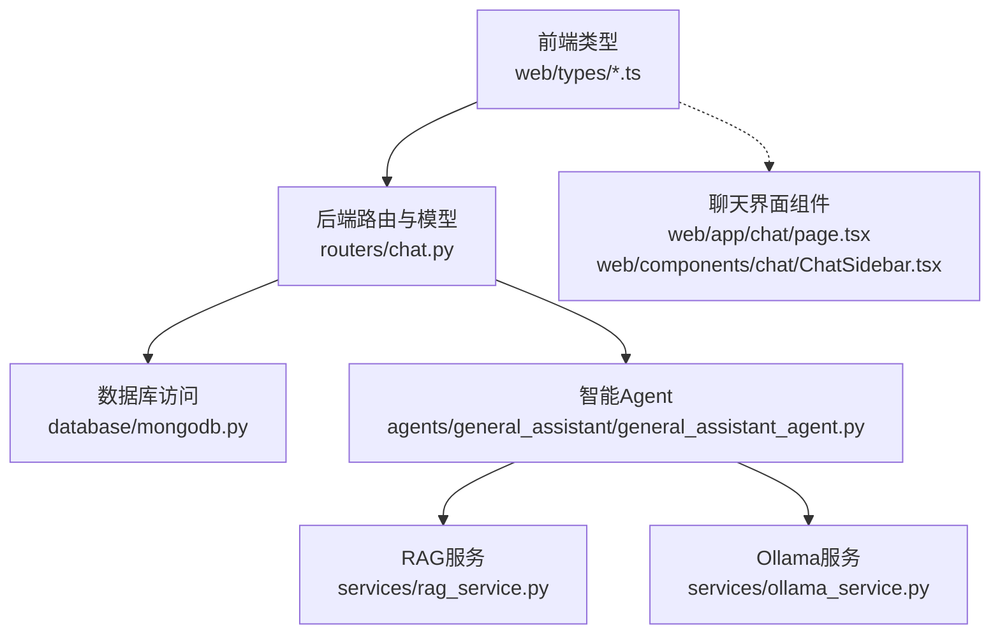
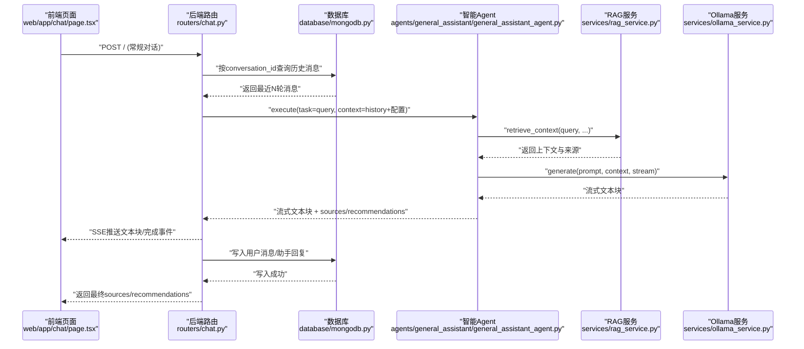
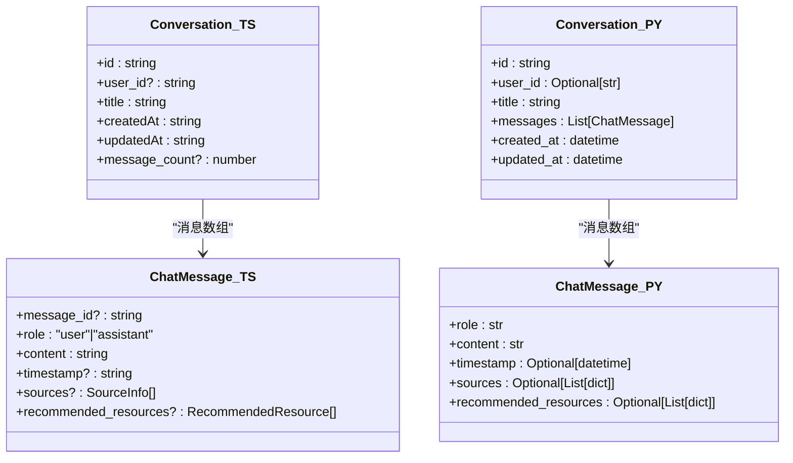
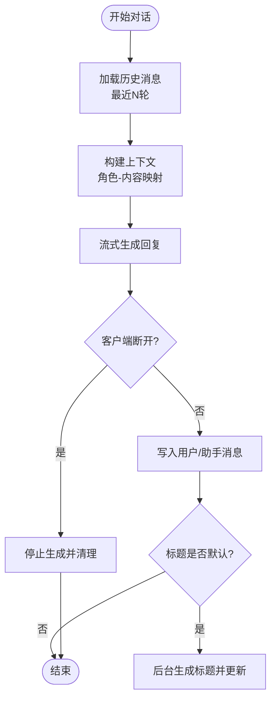
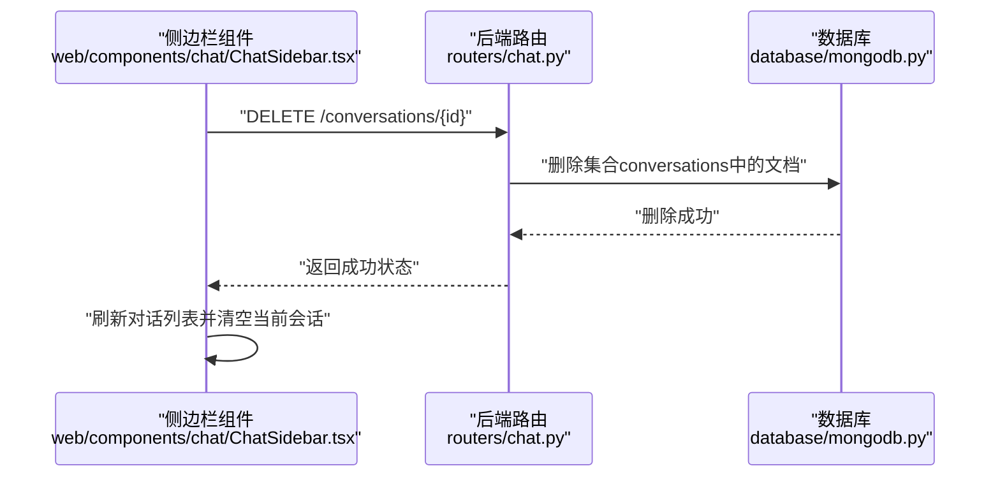
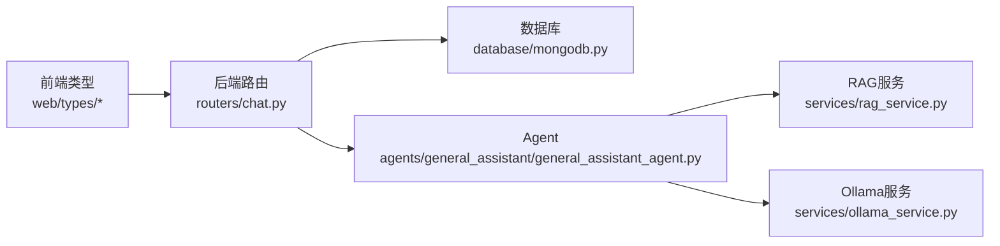

# 对话模型设计

<cite>
**本文引用的文件**
- [web/types/conversation.ts](file://web/types/conversation.ts)
- [web/types/chat.ts](file://web/types/chat.ts)
- [routers/chat.py](file://routers/chat.py)
- [database/mongodb.py](file://database/mongodb.py)
- [services/ollama_service.py](file://services/ollama_service.py)
- [agents/general_assistant/general_assistant_agent.py](file://agents/general_assistant/general_assistant_agent.py)
- [services/rag_service.py](file://services/rag_service.py)
- [models/course_assistant.py](file://models/course_assistant.py)
- [web/app/chat/page.tsx](file://web/app/chat/page.tsx)
- [web/components/chat/ChatSidebar.tsx](file://web/components/chat/ChatSidebar.tsx)
</cite>

## 目录
1. [简介](#简介)
2. [项目结构](#项目结构)
3. [核心组件](#核心组件)
4. [架构总览](#架构总览)
5. [详细组件分析](#详细组件分析)
6. [依赖分析](#依赖分析)
7. [性能考虑](#性能考虑)
8. [故障排查指南](#故障排查指南)
9. [结论](#结论)
10. [附录](#附录)

## 简介
本文件系统化阐述对话模型的设计与实现，覆盖前端类型定义、后端数据模型与路由、数据库存储结构、消息与上下文处理、多轮交互与上下文保持策略、对话模板与预设配置、统计与分析字段、以及对话生命周期管理（归档、删除、恢复）。目标是帮助开发者与产品人员全面理解对话系统的数据结构、处理流程与扩展点。

## 项目结构
对话功能横跨前端 TypeScript 类型定义、后端 FastAPI 路由与模型、数据库（MongoDB）存储、以及智能 Agent 与检索服务。整体采用“前端类型 + 后端路由模型 + 数据库存储 + 智能服务”的分层设计。

**图表来源**
- [web/types/conversation.ts:1-10](file://web/types/conversation.ts#L1-L10)
- [web/types/chat.ts:1-79](file://web/types/chat.ts#L1-L79)
- [routers/chat.py:1-1324](file://routers/chat.py#L1-L1324)
- [database/mongodb.py:1-1290](file://database/mongodb.py#L1-L1290)
- [agents/general_assistant/general_assistant_agent.py:1-167](file://agents/general_assistant/general_assistant_agent.py#L1-L167)
- [services/rag_service.py:1-248](file://services/rag_service.py#L1-L248)
- [services/ollama_service.py:207-232](file://services/ollama_service.py#L207-L232)
- [web/app/chat/page.tsx:1096-1135](file://web/app/chat/page.tsx#L1096-L1135)
- [web/components/chat/ChatSidebar.tsx:78-129](file://web/components/chat/ChatSidebar.tsx#L78-L129)

**章节来源**
- [web/types/conversation.ts:1-10](file://web/types/conversation.ts#L1-L10)
- [web/types/chat.ts:1-79](file://web/types/chat.ts#L1-L79)
- [routers/chat.py:1-1324](file://routers/chat.py#L1-L1324)
- [database/mongodb.py:1-1290](file://database/mongodb.py#L1-L1290)

## 核心组件
- 前端对话类型：定义对话与消息的最小契约，确保前后端一致的数据结构。
- 后端对话模型：封装创建、查询、更新、删除、消息增删改、重新生成等操作。
- 数据库存储：以集合“conversations”存储对话与消息，支持消息数组持久化。
- 智能Agent与RAG：负责检索增强、上下文拼接、流式生成与事件推送。
- 助手模板与预设：通过课程助手模型定义系统提示词、默认模型、快捷提示词等。

**章节来源**
- [web/types/conversation.ts:1-10](file://web/types/conversation.ts#L1-L10)
- [web/types/chat.ts:1-79](file://web/types/chat.ts#L1-L79)
- [routers/chat.py:29-62](file://routers/chat.py#L29-L62)
- [database/mongodb.py:191-196](file://database/mongodb.py#L191-L196)
- [models/course_assistant.py:8-77](file://models/course_assistant.py#L8-L77)

## 架构总览
对话系统的关键流程如下：
- 前端发起对话请求，携带问题、是否启用RAG、知识空间、对话ID等。
- 后端根据对话ID拉取历史消息，限制最近若干轮，拼接上下文。
- 智能Agent触发RAG检索，聚合来源与推荐资源。
- 流式生成回复，边生成边推送，支持客户端断开检测。
- 后端将用户消息与助手回复写入数据库，自动更新标题与时间戳。

**图表来源**
- [routers/chat.py:615-751](file://routers/chat.py#L615-L751)
- [routers/chat.py:638-661](file://routers/chat.py#L638-L661)
- [agents/general_assistant/general_assistant_agent.py:49-167](file://agents/general_assistant/general_assistant_agent.py#L49-L167)
- [services/rag_service.py:10-191](file://services/rag_service.py#L10-L191)
- [services/ollama_service.py:207-232](file://services/ollama_service.py#L207-L232)
- [database/mongodb.py:191-196](file://database/mongodb.py#L191-L196)
- [web/app/chat/page.tsx:1104-1135](file://web/app/chat/page.tsx#L1104-L1135)

## 详细组件分析

### 对话数据模型设计
- 前端类型契约
  - 对话：包含标识、用户ID、标题、创建/更新时间、消息计数等。
  - 消息：角色（用户/助手）、内容、时间戳、来源、推荐资源等。
- 后端模型
  - 对话模型包含消息数组，支持消息的增删改与重新生成。
  - 支持匿名模式下的对话创建、标题更新、删除与消息编辑。
- 数据库存储
  - 集合“conversations”存储对话文档，messages为数组字段，便于直接读取与追加。
  - 自动维护created_at/updated_at，支持按更新时间倒序查询。

**图表来源**
- [web/types/conversation.ts:1-10](file://web/types/conversation.ts#L1-L10)
- [web/types/chat.ts:3-14](file://web/types/chat.ts#L3-L14)
- [routers/chat.py:29-37](file://routers/chat.py#L29-L37)
- [routers/chat.py:20-27](file://routers/chat.py#L20-L27)

**章节来源**
- [web/types/conversation.ts:1-10](file://web/types/conversation.ts#L1-L10)
- [web/types/chat.ts:1-79](file://web/types/chat.ts#L1-L79)
- [routers/chat.py:29-62](file://routers/chat.py#L29-L62)
- [database/mongodb.py:191-196](file://database/mongodb.py#L191-L196)

### 对话消息的数据结构
- 消息类型
  - 角色限定为“用户”或“助手”，便于统一渲染与控制。
- 内容格式
  - 文本为主，支持来源信息与推荐资源，便于展示引用与拓展阅读。
- 元数据
  - 时间戳、消息唯一ID、来源与推荐资源等，支撑消息编辑、重新生成与溯源。
- 前端集成
  - 前端在流式接收完成后，将sources与recommended_resources注入消息，便于UI渲染。

**章节来源**
- [web/types/chat.ts:3-14](file://web/types/chat.ts#L3-L14)
- [web/app/chat/page.tsx:1096-1135](file://web/app/chat/page.tsx#L1096-L1135)

### 多轮交互机制与上下文保持策略
- 历史截断
  - 常规对话保留最近10轮，深度研究模式保留最近5轮，避免上下文过长导致性能与成本问题。
- 上下文拼接
  - 将历史消息转换为“角色-内容”键值对，注入到生成请求中，供LLM理解上下文。
- 流式生成与断连检测
  - 后端在流式输出过程中定期检查客户端断连，及时停止生成，节省资源。
- 重新生成
  - 删除指定用户消息及其后续消息，保留历史上下文，重新触发生成。

**图表来源**
- [routers/chat.py:638-661](file://routers/chat.py#L638-L661)
- [routers/chat.py:664-743](file://routers/chat.py#L664-L743)
- [routers/chat.py:534-612](file://routers/chat.py#L534-L612)
- [services/ollama_service.py:207-232](file://services/ollama_service.py#L207-L232)

**章节来源**
- [routers/chat.py:615-751](file://routers/chat.py#L615-L751)
- [routers/chat.py:638-661](file://routers/chat.py#L638-L661)
- [routers/chat.py:664-743](file://routers/chat.py#L664-L743)
- [routers/chat.py:534-612](file://routers/chat.py#L534-L612)
- [services/ollama_service.py:207-232](file://services/ollama_service.py#L207-L232)

### 对话模板与预设配置
- 助手模板
  - 课程助手模型包含系统提示词、默认模型、嵌入模型、快捷提示词、初始问候语等，支撑不同领域与风格的对话体验。
- 默认助手
  - 创建对话时若未指定助手ID，可从数据库查询默认助手，确保一致性与可发现性。
- 生成配置
  - 前端可传递generation_config，后端在Agent执行时选择模型与嵌入模型，实现灵活的推理与检索配置。

**章节来源**
- [models/course_assistant.py:8-77](file://models/course_assistant.py#L8-L77)
- [routers/chat.py:109-129](file://routers/chat.py#L109-L129)
- [agents/general_assistant/general_assistant_agent.py:28-96](file://agents/general_assistant/general_assistant_agent.py#L28-L96)

### 对话统计与分析字段
- 消息计数
  - 列表接口返回message_count，便于快速了解对话活跃度与长度。
- 来源与推荐
  - 消息包含来源与推荐资源，可用于统计引用来源分布、热门资源排行等分析。
- 时间维度
  - created_at/updated_at用于分析对话创建与活跃趋势。

**章节来源**
- [routers/chat.py:166-175](file://routers/chat.py#L166-L175)
- [web/types/chat.ts:57-65](file://web/types/chat.ts#L57-L65)
- [web/types/chat.ts:48-55](file://web/types/chat.ts#L48-L55)

### 生命周期管理：归档、删除与恢复
- 删除
  - 支持匿名模式下的对话删除，删除后无法恢复。
- 归档与恢复
  - 当前实现未提供显式的归档/恢复接口，可在业务侧通过扩展字段（如状态标志）实现软删除与恢复。
- 前端交互
  - 侧边栏提供删除确认与重命名操作，删除后刷新列表并清理当前会话。

**图表来源**
- [web/components/chat/ChatSidebar.tsx:109-129](file://web/components/chat/ChatSidebar.tsx#L109-L129)
- [routers/chat.py:408-449](file://routers/chat.py#L408-L449)
- [database/mongodb.py:191-196](file://database/mongodb.py#L191-L196)

**章节来源**
- [web/components/chat/ChatSidebar.tsx:109-129](file://web/components/chat/ChatSidebar.tsx#L109-L129)
- [routers/chat.py:408-449](file://routers/chat.py#L408-L449)

## 依赖分析
- 前端类型依赖
  - 对话与消息类型分别定义于web/types，确保TS类型安全与IDE提示。
- 后端路由依赖
  - 路由依赖数据库连接、时区工具、日志工具，以及Agent与RAG服务。
- 智能服务依赖
  - Agent依赖RAG服务进行检索，RAG服务依赖MongoDB客户端与检索器。
- 数据库依赖
  - 使用异步MongoDB客户端，集合“conversations”承载对话与消息。

**图表来源**
- [web/types/conversation.ts:1-10](file://web/types/conversation.ts#L1-L10)
- [web/types/chat.ts:1-79](file://web/types/chat.ts#L1-L79)
- [routers/chat.py:1-1324](file://routers/chat.py#L1-L1324)
- [database/mongodb.py:1-1290](file://database/mongodb.py#L1-L1290)
- [agents/general_assistant/general_assistant_agent.py:1-167](file://agents/general_assistant/general_assistant_agent.py#L1-L167)
- [services/rag_service.py:1-248](file://services/rag_service.py#L1-L248)
- [services/ollama_service.py:207-232](file://services/ollama_service.py#L207-L232)

**章节来源**
- [routers/chat.py:1-1324](file://routers/chat.py#L1-L1324)
- [database/mongodb.py:1-1290](file://database/mongodb.py#L1-L1290)
- [services/rag_service.py:1-248](file://services/rag_service.py#L1-L248)
- [agents/general_assistant/general_assistant_agent.py:1-167](file://agents/general_assistant/general_assistant_agent.py#L1-L167)

## 性能考虑
- 上下文截断
  - 限制最近N轮对话，避免提示词过长导致延迟与成本上升。
- 流式输出与断连检测
  - 定期检查客户端断连，及时停止生成，减少无效计算。
- 并行检索
  - RAG服务对多个知识空间集合并行检索，提升响应速度。
- 连接池优化
  - 数据库连接池参数可调，适配高并发场景。

[本节为通用指导，无需特定文件引用]

## 故障排查指南
- 对话创建失败
  - 检查数据库连接与集合权限，查看后端日志定位异常。
- 对话历史为空
  - 确认conversation_id有效，检查数据库中messages字段是否正确写入。
- 流式输出中断
  - 检查客户端断连检测逻辑，确认SSE连接状态与网络稳定性。
- RAG检索失败
  - 检查知识空间集合名称、检索器配置与向量模型，必要时回退到无上下文模式。

**章节来源**
- [routers/chat.py:143-148](file://routers/chat.py#L143-L148)
- [routers/chat.py:237-242](file://routers/chat.py#L237-L242)
- [routers/chat.py:717-734](file://routers/chat.py#L717-L734)
- [services/rag_service.py:219-236](file://services/rag_service.py#L219-L236)

## 结论
对话模型围绕“前端类型契约 + 后端路由模型 + 数据库存储 + 智能Agent与RAG”的分层架构设计，实现了稳定、可扩展的多轮对话能力。通过上下文截断、流式生成与断连检测等策略保障性能与用户体验；通过消息数组与来源信息支撑溯源与分析。未来可在生命周期管理上引入软删除与恢复、扩展统计分析维度，并完善模板与预设的可视化管理。

[本节为总结性内容，无需特定文件引用]

## 附录
- 常用接口
  - 创建对话：POST /api/chat/conversations
  - 获取对话列表：GET /api/chat/conversations
  - 获取对话详情：GET /api/chat/conversations/{id}
  - 添加消息：POST /api/chat/conversations/{id}/messages
  - 更新对话标题：PUT /api/chat/conversations/{id}
  - 删除对话：DELETE /api/chat/conversations/{id}
  - 重新生成回答：POST /api/chat/conversations/{id}/messages/{message_id}/regenerate
  - 常规对话（流式）：POST /api/chat/

**章节来源**
- [routers/chat.py:97-149](file://routers/chat.py#L97-L149)
- [routers/chat.py:151-192](file://routers/chat.py#L151-L192)
- [routers/chat.py:195-242](file://routers/chat.py#L195-L242)
- [routers/chat.py:245-347](file://routers/chat.py#L245-L347)
- [routers/chat.py:350-405](file://routers/chat.py#L350-L405)
- [routers/chat.py:408-449](file://routers/chat.py#L408-L449)
- [routers/chat.py:534-612](file://routers/chat.py#L534-L612)
- [routers/chat.py:615-751](file://routers/chat.py#L615-L751)