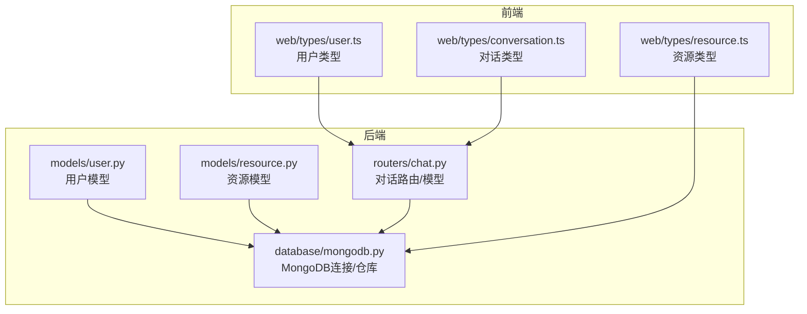
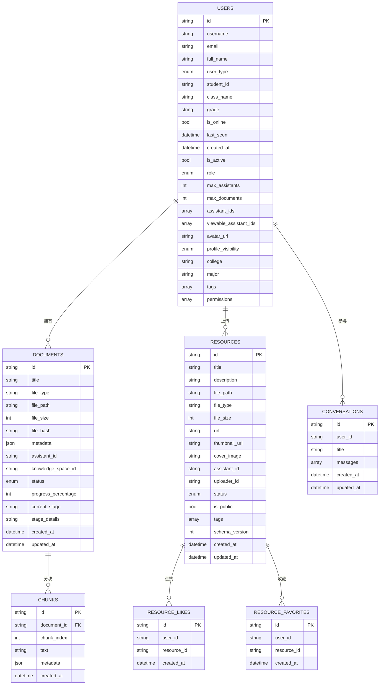
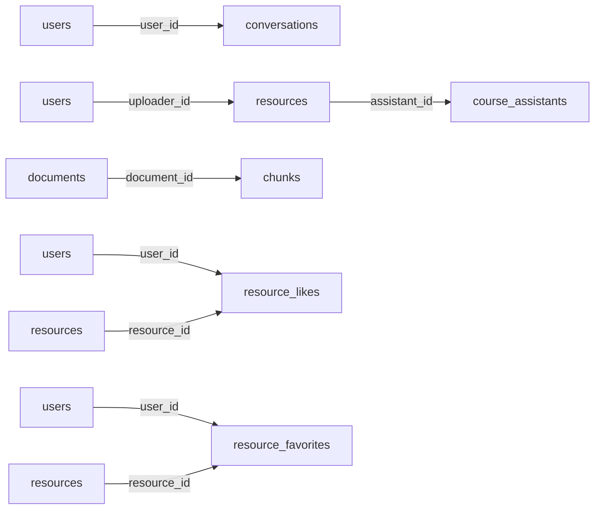

# 数据模型设计

<cite>
**本文引用的文件**   
- [models/user.py](file://models/user.py)
- [models/resource.py](file://models/resource.py)
- [web/types/user.ts](file://web/types/user.ts)
- [web/types/resource.ts](file://web/types/resource.ts)
- [web/types/conversation.ts](file://web/types/conversation.ts)
- [database/mongodb.py](file://database/mongodb.py)
- [routers/chat.py](file://routers/chat.py)
</cite>

## 目录
1. [引言](#引言)
2. [项目结构](#项目结构)
3. [核心组件](#核心组件)
4. [架构总览](#架构总览)
5. [详细组件分析](#详细组件分析)
6. [依赖分析](#依赖分析)
7. [性能考虑](#性能考虑)
8. [故障排查指南](#故障排查指南)
9. [结论](#结论)
10. [附录](#附录)

## 引言
本文件系统化梳理本项目在 MongoDB 中的核心数据模型设计，覆盖用户（users）、文档（documents）、分块（chunks）、对话（conversations）、资源（resources）等集合的文档结构、字段语义、数据类型、约束与索引策略，并结合前端类型定义与后端仓库实现，给出字段命名规范、嵌套结构、数组字段使用、数据校验规则、默认值与更新策略，以及模型间的关系映射与引用设计。

## 项目结构
围绕数据模型的关键文件分布如下：
- 后端模型与仓库
  - models/user.py：用户模型与权限字段
  - models/resource.py：资源模型与校验
  - database/mongodb.py：MongoDB连接、集合访问与仓库实现（documents/chunks/resources）
  - routers/chat.py：对话模型与对话集合操作
- 前端类型定义
  - web/types/user.ts：用户资料与关系图类型
  - web/types/resource.ts：资源类型
  - web/types/conversation.ts：对话类型

**图表来源**
- [database/mongodb.py:202-205](file://database/mongodb.py#L202-L205)
- [routers/chat.py:29-37](file://routers/chat.py#L29-L37)
- [models/user.py:8-85](file://models/user.py#L8-L85)
- [models/resource.py:8-27](file://models/resource.py#L8-L27)
- [web/types/user.ts:52-71](file://web/types/user.ts#L52-L71)
- [web/types/resource.ts:1-17](file://web/types/resource.ts#L1-L17)
- [web/types/conversation.ts:1-8](file://web/types/conversation.ts#L1-L8)

**章节来源**
- [database/mongodb.py:202-205](file://database/mongodb.py#L202-L205)
- [routers/chat.py:29-37](file://routers/chat.py#L29-L37)
- [models/user.py:8-85](file://models/user.py#L8-L85)
- [models/resource.py:8-27](file://models/resource.py#L8-L27)
- [web/types/user.ts:52-71](file://web/types/user.ts#L52-L71)
- [web/types/resource.ts:1-17](file://web/types/resource.ts#L1-L17)
- [web/types/conversation.ts:1-8](file://web/types/conversation.ts#L1-L8)

## 核心组件
- 用户模型（User）
  - 字段：标识、身份、角色、在线状态、创建/更新时间、头像、细粒度权限、资料扩展（教育、工作经历、成果、技能、兴趣、个性、简介、联系方式、可见性、学院/专业等）
  - 校验：邮箱格式（含本地域）
  - 默认值：布尔/枚举/列表字段均有默认值
- 资源模型（Resource）
  - 字段：标题、描述、文件路径/类型/大小、外链URL、封面/缩略图、关联助手、上传者、状态、公开性、标签、版本、创建/更新时间
  - 校验：URL格式
  - 默认值：状态/公开性/标签/版本等
- 对话模型（Conversation）
  - 字段：标识、用户ID、标题、消息数组（含角色、内容、时间戳、来源、推荐资源）、创建/更新时间
  - 行为：消息追加、标题自动生成、重生成回答、编辑用户消息
- 文档/分块/资源仓库
  - 文档仓库：创建/状态/进度/列表/计数/标题更新/删除/移动/转资源
  - 分块仓库：创建/查询/删除
  - 资源仓库：创建/查询/计数/描述/标题/删除/版本迁移/批量迁移
  - 资源点赞/收藏：用户-资源多对多关系存储

**章节来源**
- [models/user.py:8-85](file://models/user.py#L8-L85)
- [models/resource.py:8-27](file://models/resource.py#L8-L27)
- [routers/chat.py:29-37](file://routers/chat.py#L29-L37)
- [database/mongodb.py:315-768](file://database/mongodb.py#L315-L768)
- [database/mongodb.py:770-807](file://database/mongodb.py#L770-L807)
- [database/mongodb.py:809-1176](file://database/mongodb.py#L809-L1176)
- [database/mongodb.py:1178-1284](file://database/mongodb.py#L1178-L1284)

## 架构总览
MongoDB 集合与模型映射关系如下：

**图表来源**
- [database/mongodb.py:315-768](file://database/mongodb.py#L315-L768)
- [database/mongodb.py:770-807](file://database/mongodb.py#L770-L807)
- [database/mongodb.py:809-1176](file://database/mongodb.py#L809-L1176)
- [database/mongodb.py:1178-1284](file://database/mongodb.py#L1178-L1284)
- [routers/chat.py:29-37](file://routers/chat.py#L29-L37)

## 详细组件分析

### 用户模型（User）
- 字段与类型
  - 标识与认证：id（可选）、username、email（字符串，带邮箱格式校验）、full_name（可选）
  - 身份与角色：user_type（枚举：student/teacher/other）、role（枚举：admin/teacher/user/developer）
  - 学生特有：student_id、class_name、grade
  - 在线与时间：is_online（布尔）、last_seen（时间）
  - 访问控制：is_active（布尔）、assistant_ids、viewable_assistant_ids（数组）、细粒度权限字段（查看/创建/编辑/删除助手、文档、资源、标签；编辑基础提示词；发送通知/邮件）
  - 资料扩展：research_fields（数组）、education（对象）、work_experience（数组）、publications（数组）、skills（数组）、interests（数组）、personality、bio、contact_info（对象）、profile_visibility（枚举：public/private/friends）、college、major、avatar_url
  - 时间：created_at（时间）
- 约束与默认值
  - user_type、role、profile_visibility、is_online、is_active 默认值见模型定义
  - 列表/数组字段默认为空数组
- 校验规则
  - 邮箱格式：支持标准域名与本地域（.local）
- 字段命名规范
  - 下划线命名；布尔字段以is_开头；时间字段以_created/_updated结尾
- 嵌套与数组
  - education/work_experience/publications/contact_info 为嵌套对象/数组
- 更新策略
  - 通过用户资料更新模型进行增量更新
- 前后端一致性
  - 前端类型定义包含用户资料字段与可见性枚举，与后端模型一致

**章节来源**
- [models/user.py:8-85](file://models/user.py#L8-L85)
- [models/user.py:92-107](file://models/user.py#L92-L107)
- [web/types/user.ts:52-71](file://web/types/user.ts#L52-L71)

### 资源模型（Resource）
- 字段与类型
  - 标识与元信息：id（可选）、title、description、file_path（可选）、file_type、file_size、url（可选）、thumbnail_url（可选）、cover_image（可选）
  - 关联与状态：assistant_id（可选）、uploader_id（可选）、status（枚举：active/down/deleted，默认active）、is_public（布尔，默认true）
  - 标签与版本：tags（数组，默认空）、schema_version（整数，默认2）
  - 时间：created_at、updated_at
- 约束与默认值
  - status/is_public/tags/schema_version 默认值明确
- 校验规则
  - URL 格式校验（支持 http/https、域名/IP、端口）
- 字段命名规范
  - 下划线命名；文件相关字段统一前缀（file_、url、thumbnail_、cover_）
- 嵌套与数组
  - tags 为字符串数组
- 更新策略
  - 支持标题/描述/状态/公开性/标签/封面等字段更新
  - 版本迁移：从 v1 迁移到 v2（补齐缺失字段并设置默认值）
- 前后端一致性
  - 前端类型定义包含资源字段与可选上传者信息，与后端模型一致

**章节来源**
- [models/resource.py:8-27](file://models/resource.py#L8-L27)
- [models/resource.py:29-41](file://models/resource.py#L29-L41)
- [models/resource.py:77-84](file://models/resource.py#L77-L84)
- [database/mongodb.py:809-1176](file://database/mongodb.py#L809-L1176)
- [web/types/resource.ts:1-17](file://web/types/resource.ts#L1-L17)

### 对话模型（Conversation）
- 字段与类型
  - 标识与上下文：id、user_id（可选）、title、assistant_id（可选）、messages（数组）
  - 消息结构：role（字符串，user/assistant）、content（字符串）、timestamp（时间）、sources（数组）、recommended_resources（数组）
  - 时间：created_at、updated_at
- 约束与默认值
  - messages 默认为空数组；标题默认“新对话”
- 校验规则
  - 消息编辑限制：仅允许编辑 role=user 的消息
- 字段命名规范
  - 下划线命名；消息唯一ID message_id
- 嵌套与数组
  - messages 为对象数组；sources/recommended_resources 为数组
- 更新策略
  - 创建：生成 UUID，写入 user_id/assistant_id/title/messages/时间戳
  - 列表：按更新时间倒序分页
  - 详情：返回完整消息数组（含消息ID、角色、内容、时间戳、来源、推荐资源）
  - 标题自动生成：助手回复时尝试生成标题
  - 重生成回答：删除指定用户消息及其后续消息
  - 编辑消息：仅允许编辑用户消息，更新时间戳
- 前后端一致性
  - 前端类型定义包含对话字段与可选消息计数，与后端模型一致

**章节来源**
- [routers/chat.py:29-37](file://routers/chat.py#L29-L37)
- [routers/chat.py:97-149](file://routers/chat.py#L97-L149)
- [routers/chat.py:151-193](file://routers/chat.py#L151-L193)
- [routers/chat.py:195-243](file://routers/chat.py#L195-L243)
- [routers/chat.py:245-348](file://routers/chat.py#L245-L348)
- [routers/chat.py:350-406](file://routers/chat.py#L350-L406)
- [routers/chat.py:408-450](file://routers/chat.py#L408-L450)
- [routers/chat.py:452-532](file://routers/chat.py#L452-L532)
- [routers/chat.py:534-613](file://routers/chat.py#L534-L613)
- [web/types/conversation.ts:1-8](file://web/types/conversation.ts#L1-L8)

### 文档/分块/资源仓库
- 文档仓库（DocumentRepository）
  - 创建：写入标题、类型、路径、大小、哈希、元数据、assistant_id/knowledge_space_id、状态/进度/阶段信息、时间戳
  - 状态/进度更新：支持状态切换与进度百分比、阶段名称、阶段详情更新
  - 列表/计数：支持按知识空间/助手过滤、分页、排序
  - 标题/删除/移动：支持标题更新、删除、移动到新助手
  - 转资源：将文档转换为资源，去重并确保公开状态
- 分块仓库（ChunkRepository）
  - 创建：写入 document_id、chunk_index、text、metadata、时间戳
  - 查询/删除：按文档ID查询所有块、删除所有块
- 资源仓库（ResourceRepository）
  - 创建：写入标题、描述、文件信息、关联信息、时间戳
  - 查询/计数：支持按助手/状态/公开性过滤
  - 更新：描述/标题/删除
  - 版本迁移：从 v1 迁移到 v2（补齐字段并设置默认值）
  - 批量迁移：扫描并迁移所有旧版本资源
- 资源点赞/收藏（ResourceLikeRepository/ResourceFavoriteRepository）
  - 点赞/收藏：用户-资源多对多，支持取消、计数、查询

**章节来源**
- [database/mongodb.py:315-768](file://database/mongodb.py#L315-L768)
- [database/mongodb.py:770-807](file://database/mongodb.py#L770-L807)
- [database/mongodb.py:809-1176](file://database/mongodb.py#L809-L1176)
- [database/mongodb.py:1178-1284](file://database/mongodb.py#L1178-L1284)

## 依赖分析
- 集合访问
  - users：通过全局 MongoDB 实例获取集合
  - documents/chunks/resources：通过 MongoDBClient（同步）获取集合
  - conversations：通过异步 MongoDB 实例获取集合
- 模型与集合映射
  - User <-> users
  - Resource <-> resources
  - Conversation <-> conversations
  - Document/Chunk <-> documents/chunks
  - ResourceLike/ResourceFavorite <-> resource_likes/resource_favorites
- 外键与引用
  - documents.assistant_id/knowledge_space_id 与助手概念关联
  - resources.assistant_id 与助手关联
  - resources.uploader_id 与用户关联
  - conversations.user_id 与用户关联
  - chunks.document_id 与 documents 关联
  - resource_likes/resource_favorites.user_id/resource_id 与 users/resources 关联

**图表来源**
- [database/mongodb.py:202-205](file://database/mongodb.py#L202-L205)
- [routers/chat.py:113-116](file://routers/chat.py#L113-L116)
- [database/mongodb.py:315-768](file://database/mongodb.py#L315-L768)
- [database/mongodb.py:809-1176](file://database/mongodb.py#L809-L1176)
- [database/mongodb.py:1178-1284](file://database/mongodb.py#L1178-L1284)

**章节来源**
- [database/mongodb.py:202-205](file://database/mongodb.py#L202-L205)
- [routers/chat.py:113-116](file://routers/chat.py#L113-L116)
- [database/mongodb.py:315-768](file://database/mongodb.py#L315-L768)
- [database/mongodb.py:809-1176](file://database/mongodb.py#L809-L1176)
- [database/mongodb.py:1178-1284](file://database/mongodb.py#L1178-L1284)

## 性能考虑
- 连接池与超时
  - 异步客户端连接池参数（最大/最小池大小、空闲超时、服务器选择/连接/Socket 超时）已在连接配置中设置
- 查询与分页
  - documents/resources/conversations 列表查询采用排序、分页与投影处理，避免一次性返回大量数据
- 索引建议（基于现有查询模式）
  - conversations：按 user_id、assistant_id、updated_at 排序查询
  - documents：按 knowledge_space_id/assistant_id、status、created_at 排序
  - resources：按 assistant_id/status/is_public、created_at 排序
  - chunks：按 document_id、chunk_index 排序
  - resource_likes/resource_favorites：按 user_id/resource_id 唯一性查询
- 版本迁移
  - 资源版本迁移采用批量扫描与更新，减少单次写放大

**章节来源**
- [database/mongodb.py:122-136](file://database/mongodb.py#L122-L136)
- [database/mongodb.py:486-525](file://database/mongodb.py#L486-L525)
- [database/mongodb.py:990-1029](file://database/mongodb.py#L990-L1029)
- [database/mongodb.py:1067-1138](file://database/mongodb.py#L1067-L1138)

## 故障排查指南
- 连接失败
  - 确认 MONGODB_URI/MONGODB_HOST/MONGODB_PORT/MONGODB_USERNAME/MONGODB_PASSWORD/MONGODB_AUTH_SOURCE 配置正确
  - 检查 .env 文件加载与连接字符串拼接
- 文档/资源/分块操作异常
  - 确认集合存在且具备相应写权限
  - 检查 ID 类型（ObjectId/字符串）转换逻辑
- 版本迁移失败
  - 检查 schema_version 字段与迁移逻辑，必要时手动补齐缺失字段
- 对话标题生成失败
  - 确认标题生成服务可用，后台任务未阻塞主流程

**章节来源**
- [database/mongodb.py:101-184](file://database/mongodb.py#L101-L184)
- [database/mongodb.py:885-948](file://database/mongodb.py#L885-L948)
- [routers/chat.py:289-332](file://routers/chat.py#L289-L332)

## 结论
本项目在 MongoDB 中采用清晰的集合划分与严格的字段约束，结合前后端类型定义与仓库实现，形成了可维护、可扩展的数据模型体系。用户、资源、对话、文档/分块等核心实体通过明确的关联关系与默认值策略支撑了完整的业务流程。建议在生产环境中补充索引策略与监控告警，持续优化查询与写入性能。

## 附录
- 字段命名规范
  - 使用下划线命名法
  - 布尔字段以 is_ 开头
  - 时间字段以 _at 结尾
- 嵌套与数组
  - 嵌套对象用于结构化资料（教育、工作经历、联系信息）
  - 数组用于多值字段（标签、权限、消息、分块）
- 数据验证与默认值
  - 邮箱与URL格式校验
  - 枚举字段默认值与必填策略
- 关系映射
  - 用户与对话、资源、分块、点赞/收藏的多对多/一对多映射
  - 文档与分块的一对多映射