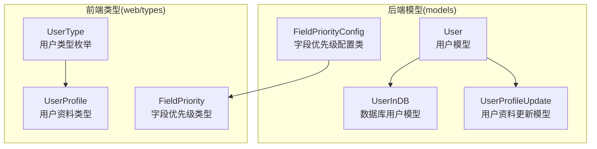
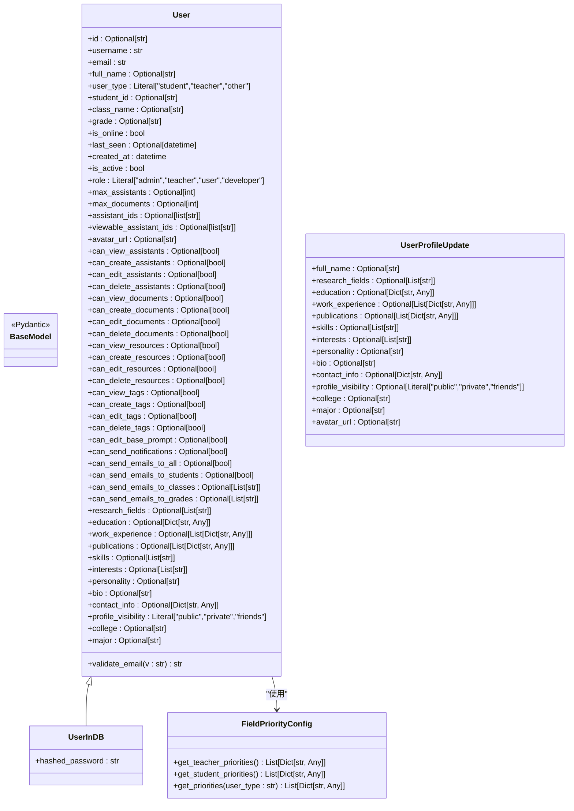
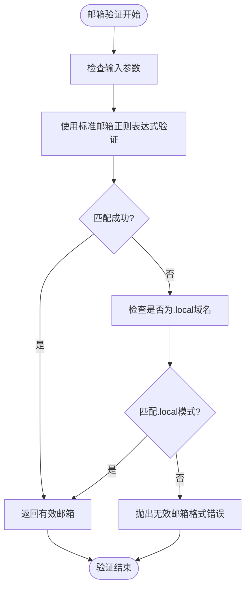
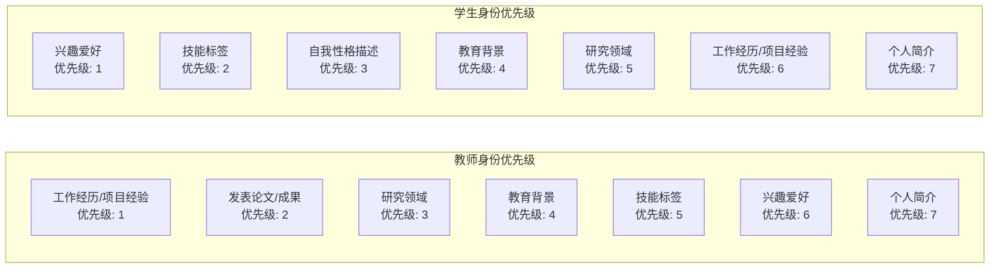
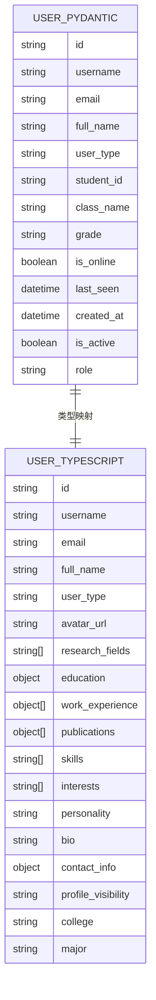
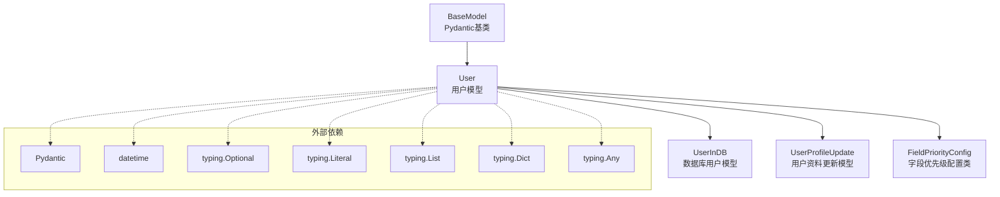
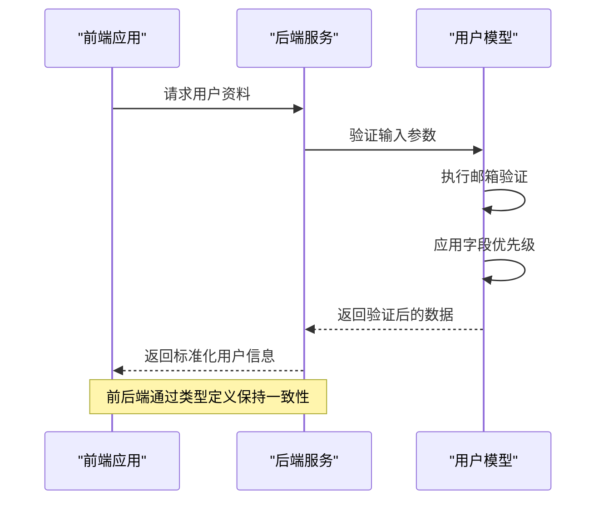

# 用户模型设计

<cite>
**本文引用的文件**
- [models/user.py](file://models/user.py)
- [web/types/user.ts](file://web/types/user.ts)
</cite>

## 目录
1. [引言](#引言)
2. [项目结构](#项目结构)
3. [核心组件](#核心组件)
4. [架构概览](#架构概览)
5. [详细组件分析](#详细组件分析)
6. [依赖分析](#依赖分析)
7. [性能考虑](#性能考虑)
8. [故障排除指南](#故障排除指南)
9. [结论](#结论)

## 引言
本文档深入解析 Advanced RAG 项目中的用户模型设计，涵盖 Pydantic 模型的数据结构、字段验证器实现、角色权限体系以及用户资料扩展字段的完整设计思路。通过对 User、UserInDB、UserProfileUpdate 等模型的详细分析，帮助开发者理解用户数据在系统中的组织方式、验证规则以及业务用途。

## 项目结构
用户模型位于 Python 后端的 models 目录中，前端类型定义位于 web/types 目录中，两者保持一致的字段结构以确保前后端数据契约的一致性。

**图表来源**
- [models/user.py:8-157](file://models/user.py#L8-L157)
- [web/types/user.ts:3-175](file://web/types/user.ts#L3-L175)

**章节来源**
- [models/user.py:1-157](file://models/user.py#L1-L157)
- [web/types/user.ts:1-176](file://web/types/user.ts#L1-L176)

## 核心组件
用户模型系统由三个核心 Pydantic 模型组成，分别服务于不同的业务场景：

### User 模型（公开信息）
这是用户的主要数据载体，包含所有公开可见的信息字段。该模型继承自 BaseModel，提供了完整的数据验证和序列化功能。

### UserInDB 模型（数据库存储）
在 User 模型基础上增加了密码哈希字段，专门用于数据库持久化存储。该模型确保敏感信息的安全存储。

### UserProfileUpdate 模型（资料更新）
专为用户资料更新场景设计，支持部分字段的增量更新，避免不必要的数据覆盖。

**章节来源**
- [models/user.py:8-108](file://models/user.py#L8-L108)

## 架构概览
用户模型系统采用分层设计，通过继承关系实现功能扩展，同时保持数据结构的清晰性和一致性。

**图表来源**
- [models/user.py:8-157](file://models/user.py#L8-L157)

## 详细组件分析

### 数据字段设计

#### 基本信息字段
用户模型包含以下基本信息字段：
- **username**: 用户名，必填字符串
- **email**: 邮箱地址，使用字符串类型并通过自定义验证器验证
- **full_name**: 用户全名，可选字符串

这些字段构成了用户身份识别的基础信息，支持系统的用户认证和显示需求。

#### 身份标识字段
针对不同用户类型的差异化需求，模型提供了专门的身份标识字段：
- **user_type**: 用户类型，限定为 "student"、"teacher"、"other"
- **student_id**: 学号，仅学生身份需要
- **class_name**: 班级名称，仅学生身份需要  
- **grade**: 年级信息，仅学生身份需要

这种设计实现了用户类型的灵活区分，同时避免了不相关字段对其他用户类型的干扰。

#### 权限控制字段
系统采用细粒度的权限控制机制，主要分为两类：

**角色权限体系**:
- **role**: 用户角色，支持 "admin"（系统管理员）、"teacher"（普通管理员/授课老师）、"user"（普通用户）、"developer"（开发者）

**管理员权限矩阵**:
- **助手管理权限**: can_view_assistants、can_create_assistants、can_edit_assistants、can_delete_assistants
- **文档管理权限**: can_view_documents、can_create_documents、can_edit_documents、can_delete_documents  
- **资源管理权限**: can_view_resources、can_create_resources、can_edit_resources、can_delete_resources
- **标签管理权限**: can_view_tags、can_create_tags、can_edit_tags、can_delete_tags
- **基础提示词编辑权限**: can_edit_base_prompt
- **邮件发送权限**: can_send_notifications、can_send_emails_to_all、can_send_emails_to_students、can_send_emails_to_classes、can_send_emails_to_grades

这种权限设计支持不同角色用户的精细化管理需求。

#### 在线状态字段
为了支持实时交互功能，模型包含了在线状态相关的字段：
- **is_online**: 布尔值，表示用户当前在线状态
- **last_seen**: 时间戳，记录用户最后在线时间

这些字段为系统提供了用户活跃度监控和消息推送的基础。

#### 用户资料扩展字段
模型提供了丰富的用户资料扩展字段，支持个性化的个人主页展示：

**学术背景字段**:
- **research_fields**: 研究领域列表，支持多个研究方向
- **education**: 教育背景字典，包含学历、学校、专业、毕业时间、学院等信息

**工作经历字段**:
- **work_experience**: 工作经历列表，每条记录包含公司、职位、时间段、描述、项目等信息

**学术成果字段**:
- **publications**: 发表论文列表，包含标题、作者、期刊、年份、DOI等信息

**个人特征字段**:
- **skills**: 技能标签列表
- **interests**: 兴趣爱好列表
- **personality**: 自我性格描述（特别针对学生身份）
- **bio**: 个人简介

**联系方式字段**:
- **contact_info**: 联系方式字典，支持微信、电话、邮箱等
- **profile_visibility**: 资料可见性设置，支持 "public"（公开）、"private"（私密）、"friends"（好友可见）
- **college**: 所属学院
- **major**: 所属专业

**章节来源**
- [models/user.py:8-71](file://models/user.py#L8-L71)
- [models/user.py:92-107](file://models/user.py#L92-L107)
- [models/user.py:110-157](file://models/user.py#L110-L157)

### 字段验证器实现

#### 邮箱格式验证器
User 模型实现了专门的邮箱验证器，采用了双重验证策略：

**图表来源**
- [models/user.py:73-84](file://models/user.py#L73-L84)

验证器采用的正则表达式设计：
- **标准邮箱模式**: `^[a-zA-Z0-9._%+-]+@[a-zA-Z0-9.-]+\.[a-zA-Z]{2,}$`
- **本地开发模式**: `^[a-zA-Z0-9._%+-]+@[a-zA-Z0-9.-]+\.local$`

这种设计既保证了生产环境的严格验证，又为开发环境提供了便利的本地域名支持。

**章节来源**
- [models/user.py:73-84](file://models/user.py#L73-L84)

### 角色权限体系

#### 角色层次结构
系统采用四层角色体系，从高到低依次为：
1. **admin**: 系统管理员，拥有最高权限
2. **teacher**: 普通管理员/授课老师，具有管理权限
3. **user**: 普通用户，基本使用权限
4. **developer**: 开发者，系统维护权限

#### 权限分配策略
管理员角色（admin 和 teacher）享有完整的管理权限，包括但不限于：
- 用户管理权限
- 内容审核权限  
- 系统配置权限
- 批量操作权限

普通用户（user 和 developer）仅具备基本的使用权限和有限的管理权限。

**章节来源**
- [models/user.py:22](file://models/user.py#L22)

### 字段优先级配置

#### 优先级设计理念
系统提供了灵活的字段优先级配置机制，根据不同用户类型提供差异化的填写优先级：

**图表来源**
- [models/user.py:119-154](file://models/user.py#L119-L154)

#### 优先级配置策略
- **教师身份**: 优先展示专业能力和学术成果，强调工作经历和研究成果
- **学生身份**: 优先展示个人特色和社交属性，强调兴趣爱好和技能标签
- **其他身份**: 采用学生身份的优先级配置

每个字段都包含详细的元数据信息，如字段名、优先级、是否必填、显示标签和引导文案等。

**章节来源**
- [models/user.py:119-154](file://models/user.py#L119-L154)

### 前后端类型一致性

#### TypeScript 类型映射
前端 TypeScript 类型与后端 Pydantic 模型保持完全一致的字段结构：

**图表来源**
- [models/user.py:8-71](file://models/user.py#L8-L71)
- [web/types/user.ts:52-71](file://web/types/user.ts#L52-L71)

**章节来源**
- [web/types/user.ts:3-175](file://web/types/user.ts#L3-L175)

## 依赖分析

### 模型间依赖关系
用户模型系统内部存在清晰的依赖层次：

**图表来源**
- [models/user.py:2-5](file://models/user.py#L2-L5)

### 前后端类型依赖
前后端类型定义通过共享的字段结构实现松耦合的集成：

**图表来源**
- [models/user.py:73-84](file://models/user.py#L73-L84)
- [web/types/user.ts:52-71](file://web/types/user.ts#L52-L71)

**章节来源**
- [models/user.py:1-157](file://models/user.py#L1-L157)
- [web/types/user.ts:1-176](file://web/types/user.ts#L1-L176)

## 性能考虑

### 验证器性能优化
- **正则表达式缓存**: 邮箱验证器使用编译后的正则表达式，避免重复编译开销
- **早期失败**: 验证器在发现无效输入时立即抛出异常，减少不必要的处理
- **条件验证**: 仅对必要的字段执行验证逻辑

### 内存使用优化
- **可选字段**: 大量使用 Optional 类型，避免不必要的内存占用
- **列表字段**: 使用 List[Dict[str, Any]] 结构，支持动态数据存储
- **继承复用**: 通过继承关系减少重复代码和内存开销

### 序列化性能
- **Pydantic 优化**: 利用 Pydantic 的高效序列化机制
- **类型注解**: 明确的类型注解有助于运行时性能优化
- **字段选择**: 支持按需选择字段，减少序列化数据量

## 故障排除指南

### 常见验证错误

#### 邮箱格式错误
**问题症状**: 验证器抛出无效邮箱格式错误
**可能原因**:
- 邮箱地址不符合标准格式
- 使用了不被允许的域名后缀
- 开发环境使用了非标准域名

**解决方案**:
- 检查邮箱地址格式是否符合标准
- 确认域名后缀的有效性
- 开发环境下使用 .local 域名

#### 字段类型错误
**问题症状**: Pydantic 抛出字段类型验证错误
**可能原因**:
- 字段类型与预期不符
- 必填字段缺失
- 枚举值不在允许范围内

**解决方案**:
- 检查字段类型注解
- 确认必填字段的完整性
- 验证枚举值的有效性

#### 权限验证错误
**问题症状**: 权限检查失败
**可能原因**:
- 用户角色权限不足
- 管理员权限配置错误
- 权限矩阵不完整

**解决方案**:
- 检查用户角色设置
- 验证管理员权限配置
- 完善权限矩阵定义

**章节来源**
- [models/user.py:73-84](file://models/user.py#L73-L84)

## 结论
Advanced RAG 项目的用户模型设计体现了现代 Web 应用的复杂需求：既要满足严格的验证要求，又要提供灵活的扩展能力。通过精心设计的字段结构、完善的权限体系和前后端类型一致性，该模型为用户管理功能提供了坚实的技术基础。

关键设计亮点包括：
- **模块化设计**: 通过继承关系实现功能扩展
- **强类型验证**: 利用 Pydantic 提供的类型安全保证
- **灵活的权限控制**: 支持多层级的角色权限体系
- **前后端一致性**: TypeScript 类型与 Pydantic 模型保持同步
- **可扩展性**: 支持用户资料的丰富扩展字段

这套用户模型设计为系统的用户管理、权限控制和个性化展示功能奠定了良好的基础，能够适应未来业务发展的多样化需求。