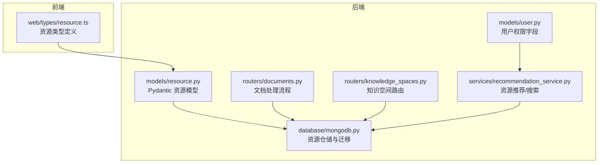
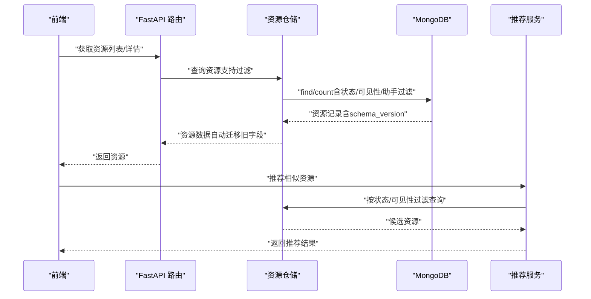
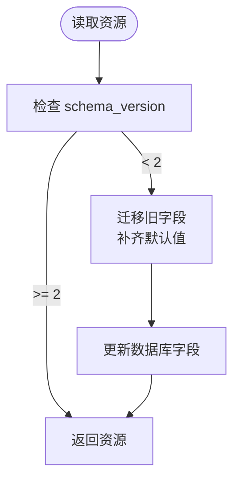
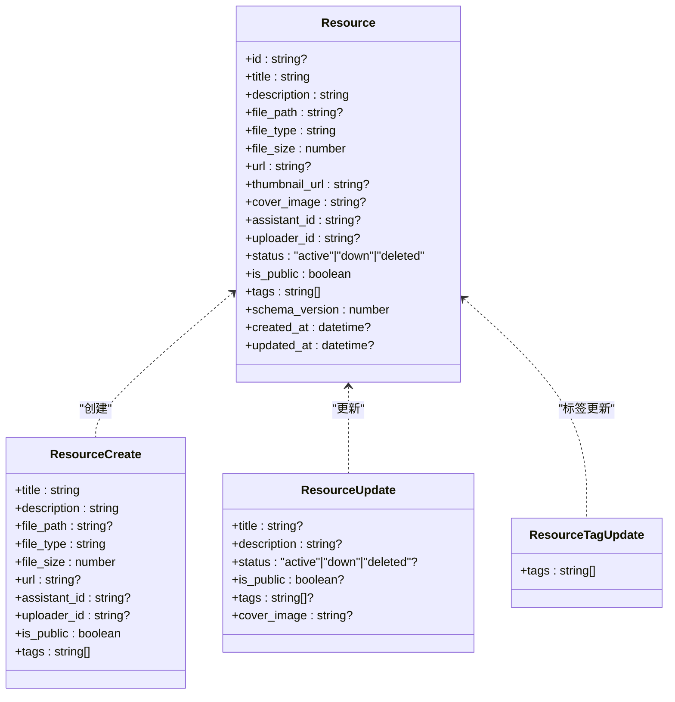

# 资源模型设计

<cite>
**本文引用的文件**
- [models/resource.py](file://models/resource.py)
- [web/types/resource.ts](file://web/types/resource.ts)
- [database/mongodb.py](file://database/mongodb.py)
- [routers/documents.py](file://routers/documents.py)
- [routers/knowledge_spaces.py](file://routers/knowledge_spaces.py)
- [utils/migrate_resources.py](file://utils/migrate_resources.py)
- [services/recommendation_service.py](file://services/recommendation_service.py)
- [models/user.py](file://models/user.py)
</cite>

## 目录
1. [引言](#引言)
2. [项目结构](#项目结构)
3. [核心组件](#核心组件)
4. [架构总览](#架构总览)
5. [详细组件分析](#详细组件分析)
6. [依赖分析](#依赖分析)
7. [性能考量](#性能考量)
8. [故障排查指南](#故障排查指南)
9. [结论](#结论)
10. [附录](#附录)

## 引言
本文件系统化阐述资源模型的设计与实现，覆盖数据结构、类型与状态管理、生命周期与版本控制、与文档/知识空间的关系、搜索与过滤字段设计，以及权限继承与访问控制方案。目标是帮助开发者与产品/运营人员全面理解资源模型，并为后续扩展与维护提供依据。

## 项目结构
围绕资源模型的关键文件分布如下：
- 后端模型定义：Python Pydantic 模型与MongoDB仓储层
- 前端类型定义：TypeScript 类型接口
- 路由与业务：文档路由与知识空间路由
- 迁移与版本控制：资源迁移脚本与仓储层自动迁移
- 推荐与搜索：基于关键词与向量的资源检索
- 权限模型：用户细粒度权限字段

图表来源
- [web/types/resource.ts:1-44](file://web/types/resource.ts#L1-L44)
- [models/resource.py:8-90](file://models/resource.py#L8-L90)
- [database/mongodb.py:875-1150](file://database/mongodb.py#L875-L1150)
- [routers/documents.py:1-1433](file://routers/documents.py#L1-L1433)
- [routers/knowledge_spaces.py:1-133](file://routers/knowledge_spaces.py#L1-L133)
- [services/recommendation_service.py:240-439](file://services/recommendation_service.py#L240-L439)
- [models/user.py:25-51](file://models/user.py#L25-L51)

章节来源
- [models/resource.py:8-90](file://models/resource.py#L8-L90)
- [web/types/resource.ts:1-44](file://web/types/resource.ts#L1-L44)
- [database/mongodb.py:875-1150](file://database/mongodb.py#L875-L1150)
- [routers/documents.py:1-1433](file://routers/documents.py#L1-L1433)
- [routers/knowledge_spaces.py:1-133](file://routers/knowledge_spaces.py#L1-L133)
- [services/recommendation_service.py:240-439](file://services/recommendation_service.py#L240-L439)
- [models/user.py:25-51](file://models/user.py#L25-L51)

## 核心组件
- 资源模型（Pydantic）：定义资源基本属性、元数据、访问控制字段、版本号与时间戳。
- 资源仓储（MongoDB）：提供资源的增删改查、计数、版本迁移、过滤与自动补全默认字段。
- 资源类型（TypeScript）：前端展示与交互所需字段集合，与后端模型保持一致。
- 文档处理流程：文档解析、分块、向量化、存储，涉及资源与知识空间的关联。
- 知识空间：隔离向量集合，决定资源的存储与检索边界。
- 推荐与搜索：关键词匹配、标签匹配、向量相似度，结合状态与可见性过滤。
- 权限模型：用户具备资源管理的细粒度权限位，用于访问控制决策。

章节来源
- [models/resource.py:8-90](file://models/resource.py#L8-L90)
- [database/mongodb.py:875-1150](file://database/mongodb.py#L875-L1150)
- [web/types/resource.ts:1-44](file://web/types/resource.ts#L1-L44)
- [routers/documents.py:1-1433](file://routers/documents.py#L1-L1433)
- [routers/knowledge_spaces.py:1-133](file://routers/knowledge_spaces.py#L1-L133)
- [services/recommendation_service.py:240-439](file://services/recommendation_service.py#L240-L439)
- [models/user.py:25-51](file://models/user.py#L25-L51)

## 架构总览
资源模型贯穿“模型定义—仓储持久化—路由业务—前端展示—推荐搜索—权限控制”的完整链路。资源与知识空间通过集合名称关联，与文档处理流程解耦但共享向量存储；推荐服务在搜索阶段严格遵循状态与可见性约束。

图表来源
- [routers/documents.py:1-1433](file://routers/documents.py#L1-L1433)
- [database/mongodb.py:875-1150](file://database/mongodb.py#L875-L1150)
- [services/recommendation_service.py:240-439](file://services/recommendation_service.py#L240-L439)

## 详细组件分析

### 资源数据结构设计
- 基本属性
  - 标识与元信息：id、title、description、file_type、file_size、created_at、updated_at
  - 文件与链接：file_path（可选）、url（可选，带URL格式校验）、thumbnail_url（可选，视频封面）
  - 封面：cover_image（可选，管理员上传）
  - 关联：assistant_id（可选，与助手关联）、uploader_id（可选，上传者）
- 访问控制
  - is_public：布尔，是否公开（所有用户可见）
  - status：枚举，"active"（正常）、"down"（下架）、"deleted"（已删除）
- 元数据
  - tags：标签列表（默认空数组）
  - schema_version：模型版本（默认2），用于兼容性迁移
- 前端类型
  - Resource/ResourceDetail：与后端模型字段对齐，补充uploader_*展示字段

章节来源
- [models/resource.py:8-90](file://models/resource.py#L8-L90)
- [web/types/resource.ts:1-44](file://web/types/resource.ts#L1-L44)

### 资源类型枚举与状态管理
- 状态枚举
  - active：正常可用
  - down：下架（仍可检索但不参与推荐）
  - deleted：删除（通常不返回，但保留历史）
- 状态变更
  - 通过更新请求模型允许变更 status/is_public/tags 等字段
  - 仓储层提供更新接口（如更新描述、标题）
- URL校验
  - 提供独立URL校验函数与创建/更新模型字段校验器，确保url格式合法

章节来源
- [models/resource.py:21-21](file://models/resource.py#L21-L21)
- [models/resource.py:77-84](file://models/resource.py#L77-L84)
- [models/resource.py:42-58](file://models/resource.py#L42-L58)
- [models/resource.py:61-74](file://models/resource.py#L61-L74)

### 生命周期管理与版本控制策略
- 生命周期阶段
  - 创建：记录基础信息、默认字段、schema_version
  - 处理：文档解析/分块/向量化/存储（与资源关联，但资源本身可独立存在）
  - 运行期：状态变更（active/down/deleted）、可见性变更（is_public）
  - 归档/删除：deleted标记，配合检索过滤
- 版本控制
  - schema_version：默认2，旧版本自动迁移
  - 自动迁移：仓储层在读取时检测并补齐缺失字段，批量迁移脚本支持全量升级
  - 迁移脚本：支持从旧目录迁移资源文件并更新数据库路径

图表来源
- [database/mongodb.py:885-948](file://database/mongodb.py#L885-L948)
- [database/mongodb.py:950-988](file://database/mongodb.py#L950-L988)
- [database/mongodb.py:1067-1137](file://database/mongodb.py#L1067-L1137)
- [utils/migrate_resources.py:132-261](file://utils/migrate_resources.py#L132-L261)

章节来源
- [database/mongodb.py:885-948](file://database/mongodb.py#L885-L948)
- [database/mongodb.py:950-988](file://database/mongodb.py#L950-L988)
- [database/mongodb.py:1067-1137](file://database/mongodb.py#L1067-L1137)
- [utils/migrate_resources.py:132-261](file://utils/migrate_resources.py#L132-L261)

### 资源与文档、知识空间的关联关系设计
- 文档到资源
  - 文档处理流程包含解析、分块、向量化与存储，资源作为文档的载体之一存在
  - 文档路由负责大文件解析、分块、向量化与存储，知识空间决定向量集合归属
- 知识空间到资源
  - 知识空间路由提供集合名称（collection_name），用于区分不同知识域的向量集合
  - 文档处理流程根据知识空间ID选择集合名称，实现资源的物理隔离
- 关联字段
  - 资源模型未直接包含知识空间ID字段，但可通过文档处理流程与知识空间间接关联
  - 资源可携带 assistant_id 以便按助手维度筛选

图表来源
- [routers/documents.py:274-721](file://routers/documents.py#L274-L721)
- [routers/knowledge_spaces.py:24-133](file://routers/knowledge_spaces.py#L24-L133)

章节来源
- [routers/documents.py:274-721](file://routers/documents.py#L274-L721)
- [routers/knowledge_spaces.py:24-133](file://routers/knowledge_spaces.py#L24-L133)

### 资源搜索与过滤字段设计
- 搜索入口
  - 推荐服务：关键词提取、标签匹配、向量相似度，综合评分排序
  - 列表查询：支持按状态、可见性、助手ID过滤
- 过滤字段
  - 状态：status（active/down/deleted）
  - 可见性：is_public（布尔）
  - 助手：assistant_id（可选）
  - 标签：tags（列表）
- 推荐权重
  - 向量相似度、关键词匹配、标签匹配的加权组合，保证召回质量与相关性

章节来源
- [services/recommendation_service.py:240-439](file://services/recommendation_service.py#L240-L439)
- [database/mongodb.py:990-1049](file://database/mongodb.py#L990-L1049)

### 权限继承与访问控制方案
- 用户权限位
  - 用户模型包含资源管理的细粒度权限位（查看/创建/编辑/删除）
- 访问控制实践
  - 推荐与搜索阶段：默认仅返回 active 且 is_public 的资源
  - 列表查询：支持按 is_public 过滤
  - 建议在路由层与服务层增加鉴权中间件，结合用户权限位与资源所属关系进行二次校验

章节来源
- [models/user.py:25-51](file://models/user.py#L25-L51)
- [services/recommendation_service.py:278-280](file://services/recommendation_service.py#L278-L280)
- [database/mongodb.py:1008-1009](file://database/mongodb.py#L1008-L1009)

## 依赖分析
- 模型与仓储
  - Resource/ResourceCreate/ResourceUpdate 等模型与 MongoDB 仓储紧密耦合，仓储负责字段默认值补齐与版本迁移
- 路由与服务
  - 文档路由承担大文件处理与向量化存储职责，与资源模型解耦但共享知识空间集合
  - 推荐服务依赖仓储查询与过滤能力
- 前后端类型一致性
  - TypeScript 类型与 Python 模型字段保持一致，减少跨端差异

图表来源
- [models/resource.py:8-90](file://models/resource.py#L8-L90)

章节来源
- [models/resource.py:8-90](file://models/resource.py#L8-L90)

## 性能考量
- 向量存储与检索
  - 文档处理流程采用分批向量化与批量插入，降低内存峰值与网络抖动影响
  - 知识空间集合名称决定向量集合，便于按域隔离与扩展
- 查询与过滤
  - 仓储提供按状态、可见性、助手ID的过滤，建议在高频查询字段建立索引
- 迁移与兼容
  - 自动迁移与批量迁移脚本保障历史数据平滑升级，避免线上停机

章节来源
- [routers/documents.py:457-691](file://routers/documents.py#L457-L691)
- [database/mongodb.py:1067-1137](file://database/mongodb.py#L1067-L1137)

## 故障排查指南
- URL 校验失败
  - 现象：创建/更新资源时抛出URL格式错误
  - 排查：确认url符合http/https协议与域名/IP格式
- 资源不可见
  - 现象：推荐/列表中看不到资源
  - 排查：检查status是否为active，is_public是否为True；确认过滤条件
- 资源迁移异常
  - 现象：旧版本资源字段缺失或版本号未更新
  - 排查：执行批量迁移脚本；检查数据库连接与权限
- 文件路径迁移失败
  - 现象：资源文件找不到或路径不正确
  - 排查：运行资源迁移脚本，确认新资源目录存在且可写

章节来源
- [models/resource.py:42-58](file://models/resource.py#L42-L58)
- [services/recommendation_service.py:278-280](file://services/recommendation_service.py#L278-L280)
- [database/mongodb.py:1067-1137](file://database/mongodb.py#L1067-L1137)
- [utils/migrate_resources.py:132-261](file://utils/migrate_resources.py#L132-L261)

## 结论
资源模型以清晰的字段划分与严格的版本控制为基础，结合仓储层的自动迁移与前后端类型一致性，支撑起文档处理、知识空间隔离、推荐搜索与权限控制的完整闭环。建议在路由层与服务层进一步强化鉴权与审计，持续优化查询索引与向量存储策略，以提升系统稳定性与性能。

## 附录
- 字段对照与默认值
  - status：默认"active"
  - is_public：默认True
  - tags：默认[]
  - uploader_id/thumbnail_url：默认None
  - schema_version：默认2
- 前端展示字段
  - Resource/ResourceDetail：包含uploader_*展示字段，便于UI呈现

章节来源
- [models/resource.py:21-26](file://models/resource.py#L21-L26)
- [web/types/resource.ts:19-25](file://web/types/resource.ts#L19-L25)