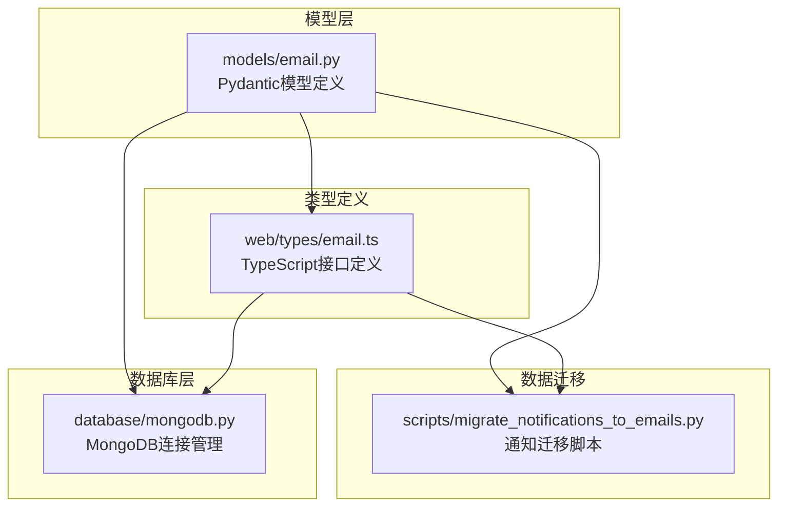
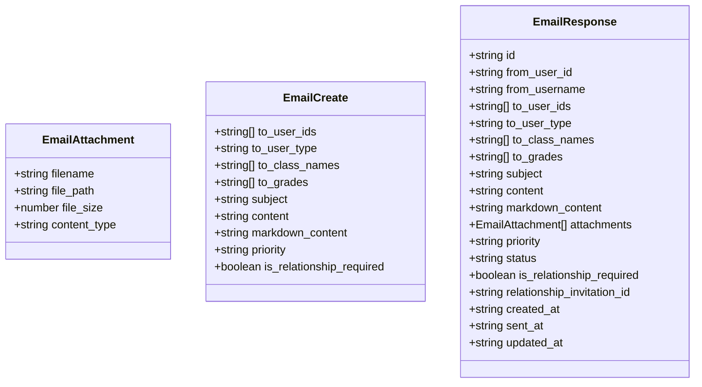
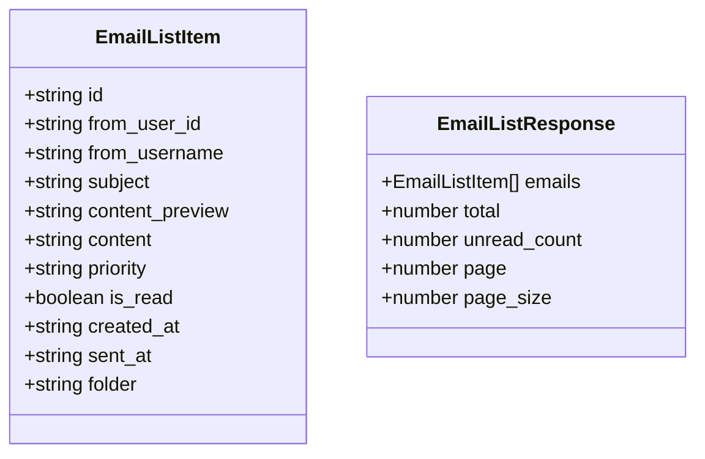
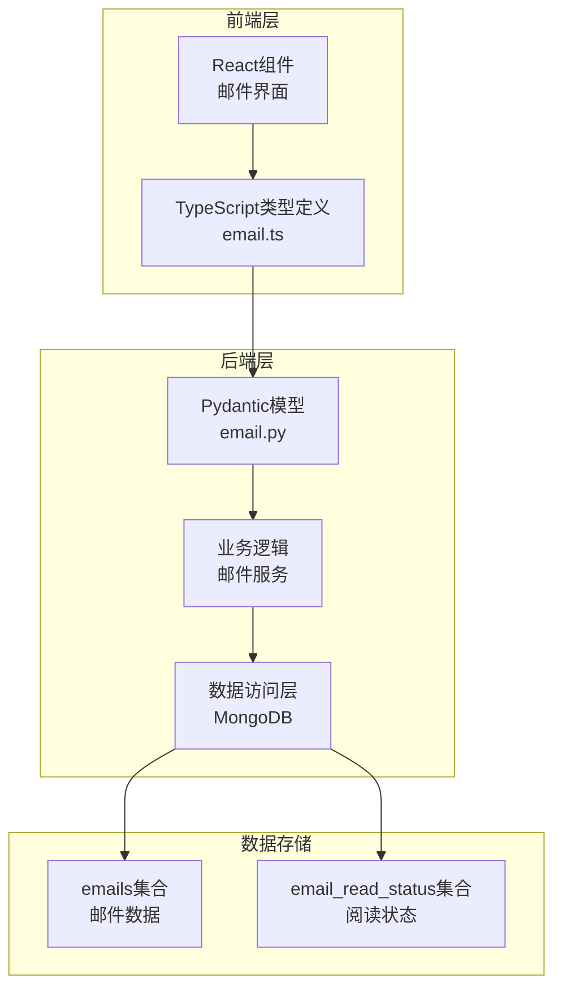
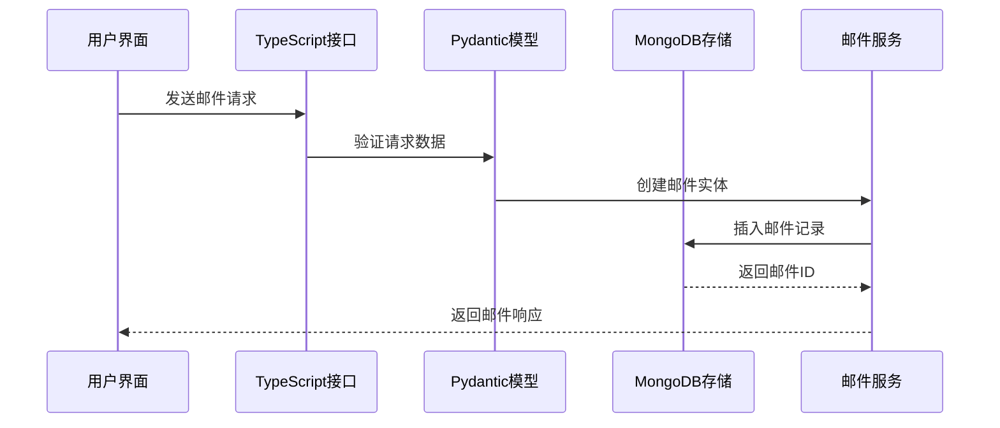
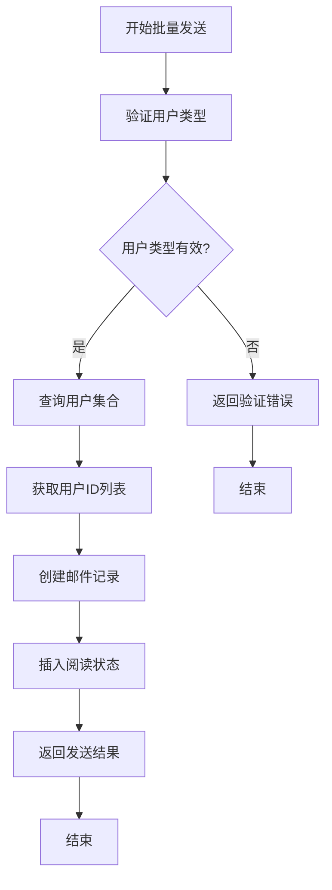
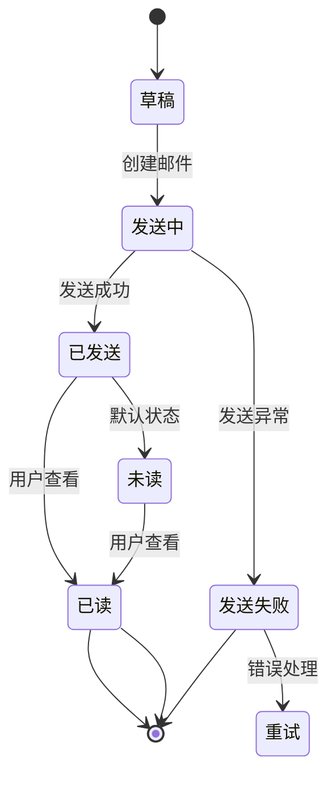
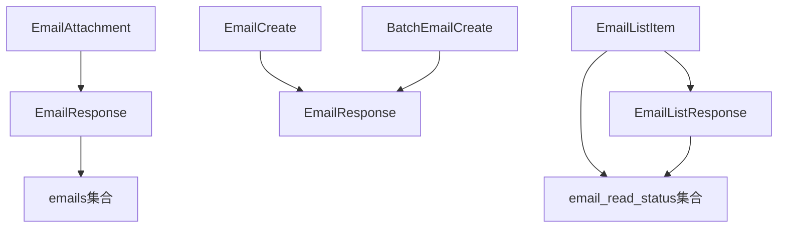
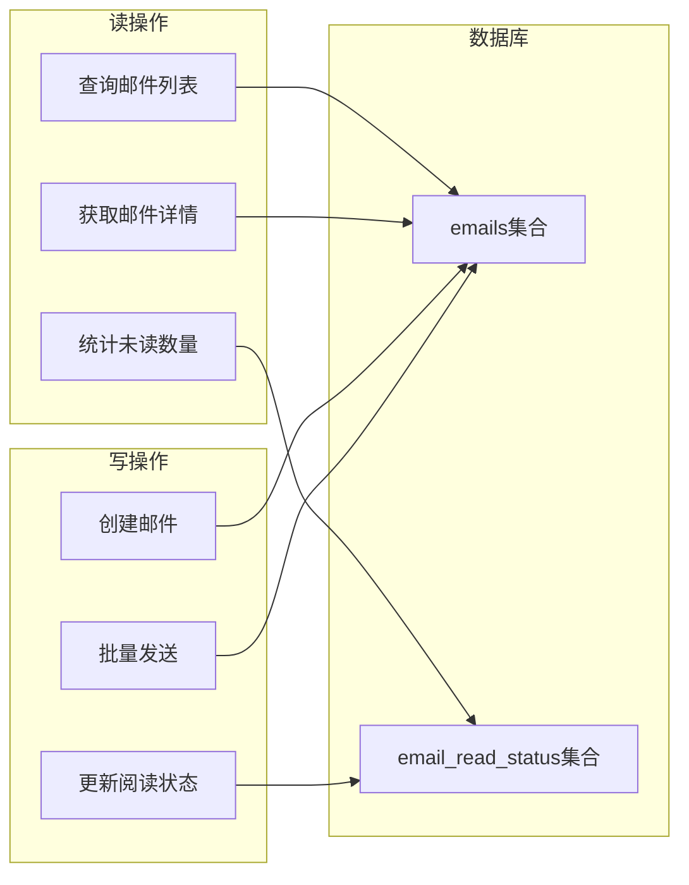

# 邮件模型设计

<cite>
**本文档引用的文件**
- [models/email.py](file://models/email.py)
- [web/types/email.ts](file://web/types/email.ts)
- [scripts/migrate_notifications_to_emails.py](file://scripts/migrate_notifications_to_emails.py)
- [database/mongodb.py](file://database/mongodb.py)
</cite>

## 目录
1. [引言](#引言)
2. [项目结构](#项目结构)
3. [核心组件](#核心组件)
4. [架构概览](#架构概览)
5. [详细组件分析](#详细组件分析)
6. [依赖分析](#依赖分析)
7. [性能考虑](#性能考虑)
8. [故障排除指南](#故障排除指南)
9. [结论](#结论)

## 引言

本文档详细阐述了高级RAG项目中的邮件模型设计。该系统实现了完整的邮件功能，包括邮件创建、发送、接收、阅读状态管理以及批量发送机制。系统采用Python Pydantic模型定义数据结构，并通过TypeScript接口确保前端与后端的数据一致性。

## 项目结构

邮件系统在项目中的组织结构如下：

**图表来源**
- [models/email.py:1-104](file://models/email.py#L1-L104)
- [web/types/email.ts:1-89](file://web/types/email.ts#L1-L89)
- [scripts/migrate_notifications_to_emails.py:1-169](file://scripts/migrate_notifications_to_emails.py#L1-L169)
- [database/mongodb.py:1-800](file://database/mongodb.py#L1-L800)

**章节来源**
- [models/email.py:1-104](file://models/email.py#L1-L104)
- [web/types/email.ts:1-89](file://web/types/email.ts#L1-L89)
- [scripts/migrate_notifications_to_emails.py:1-169](file://scripts/migrate_notifications_to_emails.py#L1-L169)
- [database/mongodb.py:1-800](file://database/mongodb.py#L1-L800)

## 核心组件

### 邮件附件模型

邮件附件使用独立的模型进行管理，确保附件信息的完整性和一致性：

**图表来源**
- [models/email.py:7-67](file://models/email.py#L7-L67)

### 邮件列表模型

系统提供了专门的邮件列表模型，支持分页和未读计数功能：

**图表来源**
- [models/email.py:70-92](file://models/email.py#L70-L92)

**章节来源**
- [models/email.py:7-103](file://models/email.py#L7-L103)

## 架构概览

邮件系统采用分层架构设计，确保前后端数据一致性和系统的可扩展性：

**图表来源**
- [web/types/email.ts:13-32](file://web/types/email.ts#L13-L32)
- [models/email.py:15-67](file://models/email.py#L15-L67)
- [database/mongodb.py:191-196](file://database/mongodb.py#L191-L196)

## 详细组件分析

### 邮件创建流程

邮件创建流程展示了从用户输入到数据库存储的完整过程：

**图表来源**
- [web/types/email.ts:56-66](file://web/types/email.ts#L56-L66)
- [models/email.py:15-34](file://models/email.py#L15-L34)
- [database/mongodb.py:191-196](file://database/mongodb.py#L191-L196)

### 批量邮件发送机制

系统支持管理员批量发送邮件的功能，通过用户类型过滤实现精准推送：

**图表来源**
- [models/email.py:94-103](file://models/email.py#L94-L103)
- [scripts/migrate_notifications_to_emails.py:63-72](file://scripts/migrate_notifications_to_emails.py#L63-L72)

### 邮件状态管理

邮件状态管理系统确保邮件生命周期的完整跟踪：

**图表来源**
- [models/email.py:62](file://models/email.py#L62)
- [web/types/email.ts:2](file://web/types/email.ts#L2)

**章节来源**
- [models/email.py:15-103](file://models/email.py#L15-L103)
- [web/types/email.ts:13-46](file://web/types/email.ts#L13-L46)

## 依赖分析

### 数据模型依赖关系

邮件系统的数据模型之间存在清晰的依赖关系，确保数据完整性：

**图表来源**
- [models/email.py:7-92](file://models/email.py#L7-L92)

### 前后端数据一致性

TypeScript类型定义与Pydantic模型保持严格的一致性，确保数据传输的可靠性：

| 字段名称 | Python类型 | TypeScript类型 | 必填性 |
|---------|-----------|---------------|--------|
| id | string | string | 必填 |
| subject | string | string | 必填 |
| content | string | string | 必填 |
| attachments | List[EmailAttachment] | EmailAttachment[] | 可选 |
| status | Literal["draft","sent","deleted"] | EmailStatus | 必填 |
| priority | Literal["low","normal","high","urgent"] | EmailPriority | 必填 |
| folder | Literal["inbox","sent","draft","trash"] | EmailFolder | 必填 |

**章节来源**
- [models/email.py:7-103](file://models/email.py#L7-L103)
- [web/types/email.ts:1-89](file://web/types/email.ts#L1-L89)

## 性能考虑

### 数据库连接优化

系统采用连接池管理MongoDB连接，提高并发性能：

- **最大连接池大小**: 100个连接
- **最小连接池大小**: 10个连接  
- **连接超时**: 10秒
- **Socket超时**: 30秒
- **服务器选择超时**: 5秒
- **最大空闲时间**: 30秒

### 读写分离策略

邮件系统采用读写分离的设计模式：

**图表来源**
- [database/mongodb.py:122-136](file://database/mongodb.py#L122-L136)

## 故障排除指南

### 常见问题及解决方案

1. **邮件发送失败**
   - 检查SMTP配置
   - 验证收件人邮箱格式
   - 查看邮件队列状态

2. **阅读状态不同步**
   - 确认email_read_status集合存在
   - 检查用户ID映射关系
   - 验证文件哈希计算

3. **批量发送性能问题**
   - 调整连接池参数
   - 优化用户查询条件
   - 实施分批处理机制

### 数据迁移注意事项

通知系统到邮件系统的迁移需要特别注意以下事项：

- **数据完整性**: 确保所有通知记录都已迁移
- **阅读状态同步**: 正确映射通知阅读状态到邮件阅读状态
- **用户权限**: 验证收件人权限和班级年级过滤条件

**章节来源**
- [scripts/migrate_notifications_to_emails.py:17-145](file://scripts/migrate_notifications_to_emails.py#L17-L145)

## 结论

高级RAG项目的邮件模型设计展现了现代Web应用的优秀实践。通过Pydantic和TypeScript的双重验证机制，确保了数据的完整性和一致性。系统的模块化设计便于维护和扩展，而连接池优化则保证了良好的性能表现。

未来可以考虑引入邮件模板引擎、更精细的权限控制以及更完善的错误重试机制，进一步提升系统的智能化水平和用户体验。