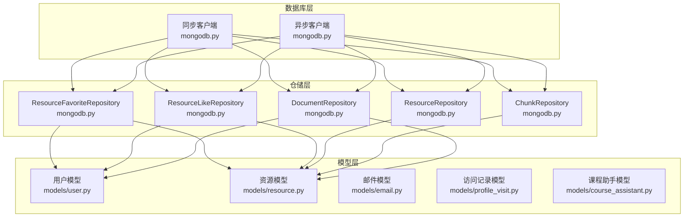
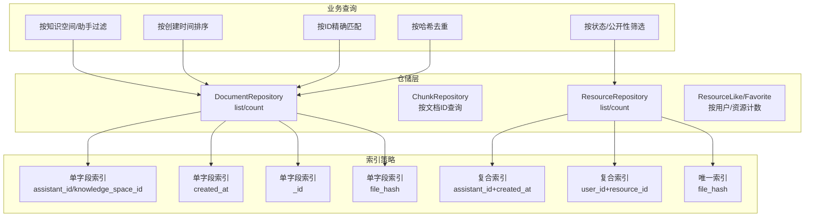
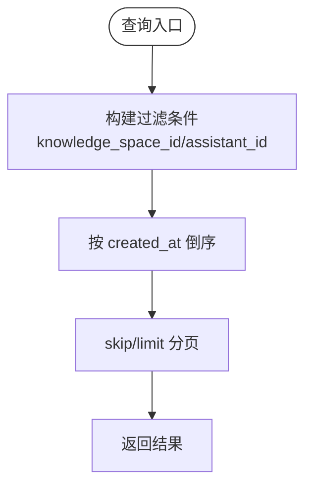
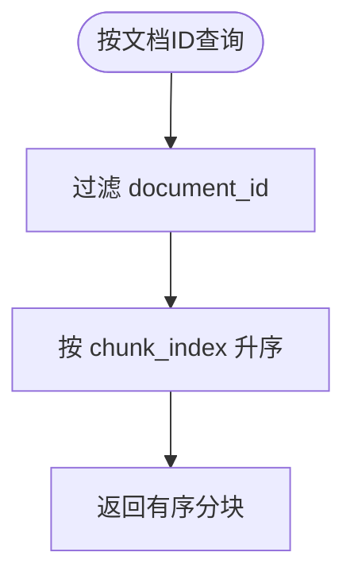
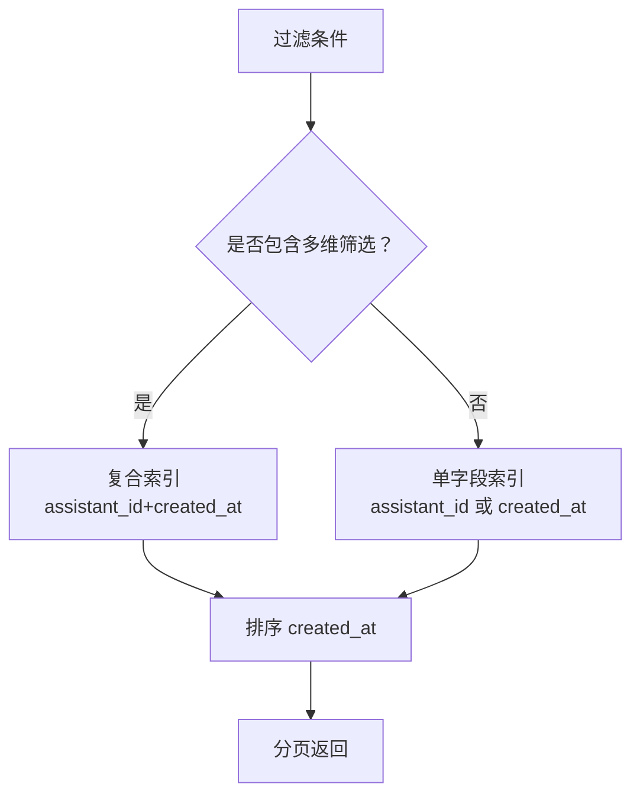
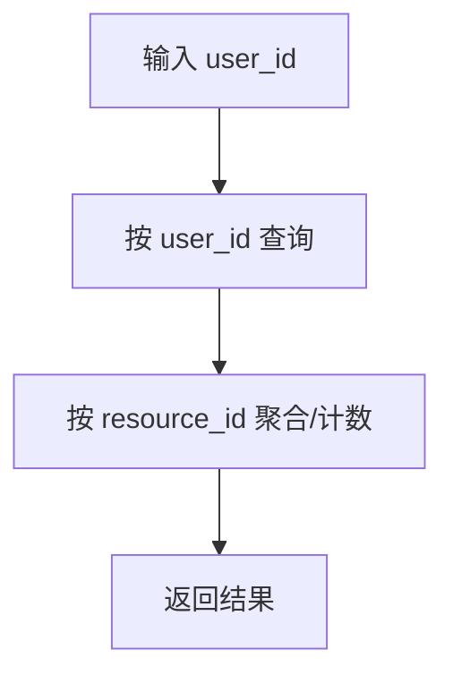
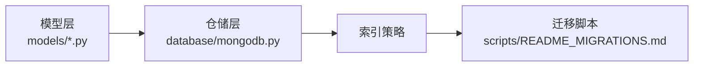

# 索引策略

<cite>
**本文引用的文件**
- [database/mongodb.py](file://database/mongodb.py)
- [models/user.py](file://models/user.py)
- [models/resource.py](file://models/resource.py)
- [models/email.py](file://models/email.py)
- [models/profile_visit.py](file://models/profile_visit.py)
- [models/course_assistant.py](file://models/course_assistant.py)
- [scripts/README_MIGRATIONS.md](file://scripts/README_MIGRATIONS.md)
</cite>

## 目录
1. [简介](#简介)
2. [项目结构](#项目结构)
3. [核心组件](#核心组件)
4. [架构总览](#架构总览)
5. [详细组件分析](#详细组件分析)
6. [依赖分析](#依赖分析)
7. [性能考量](#性能考量)
8. [故障排查指南](#故障排查指南)
9. [结论](#结论)
10. [附录](#附录)

## 简介
本文件面向 advanced-rag 项目，系统化梳理 MongoDB 索引策略与最佳实践，覆盖单字段索引、复合索引、唯一索引、部分索引与稀疏索引的应用场景，并结合项目实际查询模式给出索引设计建议。同时提供索引创建、维护与监控的方法论，以及查询计划优化与索引失效排查思路。

## 项目结构
- 数据库层通过异步与同步客户端封装，统一连接与集合访问入口，便于集中管理索引与查询。
- 数据模型定义清晰，涵盖用户、资源、邮件、访问记录、课程助手等实体，为索引设计提供字段依据。
- 迁移脚本说明文档明确列出“创建MongoDB索引”迁移任务，指导索引初始化与维护。

**图表来源**
- [database/mongodb.py:92-196](file://database/mongodb.py#L92-L196)
- [database/mongodb.py:315-807](file://database/mongodb.py#L315-L807)
- [database/mongodb.py:809-1284](file://database/mongodb.py#L809-L1284)
- [models/user.py:8-28](file://models/user.py#L8-L28)
- [models/resource.py:8-27](file://models/resource.py#L8-L27)
- [models/email.py:15-26](file://models/email.py#L15-L26)
- [models/profile_visit.py:7-12](file://models/profile_visit.py#L7-L12)
- [models/course_assistant.py:8-23](file://models/course_assistant.py#L8-L23)

**章节来源**
- [database/mongodb.py:92-196](file://database/mongodb.py#L92-L196)
- [database/mongodb.py:315-1284](file://database/mongodb.py#L315-L1284)
- [models/user.py:8-28](file://models/user.py#L8-L28)
- [models/resource.py:8-27](file://models/resource.py#L8-L27)
- [models/email.py:15-26](file://models/email.py#L15-L26)
- [models/profile_visit.py:7-12](file://models/profile_visit.py#L7-L12)
- [models/course_assistant.py:8-23](file://models/course_assistant.py#L8-L23)

## 核心组件
- 异步/同步 MongoDB 客户端：负责连接、集合获取与基础连接池配置。
- 仓储层：围绕集合封装 CRUD 与查询，承载索引设计的业务语义。
- 模型层：定义字段与约束，为索引选择提供依据。

关键要点
- 仓储层查询模式决定索引优先级：排序、过滤、范围查询、聚合等。
- 模型字段的唯一性、可空性、默认值等属性直接影响索引策略（唯一、部分、稀疏）。

**章节来源**
- [database/mongodb.py:92-196](file://database/mongodb.py#L92-L196)
- [database/mongodb.py:315-1284](file://database/mongodb.py#L315-L1284)
- [models/user.py:8-28](file://models/user.py#L8-L28)
- [models/resource.py:8-27](file://models/resource.py#L8-L27)

## 架构总览
下图展示索引策略在系统中的位置与作用：仓储层的查询条件驱动索引设计，模型层的字段约束决定索引类型，迁移脚本负责索引的初始化与维护。

**图表来源**
- [database/mongodb.py:479-525](file://database/mongodb.py#L479-L525)
- [database/mongodb.py:799-807](file://database/mongodb.py#L799-L807)
- [database/mongodb.py:990-1026](file://database/mongodb.py#L990-L1026)
- [database/mongodb.py:1187-1224](file://database/mongodb.py#L1187-L1224)
- [database/mongodb.py:1241-1283](file://database/mongodb.py#L1241-L1283)

## 详细组件分析

### 文档集合（documents）索引策略
- 查询模式
  - 按知识空间/助手过滤 + 时间倒序分页：list_documents
  - 按 ID 查询：get_document
  - 按文件哈希去重：find_duplicate_by_hash
  - 统计总数：count_documents
- 推荐索引
  - 单字段索引
    - knowledge_space_id / assistant_id：加速过滤
    - created_at：加速排序与分页
    - _id：主键索引（默认）
  - 复合索引
    - (knowledge_space_id, created_at)：满足“按知识空间过滤+按时间排序”的常见组合
    - (assistant_id, created_at)：向后兼容
  - 唯一索引
    - file_hash：防止重复导入
- 设计理由
  - 上述查询均以过滤+排序为主，复合索引可显著减少回表与排序成本。
  - 唯一索引保障数据一致性，避免重复文档。

**图表来源**
- [database/mongodb.py:479-525](file://database/mongodb.py#L479-L525)

**章节来源**
- [database/mongodb.py:479-525](file://database/mongodb.py#L479-L525)
- [database/mongodb.py:324-338](file://database/mongodb.py#L324-L338)

### 分块集合（chunks）索引策略
- 查询模式
  - 按文档 ID 查询并按索引排序：get_chunks_by_document
- 推荐索引
  - 复合索引：(document_id, chunk_index)：满足“按文档过滤+顺序读取”
- 设计理由
  - 保证分块读取的稳定性与顺序性，避免额外排序。

**图表来源**
- [database/mongodb.py:799-807](file://database/mongodb.py#L799-L807)

**章节来源**
- [database/mongodb.py:799-807](file://database/mongodb.py#L799-L807)

### 资源集合（resources）索引策略
- 查询模式
  - 按助手过滤 + 状态 + 公开性 + 时间倒序分页：list_resources
  - 按 ID 查询：get_resource
  - 统计总数：count_resources
  - 标签/状态等字段的筛选与聚合
- 推荐索引
  - 单字段索引
    - assistant_id：加速过滤
    - created_at：加速排序
    - is_public：加速公开性筛选
    - status：加速状态筛选
  - 复合索引
    - (assistant_id, created_at)：满足“按助手过滤+时间排序”
    - (is_public, created_at)：满足“公开资源+时间排序”
    - (status, is_public, created_at)：满足“状态+公开性+时间排序”
  - 唯一索引
    - schema_version 与业务唯一性字段（视业务需求）

**图表来源**
- [database/mongodb.py:990-1026](file://database/mongodb.py#L990-L1026)
- [database/mongodb.py:1030-1049](file://database/mongodb.py#L1030-L1049)

**章节来源**
- [database/mongodb.py:990-1049](file://database/mongodb.py#L990-L1049)

### 点赞/收藏集合（resource_likes, resource_favorites）索引策略
- 查询模式
  - 按用户/资源计数与去重判断：like/is_liked/count_likes
  - 按用户列出其点赞/收藏资源
- 推荐索引
  - 复合索引：(user_id, resource_id)：满足唯一性约束与高效查询
  - 单字段索引：user_id、resource_id（分别用于按用户查询与按资源统计）

**图表来源**
- [database/mongodb.py:1187-1224](file://database/mongodb.py#L1187-L1224)
- [database/mongodb.py:1241-1283](file://database/mongodb.py#L1241-L1283)

**章节来源**
- [database/mongodb.py:1187-1283](file://database/mongodb.py#L1187-L1283)

### 用户集合（users）索引策略
- 查询模式
  - 登录/鉴权：用户名/邮箱精确匹配
  - 用户资料访问：ID 精确匹配
  - 权限控制：角色/类型等字段筛选
- 推荐索引
  - 唯一索引：username、email（唯一性约束）
  - 单字段索引：role、user_type、is_active（加速权限与状态筛选）
  - 复合索引：(role, is_active)、(user_type, is_active)

**章节来源**
- [models/user.py:8-28](file://models/user.py#L8-L28)

### 邮件集合（emails）索引策略
- 查询模式
  - 按收件人/发件人、文件类型、优先级、状态等筛选
  - 按时间排序与分页
- 推荐索引
  - 单字段索引：to_user_ids、priority、status、created_at
  - 复合索引：(to_user_ids, created_at)、(priority, created_at)

**章节来源**
- [models/email.py:15-26](file://models/email.py#L15-L26)

### 访问记录集合（profile_visits）索引策略
- 查询模式
  - 按被访用户/访问者、时间范围查询
- 推荐索引
  - 单字段索引：visited_user_id、visitor_id、visited_at
  - 复合索引：(visited_user_id, visited_at)、(visitor_id, visited_at)

**章节来源**
- [models/profile_visit.py:7-12](file://models/profile_visit.py#L7-L12)

### 课程助手集合（course_assistants）索引策略
- 查询模式
  - 默认助手、名称、集合名等字段的筛选与排序
- 推荐索引
  - 单字段索引：is_default、name、collection_name
  - 复合索引：(is_default, created_at)

**章节来源**
- [models/course_assistant.py:8-23](file://models/course_assistant.py#L8-L23)

## 依赖分析
- 仓储层依赖模型层字段定义，索引设计需与模型约束一致（如唯一性、可空性）。
- 迁移脚本说明文档明确“创建MongoDB索引”迁移任务，指导索引初始化与维护。

**图表来源**
- [database/mongodb.py:315-1284](file://database/mongodb.py#L315-L1284)
- [models/user.py:8-28](file://models/user.py#L8-L28)
- [models/resource.py:8-27](file://models/resource.py#L8-L27)
- [scripts/README_MIGRATIONS.md:50-55](file://scripts/README_MIGRATIONS.md#L50-L55)

**章节来源**
- [database/mongodb.py:315-1284](file://database/mongodb.py#L315-L1284)
- [models/user.py:8-28](file://models/user.py#L8-L28)
- [models/resource.py:8-27](file://models/resource.py#L8-L27)
- [scripts/README_MIGRATIONS.md:50-55](file://scripts/README_MIGRATIONS.md#L50-L55)

## 性能考量
- 索引选择原则
  - 优先满足最频繁的过滤条件与排序字段，减少回表与排序成本。
  - 复合索引的列顺序应遵循“过滤在前、排序在后”的原则。
- 写入与读取平衡
  - 唯一索引提升读取效率，但会增加写入开销，需权衡。
  - 部分索引与稀疏索引适用于“只对特定文档建立索引”的场景，降低索引体积。
- 监控与评估
  - 使用 explain 输出查询计划，关注是否使用了预期索引、是否发生全表扫描或排序。
  - 定期评估索引选择性与命中率，清理低效索引。

[本节为通用指导，无需特定文件来源]

## 故障排查指南
- 索引创建失败
  - 检查索引名称是否冲突；确认字段存在且类型正确；查看数据库日志定位错误。
- 查询未命中索引
  - 使用 explain 分析查询计划，确认过滤条件与排序字段是否与索引匹配。
  - 检查复合索引的列顺序是否合理。
- 索引维护
  - 通过迁移脚本统一创建与更新索引，避免手工遗漏。
  - 对于唯一索引，注意数据清洗与去重，避免违反唯一约束。

**章节来源**
- [scripts/README_MIGRATIONS.md:124-128](file://scripts/README_MIGRATIONS.md#L124-L128)

## 结论
- advanced-rag 的查询模式以“过滤+排序+分页”为主，索引设计应围绕这些模式展开。
- 唯一索引用于保障数据一致性（如用户名、邮箱、文件哈希），部分索引与稀疏索引用于精细化控制索引范围。
- 建议通过迁移脚本统一管理索引生命周期，并持续监控查询计划与性能指标。

[本节为总结，无需特定文件来源]

## 附录
- 迁移脚本说明
  - “创建MongoDB索引”迁移任务用于初始化必要索引，建议在部署或升级时执行。
  - 如需强制重新运行或查看状态，可参考迁移脚本说明文档。

**章节来源**
- [scripts/README_MIGRATIONS.md:50-55](file://scripts/README_MIGRATIONS.md#L50-L55)