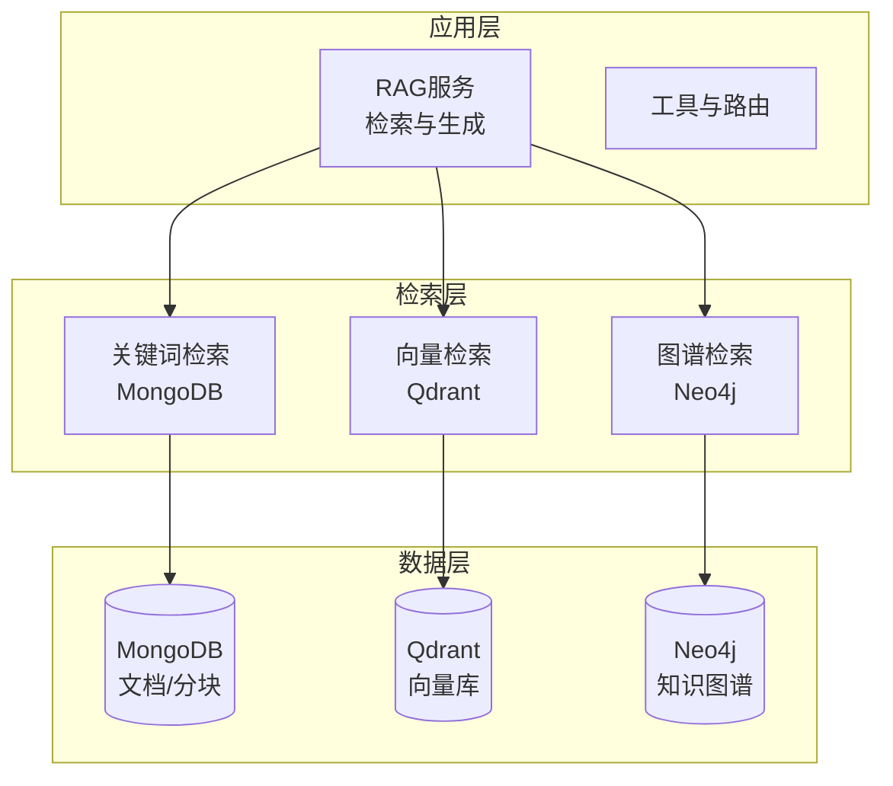
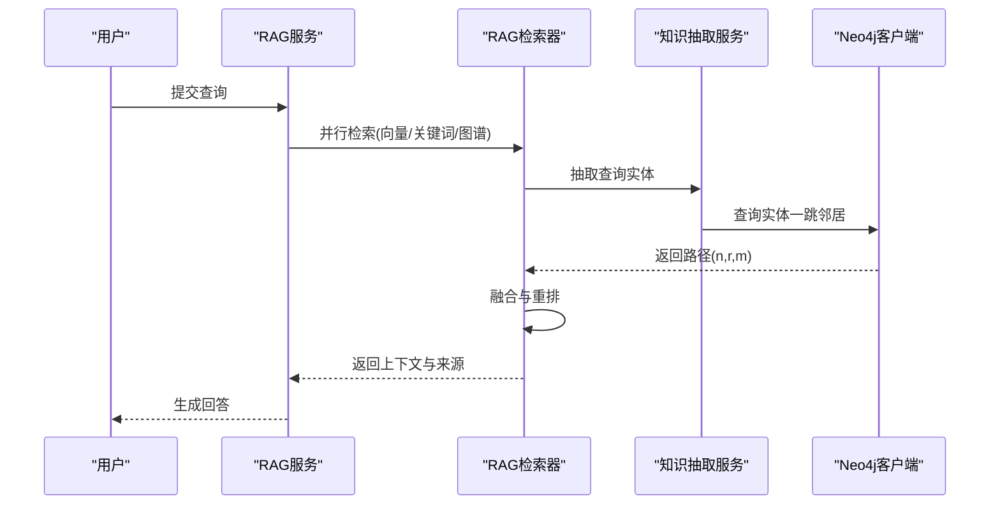
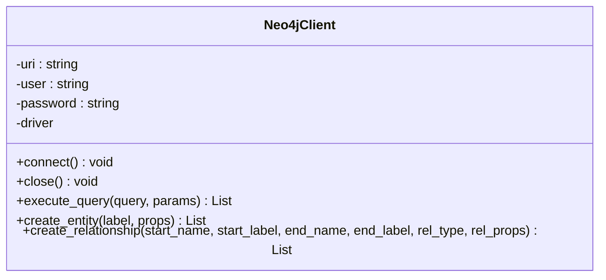
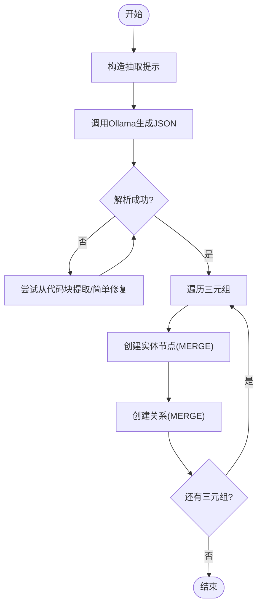
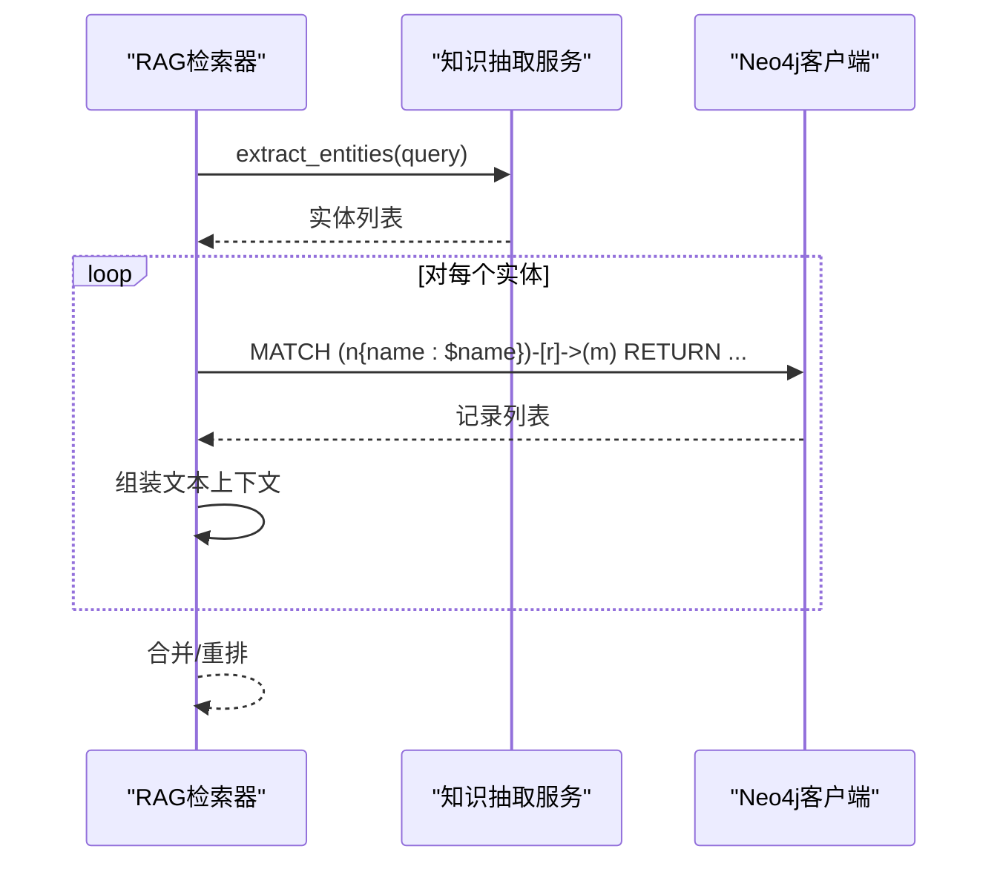
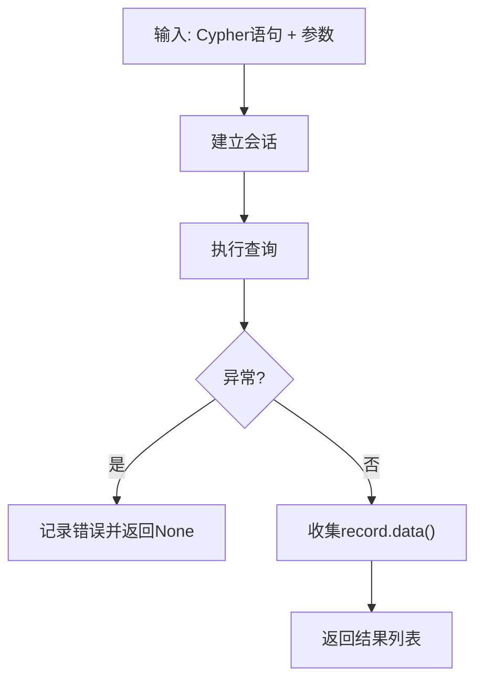
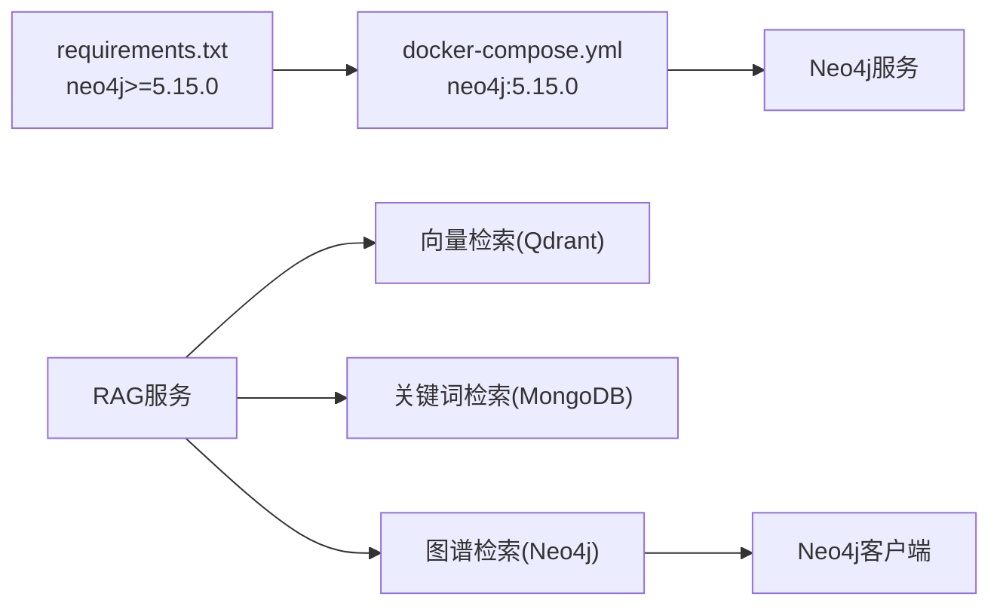

# Neo4j图数据库

<cite>
**本文档引用的文件**
- [neo4j_client.py](file://database/neo4j_client.py)
- [knowledge_extraction_service.py](file://services/knowledge_extraction_service.py)
- [rag_retriever.py](file://retrieval/rag_retriever.py)
- [docker-compose.yml](file://docker-compose.yml)
- [requirements.txt](file://requirements.txt)
- [mongodb.py](file://database/mongodb.py)
- [qdrant_client.py](file://database/qdrant_client.py)
- [rag_service.py](file://services/rag_service.py)
</cite>

## 目录
1. [简介](#简介)
2. [项目结构](#项目结构)
3. [核心组件](#核心组件)
4. [架构总览](#架构总览)
5. [详细组件分析](#详细组件分析)
6. [依赖关系分析](#依赖关系分析)
7. [性能考虑](#性能考虑)
8. [故障排除指南](#故障排除指南)
9. [结论](#结论)
10. [附录](#附录)

## 简介
本文件面向Neo4j图数据库在知识图谱构建中的应用，系统梳理了项目中基于Neo4j的图数据模型设计、知识抽取服务的结构化数据到图结构转换流程、Cypher查询模式（含复杂查询、路径查找与图遍历）、性能优化策略（索引、查询计划、事务管理）、导入导出与备份恢复方案以及与RAG系统的知识推理与关联分析集成。

## 项目结构
项目采用多数据库协同架构：MongoDB负责文档与分块元数据存储，Qdrant负责向量检索，Neo4j负责知识图谱存储与检索，RAG服务协调多源检索与融合。

**图表来源**
- [docker-compose.yml:1-76](file://docker-compose.yml#L1-L76)
- [rag_service.py:64-83](file://services/rag_service.py#L64-L83)
- [rag_retriever.py:82-101](file://retrieval/rag_retriever.py#L82-L101)

**章节来源**
- [docker-compose.yml:1-76](file://docker-compose.yml#L1-L76)
- [requirements.txt:9-13](file://requirements.txt#L9-L13)

## 核心组件
- Neo4j客户端：提供连接、查询执行、实体与关系创建能力，支持容器环境URI适配与连接健康检查。
- 知识抽取服务：通过LLM抽取三元组，规范化实体类型与关系，将结构化三元组写入Neo4j。
- RAG检索器：并行执行向量、关键词与图谱检索，融合结果并可选重排。
- MongoDB/Qdrant：分别支撑文档元数据与向量检索，为RAG提供基础检索能力。

**章节来源**
- [neo4j_client.py:6-103](file://database/neo4j_client.py#L6-L103)
- [knowledge_extraction_service.py:10-210](file://services/knowledge_extraction_service.py#L10-L210)
- [rag_retriever.py:22-101](file://retrieval/rag_retriever.py#L22-L101)
- [mongodb.py:92-196](file://database/mongodb.py#L92-L196)
- [qdrant_client.py:18-139](file://database/qdrant_client.py#L18-L139)

## 架构总览
Neo4j在本项目中承担知识图谱的持久化与查询职责。知识抽取服务将非结构化文本转换为“实体-关系-实体”三元组，Neo4j客户端负责MERGE节点与关系，RAG检索器在查询时抽取实体并进行一跳邻域查询，将图谱路径转化为可注入LLM的上下文。

**图表来源**
- [rag_service.py:64-83](file://services/rag_service.py#L64-L83)
- [rag_retriever.py:69-101](file://retrieval/rag_retriever.py#L69-L101)
- [knowledge_extraction_service.py:104-142](file://services/knowledge_extraction_service.py#L104-L142)
- [neo4j_client.py:40-62](file://database/neo4j_client.py#L40-L62)

## 详细组件分析

### Neo4j客户端组件分析
- 连接管理：支持从环境变量读取URI、用户名与密码；容器内localhost自动替换为host.docker.internal；连接后进行连通性验证。
- 查询执行：封装session.run，统一捕获异常并记录错误日志；返回record.data()字典列表。
- 图构建：提供create_entity与create_relationship方法，使用MERGE保证幂等性；关系属性可携带source_doc/source_chunk等溯源信息。

**图表来源**
- [neo4j_client.py:6-103](file://database/neo4j_client.py#L6-L103)

**章节来源**
- [neo4j_client.py:16-38](file://database/neo4j_client.py#L16-L38)
- [neo4j_client.py:40-62](file://database/neo4j_client.py#L40-L62)
- [neo4j_client.py:64-101](file://database/neo4j_client.py#L64-L101)

### 知识抽取服务组件分析
- 三元组抽取：构造提示模板，调用Ollama生成JSON格式三元组；具备从Markdown代码块中提取JSON的能力与简单修复逻辑。
- 实体提取：针对查询抽取关键实体，供图谱检索使用。
- 图谱构建：遍历三元组，创建实体节点与关系边，规范化关系类型，写入source_doc/source_chunk等属性。

**图表来源**
- [knowledge_extraction_service.py:32-103](file://services/knowledge_extraction_service.py#L32-L103)
- [knowledge_extraction_service.py:144-195](file://services/knowledge_extraction_service.py#L144-L195)

**章节来源**
- [knowledge_extraction_service.py:16-30](file://services/knowledge_extraction_service.py#L16-L30)
- [knowledge_extraction_service.py:32-103](file://services/knowledge_extraction_service.py#L32-L103)
- [knowledge_extraction_service.py:144-195](file://services/knowledge_extraction_service.py#L144-L195)

### RAG检索器与图谱检索分析
- 并行检索：向量检索、关键词检索、图谱检索并行执行，随后合并与可选重排。
- 图谱检索：抽取查询实体，对每个实体执行一跳邻居查询，将路径组合为文本上下文，附加chunk/doc溯源信息。

**图表来源**
- [rag_retriever.py:82-101](file://retrieval/rag_retriever.py#L82-L101)
- [rag_retriever.py:176-260](file://retrieval/rag_retriever.py#L176-L260)
- [knowledge_extraction_service.py:104-142](file://services/knowledge_extraction_service.py#L104-L142)

**章节来源**
- [rag_retriever.py:69-101](file://retrieval/rag_retriever.py#L69-L101)
- [rag_retriever.py:176-260](file://retrieval/rag_retriever.py#L176-L260)

### Cypher查询模式与使用要点
- 基础查询：execute_query统一执行，返回record.data()字典列表，便于上层处理。
- 实体创建：使用MERGE确保节点唯一性，属性通过SET合并写入。
- 关系创建：MATCH两节点后MERGE关系，SET写入关系属性。
- 图谱检索：对查询实体执行一跳邻居查询，返回节点与关系信息，组装为自然语言路径。

**图表来源**
- [neo4j_client.py:40-62](file://database/neo4j_client.py#L40-L62)

**章节来源**
- [neo4j_client.py:40-62](file://database/neo4j_client.py#L40-L62)
- [neo4j_client.py:64-101](file://database/neo4j_client.py#L64-L101)
- [rag_retriever.py:191-221](file://retrieval/rag_retriever.py#L191-L221)

## 依赖关系分析
- Neo4j驱动版本：requirements中声明neo4j>=5.15.0，与docker-compose中neo4j:5.15.0镜像一致。
- 容器编排：docker-compose定义了neo4j服务，暴露HTTP(7474)与Bolt(7687)，启用APOC插件，挂载数据与日志卷。
- 检索链路：RAG服务并行调度向量、关键词与图谱检索，图谱检索依赖Neo4j客户端与知识抽取服务。

**图表来源**
- [requirements.txt](file://requirements.txt#L13)
- [docker-compose.yml:40-56](file://docker-compose.yml#L40-L56)
- [rag_service.py:64-83](file://services/rag_service.py#L64-L83)

**章节来源**
- [requirements.txt](file://requirements.txt#L13)
- [docker-compose.yml:40-56](file://docker-compose.yml#L40-L56)
- [rag_service.py:64-83](file://services/rag_service.py#L64-L83)

## 性能考虑
- 连接与会话
  - Neo4j客户端使用GraphDatabase.driver创建驱动，每次查询在session中执行，适合短事务场景。
  - 建议在高并发场景下复用驱动并控制会话生命周期，避免频繁创建销毁。
- 查询优化
  - 使用MERGE进行节点与关系创建，保证幂等性，减少重复写入。
  - 图谱检索建议限定LIMIT与合理筛选条件，避免全图扫描。
- 索引与约束
  - 建议为常用查询属性（如节点name）建立索引或唯一约束，加速MATCH与MERGE。
  - 关系类型与属性建立复合索引可提升复杂查询性能。
- 事务管理
  - 将多个MERGE操作放入单次事务，减少网络往返与锁竞争。
  - 对大规模写入采用批处理策略，分批次提交。
- 容器部署
  - docker-compose中Neo4j启用APOC插件，可用于图算法与数据导入导出等增强能力。
  - 数据卷挂载确保持久化与备份便利。

**章节来源**
- [neo4j_client.py:16-38](file://database/neo4j_client.py#L16-L38)
- [neo4j_client.py:40-62](file://database/neo4j_client.py#L40-L62)
- [docker-compose.yml:47-54](file://docker-compose.yml#L47-L54)

## 故障排除指南
- 连接失败
  - 检查NEO4J_URI、NEO4J_USER、NEO4J_PASSWORD环境变量配置。
  - 容器内localhost自动替换为host.docker.internal，确保网络可达。
  - 查看日志输出的连接错误信息，定位认证与网络问题。
- 查询异常
  - execute_query捕获异常并记录错误日志，核对Cypher语法与参数绑定。
  - 对复杂查询逐步简化，定位性能瓶颈或语法错误。
- 图谱检索无结果
  - 确认知识抽取服务成功提取实体，检查实体是否存在于图中。
  - 调整图谱检索的Cypher，确保返回所需属性（如关系类型）。
- 数据一致性
  - MERGE保证幂等，若出现重复边或属性未更新，检查参数与属性键名。

**章节来源**
- [neo4j_client.py:16-32](file://database/neo4j_client.py#L16-L32)
- [neo4j_client.py:56-62](file://database/neo4j_client.py#L56-L62)
- [rag_retriever.py:176-260](file://retrieval/rag_retriever.py#L176-L260)

## 结论
本项目以Neo4j为核心构建知识图谱，结合MongoDB与Qdrant形成多模态检索体系。知识抽取服务将非结构化文本转换为图结构，RAG检索器通过并行检索与融合提升问答质量。通过合理的索引、事务与查询优化，可在大规模知识图谱场景下获得稳定性能。容器化部署与数据卷挂载为运维与备份提供了便利。

## 附录

### 图数据模型设计原则
- 节点类型（标签）
  - 建议按实体类别设计标签（如Concept、Technology、Person、Organization、Location、Event等），便于查询与可视化。
  - 使用MERGE创建节点，确保同名实体唯一。
- 关系类型
  - 关系类型应简洁明确，规范化为大写、无空格的形式，便于查询与维护。
  - 关系属性可承载source_doc、source_chunk等溯源信息，便于回溯。
- 属性设计
  - 节点与关系属性遵循最小必要原则，避免冗余。
  - 常用于查询的属性（如name）建议建立索引或唯一约束。

**章节来源**
- [knowledge_extraction_service.py:16-30](file://services/knowledge_extraction_service.py#L16-L30)
- [knowledge_extraction_service.py:196-208](file://services/knowledge_extraction_service.py#L196-L208)
- [neo4j_client.py:64-101](file://database/neo4j_client.py#L64-L101)

### Cypher查询模式清单
- 基础查询
  - 使用execute_query执行任意Cypher语句，返回record.data()字典列表。
- 实体创建
  - MERGE (n:Label {name: $name}) SET n += $props RETURN n
- 关系创建
  - MATCH (a:Label {name: $start_name}), (b:Label {name: $end_name}) MERGE (a)-[r:REL_TYPE]->(b) SET r += $rel_props RETURN r
- 图谱检索
  - MATCH (n {name: $name})-[r]->(m) RETURN n.name, type(r), m.name, r.source_doc, r.source_chunk LIMIT N

**章节来源**
- [neo4j_client.py:40-62](file://database/neo4j_client.py#L40-L62)
- [neo4j_client.py:64-101](file://database/neo4j_client.py#L64-L101)
- [rag_retriever.py:215-221](file://retrieval/rag_retriever.py#L215-L221)

### 导入导出、备份恢复与版本管理
- 导入导出
  - 利用Neo4j APOC插件（docker-compose已启用）进行批量导入与导出，支持CSV/JSON等格式。
- 备份恢复
  - 通过docker卷（neo4j_data）定期备份数据目录；恢复时挂载至相同路径。
- 版本管理
  - Neo4j版本与驱动版本保持一致（5.15.0），升级前进行兼容性测试与数据迁移演练。

**章节来源**
- [docker-compose.yml:47-54](file://docker-compose.yml#L47-L54)

### 与RAG系统的集成
- 检索融合：RAG服务并行执行向量、关键词与图谱检索，将图谱路径转化为自然语言上下文，提升语义相关性。
- 实体增强：图谱检索抽取查询实体，结合一跳邻居信息丰富上下文，辅助LLM生成更准确回答。
- 回溯溯源：关系属性携带source_doc/source_chunk，便于标注与审计。

**章节来源**
- [rag_service.py:64-83](file://services/rag_service.py#L64-L83)
- [rag_retriever.py:176-260](file://retrieval/rag_retriever.py#L176-L260)