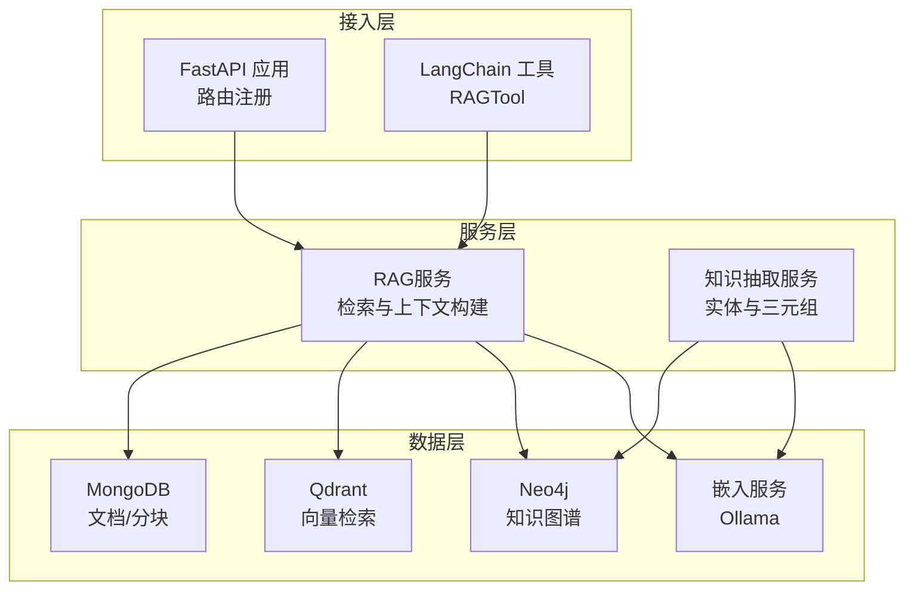
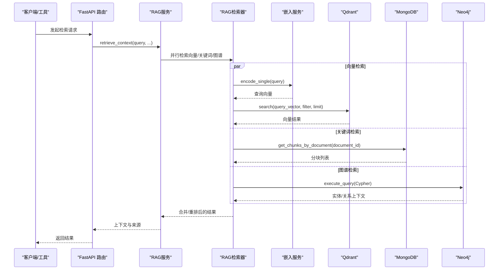
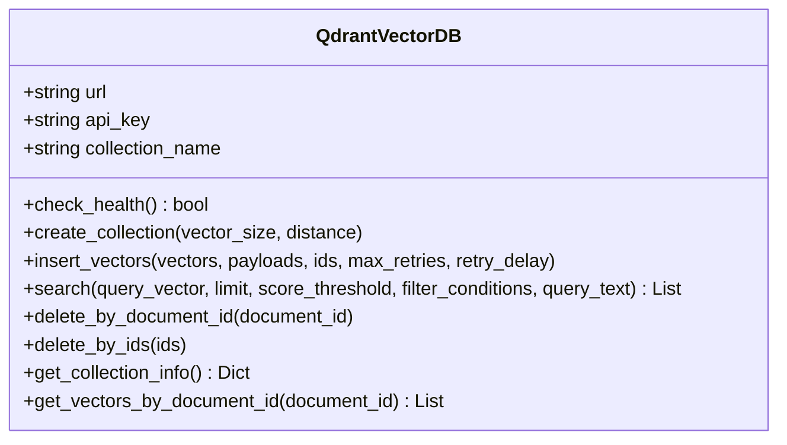
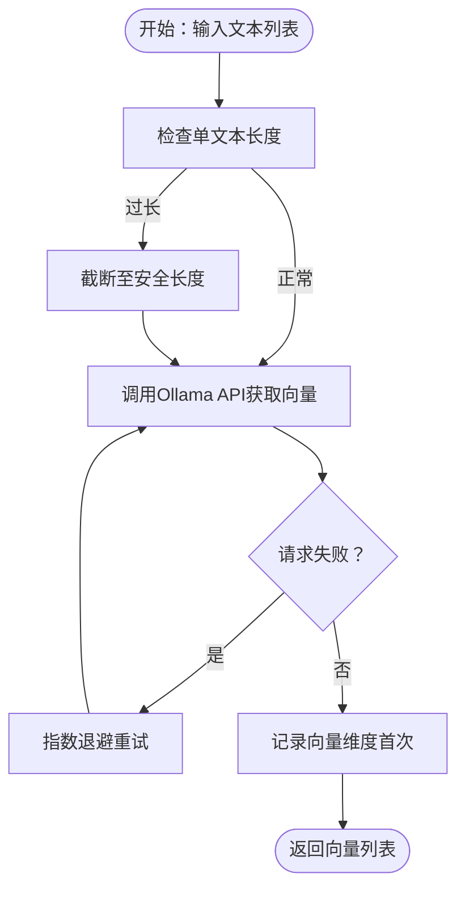
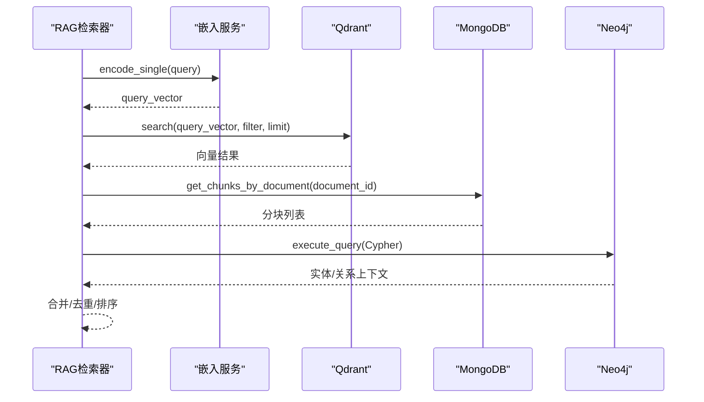
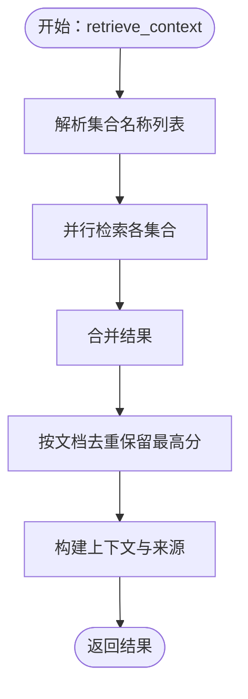
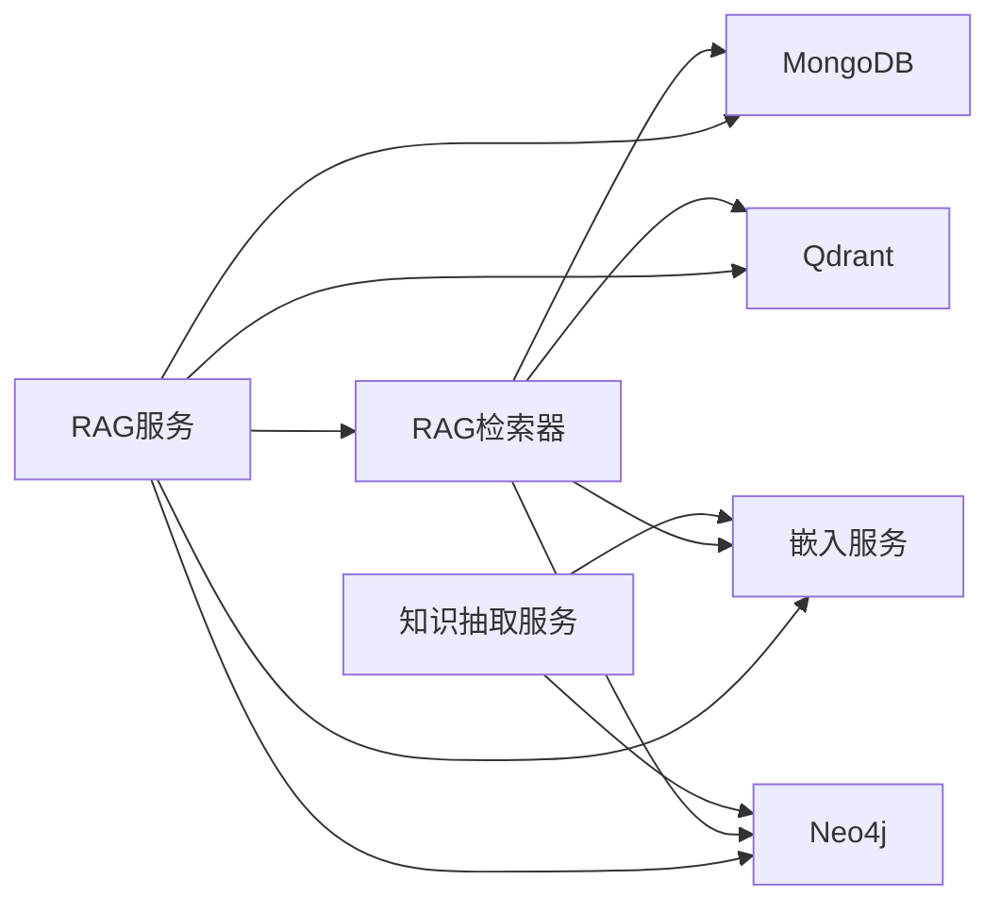

# Qdrant向量存储

<cite>
**本文引用的文件**
- [database/qdrant_client.py](file://database/qdrant_client.py)
- [embedding/embedding_service.py](file://embedding/embedding_service.py)
- [retrieval/rag_retriever.py](file://retrieval/rag_retriever.py)
- [services/rag_service.py](file://services/rag_service.py)
- [database/mongodb.py](file://database/mongodb.py)
- [database/neo4j_client.py](file://database/neo4j_client.py)
- [services/knowledge_extraction_service.py](file://services/knowledge_extraction_service.py)
- [agents/tools/rag_tool.py](file://agents/tools/rag_tool.py)
- [utils/monitoring.py](file://utils/monitoring.py)
- [main.py](file://main.py)
</cite>

## 目录
1. [简介](#简介)
2. [项目结构](#项目结构)
3. [核心组件](#核心组件)
4. [架构总览](#架构总览)
5. [详细组件分析](#详细组件分析)
6. [依赖分析](#依赖分析)
7. [性能考虑](#性能考虑)
8. [故障排查指南](#故障排查指南)
9. [结论](#结论)
10. [附录](#附录)

## 简介
本文件面向Qdrant向量存储系统，基于仓库中的实现，系统性阐述其设计架构、配置策略、向量嵌入存储机制、相似度计算与检索算法、索引创建与优化、嵌入服务集成、查询优化技巧、备份恢复与容量规划、以及与RAG系统的集成模式与最佳实践。文档兼顾工程落地与可读性，既适用于开发者深入理解实现细节，也便于非技术读者把握整体流程。

## 项目结构
本项目采用分层与职责分离的组织方式：
- 数据层：MongoDB（文档与分块）、Neo4j（知识图谱）、Qdrant（向量检索）
- 服务层：RAG服务、知识抽取服务、嵌入服务
- 接入层：FastAPI应用、LangChain工具适配
- 工具与监控：性能监控、日志中间件

图表来源
- [main.py:90-98](file://main.py#L90-L98)
- [services/rag_service.py:68-83](file://services/rag_service.py#L68-L83)
- [retrieval/rag_retriever.py:69-101](file://retrieval/rag_retriever.py#L69-L101)
- [database/qdrant_client.py:18-96](file://database/qdrant_client.py#L18-L96)
- [database/mongodb.py:92-196](file://database/mongodb.py#L92-L196)
- [database/neo4j_client.py:6-39](file://database/neo4j_client.py#L6-L39)
- [embedding/embedding_service.py:8-44](file://embedding/embedding_service.py#L8-L44)
- [services/knowledge_extraction_service.py:10-31](file://services/knowledge_extraction_service.py#L10-L31)
- [agents/tools/rag_tool.py:12-57](file://agents/tools/rag_tool.py#L12-L57)

章节来源
- [main.py:90-98](file://main.py#L90-L98)
- [services/rag_service.py:68-83](file://services/rag_service.py#L68-L83)
- [retrieval/rag_retriever.py:69-101](file://retrieval/rag_retriever.py#L69-L101)

## 核心组件
- QdrantVectorDB：封装Qdrant客户端，负责集合创建、向量插入、相似度检索、过滤删除、集合信息查询等
- EmbeddingService：封装Ollama嵌入服务，负责模型检测、向量生成、批量编码、维度获取
- RAGRetriever：混合检索器，整合向量检索、关键词检索、图谱检索，支持合并与重排
- RAGService：RAG服务封装，协调多集合检索、上下文构建与来源去重
- MongoDB/ChunkRepository：文档与分块持久化，支撑检索与溯源
- Neo4jClient/KnowledgeExtractionService：知识图谱连接与三元组抽取，增强检索上下文
- 性能监控：系统指标采集与请求耗时统计

章节来源
- [database/qdrant_client.py:18-544](file://database/qdrant_client.py#L18-L544)
- [embedding/embedding_service.py:8-278](file://embedding/embedding_service.py#L8-L278)
- [retrieval/rag_retriever.py:22-325](file://retrieval/rag_retriever.py#L22-L325)
- [services/rag_service.py:7-248](file://services/rag_service.py#L7-L248)
- [database/mongodb.py:92-800](file://database/mongodb.py#L92-L800)
- [database/neo4j_client.py:6-104](file://database/neo4j_client.py#L6-L104)
- [services/knowledge_extraction_service.py:10-211](file://services/knowledge_extraction_service.py#L10-L211)
- [utils/monitoring.py:13-185](file://utils/monitoring.py#L13-L185)

## 架构总览
Qdrant作为向量检索的核心，与嵌入服务、MongoDB、Neo4j协同工作，形成“向量化入库—向量检索—多源融合—上下文生成”的闭环。系统通过gRPC连接Qdrant，规避HTTP在Windows上的502问题；嵌入服务通过Ollama生成向量；RAG服务聚合多路检索结果并去重排序，最终输出可注入到大模型的上下文。

图表来源
- [services/rag_service.py:68-83](file://services/rag_service.py#L68-L83)
- [retrieval/rag_retriever.py:69-101](file://retrieval/rag_retriever.py#L69-L101)
- [retrieval/rag_retriever.py:110-138](file://retrieval/rag_retriever.py#L110-L138)
- [retrieval/rag_retriever.py:140-174](file://retrieval/rag_retriever.py#L140-L174)
- [retrieval/rag_retriever.py:176-260](file://retrieval/rag_retriever.py#L176-L260)
- [embedding/embedding_service.py:230-259](file://embedding/embedding_service.py#L230-L259)
- [database/qdrant_client.py:336-414](file://database/qdrant_client.py#L336-L414)
- [database/mongodb.py:770-800](file://database/mongodb.py#L770-L800)
- [database/neo4j_client.py:40-62](file://database/neo4j_client.py#L40-L62)

## 详细组件分析

### QdrantVectorDB：向量存储与检索
- 连接与安全
  - 优先使用gRPC（端口6334）连接Qdrant，避免HTTP/httpx在Windows上的502问题
  - 本地HTTP连接自动忽略API key，非本地HTTP连接使用API key时发出安全警告
  - 支持超时、连接池参数配置，提升高并发稳定性
- 健康检查与自动创建
  - 提供健康检查接口；当集合不存在时，按查询向量维度自动创建集合
- 集合管理
  - create_collection：校验维度一致性，不一致时重建集合
  - get_collection_info：返回集合点数等信息
- 向量插入
  - insert_vectors：支持UUID ID、维度校验与自动重建、指数退避重试
  - 自动处理维度不匹配、网络错误等临时性异常
- 检索与过滤
  - search：支持过滤条件（如document_id）、相似度阈值、limit
  - 自动处理集合不存在、维度不匹配等边界情况
- 管理操作
  - delete_by_document_id/delete_by_ids：按文档ID或ID列表删除
  - get_vectors_by_document_id：滚动查询某文档的所有向量（含payload与向量）

图表来源
- [database/qdrant_client.py:18-544](file://database/qdrant_client.py#L18-L544)

章节来源
- [database/qdrant_client.py:39-123](file://database/qdrant_client.py#L39-L123)
- [database/qdrant_client.py:140-209](file://database/qdrant_client.py#L140-L209)
- [database/qdrant_client.py:210-335](file://database/qdrant_client.py#L210-L335)
- [database/qdrant_client.py:336-414](file://database/qdrant_client.py#L336-L414)
- [database/qdrant_client.py:415-526](file://database/qdrant_client.py#L415-L526)

### 嵌入服务：文本预处理与向量生成
- 模型发现与规范化
  - 自动检测可用的Ollama embedding模型，支持标签规范化（如 nomic-embed-text → nomic-embed-text:latest）
  - 若未显式配置模型，优先匹配包含“embedding”“nomic-embed”等关键词的模型
- 向量生成
  - encode/encode_single：对文本进行截断（避免过长文本导致Ollama错误），逐条调用Ollama API获取向量
  - 首次调用时记录向量维度，后续可直接使用
- 重试与超时
  - 针对超时与连接错误提供递增等待重试，提升稳定性

图表来源
- [embedding/embedding_service.py:175-229](file://embedding/embedding_service.py#L175-L229)
- [embedding/embedding_service.py:230-259](file://embedding/embedding_service.py#L230-L259)
- [embedding/embedding_service.py:46-105](file://embedding/embedding_service.py#L46-L105)
- [embedding/embedding_service.py:107-154](file://embedding/embedding_service.py#L107-L154)

章节来源
- [embedding/embedding_service.py:11-44](file://embedding/embedding_service.py#L11-L44)
- [embedding/embedding_service.py:175-229](file://embedding/embedding_service.py#L175-L229)
- [embedding/embedding_service.py:230-259](file://embedding/embedding_service.py#L230-L259)

### RAG检索器：混合检索与结果融合
- 检索策略
  - 向量检索：使用Qdrant search，支持过滤与阈值
  - 关键词检索：基于MongoDB分块表的关键词匹配（仅在限定文档ID时启用）
  - 图谱检索：基于Neo4j的Cypher查询，抽取实体-关系-实体上下文
- 结果融合
  - 向量结果作为基础，关键词结果进行分数提升，图谱结果作为补充
  - 去重与排序：按检索类型与分数综合排序
- 重排（可选）
  - 代码中预留重排器加载逻辑，当前因环境限制暂不可用

图表来源
- [retrieval/rag_retriever.py:69-101](file://retrieval/rag_retriever.py#L69-L101)
- [retrieval/rag_retriever.py:110-138](file://retrieval/rag_retriever.py#L110-L138)
- [retrieval/rag_retriever.py:140-174](file://retrieval/rag_retriever.py#L140-L174)
- [retrieval/rag_retriever.py:176-260](file://retrieval/rag_retriever.py#L176-L260)
- [retrieval/rag_retriever.py:262-297](file://retrieval/rag_retriever.py#L262-L297)

章节来源
- [retrieval/rag_retriever.py:22-101](file://retrieval/rag_retriever.py#L22-L101)
- [retrieval/rag_retriever.py:262-297](file://retrieval/rag_retriever.py#L262-L297)

### RAG服务：上下文构建与来源去重
- 多集合检索
  - 支持按知识空间/助手ID解析集合名称，多集合并行检索
- 上下文与来源
  - 汇总文本片段，按文档去重并保留最高分块，构建来源清单（含标题、文件类型、状态等）
- 回退机制
  - 检索失败时可选择回退到不使用上下文继续处理

图表来源
- [services/rag_service.py:34-83](file://services/rag_service.py#L34-L83)
- [services/rag_service.py:136-191](file://services/rag_service.py#L136-L191)

章节来源
- [services/rag_service.py:10-83](file://services/rag_service.py#L10-L83)
- [services/rag_service.py:136-191](file://services/rag_service.py#L136-L191)

### 知识抽取与图谱：实体与三元组
- 实体抽取：从查询中提取关键实体，用于图谱检索
- 三元组抽取：基于提示模板抽取“头-关系-尾”，写入Neo4j
- 关系规范化：将关系名称标准化为大写、下划线等规则

章节来源
- [services/knowledge_extraction_service.py:104-142](file://services/knowledge_extraction_service.py#L104-L142)
- [services/knowledge_extraction_service.py:32-66](file://services/knowledge_extraction_service.py#L32-L66)
- [services/knowledge_extraction_service.py:144-211](file://services/knowledge_extraction_service.py#L144-L211)
- [database/neo4j_client.py:64-101](file://database/neo4j_client.py#L64-L101)

### LangChain工具：RAGTool
- 同步/异步执行：在异步环境中优先使用异步执行，避免事件循环冲突
- 输入Schema：query与可选document_id
- 输出：返回检索到的上下文文本

章节来源
- [agents/tools/rag_tool.py:8-57](file://agents/tools/rag_tool.py#L8-L57)

## 依赖分析
- 组件耦合
  - RAG服务依赖RAG检索器、MongoDB、Qdrant、Neo4j、嵌入服务
  - RAG检索器依赖嵌入服务、Qdrant、MongoDB、Neo4j
  - Qdrant与嵌入服务相对独立，通过RAG层解耦
- 外部依赖
  - QdrantClient（gRPC/HTTP）、requests（Ollama）、MongoDB驱动、Neo4j驱动
- 循环依赖
  - 未发现直接循环依赖；通过模块导入顺序控制依赖方向

图表来源
- [services/rag_service.py:68-83](file://services/rag_service.py#L68-L83)
- [retrieval/rag_retriever.py:69-101](file://retrieval/rag_retriever.py#L69-L101)
- [services/knowledge_extraction_service.py:10-31](file://services/knowledge_extraction_service.py#L10-L31)

章节来源
- [services/rag_service.py:68-83](file://services/rag_service.py#L68-L83)
- [retrieval/rag_retriever.py:69-101](file://retrieval/rag_retriever.py#L69-L101)

## 性能考虑
- 连接与协议
  - 优先使用gRPC（端口6334）连接Qdrant，避免HTTP在Windows上的502问题，提升连接复用与吞吐
- 超时与重试
  - Qdrant插入与检索均具备指数退避重试，自动处理维度不匹配与临时性网络错误
- 并发与连接池
  - MongoDB连接池参数可调（maxPoolSize/minPoolSize/maxIdleTimeMS等），建议结合负载压测调整
- 监控与可观测性
  - 性能监控器记录请求耗时、错误率与系统指标（CPU/Memory/Disk），支持慢请求告警
- 检索参数
  - top_k与score_threshold需结合业务调优；关键词检索建议限定document_id以避免全库扫描

章节来源
- [database/qdrant_client.py:66-96](file://database/qdrant_client.py#L66-L96)
- [database/qdrant_client.py:278-335](file://database/qdrant_client.py#L278-L335)
- [database/mongodb.py:122-151](file://database/mongodb.py#L122-L151)
- [utils/monitoring.py:22-111](file://utils/monitoring.py#L22-L111)
- [retrieval/rag_retriever.py:25-39](file://retrieval/rag_retriever.py#L25-L39)

## 故障排查指南
- Qdrant连接问题
  - 现象：连接失败、502错误
  - 处理：切换为gRPC连接；若为本地HTTP连接，自动忽略API key；必要时改用127.0.0.1
- 集合不存在或维度不匹配
  - 现象：查询时报集合不存在或维度错误
  - 处理：自动创建集合（按查询向量维度）；插入前自动重建集合（维度不一致时）
- 插入失败与重试
  - 现象：网络抖动、超时
  - 处理：指数退避重试；临时性错误自动等待后重试
- 嵌入服务异常
  - 现象：模型未找到、超时、连接错误
  - 处理：递增等待重试；模型名称规范化；截断过长文本
- MongoDB连接问题
  - 现象：连接失败、权限不足
  - 处理：检查URI/主机/端口/认证参数；调整连接池参数；确认数据库可达
- Neo4j连接问题
  - 现象：连接失败、容器内localhost解析
  - 处理：容器内自动替换为host.docker.internal；验证凭据与驱动连通性

章节来源
- [database/qdrant_client.py:98-123](file://database/qdrant_client.py#L98-L123)
- [database/qdrant_client.py:396-413](file://database/qdrant_client.py#L396-L413)
- [database/qdrant_client.py:299-334](file://database/qdrant_client.py#L299-L334)
- [embedding/embedding_service.py:182-228](file://embedding/embedding_service.py#L182-L228)
- [database/mongodb.py:154-184](file://database/mongodb.py#L154-L184)
- [database/neo4j_client.py:16-33](file://database/neo4j_client.py#L16-L33)

## 结论
本系统以Qdrant为核心，结合Ollama嵌入、MongoDB与Neo4j，构建了高可用、可扩展的RAG检索体系。通过gRPC连接、自动集合管理、指数退避重试与性能监控，系统在工程上具备良好的稳定性与可观测性。建议在生产环境中进一步完善重排器加载、索引参数调优与容量规划，并持续监控慢请求与错误率，保障用户体验与系统可靠性。

## 附录

### 环境变量与配置要点
- Qdrant
  - QDRANT_URL、QDRANT_API_KEY、QDRANT_TIMEOUT、QDRANT_GRPC_PORT
- MongoDB
  - MONGODB_URI 或 MONGODB_HOST/MONGODB_PORT/MONGODB_USERNAME/MONGODB_PASSWORD/MONGODB_AUTH_SOURCE/MONGODB_DB_NAME
  - 连接池参数：MONGODB_MAX_POOL_SIZE、MONGODB_MIN_POOL_SIZE、MONGODB_MAX_IDLE_TIME_MS、MONGODB_SERVER_SELECTION_TIMEOUT_MS、MONGODB_CONNECT_TIMEOUT_MS、MONGODB_SOCKET_TIMEOUT_MS
- Neo4j
  - NEO4J_URI、NEO4J_USER、NEO4J_PASSWORD
- 嵌入服务
  - OLLAMA_BASE_URL、OLLAMA_EMBEDDING_MODEL
- 应用
  - ENVIRONMENT/NODE_ENV、PORT、UVICORN_WORKERS、.env文件位置

章节来源
- [database/qdrant_client.py:35-37](file://database/qdrant_client.py#L35-L37)
- [database/qdrant_client.py:67-68](file://database/qdrant_client.py#L67-L68)
- [database/mongodb.py:100-151](file://database/mongodb.py#L100-L151)
- [database/neo4j_client.py:11-13](file://database/neo4j_client.py#L11-L13)
- [embedding/embedding_service.py:21-30](file://embedding/embedding_service.py#L21-L30)
- [main.py:22-52](file://main.py#L22-L52)