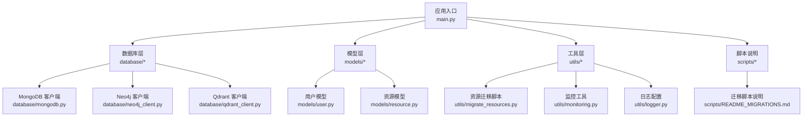
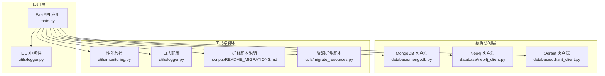
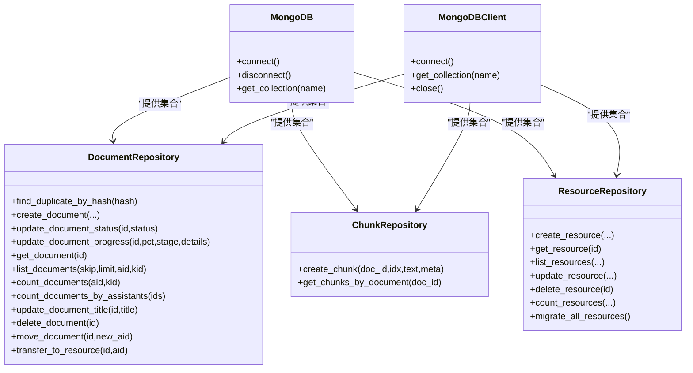
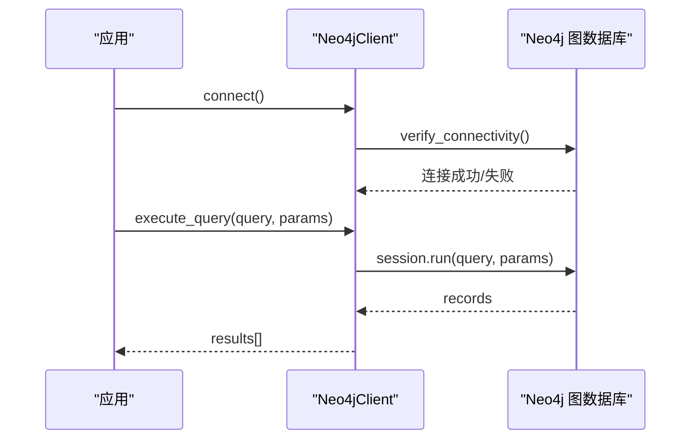
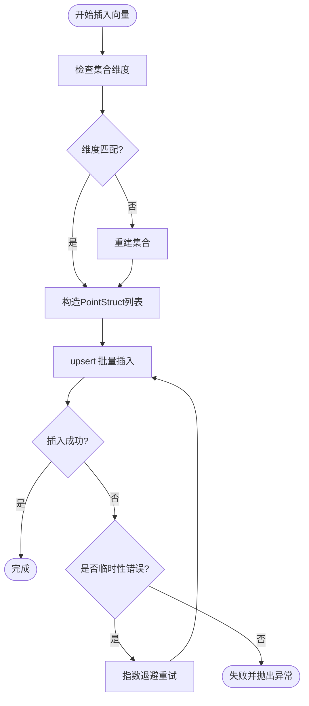
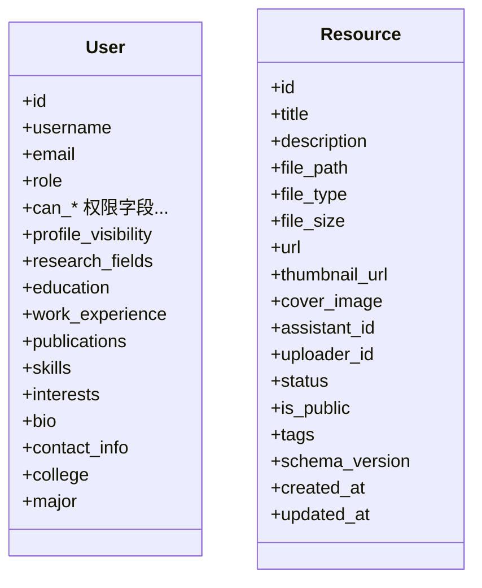
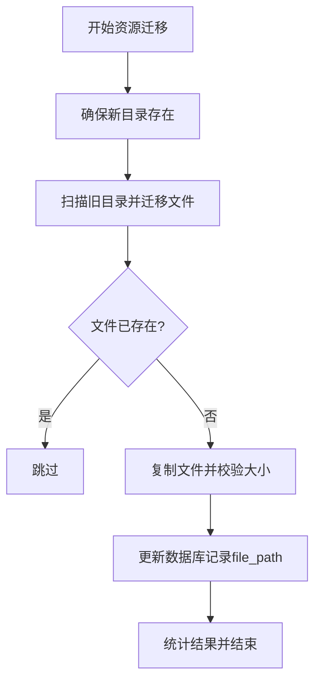
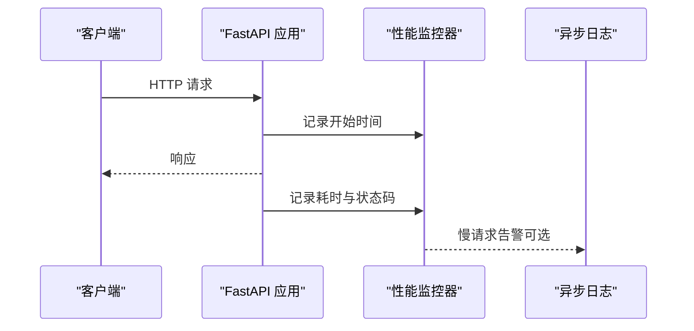
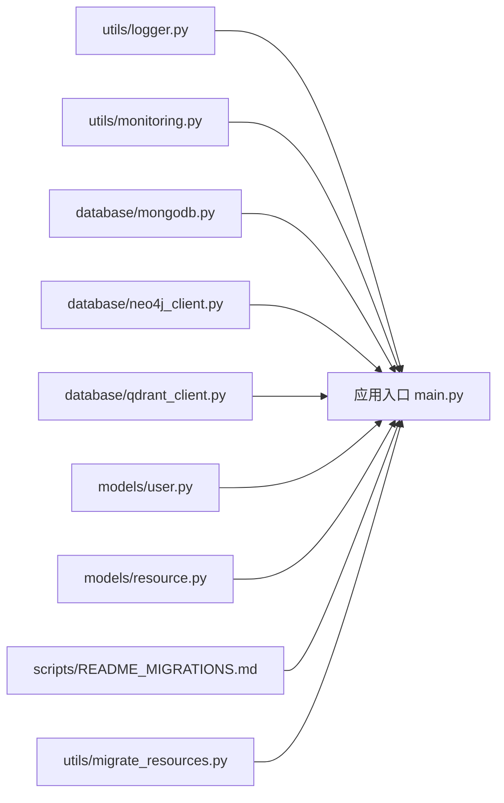

# 数据操作与管理

<cite>
**本文引用的文件**
- [database/mongodb.py](file://database/mongodb.py)
- [database/neo4j_client.py](file://database/neo4j_client.py)
- [database/qdrant_client.py](file://database/qdrant_client.py)
- [models/user.py](file://models/user.py)
- [models/resource.py](file://models/resource.py)
- [utils/migrate_resources.py](file://utils/migrate_resources.py)
- [scripts/README_MIGRATIONS.md](file://scripts/README_MIGRATIONS.md)
- [utils/monitoring.py](file://utils/monitoring.py)
- [utils/logger.py](file://utils/logger.py)
- [main.py](file://main.py)
</cite>

## 目录
1. [引言](#引言)
2. [项目结构](#项目结构)
3. [核心组件](#核心组件)
4. [架构总览](#架构总览)
5. [详细组件分析](#详细组件分析)
6. [依赖分析](#依赖分析)
7. [性能考虑](#性能考虑)
8. [故障排查指南](#故障排查指南)
9. [结论](#结论)
10. [附录](#附录)

## 引言
本文件聚焦于本项目的“数据操作与管理”，围绕以下主题展开：
- 数据的增删改查与批量操作、事务处理与并发控制现状与建议
- 数据迁移策略（跨数据库迁移、数据格式转换、完整性验证）
- 数据备份与恢复机制（全量/增量与灾难恢复思路）
- 数据清理与归档策略（过期数据处理与存储优化）
- 数据监控与性能分析（查询性能监控、存储使用分析、瓶颈识别）
- 数据安全与访问控制（数据加密、权限管理、审计日志）

说明：本项目以MongoDB、Neo4j、Qdrant为核心数据存储，提供异步/同步客户端与仓储层封装；同时具备通用迁移脚本与资源迁移脚本，以及性能监控与日志工具。

## 项目结构
项目采用“模块化+分层”的组织方式：
- database：数据库客户端封装（MongoDB、Neo4j、Qdrant）
- models：Pydantic模型定义（用户、资源等）
- utils：工具模块（迁移资源、监控、日志等）
- scripts：迁移脚本说明文档
- main.py：应用入口与静态资源挂载

图表来源
- [main.py:1-157](file://main.py#L1-L157)
- [database/mongodb.py:1-200](file://database/mongodb.py#L1-L200)
- [database/neo4j_client.py:1-104](file://database/neo4j_client.py#L1-L104)
- [database/qdrant_client.py:1-120](file://database/qdrant_client.py#L1-L120)
- [models/user.py:1-157](file://models/user.py#L1-L157)
- [models/resource.py:1-90](file://models/resource.py#L1-L90)
- [utils/migrate_resources.py:1-120](file://utils/migrate_resources.py#L1-L120)
- [utils/monitoring.py:1-120](file://utils/monitoring.py#L1-L120)
- [utils/logger.py:1-88](file://utils/logger.py#L1-L88)
- [scripts/README_MIGRATIONS.md:1-135](file://scripts/README_MIGRATIONS.md#L1-L135)

章节来源
- [main.py:1-157](file://main.py#L1-L157)

## 核心组件
- MongoDB 客户端与仓储层
  - 异步客户端：用于API服务的高并发场景
  - 同步客户端：用于文档处理与批处理
  - 仓储层：DocumentRepository、ChunkRepository、ResourceRepository（在MongoDB客户端基础上封装）
- Neo4j 客户端：Cypher查询、实体与关系创建
- Qdrant 客户端：向量集合创建、批量插入、相似度检索、按文档ID删除
- 模型层：用户与资源的Pydantic模型，包含字段校验与版本字段
- 迁移与资源迁移：通用迁移脚本与资源文件迁移脚本
- 监控与日志：性能监控器、异步日志配置

章节来源
- [database/mongodb.py:92-313](file://database/mongodb.py#L92-L313)
- [database/neo4j_client.py:6-104](file://database/neo4j_client.py#L6-L104)
- [database/qdrant_client.py:18-544](file://database/qdrant_client.py#L18-L544)
- [models/user.py:8-157](file://models/user.py#L8-L157)
- [models/resource.py:8-90](file://models/resource.py#L8-L90)
- [utils/migrate_resources.py:1-337](file://utils/migrate_resources.py#L1-L337)
- [utils/monitoring.py:13-185](file://utils/monitoring.py#L13-L185)
- [utils/logger.py:15-88](file://utils/logger.py#L15-L88)

## 架构总览
整体数据流由应用入口加载环境变量与中间件，路由分发到各业务模块；数据访问通过数据库客户端与仓储层完成；迁移脚本与监控工具贯穿开发与运维流程。

图表来源
- [main.py:55-126](file://main.py#L55-L126)
- [utils/logger.py:15-88](file://utils/logger.py#L15-L88)
- [database/mongodb.py:92-313](file://database/mongodb.py#L92-L313)
- [database/neo4j_client.py:6-104](file://database/neo4j_client.py#L6-L104)
- [database/qdrant_client.py:18-120](file://database/qdrant_client.py#L18-L120)
- [utils/monitoring.py:13-120](file://utils/monitoring.py#L13-L120)
- [utils/migrate_resources.py:1-120](file://utils/migrate_resources.py#L1-L120)
- [scripts/README_MIGRATIONS.md:1-135](file://scripts/README_MIGRATIONS.md#L1-L135)

## 详细组件分析

### MongoDB 客户端与仓储层
- 异步客户端（API高并发）
  - 连接池参数可配置，包含最大/最小连接池、空闲超时、服务器选择与连接/套接字超时
  - 支持从环境变量解析URI并注入连接池参数
  - 提供 ping 校验与错误提示
- 同步客户端（文档批处理）
  - 支持从环境变量或显式连接串初始化
  - 连接后执行 ping 与集合列表检查
- 仓储层
  - DocumentRepository：文档元数据的增删改查、状态与进度更新、按知识空间/助手过滤、重复检查、转换为资源等
  - ChunkRepository：文档分块的创建与查询
  - ResourceRepository：资源的增删改查、状态与公开性管理、批量迁移与版本升级

图表来源
- [database/mongodb.py:92-313](file://database/mongodb.py#L92-L313)
- [database/mongodb.py:315-768](file://database/mongodb.py#L315-L768)
- [database/mongodb.py:770-850](file://database/mongodb.py#L770-L850)
- [database/mongodb.py:1030-1109](file://database/mongodb.py#L1030-L1109)

章节来源
- [database/mongodb.py:92-313](file://database/mongodb.py#L92-L313)
- [database/mongodb.py:315-768](file://database/mongodb.py#L315-L768)
- [database/mongodb.py:770-850](file://database/mongodb.py#L770-L850)
- [database/mongodb.py:1030-1109](file://database/mongodb.py#L1030-L1109)

### Neo4j 客户端
- 连接与容器环境适配（localhost 替换为 host.docker.internal）
- 连接可用性验证
- Cypher 查询执行、实体 MERGE、关系创建

图表来源
- [database/neo4j_client.py:16-62](file://database/neo4j_client.py#L16-L62)
- [database/neo4j_client.py:40-101](file://database/neo4j_client.py#L40-L101)

章节来源
- [database/neo4j_client.py:6-104](file://database/neo4j_client.py#L6-L104)

### Qdrant 向量数据库客户端
- gRPC 优先连接，避免 HTTP/httpx 502 问题
- 集合创建与维度校验、自动重建
- 批量插入（带重试与指数退避）、相似度检索、按文档ID删除、滚动获取向量
- 健康检查与集合信息查询

图表来源
- [database/qdrant_client.py:210-334](file://database/qdrant_client.py#L210-L334)
- [database/qdrant_client.py:140-209](file://database/qdrant_client.py#L140-L209)

章节来源
- [database/qdrant_client.py:18-544](file://database/qdrant_client.py#L18-L544)

### 模型与权限
- 用户模型：包含身份、角色、细粒度权限字段、资料扩展字段与可见性设置
- 资源模型：标题、描述、文件/链接、状态、公开性、标签、schema 版本等

图表来源
- [models/user.py:8-157](file://models/user.py#L8-L157)
- [models/resource.py:8-90](file://models/resource.py#L8-L90)

章节来源
- [models/user.py:8-157](file://models/user.py#L8-L157)
- [models/resource.py:8-90](file://models/resource.py#L8-L90)

### 迁移与资源迁移
- 通用迁移脚本说明：索引创建、模型字段迁移、迁移历史记录、幂等性与错误处理
- 资源迁移脚本：扫描旧目录与数据库记录，规范化路径，复制文件并更新数据库路径

图表来源
- [utils/migrate_resources.py:310-337](file://utils/migrate_resources.py#L310-L337)
- [utils/migrate_resources.py:132-262](file://utils/migrate_resources.py#L132-L262)

章节来源
- [scripts/README_MIGRATIONS.md:1-135](file://scripts/README_MIGRATIONS.md#L1-L135)
- [utils/migrate_resources.py:1-337](file://utils/migrate_resources.py#L1-L337)

### 性能监控与日志
- 性能监控器：记录请求耗时、统计P50/P95/P99、错误计数、系统CPU/内存/磁盘指标
- 异步日志：队列+后台线程写入，降低阻塞；生产环境可降低日志级别
- 请求装饰器与上下文管理器：自动记录慢请求与状态码

图表来源
- [utils/monitoring.py:118-185](file://utils/monitoring.py#L118-L185)
- [utils/logger.py:15-88](file://utils/logger.py#L15-L88)
- [main.py:72-73](file://main.py#L72-L73)

章节来源
- [utils/monitoring.py:13-185](file://utils/monitoring.py#L13-L185)
- [utils/logger.py:15-88](file://utils/logger.py#L15-L88)
- [main.py:55-126](file://main.py#L55-L126)

## 依赖分析
- 组件耦合
  - 数据库客户端与仓储层松耦合：仓储层通过客户端提供的集合进行操作
  - 模型层与仓储层解耦：仓储层负责数据持久化，模型负责数据结构与校验
  - 工具层与应用层通过中间件集成，互不直接依赖核心业务
- 外部依赖
  - MongoDB（异步/同步）、Neo4j、Qdrant
  - Pydantic（模型校验）
  - psutil（系统指标采集）

图表来源
- [main.py:55-126](file://main.py#L55-L126)
- [utils/logger.py:15-88](file://utils/logger.py#L15-L88)
- [utils/monitoring.py:13-120](file://utils/monitoring.py#L13-L120)
- [database/mongodb.py:92-313](file://database/mongodb.py#L92-L313)
- [database/neo4j_client.py:6-104](file://database/neo4j_client.py#L6-L104)
- [database/qdrant_client.py:18-120](file://database/qdrant_client.py#L18-L120)
- [models/user.py:8-157](file://models/user.py#L8-L157)
- [models/resource.py:8-90](file://models/resource.py#L8-L90)
- [scripts/README_MIGRATIONS.md:1-135](file://scripts/README_MIGRATIONS.md#L1-L135)
- [utils/migrate_resources.py:1-120](file://utils/migrate_resources.py#L1-L120)

## 性能考虑
- 连接池与超时
  - MongoDB：maxPoolSize/minPoolSize/maxIdleTimeMS/serverSelectionTimeoutMS/connectTimeoutMS/socketTimeoutMS
  - Qdrant：prefer_grpc、超时、重试与指数退避
- 并发与吞吐
  - FastAPI 多 worker（生产环境）与 keep-alive 超时配置
  - 仓储层批量查询与分页（skip/limit）
- 监控与告警
  - 慢请求阈值（>1s）与 P95/P99 统计
  - 系统资源指标采集（CPU/内存/磁盘）

章节来源
- [database/mongodb.py:122-151](file://database/mongodb.py#L122-L151)
- [database/qdrant_client.py:66-96](file://database/qdrant_client.py#L66-L96)
- [main.py:128-157](file://main.py#L128-L157)
- [utils/monitoring.py:78-112](file://utils/monitoring.py#L78-L112)
- [utils/monitoring.py:176-184](file://utils/monitoring.py#L176-L184)

## 故障排查指南
- MongoDB
  - 连接失败：检查 MONGODB_URI/MONGODB_HOST/MONGODB_PORT/MONGODB_AUTH_SOURCE 等环境变量；确认容器网络映射
  - 连接池参数：确保 maxPoolSize/minPoolSize 与服务端配置匹配
- Neo4j
  - 容器内 localhost 解析：确认 URI 替换为 host.docker.internal
  - 连接失败：检查 NEO4J_URI/USER/PASSWORD 与网络连通性
- Qdrant
  - HTTP 502：切换 gRPC（6334）连接；检查 URL 与 API key 配置
  - 维度不匹配：自动重建集合或手动调整向量维度
- 迁移
  - 通用迁移：查看 migration_history 集合状态与错误；确保幂等与备份
  - 资源迁移：确认新目录存在、旧目录文件可读、数据库记录 file_path 规范化
- 监控与日志
  - 慢请求：结合 P95/P99 与系统指标定位瓶颈
  - 日志级别：生产环境可提升到 WARNING 以减少 IO

章节来源
- [database/mongodb.py:152-184](file://database/mongodb.py#L152-L184)
- [database/neo4j_client.py:16-38](file://database/neo4j_client.py#L16-L38)
- [database/qdrant_client.py:97-123](file://database/qdrant_client.py#L97-L123)
- [scripts/README_MIGRATIONS.md:74-135](file://scripts/README_MIGRATIONS.md#L74-L135)
- [utils/migrate_resources.py:132-262](file://utils/migrate_resources.py#L132-L262)
- [utils/monitoring.py:176-184](file://utils/monitoring.py#L176-L184)
- [utils/logger.py:77-82](file://utils/logger.py#L77-L82)

## 结论
本项目在数据层提供了完善的客户端与仓储封装，覆盖文档、分块、资源与向量检索等核心能力；迁移脚本与监控工具支撑了开发与运维流程。针对事务处理与并发控制，当前以仓储层的单文档更新为主，复杂事务建议在上层业务编排中引入幂等与补偿机制；性能方面已具备连接池、gRPC、重试与监控体系，建议结合 P99 与系统指标持续优化。

## 附录
- 数据操作与管理最佳实践（建议）
  - 增删改查与批量
    - 使用仓储层的分页查询与索引优化
    - 批量插入向量时采用 upsert 与重试策略
  - 事务与并发
    - 单文档更新天然具备原子性；复杂业务通过幂等键与状态机实现最终一致性
  - 迁移
    - 通用迁移：幂等执行、记录历史、回滚函数（如有）
    - 资源迁移：先迁移文件再更新数据库，保证一致性
  - 备份与恢复
    - 全量备份：MongoDB/Neo4j/Qdrant 分别导出；Qdrant 建议使用集合快照
    - 增量备份：基于变更日志或时间戳字段增量导出
    - 灾难恢复：演练恢复流程，验证数据完整性与性能
  - 清理与归档
    - 过期数据：按 created_at/updated_at 与状态字段定期清理
    - 存储优化：压缩/去重、冷热分层、定期重建索引
  - 监控与分析
    - 查询性能：P95/P99、慢查询日志、索引命中率
    - 存储使用：集合大小、向量点数、文件系统占用
    - 瓶颈识别：CPU/内存/磁盘与网络 I/O 协同分析
  - 安全与访问控制
    - 数据加密：传输层 TLS、静态数据加密（按需）
    - 权限管理：基于角色的访问控制（RBAC），最小权限原则
    - 审计日志：敏感操作记录、操作人、时间、IP、结果