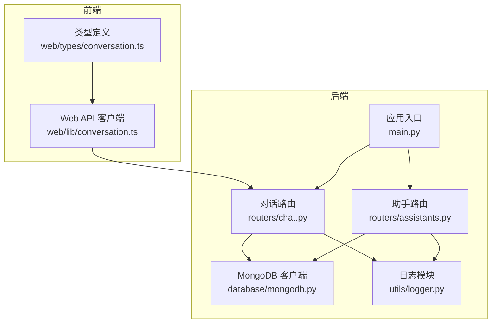
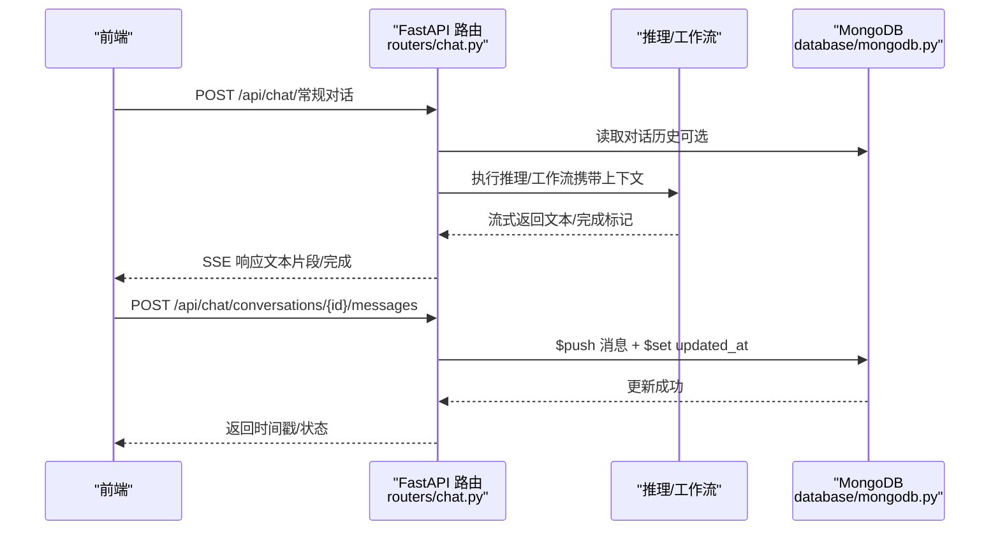
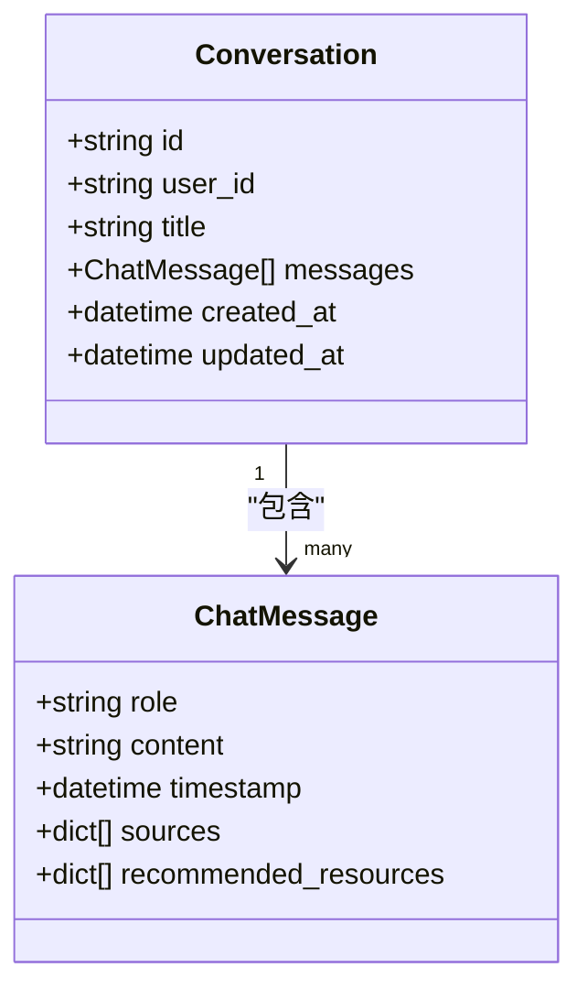
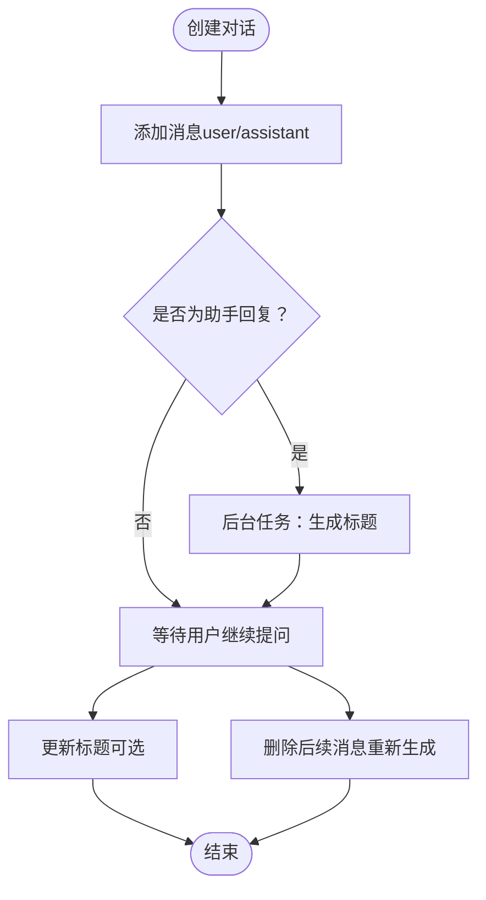
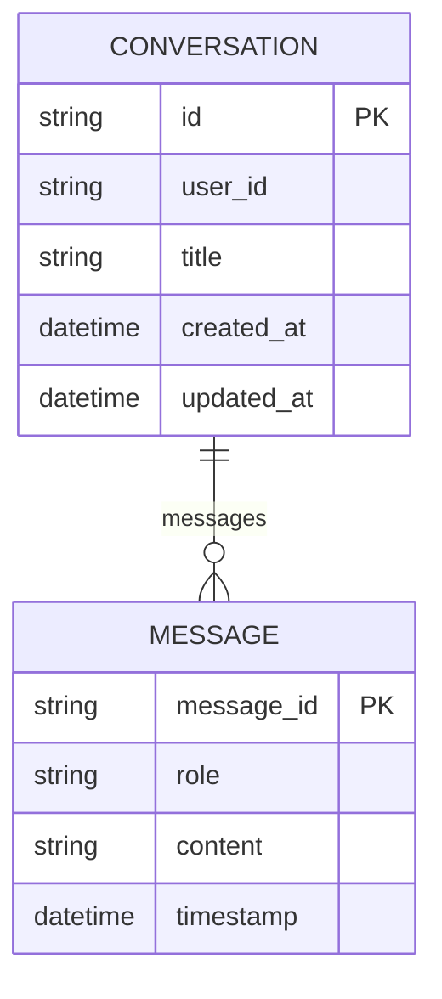
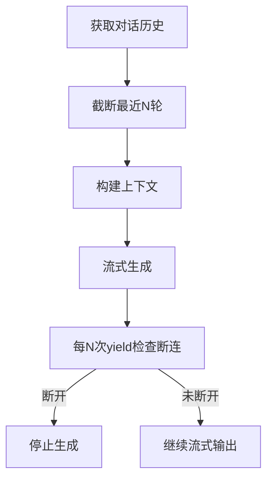
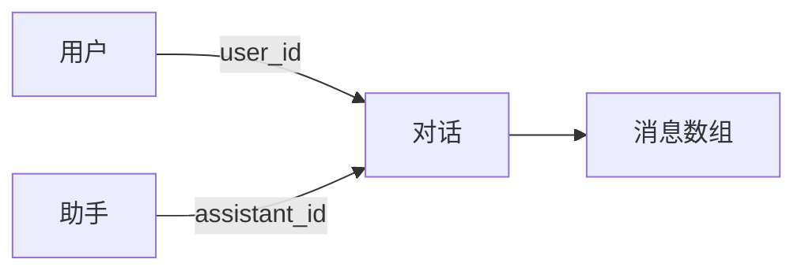
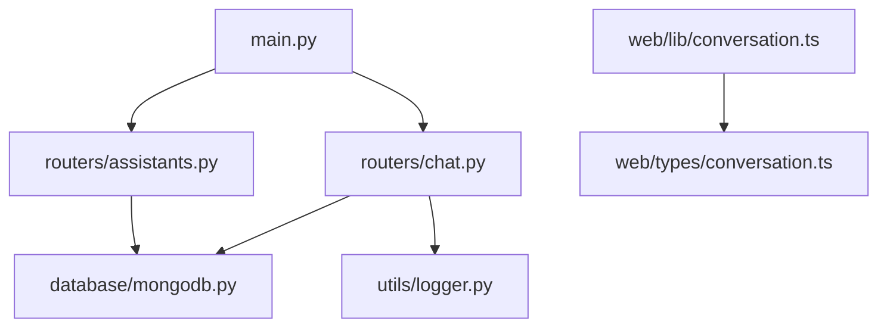

# 对话模型

<cite>
**本文引用的文件**
- [main.py](file://main.py)
- [chat.py](file://routers/chat.py)
- [conversation.ts](file://web/types/conversation.ts)
- [conversation.ts](file://web/lib/conversation.ts)
- [mongodb.py](file://database/mongodb.py)
- [course_assistant.py](file://models/course_assistant.py)
- [assistants.py](file://routers/assistants.py)
- [logger.py](file://utils/logger.py)
</cite>

## 目录
1. [简介](#简介)
2. [项目结构](#项目结构)
3. [核心组件](#核心组件)
4. [架构总览](#架构总览)
5. [详细组件分析](#详细组件分析)
6. [依赖分析](#依赖分析)
7. [性能考虑](#性能考虑)
8. [故障排查指南](#故障排查指南)
9. [结论](#结论)
10. [附录](#附录)

## 简介
本文件系统化阐述对话模型的设计理念与实现细节，覆盖对话基本属性、消息嵌套结构、上下文管理、生命周期与状态、与用户/助手的关联、权限控制、统计与监控、以及数据备份策略。文档面向开发者与产品人员，既提供高层概览也给出代码级映射与可视化图表。

## 项目结构
对话模型由后端 FastAPI 路由层、MongoDB 数据持久化、前端类型与本地缓存、以及日志与监控模块共同构成。核心交互围绕 /api/chat 路由展开，对话数据以文档形式存储在 MongoDB 的 conversations 集合中，消息数组承载多轮对话内容。

**图表来源**
- [main.py:55-98](file://main.py#L55-L98)
- [chat.py:17-17](file://routers/chat.py#L17-L17)
- [assistants.py:14-14](file://routers/assistants.py#L14-L14)
- [mongodb.py:92-196](file://database/mongodb.py#L92-L196)
- [logger.py:15-88](file://utils/logger.py#L15-L88)

**章节来源**
- [main.py:55-98](file://main.py#L55-L98)
- [chat.py:17-17](file://routers/chat.py#L17-L17)
- [assistants.py:14-14](file://routers/assistants.py#L14-L14)
- [mongodb.py:92-196](file://database/mongodb.py#L92-L196)
- [logger.py:15-88](file://utils/logger.py#L15-L88)

## 核心组件
- 对话模型（后端 Pydantic）：包含 id、user_id、title、messages、created_at、updated_at 等字段，消息数组元素为 ChatMessage，具备 role、content、timestamp、sources、recommended_resources 等。
- 对话模型（前端 TypeScript）：包含 id、user_id、title、createdAt、updatedAt、message_count 等字段，用于前端展示与本地缓存。
- MongoDB 持久化：通过 AsyncIOMotorClient 连接，提供 get_collection 方法访问 conversations 集合。
- 助手模型与路由：CourseAssistant 定义助手元信息，助手路由提供只读列表与详情接口，对话创建时可关联默认助手。
- 日志与监控：统一异步日志配置，便于追踪对话生命周期与异常。

**章节来源**
- [chat.py:29-37](file://routers/chat.py#L29-L37)
- [chat.py:20-27](file://routers/chat.py#L20-L27)
- [conversation.ts:1-10](file://web/types/conversation.ts#L1-L10)
- [mongodb.py:191-196](file://database/mongodb.py#L191-L196)
- [course_assistant.py:8-22](file://models/course_assistant.py#L8-L22)
- [assistants.py:17-33](file://routers/assistants.py#L17-L33)
- [logger.py:15-88](file://utils/logger.py#L15-L88)

## 架构总览
对话模型的运行时流程如下：前端发起对话请求，后端路由解析请求，构造上下文（可选对话历史、知识空间、助手 ID 等），执行推理或工作流，流式返回结果，并在需要时更新 MongoDB 中的对话与消息。

**图表来源**
- [chat.py:615-750](file://routers/chat.py#L615-L750)
- [chat.py:245-348](file://routers/chat.py#L245-L348)
- [mongodb.py:191-196](file://database/mongodb.py#L191-L196)

**章节来源**
- [chat.py:615-750](file://routers/chat.py#L615-L750)
- [chat.py:245-348](file://routers/chat.py#L245-L348)
- [mongodb.py:191-196](file://database/mongodb.py#L191-L196)

## 详细组件分析

### 对话模型与消息结构
- 对话模型（后端）：id、user_id、title、messages（数组）、created_at、updated_at。消息元素 ChatMessage 包含 role、content、timestamp、sources、recommended_resources。
- 对话模型（前端）：id、user_id、title、createdAt、updatedAt、message_count。前端还维护本地 localStorage 缓存，用于离线支持与快速刷新。
- 上下文管理：后端在流式生成时可截取最近 N 轮对话作为上下文，避免提示词过长与成本过高。

**图表来源**
- [chat.py:29-37](file://routers/chat.py#L29-L37)
- [chat.py:20-27](file://routers/chat.py#L20-L27)

**章节来源**
- [chat.py:29-37](file://routers/chat.py#L29-L37)
- [chat.py:20-27](file://routers/chat.py#L20-L27)
- [conversation.ts:1-10](file://web/types/conversation.ts#L1-L10)
- [conversation.ts:15-37](file://web/lib/conversation.ts#L15-L37)

### 对话状态管理与生命周期
- 生命周期阶段：创建（空消息数组）→ 添加消息（user/assistant/system 类型）→ 更新标题 → 删除（物理删除）。
- 状态字段：created_at、updated_at 由后端统一维护；消息层面有 message_id、timestamp。
- 自动标题：当助手回复后，若标题仍为默认值，后端在后台任务中异步生成并更新标题，避免阻塞主流程。
- 重新生成回答：删除指定用户消息及其后续消息，保留历史，触发重新生成。

**图表来源**
- [chat.py:97-149](file://routers/chat.py#L97-L149)
- [chat.py:288-332](file://routers/chat.py#L288-L332)
- [chat.py:534-612](file://routers/chat.py#L534-L612)

**章节来源**
- [chat.py:97-149](file://routers/chat.py#L97-L149)
- [chat.py:288-332](file://routers/chat.py#L288-L332)
- [chat.py:534-612](file://routers/chat.py#L534-L612)

### 对话消息的嵌套结构与元数据
- 消息类型：role 支持 "user" 或 "assistant"；系统消息在当前路由中未显式暴露，但消息结构允许扩展。
- 内容格式：content 为字符串；timestamp 为 ISO 时间；sources 与 recommended_resources 为可选数组，用于检索来源与推荐资源。
- 元数据：每条消息具备 message_id，便于前端编辑与重新生成操作。

**图表来源**
- [chat.py:29-37](file://routers/chat.py#L29-L37)
- [chat.py:20-27](file://routers/chat.py#L20-L27)

**章节来源**
- [chat.py:29-37](file://routers/chat.py#L29-L37)
- [chat.py:20-27](file://routers/chat.py#L20-L27)

### 对话上下文管理与内存优化
- 历史消息截取：后端在流式生成时对对话历史进行截断（如最近 10 轮或 5 轮），避免上下文过长导致成本与延迟上升。
- 断连检测：流式输出过程中定期检查客户端断连，及时停止生成，释放资源。
- 本地缓存：前端维护 localStorage 缓存，提升列表与详情的首屏体验，同时与后端 API 保持一致性。

**图表来源**
- [chat.py:638-652](file://routers/chat.py#L638-L652)
- [chat.py:711-725](file://routers/chat.py#L711-L725)
- [conversation.ts:15-37](file://web/lib/conversation.ts#L15-L37)

**章节来源**
- [chat.py:638-652](file://routers/chat.py#L638-L652)
- [chat.py:711-725](file://routers/chat.py#L711-L725)
- [conversation.ts:15-37](file://web/lib/conversation.ts#L15-L37)

### 对话与用户、助手的关联关系与权限控制
- 关联关系：对话可关联 user_id（匿名模式可为空）与 assistant_id（默认助手可自动选择）。助手信息通过只读路由提供。
- 权限控制：当前路由未实现基于 user_id 的访问控制逻辑，普通用户与管理员均可访问所有对话。若需细化权限，可在路由层增加鉴权与校验逻辑。

**图表来源**
- [chat.py:120-129](file://routers/chat.py#L120-L129)
- [assistants.py:40-79](file://routers/assistants.py#L40-L79)

**章节来源**
- [chat.py:120-129](file://routers/chat.py#L120-L129)
- [assistants.py:40-79](file://routers/assistants.py#L40-L79)

### 对话统计信息、性能监控与数据备份策略
- 统计信息：后端提供对话列表接口返回 total、skip、limit，前端可据此做分页与总量统计。
- 性能监控：统一异步日志模块，支持队列异步写入与文件滚动，生产环境可降低 INFO 级别日志量，减少 IO 压力。
- 数据备份策略：当前代码未实现自动备份机制。建议在运维层面结合 MongoDB 备份方案（如副本集、快照、定期导出）保障数据安全。

**章节来源**
- [chat.py:181-192](file://routers/chat.py#L181-L192)
- [logger.py:15-88](file://utils/logger.py#L15-L88)

## 依赖分析
- 应用入口注册路由：/api/chat、/api/documents、/api/retrieval、/api/assistants、/api/knowledge-spaces、/api/health。
- 对话路由依赖 MongoDB 客户端与日志模块；助手路由同样依赖 MongoDB。
- 前端类型与本地缓存依赖 Web API 客户端。

**图表来源**
- [main.py:90-98](file://main.py#L90-L98)
- [chat.py:13-14](file://routers/chat.py#L13-L14)
- [assistants.py:10-11](file://routers/assistants.py#L10-L11)
- [mongodb.py:92-196](file://database/mongodb.py#L92-L196)
- [logger.py:15-88](file://utils/logger.py#L15-L88)

**章节来源**
- [main.py:90-98](file://main.py#L90-L98)
- [chat.py:13-14](file://routers/chat.py#L13-L14)
- [assistants.py:10-11](file://routers/assistants.py#L10-L11)
- [mongodb.py:92-196](file://database/mongodb.py#L92-L196)
- [logger.py:15-88](file://utils/logger.py#L15-L88)

## 性能考虑
- 连接池与超时：MongoDB 客户端配置 maxPoolSize、minPoolSize、serverSelectionTimeoutMS、connectTimeoutMS、socketTimeoutMS，提升高并发下的稳定性。
- 流式输出优化：SSE 每 N 次 yield 检查断连，避免长时间占用资源；客户端断开时立即停止生成。
- 历史截断：对对话历史进行截断，降低上下文长度与生成成本。
- 日志异步：异步队列写入文件，避免阻塞请求处理线程。

**章节来源**
- [mongodb.py:122-136](file://database/mongodb.py#L122-L136)
- [chat.py:711-725](file://routers/chat.py#L711-L725)
- [chat.py:638-652](file://routers/chat.py#L638-L652)
- [logger.py:56-66](file://utils/logger.py#L56-L66)

## 故障排查指南
- 创建/更新/删除对话失败：查看后端日志，定位 HTTP 异常与堆栈信息；确认 MongoDB 连接与集合存在。
- 添加消息失败：检查对话是否存在、消息内容长度、角色合法性；关注 sources/recommended_resources 的格式。
- 流式输出中断：确认客户端断连检测逻辑是否触发；检查网络稳定性与超时设置。
- 日志异常：确认日志目录权限、队列容量与文件句柄；生产环境注意日志级别调整。

**章节来源**
- [chat.py:143-148](file://routers/chat.py#L143-L148)
- [chat.py:253-253](file://routers/chat.py#L253-L253)
- [chat.py:711-725](file://routers/chat.py#L711-L725)
- [logger.py:56-66](file://utils/logger.py#L56-L66)

## 结论
对话模型以简洁的文档结构承载多轮消息，配合流式输出与历史截断实现高效、低延迟的交互体验。通过 MongoDB 的异步客户端与统一日志模块，系统在高并发场景下具备良好的稳定性与可观测性。未来可在权限控制、自动备份与消息类型扩展等方面进一步完善。

## 附录
- 对话创建与消息添加的关键路径：见“章节来源”中对应行号。
- 助手模型与路由：用于默认助手选择与只读展示，便于对话与知识空间的关联。

**章节来源**
- [course_assistant.py:8-22](file://models/course_assistant.py#L8-L22)
- [assistants.py:40-79](file://routers/assistants.py#L40-L79)