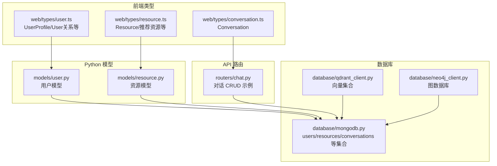
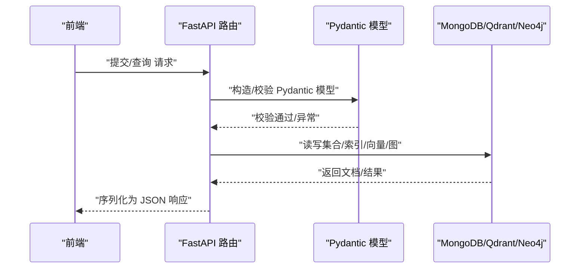
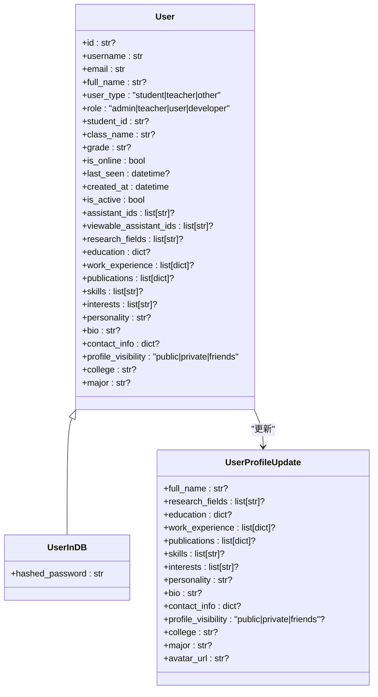
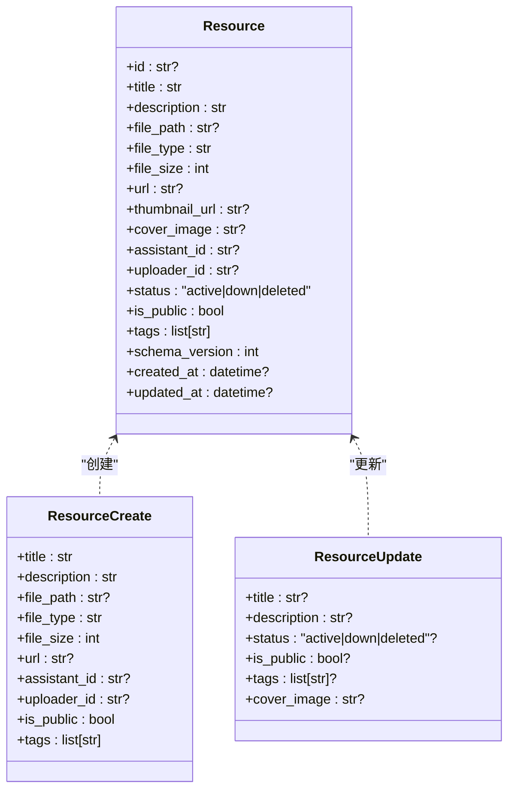
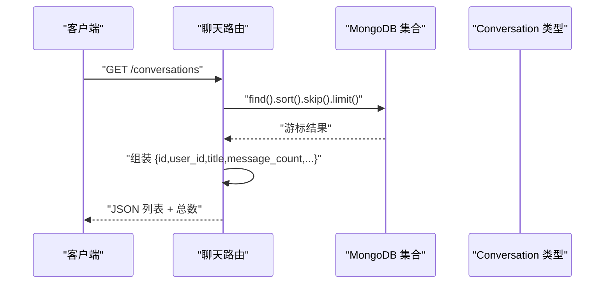
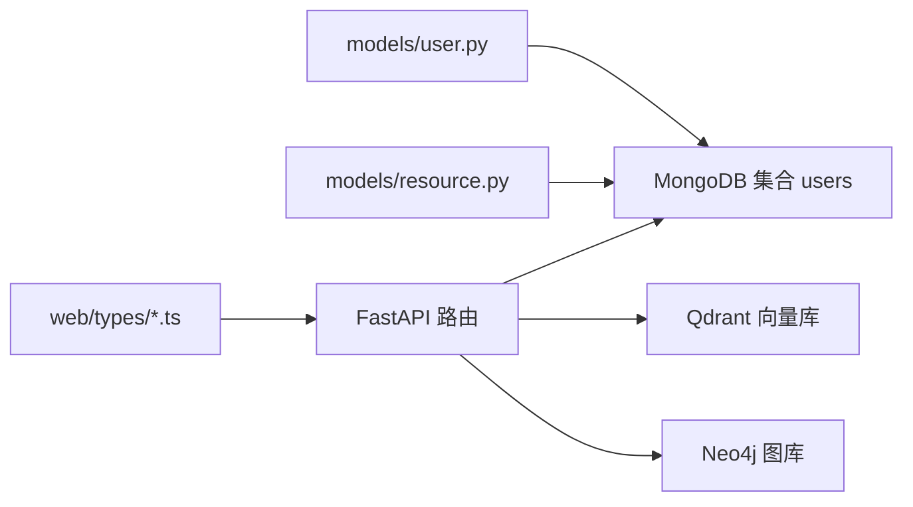

# 数据模型设计

<cite>
**本文引用的文件**
- [models/user.py](file://models/user.py)
- [models/resource.py](file://models/resource.py)
- [web/types/user.ts](file://web/types/user.ts)
- [web/types/resource.ts](file://web/types/resource.ts)
- [web/types/conversation.ts](file://web/types/conversation.ts)
- [database/mongodb.py](file://database/mongodb.py)
- [database/qdrant_client.py](file://database/qdrant_client.py)
- [database/neo4j_client.py](file://database/neo4j_client.py)
- [routers/chat.py](file://routers/chat.py)
- [scripts/README_MIGRATIONS.md](file://scripts/README_MIGRATIONS.md)
- [utils/migrate_resources.py](file://utils/migrate_resources.py)
</cite>

## 目录
1. [简介](#简介)
2. [项目结构](#项目结构)
3. [核心组件](#核心组件)
4. [架构总览](#架构总览)
5. [详细组件分析](#详细组件分析)
6. [依赖分析](#依赖分析)
7. [性能考虑](#性能考虑)
8. [故障排查指南](#故障排查指南)
9. [结论](#结论)
10. [附录](#附录)

## 简介
本文件系统化梳理 advanced-rag 的数据模型设计，聚焦核心实体：用户（User）、资源（Resource）、对话（Conversation）。内容涵盖：
- 设计理念与字段定义
- 数据类型选择与验证规则
- 序列化/反序列化机制（Pydantic 与数据库映射）
- 版本管理、迁移策略与向后兼容
- 在 API、服务、数据库各层的使用方式与最佳实践

## 项目结构
与数据模型直接相关的关键模块分布如下：
- Python 层模型定义：models/user.py、models/resource.py
- TypeScript 类型定义（前端/接口契约）：web/types/*.ts
- 数据库访问与集合映射：database/mongodb.py、database/qdrant_client.py、database/neo4j_client.py
- 对话路由示例：routers/chat.py
- 迁移与资源迁移脚本：scripts/README_MIGRATIONS.md、utils/migrate_resources.py

**图表来源**
- [models/user.py:1-157](file://models/user.py#L1-L157)
- [models/resource.py:1-90](file://models/resource.py#L1-L90)
- [web/types/user.ts:1-176](file://web/types/user.ts#L1-L176)
- [web/types/resource.ts:1-44](file://web/types/resource.ts#L1-L44)
- [web/types/conversation.ts:1-10](file://web/types/conversation.ts#L1-L10)
- [database/mongodb.py:1-800](file://database/mongodb.py#L1-L800)
- [database/qdrant_client.py:1-544](file://database/qdrant_client.py#L1-L544)
- [database/neo4j_client.py:1-104](file://database/neo4j_client.py#L1-L104)
- [routers/chat.py:159-227](file://routers/chat.py#L159-L227)

**章节来源**
- [models/user.py:1-157](file://models/user.py#L1-L157)
- [models/resource.py:1-90](file://models/resource.py#L1-L90)
- [web/types/user.ts:1-176](file://web/types/user.ts#L1-L176)
- [web/types/resource.ts:1-44](file://web/types/resource.ts#L1-L44)
- [web/types/conversation.ts:1-10](file://web/types/conversation.ts#L1-L10)
- [database/mongodb.py:1-800](file://database/mongodb.py#L1-L800)
- [database/qdrant_client.py:1-544](file://database/qdrant_client.py#L1-L544)
- [database/neo4j_client.py:1-104](file://database/neo4j_client.py#L1-L104)
- [routers/chat.py:159-227](file://routers/chat.py#L159-L227)

## 核心组件
- 用户模型（User）
  - 身份与角色：user_type、role
  - 基础信息：username、email、full_name、avatar_url
  - 学生特有：student_id、class_name、grade
  - 在线状态与时间：is_online、last_seen、created_at、is_active
  - 管理员细粒度权限：助手/文档/资源/标签/基础提示词/通知发送等
  - 资料扩展：research_fields、education、work_experience、publications、skills、interests、personality、bio、contact_info、profile_visibility、college、major
  - 邮箱验证：支持标准邮箱与本地开发域名
- 资源模型（Resource）
  - 标识与元数据：id、title、description、file_type、file_size、tags
  - 存储与链接：file_path（可选）、url（可选，外部链接）、thumbnail_url（视频封面）、cover_image（封面）
  - 关联与状态：assistant_id、uploader_id、status（active/down/deleted）、is_public、schema_version、created_at/updated_at
  - URL 校验：独立校验函数与 Pydantic 验证器
- 对话模型（Conversation）
  - 前端类型：id、user_id、title、createdAt、updatedAt、message_count
  - API 层映射：路由中将数据库文档转换为该结构并返回

**章节来源**
- [models/user.py:8-85](file://models/user.py#L8-L85)
- [models/user.py:87-108](file://models/user.py#L87-L108)
- [models/user.py:110-157](file://models/user.py#L110-L157)
- [models/resource.py:8-27](file://models/resource.py#L8-L27)
- [models/resource.py:29-59](file://models/resource.py#L29-L59)
- [models/resource.py:77-85](file://models/resource.py#L77-L85)
- [web/types/conversation.ts:1-10](file://web/types/conversation.ts#L1-L10)
- [routers/chat.py:159-227](file://routers/chat.py#L159-L227)

## 架构总览
数据模型在系统中的流转路径：
- 前端通过 TypeScript 类型定义与后端交互
- 后端使用 Pydantic 模型进行输入校验与序列化
- 数据持久化分别落在 MongoDB（结构化文档）、Qdrant（向量）、Neo4j（图）
- 对话模型在 API 层完成数据库读写与结构转换

**图表来源**
- [web/types/user.ts:1-176](file://web/types/user.ts#L1-L176)
- [web/types/resource.ts:1-44](file://web/types/resource.ts#L1-L44)
- [models/user.py:1-157](file://models/user.py#L1-L157)
- [models/resource.py:1-90](file://models/resource.py#L1-L90)
- [database/mongodb.py:1-800](file://database/mongodb.py#L1-L800)
- [database/qdrant_client.py:1-544](file://database/qdrant_client.py#L1-L544)
- [database/neo4j_client.py:1-104](file://database/neo4j_client.py#L1-L104)

## 详细组件分析

### 用户模型（User）
- 设计要点
  - 分层模型：公开信息 User、数据库包含密码哈希 UserInDB、资料更新 UserProfileUpdate
  - 细粒度权限：管理员可管理助手/文档/资源/标签，以及通知发送范围与权限
  - 资料扩展：教育背景、工作经历、论文成果、技能、兴趣、联系方式等
  - 邮箱验证：支持标准邮箱与本地开发域名
- 字段与类型
  - 标识与时间：id（可选）、created_at、last_seen（可选）
  - 身份与角色：user_type（"student"|"teacher"|"other"）、role（"admin"|"teacher"|"user"|"developer"）
  - 学生特有：student_id、class_name、grade（可选）
  - 在线与活跃：is_online、is_active
  - 权限与配额：max_assistants、max_documents、assistant_ids、viewable_assistant_ids
  - 资料扩展：research_fields、education、work_experience、publications、skills、interests、personality、bio、contact_info、profile_visibility、college、major
- 验证规则
  - 邮箱正则：支持标准格式与本地域名
  - URL（资源模型）：独立校验器与函数
- 序列化/反序列化
  - Pydantic 自动 JSON 序列化/反序列化
  - 数据库存储：MongoDB 集合 users
- 关系映射
  - 一对一：用户与个人资料扩展
  - 一对多：用户与上传的资源（uploader_id）
  - 多对多：用户与助手（assistant_ids、viewable_assistant_ids）

**图表来源**
- [models/user.py:8-85](file://models/user.py#L8-L85)
- [models/user.py:87-108](file://models/user.py#L87-L108)
- [models/user.py:110-157](file://models/user.py#L110-L157)

**章节来源**
- [models/user.py:8-85](file://models/user.py#L8-L85)
- [models/user.py:87-108](file://models/user.py#L87-L108)
- [models/user.py:110-157](file://models/user.py#L110-L157)

### 资源模型（Resource）
- 设计要点
  - 支持本地文件与外部链接两种形态（file_path/url 二选一或同时为空）
  - 状态机：active/down/deleted
  - 版本控制：schema_version 字段用于迁移兼容
  - 标签与封面：tags、cover_image、thumbnail_url
- 字段与类型
  - 标识与元数据：id、title、description、file_type、file_size、tags
  - 存储与链接：file_path（可选）、url（可选）、thumbnail_url（可选）、cover_image（可选）
  - 关联与状态：assistant_id、uploader_id、status、is_public、schema_version、created_at/updated_at
- 验证规则
  - URL 校验：独立校验器与 Pydantic 验证器
- 序列化/反序列化
  - Pydantic 模型用于请求体校验与响应序列化
  - 数据库存储：MongoDB 集合 resources
- 关系映射
  - 多对一：资源 → 上传者（User）
  - 多对一：资源 → 助手（assistant_id）

**图表来源**
- [models/resource.py:8-27](file://models/resource.py#L8-L27)
- [models/resource.py:29-59](file://models/resource.py#L29-L59)
- [models/resource.py:77-85](file://models/resource.py#L77-L85)

**章节来源**
- [models/resource.py:8-27](file://models/resource.py#L8-L27)
- [models/resource.py:29-59](file://models/resource.py#L29-L59)
- [models/resource.py:77-85](file://models/resource.py#L77-L85)

### 对话模型（Conversation）
- 设计要点
  - 前端类型定义：id、user_id、title、createdAt、updatedAt、message_count
  - API 层映射：路由中将数据库文档转换为该结构，包含消息列表与计数
- 字段与类型
  - 标识与时间：id、createdAt、updatedAt
  - 关联与元数据：user_id、title、message_count（派生）
- 序列化/反序列化
  - 前端：TypeScript 接口
  - 后端：MongoDB 文档 → 字典转换 → JSON 响应

**图表来源**
- [web/types/conversation.ts:1-10](file://web/types/conversation.ts#L1-L10)
- [routers/chat.py:159-227](file://routers/chat.py#L159-L227)

**章节来源**
- [web/types/conversation.ts:1-10](file://web/types/conversation.ts#L1-L10)
- [routers/chat.py:159-227](file://routers/chat.py#L159-L227)

## 依赖分析
- Pydantic 模型与数据库集合映射
  - User → MongoDB 集合 users
  - Resource → MongoDB 集合 resources
  - 对话 → MongoDB 集合 conversations
- 向量与图数据库
  - Qdrant：向量检索与过滤
  - Neo4j：实体与关系建模（用户关系、知识图谱）

**图表来源**
- [models/user.py:1-157](file://models/user.py#L1-L157)
- [models/resource.py:1-90](file://models/resource.py#L1-L90)
- [web/types/user.ts:1-176](file://web/types/user.ts#L1-L176)
- [web/types/resource.ts:1-44](file://web/types/resource.ts#L1-L44)
- [database/mongodb.py:1-800](file://database/mongodb.py#L1-L800)
- [database/qdrant_client.py:1-544](file://database/qdrant_client.py#L1-L544)
- [database/neo4j_client.py:1-104](file://database/neo4j_client.py#L1-L104)

**章节来源**
- [database/mongodb.py:1-800](file://database/mongodb.py#L1-L800)
- [database/qdrant_client.py:1-544](file://database/qdrant_client.py#L1-L544)
- [database/neo4j_client.py:1-104](file://database/neo4j_client.py#L1-L104)

## 性能考虑
- MongoDB 连接池与超时
  - maxPoolSize/minPoolSize/maxIdleTimeMS/serverSelectionTimeoutMS/connectTimeoutMS/socketTimeoutMS
  - 首次 ping 校验与日志提示
- Qdrant 连接与重试
  - gRPC 优先、连接复用、指数退避重试、维度不匹配自动重建
- Neo4j 连接
  - 连接验证、参数化查询、关系创建与去重（MERGE）

**章节来源**
- [database/mongodb.py:99-196](file://database/mongodb.py#L99-L196)
- [database/mongodb.py:251-313](file://database/mongodb.py#L251-L313)
- [database/qdrant_client.py:66-123](file://database/qdrant_client.py#L66-L123)
- [database/qdrant_client.py:278-335](file://database/qdrant_client.py#L278-L335)
- [database/neo4j_client.py:16-63](file://database/neo4j_client.py#L16-L63)

## 故障排查指南
- 迁移与版本管理
  - 迁移历史记录在 migration_history 集合，包含 migration_id、status、applied_at、error
  - 幂等性：可安全多次运行
  - 建议先在测试环境执行，再在生产环境执行
- 资源迁移
  - 从旧目录扫描并复制文件至新挂载点，更新数据库 file_path
  - 支持相对路径规范化与跨目录查找
- 数据库连接问题
  - MongoDB：检查 .env 配置、URI 解析、连接池参数、ping 校验
  - Qdrant：gRPC 连接、API key 与 HTTP 警告、维度不匹配自动重建
  - Neo4j：容器内 localhost 替换为 host.docker.internal，连接验证

**章节来源**
- [scripts/README_MIGRATIONS.md:1-135](file://scripts/README_MIGRATIONS.md#L1-L135)
- [utils/migrate_resources.py:132-262](file://utils/migrate_resources.py#L132-L262)
- [database/mongodb.py:99-196](file://database/mongodb.py#L99-L196)
- [database/qdrant_client.py:66-123](file://database/qdrant_client.py#L66-L123)
- [database/neo4j_client.py:16-63](file://database/neo4j_client.py#L16-L63)

## 结论
本数据模型体系以 Pydantic 为核心，结合 MongoDB、Qdrant、Neo4j 多模态存储，实现了用户、资源、对话等关键实体的清晰建模与高效存取。通过 schema_version、迁移脚本与幂等设计，保障了演进过程中的向后兼容与稳定性。前端 TypeScript 类型与后端 Pydantic 模型形成一致的契约，配合数据库层的连接优化与重试策略，满足高并发场景下的可靠性要求。

## 附录
- 最佳实践
  - 输入校验：始终使用 Pydantic 模型进行请求体校验
  - 输出序列化：保持字段最小化，避免泄露敏感信息
  - 版本控制：新增字段时增加 schema_version 并编写迁移
  - 连接优化：合理配置连接池与超时参数，启用健康检查
  - 数据一致性：对关键写操作使用事务或幂等更新策略