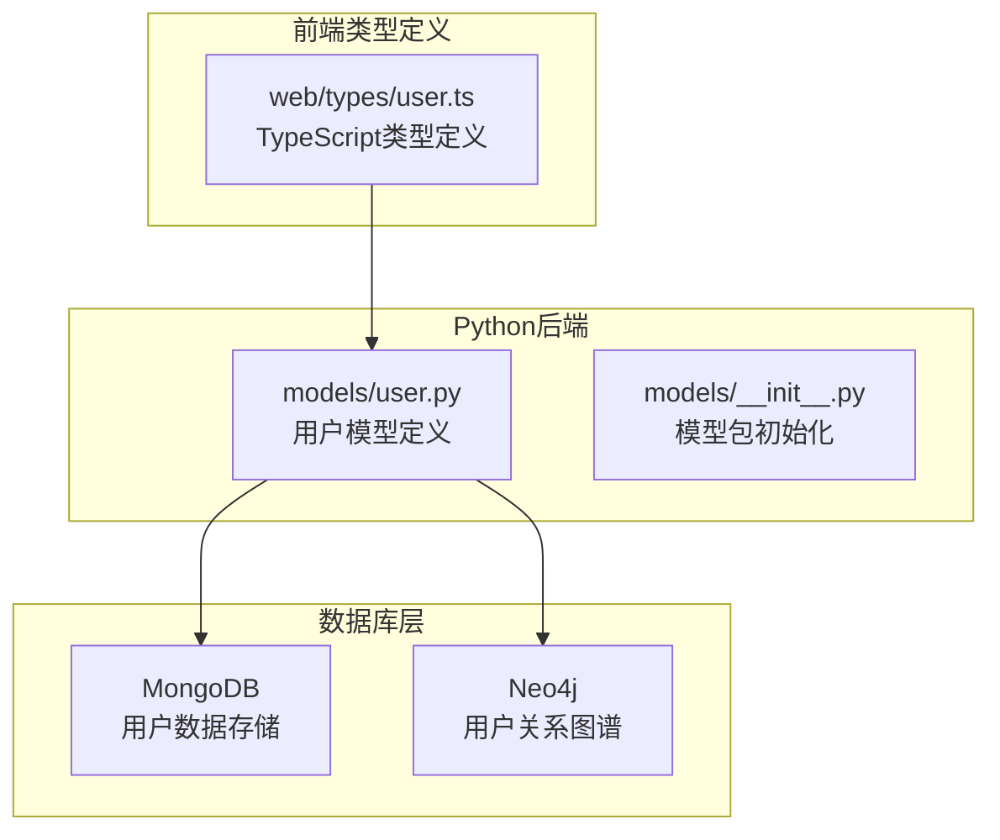
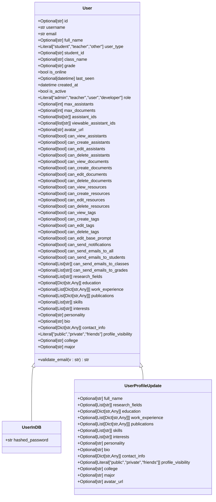
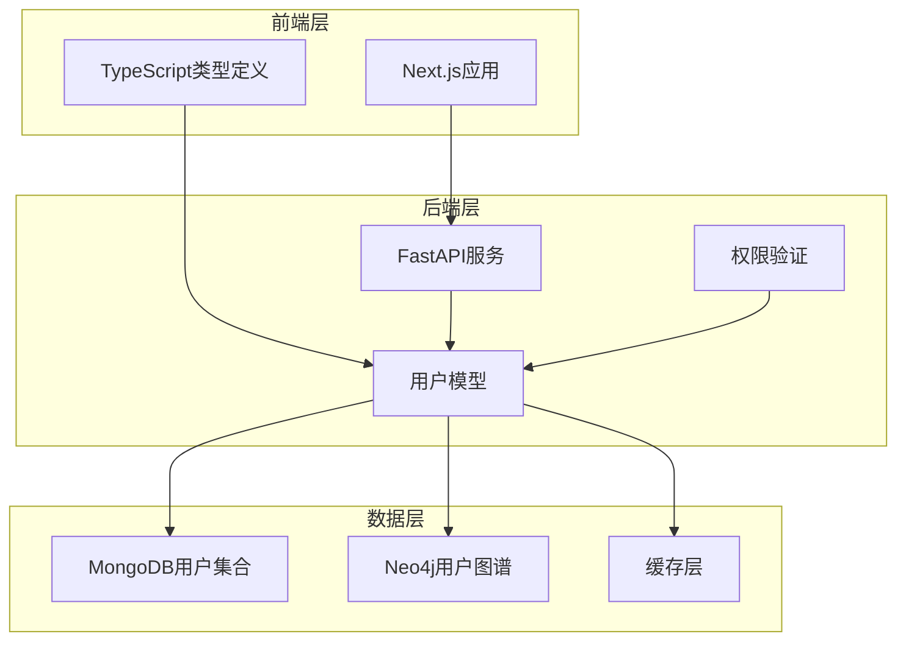
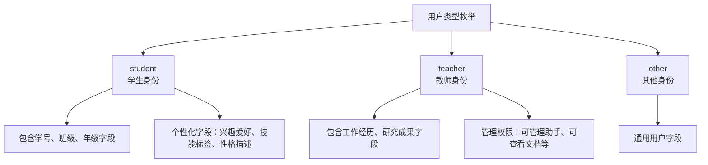
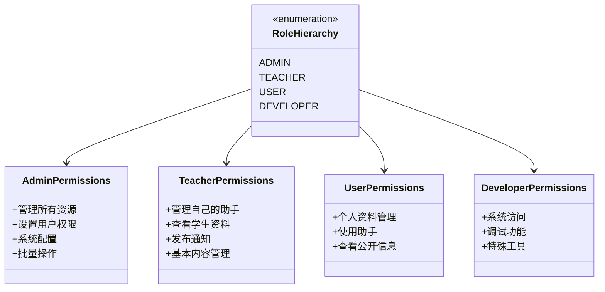
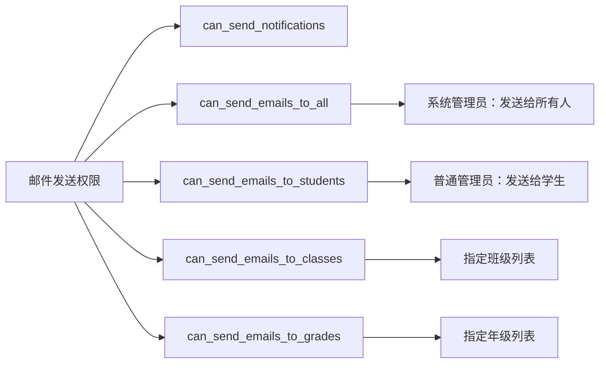
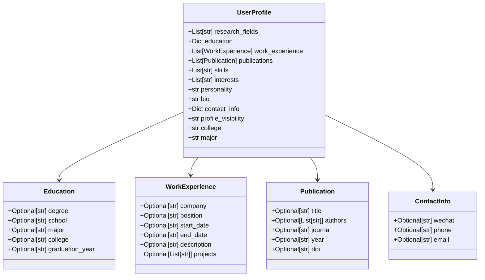
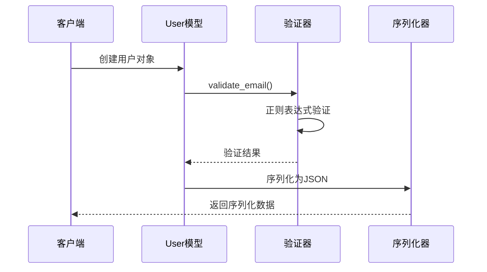

# 用户模型

<cite>
**本文档引用的文件**
- [models/user.py](file://models/user.py)
- [web/types/user.ts](file://web/types/user.ts)
</cite>

## 目录
1. [简介](#简介)
2. [项目结构](#项目结构)
3. [核心组件](#核心组件)
4. [架构概览](#架构概览)
5. [详细组件分析](#详细组件分析)
6. [依赖分析](#依赖分析)
7. [性能考虑](#性能考虑)
8. [故障排除指南](#故障排除指南)
9. [结论](#结论)

## 简介

用户模型是Advanced RAG系统的核心数据结构，负责管理平台用户的完整信息和权限体系。该模型采用Pydantic框架构建，提供了完整的数据验证、序列化和类型安全保证。

本文档详细说明了用户模型的设计理念、实现细节和使用模式，包括用户基本信息、身份标识、角色权限、在线状态管理等核心字段的设计思路和使用场景。

## 项目结构

用户模型主要分布在以下位置：



**图表来源**
- [models/user.py:1-157](file://models/user.py#L1-L157)
- [web/types/user.ts:1-176](file://web/types/user.ts#L1-L176)

**章节来源**
- [models/user.py:1-157](file://models/user.py#L1-L157)
- [web/types/user.ts:1-176](file://web/types/user.ts#L1-L176)

## 核心组件

### User模型概述

User模型是用户信息的主要载体，继承自Pydantic的BaseModel，提供了完整的数据验证和序列化功能。



**图表来源**
- [models/user.py:8-89](file://models/user.py#L8-L89)
- [models/user.py:92-107](file://models/user.py#L92-L107)

### 字段分类详解

#### 基本信息字段
- **id**: 用户唯一标识符，可选
- **username**: 用户名，必填
- **email**: 邮箱地址，必填，支持标准格式和本地开发域名
- **full_name**: 完整姓名，可选

#### 身份标识字段
- **user_type**: 用户类型，枚举值包括"student"、"teacher"、"other"
- **student_id**: 学号，仅学生身份需要
- **class_name**: 班级，仅学生身份需要  
- **grade**: 年级，仅学生身份需要

#### 状态管理字段
- **is_online**: 在线状态，默认False
- **last_seen**: 最后在线时间，可选
- **created_at**: 创建时间
- **is_active**: 账户激活状态，默认True

#### 权限控制字段
- **role**: 用户角色，枚举值包括"admin"、"teacher"、"user"、"developer"
- **max_assistants**: 最大助手数（仅普通管理员）
- **max_documents**: 最大文档数（仅普通管理员）
- **assistant_ids**: 可管理的助手ID列表（仅普通管理员）
- **viewable_assistant_ids**: 可查看的助手ID列表（仅普通管理员）

#### 细粒度权限字段
系统提供全面的细粒度权限控制，涵盖助手管理、文档管理、资源管理、标签管理和邮件发送等多个维度。

#### 用户资料扩展字段
- **research_fields**: 研究领域列表
- **education**: 教育背景（包含学历、学校、专业、毕业时间、学院等）
- **work_experience**: 工作经历/项目经验列表
- **publications**: 发表论文/成果列表
- **skills**: 技能标签列表
- **interests**: 兴趣爱好列表
- **personality**: 自我性格描述（学生身份重点）
- **bio**: 个人简介
- **contact_info**: 联系方式（微信、电话等，可选公开）
- **profile_visibility**: 资料可见性设置，枚举值包括"public"、"private"、"friends"
- **college**: 所属学院
- **major**: 所属专业

**章节来源**
- [models/user.py:8-89](file://models/user.py#L8-L89)
- [models/user.py:92-107](file://models/user.py#L92-L107)

## 架构概览

用户模型在整个系统中的架构位置如下：



**图表来源**
- [models/user.py:1-157](file://models/user.py#L1-L157)
- [web/types/user.ts:1-176](file://web/types/user.ts#L1-L176)

## 详细组件分析

### 用户类型枚举设计

用户类型枚举值的设计体现了系统的教育应用场景：



**图表来源**
- [models/user.py:13-18](file://models/user.py#L13-L18)

### 角色权限体系

系统采用分层权限设计，不同角色具有不同的权限范围：



**图表来源**
- [models/user.py:20-29](file://models/user.py#L20-L29)

### 邮件发送权限设计

邮件发送权限采用灵活的配置方式：



**图表来源**
- [models/user.py:52-57](file://models/user.py#L52-L57)

### 用户资料扩展设计

用户资料扩展字段采用灵活的数据结构设计：



**图表来源**
- [models/user.py:59-71](file://models/user.py#L59-L71)
- [web/types/user.ts:21-50](file://web/types/user.ts#L21-L50)

### 验证规则和序列化机制

用户模型采用了多层次的验证和序列化机制：



**图表来源**
- [models/user.py:73-84](file://models/user.py#L73-L84)

**章节来源**
- [models/user.py:13-84](file://models/user.py#L13-L84)
- [web/types/user.ts:1-71](file://web/types/user.ts#L1-L71)

## 依赖分析

### 前后端类型一致性

前后端用户类型保持高度一致：

```mermaid
graph TB
subgraph "前端TypeScript"
A[UserType<br/>student | teacher | other]
B[ProfileVisibility<br/>public | private | friends]
C[UserProfile]
D[Education]
E[WorkExperience]
F[Publication]
G[ContactInfo]
end
subgraph "后端Python"
H[User模型]
I[UserInDB模型]
J[UserProfileUpdate模型]
K[FieldPriorityConfig]
end
A --> H
B --> H
C --> H
D --> H
E --> H
F --> H
G --> H
```

**图表来源**
- [web/types/user.ts:3-71](file://web/types/user.ts#L3-L71)
- [models/user.py:8-157](file://models/user.py#L8-L157)

### 数据库映射策略

用户模型与数据库的映射遵循以下原则：

1. **字段映射**: Python字段名直接映射到数据库字段
2. **类型转换**: Python类型自动转换为数据库兼容类型
3. **默认值**: 未提供的可选字段使用None值
4. **嵌套对象**: 复杂对象自动序列化为JSON字符串

**章节来源**
- [models/user.py:8-157](file://models/user.py#L8-L157)
- [web/types/user.ts:1-176](file://web/types/user.ts#L1-L176)

## 性能考虑

### 字段验证性能

- 邮箱验证使用预编译的正则表达式，避免重复编译开销
- 可选字段的延迟计算，减少不必要的验证开销
- Pydantic的内置优化确保字段验证的高效执行

### 内存使用优化

- 使用Optional类型减少内存占用
- 嵌套对象采用延迟加载策略
- 列表和字典字段按需分配内存

### 序列化性能

- Pydantic的JSON序列化经过优化，支持高效的序列化过程
- 复杂嵌套对象的序列化采用流式处理

## 故障排除指南

### 常见验证错误

1. **邮箱格式错误**: 检查邮箱格式是否符合正则表达式要求
2. **用户类型无效**: 确保user_type字段值在允许的枚举范围内
3. **权限配置冲突**: 检查权限字段之间的逻辑关系

### 数据迁移问题

当从旧版本升级时，可能需要处理以下问题：
- 新增字段的默认值设置
- 权限字段的迁移
- 用户资料扩展字段的初始化

**章节来源**
- [models/user.py:73-84](file://models/user.py#L73-L84)

## 结论

用户模型设计充分考虑了Advanced RAG系统的教育应用场景，通过合理的字段分类、灵活的权限控制和完善的验证机制，为系统提供了强大的用户管理能力。

模型的设计理念体现在：
- **完整性**: 覆盖用户管理的所有关键需求
- **灵活性**: 支持不同用户类型的差异化需求
- **安全性**: 通过严格的验证和权限控制确保系统安全
- **可扩展性**: 为未来功能扩展预留了充足的空间

通过前后端类型的一致性和完善的序列化机制，用户模型为整个系统提供了可靠的数据基础。