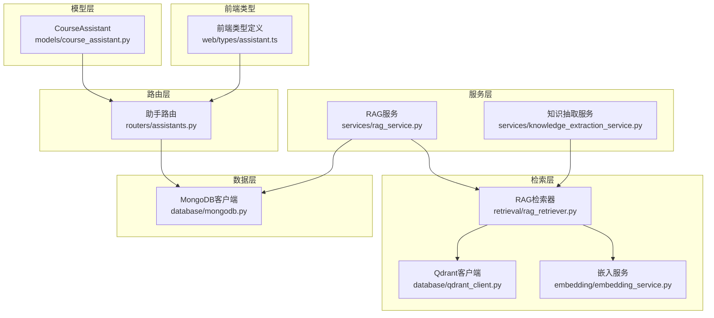
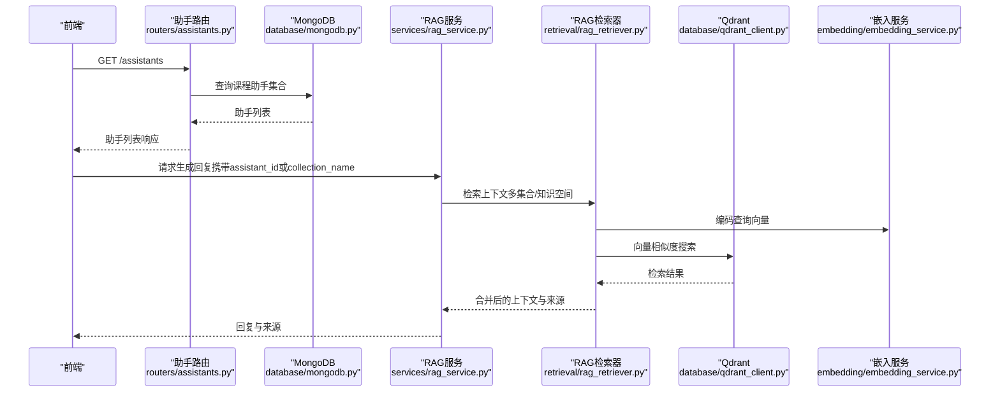
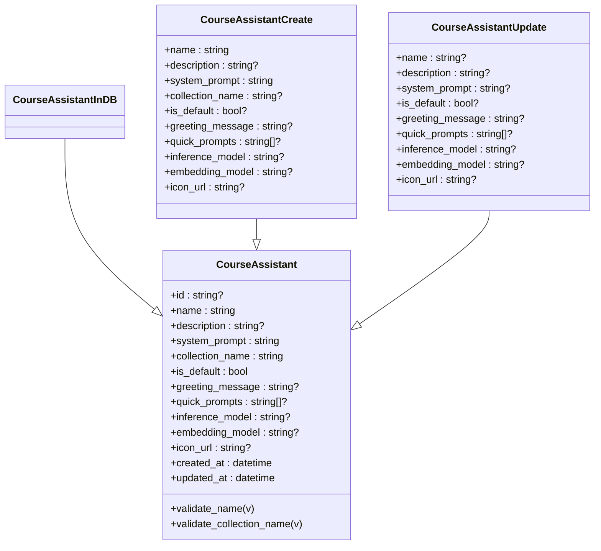
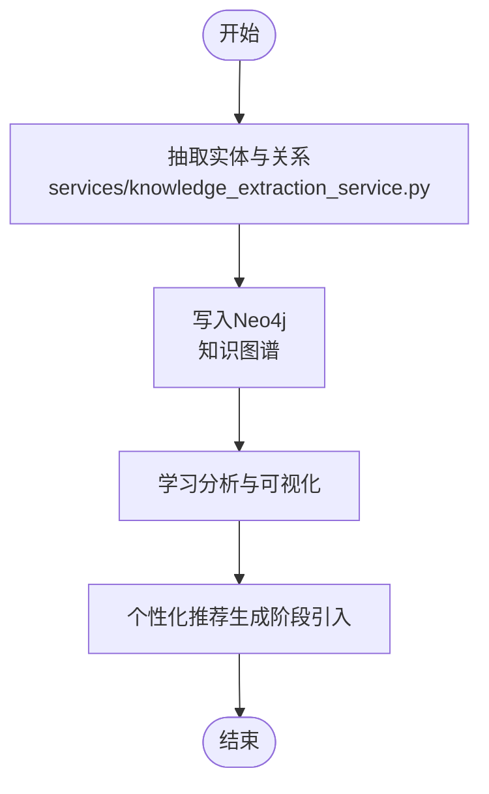
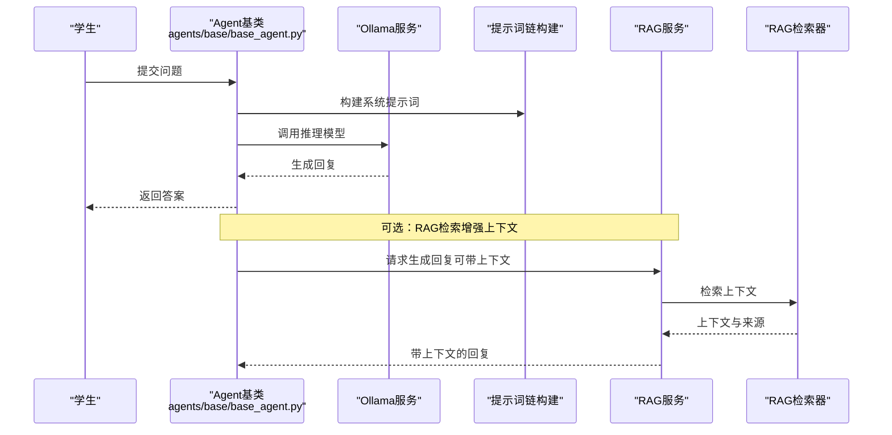
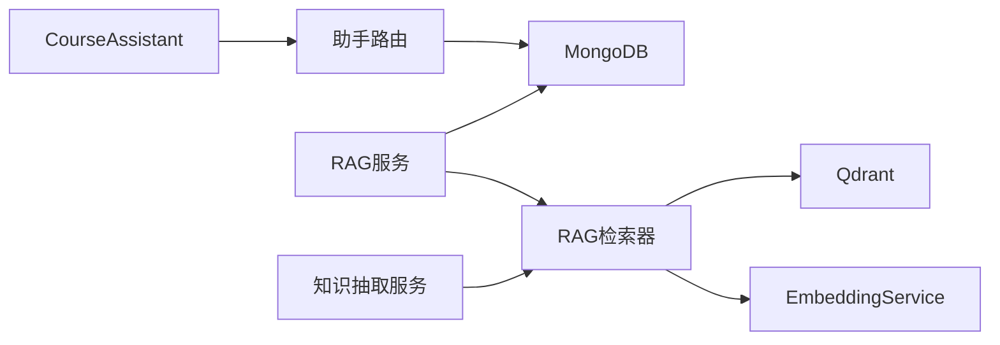
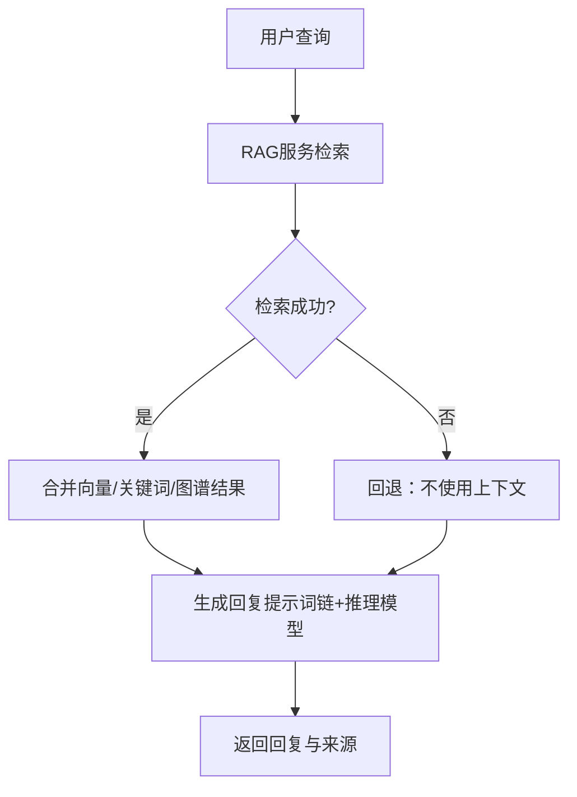

# 课程助手模型

<cite>
**本文引用的文件**
- [models/course_assistant.py](file://models/course_assistant.py)
- [routers/assistants.py](file://routers/assistants.py)
- [web/types/assistant.ts](file://web/types/assistant.ts)
- [services/rag_service.py](file://services/rag_service.py)
- [retrieval/rag_retriever.py](file://retrieval/rag_retriever.py)
- [database/qdrant_client.py](file://database/qdrant_client.py)
- [embedding/embedding_service.py](file://embedding/embedding_service.py)
- [database/mongodb.py](file://database/mongodb.py)
- [services/knowledge_extraction_service.py](file://services/knowledge_extraction_service.py)
- [agents/base/base_agent.py](file://agents/base/base_agent.py)
- [models/user.py](file://models/user.py)
</cite>

## 目录
1. [引言](#引言)
2. [项目结构](#项目结构)
3. [核心组件](#核心组件)
4. [架构总览](#架构总览)
5. [详细组件分析](#详细组件分析)
6. [依赖分析](#依赖分析)
7. [性能考虑](#性能考虑)
8. [故障排查指南](#故障排查指南)
9. [结论](#结论)
10. [附录](#附录)

## 引言
本文件围绕课程助手模型展开，系统阐述其设计理念、数据结构、配置参数、与课程与学生群体的关联关系、权限控制、教学场景下的应用模式，以及在课堂互动、作业批改、答疑解惑等场景中的实践路径。文档同时给出与RAG检索、向量化、知识图谱等后端能力的集成方式，帮助读者快速理解并落地使用。

## 项目结构
课程助手模型位于后端模型层，配合路由层提供只读接口，前端类型定义与之对应，后端服务层负责RAG检索与生成流程，底层依赖向量数据库与嵌入服务。

**图表来源**
- [models/course_assistant.py:1-77](file://models/course_assistant.py#L1-L77)
- [routers/assistants.py:1-120](file://routers/assistants.py#L1-L120)
- [web/types/assistant.ts:1-45](file://web/types/assistant.ts#L1-L45)
- [services/rag_service.py:1-248](file://services/rag_service.py#L1-L248)
- [retrieval/rag_retriever.py:1-325](file://retrieval/rag_retriever.py#L1-L325)
- [database/qdrant_client.py:1-544](file://database/qdrant_client.py#L1-L544)
- [embedding/embedding_service.py:1-278](file://embedding/embedding_service.py#L1-L278)
- [database/mongodb.py:1-1290](file://database/mongodb.py#L1-L1290)
- [services/knowledge_extraction_service.py:1-211](file://services/knowledge_extraction_service.py#L1-L211)

**章节来源**
- [models/course_assistant.py:1-77](file://models/course_assistant.py#L1-L77)
- [routers/assistants.py:1-120](file://routers/assistants.py#L1-L120)
- [web/types/assistant.ts:1-45](file://web/types/assistant.ts#L1-L45)

## 核心组件
- 课程助手模型（CourseAssistant）：定义助手的公开信息与数据库存储形态，包含名称、描述、系统提示词、集合名称、默认标记、问候语、快捷提示词、推理与向量化模型、图标URL及时间戳等字段，并提供名称与集合名称的校验逻辑。
- 助手路由（Assistants Router）：提供助手列表与详情的只读接口，从MongoDB集合读取数据并返回前端所需结构。
- 前端类型（assistant.ts）：与后端模型一致的类型定义，便于前后端契约一致。
- RAG服务（RAGService）：负责检索上下文与生成回复，支持基于知识空间/助手集合的检索，兼容对话附件与文档来源。
- RAG检索器（RAGRetriever）：实现向量检索、关键词检索、图谱检索与结果融合，支持多策略混合与可选重排。
- 向量数据库与嵌入（Qdrant + EmbeddingService）：提供向量集合管理、相似度搜索与文本向量化能力。
- 知识抽取（KnowledgeExtractionService）：从文本抽取三元组并写入Neo4j，支撑图谱检索。
- 数据库（MongoDB）：提供课程助手、文档、分块等集合的读写能力。

**章节来源**
- [models/course_assistant.py:8-77](file://models/course_assistant.py#L8-L77)
- [routers/assistants.py:17-120](file://routers/assistants.py#L17-L120)
- [web/types/assistant.ts:1-45](file://web/types/assistant.ts#L1-L45)
- [services/rag_service.py:7-248](file://services/rag_service.py#L7-L248)
- [retrieval/rag_retriever.py:22-325](file://retrieval/rag_retriever.py#L22-L325)
- [database/qdrant_client.py:18-544](file://database/qdrant_client.py#L18-L544)
- [embedding/embedding_service.py:8-278](file://embedding/embedding_service.py#L8-L278)
- [services/knowledge_extraction_service.py:10-211](file://services/knowledge_extraction_service.py#L10-L211)
- [database/mongodb.py:92-200](file://database/mongodb.py#L92-L200)

## 架构总览
课程助手贯穿“配置—检索—生成—反馈”的闭环。前端通过只读路由获取助手配置，后端RAG服务根据助手或知识空间选择对应的Qdrant集合，检索器聚合向量、关键词与图谱结果，最终由提示词链与推理模型生成回答。

**图表来源**
- [routers/assistants.py:40-120](file://routers/assistants.py#L40-L120)
- [database/mongodb.py:191-196](file://database/mongodb.py#L191-L196)
- [services/rag_service.py:10-242](file://services/rag_service.py#L10-L242)
- [retrieval/rag_retriever.py:69-101](file://retrieval/rag_retriever.py#L69-L101)
- [database/qdrant_client.py:336-414](file://database/qdrant_client.py#L336-L414)
- [embedding/embedding_service.py:230-264](file://embedding/embedding_service.py#L230-L264)

## 详细组件分析

### 课程助手模型设计与属性
- 基本属性
  - id：可选标识，用于路由与关联
  - name：助手名称，必填且有限制
  - description：描述
  - system_prompt：系统提示词，决定助手行为与风格
  - collection_name：Qdrant集合名称，决定知识向量空间归属
  - is_default：是否默认助手
  - greeting_message：初始问候语
  - quick_prompts：快捷提示词列表
  - inference_model：推理模型名称（用于生成回复）
  - embedding_model：向量化模型名称（用于文档向量化）
  - icon_url：图标URL
  - created_at/updated_at：时间戳
- 校验规则
  - 名称非空且长度限制
  - 集合名称仅允许字母、数字、下划线、连字符，长度限制，且符合Qdrant命名规范
- 存储形态
  - CourseAssistant：公开信息模型
  - CourseAssistantInDB：数据库存储形态（继承公开模型）
  - CourseAssistantCreate/Update：创建与更新请求模型，字段与公开模型基本一致，便于前后端契约统一

**图表来源**
- [models/course_assistant.py:8-77](file://models/course_assistant.py#L8-L77)

**章节来源**
- [models/course_assistant.py:8-77](file://models/course_assistant.py#L8-L77)

### 助手类型分类与功能定位
- 类型与用途
  - 课程专属助手：通过system_prompt与collection_name限定教学领域，面向具体课程或知识点空间
  - 默认助手：is_default为true，作为全局默认入口
- 功能定位
  - 教学场景：课堂互动、答疑解惑、作业批改（结合提示词链与工具）、学习分析与个性化推荐（通过检索与来源溯源）
  - 知识空间：每个助手绑定一个或多个Qdrant集合，形成“课程/专题”的知识向量空间

**章节来源**
- [models/course_assistant.py:10-22](file://models/course_assistant.py#L10-L22)
- [services/rag_service.py:34-63](file://services/rag_service.py#L34-L63)

### 教学场景下的特殊需求
- 课堂互动
  - 使用greeting_message与quick_prompts提升首屏体验
  - system_prompt强调教学语气与知识准确性
- 作业批改
  - 通过RAG检索提供参考材料，结合提示词链生成结构化反馈
  - 支持对话附件（文件ID+会话ID）作为检索来源
- 答疑解惑
  - 多策略检索（向量+关键词+图谱）提升召回质量
  - 溯源来源（文档标题、文件类型、状态）辅助教师审核与补充

**章节来源**
- [models/course_assistant.py:16-18](file://models/course_assistant.py#L16-L18)
- [services/rag_service.py:186-191](file://services/rag_service.py#L186-L191)
- [retrieval/rag_retriever.py:140-175](file://retrieval/rag_retriever.py#L140-L175)

### 助手配置参数管理机制
- 配置项
  - 教学目标：通过system_prompt表达
  - 评估标准：可通过提示词链与工具函数在生成流程中体现
  - 交互策略：greeting_message、quick_prompts、inference_model、embedding_model
- 管理方式
  - 前端类型与后端模型一致，便于统一校验与持久化
  - 路由提供只读接口，便于展示与选择

**章节来源**
- [web/types/assistant.ts:1-45](file://web/types/assistant.ts#L1-L45)
- [routers/assistants.py:17-37](file://routers/assistants.py#L17-L37)

### 与课程、学生群体的关联关系与权限控制
- 关联关系
  - 课程/知识空间：通过collection_name与Qdrant集合关联
  - 文档：文档元数据包含assistant_id/knowledge_space_id，支持按课程/助手筛选
- 权限控制
  - 用户模型提供细粒度权限字段，涵盖助手管理、文档管理、资源管理、标签管理、基础提示词编辑、邮件发送等
  - 管理员可对可查看/可管理的助手ID列表进行控制

**章节来源**
- [database/mongodb.py:315-551](file://database/mongodb.py#L315-L551)
- [models/user.py:25-68](file://models/user.py#L25-L68)

### 教学效果跟踪、学习分析与个性化推荐
- 效果跟踪
  - 检索来源包含文档标题、文件类型、状态，便于教师核验与追踪
- 学习分析
  - 通过知识抽取服务构建知识图谱，支持实体与关系的可视化与分析
- 个性化推荐
  - 基于检索结果与来源，结合用户画像与偏好（前端可扩展），在生成阶段引入个性化提示词

**图表来源**
- [services/knowledge_extraction_service.py:104-211](file://services/knowledge_extraction_service.py#L104-L211)

**章节来源**
- [services/knowledge_extraction_service.py:10-211](file://services/knowledge_extraction_service.py#L10-L211)
- [retrieval/rag_retriever.py:176-261](file://retrieval/rag_retriever.py#L176-L261)

### 应用模式：课堂互动、作业批改、答疑解惑
- 课堂互动
  - 使用greeting_message与quick_prompts引导学生提问
  - system_prompt约束助手在教学场景下的行为
- 作业批改
  - RAG检索提供参考材料，提示词链生成结构化反馈
  - 支持对话附件作为输入来源
- 答疑解惑
  - 多策略检索融合，保证召回质量
  - 溯源来源便于教师审核与补充

**图表来源**
- [agents/base/base_agent.py:11-122](file://agents/base/base_agent.py#L11-L122)
- [services/rag_service.py:193-242](file://services/rag_service.py#L193-L242)
- [retrieval/rag_retriever.py:69-101](file://retrieval/rag_retriever.py#L69-L101)

**章节来源**
- [agents/base/base_agent.py:11-122](file://agents/base/base_agent.py#L11-L122)
- [services/rag_service.py:193-242](file://services/rag_service.py#L193-L242)
- [retrieval/rag_retriever.py:69-101](file://retrieval/rag_retriever.py#L69-L101)

## 依赖分析
- 模型层依赖
  - CourseAssistant依赖Pydantic进行数据校验与序列化
- 路由层依赖
  - 依赖MongoDB客户端读取course_assistants集合
- 服务层依赖
  - RAG服务依赖MongoDB与RAG检索器，检索器依赖Qdrant与嵌入服务
- 检索层依赖
  - Qdrant客户端负责集合管理与相似度搜索
  - 嵌入服务负责文本向量化
- 知识抽取依赖Neo4j（可选）

**图表来源**
- [models/course_assistant.py:1-77](file://models/course_assistant.py#L1-L77)
- [routers/assistants.py:1-120](file://routers/assistants.py#L1-L120)
- [services/rag_service.py:1-248](file://services/rag_service.py#L1-L248)
- [retrieval/rag_retriever.py:1-325](file://retrieval/rag_retriever.py#L1-L325)
- [database/qdrant_client.py:1-544](file://database/qdrant_client.py#L1-L544)
- [embedding/embedding_service.py:1-278](file://embedding/embedding_service.py#L1-L278)
- [services/knowledge_extraction_service.py:1-211](file://services/knowledge_extraction_service.py#L1-L211)

**章节来源**
- [models/course_assistant.py:1-77](file://models/course_assistant.py#L1-L77)
- [routers/assistants.py:1-120](file://routers/assistants.py#L1-L120)
- [services/rag_service.py:1-248](file://services/rag_service.py#L1-L248)
- [retrieval/rag_retriever.py:1-325](file://retrieval/rag_retriever.py#L1-L325)
- [database/qdrant_client.py:1-544](file://database/qdrant_client.py#L1-L544)
- [embedding/embedding_service.py:1-278](file://embedding/embedding_service.py#L1-L278)
- [services/knowledge_extraction_service.py:1-211](file://services/knowledge_extraction_service.py#L1-L211)

## 性能考虑
- 检索性能
  - 并行执行向量、关键词、图谱检索，随后合并与排序
  - Qdrant使用gRPC连接与连接复用，降低HTTP开销
  - 向量维度与距离度量需与嵌入模型匹配，避免重建集合
- 生成性能
  - Ollama推理模型与嵌入模型可分别配置，按需选择
  - RAG服务支持回退策略（检索失败时可选择不使用上下文）
- 数据库性能
  - MongoDB连接池参数可调，建议在高并发场景下适当增大最大连接数与最小连接数

**章节来源**
- [retrieval/rag_retriever.py:82-101](file://retrieval/rag_retriever.py#L82-L101)
- [database/qdrant_client.py:66-96](file://database/qdrant_client.py#L66-L96)
- [embedding/embedding_service.py:175-264](file://embedding/embedding_service.py#L175-L264)
- [services/rag_service.py:219-237](file://services/rag_service.py#L219-L237)
- [database/mongodb.py:122-136](file://database/mongodb.py#L122-L136)

## 故障排查指南
- 助手列表/详情接口
  - 确认MongoDB连接参数与集合名称正确
  - 检查日志中异常堆栈，定位具体错误
- RAG检索
  - 检查Qdrant健康状态与集合是否存在
  - 确认嵌入模型名称与向量维度匹配
- 知识抽取
  - Neo4j未连接时会降级，不影响检索主流程
- 权限问题
  - 管理员需具备相应权限字段，方可管理助手与文档

**章节来源**
- [routers/assistants.py:74-118](file://routers/assistants.py#L74-L118)
- [database/qdrant_client.py:124-139](file://database/qdrant_client.py#L124-L139)
- [services/knowledge_extraction_service.py:152-156](file://services/knowledge_extraction_service.py#L152-L156)
- [models/user.py:25-68](file://models/user.py#L25-L68)

## 结论
课程助手模型以“配置—检索—生成—反馈”为核心闭环，通过系统提示词与知识空间的组合，满足教学场景的多样化需求。借助RAG检索与知识图谱能力，系统能够提供高质量的课堂互动、作业批改与答疑解惑服务，并为教学效果跟踪与个性化推荐奠定基础。权限控制与前端类型契约进一步保障了系统的可维护性与一致性。

## 附录
- 关键流程图（检索与生成）

**图表来源**
- [services/rag_service.py:10-242](file://services/rag_service.py#L10-L242)
- [retrieval/rag_retriever.py:69-101](file://retrieval/rag_retriever.py#L69-L101)