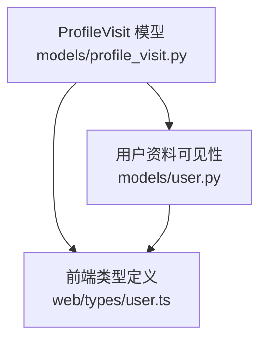
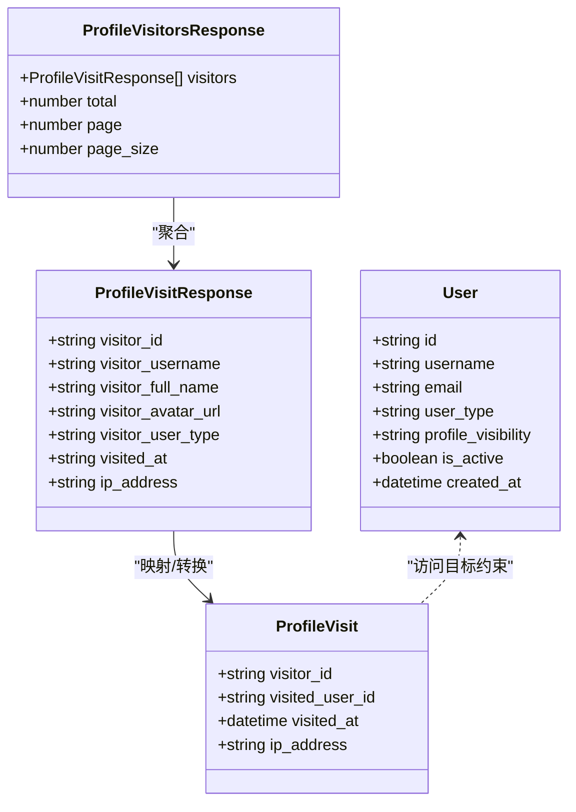
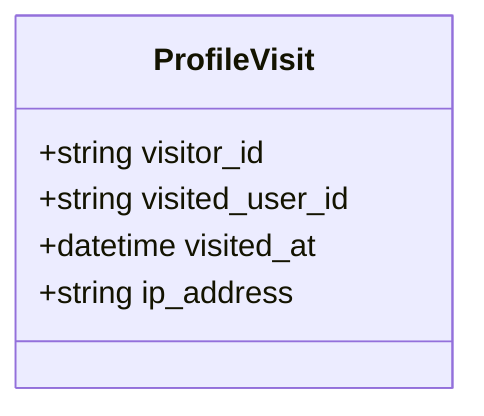
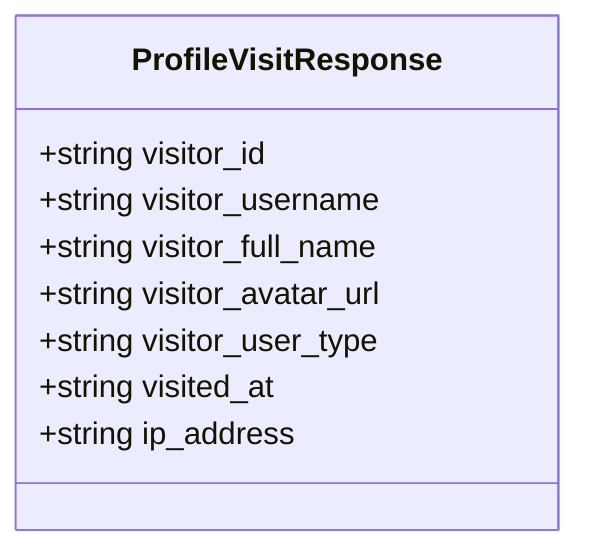
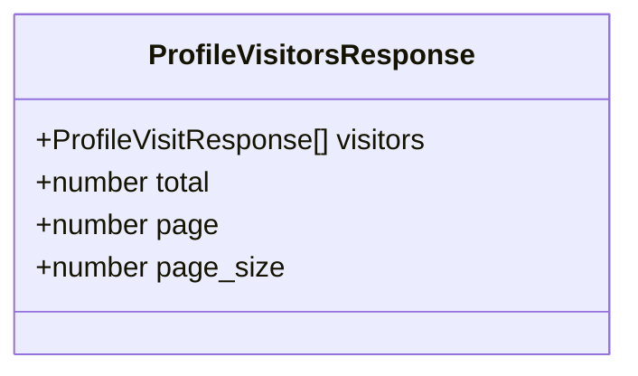
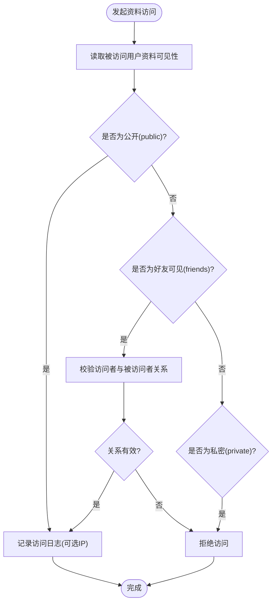
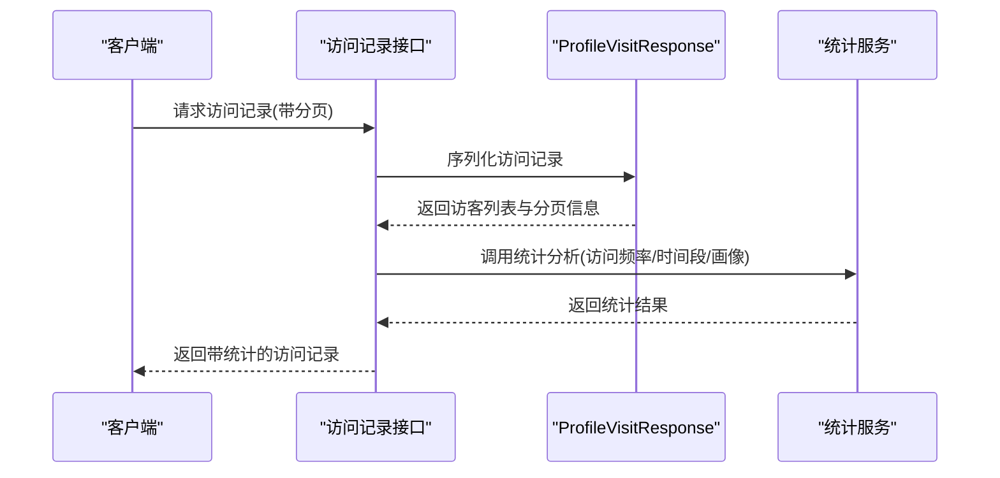

# 资料访问模型

<cite>
**本文引用的文件**
- [models/profile_visit.py](file://models/profile_visit.py)
- [models/user.py](file://models/user.py)
- [web/types/user.ts](file://web/types/user.ts)
</cite>

## 目录
1. [引言](#引言)
2. [项目结构](#项目结构)
3. [核心组件](#核心组件)
4. [架构总览](#架构总览)
5. [详细组件分析](#详细组件分析)
6. [依赖关系分析](#依赖关系分析)
7. [性能考量](#性能考量)
8. [故障排查指南](#故障排查指南)
9. [结论](#结论)
10. [附录](#附录)

## 引言
本文件围绕“资料访问模型”进行系统化技术文档整理，重点阐述 ProfileVisit 访问记录模型的设计理念与实现细节，覆盖访问记录基本属性（访问者 ID、被访问用户 ID、访问时间、访问 IP 等），并结合用户资料可见性策略（公开、私密、好友可见）给出访问权限控制与隐私保护机制说明。同时，基于现有模型结构，提供访问日志统计分析的可行路径、访问记录存储策略建议与隐私保护措施，并补充访问异常检测、安全审计与合规性管理的实践建议。

## 项目结构
资料访问模型位于后端模型层，与用户模型协同工作，前端类型定义与之保持一致，确保跨端一致性。关键文件如下：
- models/profile_visit.py：定义访问记录数据模型与响应模型
- models/user.py：定义用户模型及资料可见性字段
- web/types/user.ts：前端 TypeScript 类型定义，包含用户资料可见性枚举

图表来源
- [models/profile_visit.py:1-32](file://models/profile_visit.py#L1-L32)
- [models/user.py:69](file://models/user.py#L69)
- [web/types/user.ts:4](file://web/types/user.ts#L4)

章节来源
- [models/profile_visit.py:1-32](file://models/profile_visit.py#L1-L32)
- [models/user.py:69](file://models/user.py#L69)
- [web/types/user.ts:4](file://web/types/user.ts#L4)

## 核心组件
- 访问记录模型 ProfileVisit：承载单条访问记录，包含访问者标识、被访问用户标识、访问时间与可选的访问 IP。
- 访问记录响应模型 ProfileVisitResponse：面向接口返回的访问记录结构，包含访客基本信息与访问时间字符串化表示。
- 访客列表响应模型 ProfileVisitorsResponse：封装访客列表、总数、页码与每页大小，便于分页展示。
- 用户资料可见性字段 profile_visibility：在用户模型中定义，支持公开（public）、私密（private）、好友（friends）三种可见性级别。

章节来源
- [models/profile_visit.py:7-31](file://models/profile_visit.py#L7-L31)
- [models/user.py:69](file://models/user.py#L69)

## 架构总览
资料访问模型与用户模型之间的协作关系如下：
- 访问记录模型用于持久化访问行为，为后续统计分析与审计提供数据基础。
- 用户模型中的 profile_visibility 字段决定访问是否被允许以及可见范围。
- 前端类型定义与后端模型保持一致，确保接口契约稳定。

图表来源
- [models/profile_visit.py:7-31](file://models/profile_visit.py#L7-L31)
- [models/user.py:8-27](file://models/user.py#L8-L27)

## 详细组件分析

### 访问记录模型 ProfileVisit
- 设计理念
  - 使用 Pydantic BaseModel 进行数据校验与序列化，保证入参与出参的一致性与安全性。
  - 访问时间采用 datetime 类型，便于后续进行时间维度的统计分析。
  - 访问 IP 字段为可选，满足隐私保护需求；在需要审计时可启用采集。
- 关键属性
  - visitor_id：访问者唯一标识
  - visited_user_id：被访问用户唯一标识
  - visited_at：访问发生的时间戳
  - ip_address：访问来源 IP（可选）

图表来源
- [models/profile_visit.py:7-12](file://models/profile_visit.py#L7-L12)

章节来源
- [models/profile_visit.py:7-12](file://models/profile_visit.py#L7-L12)

### 访问记录响应模型 ProfileVisitResponse
- 设计目的
  - 将访问记录与访客公开信息关联，便于前端展示访客头像、用户名、类型等。
  - visited_at 以字符串形式返回，降低前端解析复杂度。
- 关键字段
  - visitor_id、visitor_username、visitor_full_name、visitor_avatar_url、visitor_user_type
  - visited_at（字符串化时间）
  - ip_address（可选）

图表来源
- [models/profile_visit.py:15-23](file://models/profile_visit.py#L15-L23)

章节来源
- [models/profile_visit.py:15-23](file://models/profile_visit.py#L15-L23)

### 访客列表响应模型 ProfileVisitorsResponse
- 设计目的
  - 支持分页展示访问历史，便于大规模数据场景下的高效浏览。
- 关键字段
  - visitors：访问记录响应列表
  - total：总记录数
  - page、page_size：分页参数

图表来源
- [models/profile_visit.py:26-31](file://models/profile_visit.py#L26-L31)

章节来源
- [models/profile_visit.py:26-31](file://models/profile_visit.py#L26-L31)

### 用户资料可见性与访问控制策略
- 可见性级别
  - public（公开）：所有登录用户或匿名用户均可查看公开资料
  - private（私密）：仅本人可见，禁止他人访问
  - friends（好友）：仅建立特定关系的用户可查看
- 策略说明
  - 访问控制应在业务层进行前置校验：当访问目标用户资料可见性为 private 时，拒绝访问；当为 friends 时，需进一步校验访问者与被访问者的关系是否满足预设条件。
  - 对 public 资料，可按需记录访问日志；对非公开资料，建议仅在授权通过后才写入访问日志，以减少敏感数据暴露面。

图表来源
- [models/user.py:69](file://models/user.py#L69)
- [models/profile_visit.py:7-12](file://models/profile_visit.py#L7-L12)

章节来源
- [models/user.py:69](file://models/user.py#L69)
- [models/profile_visit.py:7-12](file://models/profile_visit.py#L7-L12)

### 访问日志统计分析（基于现有模型的可行路径）
- 访问频率
  - 可按天/周/月统计 visited_user_id 的访问次数，识别活跃访客与热点用户。
- 时间段分布
  - 基于 visited_at 的时间戳，统计不同小时/星期的访问峰值，辅助运营与内容策略。
- 用户画像分析
  - 结合 ProfileVisitResponse 中的 visitor_user_type、visitor_full_name 等字段，构建访客画像（如教师/学生比例、活跃时段等）。
- 分页与聚合
  - 使用 ProfileVisitorsResponse 的分页参数，结合数据库聚合查询（如按用户分组、按时间窗口分桶）实现高效统计。

图表来源
- [models/profile_visit.py:15-31](file://models/profile_visit.py#L15-L31)

章节来源
- [models/profile_visit.py:15-31](file://models/profile_visit.py#L15-L31)

### 访问记录存储策略与隐私保护
- 存储策略
  - 访问记录可采用关系型数据库或文档型数据库进行持久化，建议对 visited_user_id、visited_at 建立索引以优化查询。
  - 对于高并发场景，可考虑异步写入或批量入库，降低主流程延迟。
- 隐私保护
  - ip_address 字段为可选，建议在隐私协议允许范围内收集；若不收集，可在接口层屏蔽该字段输出。
  - 对于 private 资料访问，仅在授权通过后写入日志；对 friends 资料访问，建议记录匿名化后的访问摘要，避免泄露具体关系链。

章节来源
- [models/profile_visit.py:7-12](file://models/profile_visit.py#L7-L12)

### 访问异常检测、安全审计与合规性管理
- 异常检测
  - 基于访问频率阈值（如单位时间内访问次数超过阈值）触发告警；对来自不同国家/地区的集中访问进行风险评估。
- 安全审计
  - 对敏感操作（如越权访问尝试、频繁抓取）进行审计日志记录，保留访问时间、访问者标识、目标用户标识与来源 IP。
- 合规性管理
  - 遵循最小必要原则采集访问日志；在用户注销或删除资料时，同步清理相关访问记录；提供数据主体访问、更正、删除的通道。

## 依赖关系分析
- 模型间依赖
  - ProfileVisitResponse 与 ProfileVisit 存在字段映射关系，用于将原始访问记录转换为对外展示的结构。
  - ProfileVisitorsResponse 聚合多个 ProfileVisitResponse，形成分页列表。
  - 用户资料可见性字段 profile_visibility 与访问控制策略强相关，决定是否记录访问日志以及日志的敏感程度。

图表来源
- [models/profile_visit.py:7-31](file://models/profile_visit.py#L7-L31)
- [models/user.py:69](file://models/user.py#L69)

章节来源
- [models/profile_visit.py:7-31](file://models/profile_visit.py#L7-L31)
- [models/user.py:69](file://models/user.py#L69)

## 性能考量
- 查询性能
  - 对 visited_user_id 与 visited_at 建立复合索引，提升按用户与时间范围查询的效率。
- 写入性能
  - 异步写入访问日志，避免阻塞主业务流程；批量入库减少事务开销。
- 存储成本
  - 对历史访问日志进行分层存储（热数据驻留内存/SSD，冷数据迁移至低成本存储），并制定生命周期策略。

## 故障排查指南
- 访问被拒绝
  - 检查被访问用户的 profile_visibility 设置与访问者的授权关系；确认 friends 关系是否满足访问条件。
- 日志缺失
  - 确认是否启用了 ip_address 采集；检查异步写入队列是否正常；核对数据库写入权限与索引状态。
- 统计异常
  - 核对 visited_at 的时区转换逻辑；检查分页参数与聚合查询的边界条件。

章节来源
- [models/user.py:69](file://models/user.py#L69)
- [models/profile_visit.py:7-12](file://models/profile_visit.py#L7-L12)

## 结论
资料访问模型通过简洁的数据结构与清晰的可见性策略，为平台提供了可扩展的访问控制与审计基础。结合合理的统计分析与隐私保护措施，可在保障用户体验的同时满足合规要求。建议在实际落地时完善访问控制前置校验、增强异常检测与审计能力，并持续优化存储与查询性能。

## 附录
- 前端类型一致性
  - 前端 TypeScript 类型定义中包含 ProfileVisibility 枚举，与后端模型保持一致，有助于接口契约的稳定性与可维护性。

章节来源
- [web/types/user.ts:4](file://web/types/user.ts#L4)