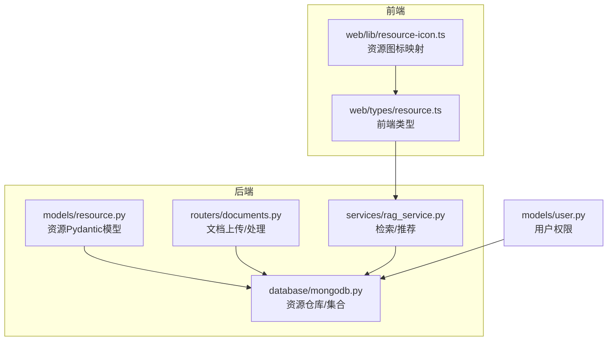
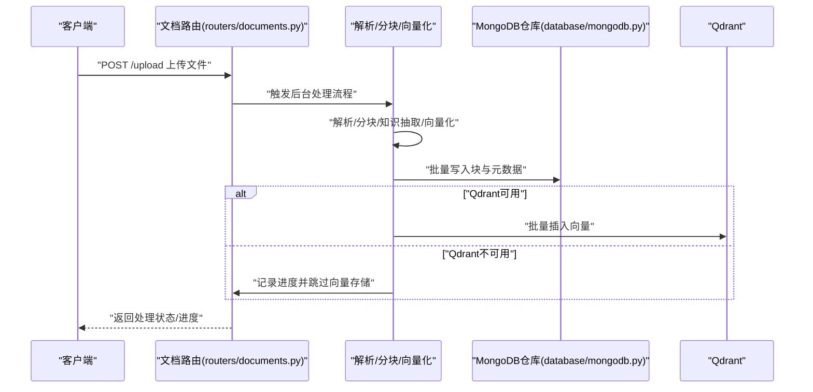
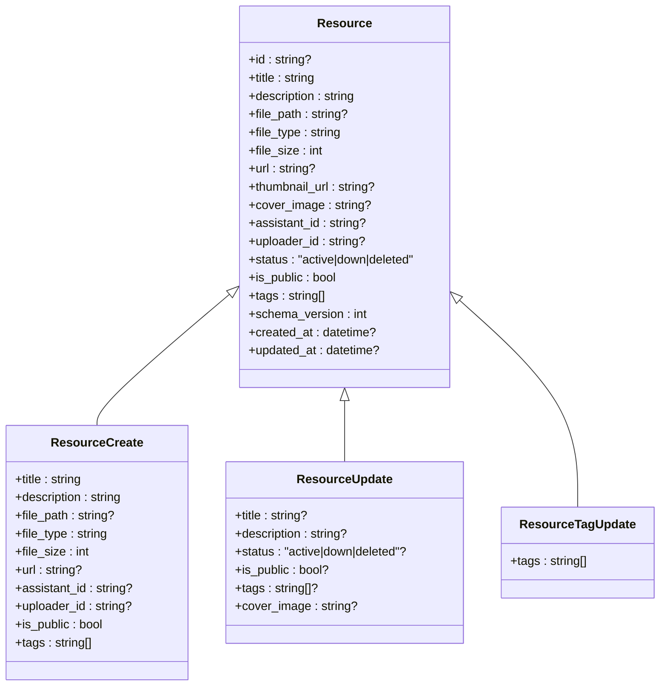
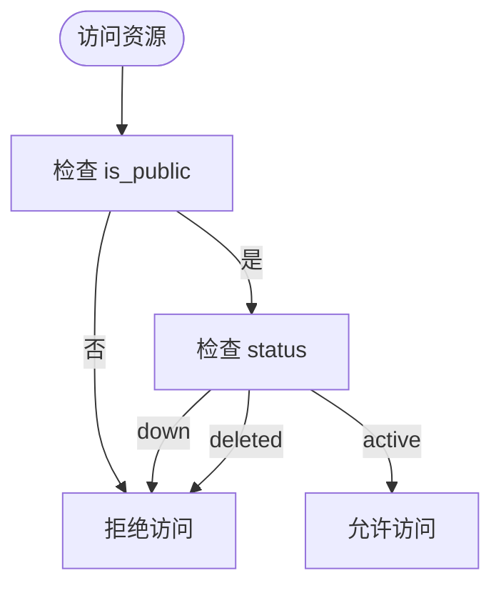
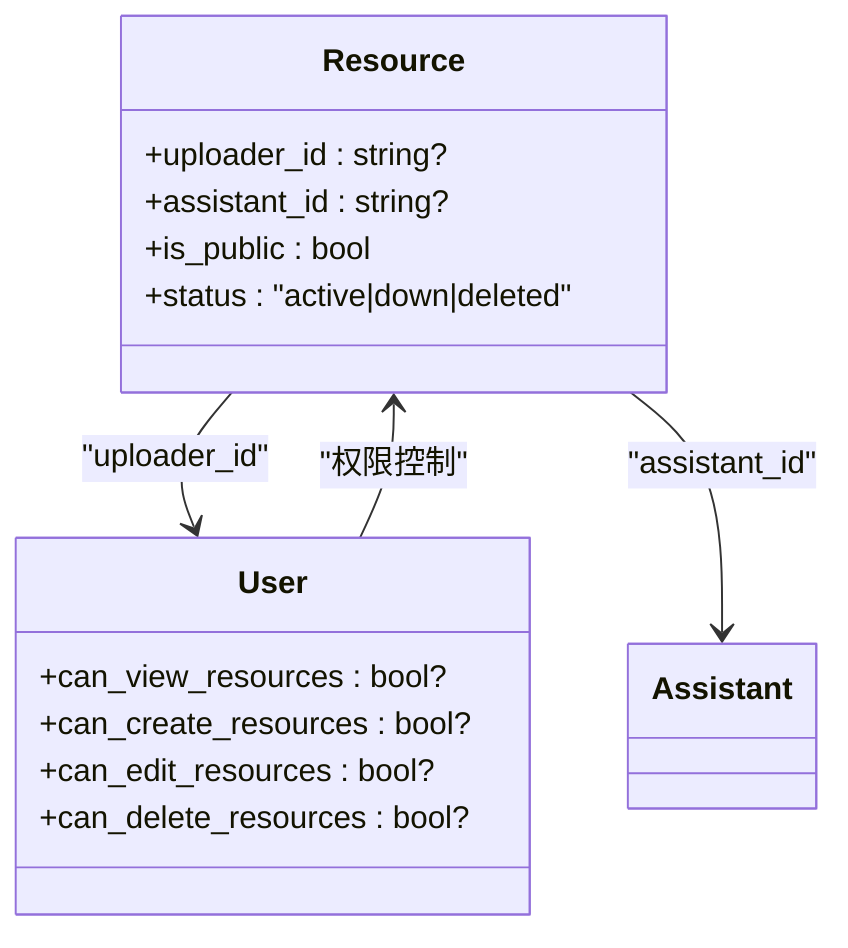
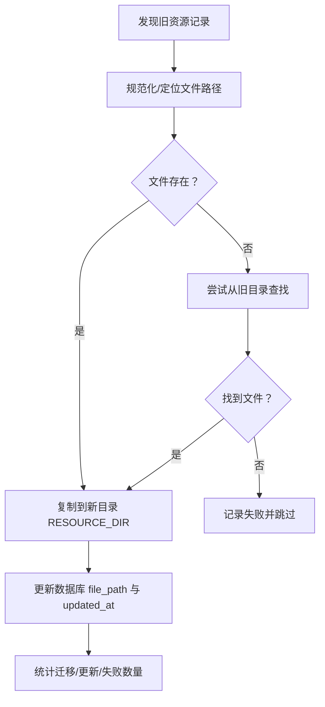
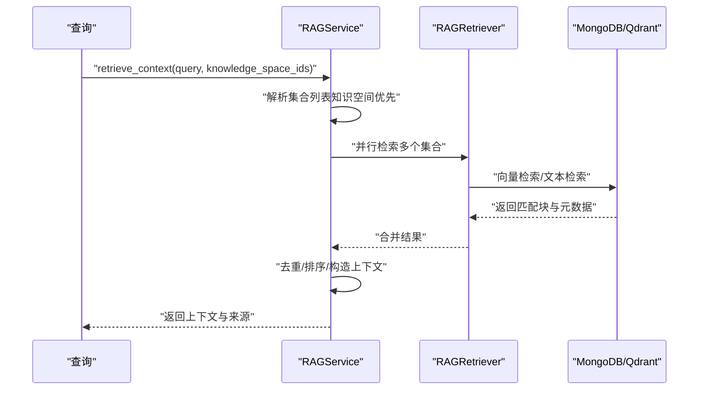
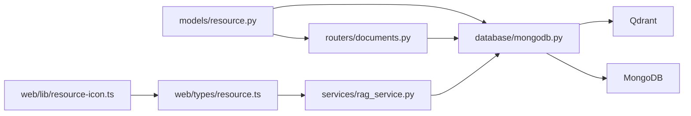

# 资源模型

<cite>
**本文引用的文件**
- [models/resource.py](file://models/resource.py)
- [web/types/resource.ts](file://web/types/resource.ts)
- [database/mongodb.py](file://database/mongodb.py)
- [routers/documents.py](file://routers/documents.py)
- [services/rag_service.py](file://services/rag_service.py)
- [utils/migrate_resources.py](file://utils/migrate_resources.py)
- [web/lib/resource-icon.ts](file://web/lib/resource-icon.ts)
- [models/user.py](file://models/user.py)
</cite>

## 目录
1. [简介](#简介)
2. [项目结构](#项目结构)
3. [核心组件](#核心组件)
4. [架构总览](#架构总览)
5. [详细组件分析](#详细组件分析)
6. [依赖分析](#依赖分析)
7. [性能考虑](#性能考虑)
8. [故障排查指南](#故障排查指南)
9. [结论](#结论)
10. [附录](#附录)

## 简介
本文件系统性阐述资源模型的设计理念与实现细节，覆盖资源的基本属性、类型分类、元数据管理、访问控制、与用户的关联关系（所有权、共享权限、访问日志）、状态管理（active、down、deleted）、文件存储策略、版本与生命周期管理、以及在知识空间中的组织与检索优化机制。文档面向技术与非技术读者，提供可视化图示与循序渐进的说明。

## 项目结构
围绕资源模型的关键文件分布如下：
- 后端模型定义与校验：models/resource.py
- 前端类型声明：web/types/resource.ts
- 数据持久化与资源仓库：database/mongodb.py
- 文档上传与处理流程：routers/documents.py
- 检索与推荐服务：services/rag_service.py
- 资源迁移工具：utils/migrate_resources.py
- 前端资源图标映射：web/lib/resource-icon.ts
- 用户细粒度权限（资源相关）：models/user.py

**图表来源**
- [models/resource.py:1-90](file://models/resource.py#L1-L90)
- [database/mongodb.py:1000-1199](file://database/mongodb.py#L1000-L1199)
- [routers/documents.py:1-800](file://routers/documents.py#L1-L800)
- [services/rag_service.py:1-248](file://services/rag_service.py#L1-L248)
- [web/types/resource.ts:1-44](file://web/types/resource.ts#L1-L44)
- [web/lib/resource-icon.ts:1-144](file://web/lib/resource-icon.ts#L1-L144)
- [models/user.py:25-51](file://models/user.py#L25-L51)

**章节来源**
- [models/resource.py:1-90](file://models/resource.py#L1-L90)
- [web/types/resource.ts:1-44](file://web/types/resource.ts#L1-L44)
- [database/mongodb.py:1000-1199](file://database/mongodb.py#L1000-L1199)
- [routers/documents.py:1-800](file://routers/documents.py#L1-L800)
- [services/rag_service.py:1-248](file://services/rag_service.py#L1-L248)
- [utils/migrate_resources.py:1-337](file://utils/migrate_resources.py#L1-L337)
- [web/lib/resource-icon.ts:1-144](file://web/lib/resource-icon.ts#L1-L144)
- [models/user.py:25-51](file://models/user.py#L25-L51)

## 核心组件
- 资源模型（Python）：定义资源的字段、默认值、枚举状态、URL格式校验等。
- 资源仓库（MongoDB）：提供资源的增删改查、统计、迁移、状态更新等能力。
- 文档上传与处理流程：负责文件解析、分块、向量化、存储到MongoDB与Qdrant。
- 检索与推荐服务：基于知识空间集合检索上下文，整合资源推荐。
- 前端类型与图标：定义资源在前端的数据结构与图标映射。
- 资源迁移工具：统一资源文件存储路径，兼容历史版本。
- 用户权限：定义资源管理的细粒度权限位。

**章节来源**
- [models/resource.py:8-90](file://models/resource.py#L8-L90)
- [database/mongodb.py:1000-1199](file://database/mongodb.py#L1000-L1199)
- [routers/documents.py:274-800](file://routers/documents.py#L274-L800)
- [services/rag_service.py:10-242](file://services/rag_service.py#L10-L242)
- [web/types/resource.ts:1-44](file://web/types/resource.ts#L1-L44)
- [utils/migrate_resources.py:132-337](file://utils/migrate_resources.py#L132-L337)
- [models/user.py:25-51](file://models/user.py#L25-L51)

## 架构总览
资源模型贯穿“上传-解析-分块-向量化-存储-检索”的全链路，后端通过MongoDB与Qdrant协同存储，前端通过类型与图标映射提升用户体验。

**图表来源**
- [routers/documents.py:274-800](file://routers/documents.py#L274-L800)
- [database/mongodb.py:546-721](file://database/mongodb.py#L546-L721)

## 详细组件分析

### 资源模型设计与属性
- 基本属性
  - 标识与标题：id、title
  - 描述与摘要：description
  - 文件与链接：file_path（本地路径，可选）、file_type、file_size、url（外部链接，可选）
  - 媒体封面：thumbnail_url（视频封面）、cover_image（管理员上传封面）
  - 关联与归属：assistant_id、uploader_id
  - 状态与可见性：status（active/down/deleted）、is_public
  - 元数据：tags（标签列表）、schema_version（模型版本）、created_at、updated_at
- URL校验
  - 提供独立校验函数与Pydantic字段校验，确保外部链接格式合法
- 版本兼容
  - schema_version=2，支持从旧版本迁移补齐缺失字段

**图表来源**
- [models/resource.py:8-90](file://models/resource.py#L8-L90)

**章节来源**
- [models/resource.py:8-90](file://models/resource.py#L8-L90)

### 资源类型分类与元数据管理
- 类型分类
  - 文件类型：pdf、doc/docx、md/markdown、mp4、图片等
  - 外部链接：识别常见站点（如B站、GitHub、抖音、微信），并映射图标与标签
- 元数据
  - tags：标签列表，用于检索与推荐
  - schema_version：模型版本，保障迁移兼容
  - created_at/updated_at：时间戳，便于审计与排序

**章节来源**
- [web/lib/resource-icon.ts:15-142](file://web/lib/resource-icon.ts#L15-L142)
- [models/resource.py:23-26](file://models/resource.py#L23-L26)

### 访问控制机制
- 可见性控制
  - is_public：是否公开，影响检索与展示范围
- 状态控制
  - status：active（正常）、down（下架）、deleted（删除）
- 用户权限
  - 用户模型包含资源管理的细粒度权限位（查看、创建、编辑、删除）

**图表来源**
- [models/resource.py:21-22](file://models/resource.py#L21-L22)
- [models/user.py:40-44](file://models/user.py#L40-L44)

**章节来源**
- [models/resource.py:21-22](file://models/resource.py#L21-L22)
- [models/user.py:40-44](file://models/user.py#L40-L44)

### 资源与用户的关联关系
- 所有权与归属
  - uploader_id：上传者标识
  - assistant_id：所属助手（课程助理）标识
- 共享与权限
  - is_public 控制公开范围
  - 用户权限位控制资源管理操作
- 访问日志
  - 仓库层提供点赞、收藏等行为的聚合统计，可用于访问热度与行为追踪

**图表来源**
- [models/resource.py:19-22](file://models/resource.py#L19-L22)
- [models/user.py:40-44](file://models/user.py#L40-L44)

**章节来源**
- [models/resource.py:19-22](file://models/resource.py#L19-L22)
- [models/user.py:40-44](file://models/user.py#L40-L44)
- [database/mongodb.py:1178-1230](file://database/mongodb.py#L1178-L1230)

### 资源状态管理策略
- 状态枚举：active、down、deleted
- 生命周期关键节点
  - 创建：默认 active
  - 下架：设置 down
  - 删除：物理删除或标记 deleted
- 仓库接口
  - 更新标题/描述/状态等字段
  - 统计资源数量（可按状态与公开性过滤）

**章节来源**
- [models/resource.py:21](file://models/resource.py#L21)
- [database/mongodb.py:1030-1065](file://database/mongodb.py#L1030-L1065)
- [database/mongodb.py:1139-1175](file://database/mongodb.py#L1139-L1175)

### 资源文件存储策略与版本管理
- 存储位置
  - file_path：统一挂载到 RESOURCE_DIR 的绝对路径，便于集中管理
- 路径迁移
  - 迁移脚本扫描旧目录与数据库记录，将文件复制到新目录并更新路径
- 版本兼容
  - schema_version=2，迁移脚本自动补齐旧版本缺失字段（如 status、is_public、tags 等）

**图表来源**
- [utils/migrate_resources.py:132-337](file://utils/migrate_resources.py#L132-L337)

**章节来源**
- [utils/migrate_resources.py:132-337](file://utils/migrate_resources.py#L132-L337)
- [database/mongodb.py:1067-1137](file://database/mongodb.py#L1067-L1137)

### 知识空间中的组织与检索优化
- 知识空间集合
  - 文档处理阶段根据知识空间 ID 获取集合名称，默认集合为 default_knowledge
- 检索流程
  - RAGService 并行检索多个知识空间集合，合并结果并去重
  - 按分数排序，构建上下文与来源信息
- 推荐机制
  - 结合向量相似度与关键词匹配（标题、描述、标签）综合评分

**图表来源**
- [services/rag_service.py:10-242](file://services/rag_service.py#L10-L242)
- [routers/documents.py:498-721](file://routers/documents.py#L498-L721)

**章节来源**
- [services/rag_service.py:10-242](file://services/rag_service.py#L10-L242)
- [routers/documents.py:498-721](file://routers/documents.py#L498-L721)

## 依赖分析
- 模型与仓库
  - Resource 模型被仓库层查询、更新、统计等操作使用
- 前后端类型一致性
  - Python 模型与前端 TypeScript 类型字段需保持一致，避免序列化/反序列化错误
- 外部依赖
  - Qdrant：向量存储与检索
  - MongoDB：文档与资源元数据存储
  - 解析/分块/向量化服务：文档处理流水线

**图表来源**
- [models/resource.py:8-90](file://models/resource.py#L8-L90)
- [database/mongodb.py:1000-1199](file://database/mongodb.py#L1000-L1199)
- [routers/documents.py:274-800](file://routers/documents.py#L274-L800)
- [services/rag_service.py:10-242](file://services/rag_service.py#L10-L242)
- [web/types/resource.ts:1-44](file://web/types/resource.ts#L1-44)
- [web/lib/resource-icon.ts:1-144](file://web/lib/resource-icon.ts#L1-L144)

**章节来源**
- [models/resource.py:8-90](file://models/resource.py#L8-L90)
- [database/mongodb.py:1000-1199](file://database/mongodb.py#L1000-L1199)
- [routers/documents.py:274-800](file://routers/documents.py#L274-L800)
- [services/rag_service.py:10-242](file://services/rag_service.py#L10-L242)
- [web/types/resource.ts:1-44](file://web/types/resource.ts#L1-L44)
- [web/lib/resource-icon.ts:1-144](file://web/lib/resource-icon.ts#L1-L144)

## 性能考虑
- 并发与批处理
  - 文档向量化采用批处理（每批50），降低内存峰值
  - 知识抽取采用信号量限制并发（最多3），避免下游服务过载
- 超时与进度反馈
  - 解析、分块、向量化均设置超时与周期性进度更新，提升可观测性
- 存储策略
  - Qdrant 可用时优先存储向量；不可用时降级至仅存储到 MongoDB
- 检索优化
  - 多知识空间集合并行检索，结果去重与排序，减少冗余

**章节来源**
- [routers/documents.py:114-187](file://routers/documents.py#L114-L187)
- [routers/documents.py:190-271](file://routers/documents.py#L190-L271)
- [routers/documents.py:400-453](file://routers/documents.py#L400-L453)
- [routers/documents.py:466-672](file://routers/documents.py#L466-L672)
- [services/rag_service.py:64-83](file://services/rag_service.py#L64-L83)

## 故障排查指南
- URL 校验失败
  - 现象：创建/更新资源时报无效URL格式
  - 排查：确认输入URL符合 http(s) 协议与域名/IP格式
- 文件迁移失败
  - 现象：资源文件路径未更新或文件缺失
  - 排查：检查旧目录是否存在、新目录权限、迁移脚本日志
- Qdrant 不可用
  - 现象：向量存储失败或进度停留在存储阶段
  - 排查：检查 Qdrant 服务健康状态、网络连通性、集合创建与维度
- 权限不足
  - 现象：无法查看/编辑/删除资源
  - 排查：核对用户资源管理权限位（查看、创建、编辑、删除）

**章节来源**
- [models/resource.py:42-74](file://models/resource.py#L42-L74)
- [utils/migrate_resources.py:132-337](file://utils/migrate_resources.py#L132-L337)
- [routers/documents.py:546-569](file://routers/documents.py#L546-L569)
- [models/user.py:40-44](file://models/user.py#L40-L44)

## 结论
资源模型以清晰的属性定义、严格的访问控制与完善的生命周期管理为基础，结合统一的文件存储策略与版本迁移机制，支撑了从上传、解析、向量化到检索与推荐的完整链路。前端类型与图标映射进一步提升了交互体验。通过并行检索与批处理优化，系统在高并发场景下具备良好的稳定性与性能表现。

## 附录
- 前端资源类型与图标映射
  - 外部链接：识别 B站、GitHub、抖音、微信，返回对应图标与标签
  - 文件类型：PDF、Word、Markdown、视频、图片等，映射到相应图标
- 用户权限位（资源相关）
  - can_view_resources、can_create_resources、can_edit_resources、can_delete_resources

**章节来源**
- [web/lib/resource-icon.ts:15-142](file://web/lib/resource-icon.ts#L15-L142)
- [models/user.py:40-44](file://models/user.py#L40-L44)