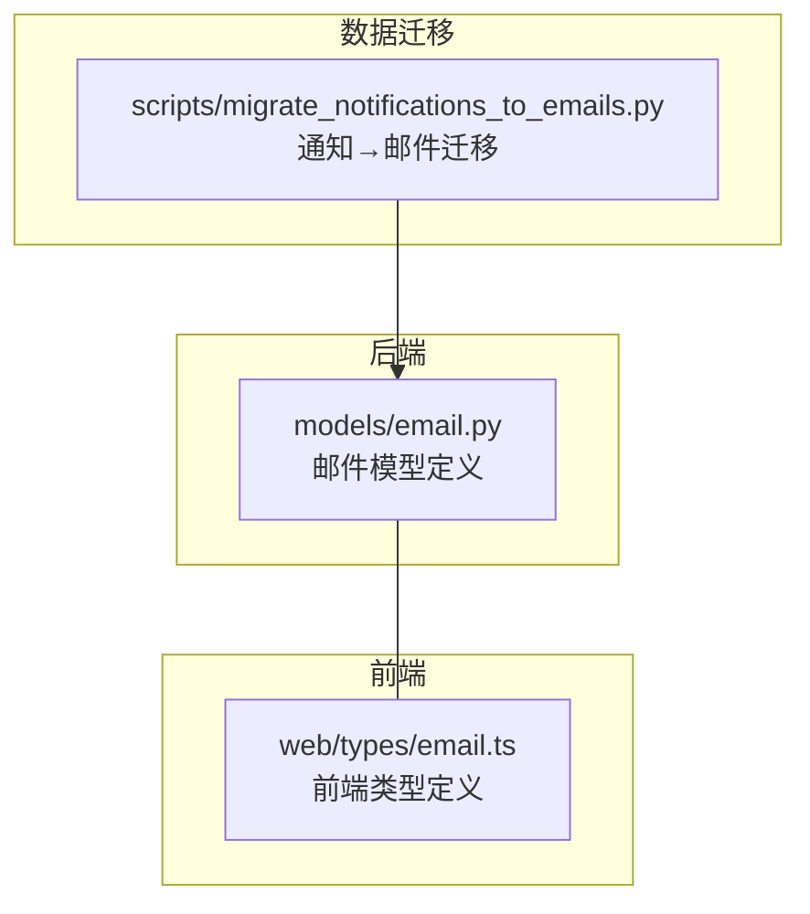
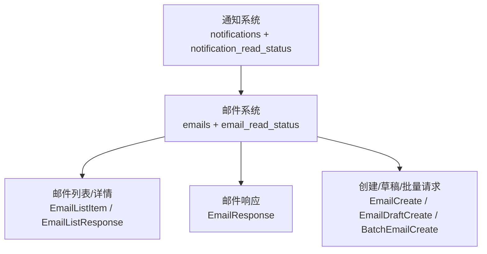
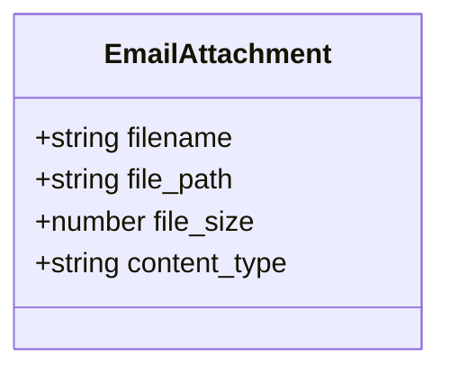
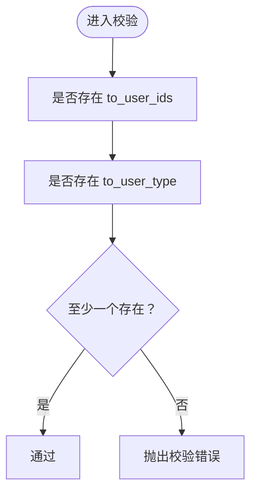
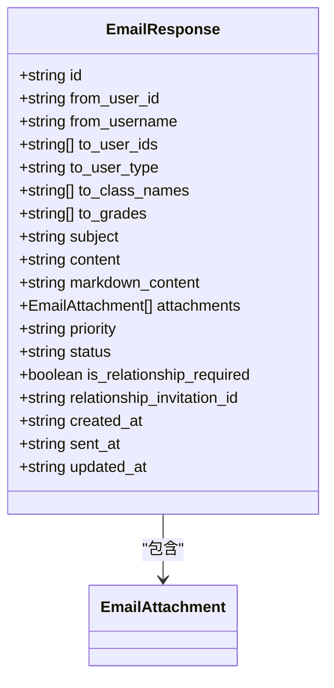
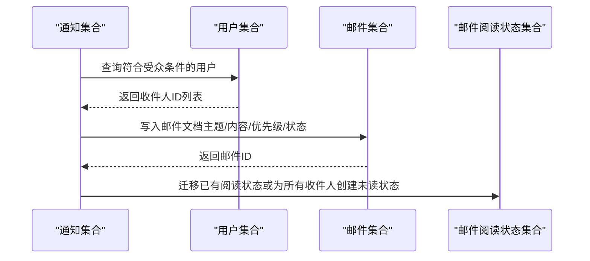
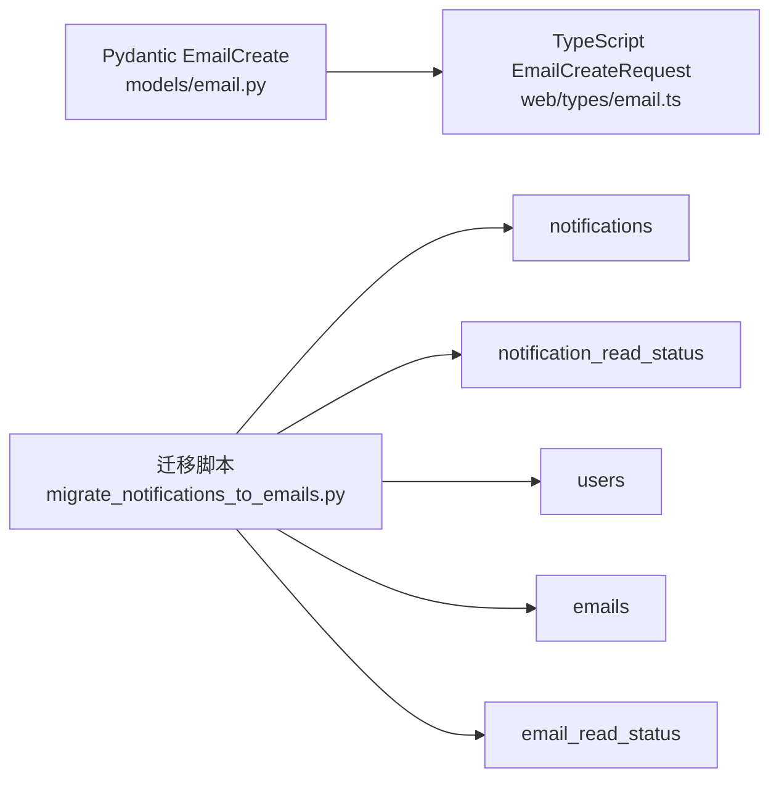

# 邮件模型

<cite>
**本文引用的文件**
- [models/email.py](file://models/email.py)
- [web/types/email.ts](file://web/types/email.ts)
- [scripts/migrate_notifications_to_emails.py](file://scripts/migrate_notifications_to_emails.py)
</cite>

## 目录
1. [简介](#简介)
2. [项目结构](#项目结构)
3. [核心组件](#核心组件)
4. [架构总览](#架构总览)
5. [详细组件分析](#详细组件分析)
6. [依赖分析](#依赖分析)
7. [性能考虑](#性能考虑)
8. [故障排查指南](#故障排查指南)
9. [结论](#结论)
10. [附录](#附录)

## 简介
本文件系统化梳理了邮件模型的设计理念与实现细节，覆盖邮件基本属性、类型与模板思路、队列与发送策略、富文本与附件处理、与用户及通知系统的关联、权限控制、状态跟踪与失败重试、以及在系统通知、用户提醒与批量发送等场景的应用模式。本文以仓库中现有的邮件模型定义与通知迁移脚本为基础进行归纳总结，并辅以可视化图表帮助理解。

## 项目结构
围绕邮件模型的相关文件主要分布在以下位置：
- 后端模型定义：models/email.py
- 前端类型定义：web/types/email.ts
- 数据迁移脚本：scripts/migrate_notifications_to_emails.py

**图表来源**
- [models/email.py:1-104](file://models/email.py#L1-L104)
- [web/types/email.ts:1-89](file://web/types/email.ts#L1-L89)
- [scripts/migrate_notifications_to_emails.py:1-138](file://scripts/migrate_notifications_to_emails.py#L1-L138)

**章节来源**
- [models/email.py:1-104](file://models/email.py#L1-L104)
- [web/types/email.ts:1-89](file://web/types/email.ts#L1-L89)
- [scripts/migrate_notifications_to_emails.py:1-138](file://scripts/migrate_notifications_to_emails.py#L1-L138)

## 核心组件
- 邮件附件模型：EmailAttachment
- 创建邮件请求模型：EmailCreate
- 草稿创建请求模型：EmailDraftCreate
- 邮件响应模型：EmailResponse
- 邮件列表项模型：EmailListItem
- 邮件列表响应模型：EmailListResponse
- 批量发送请求模型：BatchEmailCreate

这些模型共同构成邮件系统的基础数据契约，既用于后端 Pydantic 校验，也映射到前端 TypeScript 类型，确保前后端一致。

**章节来源**
- [models/email.py:7-103](file://models/email.py#L7-L103)
- [web/types/email.ts:6-87](file://web/types/email.ts#L6-L87)

## 架构总览
邮件系统围绕“模型层”和“迁移层”协同工作：
- 模型层：定义邮件实体、附件、列表与请求/响应格式，统一约束字段与取值范围。
- 迁移层：将历史通知数据平滑迁移到邮件集合，保留阅读状态与归档目录。

**图表来源**
- [scripts/migrate_notifications_to_emails.py:17-138](file://scripts/migrate_notifications_to_emails.py#L17-L138)
- [models/email.py:48-103](file://models/email.py#L48-L103)

## 详细组件分析

### 邮件附件模型（EmailAttachment）
- 字段要点：文件名、文件路径、大小、内容类型
- 作用：承载附件元信息，便于下载与展示

**图表来源**
- [models/email.py:7-13](file://models/email.py#L7-L13)
- [web/types/email.ts:6-11](file://web/types/email.ts#L6-L11)

**章节来源**
- [models/email.py:7-13](file://models/email.py#L7-L13)
- [web/types/email.ts:6-11](file://web/types/email.ts#L6-L11)

### 创建邮件请求模型（EmailCreate）
- 收件人选择策略：
  - 点对点：to_user_ids
  - 用户类型：to_user_type ∈ {all, students, teachers}
  - 班级/年级限定：to_class_names、to_grades（面向普通管理员）
- 内容与优先级：subject、content、markdown_content、priority ∈ {low, normal, high, urgent}
- 关系要求：is_relationship_required（点对点时是否建立关系）
- 校验规则：to_user_ids 与 to_user_type 至少指定其一

**图表来源**
- [models/email.py:27-33](file://models/email.py#L27-L33)

**章节来源**
- [models/email.py:15-34](file://models/email.py#L15-L34)
- [web/types/email.ts:56-66](file://web/types/email.ts#L56-L66)

### 草稿创建请求模型（EmailDraftCreate）
- 与创建请求类似，但允许空内容作为草稿保存
- 字段：to_user_ids、to_user_type、to_class_names、to_grades、subject、content、markdown_content、priority

**章节来源**
- [models/email.py:36-46](file://models/email.py#L36-L46)
- [web/types/email.ts:68-77](file://web/types/email.ts#L68-L77)

### 邮件响应模型（EmailResponse）
- 标识与来源：id、from_user_id、from_username
- 收件人与受众：to_user_ids、to_user_type、to_class_names、to_grades
- 内容与样式：subject、content、markdown_content、attachments
- 状态与时间：status ∈ {draft, sent, deleted}、created_at、sent_at、updated_at
- 关系与优先级：priority、is_relationship_required、relationship_invitation_id

**图表来源**
- [models/email.py:48-68](file://models/email.py#L48-L68)
- [web/types/email.ts:13-32](file://web/types/email.ts#L13-L32)

**章节来源**
- [models/email.py:48-68](file://models/email.py#L48-L68)
- [web/types/email.ts:13-32](file://web/types/email.ts#L13-L32)

### 邮件列表项模型（EmailListItem）
- 列表展示：id、from_user_id、from_username、subject、content_preview、priority、is_read、created_at、sent_at、folder ∈ {inbox, sent, draft, trash}
- 可选完整内容：content（对话视图使用）

**章节来源**
- [models/email.py:70-83](file://models/email.py#L70-L83)
- [web/types/email.ts:34-46](file://web/types/email.ts#L34-L46)

### 邮件列表响应模型（EmailListResponse）
- 结构：emails（列表项数组）、total、unread_count、page、page_size

**章节来源**
- [models/email.py:85-92](file://models/email.py#L85-L92)
- [web/types/email.ts:48-54](file://web/types/email.ts#L48-L54)

### 批量发送请求模型（BatchEmailCreate）
- 面向管理员的批量发送：to_user_type ∈ {all, students, teachers}、to_class_names、to_grades、subject、content、markdown_content、priority

**章节来源**
- [models/email.py:94-103](file://models/email.py#L94-L103)
- [web/types/email.ts:79-87](file://web/types/email.ts#L79-L87)

### 通知迁移至邮件（迁移脚本）
- 目标：将 notifications 与 notification_read_status 迁移至 emails 与 email_read_status
- 关键逻辑：
  - 基于目标受众筛选用户，生成 to_user_ids
  - 将通知标题/内容映射为邮件主题/正文/Markdown
  - 设置优先级与状态为已发送
  - 迁移或初始化阅读状态（inbox、未读/已读）

**图表来源**
- [scripts/migrate_notifications_to_emails.py:17-138](file://scripts/migrate_notifications_to_emails.py#L17-L138)

**章节来源**
- [scripts/migrate_notifications_to_emails.py:17-138](file://scripts/migrate_notifications_to_emails.py#L17-L138)

## 依赖分析
- 后端模型与前端类型的耦合：通过字段名称与取值域保持一致，确保序列化/反序列化一致性
- 迁移脚本对数据库集合的依赖：notifications、notification_read_status、users、emails、email_read_status
- 校验器对收件人组合的约束：避免同时缺失 to_user_ids 与 to_user_type

**图表来源**
- [models/email.py:15-34](file://models/email.py#L15-L34)
- [web/types/email.ts:56-66](file://web/types/email.ts#L56-L66)
- [scripts/migrate_notifications_to_emails.py:22-27](file://scripts/migrate_notifications_to_emails.py#L22-L27)

**章节来源**
- [models/email.py:15-34](file://models/email.py#L15-L34)
- [web/types/email.ts:56-66](file://web/types/email.ts#L56-L66)
- [scripts/migrate_notifications_to_emails.py:22-27](file://scripts/migrate_notifications_to_emails.py#L22-L27)

## 性能考虑
- 批量发送优化：通过 to_user_type 与可选班级/年级过滤，减少不必要的查询与写入
- 列表分页：EmailListResponse 提供 page 与 page_size，建议在大数据量下启用分页加载
- 附件处理：建议采用异步上传与后台处理，避免阻塞主流程
- 迁移批处理：迁移脚本应按批次处理，避免单次操作过大导致锁竞争

## 故障排查指南
- 收件人校验失败：当 to_user_ids 与 to_user_type 均为空时会触发校验错误，需检查调用方参数
- 迁移无收件人：若根据受众筛选不到用户，脚本会跳过该条通知并记录警告
- 阅读状态异常：若原通知无阅读状态记录，脚本会为所有收件人创建未读状态；若存在则迁移为已读

**章节来源**
- [models/email.py:27-33](file://models/email.py#L27-L33)
- [scripts/migrate_notifications_to_emails.py:69-72](file://scripts/migrate_notifications_to_emails.py#L69-L72)
- [scripts/migrate_notifications_to_emails.py:116-132](file://scripts/migrate_notifications_to_emails.py#L116-L132)

## 结论
邮件模型以清晰的数据契约支撑了点对点、按用户类型与按班级/年级的多种发送方式，并通过优先级与状态管理实现基础的调度与追踪。迁移脚本将历史通知无缝接入邮件体系，保留阅读状态与目录。后续可在现有基础上扩展队列与重试、富文本模板系统、权限控制与更细粒度的发送策略。

## 附录

### 字段与取值速览
- 优先级：low、normal、high、urgent
- 状态：draft、sent、deleted
- 文件夹：inbox、sent、draft、trash
- 目标受众：all、students、teachers

**章节来源**
- [web/types/email.ts:1-4](file://web/types/email.ts#L1-L4)
- [models/email.py:24](file://models/email.py#L24)
- [models/email.py:62](file://models/email.py#L62)
- [models/email.py:82](file://models/email.py#L82)
- [models/email.py:96](file://models/email.py#L96)