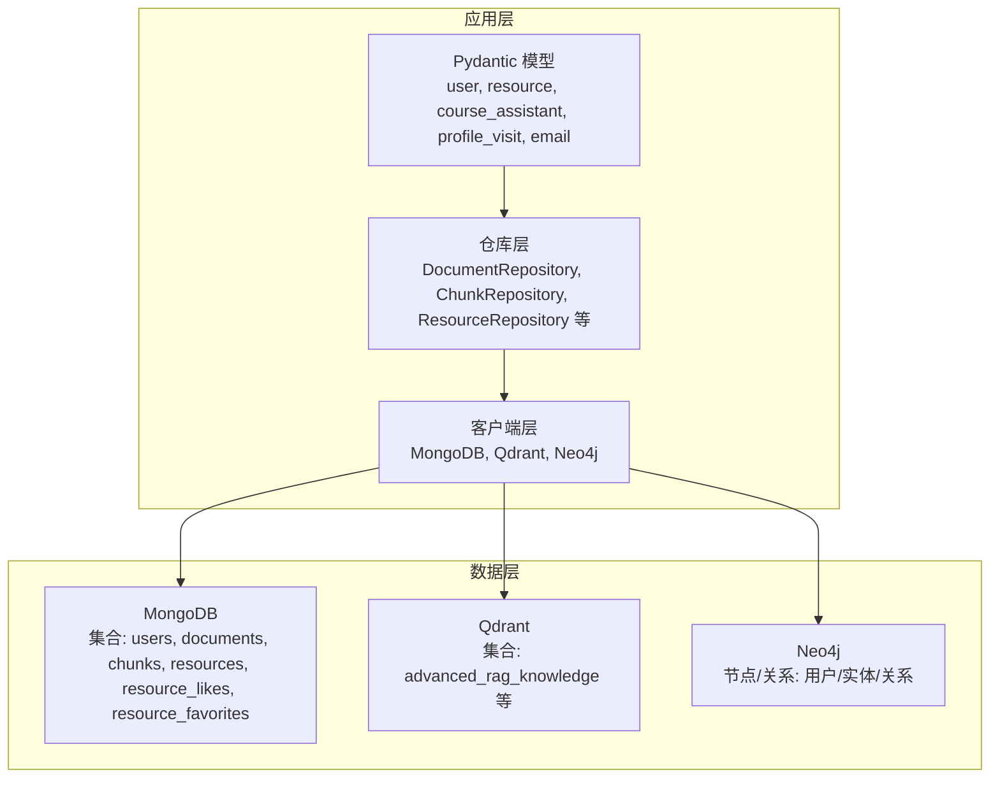
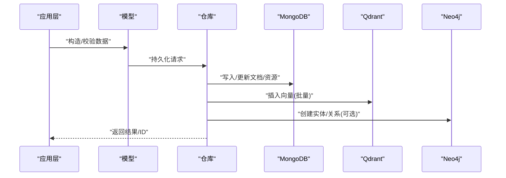
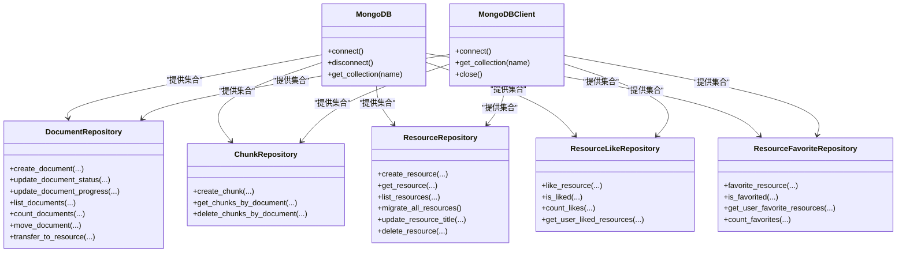
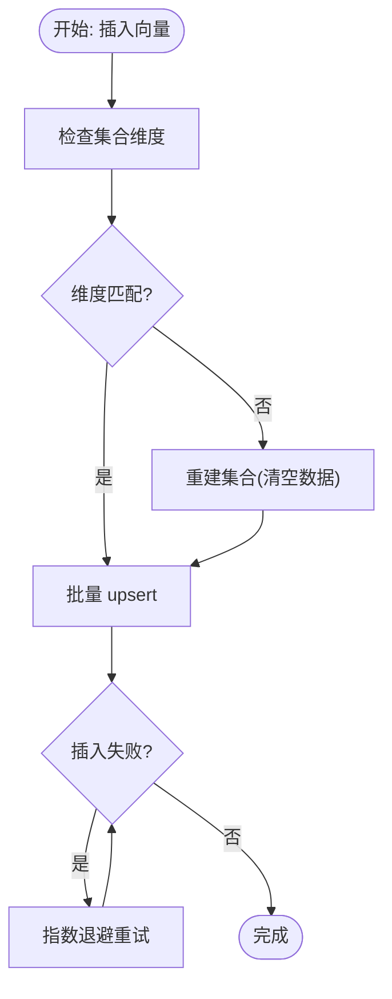
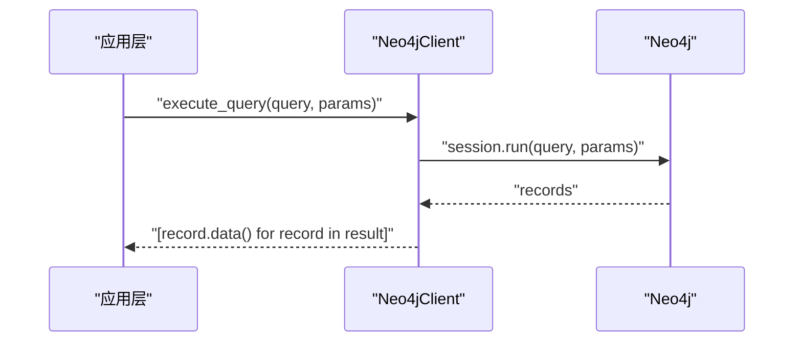
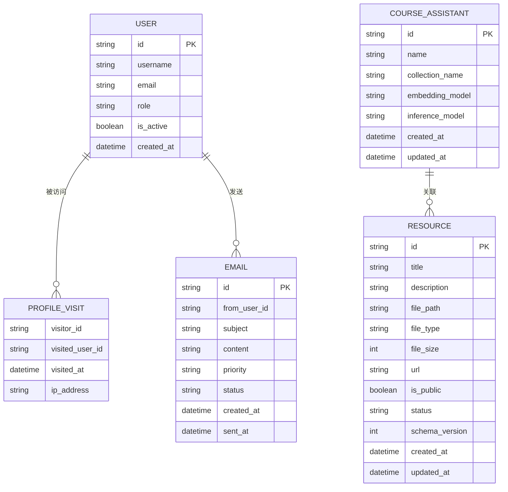
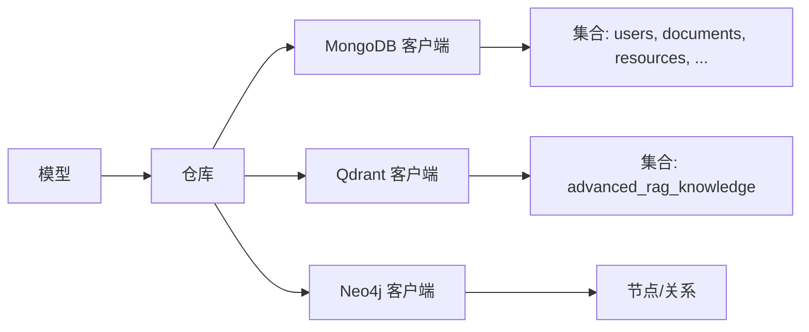

# 数据管理

<cite>
**本文引用的文件**
- [database/mongodb.py](file://database/mongodb.py)
- [database/qdrant_client.py](file://database/qdrant_client.py)
- [database/neo4j_client.py](file://database/neo4j_client.py)
- [models/user.py](file://models/user.py)
- [models/resource.py](file://models/resource.py)
- [models/course_assistant.py](file://models/course_assistant.py)
- [models/profile_visit.py](file://models/profile_visit.py)
- [models/email.py](file://models/email.py)
- [scripts/README_MIGRATIONS.md](file://scripts/README_MIGRATIONS.md)
- [utils/migrate_resources.py](file://utils/migrate_resources.py)
</cite>

## 目录
1. [简介](#简介)
2. [项目结构](#项目结构)
3. [核心组件](#核心组件)
4. [架构总览](#架构总览)
5. [详细组件分析](#详细组件分析)
6. [依赖分析](#依赖分析)
7. [性能考虑](#性能考虑)
8. [故障排查指南](#故障排查指南)
9. [结论](#结论)
10. [附录](#附录)

## 简介
本文件面向 advanced-rag 的数据管理系统，系统采用多数据库架构：MongoDB 用于用户数据与文档/资源元数据、对话历史与业务数据；Qdrant 用于向量检索；Neo4j 用于知识图谱。本文将从数据模型、实体关系、生命周期管理、索引与性能优化、迁移与版本管理、缓存与一致性、备份恢复与监控、访问模式与批量处理、安全与隐私等方面进行全面阐述。

## 项目结构
围绕数据管理的关键目录与文件如下：
- 数据库客户端与仓库
  - database/mongodb.py：MongoDB 异步/同步客户端、文档/分块/资源仓库、连接池与URI解析
  - database/qdrant_client.py：Qdrant 向量数据库客户端、集合创建/插入/搜索/删除
  - database/neo4j_client.py：Neo4j 图数据库客户端、Cypher 查询与实体/关系创建
- 数据模型
  - models/user.py：用户模型（公开/数据库存储、细粒度权限、资料扩展）
  - models/resource.py：资源模型（文件/链接、标签、公开状态、版本）
  - models/course_assistant.py：课程助手模型（集合名、推理/嵌入模型、快捷提示词）
  - models/profile_visit.py：公开资料访问记录模型
  - models/email.py：邮件模型（收件人类型、优先级、草稿/列表响应）
- 迁移与资源管理
  - scripts/README_MIGRATIONS.md：迁移脚本说明与历史记录
  - utils/migrate_resources.py：资源文件迁移与路径规范化

**图表来源**
- [database/mongodb.py:92-200](file://database/mongodb.py#L92-L200)
- [database/qdrant_client.py:18-120](file://database/qdrant_client.py#L18-L120)
- [database/neo4j_client.py:6-40](file://database/neo4j_client.py#L6-L40)
- [models/user.py:8-90](file://models/user.py#L8-L90)
- [models/resource.py:8-27](file://models/resource.py#L8-L27)
- [models/course_assistant.py:8-23](file://models/course_assistant.py#L8-L23)

**章节来源**
- [database/mongodb.py:92-200](file://database/mongodb.py#L92-L200)
- [database/qdrant_client.py:18-120](file://database/qdrant_client.py#L18-L120)
- [database/neo4j_client.py:6-40](file://database/neo4j_client.py#L6-L40)
- [models/user.py:8-90](file://models/user.py#L8-L90)
- [models/resource.py:8-27](file://models/resource.py#L8-L27)
- [models/course_assistant.py:8-23](file://models/course_assistant.py#L8-L23)

## 核心组件
- MongoDB 客户端与仓库
  - 异步客户端：用于高并发 API 场景，连接池参数可配置，支持 ping 校验
  - 同步客户端：用于文档处理流程，提供集合获取与连接测试
  - 仓库层：DocumentRepository、ChunkRepository、ResourceRepository、ResourceLikeRepository、ResourceFavoriteRepository
- Qdrant 客户端
  - gRPC 优先连接，自动健康检查与重试；集合维度不匹配时自动重建
  - 向量插入/搜索/删除/滚动查询
- Neo4j 客户端
  - Bolt 连接，Cypher 查询封装，MERGE 实体与关系
- 数据模型
  - 用户：角色、权限、资料扩展、在线状态
  - 资源：文件/链接、标签、公开状态、版本
  - 助手：集合名、模型、快捷提示词
  - 访问记录与邮件：访问审计与通知

**章节来源**
- [database/mongodb.py:92-200](file://database/mongodb.py#L92-L200)
- [database/mongodb.py:315-525](file://database/mongodb.py#L315-L525)
- [database/mongodb.py:770-807](file://database/mongodb.py#L770-L807)
- [database/mongodb.py:809-989](file://database/mongodb.py#L809-L989)
- [database/mongodb.py:1178-1284](file://database/mongodb.py#L1178-L1284)
- [database/qdrant_client.py:18-120](file://database/qdrant_client.py#L18-L120)
- [database/qdrant_client.py:210-335](file://database/qdrant_client.py#L210-L335)
- [database/qdrant_client.py:336-414](file://database/qdrant_client.py#L336-L414)
- [database/neo4j_client.py:6-40](file://database/neo4j_client.py#L6-L40)
- [models/user.py:8-90](file://models/user.py#L8-L90)
- [models/resource.py:8-27](file://models/resource.py#L8-L27)
- [models/course_assistant.py:8-23](file://models/course_assistant.py#L8-L23)

## 架构总览
系统采用“模型驱动 + 仓库 + 客户端”的分层设计，数据流如下：
- 写入路径：应用层模型 → 仓库层 → 数据库客户端 → 存储
- 读取路径：数据库客户端 → 仓库层 → 应用层模型
- 向量检索：文档分块 → 向量化 → Qdrant 插入 → 查询时相似度检索
- 知识图谱：抽取实体/关系 → Neo4j MERGE 创建 → Cypher 查询

**图表来源**
- [database/mongodb.py:315-525](file://database/mongodb.py#L315-L525)
- [database/mongodb.py:770-807](file://database/mongodb.py#L770-L807)
- [database/mongodb.py:809-989](file://database/mongodb.py#L809-L989)
- [database/qdrant_client.py:210-335](file://database/qdrant_client.py#L210-L335)
- [database/neo4j_client.py:64-101](file://database/neo4j_client.py#L64-L101)

## 详细组件分析

### MongoDB 设计与仓库
- 连接与配置
  - 支持从单一 URI 或分离的主机/端口/认证变量构建连接
  - 连接池参数可调：最大/最小池大小、空闲超时、服务器选择/连接/Socket 超时
  - 异步/同步双客户端，异步客户端用于 API，同步客户端用于批处理
- 仓库职责
  - DocumentRepository：文档元数据、状态/进度更新、分页/计数、移动/转换为资源
  - ChunkRepository：分块持久化与查询
  - ResourceRepository：资源 CRUD、版本迁移、公开状态与标签管理
  - ResourceLikeRepository/ResourceFavoriteRepository：点赞/收藏管理
- 数据模型映射
  - 用户：roles、权限位、在线状态、资料扩展
  - 资源：文件/链接、标签、公开状态、版本字段
  - 助手：集合名、模型、快捷提示词
  - 访问记录：访客ID、被访用户ID、访问时间、IP
  - 邮件：收件人类型/列表、优先级、草稿/发送状态

**图表来源**
- [database/mongodb.py:92-200](file://database/mongodb.py#L92-L200)
- [database/mongodb.py:315-525](file://database/mongodb.py#L315-L525)
- [database/mongodb.py:770-807](file://database/mongodb.py#L770-L807)
- [database/mongodb.py:809-989](file://database/mongodb.py#L809-L989)
- [database/mongodb.py:1178-1284](file://database/mongodb.py#L1178-L1284)

**章节来源**
- [database/mongodb.py:92-200](file://database/mongodb.py#L92-L200)
- [database/mongodb.py:315-525](file://database/mongodb.py#L315-L525)
- [database/mongodb.py:770-807](file://database/mongodb.py#L770-L807)
- [database/mongodb.py:809-989](file://database/mongodb.py#L809-L989)
- [database/mongodb.py:1178-1284](file://database/mongodb.py#L1178-L1284)
- [models/user.py:8-90](file://models/user.py#L8-L90)
- [models/resource.py:8-27](file://models/resource.py#L8-L27)
- [models/course_assistant.py:8-23](file://models/course_assistant.py#L8-L23)
- [models/profile_visit.py:7-32](file://models/profile_visit.py#L7-L32)
- [models/email.py:15-68](file://models/email.py#L15-L68)

### Qdrant 向量检索
- 连接与健康检查
  - 优先 gRPC，自动规避 httpx 502；支持本地/远程 URL 与 API Key 策略
  - 健康检查与重试，失败时优雅降级
- 集合管理
  - 自动创建/重建：当维度不匹配时自动重建集合
  - 支持按 document_id 过滤删除/滚动查询
- 插入与搜索
  - 批量插入带重试；维度错误自动重建
  - 搜索支持阈值过滤与 payload 返回

**图表来源**
- [database/qdrant_client.py:140-209](file://database/qdrant_client.py#L140-L209)
- [database/qdrant_client.py:210-335](file://database/qdrant_client.py#L210-L335)
- [database/qdrant_client.py:415-444](file://database/qdrant_client.py#L415-L444)

**章节来源**
- [database/qdrant_client.py:18-120](file://database/qdrant_client.py#L18-L120)
- [database/qdrant_client.py:140-209](file://database/qdrant_client.py#L140-L209)
- [database/qdrant_client.py:210-335](file://database/qdrant_client.py#L210-L335)
- [database/qdrant_client.py:336-414](file://database/qdrant_client.py#L336-L414)
- [database/qdrant_client.py:415-444](file://database/qdrant_client.py#L415-L444)
- [database/qdrant_client.py:445-526](file://database/qdrant_client.py#L445-L526)

### Neo4j 知识图谱
- 连接与容器适配
  - Bolt 连接，容器内自动替换 localhost 为 host.docker.internal
  - 连接校验失败时记录错误并保持客户端不可用
- 查询与建模
  - Cypher 查询封装，支持 MERGE 实体与关系
  - 适合基于用户/资源/概念的实体与关系抽取

**图表来源**
- [database/neo4j_client.py:40-63](file://database/neo4j_client.py#L40-L63)
- [database/neo4j_client.py:64-101](file://database/neo4j_client.py#L64-L101)

**章节来源**
- [database/neo4j_client.py:6-40](file://database/neo4j_client.py#L6-L40)
- [database/neo4j_client.py:40-63](file://database/neo4j_client.py#L40-L63)
- [database/neo4j_client.py:64-101](file://database/neo4j_client.py#L64-L101)

### 数据模型与实体关系
- 用户模型
  - 角色与细粒度权限：助手/文档/资源/标签管理、基础提示词编辑、邮件发送
  - 资料扩展：教育背景、工作经历、技能、兴趣、公开性设置
- 资源模型
  - 文件/链接、标签、公开状态、版本字段 schema_version
- 助手模型
  - 集合名、推理/嵌入模型、快捷提示词
- 访问记录与邮件
  - 访问审计字段与邮件收件人/优先级/状态

**图表来源**
- [models/user.py:8-90](file://models/user.py#L8-L90)
- [models/resource.py:8-27](file://models/resource.py#L8-L27)
- [models/course_assistant.py:8-23](file://models/course_assistant.py#L8-L23)
- [models/profile_visit.py:7-32](file://models/profile_visit.py#L7-L32)
- [models/email.py:48-68](file://models/email.py#L48-L68)

**章节来源**
- [models/user.py:8-90](file://models/user.py#L8-L90)
- [models/resource.py:8-27](file://models/resource.py#L8-L27)
- [models/course_assistant.py:8-23](file://models/course_assistant.py#L8-L23)
- [models/profile_visit.py:7-32](file://models/profile_visit.py#L7-L32)
- [models/email.py:15-68](file://models/email.py#L15-L68)

## 依赖分析
- 组件耦合
  - 仓库层依赖数据库客户端；模型层为纯数据结构，低耦合
  - Qdrant 与 MongoDB 通过 document_id 关联，形成“文本-向量”闭环
  - Neo4j 与用户/资源解耦，按需抽取实体/关系
- 外部依赖
  - MongoDB：motor/pymongo；连接池参数影响并发与稳定性
  - Qdrant：qdrant-client；gRPC 优先，避免 httpx 问题
  - Neo4j：neo4j 驱动；Bolt 连接

**图表来源**
- [database/mongodb.py:92-200](file://database/mongodb.py#L92-L200)
- [database/qdrant_client.py:18-120](file://database/qdrant_client.py#L18-L120)
- [database/neo4j_client.py:6-40](file://database/neo4j_client.py#L6-L40)

**章节来源**
- [database/mongodb.py:92-200](file://database/mongodb.py#L92-L200)
- [database/qdrant_client.py:18-120](file://database/qdrant_client.py#L18-L120)
- [database/neo4j_client.py:6-40](file://database/neo4j_client.py#L6-L40)

## 性能考虑
- 连接池与超时
  - MongoDB：maxPoolSize/minPoolSize/maxIdleTimeMS/serverSelectionTimeoutMS/connectTimeoutMS/socketTimeoutMS
  - Qdrant：prefer_grpc、timeout；gRPC 复用连接，减少 httpx 问题
- 索引策略
  - MongoDB：迁移脚本创建用户/助手/文档/资源等集合索引，提升查询性能
  - Neo4j：迁移脚本创建用户节点索引，提升图查询性能
- 批量处理
  - Qdrant：批量 upsert + 指数退避重试
  - MongoDB：分页/计数接口支持 skip/limit；资源迁移脚本批量处理文件与路径更新
- 查询优化
  - Qdrant：按 document_id 过滤；score_threshold 控制召回质量
  - MongoDB：按知识空间/助手/公开状态等字段过滤；分页与排序

**章节来源**
- [database/mongodb.py:122-151](file://database/mongodb.py#L122-L151)
- [database/qdrant_client.py:66-96](file://database/qdrant_client.py#L66-L96)
- [database/qdrant_client.py:210-335](file://database/qdrant_client.py#L210-L335)
- [database/mongodb.py:479-525](file://database/mongodb.py#L479-L525)
- [database/mongodb.py:990-1029](file://database/mongodb.py#L990-L1029)
- [scripts/README_MIGRATIONS.md:50-61](file://scripts/README_MIGRATIONS.md#L50-L61)

## 故障排查指南
- MongoDB
  - 连接失败：检查 MONGODB_URI/MONGODB_HOST/MONGODB_PORT/MONGODB_AUTH_SOURCE；容器内使用 host.docker.internal
  - 集合不存在：确认迁移脚本已执行；检查集合名称与索引
- Qdrant
  - 502/503/504/超时：gRPC 优先；自动重试；维度不匹配时自动重建
  - 健康检查失败：确认服务可达；本地 HTTP 忽略 API Key 警告
- Neo4j
  - 连接失败：确认服务运行、URI/用户名/密码；容器内自动替换 localhost
- 迁移与版本
  - 迁移历史：migration_history 集合记录状态与错误
  - 资源迁移：资源文件迁移与路径规范化，支持从旧目录与数据库路径修复

**章节来源**
- [database/mongodb.py:176-184](file://database/mongodb.py#L176-L184)
- [database/qdrant_client.py:97-123](file://database/qdrant_client.py#L97-L123)
- [database/neo4j_client.py:16-33](file://database/neo4j_client.py#L16-L33)
- [scripts/README_MIGRATIONS.md:74-81](file://scripts/README_MIGRATIONS.md#L74-L81)
- [utils/migrate_resources.py:132-262](file://utils/migrate_resources.py#L132-L262)

## 结论
本数据管理方案以多数据库协同为核心：MongoDB 承载结构化业务数据与元数据，Qdrant 提供高效向量检索，Neo4j 支撑知识图谱。通过模型驱动、仓库抽象与客户端封装，系统具备良好的可维护性与扩展性。配合完善的迁移与版本管理、索引与性能优化策略，以及故障排查与资源迁移脚本，能够支撑高级 RAG 场景下的数据全生命周期管理。

## 附录
- 环境变量与配置要点
  - MongoDB：MONGODB_URI 或 MONGODB_HOST/MONGODB_PORT/MONGODB_USERNAME/MONGODB_PASSWORD/MONGODB_AUTH_SOURCE/MONGODB_DB_NAME；连接池参数
  - Qdrant：QDRANT_URL/QDRANT_API_KEY/QDRANT_TIMEOUT/QDRANT_GRPC_PORT
  - Neo4j：NEO4J_URI/NEO4J_USER/NEO4J_PASSWORD
  - 资源迁移：RESOURCE_DIR、旧资源目录列表
- 迁移与版本
  - 迁移脚本支持状态查看、选择性运行、强制重跑、Docker 环境执行
  - 资源模型版本迁移：schema_version 字段与默认值补齐

**章节来源**
- [database/mongodb.py:101-151](file://database/mongodb.py#L101-L151)
- [database/qdrant_client.py:35-76](file://database/qdrant_client.py#L35-L76)
- [database/neo4j_client.py:11-13](file://database/neo4j_client.py#L11-L13)
- [utils/migrate_resources.py:15-26](file://utils/migrate_resources.py#L15-L26)
- [scripts/README_MIGRATIONS.md:11-36](file://scripts/README_MIGRATIONS.md#L11-L36)