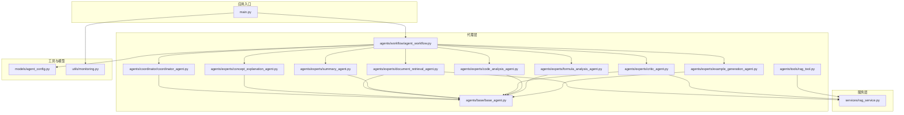
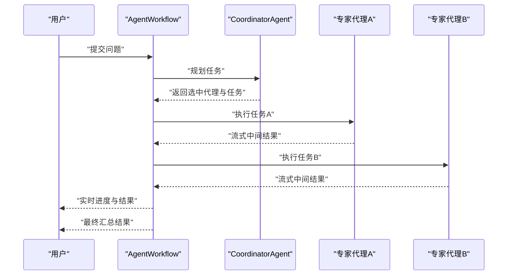
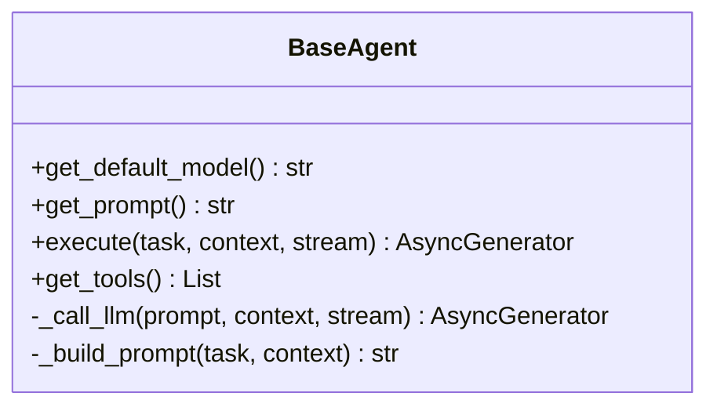
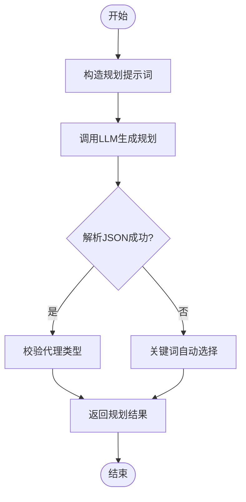
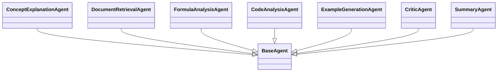
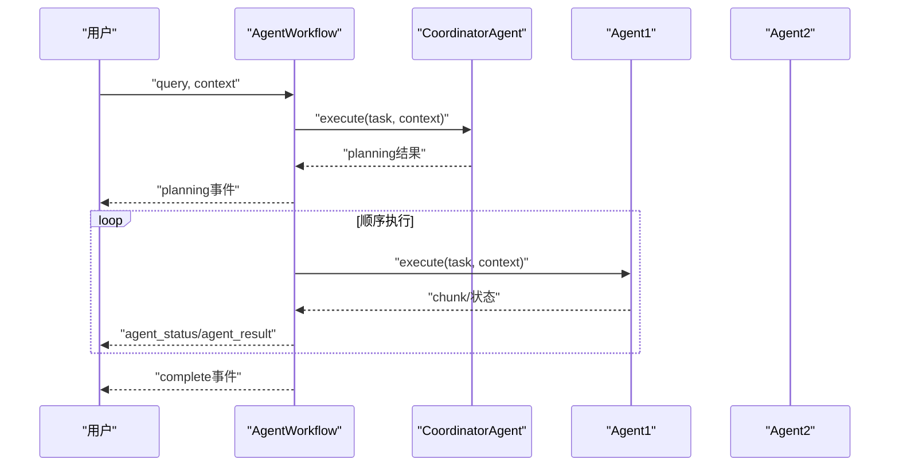
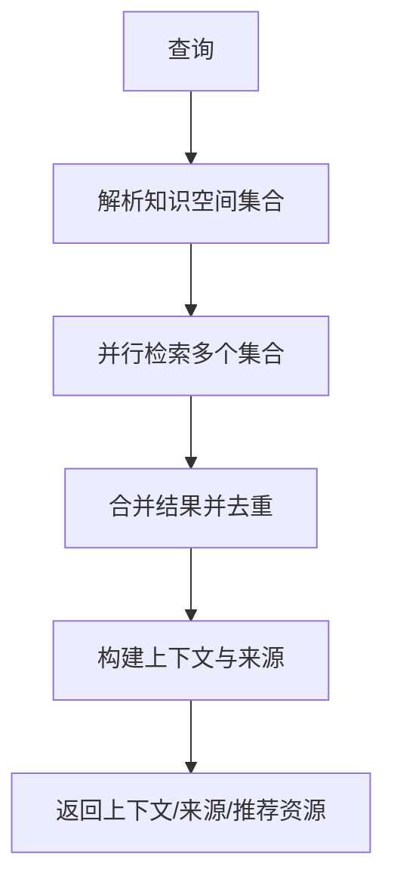
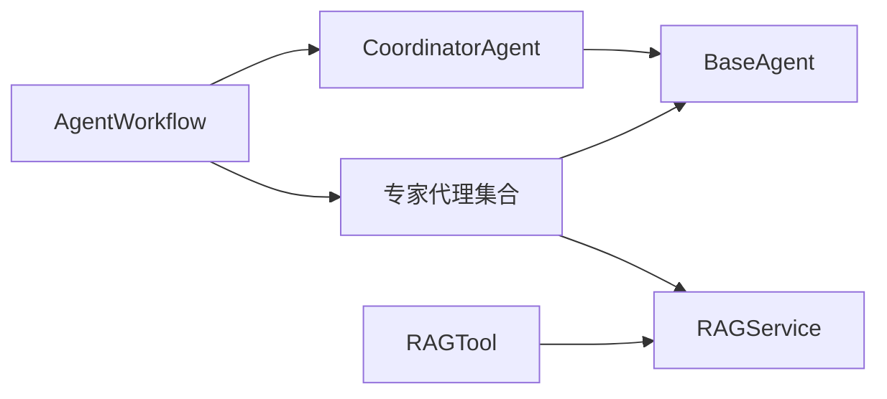

# AI代理系统

<cite>
**本文引用的文件**
- [main.py](file://main.py)
- [base_agent.py](file://agents/base/base_agent.py)
- [coordinator_agent.py](file://agents/coordinator/coordinator_agent.py)
- [agent_workflow.py](file://agents/workflow/agent_workflow.py)
- [concept_explanation_agent.py](file://agents/experts/concept_explanation_agent.py)
- [document_retrieval_agent.py](file://agents/experts/document_retrieval_agent.py)
- [summary_agent.py](file://agents/experts/summary_agent.py)
- [critic_agent.py](file://agents/experts/critic_agent.py)
- [code_analysis_agent.py](file://agents/experts/code_analysis_agent.py)
- [formula_analysis_agent.py](file://agents/experts/formula_analysis_agent.py)
- [example_generation_agent.py](file://agents/experts/example_generation_agent.py)
- [rag_tool.py](file://agents/tools/rag_tool.py)
- [rag_service.py](file://services/rag_service.py)
- [agent_config.py](file://models/agent_config.py)
- [monitoring.py](file://utils/monitoring.py)
</cite>

## 目录
1. [简介](#简介)
2. [项目结构](#项目结构)
3. [核心组件](#核心组件)
4. [架构总览](#架构总览)
5. [详细组件分析](#详细组件分析)
6. [依赖分析](#依赖分析)
7. [性能考虑](#性能考虑)
8. [故障排除指南](#故障排除指南)
9. [结论](#结论)
10. [附录](#附录)

## 简介
本项目是一个基于多代理协作的AI研究与问答系统，采用“协调型代理 + 专家代理”的分层架构。用户输入的问题首先由协调型代理进行任务规划，智能选择所需的专家代理，随后由工作流编排器顺序调度各专家代理执行任务，最终汇总结果并以流式方式返回。系统支持多种专家代理，涵盖概念解释、文档检索、公式分析、代码分析、示例生成、批判性分析、总结等能力，并提供完善的流式响应、错误处理与性能监控。

## 项目结构
系统采用模块化组织，核心目录与职责如下：
- agents：代理体系
  - base：代理基类，统一接口与工具
  - coordinator：协调型代理，负责任务规划
  - experts：专家代理集合，按功能分类
  - workflow：工作流编排器，管理多代理协作
  - tools：LangChain工具适配
- services：服务层
  - rag_service：RAG检索与上下文生成
- models：配置与数据模型
- utils：工具与监控
- routers：API路由
- web：前端应用（Next.js）

**图表来源**
- [main.py:1-157](file://main.py#L1-L157)
- [agent_workflow.py:1-388](file://agents/workflow/agent_workflow.py#L1-L388)
- [coordinator_agent.py:1-252](file://agents/coordinator/coordinator_agent.py#L1-L252)
- [base_agent.py:1-122](file://agents/base/base_agent.py#L1-L122)
- [document_retrieval_agent.py:1-79](file://agents/experts/document_retrieval_agent.py#L1-L79)
- [critic_agent.py:1-90](file://agents/experts/critic_agent.py#L1-L90)
- [rag_service.py:1-248](file://services/rag_service.py#L1-L248)
- [rag_tool.py:1-58](file://agents/tools/rag_tool.py#L1-L58)
- [agent_config.py:1-24](file://models/agent_config.py#L1-L24)
- [monitoring.py:1-185](file://utils/monitoring.py#L1-L185)

**章节来源**
- [main.py:1-157](file://main.py#L1-L157)
- [agent_workflow.py:1-388](file://agents/workflow/agent_workflow.py#L1-L388)

## 核心组件
- 代理基类（BaseAgent）
  - 定义统一接口：默认模型获取、系统提示词、任务执行（支持流式）、工具与提示词构建
  - 内置LLM调用封装与提示词拼装
- 协调型代理（CoordinatorAgent）
  - 负责解析用户问题，选择必要专家代理并分配任务，返回规划结果
  - 支持JSON规划与关键词后备选择策略
- 专家代理集合
  - 概念解释、文档检索、公式分析、代码分析、示例生成、批判性分析、总结等
  - 每个专家代理继承基类，实现自身提示词与执行逻辑
- 工作流编排器（AgentWorkflow）
  - 异步初始化协调型与专家代理，按需加载模型配置
  - 顺序执行专家代理，实时发送状态与结果，聚合最终输出
- RAG服务（RAGService）
  - 并行检索文档与资源，构建上下文与来源信息，支持回退策略
- LangChain工具（RAGTool）
  - 提供同步与异步检索工具，适配LangChain链路
- 配置模型（AgentConfig）
  - 定义单个代理的推理与嵌入模型配置
- 性能监控（PerformanceMonitor）
  - 记录请求耗时、错误率与系统指标，提供装饰器与上下文管理器

**章节来源**
- [base_agent.py:1-122](file://agents/base/base_agent.py#L1-L122)
- [coordinator_agent.py:1-252](file://agents/coordinator/coordinator_agent.py#L1-L252)
- [agent_workflow.py:1-388](file://agents/workflow/agent_workflow.py#L1-L388)
- [rag_service.py:1-248](file://services/rag_service.py#L1-L248)
- [rag_tool.py:1-58](file://agents/tools/rag_tool.py#L1-L58)
- [agent_config.py:1-24](file://models/agent_config.py#L1-L24)
- [monitoring.py:1-185](file://utils/monitoring.py#L1-L185)

## 架构总览
系统采用“协调-执行-汇总”的三层协作模式：
- 协调层：CoordinatorAgent接收用户问题，生成专家选择与任务分配
- 执行层：AgentWorkflow顺序调度专家代理，实时推送状态与中间结果
- 汇总层：专家代理输出整合为最终回答，支持流式增量展示

**图表来源**
- [agent_workflow.py:106-337](file://agents/workflow/agent_workflow.py#L106-L337)
- [coordinator_agent.py:55-168](file://agents/coordinator/coordinator_agent.py#L55-L168)

## 详细组件分析

### 代理基类（BaseAgent）
- 设计要点
  - 抽象接口：默认模型、系统提示词、任务执行（支持流式）
  - 工具与提示词：提供工具列表与提示词构建方法
  - LLM封装：统一的异步生成接口，支持流式输出
- 数据结构与复杂度
  - 提示词构建为O(n)字符串拼接，其中n为上下文键值对数量
  - LLM调用为异步I/O，复杂度取决于模型与上下文长度
- 错误处理
  - 统一的日志记录与异常捕获，便于上层编排器处理
- 性能影响
  - 流式输出减少首字节延迟，提升交互体验

**图表来源**
- [base_agent.py:8-122](file://agents/base/base_agent.py#L8-L122)

**章节来源**
- [base_agent.py:1-122](file://agents/base/base_agent.py#L1-L122)

### 协调型代理（CoordinatorAgent）
- 功能特性
  - 任务规划：解析问题，选择必要专家代理，分配具体任务
  - 输出格式：JSON规划结果，包含选中代理、任务描述与选择理由
  - 备份策略：JSON解析失败时按关键词自动选择
- 处理流程
  - 构造规划提示词 → LLM生成 → 正则提取JSON → 校验与回退 → 返回规划结果
- 错误处理
  - JSON解析失败时回退到关键词匹配；异常统一记录并返回错误消息

**图表来源**
- [coordinator_agent.py:72-168](file://agents/coordinator/coordinator_agent.py#L72-L168)

**章节来源**
- [coordinator_agent.py:1-252](file://agents/coordinator/coordinator_agent.py#L1-L252)

### 专家代理集合
- 概念解释专家（ConceptExplanationAgent）
  - 任务：深入解释专业概念，提供定义、物理意义、公式、应用与关系
  - 特点：高置信度，适合基础理解
- 文档检索专家（DocumentRetrievalAgent）
  - 任务：检索相关文档，总结关键信息并标注来源
  - 特点：结合RAG服务，支持多集合并行检索
- 公式分析专家（FormulaAnalysisAgent）
  - 任务：识别并解释数学/物理公式，变量含义与适用条件
  - 特点：正则提取LaTeX公式，支持多格式
- 代码分析专家（CodeAnalysisAgent）
  - 任务：分析代码功能、逻辑与实现建议
  - 特点：若未检测到代码，返回低置信度提示
- 示例生成专家（ExampleGenerationAgent）
  - 任务：生成从简单到复杂的应用示例与完整解题过程
  - 特点：强调实践应用与可操作性
- 批判性分析专家（CriticAgent）
  - 任务：验证信息准确性，检查幻觉，提供反面观点与修正建议
  - 特点：先检索验证素材，再进行分析
- 总结专家（SummaryAgent）
  - 任务：总结与归纳来自其他代理的信息
  - 特点：格式化其他结果，提炼核心要点

**图表来源**
- [concept_explanation_agent.py:1-70](file://agents/experts/concept_explanation_agent.py#L1-L70)
- [document_retrieval_agent.py:1-79](file://agents/experts/document_retrieval_agent.py#L1-L79)
- [formula_analysis_agent.py:1-107](file://agents/experts/formula_analysis_agent.py#L1-L107)
- [code_analysis_agent.py:1-79](file://agents/experts/code_analysis_agent.py#L1-L79)
- [example_generation_agent.py:1-68](file://agents/experts/example_generation_agent.py#L1-L68)
- [critic_agent.py:1-90](file://agents/experts/critic_agent.py#L1-L90)
- [summary_agent.py:1-87](file://agents/experts/summary_agent.py#L1-L87)
- [base_agent.py:1-122](file://agents/base/base_agent.py#L1-L122)

**章节来源**
- [concept_explanation_agent.py:1-70](file://agents/experts/concept_explanation_agent.py#L1-L70)
- [document_retrieval_agent.py:1-79](file://agents/experts/document_retrieval_agent.py#L1-L79)
- [formula_analysis_agent.py:1-107](file://agents/experts/formula_analysis_agent.py#L1-L107)
- [code_analysis_agent.py:1-79](file://agents/experts/code_analysis_agent.py#L1-L79)
- [example_generation_agent.py:1-68](file://agents/experts/example_generation_agent.py#L1-L68)
- [critic_agent.py:1-90](file://agents/experts/critic_agent.py#L1-L90)
- [summary_agent.py:1-87](file://agents/experts/summary_agent.py#L1-L87)

### 工作流编排器（AgentWorkflow）
- 编排逻辑
  - 异步初始化协调型与专家代理，按需从数据库加载配置
  - 协调型代理规划后，顺序执行选中的专家代理
  - 实时推送状态（pending/running/completed/error/skipped）
  - 聚合结果并返回最终汇总
- 流式响应
  - 在执行过程中持续产出中间状态与增量内容
  - 进度估算与当前步骤提示，增强用户体验
- 错误处理
  - 单个代理失败不影响整体流程，记录错误并继续执行
  - 全局异常捕获并返回错误消息

**图表来源**
- [agent_workflow.py:106-337](file://agents/workflow/agent_workflow.py#L106-L337)

**章节来源**
- [agent_workflow.py:1-388](file://agents/workflow/agent_workflow.py#L1-L388)

### RAG服务与工具
- RAG服务（RAGService）
  - 并行检索：支持多知识空间集合，合并结果并去重
  - 上下文构建：聚合文档片段，标注来源（文档/附件）
  - 回退策略：检索失败时可选择回退到无上下文模式
- LangChain工具（RAGTool）
  - 同步与异步两种执行方式，适配不同运行环境
  - 参数校验与错误处理，避免在无事件循环环境中阻塞

**图表来源**
- [rag_service.py:10-191](file://services/rag_service.py#L10-L191)
- [rag_tool.py:17-55](file://agents/tools/rag_tool.py#L17-L55)

**章节来源**
- [rag_service.py:1-248](file://services/rag_service.py#L1-L248)
- [rag_tool.py:1-58](file://agents/tools/rag_tool.py#L1-L58)

### 配置模型与API
- 配置模型（AgentConfig）
  - 字段：agent_type、inference_model、embedding_model
  - 支持更新与列表响应
- API端点（示例）
  - 路由注册：chat、documents、retrieval、assistants、knowledge-spaces、health
  - 全局异常处理：统一返回500与日志记录
  - 静态资源挂载：头像、视频封面、资源封面

**章节来源**
- [agent_config.py:1-24](file://models/agent_config.py#L1-L24)
- [main.py:90-126](file://main.py#L90-L126)

## 依赖分析
- 组件耦合
  - 工作流编排器依赖协调型代理与各专家代理，形成清晰的控制流
  - 专家代理依赖基类与RAG服务，体现高内聚低耦合
  - RAG服务与数据库、检索器存在间接耦合，通过服务封装隔离
- 外部依赖
  - LLM服务（OllamaService）通过基类统一调用
  - LangChain工具用于链路集成
- 循环依赖
  - 未发现直接循环导入；编排器通过字符串映射延迟实例化专家代理

**图表来源**
- [agent_workflow.py:47-104](file://agents/workflow/agent_workflow.py#L47-L104)
- [coordinator_agent.py:7-17](file://agents/coordinator/coordinator_agent.py#L7-L17)
- [base_agent.py:8-25](file://agents/base/base_agent.py#L8-L25)
- [rag_service.py:7-248](file://services/rag_service.py#L7-L248)
- [rag_tool.py:12-58](file://agents/tools/rag_tool.py#L12-L58)

**章节来源**
- [agent_workflow.py:1-388](file://agents/workflow/agent_workflow.py#L1-L388)
- [rag_service.py:1-248](file://services/rag_service.py#L1-L248)

## 性能考虑
- 流式输出
  - 专家代理与工作流均支持增量输出，降低首字节延迟
- 并行检索
  - RAG服务对多集合并行检索，显著缩短上下文准备时间
- 进度估算
  - 工作流对中间阶段进行进度估算，提升交互体验
- 监控与告警
  - 性能监控器记录请求耗时、错误率与系统指标，慢请求自动告警
  - 装饰器与上下文管理器简化埋点

**章节来源**
- [agent_workflow.py:218-296](file://agents/workflow/agent_workflow.py#L218-L296)
- [rag_service.py:64-83](file://services/rag_service.py#L64-L83)
- [monitoring.py:118-185](file://utils/monitoring.py#L118-L185)

## 故障排除指南
- 协调型代理规划失败
  - 现象：返回错误消息或使用默认选择
  - 排查：检查提示词格式、JSON解析正则、关键词匹配逻辑
- 专家代理执行异常
  - 现象：单个代理状态为error，工作流继续执行
  - 排查：查看代理日志、上下文参数、模型可用性
- RAG检索失败
  - 现象：上下文为空或回退到无上下文模式
  - 排查：确认知识空间集合名称、数据库连接、向量模型配置
- 工具执行异常
  - 现象：同步工具在异步环境中报错
  - 排查：优先使用异步执行方法，避免在无事件循环时阻塞

**章节来源**
- [coordinator_agent.py:130-135](file://agents/coordinator/coordinator_agent.py#L130-L135)
- [agent_workflow.py:306-322](file://agents/workflow/agent_workflow.py#L306-L322)
- [rag_service.py:225-236](file://services/rag_service.py#L225-L236)
- [rag_tool.py:27-41](file://agents/tools/rag_tool.py#L27-L41)

## 结论
本系统通过“协调-执行-汇总”的多代理架构，实现了对复杂问题的智能分解与协同求解。协调型代理负责任务规划，工作流编排器负责执行与聚合，专家代理聚焦各自专业领域，RAG服务提供高质量上下文。系统具备良好的扩展性与可观测性，适合在教育、科研与知识服务场景中部署与演进。

## 附录

### API接口说明（示例）
- 路由注册
  - /api/chat：聊天与深度研究
  - /api/documents：文档管理
  - /api/retrieval：检索服务
  - /api/assistants：助手管理
  - /api/knowledge-spaces：知识空间
  - /api/health：健康检查
- 全局异常处理
  - 统一500错误响应与日志记录

**章节来源**
- [main.py:90-126](file://main.py#L90-L126)

### 配置选项
- 代理配置模型
  - agent_type：代理类型
  - inference_model：推理模型名称
  - embedding_model：嵌入模型名称
- 工作流配置
  - generation_config：包含llm_model等生成参数
  - enabled_agents：手动指定启用的专家代理列表

**章节来源**
- [agent_config.py:6-23](file://models/agent_config.py#L6-L23)
- [agent_workflow.py:127-128](file://agents/workflow/agent_workflow.py#L127-L128)

### 代理扩展开发指南
- 新增专家代理步骤
  - 继承BaseAgent，实现get_default_model、get_prompt与execute
  - 在AgentWorkflow的AGENT_MAP中注册映射
  - 如需RAG检索，在execute中调用rag_service.retrieve_context
  - 支持流式输出：在execute中按chunk产出中间结果
- 最佳实践
  - 明确代理职责边界，避免过度耦合
  - 提供清晰的系统提示词与任务描述
  - 统一错误处理与日志记录

**章节来源**
- [base_agent.py:27-55](file://agents/base/base_agent.py#L27-L55)
- [agent_workflow.py:50-104](file://agents/workflow/agent_workflow.py#L50-L104)
- [rag_service.py:10-191](file://services/rag_service.py#L10-L191)