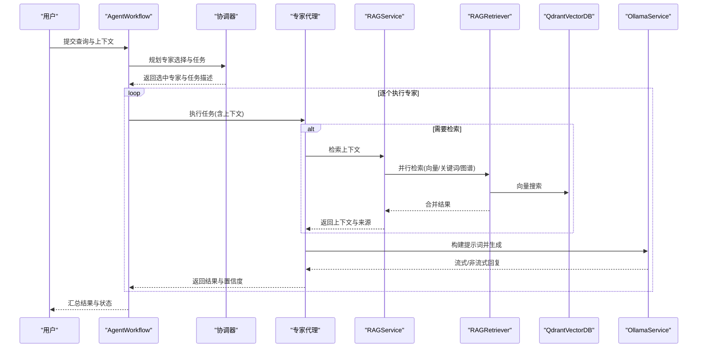
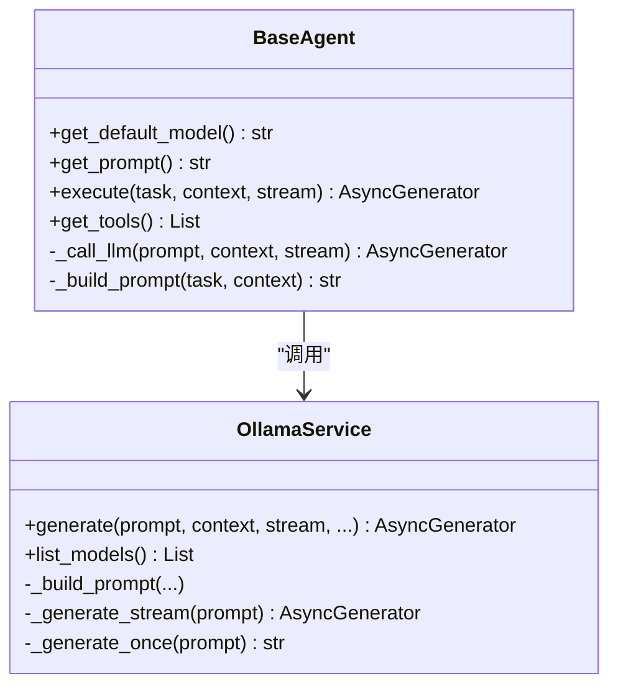
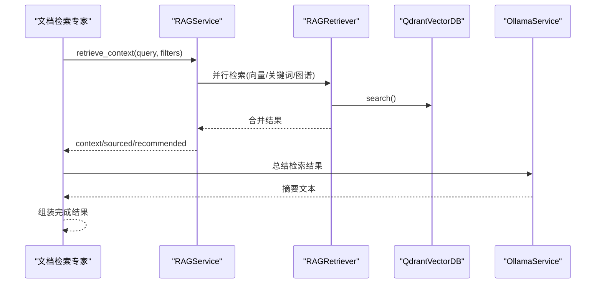
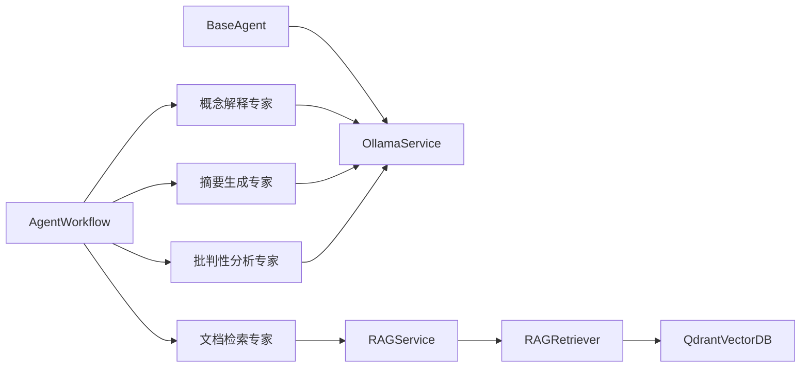

# 专家代理

<cite>
**本文引用的文件**
- [agents/base/base_agent.py](file://agents/base/base_agent.py)
- [agents/coordinator/coordinator_agent.py](file://agents/coordinator/coordinator_agent.py)
- [agents/experts/concept_explanation_agent.py](file://agents/experts/concept_explanation_agent.py)
- [agents/experts/document_retrieval_agent.py](file://agents/experts/document_retrieval_agent.py)
- [agents/experts/summary_agent.py](file://agents/experts/summary_agent.py)
- [agents/experts/critic_agent.py](file://agents/experts/critic_agent.py)
- [agents/experts/code_analysis_agent.py](file://agents/experts/code_analysis_agent.py)
- [agents/experts/formula_analysis_agent.py](file://agents/experts/formula_analysis_agent.py)
- [agents/experts/example_generation_agent.py](file://agents/experts/example_generation_agent.py)
- [agents/experts/exercise_agent.py](file://agents/experts/exercise_agent.py)
- [agents/experts/scientific_coding_agent.py](file://agents/experts/scientific_coding_agent.py)
- [agents/workflow/agent_workflow.py](file://agents/workflow/agent_workflow.py)
- [services/rag_service.py](file://services/rag_service.py)
- [services/ollama_service.py](file://services/ollama_service.py)
- [retrieval/rag_retriever.py](file://retrieval/rag_retriever.py)
- [database/qdrant_client.py](file://database/qdrant_client.py)
- [utils/code_analyzer.py](file://utils/code_analyzer.py)
- [utils/formula_analyzer.py](file://utils/formula_analyzer.py)
- [utils/formula_extractor.py](file://utils/formula_extractor.py)
- [models/agent_config.py](file://models/agent_config.py)
</cite>

## 更新摘要
**所做更改**
- 移除了专门的物理专家代理（公式分析、代码分析、示例生成、练习生成、科学编码）
- 更新了专家代理架构为统一的通用化设计
- 修订了专家代理选择与组合的最佳实践
- 更新了工作流编排器的专家代理映射

## 目录
1. [简介](#简介)
2. [项目结构](#项目结构)
3. [核心组件](#核心组件)
4. [架构总览](#架构总览)
5. [详细组件分析](#详细组件分析)
6. [依赖分析](#依赖分析)
7. [性能考量](#性能考量)
8. [故障排查指南](#故障排查指南)
9. [结论](#结论)
10. [附录](#附录)

## 简介
本文件面向"专家代理系统"的技术文档，围绕多专家协同工作流展开，系统性阐述各专家代理的职责边界、输入输出规范、提示词设计、实现细节与性能优化策略，并提供专家代理选择与组合使用的最佳实践。专家代理体系包括但不限于：概念解释专家、文档检索专家、摘要生成专家、批判性分析专家等。

**更新** 系统已从专门的物理专家代理架构转向统一的通用化设计，移除了公式分析、代码分析、示例生成、练习生成、科学编码等专门领域的专家代理，采用更通用的专家代理组合来处理各类问题。

## 项目结构
专家代理系统采用"基类抽象 + 专家子类 + 工作流编排 + 检索与生成服务"的分层架构：
- 基类层：统一抽象 Agent 的生命周期、提示词构建与 LLM 调用。
- 专家层：面向不同专业领域的专家代理，各自实现领域提示词与任务执行。
- 工作流层：编排协调与并行执行，管理 Agent 生命周期与状态上报。
- 检索与生成层：RAG 检索、向量检索、图谱检索、LLM 生成与流式输出。
- 工具层：LangChain 工具桥接 RAG 检索能力。

```mermaid
graph TB
subgraph "工作流编排"
WF["AgentWorkflow<br/>多专家编排"]
CO["CoordinatorAgent<br/>协调器"]
end
subgraph "专家代理"
CE["概念解释专家"]
DR["文档检索专家"]
SU["摘要生成专家"]
CR["批判性分析专家"]
END
subgraph "检索与生成"
RS["RAGService<br/>检索服务"]
RR["RAGRetriever<br/>混合检索"]
QD["QdrantVectorDB<br/>向量库"]
OL["OllamaService<br/>LLM服务"]
end
WF --> CO
WF --> CE
WF --> DR
WF --> SU
WF --> CR
DR --> RS
CR --> RS
RS --> RR
RR --> QD
CE --> OL
SU --> OL
CR --> OL
```

**图表来源**
- [agents/workflow/agent_workflow.py:47-388](file://agents/workflow/agent_workflow.py#L47-L388)
- [agents/coordinator/coordinator_agent.py:29-53](file://agents/coordinator/coordinator_agent.py#L29-L53)
- [agents/experts/concept_explanation_agent.py:7-70](file://agents/experts/concept_explanation_agent.py#L7-L70)
- [agents/experts/document_retrieval_agent.py:8-79](file://agents/experts/document_retrieval_agent.py#L8-L79)
- [agents/experts/summary_agent.py:7-87](file://agents/experts/summary_agent.py#L7-L87)
- [agents/experts/critic_agent.py:7-90](file://agents/experts/critic_agent.py#L7-L90)
- [services/rag_service.py:7-248](file://services/rag_service.py#L7-L248)
- [retrieval/rag_retriever.py:22-325](file://retrieval/rag_retriever.py#L22-L325)
- [database/qdrant_client.py:18-544](file://database/qdrant_client.py#L18-L544)
- [services/ollama_service.py:9-674](file://services/ollama_service.py#L9-L674)

**章节来源**
- [agents/workflow/agent_workflow.py:47-388](file://agents/workflow/agent_workflow.py#L47-L388)
- [services/rag_service.py:7-248](file://services/rag_service.py#L7-L248)
- [retrieval/rag_retriever.py:22-325](file://retrieval/rag_retriever.py#L22-L325)
- [database/qdrant_client.py:18-544](file://database/qdrant_client.py#L18-L544)
- [services/ollama_service.py:9-674](file://services/ollama_service.py#L9-L674)

## 核心组件
- 基类抽象：定义统一的模型初始化、系统提示词、提示词构建、LLM 调用与工具扩展能力。
- 专家代理：面向不同专业领域的专家，各自实现领域提示词与任务执行流程。
- 工作流编排：协调专家选择、并行执行、状态上报与结果聚合。
- 检索与生成：RAG 检索（向量/关键词/图谱）、LLM 生成（流式/非流式）。
- 工具桥接：LangChain 工具封装 RAG 检索，便于在提示词链中调用。

**章节来源**
- [agents/base/base_agent.py:8-122](file://agents/base/base_agent.py#L8-L122)
- [agents/workflow/agent_workflow.py:47-388](file://agents/workflow/agent_workflow.py#L47-L388)
- [services/rag_service.py:7-248](file://services/rag_service.py#L7-L248)
- [services/ollama_service.py:50-274](file://services/ollama_service.py#L50-L274)
- [agents/coordinator/coordinator_agent.py:19-53](file://agents/coordinator/coordinator_agent.py#L19-L53)

## 架构总览
专家代理系统通过"工作流编排器"驱动多个专家代理协同完成复杂任务。工作流首先由协调器规划专家选择与任务拆分，随后按序执行专家代理，期间通过统一的提示词构建与 LLM 生成服务完成内容产出。RAG 检索贯穿文档检索与批判性分析等专家代理，确保回答具备事实依据。



**图表来源**
- [agents/workflow/agent_workflow.py:106-336](file://agents/workflow/agent_workflow.py#L106-L336)
- [services/rag_service.py:10-242](file://services/rag_service.py#L10-L242)
- [retrieval/rag_retriever.py:69-101](file://retrieval/rag_retriever.py#L69-L101)
- [database/qdrant_client.py:336-414](file://database/qdrant_client.py#L336-L414)
- [services/ollama_service.py:50-93](file://services/ollama_service.py#L50-L93)

## 详细组件分析

### 基类与提示词构建
- 统一模型初始化与 LLM 调用：通过 OllamaService 封装流式/非流式生成，支持超时与异常处理。
- 提示词构建：支持系统提示词、上下文注入、对话历史、工具函数调用结果拼接。
- 工具扩展：可在系统提示词中注入工具函数描述，实现动态调用。



**图表来源**
- [agents/base/base_agent.py:8-122](file://agents/base/base_agent.py#L8-L122)
- [services/ollama_service.py:50-274](file://services/ollama_service.py#L50-L274)

**章节来源**
- [agents/base/base_agent.py:8-122](file://agents/base/base_agent.py#L8-L122)
- [services/ollama_service.py:50-274](file://services/ollama_service.py#L50-L274)

### 概念解释专家
- 职责：深入解释专业概念，提供定义、物理意义、公式定律、应用示例与概念关系。
- 输入：task（问题）、context（可选）。
- 输出：流式增量与最终完成结果，包含置信度。
- 提示词设计：强调清晰定义、本质解释、应用场景、示例与关联。
- 性能优化：使用较大模型以提升解释质量；流式输出提升交互体验。

**章节来源**
- [agents/experts/concept_explanation_agent.py:7-70](file://agents/experts/concept_explanation_agent.py#L7-L70)

### 文档检索专家
- 职责：从知识库检索与问题相关的文档片段，整理并总结，标注信息来源。
- 输入：task（问题）、context（assistant_id/document_id/knowledge_space_ids 等）。
- 输出：完成结果，包含摘要、来源、推荐资源、置信度与原始上下文。
- 实现细节：调用 RAGService 检索，限制上下文长度，再由 LLM 总结。
- 性能优化：并行检索多集合、去重与排序、限制上下文长度。



**图表来源**
- [agents/experts/document_retrieval_agent.py:25-79](file://agents/experts/document_retrieval_agent.py#L25-L79)
- [services/rag_service.py:10-191](file://services/rag_service.py#L10-L191)
- [retrieval/rag_retriever.py:69-101](file://retrieval/rag_retriever.py#L69-L101)
- [database/qdrant_client.py:336-414](file://database/qdrant_client.py#L336-L414)

**章节来源**
- [agents/experts/document_retrieval_agent.py:8-79](file://agents/experts/document_retrieval_agent.py#L8-L79)
- [services/rag_service.py:10-191](file://services/rag_service.py#L10-L191)

### 摘要生成专家
- 职责：总结与归纳信息，提炼核心要点、关键概念与学习建议。
- 输入：task（问题）、context（other_results：来自其他专家的结果）。
- 输出：流式增量与最终完成结果，包含置信度。
- 实现细节：格式化其他专家结果，限制长度，引导 LLM 进行归纳总结。

**章节来源**
- [agents/experts/summary_agent.py:7-87](file://agents/experts/summary_agent.py#L7-L87)

### 批判性分析专家
- 职责：验证信息准确性，检查幻觉，提供反面观点与修正建议。
- 输入：task（陈述/问题）、context（可选包含检索过滤参数）。
- 输出：完成结果，包含分析内容与来源。
- 实现细节：先检索验证素材，再基于证据进行批判性分析；支持流式输出。

**章节来源**
- [agents/experts/critic_agent.py:7-90](file://agents/experts/critic_agent.py#L7-L90)

### 工具桥接：RAG 检索工具
- 职责：LangChain 工具封装，提供同步与异步检索能力。
- 输入：query、document_id。
- 输出：检索到的上下文文本。
- 实现细节：在同步环境中优先提示使用异步执行；异步执行直接调用 RAGService。

**章节来源**
- [services/rag_service.py:10-242](file://services/rag_service.py#L10-L242)

## 依赖分析
- 专家代理依赖基类的统一提示词构建与 LLM 调用。
- 文档检索专家与批判性分析专家依赖 RAGService；RAGService 依赖 RAGRetriever 与 QdrantVectorDB。
- 工作流编排器通过数据库读取 Agent 配置，按需初始化各专家代理。
- OllamaService 支持工具函数调用注入，增强提示词链的动态能力。



**图表来源**
- [agents/base/base_agent.py:8-122](file://agents/base/base_agent.py#L8-L122)
- [services/ollama_service.py:50-274](file://services/ollama_service.py#L50-L274)
- [agents/experts/document_retrieval_agent.py:8-79](file://agents/experts/document_retrieval_agent.py#L8-L79)
- [services/rag_service.py:7-248](file://services/rag_service.py#L7-L248)
- [retrieval/rag_retriever.py:22-325](file://retrieval/rag_retriever.py#L22-L325)
- [database/qdrant_client.py:18-544](file://database/qdrant_client.py#L18-L544)
- [agents/workflow/agent_workflow.py:47-388](file://agents/workflow/agent_workflow.py#L47-L388)

**章节来源**
- [agents/workflow/agent_workflow.py:47-388](file://agents/workflow/agent_workflow.py#L47-L388)
- [services/rag_service.py:7-248](file://services/rag_service.py#L7-L248)
- [retrieval/rag_retriever.py:22-325](file://retrieval/rag_retriever.py#L22-L325)
- [database/qdrant_client.py:18-544](file://database/qdrant_client.py#L18-L544)
- [services/ollama_service.py:50-274](file://services/ollama_service.py#L50-L274)

## 性能考量
- 检索性能
  - 并行检索：RAGService 对多个知识空间集合并行检索，显著降低延迟。
  - 去重与排序：按最高分去重来源，保证结果质量与多样性。
  - 向量搜索：QdrantVectorDB 使用 gRPC 连接与连接复用，优化高并发性能。
- 生成性能
  - 流式输出：OllamaService 支持流式生成，前端可实时展示进度。
  - 超时与重试：合理设置超时时间，避免长时间阻塞；向量库插入支持指数退避重试。
- 代码与公式分析
  - 正则匹配与关键字集合：快速识别语言、函数、类、导入、变量与关键字。
  - 复杂度估算：基于统计指标快速评估代码/公式复杂度，辅助选择合适模型。

**章节来源**
- [services/rag_service.py:64-191](file://services/rag_service.py#L64-L191)
- [database/qdrant_client.py:66-123](file://database/qdrant_client.py#L66-L123)
- [services/ollama_service.py:453-638](file://services/ollama_service.py#L453-L638)
- [utils/code_analyzer.py:293-350](file://utils/code_analyzer.py#L293-L350)
- [utils/formula_analyzer.py:194-210](file://utils/formula_analyzer.py#L194-L210)

## 故障排查指南
- LLM 生成失败
  - 现象：生成超时或连接错误。
  - 排查：检查 OllamaService 的 base_url、模型名称与超时配置；查看流式生成线程状态。
- RAG 检索失败
  - 现象：检索无结果或报错。
  - 排查：确认知识空间集合名称、文档ID过滤条件；检查 QdrantVectorDB 连接与健康状态。
- 工具函数调用失败
  - 现象：提示词中工具调用未生效或报未知工具。
  - 排查：核对工具函数名称与参数类型；确保 assistant_id 注入正确。
- Agent 配置缺失
  - 现象：Agent 初始化失败或使用默认模型。
  - 排查：检查数据库中 agent_configs 的 agent_type、inference_model 与 embedding_model。

**章节来源**
- [services/ollama_service.py:12-34](file://services/ollama_service.py#L12-L34)
- [services/rag_service.py:34-63](file://services/rag_service.py#L34-L63)
- [database/qdrant_client.py:124-139](file://database/qdrant_client.py#L124-L139)
- [models/agent_config.py:6-24](file://models/agent_config.py#L6-L24)

## 结论
专家代理系统通过"基类抽象 + 专家子类 + 工作流编排 + 检索与生成服务"的分层设计，实现了多专家协同与高效内容生成。文档检索专家与批判性分析专家通过 RAG 检索确保事实性与可追溯性；概念解释专家、摘要生成专家覆盖知识普及与信息归纳。配合流式输出与并行检索，系统在性能与交互体验上取得平衡。建议在实际部署中结合业务场景选择合适的专家组合，并通过配置中心动态调整模型与检索策略。

**更新** 系统已转向统一的通用化专家代理架构，移除了专门的物理领域专家代理，采用更灵活的专家组合策略来处理各类问题。

## 附录
- 专家代理选择与组合最佳实践
  - 通用场景：先用文档检索专家获取上下文，再用摘要生成专家进行归纳，最后用批判性分析专家验证。
  - 专业场景：结合概念解释专家与文档检索专家，针对技术内容提供深入解释与事实依据。
  - 交互场景：启用流式输出，实时反馈 Agent 状态与进度，提升用户体验。
- 提示词设计要点
  - 明确角色与任务边界，强调事实依据与来源标注。
  - 在系统提示词中注入工具函数描述，使 Agent 能够动态调用系统信息。
- 性能优化建议
  - 使用 gRPC 连接向量库，启用连接复用与超时控制。
  - 对检索结果进行去重与排序，限制上下文长度以降低生成成本。
  - 合理设置流式生成超时与重试策略，避免长时间阻塞。