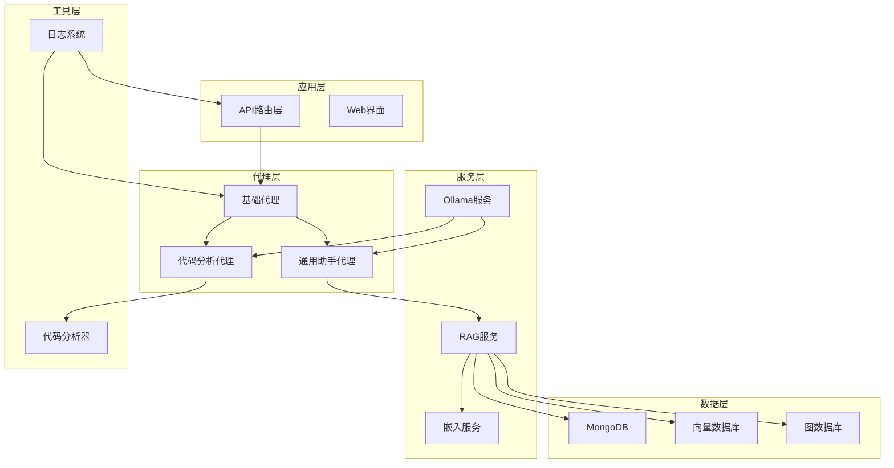
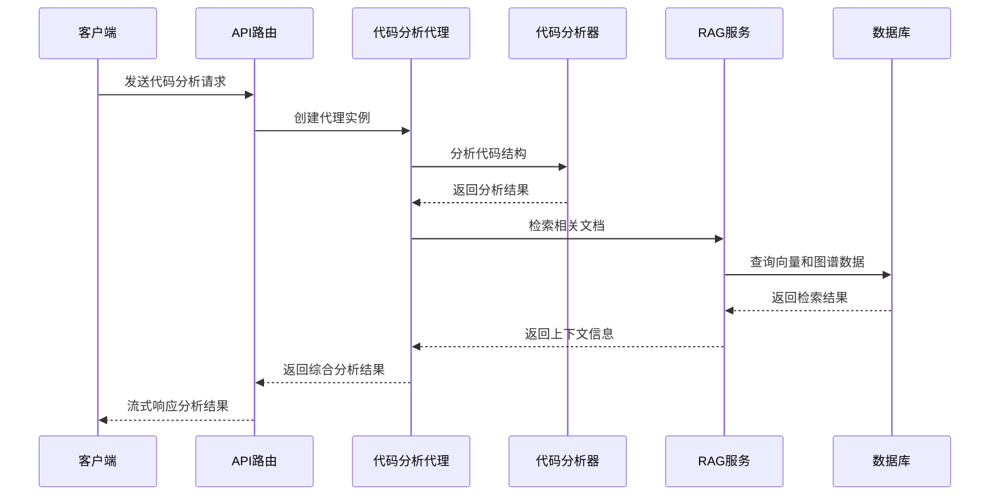
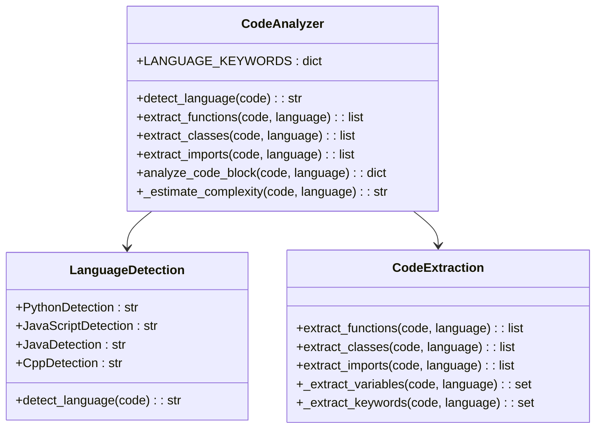
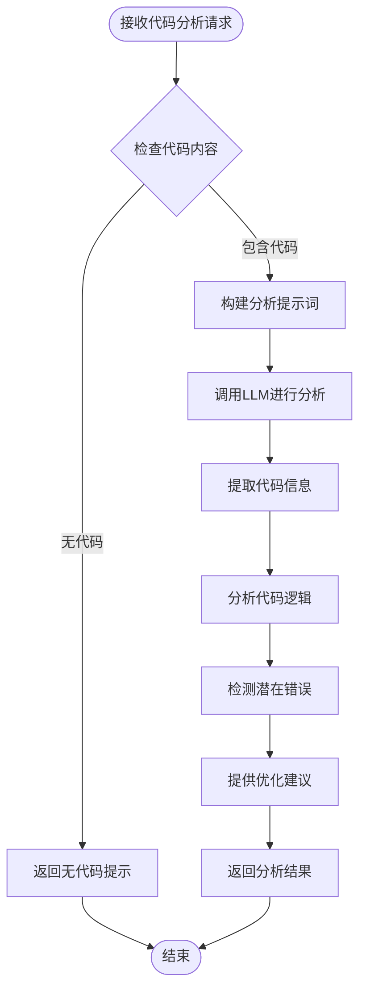
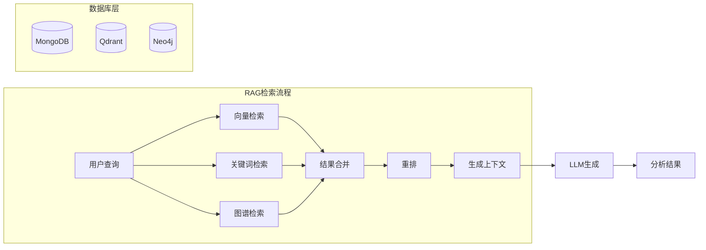
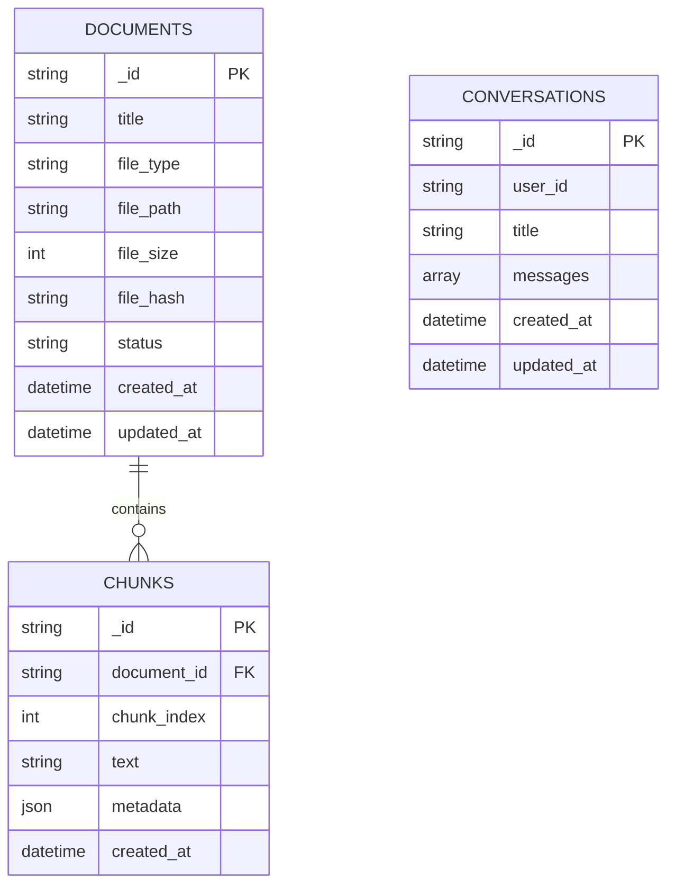
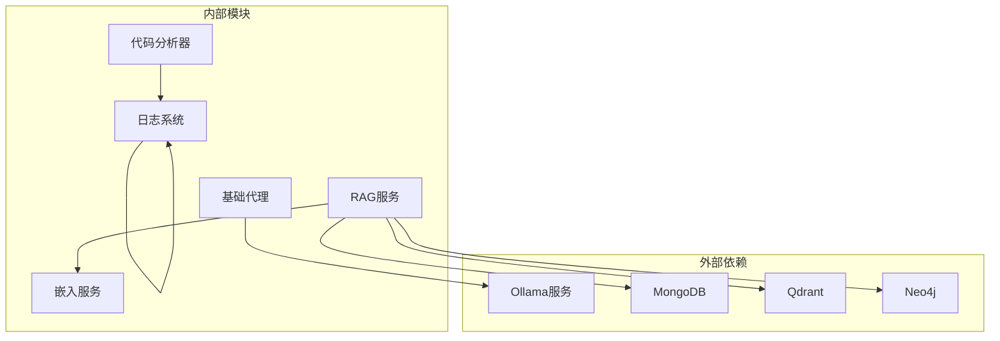

# 代码分析专家

<cite>
**本文档引用的文件**
- [main.py](file://main.py)
- [base_agent.py](file://agents/base/base_agent.py)
- [code_analyzer.py](file://utils/code_analyzer.py)
- [code_analysis_agent.py](file://agents/experts/code_analysis_agent.py)
- [general_assistant_agent.py](file://agents/general_assistant/general_assistant_agent.py)
- [rag_service.py](file://services/rag_service.py)
- [rag_retriever.py](file://retrieval/rag_retriever.py)
- [embedding_service.py](file://embedding/embedding_service.py)
- [mongodb.py](file://database/mongodb.py)
- [chat.py](file://routers/chat.py)
- [logger.py](file://utils/logger.py)
</cite>

## 目录
1. [简介](#简介)
2. [项目结构](#项目结构)
3. [核心组件](#核心组件)
4. [架构概览](#架构概览)
5. [详细组件分析](#详细组件分析)
6. [依赖分析](#依赖分析)
7. [性能考虑](#性能考虑)
8. [故障排除指南](#故障排除指南)
9. [结论](#结论)
10. [附录](#附录)

## 简介
本项目旨在构建一个强大的"代码分析专家"代理，能够对多语言代码进行深入分析，提供代码理解、逻辑分析、错误检测和性能优化建议。该代理具备以下核心能力：

- **多语言支持**：支持Python、JavaScript、Java、C++等多种编程语言的语法解析和结构分析
- **智能代码理解**：通过代码分析器提取函数定义、类结构、导入语句等关键信息
- **逻辑分析能力**：识别代码复杂度、变量使用模式和关键字分布
- **错误检测机制**：基于语法模式和常见编程错误的检测
- **性能优化建议**：提供代码复杂度评估和改进建议
- **RAG集成**：与检索增强生成系统无缝集成，提供上下文相关的分析

## 项目结构
该项目采用模块化设计，主要分为以下几个核心层次：

**图表来源**
- [main.py:1-157](file://main.py#L1-L157)
- [base_agent.py:1-122](file://agents/base/base_agent.py#L1-L122)
- [code_analysis_agent.py:1-79](file://agents/experts/code_analysis_agent.py#L1-L79)

**章节来源**
- [main.py:1-157](file://main.py#L1-L157)
- [base_agent.py:1-122](file://agents/base/base_agent.py#L1-L122)

## 核心组件
本项目的核心组件包括基础代理框架、代码分析器、RAG检索系统和数据库层。

### 基础代理框架
基础代理类提供了统一的接口和通用功能，包括模型管理、提示词构建和流式输出支持。

### 代码分析器
代码分析器是项目的核心工具，负责多语言代码的语法解析和语义分析。

### RAG检索系统
集成了向量检索、关键词检索和图谱检索的混合检索系统，提供增强的代码分析能力。

### 数据库层
支持MongoDB、Qdrant向量数据库和Neo4j图数据库，提供完整的知识存储和检索能力。

**章节来源**
- [base_agent.py:1-122](file://agents/base/base_agent.py#L1-L122)
- [code_analyzer.py:1-350](file://utils/code_analyzer.py#L1-L350)
- [rag_service.py:1-248](file://services/rag_service.py#L1-L248)

## 架构概览
系统的整体架构采用分层设计，确保了良好的可扩展性和维护性：

**图表来源**
- [chat.py:615-750](file://routers/chat.py#L615-L750)
- [code_analysis_agent.py:25-78](file://agents/experts/code_analysis_agent.py#L25-L78)
- [general_assistant_agent.py:49-167](file://agents/general_assistant/general_assistant_agent.py#L49-L167)

## 详细组件分析

### 代码分析器组件
代码分析器是整个系统的核心工具，具备以下关键功能：

#### 多语言支持机制
分析器支持四种主流编程语言的语法解析：

**图表来源**
- [code_analyzer.py:7-350](file://utils/code_analyzer.py#L7-L350)

#### 语法解析策略
分析器采用正则表达式和模式匹配相结合的方式：

1. **语言检测**：通过关键字和语法特征识别编程语言
2. **结构提取**：使用正则表达式匹配函数、类和导入语句
3. **复杂度评估**：基于代码行数、控制结构和函数数量计算复杂度

#### 代码结构分析方法
分析器提供多层次的代码分析：

1. **语法结构分析**：识别函数定义、类声明和导入语句
2. **语义信息提取**：提取变量名、关键字和注释信息
3. **复杂度评估**：估算代码复杂度等级（简单/中等/复杂）

**章节来源**
- [code_analyzer.py:1-350](file://utils/code_analyzer.py#L1-L350)

### 代码分析代理组件
代码分析代理专门负责处理代码相关的分析任务：

**图表来源**
- [code_analysis_agent.py:25-78](file://agents/experts/code_analysis_agent.py#L25-L78)

#### 编程分析能力
代理具备以下编程分析能力：

1. **代码理解**：分析代码的功能和实现逻辑
2. **结构分析**：识别代码的组织结构和设计模式
3. **错误检测**：识别潜在的语法和逻辑错误
4. **性能分析**：评估代码的性能特征和优化空间

#### 代码审查流程
代理遵循标准化的代码审查流程：

1. **代码预处理**：验证输入代码的有效性
2. **结构分析**：提取代码的语法结构信息
3. **逻辑审查**：分析代码的执行逻辑和算法效率
4. **错误检测**：识别潜在的bug和安全漏洞
5. **优化建议**：提供具体的改进建议和最佳实践

**章节来源**
- [code_analysis_agent.py:1-79](file://agents/experts/code_analysis_agent.py#L1-L79)

### RAG集成组件
系统集成了检索增强生成功能，提供上下文相关的代码分析：

**图表来源**
- [rag_retriever.py:69-101](file://retrieval/rag_retriever.py#L69-L101)
- [rag_service.py:10-83](file://services/rag_service.py#L10-L83)

#### 检索策略
系统采用混合检索策略：

1. **向量检索**：基于语义相似度的文档检索
2. **关键词检索**：基于精确匹配的文档筛选
3. **图谱检索**：基于实体关系的知识图谱查询

#### 上下文构建
RAG服务负责构建增强的分析上下文：

1. **知识空间过滤**：根据知识空间ID筛选相关文档
2. **并行检索**：同时执行多种检索策略
3. **结果合并**：整合不同来源的检索结果

**章节来源**
- [rag_retriever.py:1-325](file://retrieval/rag_retriever.py#L1-L325)
- [rag_service.py:1-248](file://services/rag_service.py#L1-L248)

### 数据库集成组件
系统支持多种数据库的集成，提供完整的数据存储和检索能力：

#### MongoDB集成
提供文档元数据管理和对话历史存储：

**图表来源**
- [mongodb.py:315-525](file://database/mongodb.py#L315-L525)

#### 向量数据库集成
支持Qdrant向量数据库的高效相似度检索：

#### 图数据库集成
集成Neo4j图数据库，支持实体关系查询和知识图谱检索。

**章节来源**
- [mongodb.py:1-800](file://database/mongodb.py#L1-L800)

## 依赖分析
系统采用模块化设计，各组件之间的依赖关系清晰明确：

**图表来源**
- [base_agent.py:1-122](file://agents/base/base_agent.py#L1-L122)
- [code_analyzer.py:1-350](file://utils/code_analyzer.py#L1-L350)
- [rag_service.py:1-248](file://services/rag_service.py#L1-L248)

### 组件耦合度
- **低耦合设计**：各模块职责明确，接口清晰
- **可替换性**：支持不同数据库和模型服务的切换
- **扩展性**：易于添加新的分析能力和数据源

### 循环依赖
系统避免了循环依赖的设计，确保了良好的可维护性。

**章节来源**
- [base_agent.py:1-122](file://agents/base/base_agent.py#L1-L122)
- [code_analyzer.py:1-350](file://utils/code_analyzer.py#L1-L350)

## 性能考虑
系统在设计时充分考虑了性能优化：

### 并行处理
- **异步检索**：RAG检索采用异步并行处理
- **流式输出**：支持流式响应，提升用户体验
- **连接池管理**：数据库连接池优化，支持高并发

### 缓存策略
- **模型缓存**：Ollama模型的智能缓存和切换
- **向量缓存**：嵌入向量的本地缓存机制
- **结果缓存**：常用查询结果的缓存策略

### 资源管理
- **内存优化**：代码分析的内存使用优化
- **网络优化**：数据库连接的超时和重试机制
- **CPU优化**：多核CPU的并行处理能力

## 故障排除指南

### 常见问题诊断
1. **模型连接失败**：检查Ollama服务的可用性和网络连接
2. **数据库连接异常**：验证MongoDB连接字符串和认证信息
3. **向量检索超时**：调整Qdrant连接参数和查询阈值
4. **代码分析错误**：检查代码格式和语言检测准确性

### 日志分析
系统提供详细的日志记录，包括：
- **请求处理日志**：记录API请求和响应
- **数据库操作日志**：跟踪数据读写操作
- **模型调用日志**：监控LLM生成过程
- **错误追踪日志**：定位系统异常和错误

### 性能监控
- **响应时间监控**：跟踪API响应延迟
- **资源使用监控**：监控CPU、内存和磁盘使用率
- **数据库性能监控**：分析查询性能和连接状态

**章节来源**
- [logger.py:1-88](file://utils/logger.py#L1-L88)
- [main.py:109-126](file://main.py#L109-L126)

## 结论
"代码分析专家"代理系统提供了一个完整的多语言代码分析解决方案。通过集成先进的AI模型、RAG检索系统和数据库技术，该系统能够：

1. **全面的代码理解**：支持多种编程语言的语法解析和语义分析
2. **智能的逻辑分析**：识别代码结构、设计模式和潜在问题
3. **有效的错误检测**：基于规则和机器学习的错误识别机制
4. **实用的性能优化**：提供具体的代码改进建议和最佳实践
5. **强大的上下文感知**：结合检索增强技术提供丰富的分析背景

该系统具有良好的可扩展性和维护性，为软件开发、代码教育和技术创新提供了强有力的技术支撑。

## 附录

### API接口定义
系统提供RESTful API接口，支持代码分析和对话功能：

| 端点 | 方法 | 描述 |
|------|------|------|
| `/api/chat` | POST | 发送消息并获取流式响应 |
| `/api/chat/conversations` | POST | 创建新对话 |
| `/api/chat/models` | GET | 获取可用模型列表 |

### 配置选项
系统支持多种配置选项：
- **模型配置**：可配置LLM和嵌入模型
- **数据库配置**：支持多种数据库连接参数
- **性能配置**：可调节并发数和超时时间
- **日志配置**：可设置日志级别和输出格式

### 集成指南
系统支持多种集成方式：
- **IDE集成**：可通过插件或扩展程序集成到各种IDE
- **CI/CD集成**：可在持续集成流程中进行代码质量检查
- **Web集成**：提供RESTful API供Web应用调用
- **批量处理**：支持大规模代码库的批量分析