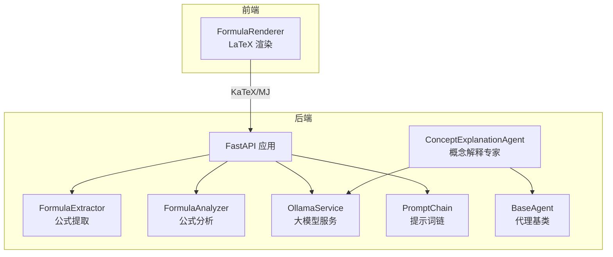
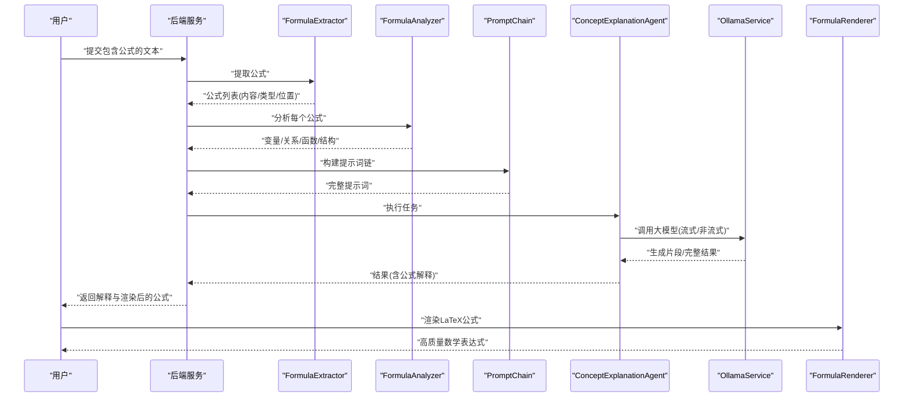
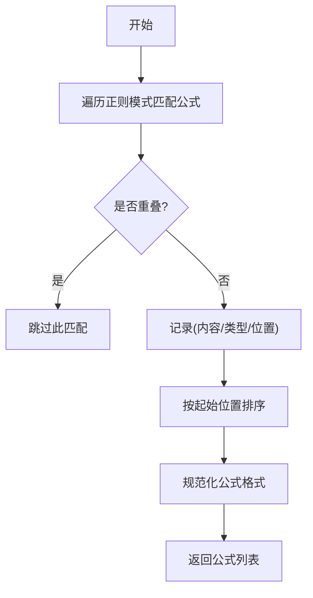
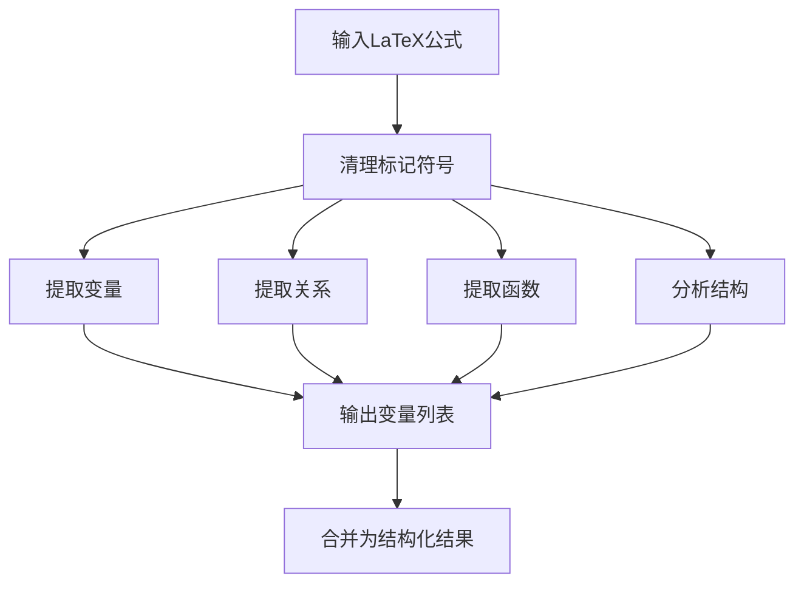
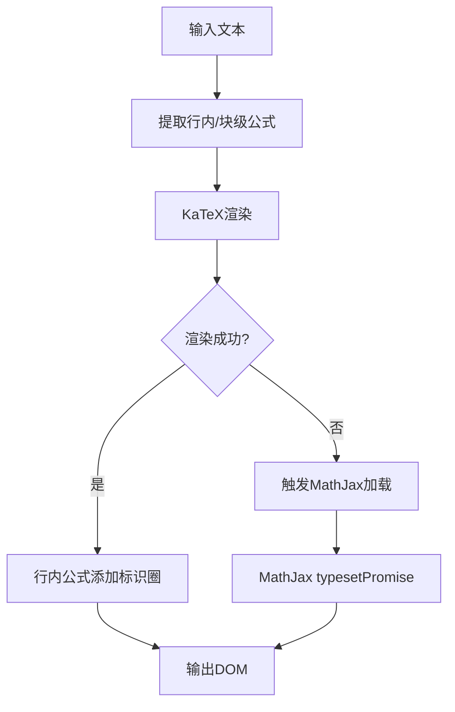
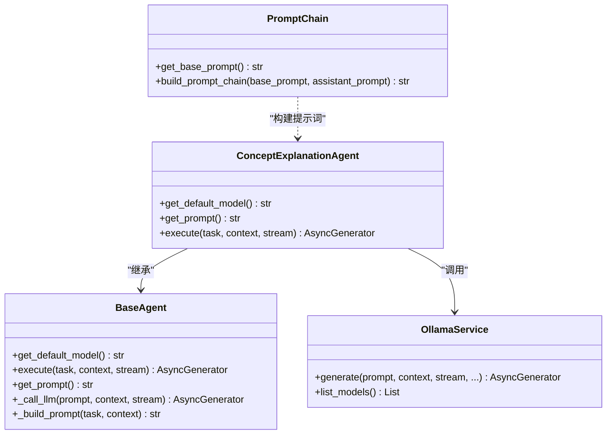
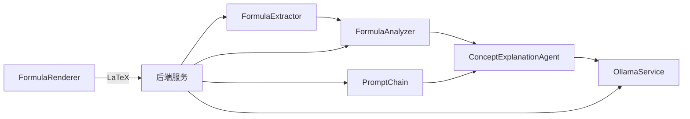

# 公式分析专家

<cite>
**本文引用的文件**
- [FormulaAnalyzer.py](file://utils/formula_analyzer.py)
- [FormulaExtractor.py](file://utils/formula_extractor.py)
- [FormulaRenderer.tsx](file://web/components/message/FormulaRenderer.tsx)
- [concept_explanation_agent.py](file://agents/experts/concept_explanation_agent.py)
- [base_agent.py](file://agents/base/base_agent.py)
- [ollama_service.py](file://services/ollama_service.py)
- [prompt_chain.py](file://services/prompt_chain.py)
- [README.md](file://README.md)
</cite>

## 目录
1. [简介](#简介)
2. [项目结构](#项目结构)
3. [核心组件](#核心组件)
4. [架构总览](#架构总览)
5. [详细组件分析](#详细组件分析)
6. [依赖关系分析](#依赖关系分析)
7. [性能考量](#性能考量)
8. [故障排查指南](#故障排查指南)
9. [结论](#结论)
10. [附录](#附录)

## 简介
本技术文档围绕“公式分析专家代理”展开，系统阐述其在数学公式处理方面的能力与实现：包括公式识别、符号解析、数学关系分析、结构化表示、语义理解与可视化渲染。文档还说明与LaTeX、MathML等格式的兼容性、公式转换与渲染策略，并给出在物理、数学、工程等学科中的应用示例与使用指南。

## 项目结构
该项目为“高级RAG系统”，前端采用Next.js，后端基于FastAPI；公式分析能力由后端工具模块与前端渲染组件共同实现：
- 后端工具层：公式提取与分析（utils/formula_extractor.py、utils/formula_analyzer.py）
- 前端渲染层：LaTeX公式渲染（web/components/message/FormulaRenderer.tsx）
- 代理与提示词链：概念解释与公式分析代理（agents/experts/concept_explanation_agent.py、services/prompt_chain.py）
- 大模型服务：Ollama服务封装（services/ollama_service.py）

**图表来源**
- [FormulaExtractor.py:28-57](file://utils/formula_extractor.py#L28-L57)
- [FormulaAnalyzer.py:32-77](file://utils/formula_analyzer.py#L32-L77)
- [ollama_service.py:50-92](file://services/ollama_service.py#L50-L92)
- [prompt_chain.py:10-30](file://services/prompt_chain.py#L10-L30)
- [base_agent.py:27-55](file://agents/base/base_agent.py#L27-L55)
- [concept_explanation_agent.py:25-70](file://agents/experts/concept_explanation_agent.py#L25-L70)
- [FormulaRenderer.tsx:38-498](file://web/components/message/FormulaRenderer.tsx#L38-L498)

**章节来源**
- [README.md:46-70](file://README.md#L46-L70)

## 核心组件
- 公式提取器（FormulaExtractor）：识别LaTeX块级/行内公式、规范化公式格式、保留公式位置信息。
- 公式分析器（FormulaAnalyzer）：提取变量、关系、函数、结构信息，计算复杂度，支持批量分析。
- 公式渲染器（FormulaRenderer）：优先使用KaTeX渲染，不支持时回退至MathJax，保证公式在浏览器端正确显示。
- 代理与提示词链：概念解释专家（ConceptExplanationAgent）与提示词链（PromptChain）协同，面向物理/工程等学科提供结构化解释与公式说明。
- 大模型服务（OllamaService）：统一调用本地大模型，支持流式/非流式生成，构建完整提示词并处理工具调用。

**章节来源**
- [FormulaExtractor.py:28-57](file://utils/formula_extractor.py#L28-L57)
- [FormulaAnalyzer.py:32-77](file://utils/formula_analyzer.py#L32-L77)
- [FormulaRenderer.tsx:38-498](file://web/components/message/FormulaRenderer.tsx#L38-L498)
- [concept_explanation_agent.py:25-70](file://agents/experts/concept_explanation_agent.py#L25-L70)
- [prompt_chain.py:10-30](file://services/prompt_chain.py#L10-L30)
- [ollama_service.py:50-92](file://services/ollama_service.py#L50-L92)

## 架构总览
公式分析专家代理的工作流程如下：
- 文本输入经公式提取器识别并规范化；
- 分析器对每个公式进行变量/关系/函数/结构分析；
- 结果通过提示词链与代理（如概念解释专家）进行语义增强与解释；
- 前端使用FormulaRenderer将LaTeX公式渲染为高质量数学表达式。

**图表来源**
- [FormulaExtractor.py:28-57](file://utils/formula_extractor.py#L28-L57)
- [FormulaAnalyzer.py:212-231](file://utils/formula_analyzer.py#L212-L231)
- [prompt_chain.py:10-30](file://services/prompt_chain.py#L10-L30)
- [concept_explanation_agent.py:25-70](file://agents/experts/concept_explanation_agent.py#L25-L70)
- [ollama_service.py:50-92](file://services/ollama_service.py#L50-L92)
- [FormulaRenderer.tsx:256-498](file://web/components/message/FormulaRenderer.tsx#L256-L498)

## 详细组件分析

### 公式提取器（FormulaExtractor）
- 功能要点
  - 识别块级与行内LaTeX公式，支持多种环境与括号形式；
  - 规范化公式格式，将常见字符映射为标准LaTeX符号；
  - 保留公式位置信息，便于后续分析与高亮；
  - 支持物理量定义的检测（正则模式）。
- 关键实现
  - 提取：遍历预定义正则模式，避免重叠匹配，按出现顺序排序；
  - 规范化：替换常见错误编码与符号，统一为LaTeX格式；
  - 保留：在文本中标记公式，避免后续清理逻辑误删。

**图表来源**
- [FormulaExtractor.py:28-57](file://utils/formula_extractor.py#L28-L57)
- [FormulaExtractor.py:60-104](file://utils/formula_extractor.py#L60-L104)

**章节来源**
- [FormulaExtractor.py:28-57](file://utils/formula_extractor.py#L28-L57)
- [FormulaExtractor.py:60-104](file://utils/formula_extractor.py#L60-L104)
- [FormulaExtractor.py:107-130](file://utils/formula_extractor.py#L107-L130)
- [FormulaExtractor.py:133-147](file://utils/formula_extractor.py#L133-L147)

### 公式分析器（FormulaAnalyzer）
- 功能要点
  - 提取变量：支持单字母、下标、正体与文本变量；
  - 提取关系：识别等式与不等式关系及其左右表达式；
  - 提取函数：识别LaTeX命令与常见函数名；
  - 结构分析：判断是否方程、是否含分数/根号/积分/求和/矩阵等；
  - 复杂度评估：基于运算符、函数、分数、根号数量估算复杂度等级。
- 关键实现
  - 变量提取：多正则模式并集，排除数学常量；
  - 关系提取：基于运算符集合与正则扫描；
  - 结构判断：基于关键字存在性统计；
  - 批量分析：对提取的公式逐一分析并附带位置信息。

**图表来源**
- [FormulaAnalyzer.py:32-77](file://utils/formula_analyzer.py#L32-L77)
- [FormulaAnalyzer.py:80-109](file://utils/formula_analyzer.py#L80-L109)
- [FormulaAnalyzer.py:112-142](file://utils/formula_analyzer.py#L112-L142)
- [FormulaAnalyzer.py:145-158](file://utils/formula_analyzer.py#L145-L158)
- [FormulaAnalyzer.py:161-191](file://utils/formula_analyzer.py#L161-L191)
- [FormulaAnalyzer.py:194-210](file://utils/formula_analyzer.py#L194-L210)
- [FormulaAnalyzer.py:212-231](file://utils/formula_analyzer.py#L212-L231)

**章节来源**
- [FormulaAnalyzer.py:32-77](file://utils/formula_analyzer.py#L32-L77)
- [FormulaAnalyzer.py:80-109](file://utils/formula_analyzer.py#L80-L109)
- [FormulaAnalyzer.py:112-142](file://utils/formula_analyzer.py#L112-L142)
- [FormulaAnalyzer.py:145-158](file://utils/formula_analyzer.py#L145-L158)
- [FormulaAnalyzer.py:161-191](file://utils/formula_analyzer.py#L161-L191)
- [FormulaAnalyzer.py:194-210](file://utils/formula_analyzer.py#L194-L210)
- [FormulaAnalyzer.py:212-231](file://utils/formula_analyzer.py#L212-L231)

### 公式渲染器（FormulaRenderer）
- 功能要点
  - 优先使用KaTeX渲染，速度快、体积小、无需额外扩展；
  - 对KaTeX不支持的公式，按需加载MathJax并回退渲染；
  - 自动为行内公式添加“公式”标识圈，提升可读性；
  - 深色模式适配，保证在不同主题下的可读性；
  - 容错与超时处理，避免字体加载失败影响整体体验。
- 关键实现
  - 提取行内/块级公式，分别渲染；
  - KaTeX失败时触发MathJax加载与typesetPromise；
  - 事件驱动初始化，避免重复加载；
  - 全局样式注入，保证标识圈与公式对齐。

**图表来源**
- [FormulaRenderer.tsx:269-289](file://web/components/message/FormulaRenderer.tsx#L269-L289)
- [FormulaRenderer.tsx:304-398](file://web/components/message/FormulaRenderer.tsx#L304-L398)
- [FormulaRenderer.tsx:400-498](file://web/components/message/FormulaRenderer.tsx#L400-L498)

**章节来源**
- [FormulaRenderer.tsx:38-498](file://web/components/message/FormulaRenderer.tsx#L38-L498)

### 代理与提示词链（ConceptExplanationAgent + PromptChain）
- 概念解释专家（ConceptExplanationAgent）
  - 专用角色：物理概念解释；
  - 输出结构：定义、物理意义、公式与定律、应用示例、概念关系；
  - 调用链：继承BaseAgent，通过OllamaService进行流式/非流式生成。
- 提示词链（PromptChain）
  - 基础提示词：定义角色、职责、回答原则、格式要求、工具函数使用；
  - 公式格式要求：强调KaTeX兼容的LaTeX输出规范；
  - 助手特定提示词：可作为扩展追加，形成“基础+扩展”的提示词链。

**图表来源**
- [base_agent.py:27-55](file://agents/base/base_agent.py#L27-L55)
- [concept_explanation_agent.py:10-23](file://agents/experts/concept_explanation_agent.py#L10-L23)
- [concept_explanation_agent.py:25-70](file://agents/experts/concept_explanation_agent.py#L25-L70)
- [ollama_service.py:50-92](file://services/ollama_service.py#L50-L92)
- [prompt_chain.py:10-30](file://services/prompt_chain.py#L10-L30)
- [prompt_chain.py:383-427](file://services/prompt_chain.py#L383-L427)

**章节来源**
- [concept_explanation_agent.py:10-23](file://agents/experts/concept_explanation_agent.py#L10-L23)
- [concept_explanation_agent.py:25-70](file://agents/experts/concept_explanation_agent.py#L25-L70)
- [base_agent.py:27-55](file://agents/base/base_agent.py#L27-L55)
- [base_agent.py:75-98](file://agents/base/base_agent.py#L75-L98)
- [ollama_service.py:50-92](file://services/ollama_service.py#L50-L92)
- [prompt_chain.py:10-30](file://services/prompt_chain.py#L10-L30)
- [prompt_chain.py:156-213](file://services/prompt_chain.py#L156-L213)
- [prompt_chain.py:383-427](file://services/prompt_chain.py#L383-L427)

## 依赖关系分析
- 后端依赖
  - utils/formula_extractor.py 与 utils/formula_analyzer.py 互为前后置依赖：先提取再分析；
  - agents/experts/concept_explanation_agent.py 依赖 agents/base/base_agent.py 与 services/ollama_service.py；
  - services/prompt_chain.py 为提示词构建的核心，贯穿代理与服务层。
- 前端依赖
  - web/components/message/FormulaRenderer.tsx 依赖 KaTeX 与 MathJax（按需加载），负责最终渲染。

**图表来源**
- [FormulaExtractor.py:28-57](file://utils/formula_extractor.py#L28-L57)
- [FormulaAnalyzer.py:212-231](file://utils/formula_analyzer.py#L212-L231)
- [concept_explanation_agent.py:25-70](file://agents/experts/concept_explanation_agent.py#L25-L70)
- [ollama_service.py:50-92](file://services/ollama_service.py#L50-L92)
- [prompt_chain.py:10-30](file://services/prompt_chain.py#L10-L30)
- [FormulaRenderer.tsx:38-498](file://web/components/message/FormulaRenderer.tsx#L38-L498)

**章节来源**
- [FormulaExtractor.py:28-57](file://utils/formula_extractor.py#L28-L57)
- [FormulaAnalyzer.py:212-231](file://utils/formula_analyzer.py#L212-L231)
- [concept_explanation_agent.py:25-70](file://agents/experts/concept_explanation_agent.py#L25-L70)
- [ollama_service.py:50-92](file://services/ollama_service.py#L50-L92)
- [prompt_chain.py:10-30](file://services/prompt_chain.py#L10-L30)
- [FormulaRenderer.tsx:38-498](file://web/components/message/FormulaRenderer.tsx#L38-L498)

## 性能考量
- 公式提取与分析
  - 正则匹配与集合去重的时间复杂度与输入规模相关，建议对长文本分段处理；
  - 批量分析时可并行化（注意正则并发安全与共享状态）。
- 渲染性能
  - KaTeX优先渲染，MathJax按需加载，避免首屏阻塞；
  - 深色模式样式注入一次性完成，减少重复计算。
- 大模型交互
  - 流式输出降低首字节延迟，适合长回答场景；
  - 超时与空闲检测避免长时间等待，提升稳定性。

[本节为通用性能讨论，不直接分析具体文件]

## 故障排查指南
- 公式未正确渲染
  - 检查LaTeX语法是否符合KaTeX/前端要求；
  - 若KaTeX报错，确认是否触发MathJax回退；
  - 查看浏览器控制台字体加载错误与事件日志。
- 公式提取遗漏
  - 确认公式是否使用标准LaTeX环境与分隔符；
  - 检查是否存在重叠匹配导致被跳过。
- 代理输出不完整
  - 检查提示词链构建是否成功；
  - 确认Ollama服务可达与模型加载状态；
  - 关注流式输出的超时与空闲检测日志。

**章节来源**
- [FormulaRenderer.tsx:44-231](file://web/components/message/FormulaRenderer.tsx#L44-L231)
- [FormulaRenderer.tsx:400-498](file://web/components/message/FormulaRenderer.tsx#L400-L498)
- [FormulaExtractor.py:42-56](file://utils/formula_extractor.py#L42-L56)
- [ollama_service.py:453-637](file://services/ollama_service.py#L453-L637)

## 结论
公式分析专家代理通过“提取—分析—解释—渲染”的闭环，实现了对LaTeX公式的结构化解析与高质量可视化。后端工具模块提供稳定的公式识别与语义分析，前端渲染组件保障跨浏览器的公式显示一致性，代理与提示词链确保在物理/工程等学科场景下的专业解释与应用指导。该体系既满足教学与科研需求，又具备良好的扩展性与可维护性。

[本节为总结性内容，不直接分析具体文件]

## 附录

### 公式格式与兼容性
- LaTeX兼容
  - 行内公式：$...$
  - 块级公式：$$...$$
  - 常用命令：分数、根号、上/下标、求和/积分、希腊字母、向量、矩阵、偏导数、梯度/散度/旋度等
- MathML兼容
  - KaTeX内部支持MathML树构建，可在必要时生成MathML节点
  - 公式渲染器优先使用KaTeX，不支持时回退MathJax，间接保证MathML生态兼容

**章节来源**
- [prompt_chain.py:156-213](file://services/prompt_chain.py#L156-L213)
- [prompt_chain.py:179-190](file://services/prompt_chain.py#L179-L190)
- [FormulaRenderer.tsx:19140-19184](file://web/components/message/FormulaRenderer.tsx#L19140-L19184)

### 学科应用示例
- 物理学
  - 牛顿第二定律：$F = ma$
  - 动能公式：$E_k = \frac{1}{2}mv^2$
  - 质能方程：$E = mc^2$
  - 麦克斯韦方程组（块级对齐）
- 数学
  - 微积分与级数、概率统计常用公式
- 工程学
  - 材料力学、电路分析、信号处理等公式

**章节来源**
- [prompt_chain.py:192-204](file://services/prompt_chain.py#L192-L204)

### 使用指南
- 公式教学
  - 使用块级公式展示重要公式，行内公式配合文本说明
  - 为复杂公式提供逐步推导与变量解释
- 学术写作
  - 严格遵循LaTeX语法，避免渲染错误
  - 使用MathJax/KaTeX兼容的符号与命令
- 交互体验
  - 行内公式自动添加“公式”标识圈，提升可读性
  - 深色模式下保持良好对比度与可读性

**章节来源**
- [prompt_chain.py:156-213](file://services/prompt_chain.py#L156-L213)
- [FormulaRenderer.tsx:500-610](file://web/components/message/FormulaRenderer.tsx#L500-L610)