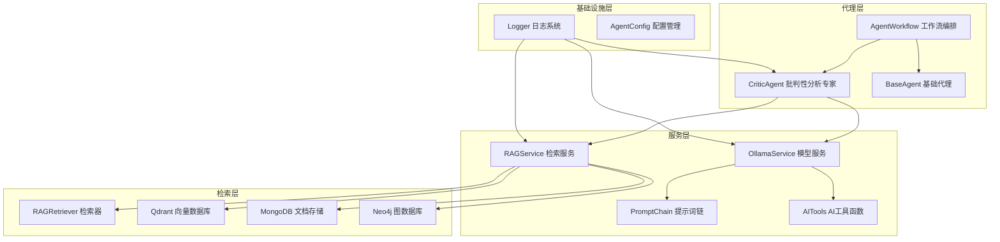
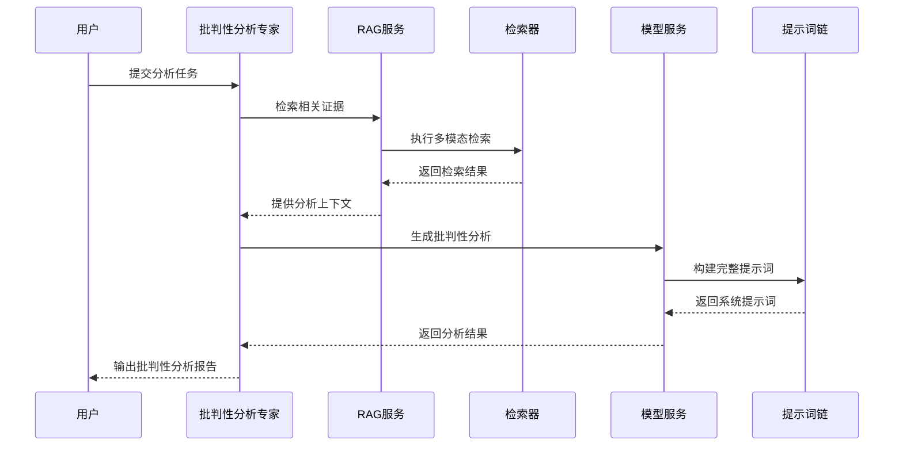
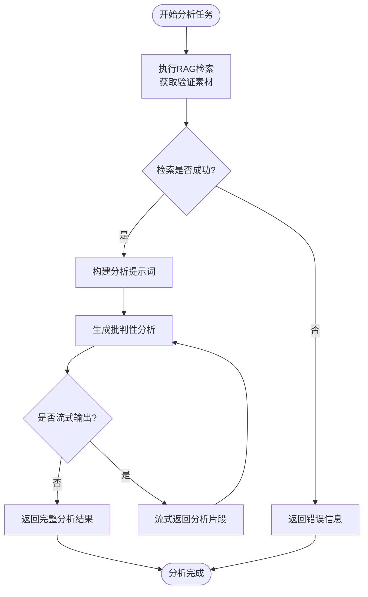
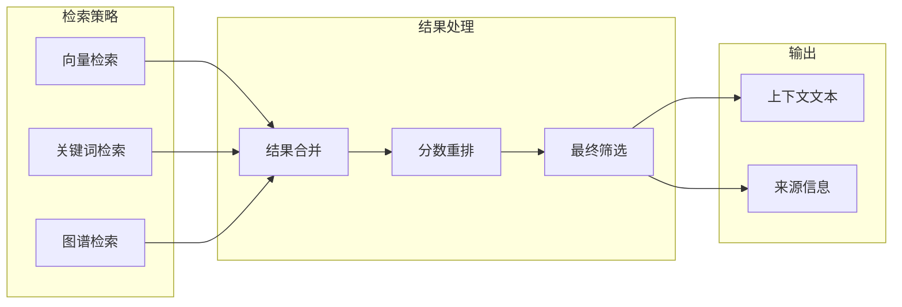
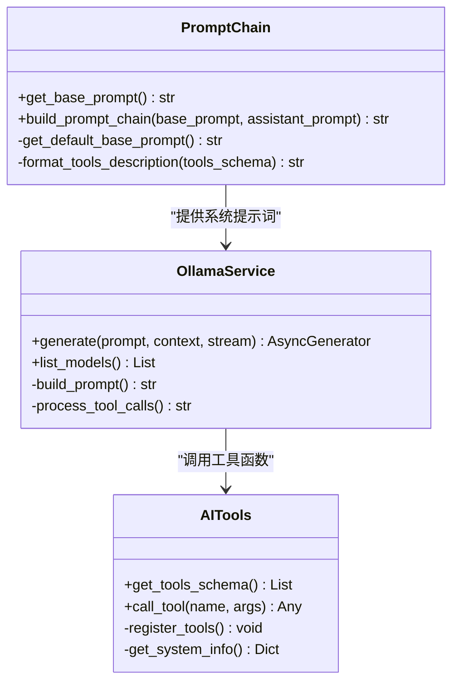
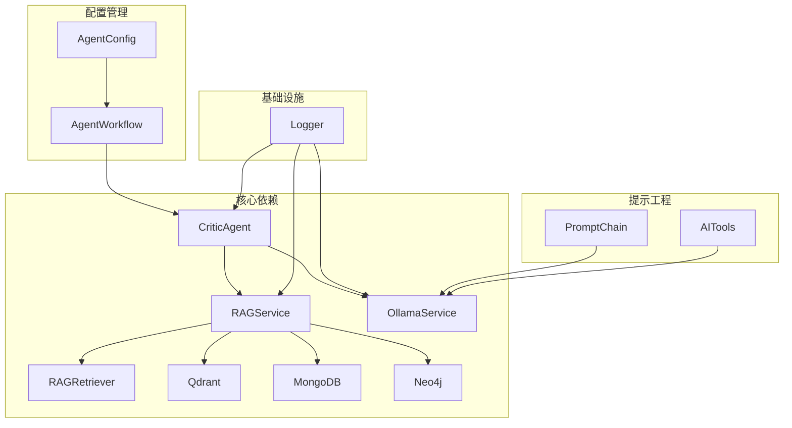
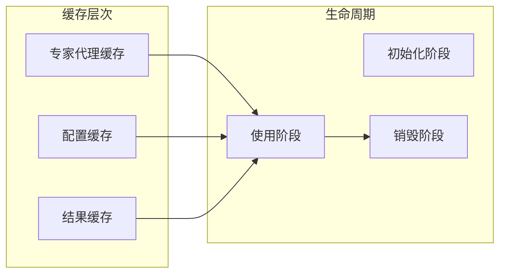

# 批判性分析专家

<cite>
**本文档引用的文件**
- [critic_agent.py](file://agents/experts/critic_agent.py)
- [base_agent.py](file://agents/base/base_agent.py)
- [agent_workflow.py](file://agents/workflow/agent_workflow.py)
- [rag_service.py](file://services/rag_service.py)
- [ollama_service.py](file://services/ollama_service.py)
- [prompt_chain.py](file://services/prompt_chain.py)
- [rag_retriever.py](file://retrieval/rag_retriever.py)
- [logger.py](file://utils/logger.py)
- [agent_config.py](file://models/agent_config.py)
- [ai_tools.py](file://services/ai_tools.py)
</cite>

## 更新摘要
**变更内容**
- 新增批判性分析专家代理的完整实现
- 增强了RAG服务的检索能力
- 完善了提示词链机制
- 扩展了AI工具函数库

## 目录
1. [简介](#简介)
2. [项目结构](#项目结构)
3. [核心组件](#核心组件)
4. [架构概览](#架构概览)
5. [详细组件分析](#详细组件分析)
6. [依赖关系分析](#依赖关系分析)
7. [性能考量](#性能考量)
8. [故障排除指南](#故障排除指南)
9. [结论](#结论)

## 简介

批判性分析专家是一个专门设计用于深度分析和评估信息的智能代理系统。该系统的核心能力包括：

- **批判性思维分析**：识别信息中的逻辑漏洞、事实错误和幻觉
- **多维度证据评估**：基于检索到的证据进行反驳或确认
- **客观性保障**：提供平衡、严谨的分析视角
- **反面观点提供**：主动寻找和呈现潜在的问题和局限性

该代理系统采用先进的RAG（检索增强生成）架构，结合多模态检索技术和深度提示工程，为用户提供全面、深入的批判性分析服务。

**更新** 新增了完整的批判性分析专家代理实现，包含89行核心代码，支持逻辑一致性分析、潜在幻觉识别和建设性批评。

## 项目结构

该项目采用模块化架构设计，主要分为以下几个核心层次：

**图表来源**
- [critic_agent.py:1-90](file://agents/experts/critic_agent.py#L1-L90)
- [agent_workflow.py:1-388](file://agents/workflow/agent_workflow.py#L1-L388)
- [rag_service.py:1-248](file://services/rag_service.py#L1-L248)

**章节来源**
- [critic_agent.py:1-90](file://agents/experts/critic_agent.py#L1-L90)
- [agent_workflow.py:1-388](file://agents/workflow/agent_workflow.py#L1-L388)
- [rag_service.py:1-248](file://services/rag_service.py#L1-L248)

## 核心组件

### 批判性分析专家代理 (CriticAgent)

CriticAgent是系统的核心分析组件，专门负责执行批判性思维分析任务。其主要特性包括：

- **严格的分析框架**：基于预定义的分析准则进行信息评估
- **多源证据整合**：结合RAG检索到的多种证据来源
- **客观性保证**：通过标准化的输出格式确保分析的客观性
- **建设性反馈**：不仅指出问题，还提供改进建议

**更新** 新增了完整的CriticAgent实现，包含90行代码，支持流式输出和错误处理。

### 基础代理框架 (BaseAgent)

BaseAgent为所有代理提供统一的基础设施和通用功能：

- **抽象接口定义**：标准化的代理执行接口
- **模型集成**：统一的LLM调用接口
- **工具管理**：代理可用工具的统一管理
- **提示工程**：系统化的提示词构建机制

### 检索增强生成服务 (RAGService)

RAGService提供强大的知识检索和上下文生成能力：

- **多模态检索**：向量检索、关键词检索、图谱检索的混合策略
- **并行处理**：异步并行执行多种检索策略
- **智能合并**：将不同来源的检索结果进行智能融合
- **上下文构建**：生成高质量的分析上下文

**章节来源**
- [critic_agent.py:7-90](file://agents/experts/critic_agent.py#L7-L90)
- [base_agent.py:8-122](file://agents/base/base_agent.py#L8-L122)
- [rag_service.py:7-248](file://services/rag_service.py#L7-L248)

## 架构概览

系统采用分层架构设计，确保了良好的可扩展性和维护性：

**图表来源**
- [critic_agent.py:26-90](file://agents/experts/critic_agent.py#L26-L90)
- [rag_service.py:10-191](file://services/rag_service.py#L10-L191)
- [ollama_service.py:50-93](file://services/ollama_service.py#L50-L93)

## 详细组件分析

### 批判性分析专家代理实现

#### 核心执行流程

**图表来源**
- [critic_agent.py:26-90](file://agents/experts/critic_agent.py#L26-L90)

#### 分析框架设计原理

CriticAgent采用了严格的分析框架，包含以下核心要素：

1. **准确性评估**：对信息的可信度进行分级评估
2. **问题识别**：系统性地识别潜在的问题和缺陷
3. **证据对比**：将分析结论与检索到的证据进行对比
4. **修正建议**：提供具体的改进建议和解决方案

#### 提示词工程

系统使用精心设计的提示词来指导AI进行批判性分析：

- **角色设定**：明确批判性思维专家的身份和职责
- **分析准则**：制定详细的分析标准和评估方法
- **输出规范**：标准化的分析报告格式
- **客观性约束**：确保分析的客观性和严谨性

**更新** 新增了完整的提示词设计，包含准确性评估、问题点识别、证据对比和修正建议四个核心维度。

**章节来源**
- [critic_agent.py:10-24](file://agents/experts/critic_agent.py#L10-L24)
- [critic_agent.py:26-90](file://agents/experts/critic_agent.py#L26-L90)

### RAG服务架构

#### 检索策略组合

**图表来源**
- [rag_retriever.py:69-101](file://retrieval/rag_retriever.py#L69-L101)
- [rag_service.py:64-191](file://services/rag_service.py#L64-L191)

#### 多模态检索实现

系统实现了多种检索策略的有机结合：

1. **向量检索**：基于语义相似度的深度匹配
2. **关键词检索**：精确的关键字匹配
3. **图谱检索**：基于实体关系的知识推理

每种策略都有其独特的优势和适用场景，通过智能融合实现最佳的检索效果。

**章节来源**
- [rag_retriever.py:22-325](file://retrieval/rag_retriever.py#L22-L325)
- [rag_service.py:10-191](file://services/rag_service.py#L10-L191)

### 模型服务集成

#### 提示词链机制

**图表来源**
- [prompt_chain.py:6-447](file://services/prompt_chain.py#L6-L447)
- [ollama_service.py:9-674](file://services/ollama_service.py#L9-L674)
- [ai_tools.py:10-530](file://services/ai_tools.py#L10-L530)

#### 工具函数系统

系统提供了丰富的AI工具函数，支持实时数据查询：

- **模型管理**：获取可用的推理模型列表
- **知识库查询**：获取文档列表和统计信息
- **系统状态**：获取实时的系统配置和状态
- **知识库统计**：获取详细的文档处理状态

这些工具函数确保了AI助手能够获取最新、最准确的信息。

**更新** 新增了完整的AI工具函数库，包含模型管理、知识库查询、系统状态和知识库统计等功能。

**章节来源**
- [prompt_chain.py:382-427](file://services/prompt_chain.py#L382-L427)
- [ollama_service.py:104-273](file://services/ollama_service.py#L104-L273)
- [ai_tools.py:18-86](file://services/ai_tools.py#L18-L86)

## 依赖关系分析

### 组件耦合度分析

**图表来源**
- [critic_agent.py:3-5](file://agents/experts/critic_agent.py#L3-L5)
- [rag_service.py:34-68](file://services/rag_service.py#L34-L68)
- [agent_workflow.py:18-44](file://agents/workflow/agent_workflow.py#L18-L44)

### 外部依赖管理

系统对外部依赖进行了良好的抽象和管理：

1. **数据库抽象**：通过统一的仓库模式管理不同类型的数据库
2. **模型服务抽象**：通过OllamaService统一管理不同的语言模型
3. **配置管理**：通过AgentConfig和数据库配置实现灵活的参数管理
4. **日志系统**：通过异步日志系统确保系统的可观测性

**章节来源**
- [agent_workflow.py:18-44](file://agents/workflow/agent_workflow.py#L18-L44)
- [logger.py:15-88](file://utils/logger.py#L15-L88)
- [agent_config.py:6-24](file://models/agent_config.py#L6-L24)

## 性能考量

### 异步处理优化

系统大量采用异步编程模式来提升性能：

- **并行检索**：多个检索策略同时执行，减少总体等待时间
- **流式生成**：支持流式输出，提升用户体验
- **异步数据库操作**：避免阻塞主线程
- **异步文件处理**：高效的日志和文件操作

### 缓存策略

系统实现了多层次的缓存策略来提升性能：

1. **专家代理实例缓存**：避免重复创建相同的代理实例
2. **配置信息缓存**：减少数据库查询次数
3. **检索结果缓存**：在适当的情况下重用之前的检索结果

### 资源管理

系统采用了多种资源管理策略：

- **连接池管理**：数据库和外部服务连接的高效管理
- **内存优化**：合理的内存使用和垃圾回收策略
- **超时控制**：防止长时间阻塞和资源泄露
- **错误恢复**：完善的错误处理和恢复机制

## 故障排除指南

### 常见问题诊断

#### 检索失败问题

当出现检索失败时，系统会返回详细的错误信息：

1. **检查数据库连接**：确认MongoDB、Qdrant、Neo4j的连接状态
2. **验证集合名称**：确保知识空间集合名称正确
3. **检查嵌入模型**：确认向量化模型可用且配置正确
4. **监控网络连接**：检查外部服务的可达性

#### 模型服务问题

当模型服务出现问题时：

1. **检查Ollama服务状态**：确认Ollama服务正常运行
2. **验证模型可用性**：确认所需的模型已下载并可用
3. **检查超时设置**：适当调整超时参数
4. **监控资源使用**：确保有足够的内存和CPU资源

#### 提示词链问题

提示词链构建失败时：

1. **检查数据库配置**：确认系统配置表存在且可访问
2. **验证工具函数**：确保AI工具函数正确注册
3. **检查环境变量**：确认必要的环境变量已设置
4. **查看日志信息**：通过日志获取详细的错误信息

**更新** 新增了CriticAgent特有的错误处理机制，包括检索失败和生成失败的详细错误信息。

**章节来源**
- [critic_agent.py:50-57](file://agents/experts/critic_agent.py#L50-L57)
- [logger.py:15-88](file://utils/logger.py#L15-L88)

### 性能优化建议

#### 检索性能优化

1. **索引优化**：为常用的查询字段建立适当的索引
2. **查询优化**：优化查询条件和过滤器
3. **批量操作**：使用批量操作减少网络往返
4. **结果缓存**：对频繁查询的结果进行缓存

#### 生成性能优化

1. **模型选择**：根据任务复杂度选择合适的模型
2. **提示词优化**：精简提示词提高生成效率
3. **流式处理**：启用流式输出提升响应速度
4. **并发控制**：合理控制并发数量避免资源竞争

## 结论

批判性分析专家代理系统展现了现代AI应用的最佳实践：

### 技术优势

1. **架构设计优秀**：模块化设计确保了良好的可扩展性和维护性
2. **功能实现完整**：涵盖了批判性思维分析的所有关键要素
3. **性能优化到位**：通过异步处理和缓存策略提升了整体性能
4. **错误处理完善**：提供了全面的错误处理和恢复机制

**更新** 新增了完整的批判性分析专家代理实现，提供了89行核心代码，支持逻辑一致性分析、潜在幻觉识别和建设性批评。

### 应用价值

该系统在多个领域具有重要的应用价值：

- **学术研究**：帮助研究人员进行文献综述和批判性评估
- **技术评估**：为企业提供技术方案的客观评估
- **教育辅助**：帮助学生进行深度学习和批判性思考
- **决策支持**：为管理层提供基于证据的决策支持

### 发展前景

随着AI技术的不断发展，该系统还有很大的改进空间：

1. **多模态分析**：集成图像、音频等多模态信息的分析能力
2. **个性化定制**：根据不同用户的需求提供个性化的分析风格
3. **实时更新**：支持动态更新的分析框架和知识库
4. **协作分析**：支持多人协作的批判性分析工作流

该系统为构建下一代智能分析工具奠定了坚实的基础，具有广阔的发展前景和应用价值。