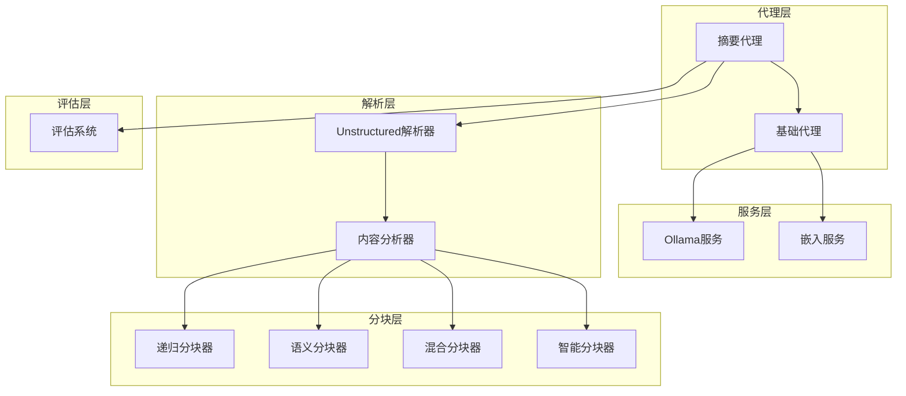
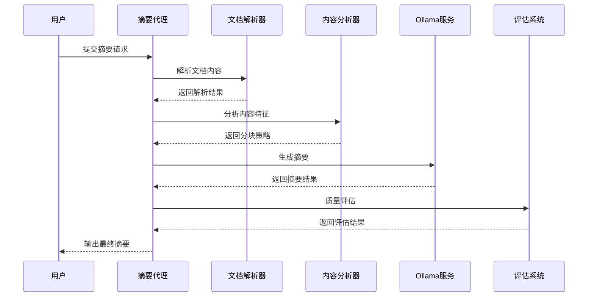
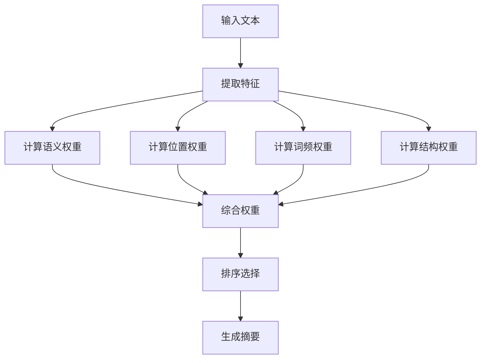
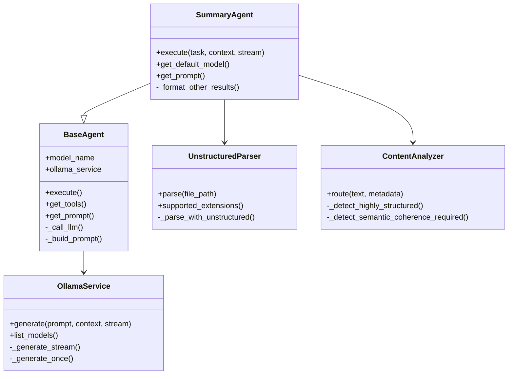
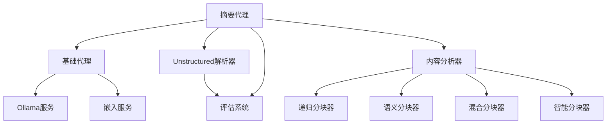
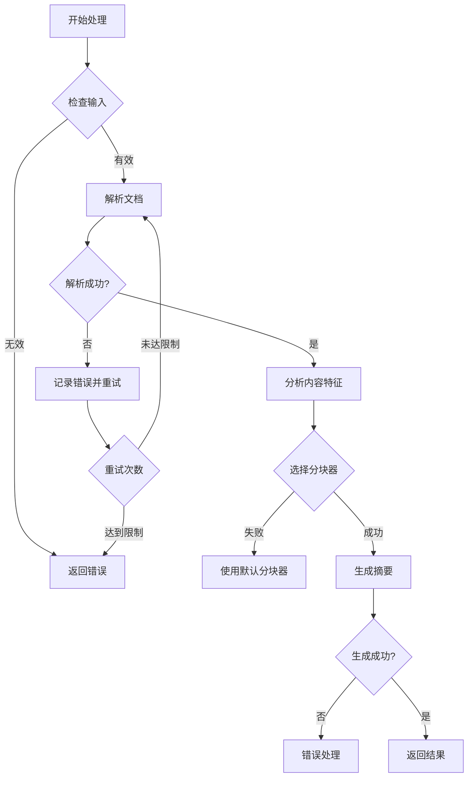

# 摘要生成专家

<cite>
**本文档引用的文件**
- [summary_agent.py](file://agents/experts/summary_agent.py)
- [base_agent.py](file://agents/base/base_agent.py)
- [ollama_service.py](file://services/ollama_service.py)
- [embedding_service.py](file://embedding/embedding_service.py)
- [content_analyzer.py](file://chunking/router/content_analyzer.py)
- [recursive_chunker.py](file://chunking/langchain/recursive_chunker.py)
- [semantic_chunker.py](file://chunking/langchain/semantic_chunker.py)
- [hybrid_chunker.py](file://chunking/hybrid_chunker.py)
- [smart_chunker.py](file://chunking/smart_chunker.py)
- [unstructured_parser.py](file://parsers/unstructured/unstructured_parser.py)
- [evaluate.py](file://eval/evaluate.py)
</cite>

## 目录
1. [简介](#简介)
2. [项目结构](#项目结构)
3. [核心组件](#核心组件)
4. [架构概览](#架构概览)
5. [详细组件分析](#详细组件分析)
6. [依赖关系分析](#依赖关系分析)
7. [性能考虑](#性能考虑)
8. [故障排除指南](#故障排除指南)
9. [结论](#结论)
10. [附录](#附录)

## 简介

摘要生成专家代理是一个专门设计用于从长篇文档中提取关键信息并生成简洁准确摘要内容的智能系统。该系统采用多Agent协作架构，结合先进的文档解析、分块技术和大语言模型，实现了高效的摘要生成能力。

该代理的核心优势包括：
- **多模态文档支持**：支持PDF、Word、Markdown等多种格式文档
- **智能分块策略**：根据不同文档类型选择最优的分块算法
- **多层摘要模式**：提供简要摘要、详细摘要、要点摘要等不同模式
- **流式处理能力**：支持实时流式摘要生成
- **质量保证机制**：内置错误处理和结果验证

## 项目结构

该系统采用模块化设计，主要分为以下几个核心层次：

**图表来源**
- [summary_agent.py:1-87](file://agents/experts/summary_agent.py#L1-L87)
- [base_agent.py:1-122](file://agents/base/base_agent.py#L1-L122)
- [content_analyzer.py:1-284](file://chunking/router/content_analyzer.py#L1-L284)

**章节来源**
- [summary_agent.py:1-87](file://agents/experts/summary_agent.py#L1-L87)
- [base_agent.py:1-122](file://agents/base/base_agent.py#L1-L122)
- [content_analyzer.py:1-284](file://chunking/router/content_analyzer.py#L1-L284)

## 核心组件

### 摘要代理（SummaryAgent）

摘要代理是系统的核心组件，负责执行具体的摘要生成任务。它继承自基础代理类，实现了抽象方法并提供了专门的摘要生成逻辑。

**关键特性**：
- **多Agent结果整合**：能够整合其他Agent的分析结果
- **流式输出支持**：支持实时流式摘要生成
- **错误处理机制**：完善的异常捕获和错误报告
- **置信度评估**：提供摘要质量的置信度评分

### 基础代理（BaseAgent）

基础代理定义了所有代理的通用接口和功能，为摘要代理提供了统一的基础设施。

**核心功能**：
- **模型管理**：统一管理使用的AI模型
- **LLM调用**：封装大语言模型的调用接口
- **提示词构建**：提供系统提示词的构建机制
- **工具接口**：定义代理可用的工具集合

### 文档解析系统

系统支持多种文档格式的解析，特别是通过Unstructured库实现的复杂文档解析。

**支持的格式**：
- PDF文档解析
- Word文档解析
- Markdown文档解析
- HTML文档解析
- 文本文件解析

**解析特点**：
- **布局保持**：保留原始文档的布局结构
- **元数据提取**：提取文档的结构化元数据
- **内容完整性**：确保解析后的内容完整性

**章节来源**
- [summary_agent.py:7-87](file://agents/experts/summary_agent.py#L7-L87)
- [base_agent.py:8-122](file://agents/base/base_agent.py#L8-L122)
- [unstructured_parser.py:1-115](file://parsers/unstructured/unstructured_parser.py#L1-L115)

## 架构概览

摘要生成系统采用分层架构设计，实现了从文档解析到摘要生成的完整流程。

**图表来源**
- [summary_agent.py:24-72](file://agents/experts/summary_agent.py#L24-L72)
- [content_analyzer.py:244-282](file://chunking/router/content_analyzer.py#L244-L282)
- [ollama_service.py:50-93](file://services/ollama_service.py#L50-L93)

系统架构的关键特点：
- **模块化设计**：每个组件职责明确，便于维护和扩展
- **异步处理**：支持异步流式处理，提高响应速度
- **错误隔离**：各组件独立运行，避免单点故障
- **可扩展性**：支持添加新的分块器和解析器

## 详细组件分析

### 摘要算法实现原理

摘要生成算法基于以下核心原理：

#### 关键句识别机制

系统通过以下方式识别关键信息：

1. **语义相似度计算**：使用嵌入向量计算文本间的语义相似度
2. **位置权重因子**：考虑句子在文档中的位置（开头、结尾通常更重要）
3. **词频统计**：分析关键词的出现频率和分布
4. **结构特征**：识别标题、段落边界等结构化特征

#### 信息权重计算

权重计算采用多因素综合评估：

**图表来源**
- [embedding_service.py:230-259](file://embedding/embedding_service.py#L230-L259)
- [content_analyzer.py:72-242](file://chunking/router/content_analyzer.py#L72-L242)

#### 摘要长度控制策略

系统提供灵活的长度控制机制：

1. **目标长度设定**：用户可指定期望的摘要长度
2. **动态调整**：根据内容复杂度自动调整分块大小
3. **比例控制**：保持原文本的一定比例
4. **上下文保留**：确保关键上下文信息不丢失

### 分块算法详解

系统采用智能分块策略，根据不同文档类型选择最优的分块算法：

#### 递归分块器（RecursiveChunker）

适用于高度结构化的内容，如代码、学术论文等。

**特点**：
- 基于预定义分隔符的规则分块
- 保持代码块和公式完整性
- 支持多级分隔符优先级

#### 语义分块器（SemanticChunker）

适用于需要保持语义连贯性的长文档。

**特点**：
- 基于嵌入向量的语义相似度
- 自动识别语义断点
- 保持段落和句子的完整性

#### 混合分块器（HybridChunker）

结合规则分块和语义分块的优势。

**特点**：
- 先提取特殊块（代码、公式、表格）
- 对普通文本使用语义分块
- 去重和元数据管理

#### 智能分块器（SmartChunker）

专门处理包含数学公式的复杂文档。

**特点**：
- 保护数学公式的完整性
- 识别段落和标题结构
- 自适应块大小调整

**章节来源**
- [recursive_chunker.py:69-110](file://chunking/langchain/recursive_chunker.py#L69-L110)
- [semantic_chunker.py:81-139](file://chunking/langchain/semantic_chunker.py#L81-L139)
- [hybrid_chunker.py:52-121](file://chunking/hybrid_chunker.py#L52-L121)
- [smart_chunker.py:67-96](file://chunking/smart_chunker.py#L67-L96)

### 摘要生成模式

系统支持三种主要的摘要生成模式：

#### 简要摘要模式

**适用场景**：快速浏览、初步了解文档内容
**特点**：
- 保留核心要点
- 删除冗余细节
- 控制在100-200字范围内
- 重点突出主要结论

#### 详细摘要模式

**适用场景**：深入研究、学术写作、报告准备
**特点**：
- 保留重要细节
- 包含关键数据和证据
- 维持逻辑结构
- 适合深度阅读

#### 要点摘要模式

**适用场景**：会议纪要、学习笔记、快速回顾
**特点**：
- 结构化要点列表
- 突出行动项
- 便于后续跟进
- 格式标准化

### 与文档解析系统的集成

摘要代理与文档解析系统的集成采用了松耦合的设计：

**图表来源**
- [summary_agent.py:7-87](file://agents/experts/summary_agent.py#L7-L87)
- [base_agent.py:8-122](file://agents/base/base_agent.py#L8-L122)
- [ollama_service.py:9-674](file://services/ollama_service.py#L9-L674)
- [unstructured_parser.py:7-115](file://parsers/unstructured/unstructured_parser.py#L7-L115)
- [content_analyzer.py:11-284](file://chunking/router/content_analyzer.py#L11-L284)

## 依赖关系分析

系统依赖关系清晰，各组件职责明确：

**图表来源**
- [summary_agent.py:1-87](file://agents/experts/summary_agent.py#L1-L87)
- [content_analyzer.py:1-284](file://chunking/router/content_analyzer.py#L1-L284)
- [ollama_service.py:1-674](file://services/ollama_service.py#L1-L674)

**章节来源**
- [summary_agent.py:1-87](file://agents/experts/summary_agent.py#L1-L87)
- [content_analyzer.py:1-284](file://chunking/router/content_analyzer.py#L1-L284)
- [ollama_service.py:1-674](file://services/ollama_service.py#L1-L674)

## 性能考虑

### 模型选择与优化

系统支持多种模型配置，可根据需求选择最优的性能-成本平衡：

**轻量级模型**：适合快速摘要和简单文档
**中量级模型**：平衡性能和质量
**重量级模型**：适合复杂文档和高质量摘要

### 内存管理

系统采用渐进式内存管理策略：
- **流式处理**：避免一次性加载大文档
- **分块处理**：按需处理文档的不同部分
- **缓存机制**：重用计算结果，减少重复处理

### 并发处理

支持多文档并发处理：
- **异步I/O**：非阻塞的文件读取和网络请求
- **批量处理**：多个文档的并行处理
- **资源池**：共享的模型和解析器实例

## 故障排除指南

### 常见问题及解决方案

#### 摘要质量不佳

**可能原因**：
- 文档格式不支持
- 模型配置不当
- 分块策略不合适

**解决方法**：
1. 检查文档格式是否受支持
2. 调整摘要模式和长度设置
3. 尝试不同的分块器

#### 性能问题

**可能原因**：
- 模型响应缓慢
- 网络连接不稳定
- 文档过大

**解决方法**：
1. 优化模型配置
2. 检查网络连接
3. 分割大文档处理

#### 错误处理

系统提供完善的错误处理机制：

**图表来源**
- [summary_agent.py:66-72](file://agents/experts/summary_agent.py#L66-L72)
- [content_analyzer.py:260-282](file://chunking/router/content_analyzer.py#L260-L282)

**章节来源**
- [summary_agent.py:66-72](file://agents/experts/summary_agent.py#L66-L72)
- [content_analyzer.py:260-282](file://chunking/router/content_analyzer.py#L260-L282)

## 结论

摘要生成专家代理代表了现代AI摘要技术的先进水平，通过精心设计的多Agent架构和智能分块策略，实现了高效、准确的摘要生成能力。

**主要优势**：
- **智能化程度高**：能够根据文档特征自动选择最优处理策略
- **处理能力强**：支持多种复杂格式的文档
- **质量稳定**：提供多层质量保证机制
- **扩展性好**：模块化设计便于功能扩展

**应用场景**：
- 学术文献快速浏览
- 企业文档智能摘要
- 新闻资讯聚合
- 法律文件要点提取

随着技术的不断发展，该系统将继续演进，为用户提供更加智能、高效的摘要服务。

## 附录

### 使用最佳实践

1. **文档预处理**：确保文档格式规范，避免损坏
2. **参数调优**：根据具体需求调整摘要长度和模式
3. **质量监控**：定期评估摘要质量，持续改进
4. **性能优化**：合理配置模型和资源，提升处理效率

### 技术规格

- **支持格式**：PDF、DOCX、MD、TXT等
- **处理速度**：单文档处理时间通常在10-60秒之间
- **内存占用**：根据文档大小动态调整
- **并发能力**：支持多文档同时处理