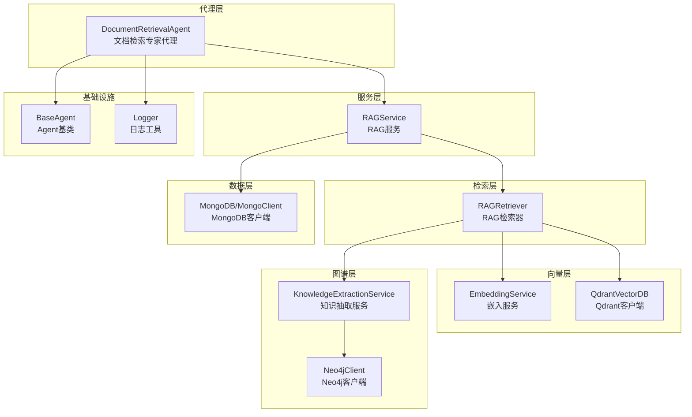
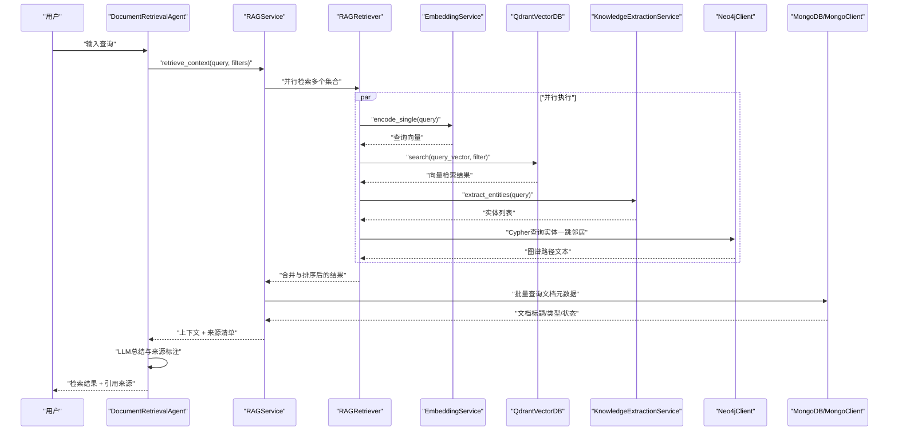
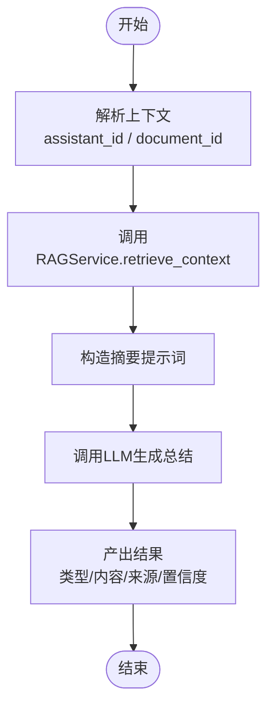
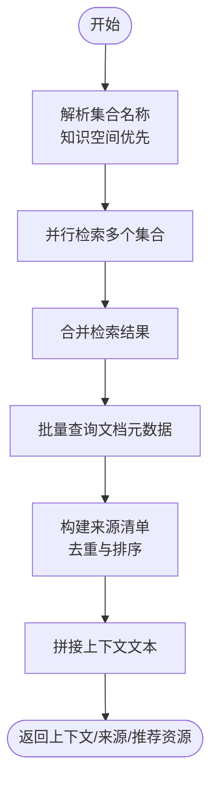
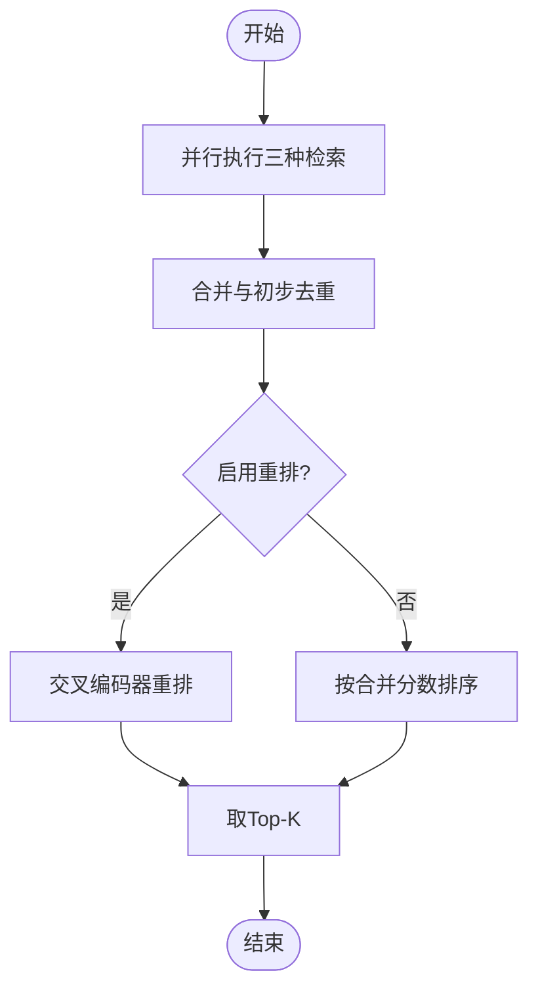
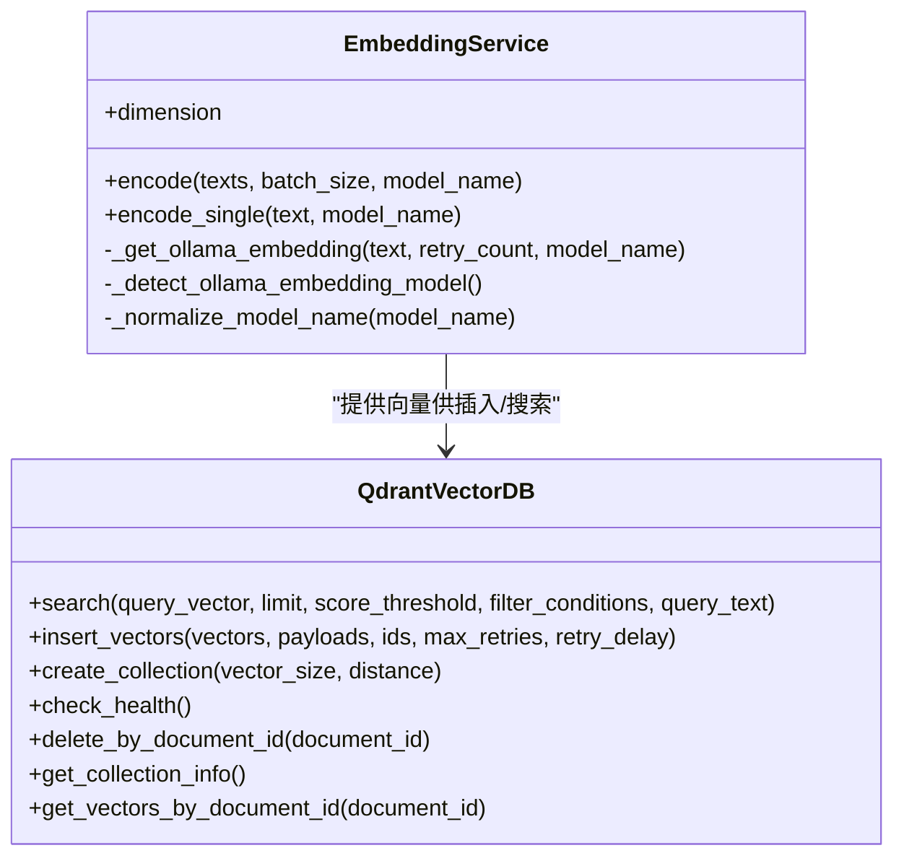
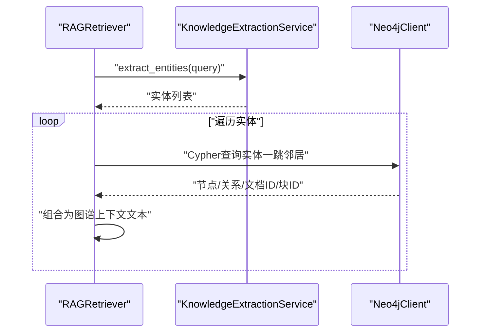
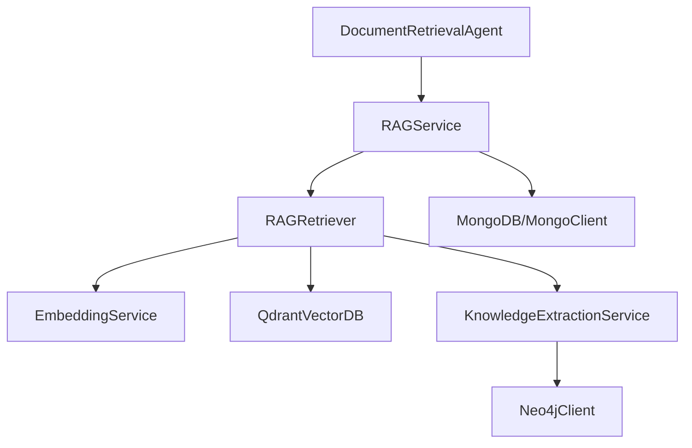

# 文档检索专家

<cite>
**本文引用的文件**
- [document_retrieval_agent.py](file://agents/experts/document_retrieval_agent.py)
- [rag_retriever.py](file://retrieval/rag_retriever.py)
- [rag_service.py](file://services/rag_service.py)
- [embedding_service.py](file://embedding/embedding_service.py)
- [qdrant_client.py](file://database/qdrant_client.py)
- [mongodb.py](file://database/mongodb.py)
- [neo4j_client.py](file://database/neo4j_client.py)
- [knowledge_extraction_service.py](file://services/knowledge_extraction_service.py)
- [base_agent.py](file://agents/base/base_agent.py)
- [logger.py](file://utils/logger.py)
- [README.md](file://README.md)
</cite>

## 目录
1. [简介](#简介)
2. [项目结构](#项目结构)
3. [核心组件](#核心组件)
4. [架构总览](#架构总览)
5. [详细组件分析](#详细组件分析)
6. [依赖分析](#依赖分析)
7. [性能考量](#性能考量)
8. [故障排查指南](#故障排查指南)
9. [结论](#结论)
10. [附录](#附录)

## 简介
文档检索专家代理是高级RAG系统中的关键组件，负责根据用户查询自动检索相关文档，提供精确的文献引用与上下文信息。其核心能力包括：
- 多路检索：向量检索、关键词检索、图谱检索的混合策略
- 相似度计算与结果排序：基于向量相似度、关键词匹配强度与图谱路径质量
- 结果重排：可选的交叉编码器重排提升相关性
- 与RAG系统的无缝集成：统一的检索服务封装与上下文构建
- LLM辅助总结：对检索结果进行摘要与来源标注，便于下游生成

## 项目结构
围绕文档检索专家代理，系统主要由以下层次构成：
- 代理层：文档检索专家代理继承通用Agent基类，负责调用RAG服务并进行最终总结
- 服务层：RAG服务封装检索流程，聚合多集合检索结果并构建上下文与来源
- 检索层：RAG检索器实现混合检索策略，整合向量、关键词与图谱结果
- 向量层：嵌入服务与Qdrant客户端提供向量化与相似度检索
- 图谱层：Neo4j客户端与知识抽取服务提供实体与关系抽取
- 数据层：MongoDB提供文档与分块元数据存储
- 基类与工具：Agent基类提供统一的提示词构建与LLM调用能力，日志工具保障可观测性

**图表来源**
- [document_retrieval_agent.py:1-79](file://agents/experts/document_retrieval_agent.py#L1-L79)
- [rag_service.py:1-248](file://services/rag_service.py#L1-L248)
- [rag_retriever.py:1-325](file://retrieval/rag_retriever.py#L1-L325)
- [embedding_service.py:1-278](file://embedding/embedding_service.py#L1-L278)
- [qdrant_client.py:1-544](file://database/qdrant_client.py#L1-L544)
- [knowledge_extraction_service.py:1-211](file://services/knowledge_extraction_service.py#L1-L211)
- [neo4j_client.py:1-104](file://database/neo4j_client.py#L1-L104)
- [mongodb.py:1-800](file://database/mongodb.py#L1-L800)
- [base_agent.py:1-122](file://agents/base/base_agent.py#L1-L122)
- [logger.py:1-88](file://utils/logger.py#L1-L88)

**章节来源**
- [README.md:1-290](file://README.md#L1-L290)

## 核心组件
- 文档检索专家代理：负责接收用户查询，调用RAG服务获取上下文与来源，再通过LLM对检索结果进行总结与标注
- RAG服务：统一检索入口，支持多知识空间集合并行检索，构建上下文与来源清单
- RAG检索器：实现混合检索策略，包含向量检索、关键词检索、图谱检索与可选重排
- 嵌入服务与Qdrant客户端：提供向量化与向量相似度检索
- 知识抽取服务与Neo4j客户端：抽取查询实体并构建图谱路径，增强检索相关性
- MongoDB客户端：提供文档与分块元数据的读取与批量查询
- Agent基类与日志工具：提供统一的提示词构建、LLM调用与日志记录能力

**章节来源**
- [document_retrieval_agent.py:1-79](file://agents/experts/document_retrieval_agent.py#L1-L79)
- [rag_service.py:1-248](file://services/rag_service.py#L1-L248)
- [rag_retriever.py:1-325](file://retrieval/rag_retriever.py#L1-L325)
- [embedding_service.py:1-278](file://embedding/embedding_service.py#L1-L278)
- [qdrant_client.py:1-544](file://database/qdrant_client.py#L1-L544)
- [knowledge_extraction_service.py:1-211](file://services/knowledge_extraction_service.py#L1-L211)
- [neo4j_client.py:1-104](file://database/neo4j_client.py#L1-L104)
- [mongodb.py:1-800](file://database/mongodb.py#L1-L800)
- [base_agent.py:1-122](file://agents/base/base_agent.py#L1-L122)
- [logger.py:1-88](file://utils/logger.py#L1-L88)

## 架构总览
文档检索专家代理的端到端工作流如下：

**图表来源**
- [document_retrieval_agent.py:25-79](file://agents/experts/document_retrieval_agent.py#L25-L79)
- [rag_service.py:64-191](file://services/rag_service.py#L64-L191)
- [rag_retriever.py:69-101](file://retrieval/rag_retriever.py#L69-L101)
- [embedding_service.py:261-263](file://embedding/embedding_service.py#L261-L263)
- [qdrant_client.py:336-414](file://database/qdrant_client.py#L336-L414)
- [knowledge_extraction_service.py:104-142](file://services/knowledge_extraction_service.py#L104-L142)
- [neo4j_client.py:40-62](file://database/neo4j_client.py#L40-L62)
- [mongodb.py:315-525](file://database/mongodb.py#L315-L525)

## 详细组件分析

### 文档检索专家代理
- 角色与职责：接收用户查询，调用RAG服务获取上下文与来源，使用LLM对检索结果进行总结与标注，输出包含置信度与原始上下文的结构化结果
- 关键流程：
  - 解析上下文中的助手ID与文档ID过滤条件
  - 调用RAG服务检索上下文与来源
  - 构造摘要提示词，调用LLM生成总结
  - 产出标准化结果（类型、内容、来源、推荐资源、置信度、原始上下文）

**图表来源**
- [document_retrieval_agent.py:25-79](file://agents/experts/document_retrieval_agent.py#L25-L79)

**章节来源**
- [document_retrieval_agent.py:1-79](file://agents/experts/document_retrieval_agent.py#L1-L79)
- [base_agent.py:75-98](file://agents/base/base_agent.py#L75-L98)

### RAG服务
- 角色与职责：统一检索入口，支持多知识空间集合并行检索，构建上下文与来源清单，处理文档元数据与去重
- 关键流程：
  - 解析知识空间集合名称，兼容旧版助手集合名称
  - 并行检索多个集合，合并结果
  - 批量查询文档元数据，构建来源清单并按分数排序
  - 产出上下文、来源与推荐资源（预留字段）

**图表来源**
- [rag_service.py:34-191](file://services/rag_service.py#L34-L191)

**章节来源**
- [rag_service.py:1-248](file://services/rag_service.py#L1-L248)

### RAG检索器（混合检索）
- 角色与职责：实现混合检索策略，包含向量检索、关键词检索、图谱检索与可选重排
- 关键流程：
  - 并行执行向量检索、关键词检索、图谱检索
  - 合并结果：向量结果作为基础，关键词结果进行分数增强，图谱结果作为补充
  - 可选重排：使用交叉编码器对合并结果进行重排
  - 返回Top-K结果

**图表来源**
- [rag_retriever.py:69-101](file://retrieval/rag_retriever.py#L69-L101)
- [rag_retriever.py:262-297](file://retrieval/rag_retriever.py#L262-L297)
- [rag_retriever.py:299-324](file://retrieval/rag_retriever.py#L299-L324)

**章节来源**
- [rag_retriever.py:1-325](file://retrieval/rag_retriever.py#L1-L325)

### 向量检索与嵌入服务
- 嵌入服务：封装Ollama嵌入模型调用，支持模型名称规范化、自动检测、超时与重试、文本截断
- Qdrant客户端：封装Qdrant向量数据库，支持gRPC连接、集合创建与维度校验、向量插入与搜索、过滤与自动创建集合

**图表来源**
- [embedding_service.py:1-278](file://embedding/embedding_service.py#L1-L278)
- [qdrant_client.py:1-544](file://database/qdrant_client.py#L1-L544)

**章节来源**
- [embedding_service.py:1-278](file://embedding/embedding_service.py#L1-L278)
- [qdrant_client.py:1-544](file://database/qdrant_client.py#L1-L544)

### 图谱检索与知识抽取
- 知识抽取服务：从查询中提取实体，使用Ollama抽取三元组并构建Neo4j图谱
- Neo4j客户端：提供连接、查询、创建实体与关系的能力

**图表来源**
- [rag_retriever.py:176-260](file://retrieval/rag_retriever.py#L176-L260)
- [knowledge_extraction_service.py:104-142](file://services/knowledge_extraction_service.py#L104-L142)
- [neo4j_client.py:40-101](file://database/neo4j_client.py#L40-L101)

**章节来源**
- [knowledge_extraction_service.py:1-211](file://services/knowledge_extraction_service.py#L1-L211)
- [neo4j_client.py:1-104](file://database/neo4j_client.py#L1-L104)

### 关键词检索策略
- 仅在指定文档ID过滤时执行关键词匹配，避免全局全量扫描
- 基于查询词与块文本的交集计算匹配分数，设定最小阈值后排序返回Top-K

**章节来源**
- [rag_retriever.py:140-175](file://retrieval/rag_retriever.py#L140-L175)

### 相似度计算与结果排序
- 向量检索：使用Qdrant相似度搜索，支持分数阈值与过滤条件
- 关键词检索：基于查询词与块文本的交集大小计算匹配分数
- 图谱检索：以图谱路径文本作为上下文，赋予较高初始分数
- 合并与排序：向量结果为基础，关键词结果进行分数增强，图谱结果独立加入，最终按合并分数排序

**章节来源**
- [rag_retriever.py:110-139](file://retrieval/rag_retriever.py#L110-L139)
- [rag_retriever.py:140-175](file://retrieval/rag_retriever.py#L140-L175)
- [rag_retriever.py:262-297](file://retrieval/rag_retriever.py#L262-L297)

### 与RAG系统的集成方式
- 文档检索专家代理通过RAG服务统一入口调用，支持多知识空间集合并行检索
- RAG服务负责：
  - 解析知识空间集合名称
  - 并行检索多个集合
  - 批量查询文档元数据，构建来源清单
  - 产出上下文与来源

**章节来源**
- [document_retrieval_agent.py:38-69](file://agents/experts/document_retrieval_agent.py#L38-L69)
- [rag_service.py:64-191](file://services/rag_service.py#L64-L191)

## 依赖分析
- 组件耦合与内聚：
  - 文档检索专家代理与RAG服务强耦合，依赖其检索结果与上下文
  - RAG检索器内部并行依赖嵌入服务、Qdrant客户端、知识抽取服务与Neo4j客户端
  - 知识抽取服务与Neo4j客户端存在双向交互（抽取实体与查询图谱）
  - RAG服务依赖MongoDB客户端进行文档元数据查询
- 外部依赖：
  - Ollama（嵌入与生成）
  - Qdrant（向量数据库）
  - Neo4j（知识图谱）
  - MongoDB（文档与分块元数据）

**图表来源**
- [document_retrieval_agent.py:1-79](file://agents/experts/document_retrieval_agent.py#L1-L79)
- [rag_service.py:1-248](file://services/rag_service.py#L1-L248)
- [rag_retriever.py:1-325](file://retrieval/rag_retriever.py#L1-L325)
- [embedding_service.py:1-278](file://embedding/embedding_service.py#L1-L278)
- [qdrant_client.py:1-544](file://database/qdrant_client.py#L1-L544)
- [knowledge_extraction_service.py:1-211](file://services/knowledge_extraction_service.py#L1-L211)
- [neo4j_client.py:1-104](file://database/neo4j_client.py#L1-L104)
- [mongodb.py:1-800](file://database/mongodb.py#L1-L800)

**章节来源**
- [document_retrieval_agent.py:1-79](file://agents/experts/document_retrieval_agent.py#L1-L79)
- [rag_service.py:1-248](file://services/rag_service.py#L1-L248)
- [rag_retriever.py:1-325](file://retrieval/rag_retriever.py#L1-L325)

## 性能考量
- 并行检索：RAG检索器对向量、关键词、图谱检索采用并行执行，显著降低端到端延迟
- 过滤与限制：向量检索使用分数阈值与过滤条件，关键词检索在未指定文档ID时跳过，避免全库扫描
- 连接与超时：
  - Qdrant优先使用gRPC连接，支持连接复用与超时配置
  - 嵌入服务提供超时与重试机制，文本截断避免过长输入导致的错误
- 批量查询：RAG服务对文档元数据进行批量查询，减少多次往返
- 可选重排：重排器可选禁用，避免额外的交叉编码器计算开销

**章节来源**
- [rag_retriever.py:82-89](file://retrieval/rag_retriever.py#L82-L89)
- [rag_retriever.py:110-139](file://retrieval/rag_retriever.py#L110-L139)
- [qdrant_client.py:66-96](file://database/qdrant_client.py#L66-L96)
- [embedding_service.py:175-229](file://embedding/embedding_service.py#L175-L229)
- [rag_service.py:101-132](file://services/rag_service.py#L101-L132)

## 故障排查指南
- 向量检索失败：检查Qdrant连接与集合维度，确认向量维度与集合配置一致
- 嵌入服务异常：确认Ollama服务可达，模型名称正确，必要时进行模型规范化与自动检测
- 图谱检索失败：检查Neo4j连接与Cypher查询语法，确认实体存在与一跳邻居查询
- 关键词检索性能差：确保提供文档ID过滤，避免全局全量扫描
- 日志定位：使用统一日志工具记录详细错误信息，便于定位问题

**章节来源**
- [qdrant_client.py:336-414](file://database/qdrant_client.py#L336-L414)
- [embedding_service.py:175-229](file://embedding/embedding_service.py#L175-L229)
- [knowledge_extraction_service.py:104-142](file://services/knowledge_extraction_service.py#L104-L142)
- [logger.py:1-88](file://utils/logger.py#L1-L88)

## 结论
文档检索专家代理通过与RAG服务的紧密集成，实现了多路检索、精准排序与LLM辅助总结的完整闭环。其混合检索策略兼顾了语义相关性与结构化信息，结合图谱增强与可选重排，能够有效提升检索质量与用户体验。在性能方面，通过并行检索、过滤限制与批量查询等手段，系统在保证准确性的同时具备良好的吞吐能力。

## 附录
- 配置选项与环境变量（节选）
  - Ollama相关：OLLAMA_BASE_URL、OLLAMA_MODEL、OLLAMA_EMBEDDING_MODEL、OLLAMA_TIMEOUT
  - Qdrant相关：QDRANT_URL、QDRANT_API_KEY、QDRANT_TIMEOUT、QDRANT_GRPC_PORT
  - MongoDB相关：MONGODB_URI、MONGODB_HOST、MONGODB_PORT、MONGODB_DB_NAME、连接池参数
  - Neo4j相关：NEO4J_URI、NEO4J_USER、NEO4J_PASSWORD
  - 日志相关：LOG_LEVEL、LOG_FILE
- 最佳实践
  - 明确知识空间与集合划分，合理使用文档ID过滤
  - 选择合适的top_k与score_threshold，平衡召回与精度
  - 在需要时启用重排，权衡性能与准确性
  - 监控嵌入与检索延迟，及时调整超时与重试策略

**章节来源**
- [README.md:125-167](file://README.md#L125-L167)