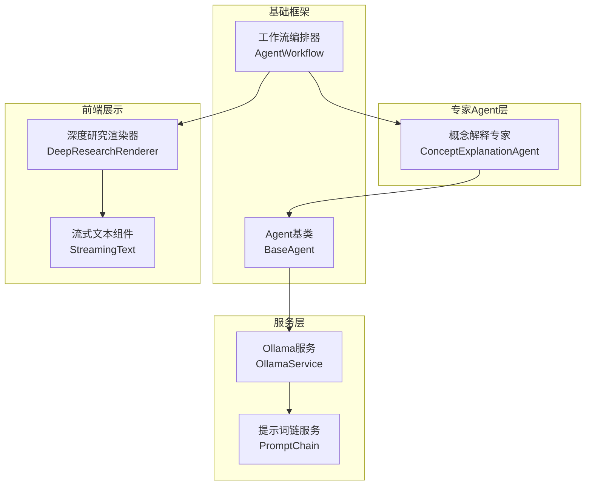
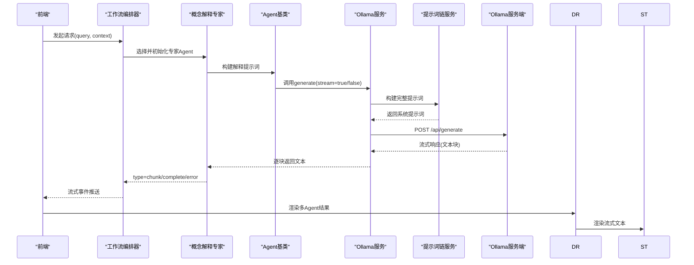
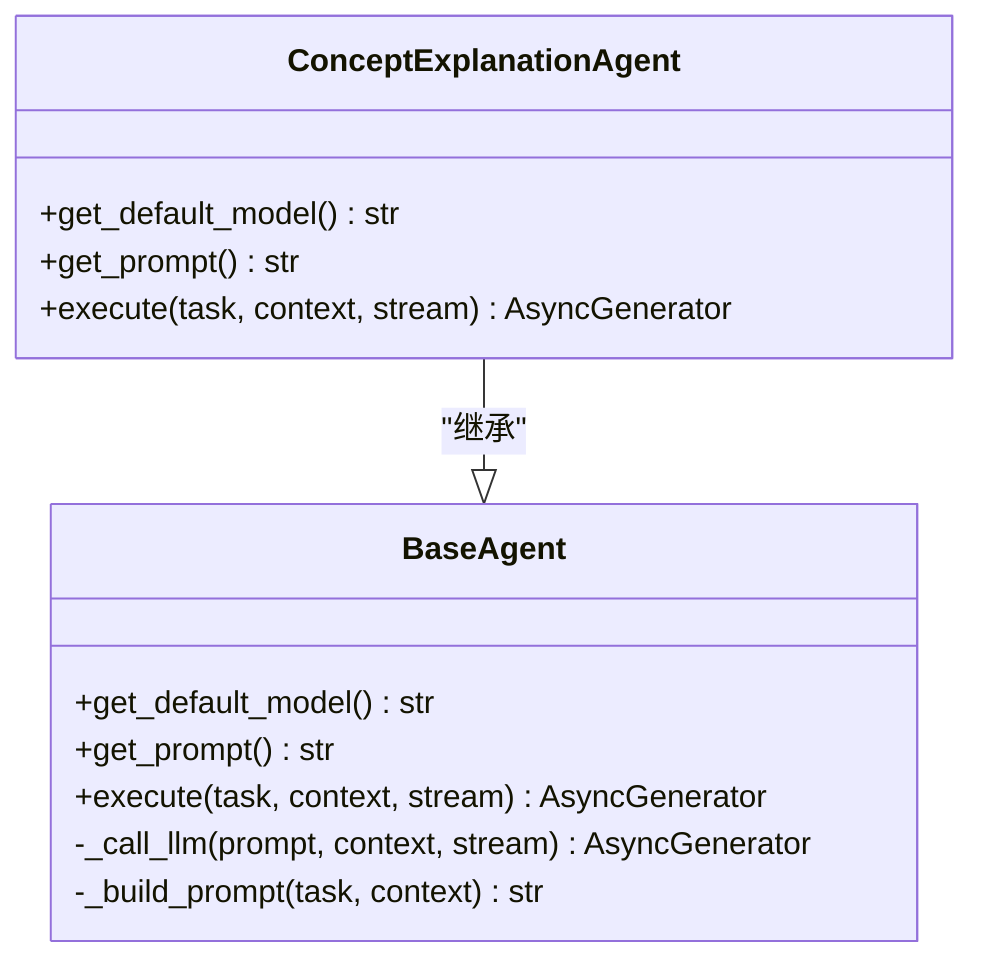
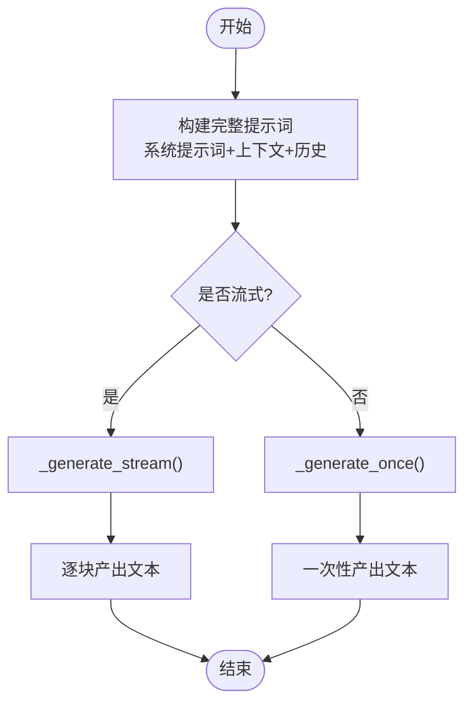
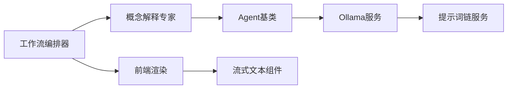

# 概念解释专家

<cite>
**本文引用的文件**
- [concept_explanation_agent.py](file://agents/experts/concept_explanation_agent.py)
- [base_agent.py](file://agents/base/base_agent.py)
- [ollama_service.py](file://services/ollama_service.py)
- [prompt_chain.py](file://services/prompt_chain.py)
- [agent_workflow.py](file://agents/workflow/agent_workflow.py)
- [assistants.py](file://routers/assistants.py)
- [DeepResearchRenderer.tsx](file://web/components/chat/DeepResearchRenderer.tsx)
- [StreamingText.tsx](file://web/components/message/StreamingText.tsx)
- [agent_config.py](file://models/agent_config.py)
</cite>

## 目录
1. [简介](#简介)
2. [项目结构](#项目结构)
3. [核心组件](#核心组件)
4. [架构总览](#架构总览)
5. [详细组件分析](#详细组件分析)
6. [依赖关系分析](#依赖关系分析)
7. [性能考量](#性能考量)
8. [故障排查指南](#故障排查指南)
9. [结论](#结论)
10. [附录](#附录)

## 简介
本文件面向“概念解释专家”代理，系统性阐述其核心功能、实现机制与使用实践。该代理专注于为用户提供专业概念的深入解释，包括概念定义、本质内涵、应用场景、相关示例与概念关系，并提供默认模型配置、系统提示词设计、任务执行流程与流式响应处理策略。文档还给出优化提示词设计的实践建议、错误处理与性能优化策略，帮助开发者与使用者高效、稳定地集成与使用该代理。

## 项目结构
概念解释专家位于专家型Agent子系统中，与基类Agent、Ollama服务、提示词链服务、工作流编排器、前端渲染组件协同工作，形成从任务规划到结果呈现的完整链路。

图表来源
- [concept_explanation_agent.py:1-70](file://agents/experts/concept_explanation_agent.py#L1-L70)
- [base_agent.py:1-122](file://agents/base/base_agent.py#L1-L122)
- [ollama_service.py:1-674](file://services/ollama_service.py#L1-L674)
- [prompt_chain.py:1-447](file://services/prompt_chain.py#L1-L447)
- [agent_workflow.py:1-388](file://agents/workflow/agent_workflow.py#L1-L388)
- [DeepResearchRenderer.tsx:1-177](file://web/components/chat/DeepResearchRenderer.tsx#L1-L177)
- [StreamingText.tsx:1-79](file://web/components/message/StreamingText.tsx#L1-L79)

章节来源
- [concept_explanation_agent.py:1-70](file://agents/experts/concept_explanation_agent.py#L1-L70)
- [base_agent.py:1-122](file://agents/base/base_agent.py#L1-L122)
- [agent_workflow.py:1-388](file://agents/workflow/agent_workflow.py#L1-L388)

## 核心组件
- 概念解释专家（ConceptExplanationAgent）：继承自BaseAgent，负责接收用户输入的概念问题，构造解释性提示词，调用Ollama服务生成解释内容，并以流式或非流式方式返回结果。
- Agent基类（BaseAgent）：定义Agent通用接口与生命周期，封装模型初始化、系统提示词获取、提示词构建与LLM调用的通用逻辑。
- Ollama服务（OllamaService）：封装对本地Ollama服务的HTTP调用，支持流式与非流式生成，内置超时控制、空闲超时检测、异常处理与工具函数调用处理。
- 提示词链服务（PromptChain）：提供基础提示词与助手特定提示词的叠加机制，确保通用能力与课程/场景定制的结合。
- 工作流编排器（AgentWorkflow）：协调多Agent协作，负责Agent选择、状态推进与结果聚合，支持流式事件推送。
- 前端渲染组件：DeepResearchRenderer与StreamingText分别负责多Agent结果的结构化渲染与流式文本的光标动画与自动滚动。

章节来源
- [concept_explanation_agent.py:1-70](file://agents/experts/concept_explanation_agent.py#L1-L70)
- [base_agent.py:1-122](file://agents/base/base_agent.py#L1-L122)
- [ollama_service.py:1-674](file://services/ollama_service.py#L1-L674)
- [prompt_chain.py:1-447](file://services/prompt_chain.py#L1-L447)
- [agent_workflow.py:1-388](file://agents/workflow/agent_workflow.py#L1-L388)
- [DeepResearchRenderer.tsx:1-177](file://web/components/chat/DeepResearchRenderer.tsx#L1-L177)
- [StreamingText.tsx:1-79](file://web/components/message/StreamingText.tsx#L1-L79)

## 架构总览
概念解释专家的执行路径如下：前端发起请求，工作流编排器根据上下文选择专家Agent，ConceptExplanationAgent构造解释提示词并调用OllamaService生成内容；OllamaService通过提示词链服务构建完整提示词，调用本地Ollama API；服务端以流式事件形式回传“chunk”、“complete”、“error”等状态；前端组件接收并渲染。

图表来源
- [agent_workflow.py:106-336](file://agents/workflow/agent_workflow.py#L106-L336)
- [concept_explanation_agent.py:25-68](file://agents/experts/concept_explanation_agent.py#L25-L68)
- [base_agent.py:75-121](file://agents/base/base_agent.py#L75-L121)
- [ollama_service.py:50-93](file://services/ollama_service.py#L50-L93)
- [prompt_chain.py:382-428](file://services/prompt_chain.py#L382-L428)
- [DeepResearchRenderer.tsx:114-175](file://web/components/chat/DeepResearchRenderer.tsx#L114-L175)
- [StreamingText.tsx:16-45](file://web/components/message/StreamingText.tsx#L16-L45)

## 详细组件分析

### 概念解释专家（ConceptExplanationAgent）
- 默认模型配置：gpt-oss:20b，用于高精度概念解释。
- 系统提示词设计：强调“定义、本质、应用场景、示例与类比、概念关系”的五维解释框架。
- 任务执行流程：
  - 构造解释性提示词（包含问题与五要素要求）。
  - 调用基类的内部生成方法，支持流式与非流式。
  - 流式模式下，逐块产出“chunk”事件；完成后产出“complete”事件并附带置信度。
  - 异常时产出“error”事件，便于前端与后端统一处理。
- 输出结构：包含类型、内容、Agent类型与置信度等字段，便于前端渲染与状态管理。

图表来源
- [base_agent.py:8-121](file://agents/base/base_agent.py#L8-L121)
- [concept_explanation_agent.py:7-68](file://agents/experts/concept_explanation_agent.py#L7-L68)

章节来源
- [concept_explanation_agent.py:1-70](file://agents/experts/concept_explanation_agent.py#L1-L70)
- [base_agent.py:1-122](file://agents/base/base_agent.py#L1-L122)

### Agent基类（BaseAgent）
- 职责：统一Agent初始化、模型选择、系统提示词与提示词构建、LLM调用封装。
- 关键方法：
  - get_default_model：返回默认模型名称。
  - get_prompt：返回系统提示词（可由子类覆盖）。
  - _call_llm：委托OllamaService进行生成，支持流式。
  - _build_prompt：拼接系统提示词与上下文，形成完整提示词。

章节来源
- [base_agent.py:1-122](file://agents/base/base_agent.py#L1-L122)

### Ollama服务（OllamaService）
- 职责：封装对Ollama的HTTP调用，支持流式与非流式生成，内置超时与空闲检测、异常处理与工具函数调用处理。
- 提示词构建：通过提示词链服务获取基础提示词，结合知识库状态、文档信息、上下文与对话历史，最终形成完整提示词。
- 流式生成：使用线程池与队列在异步环境中安全消费流式响应，支持最大空闲时间与总超时控制。
- 工具函数调用：识别XML格式的工具调用，动态执行并把结果注入提示词，确保系统信息的实时性。

图表来源
- [ollama_service.py:50-93](file://services/ollama_service.py#L50-L93)
- [ollama_service.py:453-637](file://services/ollama_service.py#L453-L637)
- [ollama_service.py:639-670](file://services/ollama_service.py#L639-L670)

章节来源
- [ollama_service.py:1-674](file://services/ollama_service.py#L1-L674)

### 提示词链服务（PromptChain）
- 职责：提供基础提示词与助手特定提示词的叠加机制，确保通用能力与课程/场景定制的结合。
- 基础提示词来源：优先从数据库读取，若不存在则使用默认基础提示词，包含角色定位、职责范围、回答原则、格式要求、工具函数使用、特殊场景处理等。
- 助手特定提示词：作为扩展追加到基础提示词之后，支持完整系统提示词或扩展片段两种形态。
- 工具函数描述：动态生成工具函数列表及其参数说明，增强Agent对系统信息的实时获取能力。

章节来源
- [prompt_chain.py:1-447](file://services/prompt_chain.py#L1-L447)

### 工作流编排器（AgentWorkflow）
- 职责：协调多Agent协作，负责Agent选择、状态推进与结果聚合，支持流式事件推送。
- Agent选择：从上下文或协调Agent规划结果中确定执行的专家Agent集合。
- 状态推进：在每个Agent执行期间，推送“agent_status”事件，包含状态、进度、当前步骤等信息。
- 结果聚合：收集各Agent的“complete”事件，汇总为最终结果。

章节来源
- [agent_workflow.py:1-388](file://agents/workflow/agent_workflow.py#L1-L388)

### 前端渲染组件
- DeepResearchRenderer：将多Agent结果按Agent类型分组渲染，支持HTML转Markdown，为不同Agent类型提供中文名称映射。
- StreamingText：优化流式文本渲染，减少重渲染、光标闪烁动画与自动滚动，提升用户体验。

章节来源
- [DeepResearchRenderer.tsx:1-177](file://web/components/chat/DeepResearchRenderer.tsx#L1-L177)
- [StreamingText.tsx:1-79](file://web/components/message/StreamingText.tsx#L1-L79)

## 依赖关系分析
- 概念解释专家依赖Agent基类提供的统一接口与提示词构建能力。
- Agent基类依赖Ollama服务进行LLM调用。
- Ollama服务依赖提示词链服务构建完整提示词。
- 工作流编排器协调多个Agent并推送流式事件。
- 前端组件依赖后端事件流进行渲染。

图表来源
- [concept_explanation_agent.py:1-70](file://agents/experts/concept_explanation_agent.py#L1-L70)
- [base_agent.py:1-122](file://agents/base/base_agent.py#L1-L122)
- [ollama_service.py:1-674](file://services/ollama_service.py#L1-L674)
- [prompt_chain.py:1-447](file://services/prompt_chain.py#L1-L447)
- [agent_workflow.py:1-388](file://agents/workflow/agent_workflow.py#L1-L388)
- [DeepResearchRenderer.tsx:1-177](file://web/components/chat/DeepResearchRenderer.tsx#L1-L177)
- [StreamingText.tsx:1-79](file://web/components/message/StreamingText.tsx#L1-L79)

章节来源
- [concept_explanation_agent.py:1-70](file://agents/experts/concept_explanation_agent.py#L1-L70)
- [base_agent.py:1-122](file://agents/base/base_agent.py#L1-L122)
- [ollama_service.py:1-674](file://services/ollama_service.py#L1-L674)
- [prompt_chain.py:1-447](file://services/prompt_chain.py#L1-L447)
- [agent_workflow.py:1-388](file://agents/workflow/agent_workflow.py#L1-L388)
- [DeepResearchRenderer.tsx:1-177](file://web/components/chat/DeepResearchRenderer.tsx#L1-L177)
- [StreamingText.tsx:1-79](file://web/components/message/StreamingText.tsx#L1-L79)

## 性能考量
- 流式生成与前端渲染：OllamaService采用线程池与队列在异步环境中消费流式响应，前端组件通过增量更新与光标动画优化用户体验，减少不必要的重渲染。
- 超时与空闲控制：服务端设置较长的总超时与空闲超时，适配大模型生成较长响应的特性，避免长时间阻塞。
- 提示词长度控制：提示词链服务会将上下文、历史与工具调用结果拼接，需注意控制上下文长度，避免超出模型上下文窗口。
- 模型选择：默认模型为gpt-oss:20b，具备较高解释质量，但响应时间相对较长；可根据场景切换更轻量模型以提升吞吐。

章节来源
- [ollama_service.py:32-34](file://services/ollama_service.py#L32-L34)
- [ollama_service.py:494-521](file://services/ollama_service.py#L494-L521)
- [StreamingText.tsx:26-45](file://web/components/message/StreamingText.tsx#L26-L45)
- [concept_explanation_agent.py:10-12](file://agents/experts/concept_explanation_agent.py#L10-L12)

## 故障排查指南
- 流式生成超时：检查Ollama服务可达性与模型加载状态，确认超时配置是否合理；前端可捕获“error”事件并提示用户重试。
- 提示词构建异常：确认提示词链服务可用，检查数据库中基础提示词与助手特定提示词配置。
- Agent执行失败：工作流编排器会推送“error”状态，可在前端显示错误详情并记录日志。
- 前端渲染问题：确认事件流中包含“chunk”与“complete”事件，检查DeepResearchRenderer与StreamingText的props传递。

章节来源
- [ollama_service.py:526-540](file://services/ollama_service.py#L526-L540)
- [agent_workflow.py:306-321](file://agents/workflow/agent_workflow.py#L306-L321)
- [concept_explanation_agent.py:62-68](file://agents/experts/concept_explanation_agent.py#L62-L68)
- [DeepResearchRenderer.tsx:114-175](file://web/components/chat/DeepResearchRenderer.tsx#L114-L175)

## 结论
概念解释专家通过明确的任务范式与稳健的服务链路，实现了高质量的专业概念解释。其默认模型与系统提示词设计确保了解释的完整性与准确性；工作流编排器与前端组件共同保障了交互体验与可观测性。遵循本文的最佳实践与优化建议，可进一步提升解释质量与系统稳定性。

## 附录

### 使用示例与最佳实践
- 提示词设计优化
  - 明确五要素：定义、本质、公式/定律、应用场景、示例与类比、概念关系。
  - 针对不同受众调整深度：初学者使用类比与分步解释，专业人士强调公式与推导。
  - 结合上下文与历史：利用提示词链服务整合检索知识与对话历史，提升解释一致性。
- 模型与配置
  - 默认模型：gpt-oss:20b，适合高精度解释；如需更高吞吐可切换更小模型。
  - Agent配置：通过数据库表“agent_configs”为不同Agent设置推理模型与嵌入模型。
- 错误处理与性能
  - 前端监听“error”事件并提示用户重试或联系支持。
  - 控制上下文长度，避免超出模型上下文窗口。
  - 合理设置超时与空闲阈值，平衡响应速度与生成质量。

章节来源
- [concept_explanation_agent.py:14-23](file://agents/experts/concept_explanation_agent.py#L14-L23)
- [agent_config.py:1-24](file://models/agent_config.py#L1-L24)
- [assistants.py:1-120](file://routers/assistants.py#L1-L120)