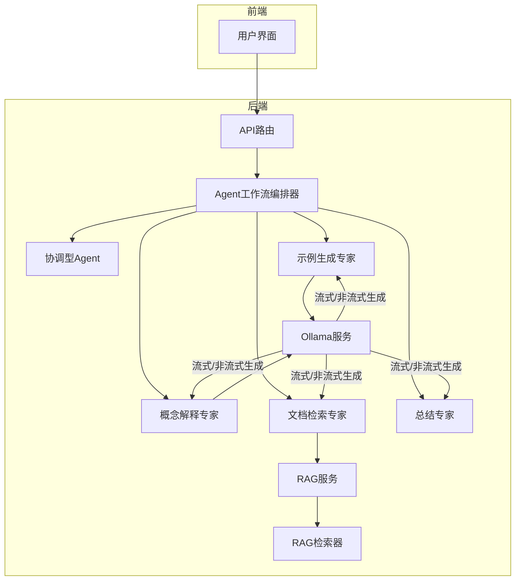
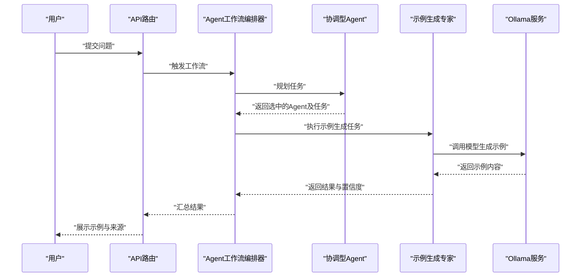
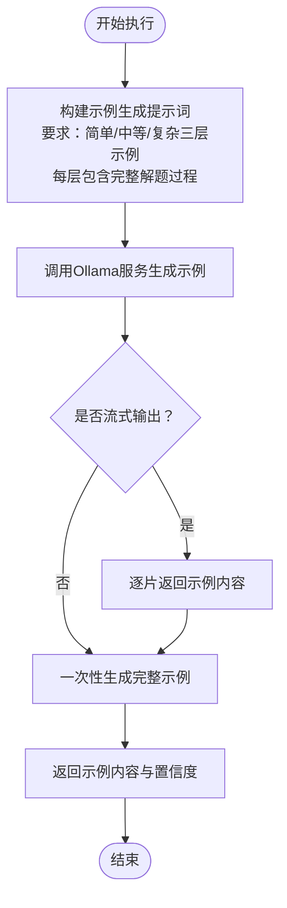
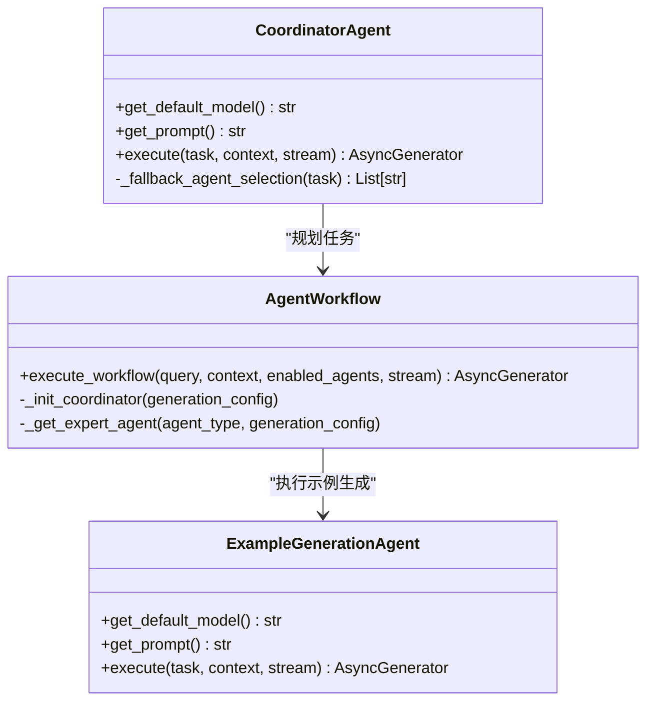
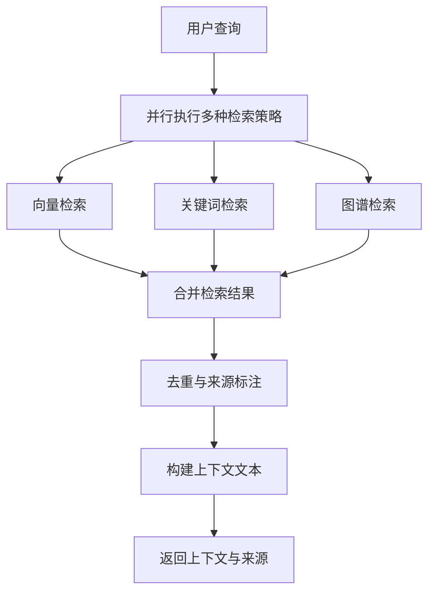
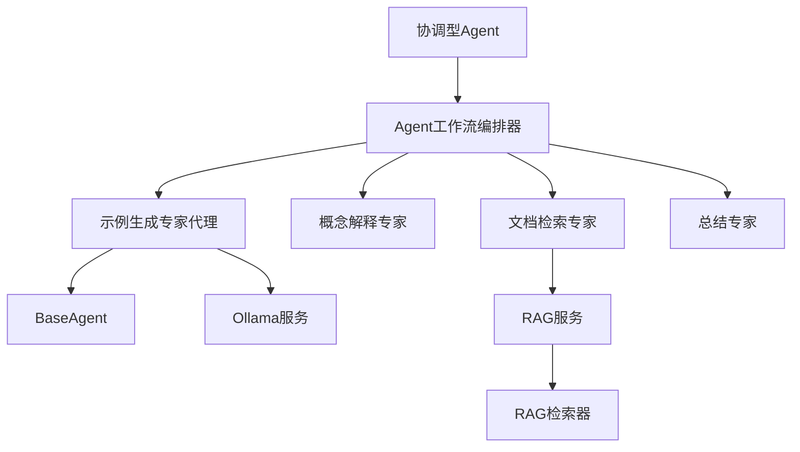

# 示例生成专家

<cite>
**本文档引用的文件**
- [agents/experts/example_generation_agent.py](file://agents/experts/example_generation_agent.py)
- [agents/coordinator/coordinator_agent.py](file://agents/coordinator/coordinator_agent.py)
- [agents/workflow/agent_workflow.py](file://agents/workflow/agent_workflow.py)
- [services/rag_service.py](file://services/rag_service.py)
- [retrieval/rag_retriever.py](file://retrieval/rag_retriever.py)
- [services/ollama_service.py](file://services/ollama_service.py)
- [agents/base/base_agent.py](file://agents/base/base_agent.py)
- [README.md](file://README.md)
</cite>

## 目录
1. [简介](#简介)
2. [项目结构](#项目结构)
3. [核心组件](#核心组件)
4. [架构概览](#架构概览)
5. [详细组件分析](#详细组件分析)
6. [依赖分析](#依赖分析)
7. [性能考虑](#性能考虑)
8. [故障排除指南](#故障排除指南)
9. [结论](#结论)
10. [附录](#附录)

## 简介
本文件面向"示例生成专家代理"的技术文档，聚焦于该代理在"根据理论概念生成具体示例、提供实践案例、演示应用场景"方面的实例生成能力。文档将详细解释示例设计原则、多样性保证机制、难度分级策略，以及如何针对不同学习水平生成合适的示例、与教学内容的匹配方法、交互式示例的生成流程。同时，提供在在线教育、技术培训、知识传播中的应用指南和最佳实践。

## 项目结构
该系统采用多Agent协作架构，示例生成专家代理位于专家Agent层，通过协调型Agent进行任务规划与分发，配合RAG检索与Ollama服务实现上下文增强与高效生成。

**图表来源**
- [agents/workflow/agent_workflow.py:47-388](file://agents/workflow/agent_workflow.py#L47-L388)
- [agents/coordinator/coordinator_agent.py:7-252](file://agents/coordinator/coordinator_agent.py#L7-L252)
- [agents/experts/example_generation_agent.py:7-68](file://agents/experts/example_generation_agent.py#L7-L68)
- [services/rag_service.py:7-248](file://services/rag_service.py#L7-L248)
- [retrieval/rag_retriever.py:22-325](file://retrieval/rag_retriever.py#L22-L325)
- [services/ollama_service.py:9-674](file://services/ollama_service.py#L9-L674)

**章节来源**
- [README.md:46-54](file://README.md#L46-L54)

## 核心组件
- 示例生成专家代理：专门负责根据理论问题生成实际应用示例，提供从简单到复杂的多层次示例，包含完整的解题过程说明。
- 协调型Agent：分析用户问题，智能选择需要的专家Agent组合，为每个Agent分配具体任务并说明选择理由。
- Agent工作流编排器：管理多Agent协作，顺序执行专家Agent，实时反馈执行状态与进度。
- RAG服务与检索器：提供向量检索、关键词检索、图谱检索与混合检索，支持上下文构建与来源标注。
- Ollama服务：封装模型调用，支持流式与非流式生成，具备工具函数调用与对话历史集成能力。

**章节来源**
- [agents/experts/example_generation_agent.py:7-68](file://agents/experts/example_generation_agent.py#L7-L68)
- [agents/coordinator/coordinator_agent.py:7-252](file://agents/coordinator/coordinator_agent.py#L7-L252)
- [agents/workflow/agent_workflow.py:47-388](file://agents/workflow/agent_workflow.py#L47-L388)
- [services/rag_service.py:7-248](file://services/rag_service.py#L7-L248)
- [retrieval/rag_retriever.py:22-325](file://retrieval/rag_retriever.py#L22-L325)
- [services/ollama_service.py:9-674](file://services/ollama_service.py#L9-L674)

## 架构概览
示例生成专家代理的典型工作流如下：

**图表来源**
- [agents/workflow/agent_workflow.py:106-337](file://agents/workflow/agent_workflow.py#L106-L337)
- [agents/coordinator/coordinator_agent.py:55-169](file://agents/coordinator/coordinator_agent.py#L55-L169)
- [agents/experts/example_generation_agent.py:24-67](file://agents/experts/example_generation_agent.py#L24-L67)
- [services/ollama_service.py:50-93](file://services/ollama_service.py#L50-L93)

## 详细组件分析

### 示例生成专家代理
- 设计定位：专注于"从理论到实践"的桥梁，将抽象概念转化为可理解、可操作的具体示例。
- 输入输出：
  - 输入：用户问题（理论概念、应用场景、学习需求等）
  - 输出：包含简单示例、中等难度示例、复杂应用场景的完整示例集，每个示例包含解题过程说明
- 生成策略：
  - 难度分级：从"简单应用示例"到"中等计算示例"再到"复杂实际场景"，覆盖不同学习阶段
  - 多样性保证：同一问题生成多种类型示例，涵盖数值计算、物理意义解释、实际应用场景
  - 置信度：默认置信度0.85，反映示例生成的可靠性
- 执行流程：
  - 构建示例生成提示词，明确要求生成多层次示例
  - 调用Ollama服务进行流式生成，实时返回内容片段
  - 完成后返回完整示例内容与元数据

**图表来源**
- [agents/experts/example_generation_agent.py:24-67](file://agents/experts/example_generation_agent.py#L24-L67)
- [services/ollama_service.py:50-93](file://services/ollama_service.py#L50-L93)

**章节来源**
- [agents/experts/example_generation_agent.py:7-68](file://agents/experts/example_generation_agent.py#L7-L68)

### 协调型Agent与工作流编排
- 协调型Agent职责：
  - 分析用户问题的复杂度与需求
  - 智能选择专家Agent（仅选择必要Agent，避免过度调用）
  - 为每个Agent分配具体任务并说明选择理由
- 工作流编排器：
  - 管理多Agent协作，顺序执行专家Agent
  - 实时反馈Agent状态（pending/running/completed/error）
  - 收集各Agent结果并汇总

**图表来源**
- [agents/coordinator/coordinator_agent.py:7-252](file://agents/coordinator/coordinator_agent.py#L7-L252)
- [agents/workflow/agent_workflow.py:47-388](file://agents/workflow/agent_workflow.py#L47-L388)
- [agents/experts/example_generation_agent.py:7-68](file://agents/experts/example_generation_agent.py#L7-L68)

**章节来源**
- [agents/coordinator/coordinator_agent.py:7-252](file://agents/coordinator/coordinator_agent.py#L7-L252)
- [agents/workflow/agent_workflow.py:47-388](file://agents/workflow/agent_workflow.py#L47-L388)

### RAG检索与上下文增强
- 检索策略：
  - 向量检索：基于嵌入模型的相似度匹配
  - 关键词检索：基于文档内关键词匹配
  - 图谱检索：基于知识图谱实体关系的关联检索
  - 混合检索：合并多种策略结果并排序
- 上下文构建：
  - 合并检索到的文档片段
  - 去重与来源标注（文档ID、文件ID、对话ID等）
  - 为示例生成提供权威背景知识

**图表来源**
- [services/rag_service.py:10-191](file://services/rag_service.py#L10-L191)
- [retrieval/rag_retriever.py:69-101](file://retrieval/rag_retriever.py#L69-L101)

**章节来源**
- [services/rag_service.py:7-248](file://services/rag_service.py#L7-L248)
- [retrieval/rag_retriever.py:22-325](file://retrieval/rag_retriever.py#L22-L325)

### Ollama服务与流式生成
- 服务特性：
  - 支持流式与非流式两种生成模式
  - 具备超时控制与异常处理
  - 支持工具函数调用与对话历史集成
- 在示例生成中的作用：
  - 为示例生成专家提供稳定的模型调用接口
  - 支持实时内容输出，提升用户体验

**章节来源**
- [services/ollama_service.py:9-674](file://services/ollama_service.py#L9-L674)

## 依赖分析
- 组件耦合关系：
  - 示例生成专家代理依赖BaseAgent与Ollama服务
  - 协调型Agent与工作流编排器共同决定示例生成的触发时机与上下文
  - RAG服务与检索器为示例生成提供背景知识支撑
- 外部依赖：
  - Ollama模型服务（本地推理）
  - MongoDB/Qdrant/Neo4j（知识存储与检索）
  - LangChain（文本处理与分块）

**图表来源**
- [agents/experts/example_generation_agent.py:3-4](file://agents/experts/example_generation_agent.py#L3-L4)
- [agents/base/base_agent.py:8-25](file://agents/base/base_agent.py#L8-L25)
- [agents/coordinator/coordinator_agent.py:10-12](file://agents/coordinator/coordinator_agent.py#L10-L12)
- [agents/workflow/agent_workflow.py:62-104](file://agents/workflow/agent_workflow.py#L62-L104)
- [services/rag_service.py:34-62](file://services/rag_service.py#L34-L62)

**章节来源**
- [agents/experts/example_generation_agent.py:1-68](file://agents/experts/example_generation_agent.py#L1-L68)
- [agents/base/base_agent.py:1-122](file://agents/base/base_agent.py#L1-L122)
- [agents/workflow/agent_workflow.py:1-388](file://agents/workflow/agent_workflow.py#L1-L388)

## 性能考虑
- 流式生成优化：示例生成专家代理支持流式输出，前端可实时展示生成进度，降低感知延迟。
- 检索效率：RAG服务并行执行多种检索策略，合并后进行去重与排序，平衡召回率与效率。
- 资源控制：Ollama服务设置较长超时时间，适应大模型生成需求；同时具备异常处理与超时控制。
- 模型选择：示例生成专家默认使用高性能模型，兼顾质量与速度；协调型Agent使用更小模型进行任务规划，降低规划成本。

## 故障排除指南
- 示例生成失败：
  - 检查Ollama服务是否正常运行
  - 确认模型名称与环境变量配置正确
  - 查看日志中的异常堆栈信息
- 检索失败：
  - 验证MongoDB/Qdrant/Neo4j连接状态
  - 检查知识空间集合名称与文档ID过滤条件
- 协调型Agent规划异常：
  - 确认JSON解析逻辑是否正常
  - 若解析失败，系统将回退到关键词匹配选择逻辑

**章节来源**
- [agents/experts/example_generation_agent.py:60-67](file://agents/experts/example_generation_agent.py#L60-L67)
- [services/rag_service.py:225-236](file://services/rag_service.py#L225-L236)
- [agents/coordinator/coordinator_agent.py:130-135](file://agents/coordinator/coordinator_agent.py#L130-L135)

## 结论
示例生成专家代理通过多层次示例生成、难度分级与多样性保证机制，有效实现了从理论概念到实践应用的转化。配合协调型Agent的任务规划、RAG检索的上下文增强与Ollama服务的稳定生成，形成了完整的示例生成工作流。该能力在在线教育、技术培训与知识传播场景中具有广泛的应用价值。

## 附录

### 示例设计原则
- 从简到繁：先提供简单易懂的应用示例，再逐步过渡到中等难度的计算示例与复杂场景
- 知识对齐：示例内容与检索到的背景知识保持一致，确保准确性
- 可操作性：每个示例包含完整的解题过程，便于学习者理解和模仿

### 多样性保证机制
- 多类型示例：在同一问题下生成不同类型的示例，覆盖数值计算、物理意义解释、实际应用等维度
- 多层次难度：通过简单/中等/复杂三个层级，满足不同学习水平的需求
- 多来源整合：结合RAG检索的多策略结果，丰富示例的背景与应用场景

### 难度分级策略
- 简单示例：贴近日常生活的基础应用，强调概念理解与直观感受
- 中等示例：涉及基本计算与公式应用，强调方法与步骤
- 复杂示例：结合真实世界场景，强调综合分析与问题解决能力

### 不同学习水平的适配
- 初学者：优先提供简单示例，重点解释物理意义与基本概念
- 进阶者：提供中等难度示例，强调计算过程与方法应用
- 专家级：提供复杂应用场景示例，强调综合分析与创新应用

### 与教学内容的匹配方法
- 知识点映射：通过RAG检索将示例与具体知识点建立关联
- 教学目标对齐：示例设计围绕教学大纲与学习目标展开
- 评价反馈：结合学习者反馈调整示例难度与类型分布

### 交互式示例生成流程
- 问题输入：用户提出理论或应用问题
- 任务规划：协调型Agent分析问题并选择合适的专家Agent
- 示例生成：示例生成专家根据问题生成多层次示例
- 结果展示：前端实时展示示例内容与来源信息
- 反馈收集：收集学习者对示例的反馈，用于持续优化