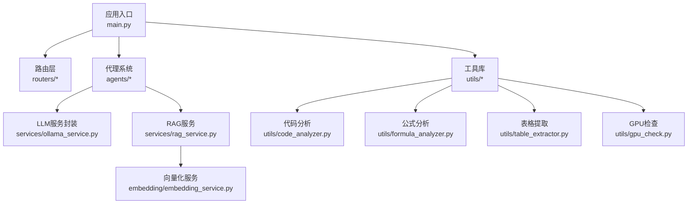
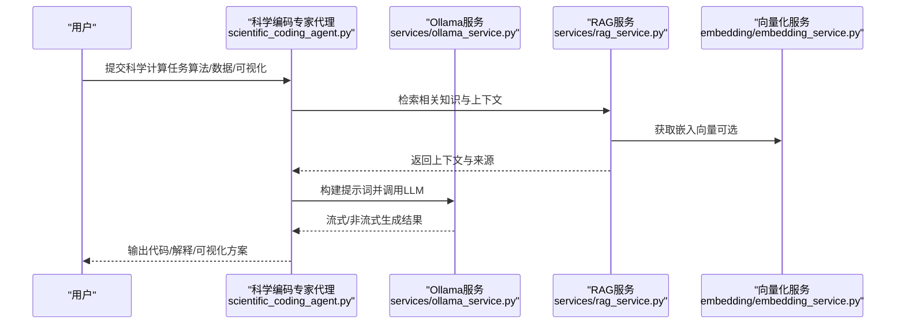
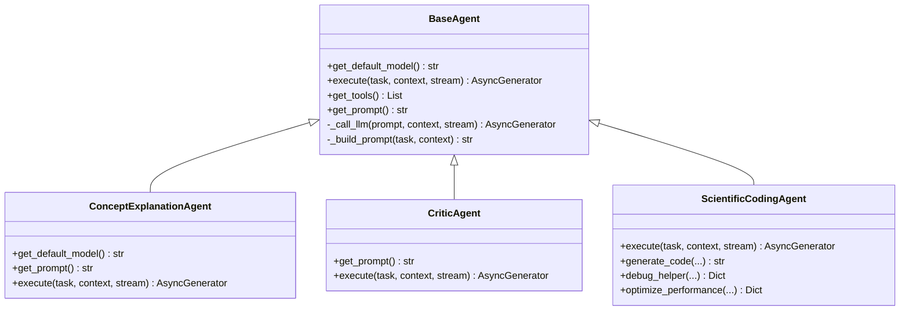
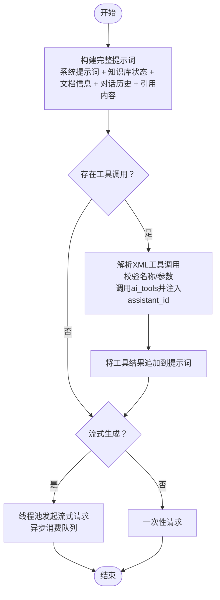
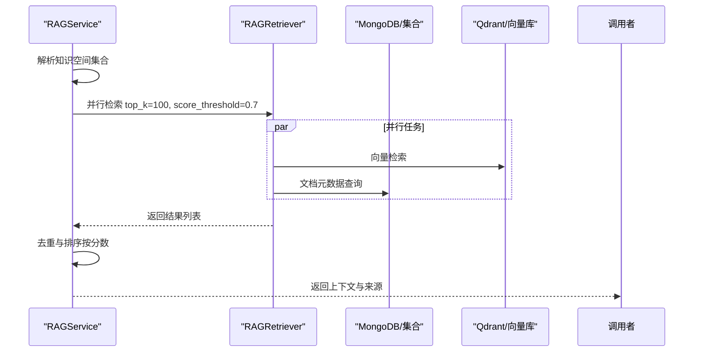
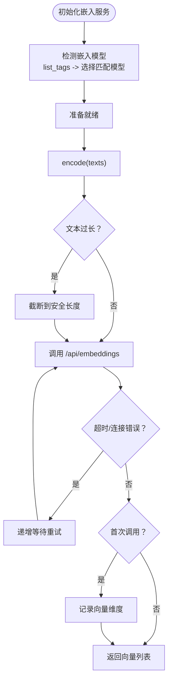
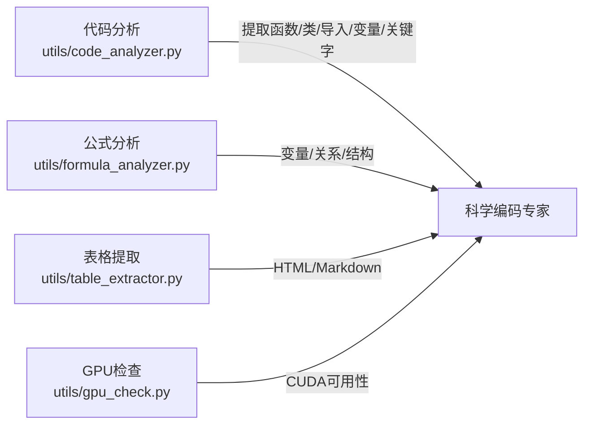
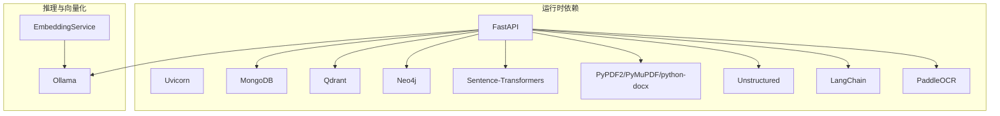

# 科学编码专家

<cite>
**本文引用的文件**
- [main.py](file://main.py)
- [README.md](file://README.md)
- [requirements.txt](file://requirements.txt)
- [agents/base/base_agent.py](file://agents/base/base_agent.py)
- [agents/experts/scientific_coding_agent.py](file://agents/experts/scientific_coding_agent.py)
- [agents/experts/concept_explanation_agent.py](file://agents/experts/concept_explanation_agent.py)
- [agents/experts/critic_agent.py](file://agents/experts/critic_agent.py)
- [services/ollama_service.py](file://services/ollama_service.py)
- [services/rag_service.py](file://services/rag_service.py)
- [embedding/embedding_service.py](file://embedding/embedding_service.py)
- [utils/code_analyzer.py](file://utils/code_analyzer.py)
- [utils/formula_analyzer.py](file://utils/formula_analyzer.py)
- [utils/table_extractor.py](file://utils/table_extractor.py)
- [utils/gpu_check.py](file://utils/gpu_check.py)
</cite>

## 目录
1. [简介](#简介)
2. [项目结构](#项目结构)
3. [核心组件](#核心组件)
4. [架构总览](#架构总览)
5. [组件详解](#组件详解)
6. [依赖关系分析](#依赖关系分析)
7. [性能与优化](#性能与优化)
8. [故障排查指南](#故障排查指南)
9. [结论](#结论)
10. [附录](#附录)

## 简介
本项目旨在打造“科学编码专家代理”，围绕科学计算编程能力展开，覆盖算法实现、数值计算、数据分析与可视化生成。系统通过多代理协作框架，结合RAG检索增强与本地大模型推理，提供面向科研项目、学术计算与工程仿真的智能辅助能力。文档重点说明如下方面：
- 科学计算编程能力：算法实现、数值计算、数据分析、可视化生成
- 科学计算库集成：向量化服务、公式与表格解析、代码分析
- 并行计算优化与内存管理策略
- 多语言代码生成（Python、MATLAB、R等）、调试辅助与性能优化建议
- 科研与工程仿真应用场景及实验数据处理集成方案

## 项目结构
后端采用FastAPI应用入口，统一注册路由与中间件；核心能力由代理系统、RAG检索、向量化服务与工具库构成。

图表来源
- [main.py:1-157](file://main.py#L1-L157)
- [services/ollama_service.py:1-674](file://services/ollama_service.py#L1-L674)
- [services/rag_service.py:1-248](file://services/rag_service.py#L1-L248)
- [embedding/embedding_service.py:1-278](file://embedding/embedding_service.py#L1-L278)
- [utils/code_analyzer.py:1-350](file://utils/code_analyzer.py#L1-L350)
- [utils/formula_analyzer.py:1-233](file://utils/formula_analyzer.py#L1-L233)
- [utils/table_extractor.py:1-290](file://utils/table_extractor.py#L1-L290)
- [utils/gpu_check.py:1-66](file://utils/gpu_check.py#L1-L66)

章节来源
- [main.py:1-157](file://main.py#L1-L157)
- [README.md:1-290](file://README.md#L1-L290)

## 核心组件
- 代理基类与专家代理：提供统一的执行接口、提示词构建与LLM调用封装，支持概念解释、批判性思维与科学编码等专家代理。
- LLM服务封装：统一构建提示词、处理工具函数调用、支持流式与非流式生成，适配本地Ollama推理。
- RAG服务：并行检索知识空间与文档集合，聚合上下文与来源信息，支持回退策略。
- 向量化服务：基于Ollama的嵌入模型，提供文本向量化与维度探测。
- 工具库：代码分析（函数/类/导入/复杂度）、公式分析（变量/关系/结构）、表格提取（Markdown/管道分隔）、GPU检查。

章节来源
- [agents/base/base_agent.py:1-122](file://agents/base/base_agent.py#L1-L122)
- [agents/experts/concept_explanation_agent.py:1-70](file://agents/experts/concept_explanation_agent.py#L1-L70)
- [agents/experts/critic_agent.py:1-90](file://agents/experts/critic_agent.py#L1-L90)
- [services/ollama_service.py:1-674](file://services/ollama_service.py#L1-L674)
- [services/rag_service.py:1-248](file://services/rag_service.py#L1-L248)
- [embedding/embedding_service.py:1-278](file://embedding/embedding_service.py#L1-L278)
- [utils/code_analyzer.py:1-350](file://utils/code_analyzer.py#L1-L350)
- [utils/formula_analyzer.py:1-233](file://utils/formula_analyzer.py#L1-L233)
- [utils/table_extractor.py:1-290](file://utils/table_extractor.py#L1-L290)
- [utils/gpu_check.py:1-66](file://utils/gpu_check.py#L1-L66)

## 架构总览
科学编码专家代理的整体工作流如下：

图表来源
- [agents/experts/scientific_coding_agent.py](file://agents/experts/scientific_coding_agent.py)
- [services/ollama_service.py:1-674](file://services/ollama_service.py#L1-L674)
- [services/rag_service.py:1-248](file://services/rag_service.py#L1-L248)
- [embedding/embedding_service.py:1-278](file://embedding/embedding_service.py#L1-L278)

## 组件详解

### 代理系统与专家代理
- 代理基类提供统一接口：默认模型、提示词构建、工具函数、LLM调用封装。
- 概念解释专家：面向物理学概念的深入解释，适合科学计算背景知识的梳理。
- 批判性思维专家：基于RAG检索进行事实核查与反面观点补充，保障科学结论的可靠性。
- 科学编码专家：面向科学计算编程，负责算法实现、数值计算、数据分析与可视化生成的代码生成与调试辅助。

图表来源
- [agents/base/base_agent.py:1-122](file://agents/base/base_agent.py#L1-L122)
- [agents/experts/concept_explanation_agent.py:1-70](file://agents/experts/concept_explanation_agent.py#L1-L70)
- [agents/experts/critic_agent.py:1-90](file://agents/experts/critic_agent.py#L1-L90)
- [agents/experts/scientific_coding_agent.py](file://agents/experts/scientific_coding_agent.py)

章节来源
- [agents/base/base_agent.py:1-122](file://agents/base/base_agent.py#L1-L122)
- [agents/experts/concept_explanation_agent.py:1-70](file://agents/experts/concept_explanation_agent.py#L1-L70)
- [agents/experts/critic_agent.py:1-90](file://agents/experts/critic_agent.py#L1-L90)

### LLM服务封装与提示词工程
- 统一构建提示词：支持系统提示词、知识库状态、文档信息、对话历史与引用内容拼接。
- 工具函数调用：在提示词中插入XML格式的工具调用，动态注入assistant_id等参数，调用后将结果自动附加到上下文。
- 流式与非流式生成：内置线程池与队列机制，保证异步消费与超时控制，适配大模型较长生成时间。

图表来源
- [services/ollama_service.py:94-273](file://services/ollama_service.py#L94-L273)
- [services/ollama_service.py:345-451](file://services/ollama_service.py#L345-L451)
- [services/ollama_service.py:453-670](file://services/ollama_service.py#L453-L670)

章节来源
- [services/ollama_service.py:1-674](file://services/ollama_service.py#L1-L674)

### RAG服务与并行检索
- 并行检索：对多个知识空间集合进行并行检索，聚合结果并去重保留最高分块。
- 来源追踪：记录文档/附件来源、评分与类型，便于溯源与交叉验证。
- 回退策略：检索失败时可选择回退到无上下文模式，保证服务连续性。

图表来源
- [services/rag_service.py:10-191](file://services/rag_service.py#L10-L191)

章节来源
- [services/rag_service.py:1-248](file://services/rag_service.py#L1-L248)

### 向量化服务与嵌入模型
- 模型发现与规范化：自动检测可用的Ollama嵌入模型，支持带/不带标签的名称匹配。
- 超时与重试：对单条嵌入请求设置较长超时与递增重试，避免长文本导致的失败。
- 文本截断：对过长文本进行安全截断，降低Ollama错误概率。
- 维度探测：首次调用时获取向量维度，便于后续索引与相似度计算。

图表来源
- [embedding/embedding_service.py:107-273](file://embedding/embedding_service.py#L107-L273)

章节来源
- [embedding/embedding_service.py:1-278](file://embedding/embedding_service.py#L1-L278)

### 工具库：代码分析、公式分析、表格提取、GPU检查
- 代码分析：识别语言、提取函数/类/导入/变量/关键字，估算复杂度，支持Python/Javascript/Java/C++。
- 公式分析：从LaTeX公式中提取变量、关系与函数，分析结构（方程、分数、根号、积分、求和/乘、矩阵）与复杂度。
- 表格提取：支持Markdown与管道分隔表格，转换为HTML/Markdown并推断数据类型。
- GPU检查：通过PyTorch、pynvml与nvidia-smi三种方式检测CUDA设备，跨平台通用。

图表来源
- [utils/code_analyzer.py:1-350](file://utils/code_analyzer.py#L1-L350)
- [utils/formula_analyzer.py:1-233](file://utils/formula_analyzer.py#L1-L233)
- [utils/table_extractor.py:1-290](file://utils/table_extractor.py#L1-L290)
- [utils/gpu_check.py:1-66](file://utils/gpu_check.py#L1-L66)

章节来源
- [utils/code_analyzer.py:1-350](file://utils/code_analyzer.py#L1-L350)
- [utils/formula_analyzer.py:1-233](file://utils/formula_analyzer.py#L1-L233)
- [utils/table_extractor.py:1-290](file://utils/table_extractor.py#L1-L290)
- [utils/gpu_check.py:1-66](file://utils/gpu_check.py#L1-L66)

## 依赖关系分析
- 运行时依赖：FastAPI、Uvicorn、MongoDB、Qdrant、Neo4j、Sentence-Transformers、PyPDF2、PyMuPDF、python-docx、Unstructured、LangChain、PaddleOCR等。
- LLM推理：Ollama本地模型服务，支持流式与非流式生成。
- 向量化：Ollama嵌入模型，提供维度探测与批量编码。

图表来源
- [requirements.txt:1-38](file://requirements.txt#L1-L38)
- [README.md:26-45](file://README.md#L26-L45)

章节来源
- [requirements.txt:1-38](file://requirements.txt#L1-L38)
- [README.md:1-290](file://README.md#L1-L290)

## 性能与优化
- 并行检索：RAG服务对多个集合并行检索，显著提升召回效率；建议合理设置top_k与阈值以平衡召回与性能。
- 流式生成：Ollama服务封装采用线程池与队列消费，降低主线程阻塞；建议根据模型响应时间调整超时与空闲检测阈值。
- 向量化批处理：当前实现逐条调用Ollama嵌入，建议在上层批量聚合后统一调用以减少HTTP往返；同时对长文本进行截断，避免500错误。
- 内存管理：工具库中对长文本与大规模数据结构（如表格）进行分步处理与去重，避免重复存储；建议在前端渲染时采用分页与懒加载。
- GPU利用：通过GPU检查工具判断CUDA可用性，结合模型选择与批大小进行调优；在容器部署时确保驱动与nvidia-container-toolkit正确配置。

[本节为通用性能指导，不直接分析具体文件]

## 故障排查指南
- LLM连接与超时
  - 现象：流式生成超时或连接错误。
  - 排查：检查Ollama服务可达性与模型是否拉取；适当增大超时与空闲检测阈值；确认网络与防火墙策略。
  - 参考
    - [services/ollama_service.py:453-670](file://services/ollama_service.py#L453-L670)
- RAG检索失败
  - 现象：检索无结果或报错。
  - 排查：确认知识空间集合名称与权限；检查向量库与文档元数据一致性；启用回退策略继续处理。
  - 参考
    - [services/rag_service.py:10-191](file://services/rag_service.py#L10-L191)
- 向量化模型不可用
  - 现象：嵌入请求失败或模型未找到。
  - 排查：确认Ollama中已拉取嵌入模型；检查模型名称规范化与标签匹配；必要时手动指定模型。
  - 参考
    - [embedding/embedding_service.py:107-273](file://embedding/embedding_service.py#L107-L273)
- GPU不可用
  - 现象：CUDA设备检测失败。
  - 排查：确认驱动安装与nvidia-smi可用；容器内确保nvidia-container-toolkit配置；回退至CPU执行。
  - 参考
    - [utils/gpu_check.py:1-66](file://utils/gpu_check.py#L1-L66)

章节来源
- [services/ollama_service.py:1-674](file://services/ollama_service.py#L1-L674)
- [services/rag_service.py:1-248](file://services/rag_service.py#L1-L248)
- [embedding/embedding_service.py:1-278](file://embedding/embedding_service.py#L1-L278)
- [utils/gpu_check.py:1-66](file://utils/gpu_check.py#L1-L66)

## 结论
科学编码专家代理通过多代理协作与RAG增强，实现了从科学概念解释到代码生成与调试辅助的全链路能力。依托Ollama本地推理与向量化服务，系统在隐私保护与可控性方面具备优势；配合工具库的代码、公式与表格处理能力，能够高效支撑科研与工程仿真场景下的算法实现、数值计算与可视化需求。建议在生产环境中结合并行检索、流式生成与GPU检查等策略，持续优化性能与稳定性。

[本节为总结性内容，不直接分析具体文件]

## 附录
- 应用入口与环境配置
  - 应用入口：FastAPI应用、CORS中间件、静态文件挂载、路由注册与全局异常处理。
  - 环境变量：支持开发/生产模式切换、端口、Worker数量、超时与并发限制等。
  - 参考
    - [main.py:1-157](file://main.py#L1-L157)
    - [README.md:125-166](file://README.md#L125-L166)
- 专家代理清单
  - 概念解释专家、批判性思维专家、科学编码专家等，均继承自BaseAgent，统一提示词与LLM调用。
  - 参考
    - [agents/base/base_agent.py:1-122](file://agents/base/base_agent.py#L1-L122)
    - [agents/experts/concept_explanation_agent.py:1-70](file://agents/experts/concept_explanation_agent.py#L1-L70)
    - [agents/experts/critic_agent.py:1-90](file://agents/experts/critic_agent.py#L1-L90)