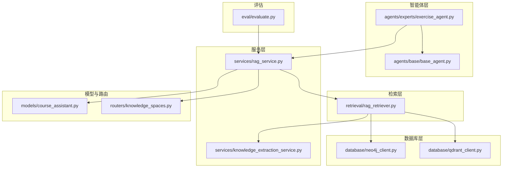
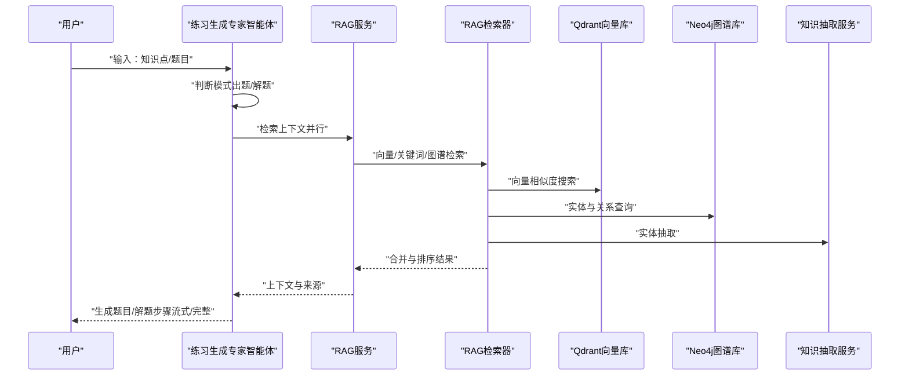
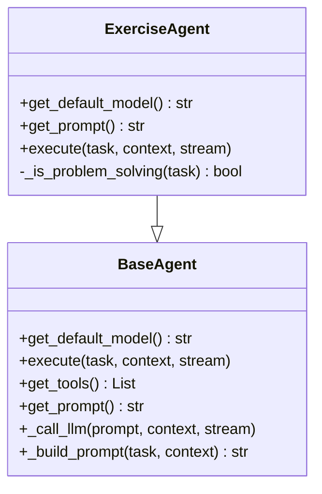
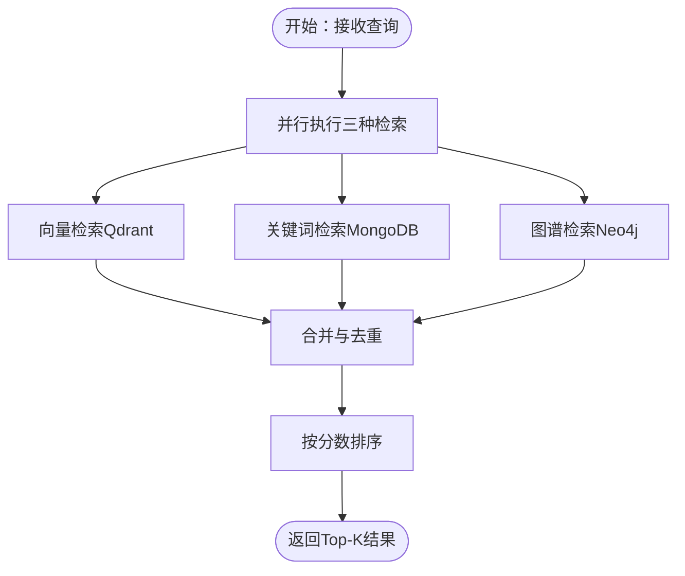
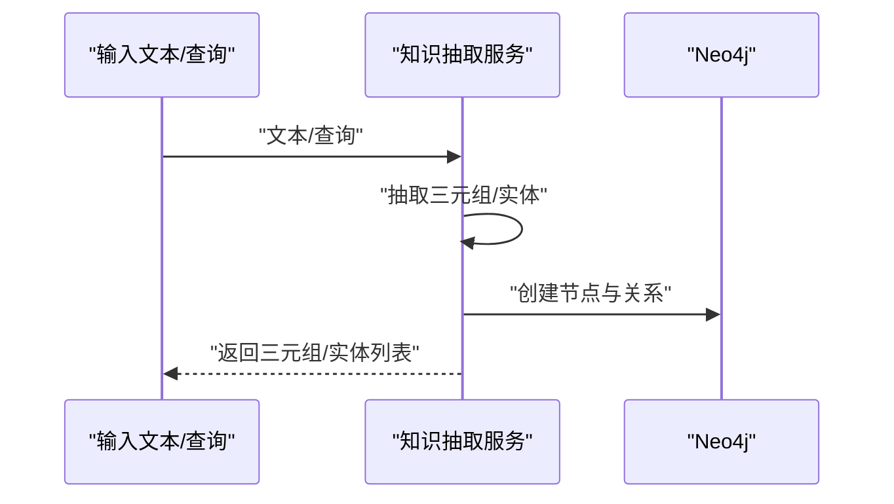
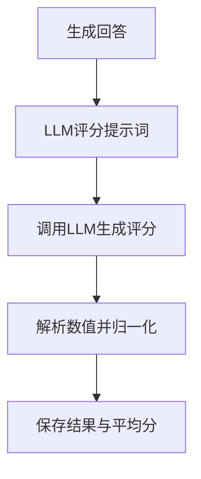
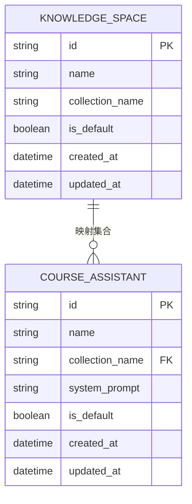
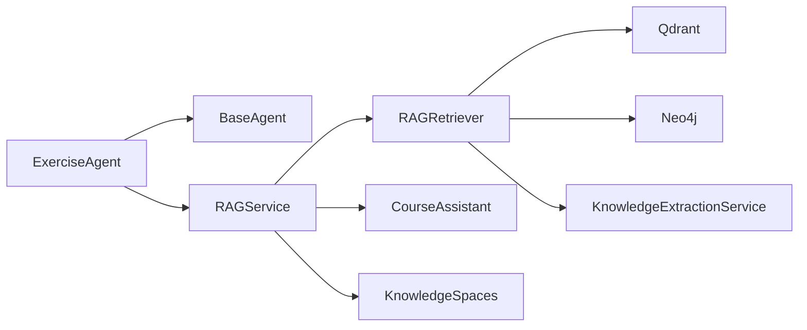

# 练习生成专家

<cite>
**本文引用的文件**
- [agents/base/base_agent.py](file://agents/base/base_agent.py)
- [agents/experts/exercise_agent.py](file://agents/experts/exercise_agent.py)
- [services/knowledge_extraction_service.py](file://services/knowledge_extraction_service.py)
- [retrieval/rag_retriever.py](file://retrieval/rag_retriever.py)
- [services/rag_service.py](file://services/rag_service.py)
- [database/neo4j_client.py](file://database/neo4j_client.py)
- [database/qdrant_client.py](file://database/qdrant_client.py)
- [models/course_assistant.py](file://models/course_assistant.py)
- [routers/knowledge_spaces.py](file://routers/knowledge_spaces.py)
- [eval/evaluate.py](file://eval/evaluate.py)
</cite>

## 目录
1. [简介](#简介)
2. [项目结构](#项目结构)
3. [核心组件](#核心组件)
4. [架构总览](#架构总览)
5. [组件详解](#组件详解)
6. [依赖关系分析](#依赖关系分析)
7. [性能考量](#性能考量)
8. [故障排查指南](#故障排查指南)
9. [结论](#结论)
10. [附录](#附录)

## 简介
本技术文档围绕“练习生成专家代理”展开，系统阐述其在在线学习与教育系统中的能力与实现方式。该代理具备以下核心能力：
- 基于知识点生成针对性练习题，覆盖选择题、填空题、计算题与应用题等多种题型
- 支持解题模式，提供题目分析、公式推导、计算过程与答案验证
- 通过知识图谱与向量检索融合，实现知识点关联分析与上下文增强
- 提供难度递进的训练序列与个性化推荐（基于知识空间与集合隔离）
- 支持自动评分与错题分析（结合评估服务）

文档还给出在在线学习平台与教育系统中的集成方案与使用指南。

## 项目结构
该仓库采用模块化分层组织，与练习生成专家代理相关的关键目录与文件如下：
- agents：智能体层，包含基础智能体与专家智能体（如练习生成专家）
- services：服务层，包含知识抽取、RAG服务等
- retrieval：检索层，包含混合检索器
- database：数据库层，包含Neo4j与Qdrant客户端
- routers/models：知识空间与课程助手模型，支撑知识集合隔离与检索范围控制
- eval：评估服务，支持自动评分

图表来源
- [agents/base/base_agent.py:1-122](file://agents/base/base_agent.py#L1-L122)
- [agents/experts/exercise_agent.py:1-102](file://agents/experts/exercise_agent.py#L1-L102)
- [services/rag_service.py:1-248](file://services/rag_service.py#L1-L248)
- [retrieval/rag_retriever.py:1-325](file://retrieval/rag_retriever.py#L1-L325)
- [database/qdrant_client.py:1-544](file://database/qdrant_client.py#L1-L544)
- [database/neo4j_client.py:1-104](file://database/neo4j_client.py#L1-L104)
- [services/knowledge_extraction_service.py:1-211](file://services/knowledge_extraction_service.py#L1-L211)
- [models/course_assistant.py:1-77](file://models/course_assistant.py#L1-L77)
- [routers/knowledge_spaces.py:1-133](file://routers/knowledge_spaces.py#L1-L133)
- [eval/evaluate.py:1-126](file://eval/evaluate.py#L1-L126)

章节来源
- [agents/base/base_agent.py:1-122](file://agents/base/base_agent.py#L1-L122)
- [agents/experts/exercise_agent.py:1-102](file://agents/experts/exercise_agent.py#L1-L102)
- [services/rag_service.py:1-248](file://services/rag_service.py#L1-L248)
- [retrieval/rag_retriever.py:1-325](file://retrieval/rag_retriever.py#L1-L325)
- [database/qdrant_client.py:1-544](file://database/qdrant_client.py#L1-L544)
- [database/neo4j_client.py:1-104](file://database/neo4j_client.py#L1-L104)
- [services/knowledge_extraction_service.py:1-211](file://services/knowledge_extraction_service.py#L1-L211)
- [models/course_assistant.py:1-77](file://models/course_assistant.py#L1-L77)
- [routers/knowledge_spaces.py:1-133](file://routers/knowledge_spaces.py#L1-L133)
- [eval/evaluate.py:1-126](file://eval/evaluate.py#L1-L126)

## 核心组件
- 练习生成专家智能体：负责根据知识点生成题目与解题步骤，区分“出题模式”和“解题模式”
- 基础智能体：统一管理模型、提示词与流式输出
- RAG服务与检索器：提供向量检索、关键词检索、图谱检索与混合排序
- 知识抽取服务：从文本中抽取三元组并构建知识图谱
- 数据库客户端：Neo4j用于图谱存储，Qdrant用于向量检索
- 知识空间与课程助手：通过集合隔离实现不同知识域的检索范围控制
- 评估服务：基于LLM的自动评分，支持错题分析与质量评估

章节来源
- [agents/experts/exercise_agent.py:1-102](file://agents/experts/exercise_agent.py#L1-L102)
- [agents/base/base_agent.py:1-122](file://agents/base/base_agent.py#L1-L122)
- [services/rag_service.py:1-248](file://services/rag_service.py#L1-L248)
- [retrieval/rag_retriever.py:1-325](file://retrieval/rag_retriever.py#L1-L325)
- [services/knowledge_extraction_service.py:1-211](file://services/knowledge_extraction_service.py#L1-L211)
- [database/neo4j_client.py:1-104](file://database/neo4j_client.py#L1-L104)
- [database/qdrant_client.py:1-544](file://database/qdrant_client.py#L1-L544)
- [models/course_assistant.py:1-77](file://models/course_assistant.py#L1-L77)
- [routers/knowledge_spaces.py:1-133](file://routers/knowledge_spaces.py#L1-L133)
- [eval/evaluate.py:1-126](file://eval/evaluate.py#L1-L126)

## 架构总览
练习生成专家代理的端到端工作流如下：
- 用户输入“知识点”或“题目”
- 练习生成专家智能体判断模式并构造提示词
- RAG服务并行检索多个知识空间的集合，融合向量、关键词与图谱结果
- 知识抽取服务辅助提取实体与三元组，增强上下文
- 生成完成后，返回结构化题目与解题步骤；支持自动评分与错题分析

图表来源
- [agents/experts/exercise_agent.py:28-94](file://agents/experts/exercise_agent.py#L28-L94)
- [services/rag_service.py:10-191](file://services/rag_service.py#L10-L191)
- [retrieval/rag_retriever.py:69-101](file://retrieval/rag_retriever.py#L69-L101)
- [database/qdrant_client.py:336-413](file://database/qdrant_client.py#L336-L413)
- [database/neo4j_client.py:40-62](file://database/neo4j_client.py#L40-L62)
- [services/knowledge_extraction_service.py:104-142](file://services/knowledge_extraction_service.py#L104-L142)

## 组件详解

### 练习生成专家智能体
- 模型与提示词：默认使用高性能推理模型，针对“出题”和“解题”分别定制提示词
- 模式判断：通过关键词识别“解题”请求，自动切换生成策略
- 输出结构：支持流式增量输出与完整结果，包含模式标记与置信度

图表来源
- [agents/base/base_agent.py:8-122](file://agents/base/base_agent.py#L8-L122)
- [agents/experts/exercise_agent.py:7-102](file://agents/experts/exercise_agent.py#L7-L102)

章节来源
- [agents/experts/exercise_agent.py:1-102](file://agents/experts/exercise_agent.py#L1-L102)
- [agents/base/base_agent.py:1-122](file://agents/base/base_agent.py#L1-L122)

### RAG服务与检索器
- 并行检索：向量检索、关键词检索、图谱检索三路并行，随后合并与排序
- 混合策略：向量与关键词结果叠加打分，图谱结果作为补充上下文
- 知识空间隔离：通过课程助手与知识空间路由，将不同集合隔离，实现精准检索

图表来源
- [services/rag_service.py:64-83](file://services/rag_service.py#L64-L83)
- [retrieval/rag_retriever.py:82-101](file://retrieval/rag_retriever.py#L82-L101)
- [retrieval/rag_retriever.py:262-297](file://retrieval/rag_retriever.py#L262-L297)

章节来源
- [services/rag_service.py:1-248](file://services/rag_service.py#L1-L248)
- [retrieval/rag_retriever.py:1-325](file://retrieval/rag_retriever.py#L1-L325)

### 知识抽取与图谱构建
- 三元组抽取：从文本中抽取“实体-关系-实体”，并规范化关系类型
- 实体提取：从查询中提取关键实体，驱动图谱检索
- 图谱入库：将实体与关系写入Neo4j，支持后续Cypher查询

图表来源
- [services/knowledge_extraction_service.py:32-103](file://services/knowledge_extraction_service.py#L32-L103)
- [services/knowledge_extraction_service.py:144-210](file://services/knowledge_extraction_service.py#L144-L210)
- [database/neo4j_client.py:64-101](file://database/neo4j_client.py#L64-L101)

章节来源
- [services/knowledge_extraction_service.py:1-211](file://services/knowledge_extraction_service.py#L1-L211)
- [database/neo4j_client.py:1-104](file://database/neo4j_client.py#L1-L104)

### 自动评分与错题分析
- 评分流程：基于LLM作为评判者，对比生成答案与标准答案，输出0~1区间分数
- 结果保存：将每条评测结果与平均分持久化，便于后续分析与迭代
- 错题分析：结合来源文档与检索上下文，定位薄弱知识点，指导个性化训练

图表来源
- [eval/evaluate.py:46-90](file://eval/evaluate.py#L46-L90)

章节来源
- [eval/evaluate.py:1-126](file://eval/evaluate.py#L1-L126)

### 知识空间与集合隔离
- 知识空间：每个知识空间对应独立集合名称，实现知识域隔离
- 课程助手：绑定集合名称，支持多助手并行与范围控制
- 路由：前端与后端通过知识空间选择，限定检索范围

图表来源
- [routers/knowledge_spaces.py:24-78](file://routers/knowledge_spaces.py#L24-L78)
- [models/course_assistant.py:8-48](file://models/course_assistant.py#L8-L48)

章节来源
- [routers/knowledge_spaces.py:1-133](file://routers/knowledge_spaces.py#L1-L133)
- [models/course_assistant.py:1-77](file://models/course_assistant.py#L1-L77)

## 依赖关系分析
- 练习生成专家智能体依赖基础智能体提供的统一接口与模型调用
- RAG服务协调检索器与数据库客户端，形成检索闭环
- 知识抽取服务贯穿检索与图谱构建，提升上下文质量
- 知识空间与课程助手模型为检索范围提供约束，避免跨域干扰

图表来源
- [agents/experts/exercise_agent.py:1-102](file://agents/experts/exercise_agent.py#L1-L102)
- [agents/base/base_agent.py:1-122](file://agents/base/base_agent.py#L1-L122)
- [services/rag_service.py:1-248](file://services/rag_service.py#L1-L248)
- [retrieval/rag_retriever.py:1-325](file://retrieval/rag_retriever.py#L1-L325)
- [database/qdrant_client.py:1-544](file://database/qdrant_client.py#L1-L544)
- [database/neo4j_client.py:1-104](file://database/neo4j_client.py#L1-L104)
- [services/knowledge_extraction_service.py:1-211](file://services/knowledge_extraction_service.py#L1-L211)
- [models/course_assistant.py:1-77](file://models/course_assistant.py#L1-L77)
- [routers/knowledge_spaces.py:1-133](file://routers/knowledge_spaces.py#L1-L133)

章节来源
- [agents/experts/exercise_agent.py:1-102](file://agents/experts/exercise_agent.py#L1-L102)
- [services/rag_service.py:1-248](file://services/rag_service.py#L1-L248)
- [retrieval/rag_retriever.py:1-325](file://retrieval/rag_retriever.py#L1-L325)
- [services/knowledge_extraction_service.py:1-211](file://services/knowledge_extraction_service.py#L1-L211)
- [database/neo4j_client.py:1-104](file://database/neo4j_client.py#L1-L104)
- [database/qdrant_client.py:1-544](file://database/qdrant_client.py#L1-L544)
- [models/course_assistant.py:1-77](file://models/course_assistant.py#L1-L77)
- [routers/knowledge_spaces.py:1-133](file://routers/knowledge_spaces.py#L1-L133)

## 性能考量
- 并行检索：向量、关键词与图谱检索并行执行，显著降低端到端延迟
- 混合排序：对合并结果进行打分与排序，提高相关性
- 连接复用与gRPC：Qdrant客户端优先使用gRPC，减少HTTP开销，提升吞吐
- 重排开关：当前禁用重排模型以避免崩溃，未来可按需启用
- 图谱连接：在容器环境下自动适配URI，保证稳定性

章节来源
- [retrieval/rag_retriever.py:82-101](file://retrieval/rag_retriever.py#L82-L101)
- [database/qdrant_client.py:66-95](file://database/qdrant_client.py#L66-L95)
- [retrieval/rag_retriever.py:12-20](file://retrieval/rag_retriever.py#L12-L20)

## 故障排查指南
- 模型调用失败：检查基础智能体的模型名称与Ollama服务地址
- 检索失败：确认RAG服务的集合名称与知识空间配置一致
- 向量库异常：检查Qdrant健康状态与集合维度一致性
- 图谱连接失败：确认Neo4j连接参数与容器URI适配
- 评估服务异常：核对LLM评分提示词与输出解析逻辑

章节来源
- [agents/base/base_agent.py:15-25](file://agents/base/base_agent.py#L15-L25)
- [services/rag_service.py:19-62](file://services/rag_service.py#L19-L62)
- [database/qdrant_client.py:124-138](file://database/qdrant_client.py#L124-L138)
- [database/neo4j_client.py:16-38](file://database/neo4j_client.py#L16-L38)
- [eval/evaluate.py:61-90](file://eval/evaluate.py#L61-L90)

## 结论
练习生成专家代理通过“智能体+RAG+图谱”的组合，实现了从知识点到题目的高效生成与从题目到解法的深度解析。借助知识空间与集合隔离，系统可在多领域教育场景中保持检索精度与个性化体验。配合自动评分与错题分析，可进一步完善学习闭环，满足在线学习平台与教育系统的规模化需求。

## 附录
- 集成建议
  - 在线学习平台：将练习生成专家智能体接入聊天界面，支持“出题/解题”双模式；通过知识空间选择限定检索范围
  - 教育系统：结合课程助手模型与知识空间路由，实现多班级/多课程的独立知识域管理
- 使用指南
  - 出题：输入“知识点”触发生成，系统返回多种题型与解题思路
  - 解题：输入“题目”触发解析，系统提供步骤化解法与答案验证
  - 评估：使用评估服务对生成答案进行自动评分，沉淀错题与薄弱点