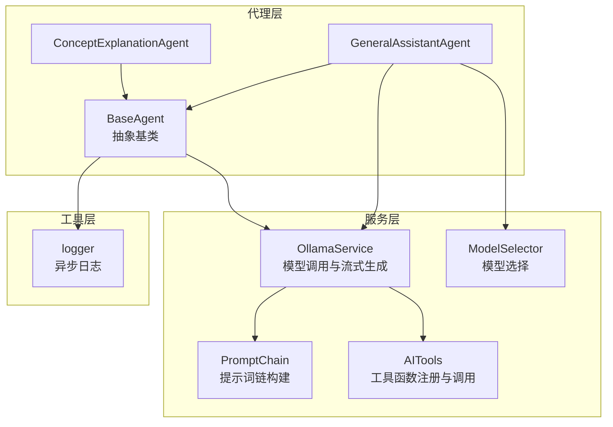
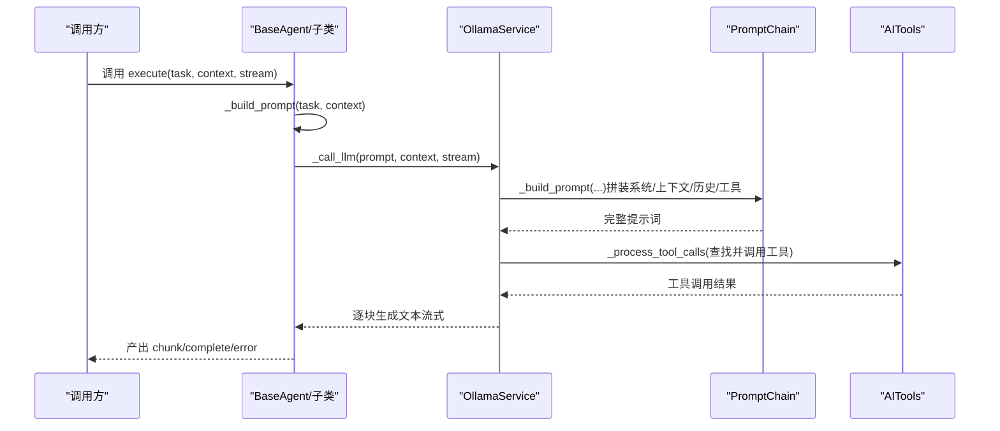
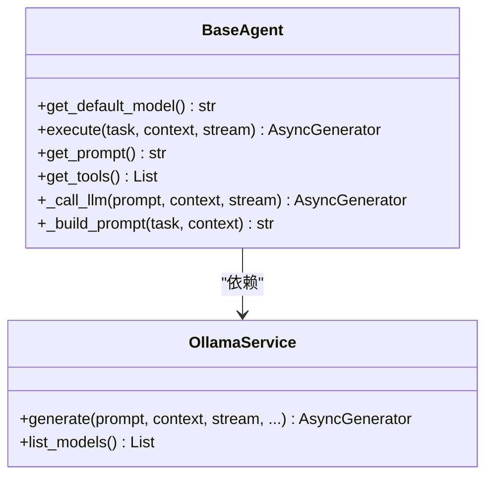
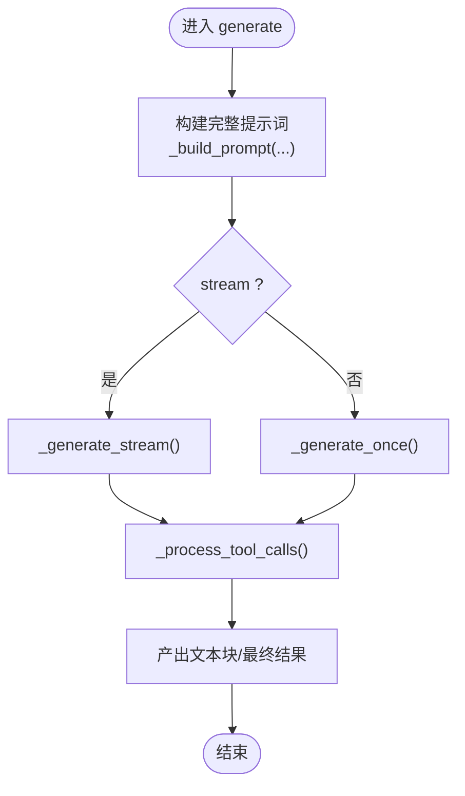
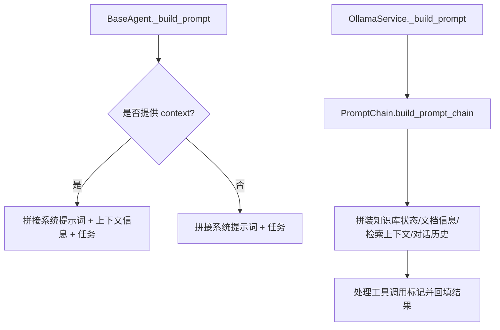
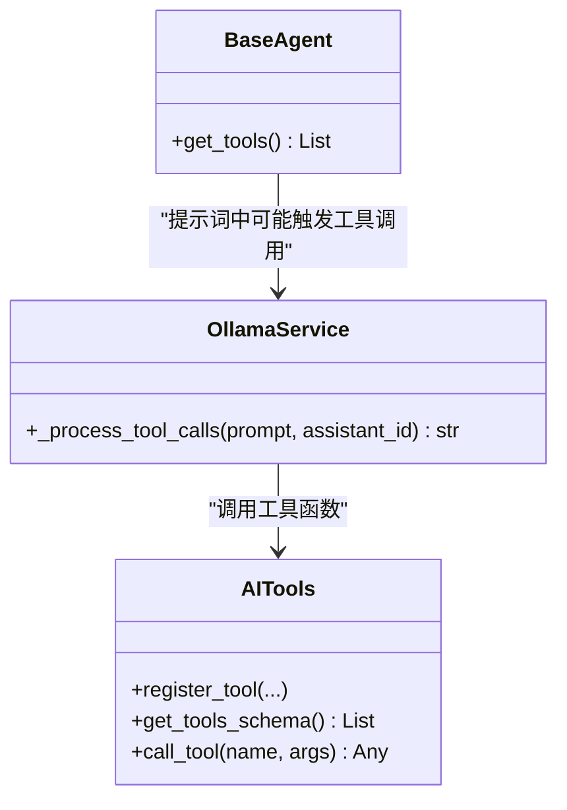
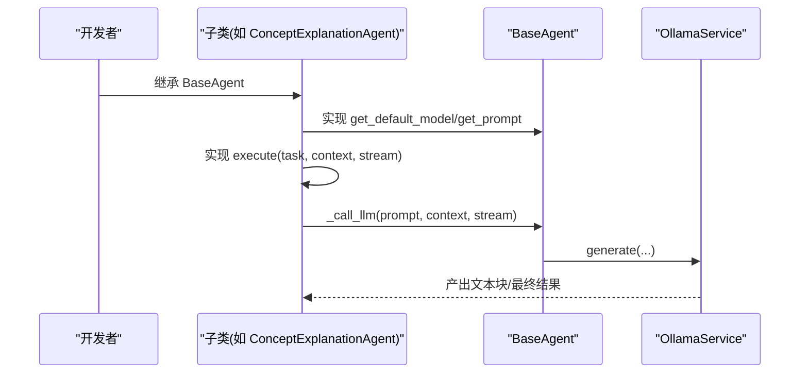
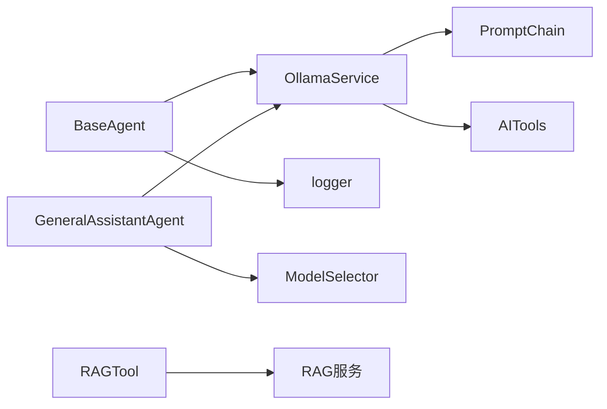

# 代理基类架构

<cite>
**本文引用的文件**
- [agents/base/base_agent.py](file://agents/base/base_agent.py)
- [services/ollama_service.py](file://services/ollama_service.py)
- [utils/logger.py](file://utils/logger.py)
- [services/prompt_chain.py](file://services/prompt_chain.py)
- [services/ai_tools.py](file://services/ai_tools.py)
- [services/model_selector.py](file://services/model_selector.py)
- [agents/experts/concept_explanation_agent.py](file://agents/experts/concept_explanation_agent.py)
- [agents/general_assistant/general_assistant_agent.py](file://agents/general_assistant/general_assistant_agent.py)
- [agents/tools/rag_tool.py](file://agents/tools/rag_tool.py)
- [models/agent_config.py](file://models/agent_config.py)
</cite>

## 目录
1. [简介](#简介)
2. [项目结构](#项目结构)
3. [核心组件](#核心组件)
4. [架构总览](#架构总览)
5. [详细组件分析](#详细组件分析)
6. [依赖分析](#依赖分析)
7. [性能考量](#性能考量)
8. [故障排查指南](#故障排查指南)
9. [结论](#结论)
10. [附录](#附录)

## 简介
本文件系统化梳理代理基类架构，围绕 BaseAgent 抽象基类的设计理念、核心接口、初始化流程、提示词构建、工具接口扩展、以及子类继承实践展开，帮助开发者快速理解并高效扩展多代理协作体系。

## 项目结构
本项目采用“功能域+层次化”的组织方式：
- agents：代理层，包含基类与多种专家代理
- services：服务层，封装模型调用、提示词链、工具函数、模型选择等
- utils：通用工具，如异步日志
- models：数据模型（如Agent配置）
- agents/tools：LangChain工具适配层

**图表来源**
- [agents/base/base_agent.py:8-122](file://agents/base/base_agent.py#L8-L122)
- [services/ollama_service.py:9-674](file://services/ollama_service.py#L9-L674)
- [services/prompt_chain.py:6-447](file://services/prompt_chain.py#L6-L447)
- [services/ai_tools.py:10-530](file://services/ai_tools.py#L10-L530)
- [services/model_selector.py:10-206](file://services/model_selector.py#L10-L206)
- [utils/logger.py:15-88](file://utils/logger.py#L15-L88)

**章节来源**
- [agents/base/base_agent.py:8-122](file://agents/base/base_agent.py#L8-L122)
- [services/ollama_service.py:9-674](file://services/ollama_service.py#L9-L674)
- [utils/logger.py:15-88](file://utils/logger.py#L15-L88)

## 核心组件
- BaseAgent 抽象基类：定义统一接口与通用能力（初始化、默认模型、执行、提示词、LLM调用、提示词构建、工具接口）
- OllamaService：封装Ollama模型调用，支持流式/非流式生成、提示词构建、工具函数调用处理、超时与异常处理
- PromptChain：基础提示词与助手特定提示词的叠加构建
- AITools：工具函数注册与调用，支撑提示词中的工具调用
- ModelSelector：根据问题特征智能选择模型
- 日志系统：异步日志写入，降低I/O阻塞

**章节来源**
- [agents/base/base_agent.py:8-122](file://agents/base/base_agent.py#L8-L122)
- [services/ollama_service.py:9-674](file://services/ollama_service.py#L9-L674)
- [services/prompt_chain.py:6-447](file://services/prompt_chain.py#L6-L447)
- [services/ai_tools.py:10-530](file://services/ai_tools.py#L10-L530)
- [services/model_selector.py:10-206](file://services/model_selector.py#L10-L206)
- [utils/logger.py:15-88](file://utils/logger.py#L15-L88)

## 架构总览
BaseAgent 作为抽象基类，向上提供统一的 execute 接口与提示词体系，向下依赖 OllamaService 进行模型调用。提示词构建由 PromptChain 与 OllamaService 协作完成，支持系统提示词、上下文、对话历史、工具调用结果等多维拼装。工具接口 get_tools 可扩展 LangChain 工具，配合 AITools 实现提示词中的工具函数调用。

**图表来源**
- [agents/base/base_agent.py:38-122](file://agents/base/base_agent.py#L38-L122)
- [services/ollama_service.py:50-274](file://services/ollama_service.py#L50-L274)
- [services/prompt_chain.py:383-428](file://services/prompt_chain.py#L383-L428)
- [services/ai_tools.py:345-451](file://services/ai_tools.py#L345-L451)

## 详细组件分析

### BaseAgent 抽象基类
- 设计理念
  - 通过抽象方法约束子类行为，统一生命周期与接口形态
  - 将模型配置、日志、提示词构建、LLM调用下沉至基类，子类仅关注业务逻辑
- 核心接口
  - get_default_model：返回默认模型名
  - execute：异步生成器接口，按流式/非流式产出中间块与最终结果
  - get_prompt：返回系统提示词（子类可覆盖）
  - get_tools：返回LangChain工具列表（默认空）
  - _call_llm：内部LLM调用封装，委托 OllamaService
  - _build_prompt：提示词构建，整合系统提示词与上下文
- 初始化流程
  - 从构造参数或 get_default_model 获取模型名
  - 初始化 OllamaService（支持 base_url 与 model_name）
  - 记录初始化日志

**图表来源**
- [agents/base/base_agent.py:8-122](file://agents/base/base_agent.py#L8-L122)
- [services/ollama_service.py:9-674](file://services/ollama_service.py#L9-L674)

**章节来源**
- [agents/base/base_agent.py:11-122](file://agents/base/base_agent.py#L11-L122)

### OllamaService 内部LLM调用机制
- 能力概览
  - generate：统一入口，支持流式/非流式
  - _build_prompt：拼装系统提示词、知识库状态、文档信息、检索上下文、对话历史、工具调用结果
  - _process_tool_calls：解析提示词中的工具调用标记，调用 AITools 并回填结果
  - _generate_stream/_generate_once：分别实现流式与一次性生成
- 流式生成细节
  - 使用线程池执行同步HTTP请求，异步消费队列
  - 超时与空闲超时控制，异常捕获与日志记录
- 工具函数调用
  - XML格式标记 <function_calls><invoke name="...">...</invoke></function_calls>
  - 自动注入 assistant_id 参数（若工具schema支持）
  - 将调用结果以文本形式附加到提示词末尾

**图表来源**
- [services/ollama_service.py:50-93](file://services/ollama_service.py#L50-L93)
- [services/ollama_service.py:94-274](file://services/ollama_service.py#L94-L274)
- [services/ollama_service.py:345-451](file://services/ollama_service.py#L345-L451)

**章节来源**
- [services/ollama_service.py:50-674](file://services/ollama_service.py#L50-L674)

### 提示词构建系统 _build_prompt
- BaseAgent 层
  - 读取 get_prompt() 返回的系统提示词
  - 若存在 context，拼接“上下文信息”与“任务”
- OllamaService 层（更丰富）
  - 通过 PromptChain 获取基础提示词，可叠加助手特定提示词
  - 拼装知识库状态、文档信息、检索上下文、对话历史
  - 支持工具调用结果回填，形成闭环提示词

**图表来源**
- [agents/base/base_agent.py:99-121](file://agents/base/base_agent.py#L99-L121)
- [services/ollama_service.py:94-274](file://services/ollama_service.py#L94-L274)
- [services/prompt_chain.py:383-428](file://services/prompt_chain.py#L383-L428)

**章节来源**
- [agents/base/base_agent.py:99-121](file://agents/base/base_agent.py#L99-L121)
- [services/ollama_service.py:94-274](file://services/ollama_service.py#L94-L274)
- [services/prompt_chain.py:383-428](file://services/prompt_chain.py#L383-L428)

### 工具接口 get_tools 的扩展机制
- BaseAgent.get_tools 默认返回空列表，子类可覆盖以提供 LangChain 工具
- OllamaService._process_tool_calls 支持在提示词中以XML标记调用工具函数，自动注入 assistant_id 并回填结果
- AITools 提供工具注册、Schema定义与调用，覆盖模型列表、知识库文档、系统信息、统计等

**图表来源**
- [agents/base/base_agent.py:57-65](file://agents/base/base_agent.py#L57-L65)
- [services/ollama_service.py:345-451](file://services/ollama_service.py#L345-L451)
- [services/ai_tools.py:10-144](file://services/ai_tools.py#L10-L144)

**章节来源**
- [agents/base/base_agent.py:57-65](file://agents/base/base_agent.py#L57-L65)
- [services/ollama_service.py:345-451](file://services/ollama_service.py#L345-L451)
- [services/ai_tools.py:10-144](file://services/ai_tools.py#L10-L144)

### 子类继承指南：如何基于 BaseAgent 创建自定义代理
- 步骤
  - 继承 BaseAgent，实现 get_default_model 与 get_prompt
  - 实现 execute：使用 _call_llm 或直接调用 OllamaService.generate
  - 如需工具集成，覆盖 get_tools 返回 LangChain 工具
  - 使用 _build_prompt 组织系统提示词与上下文
- 参考实现
  - 概念解释专家：覆盖 get_prompt 与 execute，使用 _call_llm 生成
  - 通用助手：在 execute 中集成 RAG 检索、动态模型选择、流式输出

**图表来源**
- [agents/experts/concept_explanation_agent.py:7-70](file://agents/experts/concept_explanation_agent.py#L7-L70)
- [agents/general_assistant/general_assistant_agent.py:9-167](file://agents/general_assistant/general_assistant_agent.py#L9-L167)
- [agents/base/base_agent.py:27-98](file://agents/base/base_agent.py#L27-L98)

**章节来源**
- [agents/experts/concept_explanation_agent.py:7-70](file://agents/experts/concept_explanation_agent.py#L7-L70)
- [agents/general_assistant/general_assistant_agent.py:9-167](file://agents/general_assistant/general_assistant_agent.py#L9-L167)
- [agents/base/base_agent.py:27-98](file://agents/base/base_agent.py#L27-L98)

## 依赖分析
- BaseAgent 依赖
  - OllamaService：模型调用与提示词构建
  - logger：统一日志输出
- OllamaService 依赖
  - PromptChain：基础提示词与助手提示词叠加
  - AITools：工具函数注册与调用
  - MongoDB/Qdrant：知识库状态与向量统计（间接）
- 子类依赖
  - GeneralAssistantAgent 依赖 RAG 服务与模型选择器
  - LangChain 工具（如 RAGTool）用于外部检索

**图表来源**
- [agents/base/base_agent.py:8-122](file://agents/base/base_agent.py#L8-L122)
- [services/ollama_service.py:9-674](file://services/ollama_service.py#L9-L674)
- [services/prompt_chain.py:6-447](file://services/prompt_chain.py#L6-L447)
- [services/ai_tools.py:10-530](file://services/ai_tools.py#L10-L530)
- [services/model_selector.py:10-206](file://services/model_selector.py#L10-L206)
- [agents/tools/rag_tool.py:12-58](file://agents/tools/rag_tool.py#L12-L58)

**章节来源**
- [agents/base/base_agent.py:8-122](file://agents/base/base_agent.py#L8-L122)
- [services/ollama_service.py:9-674](file://services/ollama_service.py#L9-L674)
- [services/model_selector.py:10-206](file://services/model_selector.py#L10-L206)
- [agents/tools/rag_tool.py:12-58](file://agents/tools/rag_tool.py#L12-L58)

## 性能考量
- 流式生成
  - OllamaService 使用线程池执行同步HTTP请求，异步消费队列，降低事件循环阻塞
  - 超时与空闲超时控制，避免长时间等待
- 日志异步化
  - 异步文件处理器与队列监听器，避免I/O阻塞
- 模型选择
  - ModelSelector 使用轻量模型与关键词匹配快速决策，必要时再进行精确判断
- 提示词构建
  - PromptChain 与 OllamaService 的提示词拼装避免冗余，仅在需要时附加工具调用结果

**章节来源**
- [services/ollama_service.py:453-674](file://services/ollama_service.py#L453-L674)
- [utils/logger.py:15-88](file://utils/logger.py#L15-L88)
- [services/model_selector.py:51-201](file://services/model_selector.py#L51-L201)

## 故障排查指南
- 流式生成超时
  - 现象：长时间无数据或总超时
  - 排查：检查 Ollama 服务可达性、模型加载状态、网络延迟
  - 参考：流式生成与空闲超时逻辑
- 工具函数调用失败
  - 现象：提示词中工具调用未生效或报错
  - 排查：确认工具名称、参数类型、assistant_id 注入
  - 参考：工具调用处理与日志
- 日志缺失或性能问题
  - 现象：日志文件未写入或CPU占用高
  - 排查：异步队列大小、文件句柄、第三方库日志级别
  - 参考：异步日志配置

**章节来源**
- [services/ollama_service.py:453-674](file://services/ollama_service.py#L453-L674)
- [services/ai_tools.py:121-144](file://services/ai_tools.py#L121-L144)
- [utils/logger.py:15-88](file://utils/logger.py#L15-L88)

## 结论
BaseAgent 通过抽象接口与通用能力封装，将模型配置、提示词构建、工具调用与日志系统有机整合，既保证了子类实现的简洁性，又提供了强大的扩展能力。结合 OllamaService 的流式生成与提示词链机制，以及 AITools 的工具函数生态，形成了可维护、可扩展、高性能的多代理协作框架。

## 附录
- 最佳实践
  - 子类仅实现业务相关逻辑，避免在 execute 中直接耦合底层细节
  - 使用 _build_prompt 组织系统提示词与上下文，确保提示词结构清晰
  - 工具调用遵循XML标记规范，参数类型与默认值明确
  - 流式输出时，按需产出中间块，避免一次性缓冲大量文本
- 常见陷阱
  - 忽视流式超时与空闲超时，导致长时间无响应
  - 工具函数名称使用占位符或错误拼写
  - 在提示词中直接硬编码静态信息，忽略实时工具调用
  - 日志级别过高导致性能下降或信息淹没