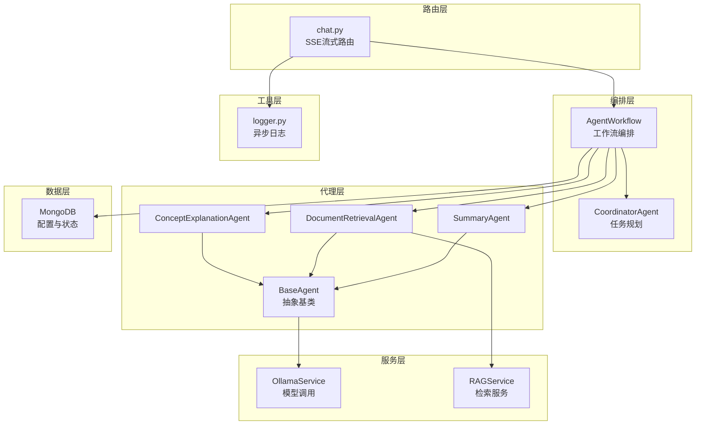
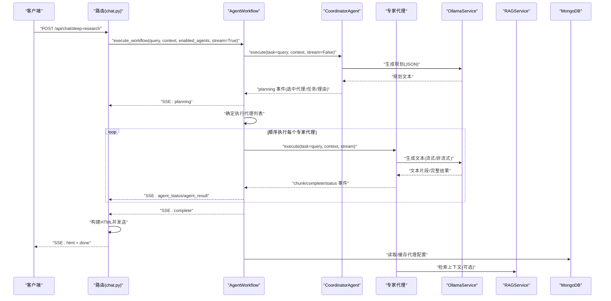
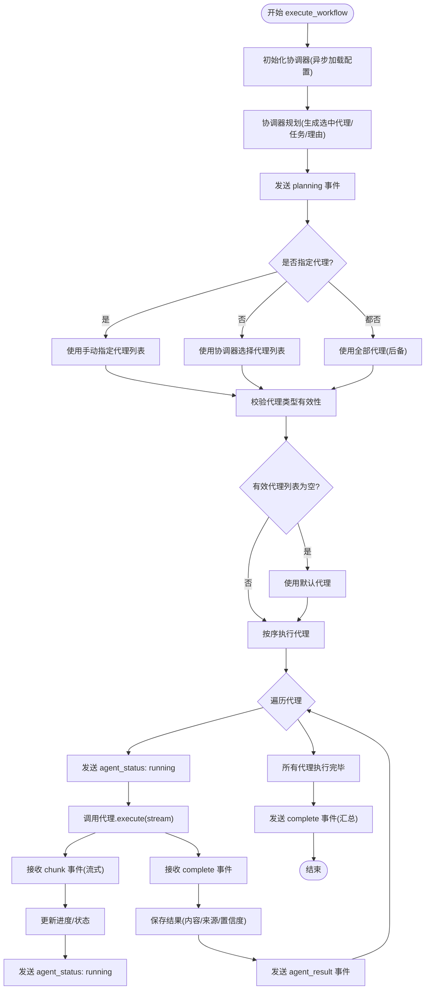
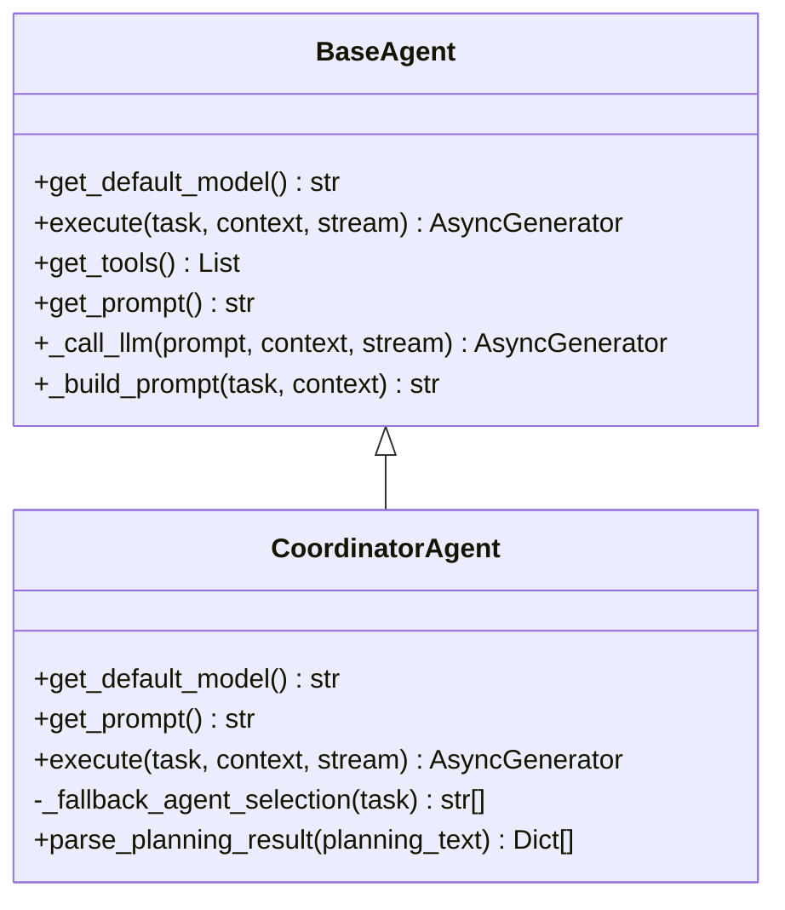
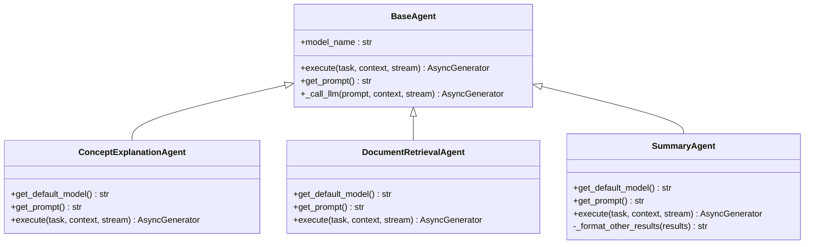
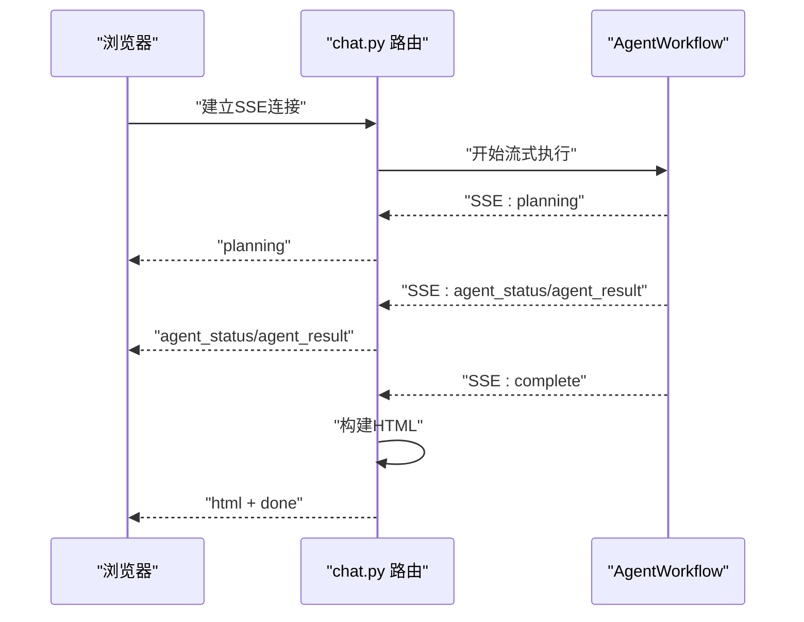
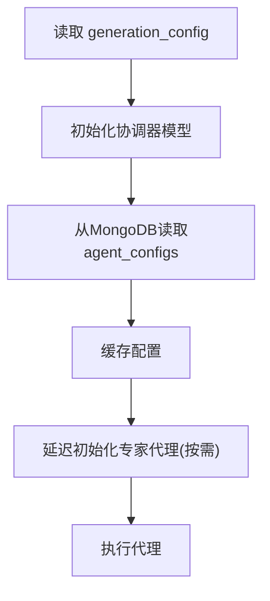
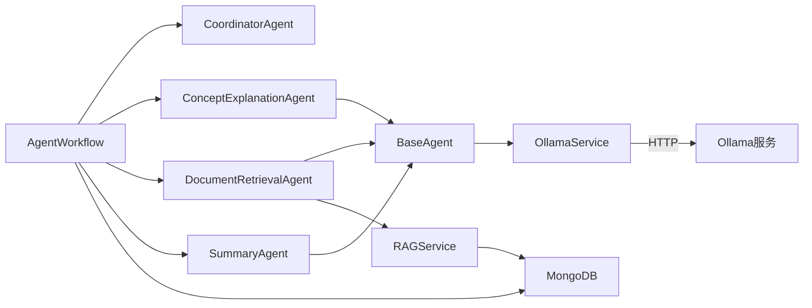

# 代理工作流编排

<cite>
**本文引用的文件**
- [agent_workflow.py](file://agents/workflow/agent_workflow.py)
- [base_agent.py](file://agents/base/base_agent.py)
- [coordinator_agent.py](file://agents/coordinator/coordinator_agent.py)
- [concept_explanation_agent.py](file://agents/experts/concept_explanation_agent.py)
- [document_retrieval_agent.py](file://agents/experts/document_retrieval_agent.py)
- [summary_agent.py](file://agents/experts/summary_agent.py)
- [ollama_service.py](file://services/ollama_service.py)
- [rag_service.py](file://services/rag_service.py)
- [mongodb.py](file://database/mongodb.py)
- [logger.py](file://utils/logger.py)
- [chat.py](file://routers/chat.py)
- [agent_config.py](file://models/agent_config.py)
- [README.md](file://README.md)
</cite>

## 目录
1. [简介](#简介)
2. [项目结构](#项目结构)
3. [核心组件](#核心组件)
4. [架构总览](#架构总览)
5. [详细组件分析](#详细组件分析)
6. [依赖分析](#依赖分析)
7. [性能考虑](#性能考虑)
8. [故障排除指南](#故障排除指南)
9. [结论](#结论)
10. [附录](#附录)

## 简介
本文件面向“代理工作流编排系统”的技术文档，围绕 AgentWorkflow 的核心设计理念与编排逻辑展开，涵盖任务分解、专家代理调度、结果聚合机制；详述工作流状态管理、执行顺序控制、错误处理与重试策略；解释流式响应处理机制，如何实现多代理实时协作与结果传输；文档化关键配置参数、超时设置、并发控制等；提供扩展开发指南与最佳实践案例。

## 项目结构
系统采用“路由层-服务层-代理层-基础设施层”的分层组织，核心工作流位于 agents/workflow，代理基类与各专家代理位于 agents/experts 与 agents/coordinator，服务层封装 Ollama 与 RAG，数据库层提供 MongoDB 连接，日志与监控位于 utils。

**图表来源**
- [chat.py:790-989](file://routers/chat.py#L790-L989)
- [agent_workflow.py:47-388](file://agents/workflow/agent_workflow.py#L47-L388)
- [coordinator_agent.py:7-252](file://agents/coordinator/coordinator_agent.py#L7-L252)
- [concept_explanation_agent.py:7-70](file://agents/experts/concept_explanation_agent.py#L7-L70)
- [document_retrieval_agent.py:8-79](file://agents/experts/document_retrieval_agent.py#L8-L79)
- [summary_agent.py:7-87](file://agents/experts/summary_agent.py#L7-L87)
- [base_agent.py:8-122](file://agents/base/base_agent.py#L8-L122)
- [ollama_service.py:9-674](file://services/ollama_service.py#L9-L674)
- [rag_service.py:7-248](file://services/rag_service.py#L7-L248)
- [mongodb.py:92-199](file://database/mongodb.py#L92-L199)
- [logger.py:15-88](file://utils/logger.py#L15-L88)

**章节来源**
- [README.md:46-70](file://README.md#L46-L70)

## 核心组件
- AgentWorkflow：多代理编排器，负责协调规划、实例化专家代理、顺序执行与结果聚合，支持流式输出。
- CoordinatorAgent：任务规划与分发，基于用户问题智能选择专家代理集合与任务描述。
- BaseAgent：所有代理的抽象基类，统一模型初始化、提示词构建、LLM调用与工具接口。
- 专家代理：概念解释、文档检索、总结等具体任务代理。
- OllamaService：封装 Ollama 模型调用，支持流式与非流式生成，内置超时与空闲检测。
- RAGService：封装检索流程，支持多集合并行检索与来源去重。
- MongoDB：提供代理配置与状态存储，支持异步连接与连接池优化。
- 日志系统：异步文件处理器，避免阻塞主线程。

**章节来源**
- [agent_workflow.py:47-105](file://agents/workflow/agent_workflow.py#L47-L105)
- [coordinator_agent.py:7-54](file://agents/coordinator/coordinator_agent.py#L7-L54)
- [base_agent.py:8-56](file://agents/base/base_agent.py#L8-L56)
- [ollama_service.py:9-60](file://services/ollama_service.py#L9-L60)
- [rag_service.py:7-33](file://services/rag_service.py#L7-L33)
- [mongodb.py:92-199](file://database/mongodb.py#L92-L199)
- [logger.py:15-88](file://utils/logger.py#L15-L88)

## 架构总览
AgentWorkflow 作为编排中枢，首先通过 CoordinatorAgent 进行任务规划，得到专家代理选择列表与任务描述；随后按序调用专家代理执行，期间通过流式事件向客户端推送规划、状态、增量结果与最终 HTML 响应；代理内部通过 BaseAgent 统一调用 OllamaService 生成文本，部分代理（如文档检索）通过 RAGService 获取检索上下文；配置与状态通过 MongoDB 存储与读取。

**图表来源**
- [chat.py:798-904](file://routers/chat.py#L798-L904)
- [agent_workflow.py:106-336](file://agents/workflow/agent_workflow.py#L106-L336)
- [coordinator_agent.py:55-160](file://agents/coordinator/coordinator_agent.py#L55-L160)
- [concept_explanation_agent.py:25-68](file://agents/experts/concept_explanation_agent.py#L25-L68)
- [document_retrieval_agent.py:25-77](file://agents/experts/document_retrieval_agent.py#L25-L77)
- [ollama_service.py:50-93](file://services/ollama_service.py#L50-L93)
- [rag_service.py:10-191](file://services/rag_service.py#L10-L191)
- [mongodb.py:92-199](file://database/mongodb.py#L92-L199)

## 详细组件分析

### AgentWorkflow 编排逻辑
- 任务分解与规划：通过 CoordinatorAgent 的 execute 生成规划 JSON，包含选中代理、任务描述与选择理由；若解析失败则回退到关键词匹配策略。
- 专家代理调度：支持手动指定启用代理列表或使用协调器选择；对无效类型进行过滤与默认兜底；按序执行，便于前端实时展示进度。
- 结果聚合：收集每个代理的 content、sources、confidence 等，汇总为 complete 事件；支持 error 事件上报。
- 流式响应：在 planning、agent_status、agent_result、complete/error 等阶段推送事件，前端以 SSE 接收。

**图表来源**
- [agent_workflow.py:106-336](file://agents/workflow/agent_workflow.py#L106-L336)

**章节来源**
- [agent_workflow.py:106-336](file://agents/workflow/agent_workflow.py#L106-L336)

### 协调器（CoordinatorAgent）规划机制
- 角色：分析用户问题，智能选择必要专家代理，分配具体任务，说明选择理由。
- 输出：严格的 JSON 结构（selected_agents、agent_tasks、reasoning），若解析失败则回退关键词匹配策略。
- 选择原则：只选必要代理，复杂问题可多代理协作，简单问题仅1-2个代理。

**图表来源**
- [base_agent.py:8-122](file://agents/base/base_agent.py#L8-L122)
- [coordinator_agent.py:7-252](file://agents/coordinator/coordinator_agent.py#L7-L252)

**章节来源**
- [coordinator_agent.py:19-160](file://agents/coordinator/coordinator_agent.py#L19-L160)

### 专家代理与执行模型
- BaseAgent：统一模型初始化、提示词构建、LLM调用；子类实现 get_default_model、get_prompt 与 execute。
- 概念解释专家：面向物理概念的深入解释，支持流式增量输出与完成事件。
- 文档检索专家：调用 RAGService 获取检索上下文，再用 LLM 总结并返回 sources 与置信度。
- 总结专家：接收其他代理结果，进行归纳总结，支持流式输出。

**图表来源**
- [base_agent.py:8-122](file://agents/base/base_agent.py#L8-L122)
- [concept_explanation_agent.py:7-70](file://agents/experts/concept_explanation_agent.py#L7-L70)
- [document_retrieval_agent.py:8-79](file://agents/experts/document_retrieval_agent.py#L8-L79)
- [summary_agent.py:7-87](file://agents/experts/summary_agent.py#L7-L87)

**章节来源**
- [base_agent.py:75-122](file://agents/base/base_agent.py#L75-L122)
- [concept_explanation_agent.py:25-68](file://agents/experts/concept_explanation_agent.py#L25-L68)
- [document_retrieval_agent.py:25-77](file://agents/experts/document_retrieval_agent.py#L25-L77)
- [summary_agent.py:24-86](file://agents/experts/summary_agent.py#L24-L86)

### 流式响应与前端集成
- 路由层通过 SSE 将工作流事件实时推送给前端，包含 planning、agent_result、complete、error 等类型。
- 每 N 次 yield 检测客户端断开，优雅终止流式输出。
- complete 事件触发 HTML 构建与最终发送，随后发送 done 标记。

**图表来源**
- [chat.py:798-904](file://routers/chat.py#L798-L904)
- [agent_workflow.py:151-329](file://agents/workflow/agent_workflow.py#L151-L329)

**章节来源**
- [chat.py:798-904](file://routers/chat.py#L798-L904)

### 配置与状态管理
- 代理配置：从 MongoDB 的 agent_configs 集合读取推理模型与向量化模型，支持缓存与默认回退。
- 生成配置：通过 context.generation_config 注入 llm_model 等参数，覆盖默认模型。
- 日志：异步文件处理器，避免阻塞；生产环境可降低文件日志级别。

**图表来源**
- [agent_workflow.py:69-104](file://agents/workflow/agent_workflow.py#L69-L104)
- [agent_workflow.py:18-44](file://agents/workflow/agent_workflow.py#L18-L44)
- [mongodb.py:92-199](file://database/mongodb.py#L92-L199)
- [logger.py:15-88](file://utils/logger.py#L15-L88)

**章节来源**
- [agent_workflow.py:18-44](file://agents/workflow/agent_workflow.py#L18-L44)
- [agent_workflow.py:69-104](file://agents/workflow/agent_workflow.py#L69-L104)
- [agent_config.py:6-23](file://models/agent_config.py#L6-L23)
- [mongodb.py:92-199](file://database/mongodb.py#L92-L199)
- [logger.py:15-88](file://utils/logger.py#L15-L88)

## 依赖分析
- 组件耦合：AgentWorkflow 依赖 CoordinatorAgent 与各专家代理；专家代理依赖 BaseAgent 与 OllamaService；文档检索代理依赖 RAGService；配置读取依赖 MongoDB。
- 外部依赖：Ollama（本地推理）、MongoDB（配置与状态）、RAG（检索）。
- 潜在风险：Ollama 流式超时、空闲超时；RAG 检索异常回退；MongoDB 连接池配置不当导致性能瓶颈。

**图表来源**
- [agent_workflow.py:47-105](file://agents/workflow/agent_workflow.py#L47-L105)
- [base_agent.py:8-26](file://agents/base/base_agent.py#L8-L26)
- [document_retrieval_agent.py:8-43](file://agents/experts/document_retrieval_agent.py#L8-L43)
- [rag_service.py:10-33](file://services/rag_service.py#L10-L33)
- [ollama_service.py:9-35](file://services/ollama_service.py#L9-L35)
- [mongodb.py:92-199](file://database/mongodb.py#L92-L199)

**章节来源**
- [agent_workflow.py:47-105](file://agents/workflow/agent_workflow.py#L47-L105)
- [document_retrieval_agent.py:8-43](file://agents/experts/document_retrieval_agent.py#L8-L43)
- [rag_service.py:10-33](file://services/rag_service.py#L10-L33)
- [ollama_service.py:9-35](file://services/ollama_service.py#L9-L35)
- [mongodb.py:92-199](file://database/mongodb.py#L92-L199)

## 性能考虑
- 流式生成：OllamaService 使用线程池与队列实现异步流式输出，避免阻塞事件循环；设置较长超时与空闲检测，适配大模型生成。
- 连接池：MongoDB 连接池参数可调，建议根据并发与资源情况调整最大/最小连接数、超时参数。
- 并发控制：当前工作流顺序执行专家代理，便于前端进度展示；若需提升吞吐，可在保证可观测性的前提下引入有限并发与结果合并。
- 日志异步：异步文件处理器减少 IO 阻塞，生产环境可降低文件日志级别。

**章节来源**
- [ollama_service.py:453-637](file://services/ollama_service.py#L453-L637)
- [mongodb.py:122-136](file://database/mongodb.py#L122-L136)
- [logger.py:56-82](file://utils/logger.py#L56-L82)

## 故障排除指南
- 协调器规划失败：JSON 解析失败时回退关键词匹配；检查提示词与 LLM 输出稳定性。
- 代理未找到或执行异常：工作流捕获异常并返回 error 状态；检查代理类型映射与模型配置。
- 流式超时/空闲：OllamaService 设置了较长超时与空闲检测，若仍超时，检查模型服务可用性与网络。
- RAG 检索异常：RAGService 支持回退到无上下文模式；检查集合名称、嵌入模型与向量库状态。
- MongoDB 连接失败：核对连接串、认证与网络可达性；查看连接池参数与日志提示。

**章节来源**
- [coordinator_agent.py:130-147](file://agents/coordinator/coordinator_agent.py#L130-L147)
- [agent_workflow.py:306-336](file://agents/workflow/agent_workflow.py#L306-L336)
- [ollama_service.py:453-637](file://services/ollama_service.py#L453-L637)
- [rag_service.py:219-242](file://services/rag_service.py#L219-L242)
- [mongodb.py:154-184](file://database/mongodb.py#L154-L184)

## 结论
AgentWorkflow 通过“规划-调度-执行-聚合-流式传输”的闭环设计，实现了多代理的实时协作与结果传输。其关键优势在于：智能规划、顺序执行保障前端进度可见、完善的错误与回退机制、以及可扩展的代理体系。在性能方面，流式生成与异步日志有效降低了阻塞风险；在可靠性方面，配置缓存、回退策略与超时检测提升了鲁棒性。后续可在保证可观测性的前提下探索有限并发与结果合并，进一步提升吞吐。

## 附录

### 工作流配置参数与超时设置
- 生成模型与嵌入模型：通过 MongoDB 的 agent_configs 读取；也可通过 generation_config 覆盖。
- Ollama 超时：默认 600 秒，适用于大模型生成；可根据部署环境调整。
- MongoDB 连接池：最大/最小连接数、空闲超时、服务器选择与连接超时等参数可调。
- 日志级别：可通过环境变量设置，生产环境建议降低文件日志级别。

**章节来源**
- [agent_workflow.py:18-44](file://agents/workflow/agent_workflow.py#L18-L44)
- [agent_workflow.py:69-104](file://agents/workflow/agent_workflow.py#L69-L104)
- [ollama_service.py:32-34](file://services/ollama_service.py#L32-L34)
- [mongodb.py:122-136](file://database/mongodb.py#L122-L136)
- [logger.py:18-21](file://utils/logger.py#L18-L21)

### 扩展开发指南
- 新增专家代理：继承 BaseAgent，实现 get_default_model、get_prompt 与 execute；在 AgentWorkflow.AGENT_MAP 中注册。
- 自定义协调器：扩展 CoordinatorAgent 的提示词与回退逻辑，增强规划能力。
- 自定义流式输出：在代理 execute 中按需产出 chunk/complete/status 事件，前端以 SSE 接收。
- 配置管理：在 MongoDB 的 agent_configs 中新增配置项，AgentWorkflow 会自动缓存与读取。

**章节来源**
- [base_agent.py:27-55](file://agents/base/base_agent.py#L27-L55)
- [agent_workflow.py:50-60](file://agents/workflow/agent_workflow.py#L50-L60)
- [agent_config.py:6-23](file://models/agent_config.py#L6-L23)

### 典型工作流场景与最佳实践
- 场景一：概念解释 + 文档检索 + 总结
  - 规划：协调器选择概念解释与文档检索；总结在最后聚合。
  - 最佳实践：为复杂问题启用总结代理，确保结果结构化。
- 场景二：代码分析 + 示例生成 + 习题生成
  - 规划：根据关键词匹配选择相应代理。
  - 最佳实践：合理设置 generation_config 以匹配不同任务的模型偏好。
- 场景三：RAG 检索 + 批判性分析
  - 规划：文档检索获取上下文，批判性分析验证信息。
  - 最佳实践：确保嵌入模型与向量库稳定，提高检索质量。

**章节来源**
- [coordinator_agent.py:170-213](file://agents/coordinator/coordinator_agent.py#L170-L213)
- [document_retrieval_agent.py:25-77](file://agents/experts/document_retrieval_agent.py#L25-L77)
- [summary_agent.py:24-64](file://agents/experts/summary_agent.py#L24-L64)