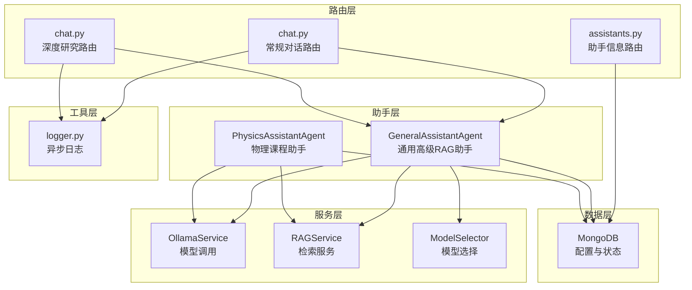
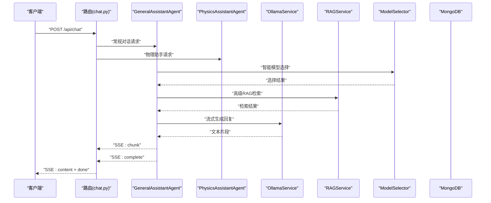
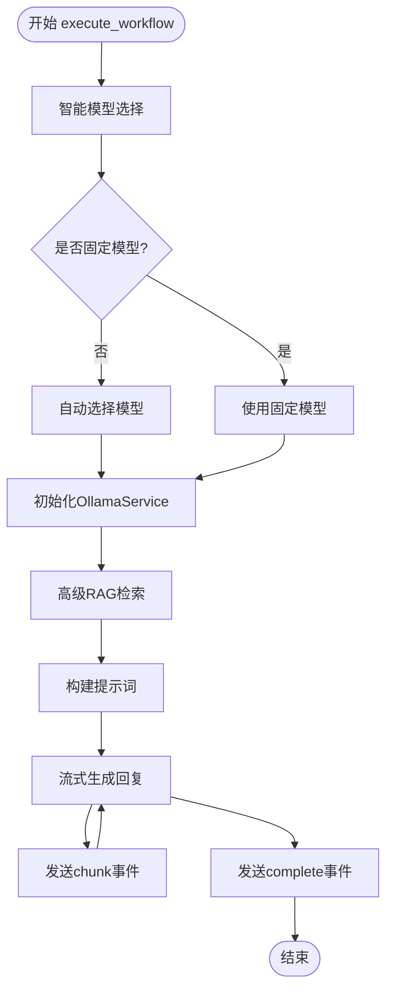
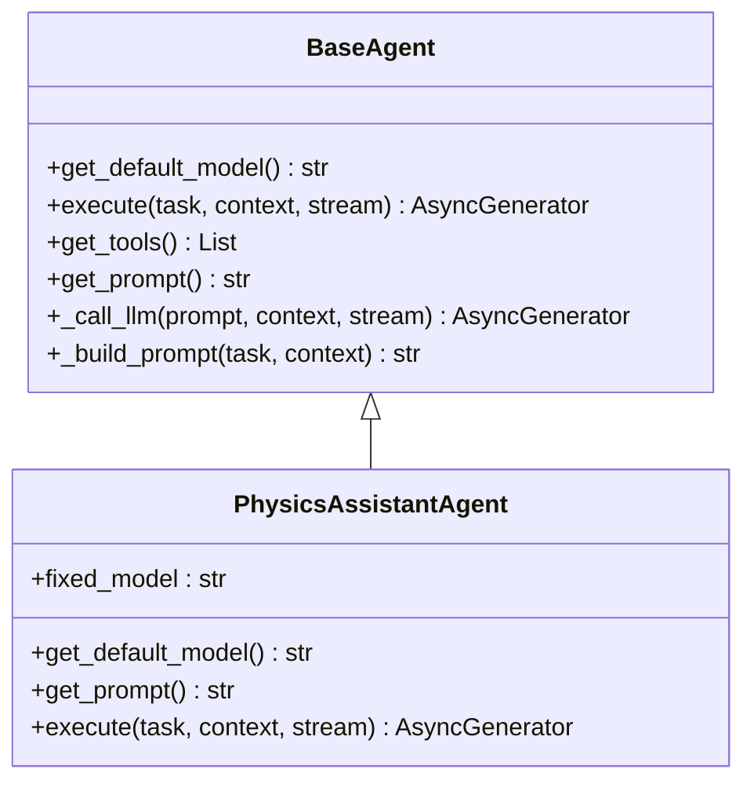
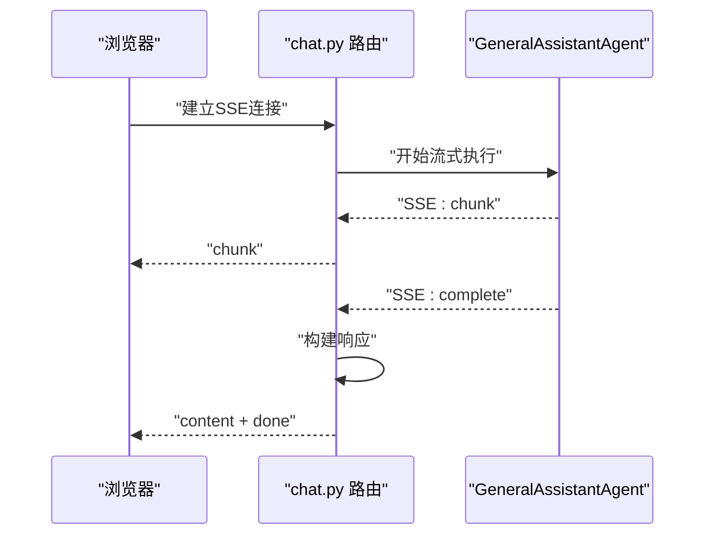
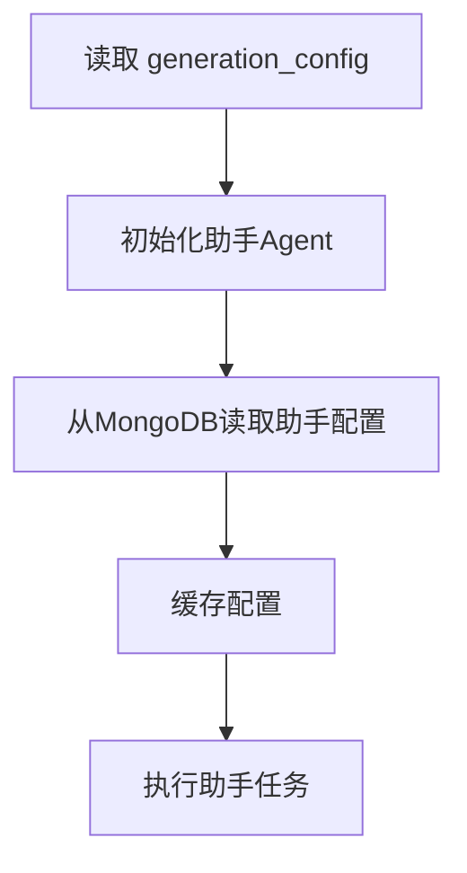
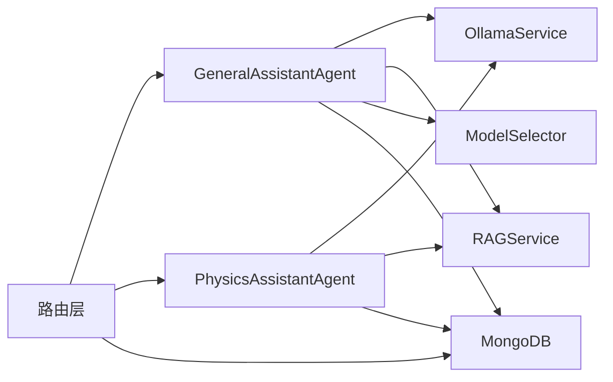

# 代理工作流编排

<cite>
**本文引用的文件**
- [agent_workflow.py](file://agents/workflow/agent_workflow.py)
- [general_assistant_agent.py](file://agents/general_assistant/general_assistant_agent.py)
- [physics_assistant_agent.py](file://agents/physics_assistant/physics_assistant_agent.py)
- [base_agent.py](file://agents/base/base_agent.py)
- [chat.py](file://routers/chat.py)
- [assistants.py](file://routers/assistants.py)
- [course_assistant.py](file://models/course_assistant.py)
- [ollama_service.py](file://services/ollama_service.py)
- [rag_service.py](file://services/rag_service.py)
- [mongodb.py](file://database/mongodb.py)
- [logger.py](file://utils/logger.py)
</cite>

## 更新摘要
**变更内容**
- 移除了复杂的多代理协调工作流架构
- 简化为统一的通用高级RAG助手方法
- 引入了新的单一助手架构，专注于通用对话和深度研究场景
- 更新了路由层以支持新的助手模式

## 目录
1. [简介](#简介)
2. [项目结构](#项目结构)
3. [核心组件](#核心组件)
4. [架构总览](#架构总览)
5. [详细组件分析](#详细组件分析)
6. [依赖分析](#依赖分析)
7. [性能考虑](#性能考虑)
8. [故障排除指南](#故障排除指南)
9. [结论](#结论)
10. [附录](#附录)

## 简介
本文件面向"代理工作流编排系统"的技术文档，围绕新的单一助手架构展开，重点介绍通用高级RAG助手Agent的设计理念与实现方式。系统采用"统一助手方法"替代之前的复杂多代理协调工作流，通过智能模型选择、高级RAG检索、流式响应等特性，为用户提供更加简洁高效的对话体验。文档涵盖助手Agent的架构设计、执行流程、配置管理、性能优化和故障排除等内容。

## 项目结构
系统采用"路由层-助手层-服务层-基础设施层"的分层组织，核心助手位于 agents/general_assistant，物理助手位于 agents/physics_assistant，路由层提供统一的对话接口，服务层封装Ollama与RAG，数据库层提供MongoDB连接，日志与监控位于utils。

**图表来源**
- [chat.py:615-750](file://routers/chat.py#L615-L750)
- [chat.py:753-912](file://routers/chat.py#L753-L912)
- [assistants.py:1-120](file://routers/assistants.py#L1-L120)
- [general_assistant_agent.py:1-167](file://agents/general_assistant/general_assistant_agent.py#L1-L167)
- [physics_assistant_agent.py:1-175](file://agents/physics_assistant/physics_assistant_agent.py#L1-L175)
- [ollama_service.py:9-674](file://services/ollama_service.py#L9-L674)
- [rag_service.py:7-248](file://services/rag_service.py#L7-L248)
- [mongodb.py:92-199](file://database/mongodb.py#L92-L199)
- [logger.py:15-88](file://utils/logger.py#L15-L88)

## 核心组件
- **GeneralAssistantAgent**：通用高级RAG助手，封装混合检索、知识图谱、重排和LLM生成的完整流程，支持智能模型选择和流式响应。
- **PhysicsAssistantAgent**：物理课程助手，提供传统的RAG检索增强对话功能，支持模型动态选择和对话历史管理。
- **BaseAgent**：所有助手的基础抽象类，统一模型初始化、提示词构建、LLM调用与工具接口。
- **OllamaService**：封装Ollama模型调用，支持流式与非流式生成，内置超时与空闲检测。
- **RAGService**：封装高级检索流程，支持向量搜索、关键词搜索、图谱搜索和重排。
- **ModelSelector**：智能模型选择器，根据问题复杂度自动选择合适的模型。
- **MongoDB**：提供助手配置与状态存储，支持异步连接与连接池优化。
- **日志系统**：异步文件处理器，避免阻塞主线程。

**章节来源**
- [general_assistant_agent.py:9-167](file://agents/general_assistant/general_assistant_agent.py#L9-L167)
- [physics_assistant_agent.py:9-175](file://agents/physics_assistant/physics_assistant_agent.py#L9-L175)
- [base_agent.py:8-122](file://agents/base/base_agent.py#L8-L122)
- [ollama_service.py:9-674](file://services/ollama_service.py#L9-L674)
- [rag_service.py:7-248](file://services/rag_service.py#L7-L248)
- [mongodb.py:92-199](file://database/mongodb.py#L92-L199)
- [logger.py:15-88](file://utils/logger.py#L15-L88)

## 架构总览
新的单一助手架构采用"统一入口-智能路由-专用助手"的设计模式。路由层根据请求类型自动选择相应的助手Agent，助手Agent内部集成高级RAG检索、智能模型选择和流式响应功能。系统通过BaseAgent统一抽象，确保不同助手Agent的一致性和可扩展性。

**图表来源**
- [chat.py:615-750](file://routers/chat.py#L615-L750)
- [general_assistant_agent.py:49-167](file://agents/general_assistant/general_assistant_agent.py#L49-L167)
- [physics_assistant_agent.py:49-175](file://agents/physics_assistant/physics_assistant_agent.py#L49-L175)
- [ollama_service.py:50-93](file://services/ollama_service.py#L50-L93)
- [rag_service.py:10-191](file://services/rag_service.py#L10-L191)

## 详细组件分析

### GeneralAssistantAgent 统一助手架构
- **智能模型选择**：根据问题复杂度和类型自动选择最适合的模型，支持动态切换。
- **高级RAG检索**：集成向量搜索、关键词搜索、图谱搜索和重排算法，提供更精准的上下文。
- **流式响应**：支持增量输出，前端可以实时看到生成过程。
- **统一接口**：通过BaseAgent抽象，提供一致的execute接口和事件模型。

**图表来源**
- [general_assistant_agent.py:49-167](file://agents/general_assistant/general_assistant_agent.py#L49-L167)

**章节来源**
- [general_assistant_agent.py:49-167](file://agents/general_assistant/general_assistant_agent.py#L49-L167)

### PhysicsAssistantAgent 传统助手实现
- **基础RAG流程**：提供标准的RAG检索增强对话功能，支持可选的RAG启用。
- **对话历史管理**：自动获取和维护最近的对话历史，提升交互连贯性。
- **模型动态选择**：根据问题类型自动选择合适的模型，支持固定模型覆盖。
- **错误处理**：RAG检索失败不影响回复生成，确保服务可用性。

**图表来源**
- [base_agent.py:8-122](file://agents/base/base_agent.py#L8-L122)
- [physics_assistant_agent.py:9-175](file://agents/physics_assistant/physics_assistant_agent.py#L9-L175)

**章节来源**
- [physics_assistant_agent.py:49-175](file://agents/physics_assistant/physics_assistant_agent.py#L49-L175)

### 路由层统一接口
- **常规对话路由**：处理匿名模式下的标准对话请求，使用GeneralAssistantAgent。
- **深度研究路由**：支持多代理协调工作流，返回HTML格式的深度研究结果。
- **助手信息路由**：提供助手列表查询功能，支持匿名访问。
- **流式响应**：统一使用SSE协议，支持客户端断开检测和优雅关闭。

**图表来源**
- [chat.py:615-750](file://routers/chat.py#L615-L750)
- [chat.py:753-912](file://routers/chat.py#L753-L912)

**章节来源**
- [chat.py:615-750](file://routers/chat.py#L615-L750)
- [chat.py:753-912](file://routers/chat.py#L753-L912)

### 配置与状态管理
- **助手配置**：从MongoDB的course_assistants集合读取助手配置，支持默认助手标识。
- **模型配置**：通过generation_config注入llm_model和embedding_model等参数。
- **对话历史**：自动维护最近的对话记录，支持跨请求的上下文延续。
- **日志管理**：异步文件处理器，支持不同级别的日志输出。

**图表来源**
- [chat.py:654-661](file://routers/chat.py#L654-L661)
- [assistants.py:40-73](file://routers/assistants.py#L40-L73)
- [general_assistant_agent.py:72-78](file://agents/general_assistant/general_assistant_agent.py#L72-L78)

**章节来源**
- [chat.py:654-661](file://routers/chat.py#L654-L661)
- [assistants.py:40-73](file://routers/assistants.py#L40-L73)
- [course_assistant.py:8-77](file://models/course_assistant.py#L8-L77)

## 依赖分析
- **组件耦合**：GeneralAssistantAgent依赖OllamaService、RAGService和ModelSelector；PhysicsAssistantAgent依赖OllamaService和RAGService；路由层依赖助手Agent和MongoDB。
- **外部依赖**：Ollama（本地推理）、MongoDB（配置与状态）、RAG（检索）。
- **潜在风险**：模型选择失败回退、RAG检索异常处理、客户端断开连接检测。

**图表来源**
- [general_assistant_agent.py:1-167](file://agents/general_assistant/general_assistant_agent.py#L1-L167)
- [physics_assistant_agent.py:1-175](file://agents/physics_assistant/physics_assistant_agent.py#L1-L175)
- [chat.py:615-750](file://routers/chat.py#L615-L750)
- [ollama_service.py:9-35](file://services/ollama_service.py#L9-L35)
- [rag_service.py:10-33](file://services/rag_service.py#L10-L33)

**章节来源**
- [general_assistant_agent.py:1-167](file://agents/general_assistant/general_assistant_agent.py#L1-L167)
- [physics_assistant_agent.py:1-175](file://agents/physics_assistant/physics_assistant_agent.py#L1-L175)
- [chat.py:615-750](file://routers/chat.py#L615-L750)

## 性能考虑
- **智能模型选择**：ModelSelector根据问题复杂度选择合适模型，平衡性能和质量。
- **流式生成**：OllamaService使用线程池与队列实现异步流式输出，避免阻塞事件循环。
- **RAG优化**：RAGService支持并行检索和结果去重，提升检索效率。
- **连接池**：MongoDB连接池参数可调，建议根据并发与资源情况调整。
- **内存管理**：助手Agent支持延迟初始化，按需加载模型和服务。

**章节来源**
- [general_assistant_agent.py:80-95](file://agents/general_assistant/general_assistant_agent.py#L80-L95)
- [physics_assistant_agent.py:80-95](file://agents/physics_assistant/physics_assistant_agent.py#L80-L95)
- [ollama_service.py:453-637](file://services/ollama_service.py#L453-L637)
- [mongodb.py:122-136](file://database/mongodb.py#L122-L136)

## 故障排除指南
- **模型选择失败**：ModelSelector回退到默认模型，检查模型可用性和配置。
- **RAG检索异常**：RAGService支持回退到无上下文模式，检查集合名称和嵌入模型。
- **客户端断开**：路由层检测客户端断开连接，自动停止流式输出。
- **助手配置错误**：MongoDB连接失败时检查连接串和认证信息。
- **流式超时**：OllamaService设置了较长超时，检查模型服务可用性。

**章节来源**
- [general_assistant_agent.py:87-89](file://agents/general_assistant/general_assistant_agent.py#L87-L89)
- [physics_assistant_agent.py:119-121](file://agents/physics_assistant/physics_assistant_agent.py#L119-L121)
- [chat.py:711-725](file://routers/chat.py#L711-L725)
- [mongodb.py:154-184](file://database/mongodb.py#L154-L184)

## 结论
新的单一助手架构通过"统一入口-智能助手-流式响应"的设计，实现了更加简洁高效的对话系统。GeneralAssistantAgent集成了智能模型选择、高级RAG检索和流式响应功能，为用户提供了更好的交互体验。系统的关键优势在于：统一的接口设计、智能的模型选择、强大的RAG检索能力和完善的错误处理机制。在性能方面，智能模型选择和流式生成有效提升了响应速度；在可靠性方面，RAG检索异常回退和客户端断开检测增强了鲁棒性。后续可以在保持架构简洁的前提下，进一步优化模型选择算法和RAG检索效果。

## 附录

### 助手配置参数与超时设置
- **模型配置**：通过generation_config注入llm_model和embedding_model参数。
- **助手配置**：从MongoDB的course_assistants集合读取助手信息，支持默认助手标识。
- **Ollama超时**：默认600秒，适用于大模型生成；可根据部署环境调整。
- **MongoDB连接池**：最大/最小连接数、空闲超时、服务器选择等参数可调。
- **日志级别**：可通过环境变量设置，生产环境建议降低文件日志级别。

**章节来源**
- [chat.py:654-661](file://routers/chat.py#L654-L661)
- [assistants.py:40-73](file://routers/assistants.py#L40-L73)
- [general_assistant_agent.py:72-78](file://agents/general_assistant/general_assistant_agent.py#L72-L78)
- [ollama_service.py:32-34](file://services/ollama_service.py#L32-L34)
- [mongodb.py:122-136](file://database/mongodb.py#L122-L136)

### 扩展开发指南
- **新增助手Agent**：继承BaseAgent，实现get_default_model、get_prompt与execute；在路由层注册新接口。
- **自定义模型选择**：扩展ModelSelector的select_model方法，增强智能选择能力。
- **自定义流式输出**：在助手Agent的execute中按需产出chunk/complete事件，前端以SSE接收。
- **配置管理**：在MongoDB的course_assistants中新增助手配置，支持默认助手标识。

**章节来源**
- [base_agent.py:27-55](file://agents/base/base_agent.py#L27-L55)
- [course_assistant.py:8-77](file://models/course_assistant.py#L8-L77)

### 典型使用场景与最佳实践
- **场景一：通用对话助手**
  - 使用GeneralAssistantAgent处理日常问答，享受智能模型选择和高级RAG检索。
  - 最佳实践：合理设置generation_config以匹配不同任务的模型偏好。
- **场景二：物理课程问答**
  - 使用PhysicsAssistantAgent处理专业性较强的物理问题。
  - 最佳实践：启用RAG检索以获得更准确的答案，维护对话历史提升交互体验。
- **场景三：助手管理**
  - 通过assistants.py路由管理助手配置，支持默认助手标识和快速提示词。
  - 最佳实践：规范助手命名和集合名称，确保系统稳定运行。

**章节来源**
- [general_assistant_agent.py:49-167](file://agents/general_assistant/general_assistant_agent.py#L49-L167)
- [physics_assistant_agent.py:49-175](file://agents/physics_assistant/physics_assistant_agent.py#L49-L175)
- [assistants.py:40-120](file://routers/assistants.py#L40-L120)