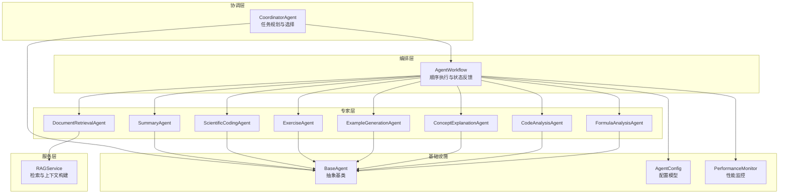
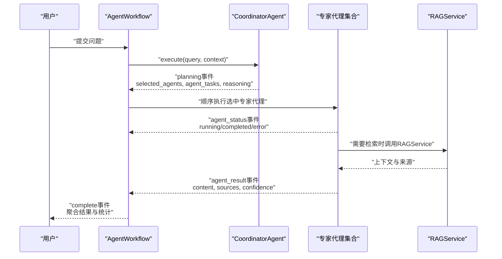
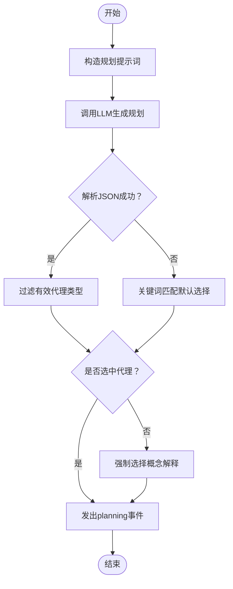
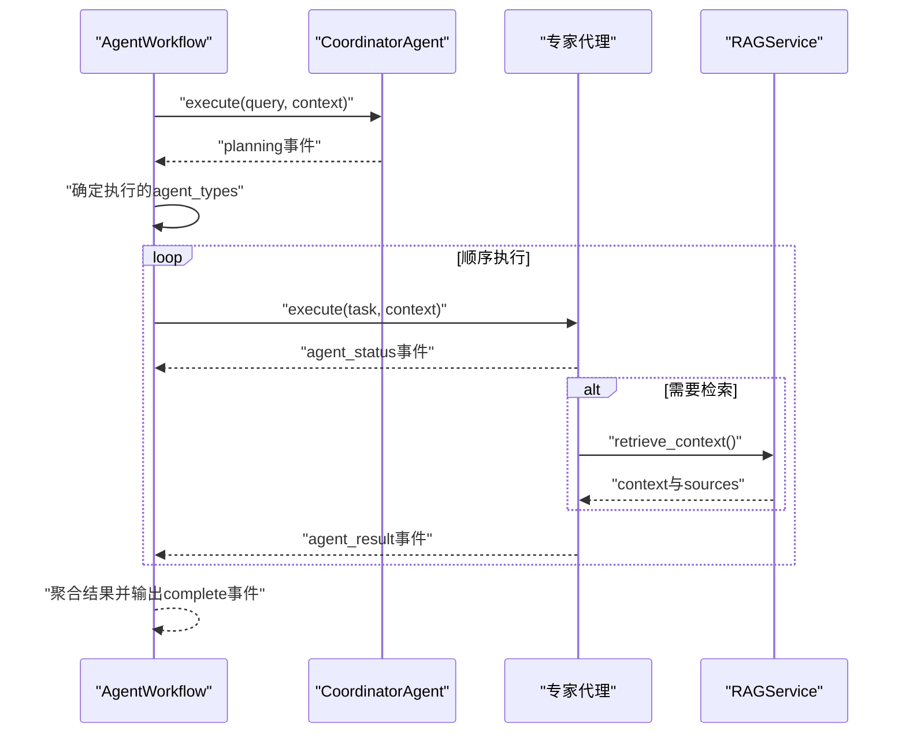
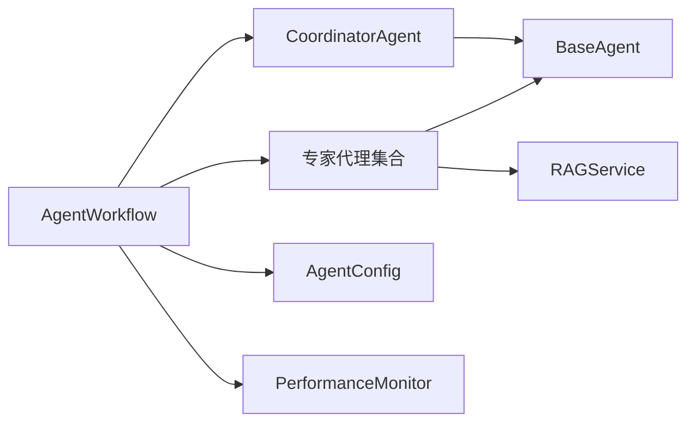

# 协调器代理

<cite>
**本文引用的文件**
- [agents/coordinator/coordinator_agent.py](file://agents/coordinator/coordinator_agent.py)
- [agents/coordinator/__init__.py](file://agents/coordinator/__init__.py)
- [agents/base/base_agent.py](file://agents/base/base_agent.py)
- [agents/workflow/agent_workflow.py](file://agents/workflow/agent_workflow.py)
- [agents/experts/concept_explanation_agent.py](file://agents/experts/concept_explanation_agent.py)
- [agents/experts/document_retrieval_agent.py](file://agents/experts/document_retrieval_agent.py)
- [agents/experts/summary_agent.py](file://agents/experts/summary_agent.py)
- [agents/experts/formula_analysis_agent.py](file://agents/experts/formula_analysis_agent.py)
- [agents/experts/code_analysis_agent.py](file://agents/experts/code_analysis_agent.py)
- [agents/experts/exercise_agent.py](file://agents/experts/exercise_agent.py)
- [agents/experts/scientific_coding_agent.py](file://agents/experts/scientific_coding_agent.py)
- [services/rag_service.py](file://services/rag_service.py)
- [models/agent_config.py](file://models/agent_config.py)
- [utils/monitoring.py](file://utils/monitoring.py)
</cite>

## 目录
1. [简介](#简介)
2. [项目结构](#项目结构)
3. [核心组件](#核心组件)
4. [架构总览](#架构总览)
5. [详细组件分析](#详细组件分析)
6. [依赖分析](#依赖分析)
7. [性能考虑](#性能考虑)
8. [故障排查指南](#故障排查指南)
9. [结论](#结论)
10. [附录](#附录)

## 简介
本技术文档围绕“协调器代理”在多代理系统中的核心作用与工作机制展开，重点阐述其在任务规划、专家代理选择、任务分发与结果整合方面的职责；并进一步解释协调器如何依据用户需求与上下文信息进行智能决策，如何管理多个专家代理的协作过程（包括代理选择算法、顺序执行与状态反馈），以及其监控与控制能力（状态跟踪、性能评估、异常处理）。文档还提供配置优化建议与扩展开发指导，并给出典型应用场景与使用示例。

## 项目结构
多代理系统采用“协调器 + 专家代理 + 工作流编排”的分层设计：
- 协调器代理负责对用户问题进行语义分析，规划所需专家代理及其任务；
- 专家代理各自承担特定领域的专项任务（如文档检索、公式分析、代码分析、概念解释、示例生成、习题、科学计算编码、总结等）；
- 工作流编排器负责异步初始化与顺序执行专家代理，汇总结果并提供状态反馈；
- RAG服务为需要外部知识的专家提供检索支持；
- 配置模型与监控工具分别提供配置管理与性能观测能力。

图表来源
- [agents/coordinator/coordinator_agent.py:1-252](file://agents/coordinator/coordinator_agent.py#L1-L252)
- [agents/workflow/agent_workflow.py:1-388](file://agents/workflow/agent_workflow.py#L1-L388)
- [agents/experts/document_retrieval_agent.py:1-79](file://agents/experts/document_retrieval_agent.py#L1-L79)
- [agents/experts/formula_analysis_agent.py:1-107](file://agents/experts/formula_analysis_agent.py#L1-L107)
- [agents/experts/code_analysis_agent.py:1-79](file://agents/experts/code_analysis_agent.py#L1-L79)
- [agents/experts/concept_explanation_agent.py:1-70](file://agents/experts/concept_explanation_agent.py#L1-L70)
- [agents/experts/exercise_agent.py:1-102](file://agents/experts/exercise_agent.py#L1-L102)
- [agents/experts/scientific_coding_agent.py:1-82](file://agents/experts/scientific_coding_agent.py#L1-L82)
- [agents/experts/summary_agent.py:1-87](file://agents/experts/summary_agent.py#L1-L87)
- [services/rag_service.py:1-248](file://services/rag_service.py#L1-L248)
- [agents/base/base_agent.py:1-122](file://agents/base/base_agent.py#L1-L122)
- [models/agent_config.py:1-24](file://models/agent_config.py#L1-L24)
- [utils/monitoring.py:1-185](file://utils/monitoring.py#L1-L185)

章节来源
- [agents/coordinator/coordinator_agent.py:1-252](file://agents/coordinator/coordinator_agent.py#L1-L252)
- [agents/workflow/agent_workflow.py:1-388](file://agents/workflow/agent_workflow.py#L1-L388)

## 核心组件
- 协调器代理（CoordinatorAgent）
  - 职责：接收用户问题，基于系统提示词与关键词规则进行任务规划，选择必要专家代理并分配具体任务，输出规划结果（包含选中代理列表、任务描述与选择理由）。
  - 决策机制：优先通过大模型生成JSON规划结果；若解析失败，回退到关键词匹配的默认选择逻辑；并对无效代理类型进行过滤与兜底。
  - 输出：以事件流形式返回规划阶段结果，供工作流编排器后续执行。
- 专家代理（Experts）
  - 文档检索：调用RAG服务检索上下文并总结，返回内容、来源与置信度。
  - 公式分析：识别并解释LaTeX/行内公式，说明物理意义与适用条件。
  - 代码分析：识别代码片段，解释逻辑、优缺点与改进建议。
  - 概念解释：深入解释专业概念，提供定义、公式、应用与关系。
  - 示例生成：提供实际应用示例与类比。
  - 习题：区分出题与解题两种模式，提供题目与详细解题步骤。
  - 科学计算编码：生成MATLAB/Python科学计算代码，含注释与使用说明。
  - 总结：汇总各专家结果，提炼核心要点与学习建议。
- 工作流编排（AgentWorkflow）
  - 异步初始化协调器与专家代理，按顺序执行专家任务，实时反馈状态（pending/running/completed/error），收集结果并输出最终聚合。
  - 支持手动指定启用的专家代理，或使用协调器的选择结果。
- 基类与工具
  - BaseAgent：统一的异步执行接口、提示词构建、LLM调用封装。
  - RAGService：并行检索文档与资源，构建上下文与来源清单。
  - AgentConfig：Agent配置模型（推理模型、嵌入模型）。
  - PerformanceMonitor：请求耗时统计、系统指标采集与慢请求告警。

章节来源
- [agents/coordinator/coordinator_agent.py:1-252](file://agents/coordinator/coordinator_agent.py#L1-L252)
- [agents/workflow/agent_workflow.py:1-388](file://agents/workflow/agent_workflow.py#L1-L388)
- [agents/base/base_agent.py:1-122](file://agents/base/base_agent.py#L1-L122)
- [services/rag_service.py:1-248](file://services/rag_service.py#L1-L248)
- [models/agent_config.py:1-24](file://models/agent_config.py#L1-L24)
- [utils/monitoring.py:1-185](file://utils/monitoring.py#L1-L185)

## 架构总览
协调器代理位于系统入口层，负责“规划—分发—汇总”的中枢角色。工作流编排器承接规划结果，顺序驱动专家代理执行，期间持续上报状态与进度，最终由总结代理对多源结果进行整合输出。

图表来源
- [agents/workflow/agent_workflow.py:106-336](file://agents/workflow/agent_workflow.py#L106-L336)
- [agents/coordinator/coordinator_agent.py:55-168](file://agents/coordinator/coordinator_agent.py#L55-L168)
- [agents/experts/document_retrieval_agent.py:25-77](file://agents/experts/document_retrieval_agent.py#L25-L77)
- [services/rag_service.py:10-191](file://services/rag_service.py#L10-L191)

## 详细组件分析

### 协调器代理（CoordinatorAgent）
- 角色定位
  - 作为多代理系统的“任务规划师”，负责根据用户问题智能选择必要的专家代理组合，并为每个代理分配具体任务与理由说明。
- 决策逻辑
  - 主流程：构造规划提示词 → 调用LLM生成JSON规划 → 解析JSON（兼容Markdown代码块）→ 过滤有效代理 → 若解析失败或为空，回退到关键词匹配的默认选择。
  - 关键词规则覆盖：文档/资料/知识库/检索/查询 → 文档检索；公式/推导/计算/数学/物理公式 → 公式分析；代码/程序/编程/算法 → 代码分析；概念/理论/原理/解释/是什么/为什么 → 概念解释；示例/例子/案例/应用 → 示例生成；习题/题目/练习/解题 → 习题；matlab/python/科学计算/数值计算 → 科学计算编码；复杂问题 → 自动附加总结。
- 输出结构
  - planning事件：包含原始规划文本、选中代理列表、任务映射与选择理由。
  - error事件：规划失败时返回错误信息。
- 容错与回退
  - JSON解析失败时自动切换默认选择逻辑，并记录警告日志。
  - 未选中任何代理时强制至少选择概念解释专家，保证最小可用输出。

图表来源
- [agents/coordinator/coordinator_agent.py:55-168](file://agents/coordinator/coordinator_agent.py#L55-L168)
- [agents/coordinator/coordinator_agent.py:170-213](file://agents/coordinator/coordinator_agent.py#L170-L213)

章节来源
- [agents/coordinator/coordinator_agent.py:1-252](file://agents/coordinator/coordinator_agent.py#L1-L252)

### 专家代理（Experts）
- 文档检索（DocumentRetrievalAgent）
  - 通过RAGService检索上下文，调用LLM进行总结，返回内容、来源、推荐资源与置信度。
- 公式分析（FormulaAnalysisAgent）
  - 识别LaTeX/行内公式，解释物理意义、变量含义、适用条件与应用场景。
- 代码分析（CodeAnalysisAgent）
  - 识别代码片段，解释功能与逻辑，提供优缺点与改进建议。
- 概念解释（ConceptExplanationAgent）
  - 深入解释专业概念，提供定义、公式、应用与关系。
- 示例生成（ExampleGenerationAgent）
  - 提供实际应用示例与类比，帮助理解抽象概念。
- 习题（ExerciseAgent）
  - 自动判断出题或解题模式，分别生成题目或提供详细解题步骤。
- 科学计算编码（ScientificCodingAgent）
  - 生成MATLAB/Python科学计算代码，含注释、变量命名规范与可视化示例。
- 总结（SummaryAgent）
  - 汇总各专家结果，提炼核心要点与学习建议。

章节来源
- [agents/experts/document_retrieval_agent.py:1-79](file://agents/experts/document_retrieval_agent.py#L1-L79)
- [agents/experts/formula_analysis_agent.py:1-107](file://agents/experts/formula_analysis_agent.py#L1-L107)
- [agents/experts/code_analysis_agent.py:1-79](file://agents/experts/code_analysis_agent.py#L1-L79)
- [agents/experts/concept_explanation_agent.py:1-70](file://agents/experts/concept_explanation_agent.py#L1-L70)
- [agents/experts/exercise_agent.py:1-102](file://agents/experts/exercise_agent.py#L1-L102)
- [agents/experts/scientific_coding_agent.py:1-82](file://agents/experts/scientific_coding_agent.py#L1-L82)
- [agents/experts/summary_agent.py:1-87](file://agents/experts/summary_agent.py#L1-L87)

### 工作流编排（AgentWorkflow）
- 初始化与配置
  - 异步加载协调器与专家代理的模型配置（推理模型/嵌入模型），支持从数据库读取或传入生成配置。
- 任务执行
  - 协调器先期规划 → 编排器顺序执行专家代理 → 实时发送状态事件（pending/running/completed/error）→ 收集结果并输出聚合。
- 容错与回退
  - 协调器未返回选择时回退到全部专家；未知代理类型时跳过并记录警告；异常捕获后返回错误状态。
- 流式输出
  - 支持流式输出中间状态与增量内容，便于前端实时展示进度与内容。

图表来源
- [agents/workflow/agent_workflow.py:106-336](file://agents/workflow/agent_workflow.py#L106-L336)

章节来源
- [agents/workflow/agent_workflow.py:1-388](file://agents/workflow/agent_workflow.py#L1-L388)

### 基类与工具（BaseAgent、RAGService、AgentConfig、PerformanceMonitor）
- BaseAgent
  - 统一抽象接口：异步execute、提示词构建、LLM调用封装。
- RAGService
  - 并行检索文档与资源，构建上下文与来源清单，支持知识空间与对话附件兼容。
- AgentConfig
  - 定义单个Agent的推理模型与嵌入模型配置，支持列表响应。
- PerformanceMonitor
  - 请求耗时统计、系统指标采集、慢请求告警，提供装饰器与上下文管理器。

章节来源
- [agents/base/base_agent.py:1-122](file://agents/base/base_agent.py#L1-L122)
- [services/rag_service.py:1-248](file://services/rag_service.py#L1-L248)
- [models/agent_config.py:1-24](file://models/agent_config.py#L1-L24)
- [utils/monitoring.py:1-185](file://utils/monitoring.py#L1-L185)

## 依赖分析
- 协调器代理依赖BaseAgent提供的LLM调用与提示词构建能力；其规划结果由工作流编排器消费。
- 专家代理依赖BaseAgent统一接口；其中文档检索代理依赖RAGService进行上下文检索。
- 工作流编排器依赖协调器与专家代理类映射，负责实例化与顺序执行；同时依赖AgentConfig与PerformanceMonitor进行配置与监控。
- RAGService独立于专家代理，但被文档检索代理使用；其内部实现并行检索与来源去重。

图表来源
- [agents/coordinator/coordinator_agent.py:1-252](file://agents/coordinator/coordinator_agent.py#L1-L252)
- [agents/workflow/agent_workflow.py:1-388](file://agents/workflow/agent_workflow.py#L1-L388)
- [agents/experts/document_retrieval_agent.py:1-79](file://agents/experts/document_retrieval_agent.py#L1-L79)
- [services/rag_service.py:1-248](file://services/rag_service.py#L1-L248)
- [models/agent_config.py:1-24](file://models/agent_config.py#L1-L24)
- [utils/monitoring.py:1-185](file://utils/monitoring.py#L1-L185)

章节来源
- [agents/coordinator/coordinator_agent.py:1-252](file://agents/coordinator/coordinator_agent.py#L1-L252)
- [agents/workflow/agent_workflow.py:1-388](file://agents/workflow/agent_workflow.py#L1-L388)

## 性能考虑
- 执行路径
  - 协调器规划阶段为一次LLM调用，成本相对固定；专家代理执行阶段按顺序串行，便于前端实时展示，但整体时延受代理数量与复杂度影响。
- 检索开销
  - 文档检索代理依赖RAGService并行检索，需关注集合数量与top_k设置；建议在高并发场景下限制检索范围与结果条数。
- 监控与告警
  - 使用PerformanceMonitor记录请求耗时与慢请求告警，结合系统指标（CPU/内存/磁盘）进行容量规划与瓶颈定位。
- 配置优化
  - 通过AgentConfig为不同Agent配置更合适的推理模型与嵌入模型，平衡质量与速度；在工作流中按需启用专家代理，避免不必要的串行开销。

[本节为通用性能建议，无需引用具体文件]

## 故障排查指南
- 协调器规划失败
  - 现象：返回error事件，内容包含失败原因。
  - 处理：检查提示词与上下文是否合理；查看日志中JSON解析失败的警告；确认代理类型是否在有效列表中。
- 专家代理执行异常
  - 现象：agent_status事件显示error，或agent_result事件携带错误内容。
  - 处理：针对具体代理查看其日志；文档检索代理需检查RAG服务可用性与检索参数；代码/公式分析代理需确认输入是否包含可识别内容。
- 工作流未返回结果
  - 现象：仅收到planning事件，未见complete事件。
  - 处理：确认enabled_agents或协调器选择是否为空；检查代理实例化是否成功；核对上下文字段（如document_id/assistant_id/knowledge_space_ids）。
- 性能问题
  - 现象：响应时间过长或慢请求频繁。
  - 处理：使用PerformanceMonitor获取统计信息与系统指标，定位瓶颈；调整模型配置、减少检索范围或并行度。

章节来源
- [agents/coordinator/coordinator_agent.py:162-168](file://agents/coordinator/coordinator_agent.py#L162-L168)
- [agents/workflow/agent_workflow.py:306-336](file://agents/workflow/agent_workflow.py#L306-L336)
- [agents/experts/document_retrieval_agent.py:36-77](file://agents/experts/document_retrieval_agent.py#L36-L77)
- [utils/monitoring.py:118-185](file://utils/monitoring.py#L118-L185)

## 结论
协调器代理在多代理系统中扮演“任务规划师”的关键角色，通过智能选择与任务分发，将复杂的用户问题拆解为可执行的专家代理子任务，并由工作流编排器顺序执行与状态反馈。其决策逻辑兼顾大模型生成与关键词回退，具备良好的鲁棒性；配合RAG服务与监控工具，能够满足复杂场景下的质量与性能要求。通过合理的配置与扩展，系统可在教学、科研与工程实践中提供高质量的协同智能服务。

[本节为总结性内容，无需引用具体文件]

## 附录

### 配置优化指南
- 模型选择
  - 协调器：建议使用具备强推理与JSON生成能力的模型；可通过AgentConfig为协调器单独配置。
  - 专家代理：根据任务特性选择不同模型（如公式/代码分析可选用参数更大的模型）。
- 检索参数
  - 控制RAGService的top_k与score_threshold，平衡召回与质量；限定知识空间集合以减少检索范围。
- 并发与顺序
  - 专家代理按顺序执行，便于前端展示；若业务允许，可评估将部分独立代理改为并行执行（需扩展编排器）。
- 日志与监控
  - 启用PerformanceMonitor记录慢请求与系统指标，定期分析统计信息以指导容量规划。

章节来源
- [models/agent_config.py:1-24](file://models/agent_config.py#L1-L24)
- [services/rag_service.py:10-191](file://services/rag_service.py#L10-L191)
- [utils/monitoring.py:1-185](file://utils/monitoring.py#L1-L185)

### 扩展开发建议
- 新增专家代理
  - 继承BaseAgent，实现get_default_model、get_prompt与execute；在AgentWorkflow的AGENT_MAP中注册映射。
- 自定义协调器策略
  - 在CoordinatorAgent中扩展提示词与关键词规则，或引入更复杂的分类器/规则引擎。
- 工作流增强
  - 支持并行执行、优先级调度、动态路由与结果融合策略；增加代理间依赖图与执行图可视化。
- 配置中心化
  - 将AgentConfig迁移到集中式配置服务，支持热更新与灰度发布。

章节来源
- [agents/base/base_agent.py:1-122](file://agents/base/base_agent.py#L1-L122)
- [agents/workflow/agent_workflow.py:47-104](file://agents/workflow/agent_workflow.py#L47-L104)
- [agents/coordinator/coordinator_agent.py:15-53](file://agents/coordinator/coordinator_agent.py#L15-L53)

### 实际应用场景与使用示例
- 场景一：物理学习问答
  - 输入：包含公式与概念的问题。
  - 协调器：选择“公式分析+概念解释+示例生成”，必要时附加“总结”。
  - 输出：公式解释、概念定义、示例与总结。
- 场景二：课程作业与实验
  - 输入：习题或实验需求。
  - 协调器：选择“习题（出题/解题）+科学计算编码”，必要时附加“总结”。
  - 输出：题目与解题步骤、代码实现与可视化。
- 场景三：科研文献综述
  - 输入：研究主题与背景。
  - 协调器：选择“文档检索+概念解释+总结”。
  - 输出：检索到的关键内容、概念梳理与综合报告。

[本节为概念性示例，无需引用具体文件]