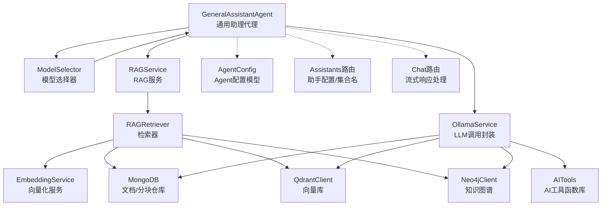
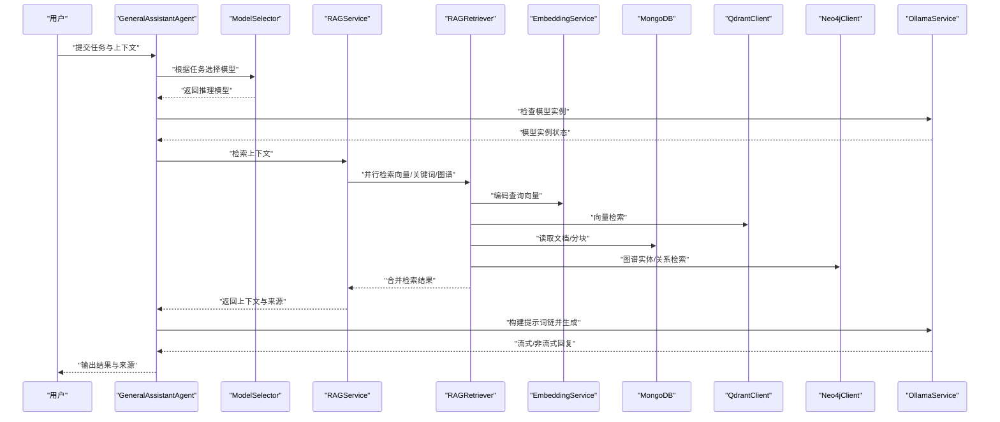
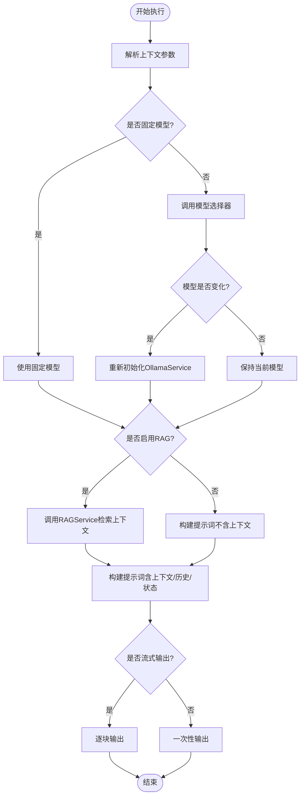
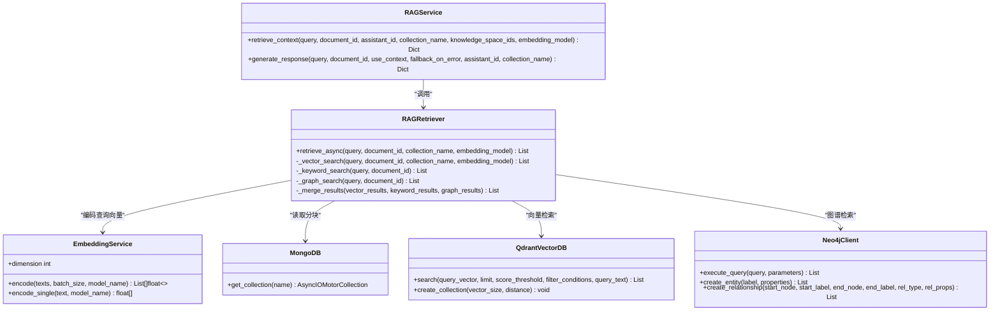
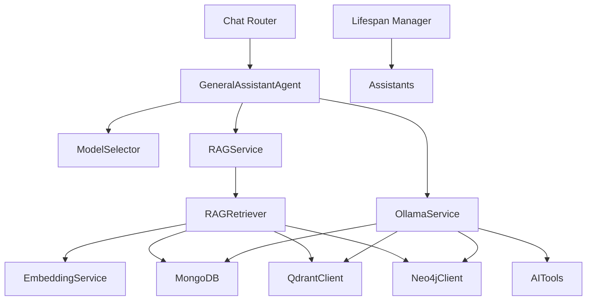

# 通用助理代理

<cite>
**本文引用的文件**
- [general_assistant_agent.py](file://agents/general_assistant/general_assistant_agent.py)
- [base_agent.py](file://agents/base/base_agent.py)
- [model_selector.py](file://services/model_selector.py)
- [rag_service.py](file://services/rag_service.py)
- [rag_retriever.py](file://retrieval/rag_retriever.py)
- [ollama_service.py](file://services/ollama_service.py)
- [chat.py](file://routers/chat.py)
- [lifespan.py](file://utils/lifespan.py)
- [assistants.py](file://routers/assistants.py)
- [agent_config.py](file://models/agent_config.py)
</cite>

## 更新摘要
**变更内容**
- 新增通用助理代理作为物理专用助手的替代方案
- 提供166行通用知识助手实现，支持智能模型选择、动态模型切换和多样化领域处理
- 实现高阶RAG检索（混合检索+重排+LLM生成）一体化流程
- 集成流式生成和错误处理机制
- 支持固定模型和动态模型选择两种模式

## 目录
1. [简介](#简介)
2. [项目结构](#项目结构)
3. [核心组件](#核心组件)
4. [架构总览](#架构总览)
5. [详细组件分析](#详细组件分析)
6. [依赖关系分析](#依赖关系分析)
7. [性能考量](#性能考量)
8. [故障排查指南](#故障排查指南)
9. [结论](#结论)
10. [附录](#附录)

## 简介
通用助理代理（GeneralAssistantAgent）是系统中的通用对话代理，作为物理专用助手的替代方案，负责处理多样化的用户请求，提供高质量的问答与知识服务。其设计目标包括：
- **智能模型选择**：根据问题特征自动选择合适的推理模型，兼顾公式推导与知识问答场景。
- **动态模型切换**：在执行过程中根据需要动态切换模型实例，确保最优性能。
- **高阶RAG检索**：融合向量检索、关键词检索、知识图谱检索与可选重排，提供丰富的上下文信息。
- **流式生成输出**：支持流式和非流式两种生成模式，提升用户体验。
- **多样化领域处理**：适用于物理、数学、工程、计算机科学等多个领域的通用问答场景。
- **统一对话管理**：在提示词链中整合检索知识、对话历史与系统提示词，维持连贯的多轮交互。

## 项目结构
通用助理代理位于 `agents/general_assistant` 目录，围绕 Agent 基类与服务层协作，形成"Agent → 服务 → 数据库/外部服务"的分层架构。关键文件与职责如下：
- `agents/general_assistant/general_assistant_agent.py`：通用助理代理实现，封装执行流程与提示词构建。
- `agents/base/base_agent.py`：Agent 基类，提供统一接口与工具方法。
- `services/model_selector.py`：模型选择器，依据问题特征选择推理模型。
- `services/rag_service.py`：RAG 服务封装，协调检索与上下文构建。
- `retrieval/rag_retriever.py`：检索器，实现混合检索（向量/关键词/图谱）与结果合并。
- `services/ollama_service.py`：LLM 调用封装，构建提示词链、处理工具函数调用与流式生成。
- `routers/chat.py`：聊天路由，集成通用助理代理的流式响应处理。
- `utils/lifespan.py`：生命周期管理，确保默认助手存在。
- `routers/assistants.py`：助手信息路由，提供助手配置与集合名称等元数据。
- `models/agent_config.py`：Agent 配置模型，定义推理模型与向量化模型。

**图表来源**
- [general_assistant_agent.py:1-167](file://agents/general_assistant/general_assistant_agent.py#L1-L167)
- [base_agent.py:1-122](file://agents/base/base_agent.py#L1-L122)
- [model_selector.py:1-206](file://services/model_selector.py#L1-L206)
- [rag_service.py:1-248](file://services/rag_service.py#L1-L248)
- [rag_retriever.py:1-325](file://retrieval/rag_retriever.py#L1-L325)
- [ollama_service.py:1-674](file://services/ollama_service.py#L1-L674)
- [chat.py:628-743](file://routers/chat.py#L628-L743)
- [lifespan.py:35-65](file://utils/lifespan.py#L35-L65)
- [assistants.py:1-120](file://routers/assistants.py#L1-L120)
- [agent_config.py:1-24](file://models/agent_config.py#L1-L24)

**章节来源**
- [general_assistant_agent.py:1-167](file://agents/general_assistant/general_assistant_agent.py#L1-L167)
- [base_agent.py:1-122](file://agents/base/base_agent.py#L1-L122)
- [model_selector.py:1-206](file://services/model_selector.py#L1-L206)
- [rag_service.py:1-248](file://services/rag_service.py#L1-L248)
- [rag_retriever.py:1-325](file://retrieval/rag_retriever.py#L1-L325)
- [ollama_service.py:1-674](file://services/ollama_service.py#L1-L674)
- [chat.py:628-743](file://routers/chat.py#L628-L743)
- [lifespan.py:35-65](file://utils/lifespan.py#L35-L65)
- [assistants.py:1-120](file://routers/assistants.py#L1-L120)
- [agent_config.py:1-24](file://models/agent_config.py#L1-L24)

## 核心组件
- **通用助理代理（GeneralAssistantAgent）**
  - 职责：接收用户任务与上下文，选择模型，执行检索与生成，输出结构化结果与来源信息。
  - 关键能力：智能模型选择、RAG 检索、流式生成、上下文与历史整合、动态模型切换。
- **Agent 基类（BaseAgent）**
  - 职责：统一接口、默认模型、提示词构建、LLM 调用封装。
- **模型选择器（ModelSelector）**
  - 职责：根据问题特征选择推理模型，兼顾公式与知识问答场景。
  - 支持关键词匹配与小模型判断相结合的方式，识别问题是否需要公式生成。
- **RAG 服务（RAGService）**
  - 职责：检索上下文、构建来源清单、聚合文档信息、支持回退策略。
  - 支持多知识空间集合并行检索，构建上下文与来源清单。
- **检索器（RAGRetriever）**
  - 职责：并行执行向量检索、关键词检索、图谱检索，合并与可选重排。
  - 向量检索使用 QdrantClient，关键词检索基于 MongoDB 分块仓库，图谱检索基于 Neo4jClient。
- **LLM 调用封装（OllamaService）**
  - 职责：构建提示词链（系统提示词+知识库状态+文档信息+检索知识+对话历史），处理工具函数调用，流式/非流式生成。
  - 支持动态模型切换，根据需要重新初始化模型实例。
- **聊天路由（Chat Router）**
  - 职责：集成通用助理代理的流式响应处理，支持客户端断开连接检测。
  - 实现 SSE（Server-Sent Events）流式传输，支持性能优化的连接状态检查。

**章节来源**
- [general_assistant_agent.py:9-167](file://agents/general_assistant/general_assistant_agent.py#L9-L167)
- [base_agent.py:8-122](file://agents/base/base_agent.py#L8-L122)
- [model_selector.py:10-206](file://services/model_selector.py#L10-L206)
- [rag_service.py:7-248](file://services/rag_service.py#L7-L248)
- [rag_retriever.py:22-325](file://retrieval/rag_retriever.py#L22-L325)
- [ollama_service.py:9-674](file://services/ollama_service.py#L9-L674)
- [chat.py:628-743](file://routers/chat.py#L628-L743)

## 架构总览
通用助理代理采用"Agent + 服务 + 数据库/外部服务"的分层架构，Agent 负责编排与提示词构建，服务层负责检索与生成，数据层提供文档、向量与图谱支撑。系统通过模型选择器与提示词链实现智能化与个性化。

**图表来源**
- [general_assistant_agent.py:49-167](file://agents/general_assistant/general_assistant_agent.py#L49-L167)
- [model_selector.py:51-132](file://services/model_selector.py#L51-L132)
- [rag_service.py:10-191](file://services/rag_service.py#L10-L191)
- [rag_retriever.py:69-101](file://retrieval/rag_retriever.py#L69-L101)
- [ollama_service.py:50-93](file://services/ollama_service.py#L50-L93)

## 详细组件分析

### 通用助理代理（GeneralAssistantAgent）
- **设计要点**
  - 继承 BaseAgent，统一接口与默认模型。
  - **智能模型选择**：若未固定模型，使用 ModelSelector 基于问题特征选择推理模型。
  - **动态模型切换**：如果模型已更改，需要重新初始化 OllamaService，确保最优性能。
  - **高阶RAG检索**：通过 RAGService 执行混合检索与上下文构建，支持回退策略。
  - **流式生成**：通过 OllamaService 构建提示词链，支持工具函数调用与流式输出。
  - **结果输出**：返回类型、内容、来源与推荐资源，便于前端渲染与溯源。
- **关键流程**
  - **上下文解析**：从 context 中提取助手ID、知识空间ID、文档ID、是否启用RAG、对话历史、生成配置等。
  - **模型选择**：若未固定模型，调用 ModelSelector 选择推理模型，并按需切换 OllamaService 的模型实例。
  - **检索与生成**：调用 RAGService 检索上下文，再调用 OllamaService 生成回复，支持流式与非流式。
  - **错误处理**：捕获检索与生成异常，返回错误类型与内容，保证系统鲁棒性。

**图表来源**
- [general_assistant_agent.py:49-167](file://agents/general_assistant/general_assistant_agent.py#L49-L167)
- [model_selector.py:51-132](file://services/model_selector.py#L51-L132)
- [rag_service.py:10-191](file://services/rag_service.py#L10-L191)
- [ollama_service.py:50-93](file://services/ollama_service.py#L50-L93)

**章节来源**
- [general_assistant_agent.py:9-167](file://agents/general_assistant/general_assistant_agent.py#L9-L167)
- [base_agent.py:8-122](file://agents/base/base_agent.py#L8-L122)

### 模型选择器
- **ModelSelector**
  - 通过关键词匹配与小模型判断相结合的方式，识别问题是否需要公式生成，从而选择 gemma3 或知识型模型。
  - 支持快速判断与后备方案，保证模型选择的稳定性与性能。
  - 使用分析模型（如 qwen2.5:3b）进行快速判断，超时时间为10秒。
  - 提供关键词匹配作为后备方案，包含公式相关和知识型关键词列表。

**章节来源**
- [model_selector.py:10-206](file://services/model_selector.py#L10-L206)

### RAG 服务与检索器
- **RAGService**
  - 负责根据知识空间ID或助手ID解析集合名称，执行并行检索，合并结果并去重，构建上下文与来源清单。
  - 支持文档信息批量查询与来源去重，按分数排序，返回结构化结果。
  - 支持多知识空间集合并行检索，提升检索效率。
- **RAGRetriever**
  - 并行执行向量检索、关键词检索与图谱检索，合并结果并可选重排。
  - 向量检索使用 QdrantClient，关键词检索基于 MongoDB 分块仓库，图谱检索基于 Neo4jClient。
  - 提供同步与异步检索接口，异步接口优先，兼容同步调用场景。

**图表来源**
- [rag_service.py:7-248](file://services/rag_service.py#L7-L248)
- [rag_retriever.py:22-325](file://retrieval/rag_retriever.py#L22-L325)
- [ollama_service.py:1-674](file://services/ollama_service.py#L1-L674)

**章节来源**
- [rag_service.py:10-242](file://services/rag_service.py#L10-L242)
- [rag_retriever.py:69-325](file://retrieval/rag_retriever.py#L69-L325)

### LLM 调用封装与提示词链
- **OllamaService**
  - 构建提示词链：从数据库读取助手系统提示词，拼接知识库状态、文档信息、检索知识、对话历史与引用内容。
  - 工具函数调用：解析 XML 格式的工具调用，自动注入 assistant_id，调用 AI Tools 获取实时数据。
  - 流式生成：通过线程池与队列实现异步流式输出，支持超时控制与异常处理。
  - **动态模型切换**：检查当前模型实例与目标模型是否一致，不一致时重新初始化 OllamaService。
- **AI Tools**
  - 提供获取模型列表、知识库文档列表、系统信息、知识库统计等工具函数，供 LLM 调用以获取实时数据。

**章节来源**
- [ollama_service.py:50-674](file://services/ollama_service.py#L50-L674)

### 聊天路由集成
- **Chat Router**
  - 集成通用助理代理的流式响应处理，支持客户端断开连接检测。
  - 实现 SSE（Server-Sent Events）流式传输，支持性能优化的连接状态检查。
  - 支持最近10轮对话的历史记录，提升对话连贯性。
  - 提供完整的错误处理和日志记录机制。

**章节来源**
- [chat.py:628-743](file://routers/chat.py#L628-L743)

### 生命周期管理
- **Lifespan Manager**
  - 确保至少有一个默认助手存在，描述为"系统默认对话助手（GeneralAssistantAgent）"。
  - 删除非默认的"通用助手"，保留一个默认助手。
  - 初始化默认知识空间，确保系统启动时具备基本功能。

**章节来源**
- [lifespan.py:35-65](file://utils/lifespan.py#L35-L65)

## 依赖关系分析
- **组件耦合**
  - GeneralAssistantAgent 依赖 ModelSelector、RAGService、OllamaService，体现高层编排与低层服务的清晰分离。
  - RAGService 依赖 RAGRetriever、MongoDB、Qdrant、Neo4j、EmbeddingService，形成检索闭环。
  - OllamaService 依赖 AI Tools、MongoDB、Qdrant、Neo4j，承担提示词构建与工具调用。
  - Chat Router 依赖 GeneralAssistantAgent，实现流式响应处理。
- **外部依赖**
  - Ollama（推理与向量化）、Qdrant（向量检索）、Neo4j（知识图谱）、MongoDB（文档与分块）。
- **循环依赖**
  - 未发现直接循环依赖；服务间通过接口与全局实例解耦。

**图表来源**
- [general_assistant_agent.py:1-167](file://agents/general_assistant/general_assistant_agent.py#L1-L167)
- [model_selector.py:1-206](file://services/model_selector.py#L1-L206)
- [rag_service.py:1-248](file://services/rag_service.py#L1-L248)
- [rag_retriever.py:1-325](file://retrieval/rag_retriever.py#L1-L325)
- [ollama_service.py:1-674](file://services/ollama_service.py#L1-L674)
- [chat.py:628-743](file://routers/chat.py#L628-L743)
- [lifespan.py:35-65](file://utils/lifespan.py#L35-L65)

**章节来源**
- [general_assistant_agent.py:1-167](file://agents/general_assistant/general_assistant_agent.py#L1-L167)
- [model_selector.py:1-206](file://services/model_selector.py#L1-L206)
- [rag_service.py:1-248](file://services/rag_service.py#L1-L248)
- [rag_retriever.py:1-325](file://retrieval/rag_retriever.py#L1-L325)
- [ollama_service.py:1-674](file://services/ollama_service.py#L1-L674)
- [chat.py:628-743](file://routers/chat.py#L628-L743)
- [lifespan.py:35-65](file://utils/lifespan.py#L35-L65)

## 性能考量
- **检索性能**
  - **并行检索**：向量、关键词、图谱检索并行执行，提升整体吞吐。
  - **向量检索**：使用 Qdrant 的 gRPC 连接与连接复用，降低延迟。
  - **关键词检索**：仅在指定文档ID时启用，避免全库扫描。
  - **多集合并行**：支持多个知识空间集合的并行检索，提升效率。
- **生成性能**
  - **流式生成**：通过线程池与队列实现异步流式输出，减少首字节延迟。
  - **超时控制**：为 Ollama 请求设置合理超时，避免长时间阻塞。
  - **动态模型切换**：按需重新初始化模型实例，确保最优性能。
- **模型选择性能**
  - **快速判断**：使用小模型进行快速判断，超时时间为10秒。
  - **关键词匹配**：作为后备方案，提供稳定的模型选择。
- **存储性能**
  - **MongoDB 连接池参数优化**：提高并发访问能力。
  - **Qdrant 集合自动创建与维度校验**：避免运行时错误。

## 故障排查指南
- **检索失败**
  - 现象：RAG 检索异常或返回空上下文。
  - 排查：检查知识空间ID/助手ID映射、集合名称、MongoDB/Qdrant/Neo4j 连接状态。
  - 处理：RAGService 支持回退策略，可在配置中启用/禁用回退。
- **生成失败**
  - 现象：LLM 生成异常或超时。
  - 排查：检查 Ollama 服务状态、模型可用性、提示词长度与工具函数调用。
  - 处理：调整超时参数、简化提示词、检查工具函数返回。
- **模型选择异常**
  - 现象：模型选择失败或选择不当。
  - 排查：检查小模型可用性、关键词匹配规则、环境变量配置。
  - 处理：启用后备方案（关键词匹配）、调整关键词规则。
- **动态模型切换失败**
  - 现象：模型切换后仍使用旧模型。
  - 排查：检查模型实例状态、OllamaService 重新初始化过程。
  - 处理：确认模型名称一致、重新初始化成功。
- **流式响应中断**
  - 现象：客户端断开连接导致流式输出中断。
  - 排查：检查网络连接、客户端断开检测机制。
  - 处理：实现连接状态检查，优雅处理断开事件。

**章节来源**
- [general_assistant_agent.py:118-166](file://agents/general_assistant/general_assistant_agent.py#L118-L166)
- [model_selector.py:126-132](file://services/model_selector.py#L126-L132)
- [chat.py:711-733](file://routers/chat.py#L711-L733)

## 结论
通用助理代理通过"智能模型选择 + 高阶RAG检索 + 动态模型切换 + 流式生成"的组合，实现了对多样化用户请求的高效处理。其分层架构清晰、组件职责明确，具备良好的可扩展性与可维护性。相比物理专用助手，通用助理代理提供了更灵活的模型选择和动态切换能力，适用于更广泛的领域和场景。结合知识库访问与个性化配置，能够满足不同场景下的对话需求。

## 附录

### 配置选项与使用指南
- **模型选择**
  - 环境变量：OLLAMA_BASE_URL、OLLAMA_MODEL、OLLAMA_EMBEDDING_MODEL、OLLAMA_TIMEOUT、OLLAMA_ANALYSIS_MODEL、FORMULA_MODEL、KNOWLEDGE_MODEL。
  - 行为：ModelSelector 根据问题特征选择推理模型，支持关键词匹配与小模型判断。
- **Agent 配置**
  - AgentConfig：定义 agent_type、推理模型与向量化模型。
  - 助手路由：提供集合名称与系统提示词，辅助 Agent 选择检索范围与提示词。
- **RAG 检索**
  - 启用/禁用：context.enable_rag 控制是否启用 RAG。
  - 过滤：document_id、knowledge_space_ids、assistant_id 用于限定检索范围。
  - 向量化模型：generation_config.embedding_model 指定向量化模型。
- **生成与流式输出**
  - stream：控制是否流式输出。
  - 对话历史：conversation_history 用于提示词链构建。
- **动态模型切换**
  - fixed_model：如果提供，则使用指定模型；否则在execute时动态选择。
  - 模型切换：当模型发生变化时，重新初始化 OllamaService 实例。
- **工具函数**
  - 支持获取模型列表、知识库文档列表、系统信息、知识库统计等。
  - 工具调用格式：XML 格式，name 属性为工具函数名称，参数以 parameter 节点传递。

**章节来源**
- [model_selector.py:14-25](file://services/model_selector.py#L14-L25)
- [general_assistant_agent.py:12-26](file://agents/general_assistant/general_assistant_agent.py#L12-L26)
- [chat.py:632-661](file://routers/chat.py#L632-L661)
- [lifespan.py:40-54](file://utils/lifespan.py#L40-L54)

### 典型使用场景与最佳实践
- **场景一：公式推导与计算**
  - 特征：包含公式、推导、计算、解答等关键词。
  - 最佳实践：ModelSelector 会选择公式模型；提示词链强调"严格基于检索知识"，避免幻觉。
- **场景二：概念解释与知识问答**
  - 特征：包含定义、原理、类型、应用等关键词。
  - 最佳实践：使用知识模型；结合检索知识与对话历史，提供结构化回答。
- **场景三：多轮对话与上下文融合**
  - 特征：多轮交互、上下文依赖。
  - 最佳实践：保留最近对话历史；在提示词链中显式强调上下文一致性。
- **场景四：知识库状态与实时信息**
  - 特征：用户询问知识库情况、模型配置、文档列表。
  - 最佳实践：通过 AI Tools 调用实时获取最新信息，避免记忆偏差。
- **场景五：动态模型切换**
  - 特征：不同类型的查询需要不同的模型。
  - 最佳实践：利用动态模型切换功能，根据查询类型自动选择最适合的模型。