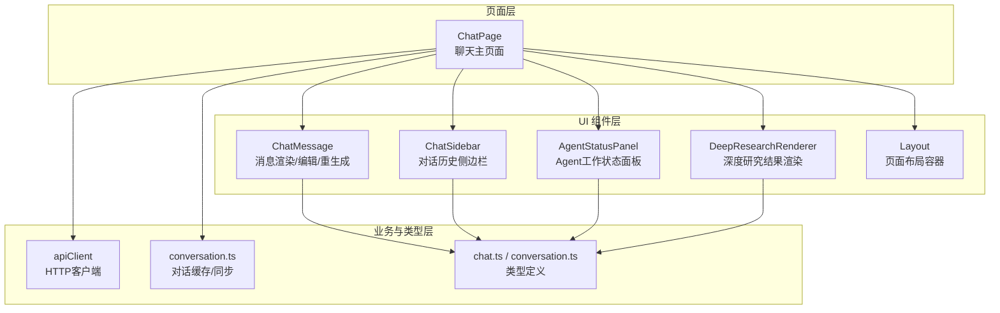
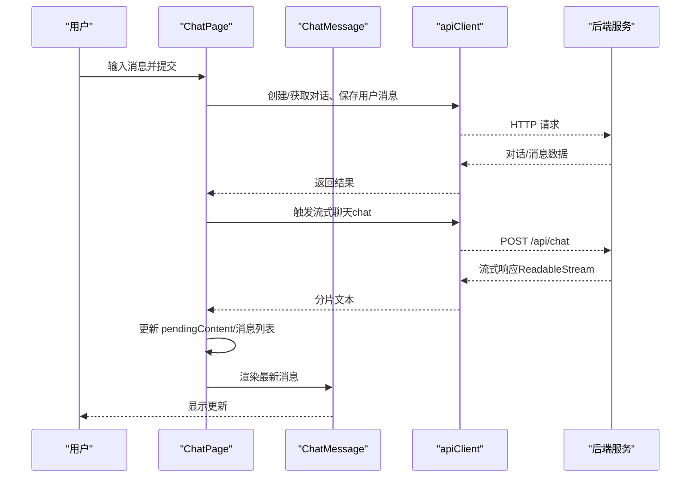
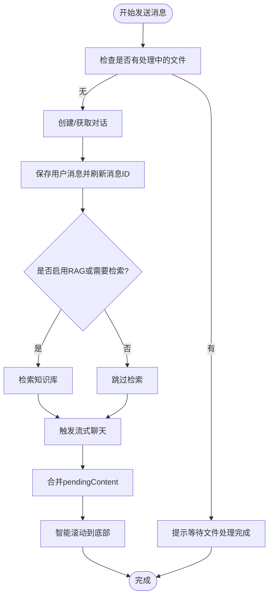
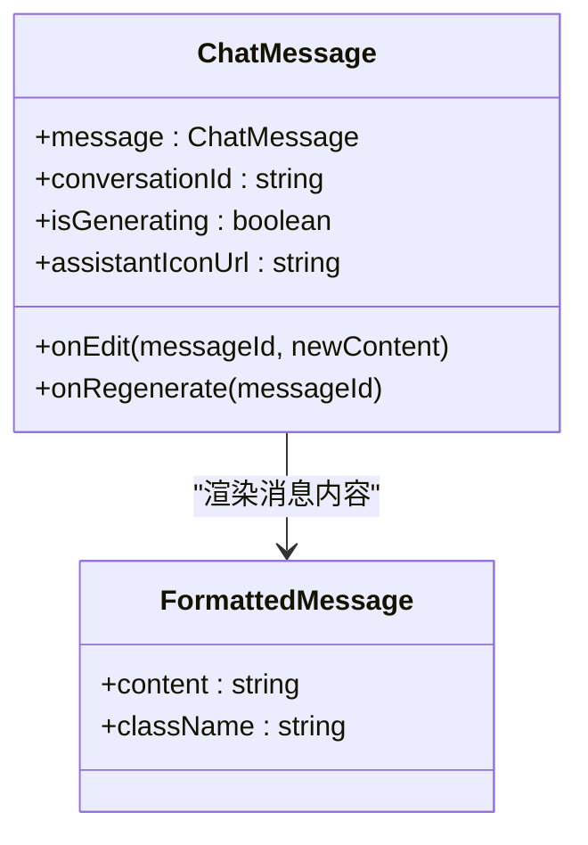
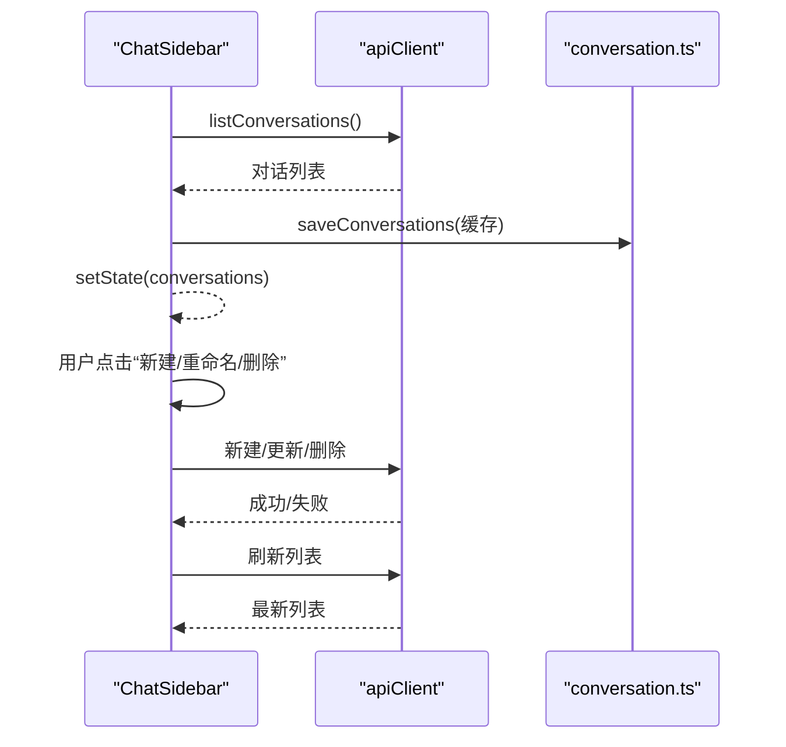
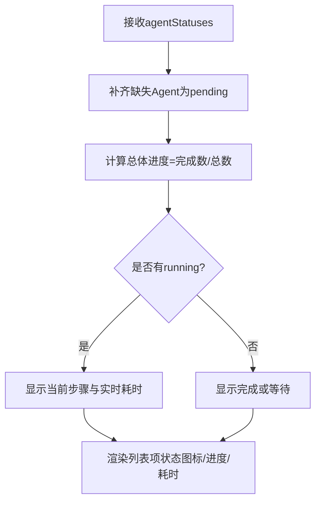
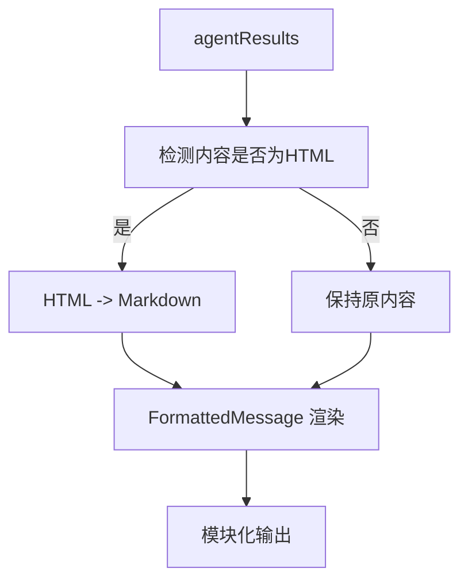
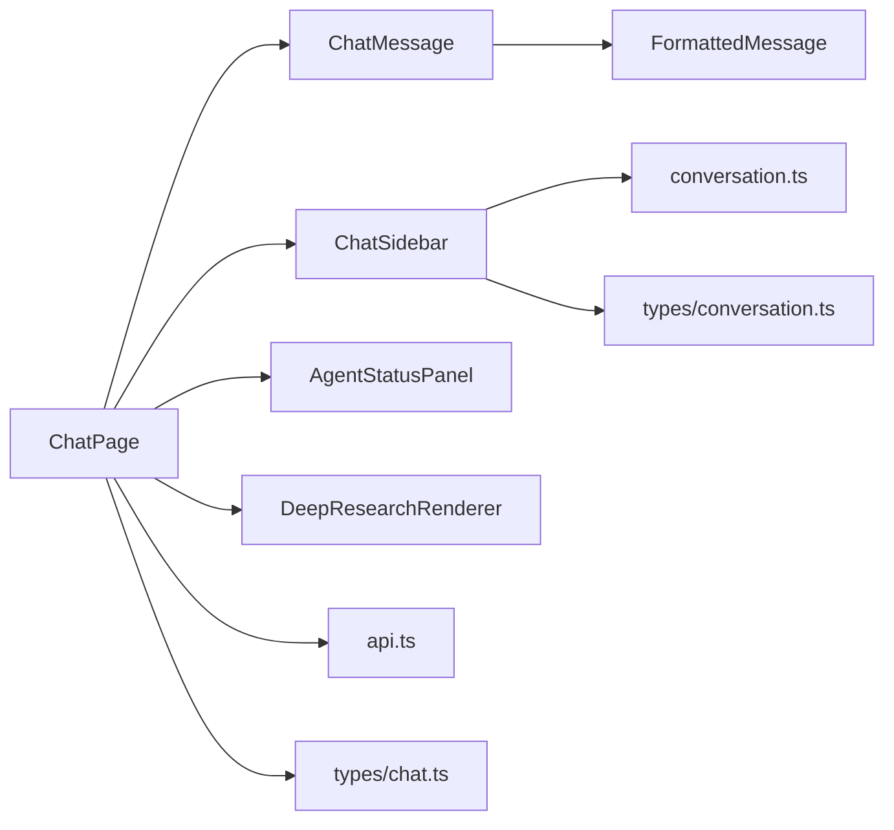

# 前端集成

<cite>
**本文引用的文件**
- [web/app/chat/page.tsx](file://web/app/chat/page.tsx)
- [web/components/chat/ChatMessage.tsx](file://web/components/chat/ChatMessage.tsx)
- [web/components/chat/ChatSidebar.tsx](file://web/components/chat/ChatSidebar.tsx)
- [web/components/chat/DeepResearchRenderer.tsx](file://web/components/chat/DeepResearchRenderer.tsx)
- [web/components/chat/AgentStatusPanel.tsx](file://web/components/chat/AgentStatusPanel.tsx)
- [web/components/message/FormattedMessage.tsx](file://web/components/message/FormattedMessage.tsx)
- [web/components/ui/Layout.tsx](file://web/components/ui/Layout.tsx)
- [web/lib/api.ts](file://web/lib/api.ts)
- [web/lib/conversation.ts](file://web/lib/conversation.ts)
- [web/types/chat.ts](file://web/types/chat.ts)
- [web/types/conversation.ts](file://web/types/conversation.ts)
- [web/app/layout.tsx](file://web/app/layout.tsx)
</cite>

## 目录
1. [引言](#引言)
2. [项目结构](#项目结构)
3. [核心组件](#核心组件)
4. [架构总览](#架构总览)
5. [详细组件分析](#详细组件分析)
6. [依赖分析](#依赖分析)
7. [性能考虑](#性能考虑)
8. [故障排查指南](#故障排查指南)
9. [结论](#结论)
10. [附录：集成指南与最佳实践](#附录集成指南与最佳实践)

## 引言
本文件面向在 Next.js 应用中集成“聊天界面”的开发者，系统化阐述前端组件架构、状态管理策略、用户交互流程、组件间通信方式，并提供完整的集成指南与最佳实践。重点覆盖以下方面：
- 主页面 ChatPage 的职责与状态编排
- 消息组件 ChatMessage 的渲染与编辑/重生成能力
- 侧边栏 ChatSidebar 的对话历史管理与交互
- 深度研究与 Agent 状态面板的可视化
- API 客户端封装与错误处理
- 流式响应、加载步骤、持久化与实时更新的实现要点

## 项目结构
聊天功能位于 web/app/chat/page.tsx，配套组件集中在 web/components/chat 与 web/components/message，类型定义位于 web/types，API 客户端与对话缓存逻辑位于 web/lib。

图示来源
- [web/app/chat/page.tsx:22-80](file://web/app/chat/page.tsx#L22-L80)
- [web/components/chat/ChatMessage.tsx:18-171](file://web/components/chat/ChatMessage.tsx#L18-L171)
- [web/components/chat/ChatSidebar.tsx:23-367](file://web/components/chat/ChatSidebar.tsx#L23-L367)
- [web/components/chat/AgentStatusPanel.tsx:54-348](file://web/components/chat/AgentStatusPanel.tsx#L54-L348)
- [web/components/chat/DeepResearchRenderer.tsx:114-177](file://web/components/chat/DeepResearchRenderer.tsx#L114-L177)
- [web/components/ui/Layout.tsx:12-61](file://web/components/ui/Layout.tsx#L12-L61)
- [web/lib/api.ts:106-347](file://web/lib/api.ts#L106-L347)
- [web/lib/conversation.ts:16-129](file://web/lib/conversation.ts#L16-L129)
- [web/types/chat.ts:3-79](file://web/types/chat.ts#L3-L79)
- [web/types/conversation.ts:1-10](file://web/types/conversation.ts#L1-L10)

章节来源
- [web/app/chat/page.tsx:1-120](file://web/app/chat/page.tsx#L1-L120)
- [web/components/ui/Layout.tsx:12-61](file://web/components/ui/Layout.tsx#L12-L61)

## 核心组件
- ChatPage：聊天主页面，负责初始化、对话生命周期、消息发送与流式接收、加载步骤、模型与知识空间配置、文件上传与轮询、状态持久化与恢复、Agent 状态与深度研究结果展示。
- ChatMessage：单条消息渲染组件，支持编辑、重生成、来源展示、思考中占位。
- ChatSidebar：对话历史侧边栏，支持新建、重命名、删除、滚动刷新、移动端遮罩与折叠。
- AgentStatusPanel：深度研究 Agent 工作流状态面板，显示总体进度、当前步骤、每个 Agent 的状态与耗时。
- DeepResearchRenderer：将多 Agent 结果按模块渲染为 Markdown 内容。
- FormattedMessage：消息内容格式化与 Markdown 渲染入口，兼容 HTML/公式块。
- Layout：页面布局容器，区分允许滚动与禁止滚动两种模式（聊天页采用禁止滚动）。
- apiClient：统一的 HTTP 客户端，封装模型、知识空间、文档、对话、消息、检索、流式聊天等接口。
- conversation.ts：对话列表的本地缓存与同步，提供增删改查与持久化方法。
- 类型定义：chat.ts 与 conversation.ts 提供消息、来源、推荐资源、对话等类型。

章节来源
- [web/app/chat/page.tsx:22-120](file://web/app/chat/page.tsx#L22-L120)
- [web/components/chat/ChatMessage.tsx:18-171](file://web/components/chat/ChatMessage.tsx#L18-L171)
- [web/components/chat/ChatSidebar.tsx:23-367](file://web/components/chat/ChatSidebar.tsx#L23-L367)
- [web/components/chat/AgentStatusPanel.tsx:54-348](file://web/components/chat/AgentStatusPanel.tsx#L54-L348)
- [web/components/chat/DeepResearchRenderer.tsx:114-177](file://web/components/chat/DeepResearchRenderer.tsx#L114-L177)
- [web/components/message/FormattedMessage.tsx:105-255](file://web/components/message/FormattedMessage.tsx#L105-L255)
- [web/components/ui/Layout.tsx:12-61](file://web/components/ui/Layout.tsx#L12-L61)
- [web/lib/api.ts:106-347](file://web/lib/api.ts#L106-L347)
- [web/lib/conversation.ts:16-129](file://web/lib/conversation.ts#L16-L129)
- [web/types/chat.ts:3-79](file://web/types/chat.ts#L3-L79)
- [web/types/conversation.ts:1-10](file://web/types/conversation.ts#L1-L10)

## 架构总览
聊天系统采用“页面驱动 + 组件解耦 + API 客户端 + 本地缓存”的架构模式。页面负责状态与流程编排，组件负责 UI 与交互，API 客户端统一封装后端接口，本地缓存保障离线可用与性能。

图示来源
- [web/app/chat/page.tsx:680-780](file://web/app/chat/page.tsx#L680-L780)
- [web/lib/api.ts:240-263](file://web/lib/api.ts#L240-L263)

章节来源
- [web/app/chat/page.tsx:680-780](file://web/app/chat/page.tsx#L680-L780)
- [web/lib/api.ts:240-263](file://web/lib/api.ts#L240-L263)

## 详细组件分析

### ChatPage：聊天主页面
- 职责
  - 初始化：加载知识空间、文档、模型，恢复流式生成状态
  - 对话生命周期：创建对话、保存消息、拉取历史、更新消息 ID
  - 发送消息：构建 generation_config，按需检索 RAG，触发流式聊天
  - 流式更新：节流 pendingContent，定时器合并更新，智能滚动
  - 加载步骤：动态计算步骤权重，展示进度
  - 文件上传：表单上传、轮询状态、完成后注入系统消息
  - Agent 状态与深度研究：接收多 Agent 结果并渲染
  - 持久化：localStorage 保存/恢复流式生成状态，页面可见性与卸载时保存
  - 交互：停止生成、快捷提示词轮换、侧边栏开关、模型设置
- 关键状态
  - 对话状态：conversationId、messages、loadingStep、isInitializing
  - 消息状态：input、pendingContent、isStreaming、uploadedFiles
  - 加载状态：isLoading、isLoadingKnowledgeSpaces、initStep
  - 模型与知识空间：models、selectedLLM、selectedEmbedding、selectedKnowledgeSpaceIds
  - 深度研究：agentStatuses、deepResearchResults、deepResearchEnabled
  - UI 状态：sidebarOpen、spacePickerOpen、toast、mounted
- 错误处理
  - API 失败降级为空列表或提示，不影响聊天主流程
  - 上传轮询异常继续轮询，避免中断
  - 流式生成可中断（AbortController）

图示来源
- [web/app/chat/page.tsx:680-780](file://web/app/chat/page.tsx#L680-L780)
- [web/app/chat/page.tsx:1144-1193](file://web/app/chat/page.tsx#L1144-L1193)

章节来源
- [web/app/chat/page.tsx:22-120](file://web/app/chat/page.tsx#L22-L120)
- [web/app/chat/page.tsx:193-240](file://web/app/chat/page.tsx#L193-L240)
- [web/app/chat/page.tsx:330-420](file://web/app/chat/page.tsx#L330-L420)
- [web/app/chat/page.tsx:445-548](file://web/app/chat/page.tsx#L445-L548)
- [web/app/chat/page.tsx:550-601](file://web/app/chat/page.tsx#L550-L601)
- [web/app/chat/page.tsx:645-663](file://web/app/chat/page.tsx#L645-L663)
- [web/app/chat/page.tsx:680-780](file://web/app/chat/page.tsx#L680-L780)
- [web/app/chat/page.tsx:1144-1193](file://web/app/chat/page.tsx#L1144-L1193)
- [web/app/chat/page.tsx:1734-1777](file://web/app/chat/page.tsx#L1734-L1777)

### ChatMessage：消息组件
- 职责
  - 渲染用户/助手消息，支持编辑与重生成
  - 思考中占位（ThinkingDots）
  - 展示来源（SourceInfo）
  - 时间戳格式化
- 交互
  - onEdit(messageId, newContent)：调用父级更新消息
  - onRegenerate(messageId)：触发重生成
- 设计要点
  - 使用 memo 包装，避免不必要的重渲染
  - 支持外部传入 assistant 图标 URL（自动拼接公共前缀）

图示来源
- [web/components/chat/ChatMessage.tsx:18-171](file://web/components/chat/ChatMessage.tsx#L18-L171)
- [web/components/message/FormattedMessage.tsx:105-255](file://web/components/message/FormattedMessage.tsx#L105-L255)

章节来源
- [web/components/chat/ChatMessage.tsx:18-171](file://web/components/chat/ChatMessage.tsx#L18-L171)
- [web/components/message/FormattedMessage.tsx:105-255](file://web/components/message/FormattedMessage.tsx#L105-L255)

### ChatSidebar：对话历史侧边栏
- 职责
  - 加载对话列表（API + 本地缓存）
  - 新建、重命名、删除对话
  - 选择对话并切换到对应历史
  - 移动端遮罩、折叠/展开、定时刷新
- 交互
  - onConversationSelect(id)：父级切换历史
  - onNewConversation()：新建对话
  - isOpen/onOpenChange：受控/非受控模式
- 设计要点
  - 折叠状态持久化到 localStorage
  - 双击重命名、悬浮操作按钮
  - 30 秒轮询刷新

图示来源
- [web/components/chat/ChatSidebar.tsx:60-145](file://web/components/chat/ChatSidebar.tsx#L60-L145)
- [web/lib/conversation.ts:16-76](file://web/lib/conversation.ts#L16-L76)
- [web/lib/api.ts:185-205](file://web/lib/api.ts#L185-L205)

章节来源
- [web/components/chat/ChatSidebar.tsx:23-367](file://web/components/chat/ChatSidebar.tsx#L23-L367)
- [web/lib/conversation.ts:16-129](file://web/lib/conversation.ts#L16-L129)
- [web/lib/api.ts:185-205](file://web/lib/api.ts#L185-L205)

### AgentStatusPanel：Agent 工作状态面板
- 职责
  - 展示总体进度与当前步骤
  - 列表显示每个 Agent 的状态、进度、耗时、原因
  - 可折叠/展开，紧凑设计
- 数据来源
  - agentStatuses：父级传入的 Agent 状态数组
- 设计要点
  - 保证所有 Agent 类型均显示（补齐默认 pending）
  - 实时更新当前时间，计算运行时长
  - 活跃 Agent 高亮与光效

图示来源
- [web/components/chat/AgentStatusPanel.tsx:54-125](file://web/components/chat/AgentStatusPanel.tsx#L54-L125)
- [web/components/chat/AgentStatusPanel.tsx:220-343](file://web/components/chat/AgentStatusPanel.tsx#L220-L343)

章节来源
- [web/components/chat/AgentStatusPanel.tsx:54-348](file://web/components/chat/AgentStatusPanel.tsx#L54-L348)

### DeepResearchRenderer：深度研究结果渲染
- 职责
  - 将多 Agent 的结果按模块渲染为 Markdown
  - HTML 内容自动转换为 Markdown
- 设计要点
  - 中文 Agent 名称映射
  - 客户端/服务端分别处理 HTML -> Markdown

图示来源
- [web/components/chat/DeepResearchRenderer.tsx:114-177](file://web/components/chat/DeepResearchRenderer.tsx#L114-L177)
- [web/components/message/FormattedMessage.tsx:105-255](file://web/components/message/FormattedMessage.tsx#L105-L255)

章节来源
- [web/components/chat/DeepResearchRenderer.tsx:114-177](file://web/components/chat/DeepResearchRenderer.tsx#L114-L177)
- [web/components/message/FormattedMessage.tsx:105-255](file://web/components/message/FormattedMessage.tsx#L105-L255)

### FormattedMessage：消息内容格式化与渲染
- 职责
  - HTML 内容转 Markdown
  - 公式块（$$...$$、\[...\]）预处理，交由 MarkdownRenderer
  - 响应式样式与 MathJax 优化
- 设计要点
  - 客户端 DOM 解析 + 服务端字符串替换
  - 代码块占位符避免误处理

章节来源
- [web/components/message/FormattedMessage.tsx:105-255](file://web/components/message/FormattedMessage.tsx#L105-L255)

### Layout：页面布局容器
- 职责
  - 提供两种布局模式：允许滚动（自然文档流）与禁止滚动（固定高度）
  - 聊天页面采用禁止滚动模式，内部通过容器滚动
- 设计要点
  - 支持安全区域与触摸滚动优化

章节来源
- [web/components/ui/Layout.tsx:12-61](file://web/components/ui/Layout.tsx#L12-L61)

## 依赖分析
- 组件耦合
  - ChatPage 与 ChatMessage/ChatSidebar/AgentStatusPanel/DeepResearchRenderer 高内聚低耦合，通过 props 与回调通信
  - ChatSidebar 与 conversation.ts 强耦合，负责对话列表的读写与缓存
  - ChatMessage 与 FormattedMessage 弱耦合，通过内容传递
- 外部依赖
  - apiClient：统一 HTTP 客户端，封装模型、知识空间、文档、对话、消息、检索、流式聊天等接口
  - 类型定义：chat.ts 与 conversation.ts 提供强类型约束
- 循环依赖
  - 未发现循环依赖，组件间通过 props 与回调单向传递

图示来源
- [web/app/chat/page.tsx:6-20](file://web/app/chat/page.tsx#L6-L20)
- [web/components/chat/ChatSidebar.tsx:4-13](file://web/components/chat/ChatSidebar.tsx#L4-L13)
- [web/lib/conversation.ts:1-3](file://web/lib/conversation.ts#L1-L3)
- [web/lib/api.ts:106-347](file://web/lib/api.ts#L106-L347)
- [web/types/chat.ts:3-79](file://web/types/chat.ts#L3-L79)
- [web/types/conversation.ts:1-10](file://web/types/conversation.ts#L1-L10)

章节来源
- [web/app/chat/page.tsx:6-20](file://web/app/chat/page.tsx#L6-L20)
- [web/components/chat/ChatSidebar.tsx:4-13](file://web/components/chat/ChatSidebar.tsx#L4-L13)
- [web/lib/conversation.ts:1-3](file://web/lib/conversation.ts#L1-L3)
- [web/lib/api.ts:106-347](file://web/lib/api.ts#L106-L347)
- [web/types/chat.ts:3-79](file://web/types/chat.ts#L3-L79)
- [web/types/conversation.ts:1-10](file://web/types/conversation.ts#L1-L10)

## 性能考虑
- 智能滚动
  - 仅在用户靠近底部或流式输出时滚动，避免频繁滚动造成卡顿
  - 距离底部极近时使用直接 scrollTop，较远时使用 smooth 滚动
- 流式更新节流
  - pendingContent 合并与定时器合并，降低渲染压力
- 组件优化
  - ChatMessage 使用 memo，避免重复渲染
  - ChatSidebar 列表项使用最小交互区域，减少重绘
- 状态持久化
  - 仅在流式生成或加载中时定期保存，5 分钟内恢复，避免频繁 IO
- 资源加载
  - 知识空间与文档列表懒加载，初始化阶段分步显示进度

章节来源
- [web/app/chat/page.tsx:550-601](file://web/app/chat/page.tsx#L550-L601)
- [web/app/chat/page.tsx:422-431](file://web/app/chat/page.tsx#L422-L431)
- [web/components/chat/ChatMessage.tsx:170-171](file://web/components/chat/ChatMessage.tsx#L170-L171)
- [web/components/chat/ChatSidebar.tsx:76-82](file://web/components/chat/ChatSidebar.tsx#L76-L82)

## 故障排查指南
- API 请求失败
  - 现象：对话列表/消息为空、提示错误
  - 处理：捕获 error 并降级为空列表，不影响主流程；检查 NEXT_PUBLIC_API_URL
- 流式生成中断
  - 现象：生成卡住或中途停止
  - 处理：使用 AbortController 停止生成，清理 pendingContent 与定时器
- 文件上传状态轮询异常
  - 现象：上传失败或长时间无状态更新
  - 处理：异常时继续轮询，避免中断；完成后注入系统消息
- 侧边栏无法刷新
  - 现象：新建/重命名/删除后列表未更新
  - 处理：手动刷新或等待 30 秒轮询；确认网络与权限
- 消息编辑/重生成无效
  - 现象：点击编辑/重生无反应
  - 处理：确认 message_id 与 conversationId 存在，检查 onEdit/onRegenerate 回调

章节来源
- [web/lib/api.ts:77-85](file://web/lib/api.ts#L77-L85)
- [web/app/chat/page.tsx:645-663](file://web/app/chat/page.tsx#L645-L663)
- [web/app/chat/page.tsx:242-327](file://web/app/chat/page.tsx#L242-L327)
- [web/components/chat/ChatSidebar.tsx:76-82](file://web/components/chat/ChatSidebar.tsx#L76-L82)
- [web/components/chat/ChatMessage.tsx:42-62](file://web/components/chat/ChatMessage.tsx#L42-L62)

## 结论
该聊天系统通过清晰的页面-组件分层、完善的 API 客户端与本地缓存、以及稳健的流式更新与状态持久化策略，实现了高性能、可维护、可扩展的前端集成方案。建议在生产环境中结合监控与日志，持续优化滚动与渲染性能，并完善错误上报与用户引导。

## 附录：集成指南与最佳实践

### 在 Next.js 中集成聊天功能
- 安装与环境
  - 设置 NEXT_PUBLIC_API_URL 指向后端服务
  - 确保路由为 App Router（本项目已采用）
- 页面与布局
  - 使用 Layout 的禁止滚动模式适配聊天页面
  - ChatPage 作为聊天主页面，导入 ChatMessage、ChatSidebar、AgentStatusPanel、DeepResearchRenderer
- 状态与生命周期
  - 在 useEffect 中初始化知识空间、文档、模型
  - 使用 AbortController 控制流式生成
  - 使用 localStorage 持久化流式生成状态
- API 调用
  - 使用 apiClient 的 chat/retrieve/addMessage 等接口
  - 对于流式响应，使用 ReadableStream 逐段更新 pendingContent
- 错误处理
  - 所有 API 调用返回 ApiResult，检查 error 字段
  - 对网络错误与服务端错误分别处理
- 用户体验优化
  - 智能滚动到底部，避免打断用户阅读
  - 提供“停止生成”按钮，及时响应用户意图
  - 侧边栏支持移动端遮罩与折叠，提升小屏体验

章节来源
- [web/app/layout.tsx:16-48](file://web/app/layout.tsx#L16-L48)
- [web/components/ui/Layout.tsx:12-61](file://web/components/ui/Layout.tsx#L12-L61)
- [web/app/chat/page.tsx:445-548](file://web/app/chat/page.tsx#L445-L548)
- [web/lib/api.ts:106-347](file://web/lib/api.ts#L106-L347)