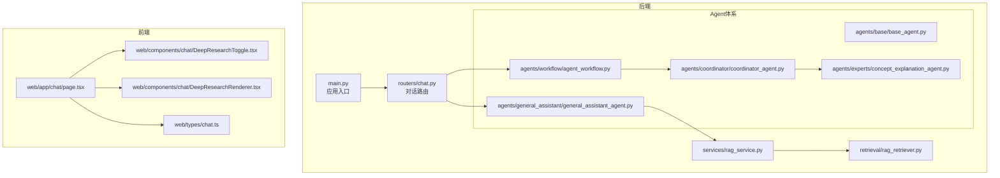
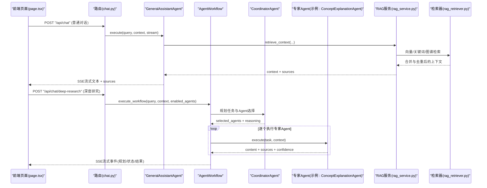
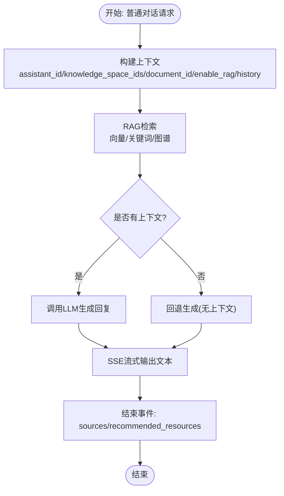
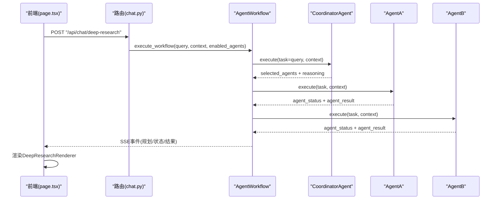
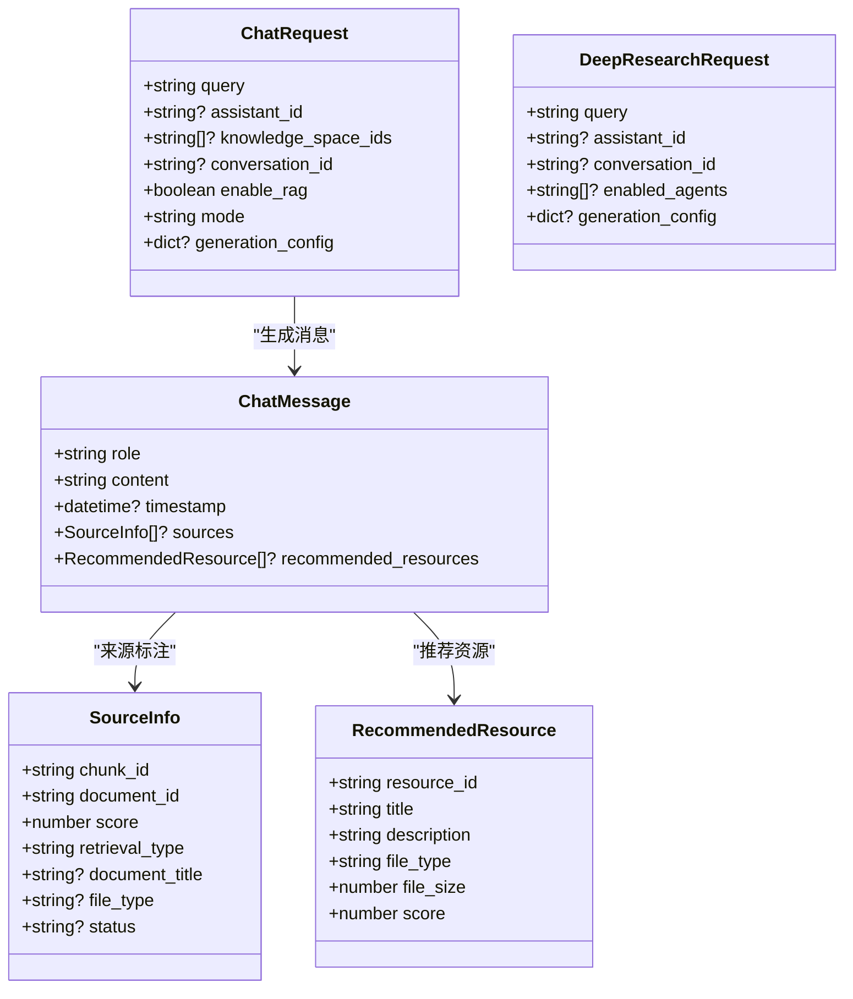
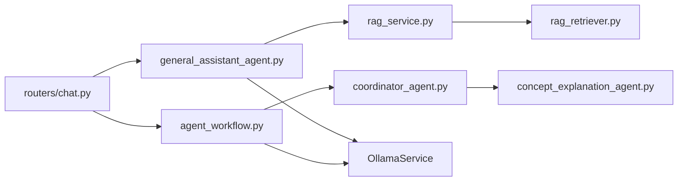

# 对话模式

<cite>
**本文引用的文件**
- [main.py](file://main.py)
- [chat.py](file://routers/chat.py)
- [base_agent.py](file://agents/base/base_agent.py)
- [general_assistant_agent.py](file://agents/general_assistant/general_assistant_agent.py)
- [agent_workflow.py](file://agents/workflow/agent_workflow.py)
- [coordinator_agent.py](file://agents/coordinator/coordinator_agent.py)
- [concept_explanation_agent.py](file://agents/experts/concept_explanation_agent.py)
- [rag_service.py](file://services/rag_service.py)
- [rag_retriever.py](file://retrieval/rag_retriever.py)
- [DeepResearchToggle.tsx](file://web/components/chat/DeepResearchToggle.tsx)
- [DeepResearchRenderer.tsx](file://web/components/chat/DeepResearchRenderer.tsx)
- [chat.ts](file://web/types/chat.ts)
- [page.tsx](file://web/app/chat/page.tsx)
</cite>

## 目录
1. [引言](#引言)
2. [项目结构](#项目结构)
3. [核心组件](#核心组件)
4. [架构总览](#架构总览)
5. [详细组件分析](#详细组件分析)
6. [依赖分析](#依赖分析)
7. [性能考量](#性能考量)
8. [故障排查指南](#故障排查指南)
9. [结论](#结论)
10. [附录](#附录)

## 引言
本文件系统化阐述“对话模式”的设计与实现，重点对比“普通对话模式”与“深度研究模式”，并给出API差异、实现机制、工作流程、切换策略与最佳实践。普通对话模式以RAG检索增强为核心，强调“来源标注”与“推荐资源”；深度研究模式通过专家代理协作与多轮推理，提供结构化的研究型输出。

## 项目结构
后端采用FastAPI，路由集中在routers目录；对话能力由Agent体系与RAG服务共同支撑；前端位于web目录，提供对话界面与深度研究渲染组件。

**图表来源**
- [main.py:1-157](file://main.py#L1-L157)
- [chat.py:1-1324](file://routers/chat.py#L1-L1324)
- [base_agent.py:1-122](file://agents/base/base_agent.py#L1-L122)
- [general_assistant_agent.py:1-167](file://agents/general_assistant/general_assistant_agent.py#L1-L167)
- [agent_workflow.py:1-388](file://agents/workflow/agent_workflow.py#L1-L388)
- [coordinator_agent.py:1-252](file://agents/coordinator/coordinator_agent.py#L1-L252)
- [concept_explanation_agent.py:1-70](file://agents/experts/concept_explanation_agent.py#L1-L70)
- [rag_service.py:1-248](file://services/rag_service.py#L1-L248)
- [rag_retriever.py:1-325](file://retrieval/rag_retriever.py#L1-L325)
- [DeepResearchToggle.tsx:1-53](file://web/components/chat/DeepResearchToggle.tsx#L1-L53)
- [DeepResearchRenderer.tsx:1-177](file://web/components/chat/DeepResearchRenderer.tsx#L1-L177)
- [chat.ts:1-79](file://web/types/chat.ts#L1-L79)
- [page.tsx:1-2563](file://web/app/chat/page.tsx#L1-L2563)

**章节来源**
- [main.py:1-157](file://main.py#L1-L157)
- [chat.py:1-1324](file://routers/chat.py#L1-L1324)

## 核心组件
- 普通对话模式（常规对话）：由GeneralAssistantAgent驱动，集成RAG检索、来源标注与推荐资源，支持流式输出与断连检测。
- 深度研究模式：由AgentWorkflow与CoordinatorAgent编排，多专家Agent协作，产出结构化研究结果，前端以HTML/Markdown渲染。
- RAG服务与检索器：提供向量检索、关键词检索、图谱检索与混合重排，支撑来源聚合与上下文构建。
- 前端交互：提供深度研究开关、Agent状态面板与结果渲染组件。

**章节来源**
- [general_assistant_agent.py:1-167](file://agents/general_assistant/general_assistant_agent.py#L1-L167)
- [agent_workflow.py:1-388](file://agents/workflow/agent_workflow.py#L1-L388)
- [coordinator_agent.py:1-252](file://agents/coordinator/coordinator_agent.py#L1-L252)
- [rag_service.py:1-248](file://services/rag_service.py#L1-L248)
- [rag_retriever.py:1-325](file://retrieval/rag_retriever.py#L1-L325)
- [DeepResearchToggle.tsx:1-53](file://web/components/chat/DeepResearchToggle.tsx#L1-L53)
- [DeepResearchRenderer.tsx:1-177](file://web/components/chat/DeepResearchRenderer.tsx#L1-L177)

## 架构总览
普通对话与深度研究在后端均通过FastAPI路由触发，前者走GeneralAssistantAgent，后者走AgentWorkflow。二者共享RAG服务与检索器，但前者侧重“问答+来源”，后者侧重“多Agent协同+结构化输出”。

**图表来源**
- [chat.py:615-751](file://routers/chat.py#L615-L751)
- [chat.py:753-800](file://routers/chat.py#L753-L800)
- [general_assistant_agent.py:49-167](file://agents/general_assistant/general_assistant_agent.py#L49-L167)
- [agent_workflow.py:106-337](file://agents/workflow/agent_workflow.py#L106-L337)
- [coordinator_agent.py:55-168](file://agents/coordinator/coordinator_agent.py#L55-L168)
- [concept_explanation_agent.py:25-70](file://agents/experts/concept_explanation_agent.py#L25-L70)
- [rag_service.py:10-242](file://services/rag_service.py#L10-L242)
- [rag_retriever.py:69-101](file://retrieval/rag_retriever.py#L69-L101)

## 详细组件分析

### 普通对话模式（RAG问答）
- 实现机制
  - Agent层：GeneralAssistantAgent继承BaseAgent，封装提示词、模型选择与流式生成。
  - 检索层：RAGService结合RAGRetriever进行向量/关键词/图谱混合检索，去重与合并，返回上下文与来源。
  - 流式输出：后端以SSE推送文本块，末尾附带sources与recommended_resources。
- 关键特性
  - 来源标注：sources包含chunk_id、document_id、score、retrieval_type、document_title等。
  - 推荐资源：recommended_resources预留扩展字段。
  - 断连检测：每N次yield检查客户端断连，优雅终止。
- 适用场景
  - 快速问答、事实性查询、需要可追溯来源的场景。

**图表来源**
- [general_assistant_agent.py:49-167](file://agents/general_assistant/general_assistant_agent.py#L49-L167)
- [rag_service.py:10-242](file://services/rag_service.py#L10-L242)
- [rag_retriever.py:69-101](file://retrieval/rag_retriever.py#L69-L101)

**章节来源**
- [general_assistant_agent.py:1-167](file://agents/general_assistant/general_assistant_agent.py#L1-L167)
- [rag_service.py:1-248](file://services/rag_service.py#L1-L248)
- [rag_retriever.py:1-325](file://retrieval/rag_retriever.py#L1-L325)
- [chat.py:615-751](file://routers/chat.py#L615-L751)

### 深度研究模式（专家协作）
- 工作流程
  - 协调规划：CoordinatorAgent分析问题，选择必要专家Agent并分配任务，返回selected_agents与reasoning。
  - 专家执行：AgentWorkflow顺序执行被选中的专家Agent，实时上报状态与进度，收集结果。
  - 结果汇总：各Agent产出content、sources、confidence，最终由前端渲染为结构化报告。
- 关键特性
  - 多Agent协作：支持手动指定enabled_agents或由协调器自动选择。
  - 实时状态：planning、agent_status、agent_result、complete等事件类型。
  - HTML/Markdown渲染：前端将HTML内容转换为Markdown并分段展示。
- 适用场景
  - 复杂研究、跨领域综合分析、需要多视角验证与结构化输出的场景。

**图表来源**
- [chat.py:753-800](file://routers/chat.py#L753-L800)
- [agent_workflow.py:106-337](file://agents/workflow/agent_workflow.py#L106-L337)
- [coordinator_agent.py:55-168](file://agents/coordinator/coordinator_agent.py#L55-L168)
- [DeepResearchRenderer.tsx:114-177](file://web/components/chat/DeepResearchRenderer.tsx#L114-L177)

**章节来源**
- [agent_workflow.py:1-388](file://agents/workflow/agent_workflow.py#L1-L388)
- [coordinator_agent.py:1-252](file://agents/coordinator/coordinator_agent.py#L1-L252)
- [concept_explanation_agent.py:1-70](file://agents/experts/concept_explanation_agent.py#L1-L70)
- [chat.py:753-800](file://routers/chat.py#L753-L800)
- [DeepResearchRenderer.tsx:1-177](file://web/components/chat/DeepResearchRenderer.tsx#L1-L177)

### API接口差异

- 普通对话（/api/chat）
  - 请求体：query、assistant_id、knowledge_space_ids、conversation_id、enable_rag、mode、generation_config
  - 响应：SSE流式文本，末尾携带sources与recommended_resources
  - 特性：支持断连检测，自动停止生成
- 深度研究（/api/chat/deep-research）
  - 请求体：query、assistant_id、conversation_id、enabled_agents、generation_config
  - 响应：SSE流式事件，包含planning、agent_status、agent_result、complete
  - 特性：前端渲染HTML/Markdown，展示多Agent输出与状态

**图表来源**
- [chat.py:64-82](file://routers/chat.py#L64-L82)
- [chat.py:20-27](file://routers/chat.py#L20-L27)
- [chat.ts:57-65](file://web/types/chat.ts#L57-L65)
- [chat.ts:48-55](file://web/types/chat.ts#L48-L55)

**章节来源**
- [chat.py:64-82](file://routers/chat.py#L64-L82)
- [chat.py:20-27](file://routers/chat.py#L20-L27)
- [chat.ts:1-79](file://web/types/chat.ts#L1-L79)

### 模式切换实现指南
- 前端开关
  - 深度研究开关：DeepResearchToggle.tsx，本地存储持久化，开启时自动关闭RAG增强。
  - 渲染组件：DeepResearchRenderer.tsx，将HTML转换为Markdown并分段展示。
- 后端行为
  - 普通模式：chat路由调用GeneralAssistantAgent，enable_rag默认开启。
  - 深度研究：deep-research路由调用AgentWorkflow，支持手动指定enabled_agents。
- 配置参数
  - generation_config：可指定llm_model、embedding_model等。
  - knowledge_space_ids：普通模式限定检索范围。
- 用户体验优化
  - 断连检测：后端定期检查客户端断连，及时停止生成。
  - 流式状态：深度研究模式实时反馈Agent状态与进度。
  - 本地存储：开关状态与模型配置持久化，提升连续对话体验。

**章节来源**
- [DeepResearchToggle.tsx:1-53](file://web/components/chat/DeepResearchToggle.tsx#L1-L53)
- [DeepResearchRenderer.tsx:1-177](file://web/components/chat/DeepResearchRenderer.tsx#L1-L177)
- [page.tsx:1-2563](file://web/app/chat/page.tsx#L1-L2563)
- [chat.py:615-751](file://routers/chat.py#L615-L751)
- [chat.py:753-800](file://routers/chat.py#L753-L800)

### 实际使用场景示例
- 普通对话模式
  - 场景：快速解答“某公式的意义与应用”
  - 优势：即时、可溯源、简洁
  - 关键点：开启enable_rag，关注sources与recommended_resources
- 深度研究模式
  - 场景：撰写“某理论在工程中的应用综述”
  - 优势：多Agent协同、结构化输出、可视化呈现
  - 关键点：合理选择enabled_agents，关注Agent状态面板

[本节为概念性说明，无需列出具体文件来源]

## 依赖分析
- 组件耦合
  - chat路由依赖Agent与RAG服务；Agent依赖OllamaService；RAG服务依赖检索器与数据库。
  - 深度研究模式通过AgentWorkflow与CoordinatorAgent解耦规划与执行。
- 外部依赖
  - 向量库：Qdrant（检索）
  - 图数据库：Neo4j（实体关系检索）
  - 模型服务：Ollama（LLM生成）

**图表来源**
- [chat.py:615-751](file://routers/chat.py#L615-L751)
- [general_assistant_agent.py:1-167](file://agents/general_assistant/general_assistant_agent.py#L1-L167)
- [agent_workflow.py:1-388](file://agents/workflow/agent_workflow.py#L1-L388)
- [coordinator_agent.py:1-252](file://agents/coordinator/coordinator_agent.py#L1-L252)
- [concept_explanation_agent.py:1-70](file://agents/experts/concept_explanation_agent.py#L1-L70)
- [rag_service.py:1-248](file://services/rag_service.py#L1-L248)
- [rag_retriever.py:1-325](file://retrieval/rag_retriever.py#L1-L325)

**章节来源**
- [chat.py:1-1324](file://routers/chat.py#L1-L1324)
- [general_assistant_agent.py:1-167](file://agents/general_assistant/general_assistant_agent.py#L1-L167)
- [agent_workflow.py:1-388](file://agents/workflow/agent_workflow.py#L1-L388)
- [coordinator_agent.py:1-252](file://agents/coordinator/coordinator_agent.py#L1-L252)
- [concept_explanation_agent.py:1-70](file://agents/experts/concept_explanation_agent.py#L1-L70)
- [rag_service.py:1-248](file://services/rag_service.py#L1-L248)
- [rag_retriever.py:1-325](file://retrieval/rag_retriever.py#L1-L325)

## 性能考量
- 检索性能
  - 并行检索：向量、关键词、图谱三路并行，合并后去重与排序。
  - 重排：当前禁用重排模型以避免崩溃，未来可按环境启用。
- 生成性能
  - 流式输出：减少首字节延迟，支持断连检测。
  - 模型选择：GeneralAssistantAgent按问题动态选择模型，兼顾质量与速度。
- 前端体验
  - 深度研究模式：SSE事件驱动，前端逐步渲染，避免一次性渲染大量内容。

[本节为通用指导，无需列出具体文件来源]

## 故障排查指南
- 普通对话
  - 症状：RAG检索失败或无来源
  - 排查：确认知识空间集合名称、向量库可用性、检索阈值设置
  - 参考：RAGService与RAGRetriever的异常日志
- 深度研究
  - 症状：Agent执行报错或无结果
  - 排查：检查CoordinatorAgent的规划结果与enabled_agents，查看Agent状态事件
  - 参考：AgentWorkflow的错误事件与日志
- 通用
  - 症状：SSE断流
  - 排查：检查客户端断连检测逻辑与后端异常捕获

**章节来源**
- [rag_service.py:10-242](file://services/rag_service.py#L10-L242)
- [rag_retriever.py:69-101](file://retrieval/rag_retriever.py#L69-L101)
- [agent_workflow.py:331-337](file://agents/workflow/agent_workflow.py#L331-L337)
- [general_assistant_agent.py:158-167](file://agents/general_assistant/general_assistant_agent.py#L158-L167)

## 结论
- 普通对话模式适合“快速问答+可溯源”，深度研究模式适合“多Agent协同+结构化研究”。
- 通过清晰的API边界、流式SSE与前端渲染组件，系统在不同场景下均能提供良好体验。
- 切换策略建议：简单问题用普通模式，复杂研究用深度研究模式；结合generation_config与知识空间限定，平衡性能与效果。

[本节为总结性内容，无需列出具体文件来源]

## 附录
- 数据模型（简化）
  - ChatMessage：role/content/timestamp/sources/recommended_resources
  - SourceInfo：chunk_id/document_id/score/retrieval_type/document_title/file_type/status
  - RecommendedResource：resource_id/title/description/file_type/file_size/score

**章节来源**
- [chat.ts:3-14](file://web/types/chat.ts#L3-L14)
- [chat.ts:57-65](file://web/types/chat.ts#L57-L65)
- [chat.ts:48-55](file://web/types/chat.ts#L48-L55)