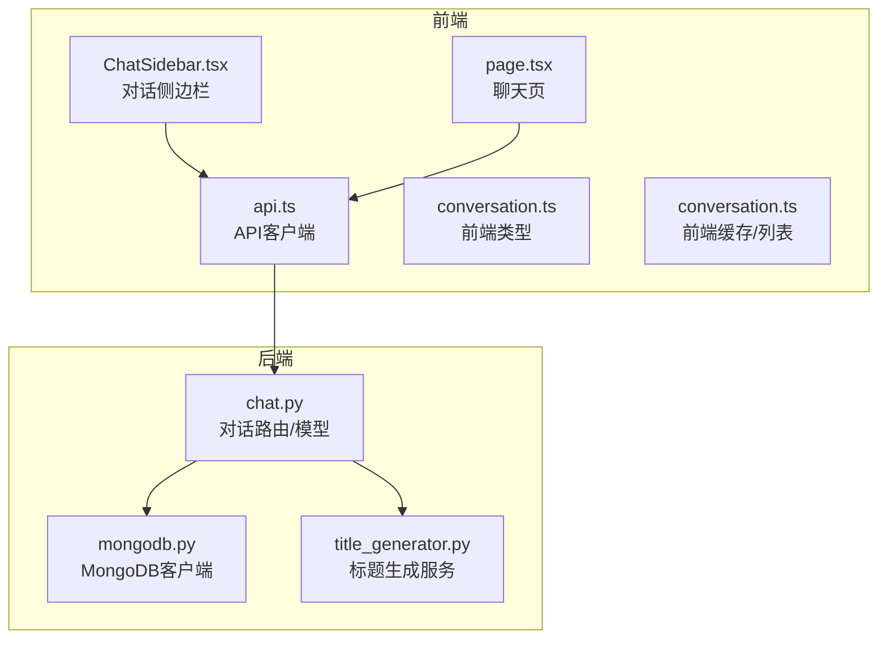
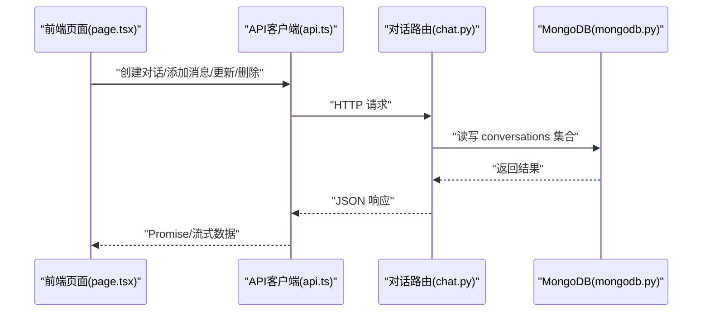
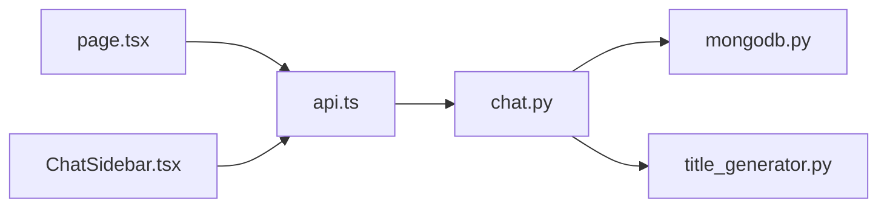
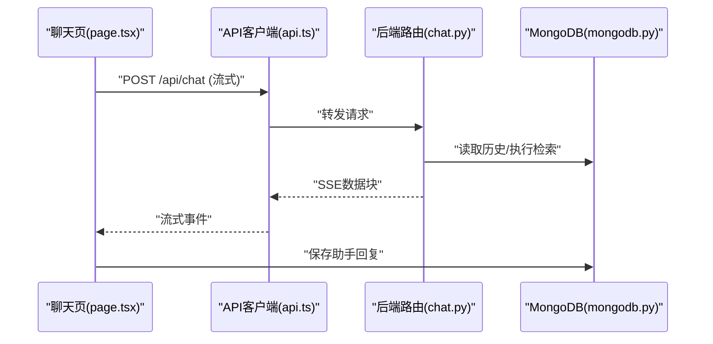

# 对话管理

<cite>
**本文引用的文件**
- [chat.py](file://routers/chat.py)
- [conversation.ts](file://web/types/conversation.ts)
- [chat.ts](file://web/types/chat.ts)
- [api.ts](file://web/lib/api.ts)
- [conversation.ts](file://web/lib/conversation.ts)
- [ChatSidebar.tsx](file://web/components/chat/ChatSidebar.tsx)
- [page.tsx](file://web/app/chat/page.tsx)
- [mongodb.py](file://database/mongodb.py)
- [title_generator.py](file://services/title_generator.py)
</cite>

## 目录
1. [简介](#简介)
2. [项目结构](#项目结构)
3. [核心组件](#核心组件)
4. [架构总览](#架构总览)
5. [详细组件分析](#详细组件分析)
6. [依赖分析](#依赖分析)
7. [性能考虑](#性能考虑)
8. [故障排查指南](#故障排查指南)
9. [结论](#结论)
10. [附录](#附录)

## 简介
本文件系统化梳理“对话管理”能力，覆盖对话生命周期（创建、获取、更新、删除）、匿名对话机制（身份验证、权限控制、数据隔离）、对话模型数据结构（消息数组、时间戳、助手关联）、对话历史管理（存储格式、截断策略、性能优化）、完整API接口规范以及前端集成示例路径。文档面向不同技术背景读者，既提供高层概览，也给出代码级映射与可视化图示。

## 项目结构
对话管理功能横跨前端Next.js应用与后端FastAPI服务，核心文件分布如下：
- 后端路由与模型：routers/chat.py（对话路由、消息模型、对话模型、请求体模型）
- 数据库连接：database/mongodb.py（异步MongoDB客户端）
- 标题生成服务：services/title_generator.py（对话标题生成）
- 前端类型与API：web/types/conversation.ts、web/types/chat.ts、web/lib/api.ts
- 前端对话侧边栏与聊天页：web/components/chat/ChatSidebar.tsx、web/app/chat/page.tsx
- 前端对话缓存与列表：web/lib/conversation.ts

图表来源
- [chat.py](file://routers/chat.py)
- [mongodb.py](file://database/mongodb.py)
- [title_generator.py](file://services/title_generator.py)
- [api.ts](file://web/lib/api.ts)
- [ChatSidebar.tsx](file://web/components/chat/ChatSidebar.tsx)
- [page.tsx](file://web/app/chat/page.tsx)
- [conversation.ts](file://web/lib/conversation.ts)

章节来源
- [chat.py](file://routers/chat.py)
- [mongodb.py](file://database/mongodb.py)
- [api.ts](file://web/lib/api.ts)
- [ChatSidebar.tsx](file://web/components/chat/ChatSidebar.tsx)
- [page.tsx](file://web/app/chat/page.tsx)
- [conversation.ts](file://web/lib/conversation.ts)

## 核心组件
- 对话模型与消息模型
  - 后端模型：Conversation、ChatMessage、MessageAdd、MessageUpdate、ChatRequest、DeepResearchRequest
  - 前端类型：Conversation、ChatMessage（含来源、推荐资源等扩展字段）
- 路由与业务逻辑：创建、列表、详情、增删改查消息、重新生成、流式对话
- 数据存储：MongoDB集合 conversations
- 标题生成：异步后台任务生成对话标题
- 前端API与UI：API客户端、侧边栏、聊天页、本地缓存

章节来源
- [chat.py](file://routers/chat.py)
- [conversation.ts](file://web/types/conversation.ts)
- [chat.ts](file://web/types/chat.ts)

## 架构总览
后端采用FastAPI路由处理对话请求，使用异步MongoDB进行读写；前端通过API客户端发起请求，聊天页负责流式接收与展示，侧边栏负责对话列表与交互。

图表来源
- [page.tsx](file://web/app/chat/page.tsx)
- [api.ts](file://web/lib/api.ts)
- [chat.py](file://routers/chat.py)
- [mongodb.py](file://database/mongodb.py)

## 详细组件分析

### 对话生命周期管理
- 创建对话
  - 后端：POST /api/chat/conversations
  - 行为：生成UUID作为对话ID，写入空消息数组，设置创建/更新时间，可选关联默认助手
  - 前端：apiClient.createConversation
- 获取对话列表
  - 后端：GET /api/chat/conversations?skip=&limit=
  - 行为：按更新时间倒序分页返回，包含消息数量
  - 前端：apiClient.listConversations，ChatSidebar渲染
- 获取对话详情
  - 后端：GET /api/chat/conversations/{conversation_id}
  - 行为：返回完整消息数组（含message_id、role、content、timestamp、sources、recommended_resources）
  - 前端：apiClient.getConversation
- 更新对话
  - 后端：PUT /api/chat/conversations/{conversation_id}
  - 行为：仅支持更新标题
  - 前端：apiClient.updateConversation
- 删除对话
  - 后端：DELETE /api/chat/conversations/{conversation_id}
  - 行为：删除整条对话记录
  - 前端：apiClient.deleteConversation
- 添加消息（匿名）
  - 后端：POST /api/chat/conversations/{conversation_id}/messages
  - 行为：为消息生成message_id，写入role/content/sources/recommended_resources/timestamp，更新updated_at；若助手回复且标题为默认标题，后台异步生成标题
  - 前端：apiClient.addMessageToConversation
- 更新消息（匿名）
  - 后端：PUT /api/chat/conversations/{conversation_id}/messages/{message_id}
  - 行为：仅允许编辑用户消息，禁止修改助手消息
  - 前端：apiClient.updateMessage
- 重新生成回答（匿名）
  - 后端：POST /api/chat/conversations/{conversation_id}/messages/{message_id}/regenerate
  - 行为：删除该消息及其之后的所有消息，保留该消息及之前的历史
  - 前端：apiClient.regenerateResponse

章节来源
- [chat.py](file://routers/chat.py)
- [api.ts](file://web/lib/api.ts)
- [ChatSidebar.tsx](file://web/components/chat/ChatSidebar.tsx)
- [page.tsx](file://web/app/chat/page.tsx)

### 匿名对话机制与权限控制
- 身份验证与会话
  - 后端未对对话操作进行用户鉴权校验，对话记录不绑定user_id字段，属于匿名模式
  - 前端通过API客户端直连后端，不携带用户令牌
- 数据隔离策略
  - 由于未绑定user_id，对话数据在数据库层面不区分用户；如需用户隔离，可在后端引入user_id字段并在路由中增加鉴权与过滤逻辑
- 前端缓存
  - 前端使用localStorage缓存对话列表，便于离线浏览与快速切换

章节来源
- [chat.py](file://routers/chat.py)
- [conversation.ts](file://web/lib/conversation.ts)

### 对话模型数据结构
- 后端模型
  - Conversation：id、user_id（可选）、title、messages（ChatMessage数组）、created_at、updated_at
  - ChatMessage：role、content、timestamp、sources、recommended_resources
- 前端类型
  - Conversation：id、user_id（可选）、title、createdAt、updatedAt、message_count（可选）
  - ChatMessage：message_id（可选）、role、content、timestamp（可选）、sources（可选）、recommended_resources（可选）

章节来源
- [chat.py](file://routers/chat.py)
- [conversation.ts](file://web/types/conversation.ts)
- [chat.ts](file://web/types/chat.ts)

### 对话历史管理与性能优化
- 存储格式
  - conversations集合中messages为数组，每条消息包含message_id、role、content、timestamp、sources、recommended_resources
- 截断策略
  - 后端未实现自动截断；前端在流式生成时按需截断（最近N轮），例如常规对话取最近10轮，深度研究取最近5轮
- 性能优化
  - 异步MongoDB连接池配置（最大池大小、最小池大小、超时参数）
  - 流式输出：前端按10次yield检查一次客户端断开，避免无效计算
  - 标题生成：后台任务异步执行，不阻塞响应
  - 本地缓存：侧边栏与聊天页使用localStorage缓存对话列表与消息，减少重复请求

章节来源
- [chat.py](file://routers/chat.py)
- [mongodb.py](file://database/mongodb.py)
- [page.tsx](file://web/app/chat/page.tsx)

### API接口规范
- 获取模型列表
  - 方法：GET
  - 路径：/api/chat/models
  - 响应：包含可用模型列表
- 创建对话
  - 方法：POST
  - 路径：/api/chat/conversations
  - 请求体：{ title?: string, user_id?: string, assistant_id?: string }
  - 响应：{ id, title, assistant_id, created_at, updated_at }
- 获取对话列表
  - 方法：GET
  - 路径：/api/chat/conversations?skip=&limit=
  - 响应：{ conversations: [{ id, user_id?, title, message_count?, assistant_id?, created_at, updated_at }], total, skip, limit }
- 获取对话详情
  - 方法：GET
  - 路径：/api/chat/conversations/{conversation_id}
  - 响应：{ id, user_id?, title, assistant_id, messages: [{ message_id, role, content, timestamp, sources, recommended_resources }], created_at, updated_at }
- 更新对话
  - 方法：PUT
  - 路径：/api/chat/conversations/{conversation_id}
  - 请求体：{ title?: string }
  - 响应：{ id, title, created_at, updated_at }
- 删除对话
  - 方法：DELETE
  - 路径：/api/chat/conversations/{conversation_id}
  - 响应：{ success, message }
- 添加消息（匿名）
  - 方法：POST
  - 路径：/api/chat/conversations/{conversation_id}/messages
  - 请求体：{ role, content, sources?, recommended_resources? }
  - 响应：{ success, message, timestamp }
- 更新消息（匿名）
  - 方法：PUT
  - 路径：/api/chat/conversations/{conversation_id}/messages/{message_id}
  - 请求体：{ content }
  - 响应：{ success, message, message_id, timestamp }
- 重新生成回答（匿名）
  - 方法：POST
  - 路径：/api/chat/conversations/{conversation_id}/messages/{message_id}/regenerate
  - 响应：{ success, message, message_id, remaining_messages }
- 常规对话（流式）
  - 方法：POST
  - 路径：/api/chat/
  - 请求体：{ query, assistant_id?, knowledge_space_ids?, conversation_id?, enable_rag?, mode?, generation_config? }
  - 响应：SSE流，包含content与done/sourcedata
- 深度研究模式（流式）
  - 方法：POST
  - 路径：/api/chat/deep-research
  - 请求体：{ query, assistant_id?, conversation_id?, enabled_agents?, generation_config? }
  - 响应：SSE流

章节来源
- [chat.py](file://routers/chat.py)
- [api.ts](file://web/lib/api.ts)

### 前端集成示例路径
- 侧边栏对话列表
  - ChatSidebar.tsx：加载、重命名、删除对话；调用apiClient.listConversations、updateConversation、deleteConversation
- 聊天页
  - page.tsx：创建对话、添加消息、流式接收、保存消息、停止生成、重新生成
  - 调用apiClient.createConversation、addMessageToConversation、chat、updateMessage、regenerateResponse
- API客户端
  - api.ts：封装HTTP请求、SSE流式响应、错误处理
- 前端类型与缓存
  - conversation.ts（类型）、conversation.ts（缓存/列表）

章节来源
- [ChatSidebar.tsx](file://web/components/chat/ChatSidebar.tsx)
- [page.tsx](file://web/app/chat/page.tsx)
- [api.ts](file://web/lib/api.ts)
- [conversation.ts](file://web/lib/conversation.ts)
- [conversation.ts](file://web/types/conversation.ts)
- [chat.ts](file://web/types/chat.ts)

## 依赖分析
- 组件耦合
  - page.tsx依赖api.ts与chat.py路由；api.ts依赖chat.py；chat.py依赖mongodb.py与title_generator.py
  - ChatSidebar.tsx依赖api.ts与conversation.ts（缓存）
- 外部依赖
  - MongoDB（异步驱动motor）
  - Ollama（标题生成服务）
  - Next.js（SSR/CSR、SSE）

图表来源
- [page.tsx](file://web/app/chat/page.tsx)
- [ChatSidebar.tsx](file://web/components/chat/ChatSidebar.tsx)
- [api.ts](file://web/lib/api.ts)
- [chat.py](file://routers/chat.py)
- [mongodb.py](file://database/mongodb.py)
- [title_generator.py](file://services/title_generator.py)

## 性能考虑
- 数据库连接池
  - 通过环境变量配置最大/最小连接池、超时参数，提升高并发下的稳定性
- 流式输出节流
  - 每N次yield检查客户端断开，降低无效计算
- 标题生成异步化
  - 使用线程池与后台任务，避免阻塞主请求
- 前端缓存
  - localStorage缓存对话列表与消息，减少重复请求

章节来源
- [mongodb.py](file://database/mongodb.py)
- [chat.py](file://routers/chat.py)
- [page.tsx](file://web/app/chat/page.tsx)

## 故障排查指南
- 对话创建失败
  - 检查后端日志与异常抛出；确认MongoDB连接可用
- 流式输出中断
  - 检查客户端断开检测逻辑；确认SSE响应头设置
- 标题生成失败
  - 检查Ollama服务可达性与模型可用性；查看后台任务日志
- 前端缓存不一致
  - 清除localStorage对应键值；确认更新/删除操作后同步刷新

章节来源
- [chat.py](file://routers/chat.py)
- [title_generator.py](file://services/title_generator.py)
- [page.tsx](file://web/app/chat/page.tsx)

## 结论
对话管理功能以匿名模式为核心，结合流式对话、消息管理与标题自动生成，形成完整的前后端协同体系。当前实现未引入用户鉴权与数据隔离，如需企业级部署，建议在后端引入user_id与鉴权中间件，并在路由层增加数据过滤与权限校验。

## 附录
- 时序图：流式对话生成

图表来源
- [page.tsx](file://web/app/chat/page.tsx)
- [api.ts](file://web/lib/api.ts)
- [chat.py](file://routers/chat.py)
- [mongodb.py](file://database/mongodb.py)