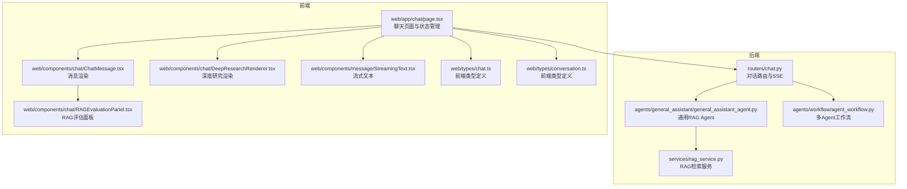
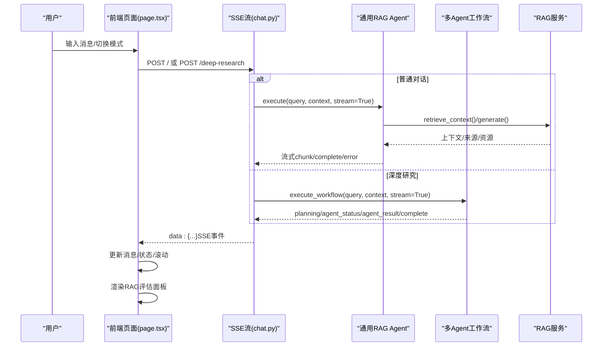
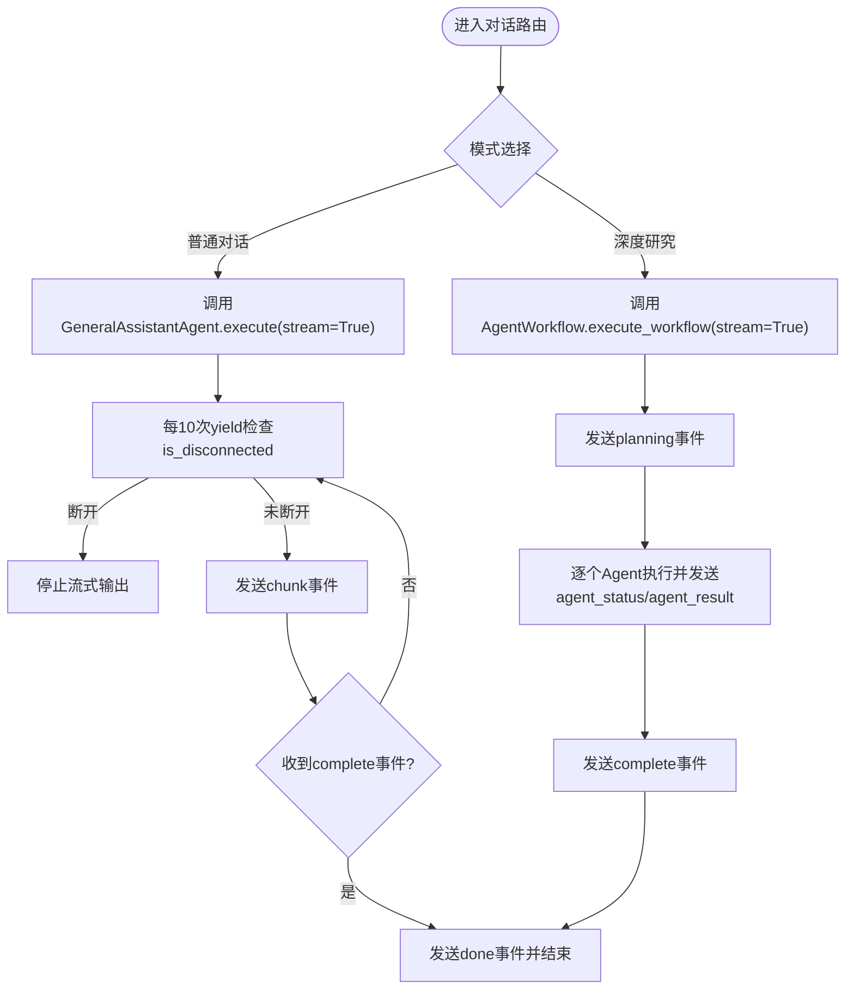
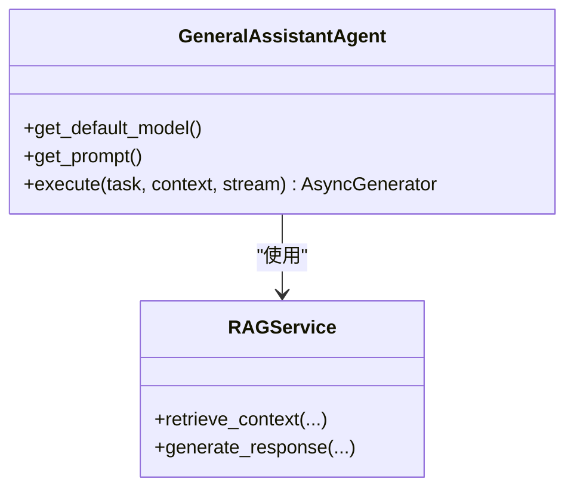
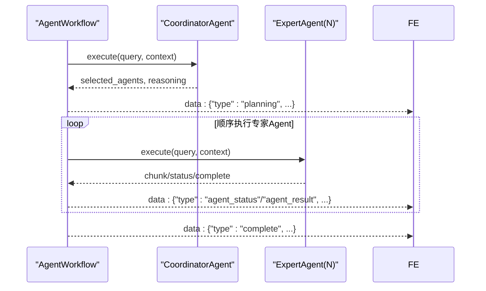
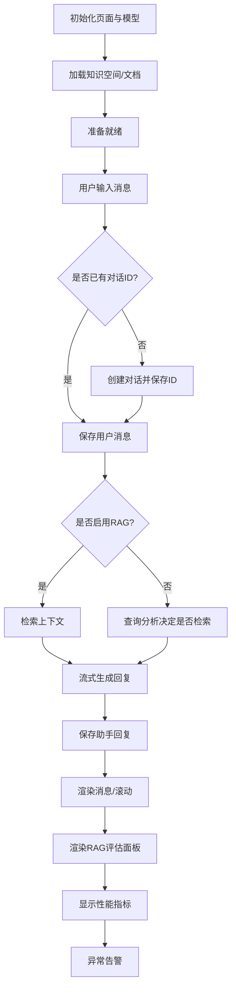
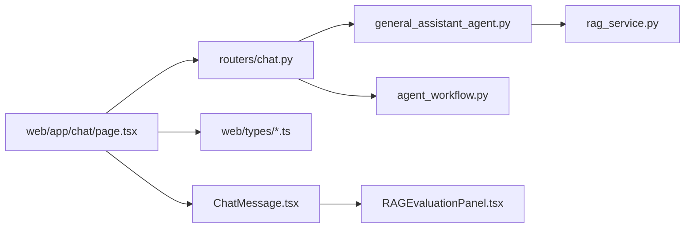

# 对话系统

<cite>
**本文引用的文件**
- [routers/chat.py](file://routers/chat.py)
- [agents/general_assistant/general_assistant_agent.py](file://agents/general_assistant/general_assistant_agent.py)
- [services/rag_service.py](file://services/rag_service.py)
- [agents/workflow/agent_workflow.py](file://agents/workflow/agent_workflow.py)
- [web/app/chat/page.tsx](file://web/app/chat/page.tsx)
- [web/components/chat/ChatMessage.tsx](file://web/components/chat/ChatMessage.tsx)
- [web/components/chat/RAGEvaluationPanel.tsx](file://web/components/chat/RAGEvaluationPanel.tsx)
- [web/components/chat/DeepResearchRenderer.tsx](file://web/components/chat/DeepResearchRenderer.tsx)
- [web/components/message/StreamingText.tsx](file://web/components/message/StreamingText.tsx)
- [web/types/chat.ts](file://web/types/chat.ts)
- [web/types/conversation.ts](file://web/types/conversation.ts)
</cite>

## 更新摘要
**所做更改**
- 新增RAG评估面板组件，提供实时性能监控和异常告警功能
- 更新ChatMessage组件以集成RAG指标显示
- 在ChatMessage类型定义中新增RAGEvaluationMetrics接口
- 增强前端对话界面的可视化监控能力

## 目录
1. [简介](#简介)
2. [项目结构](#项目结构)
3. [核心组件](#核心组件)
4. [架构总览](#架构总览)
5. [详细组件分析](#详细组件分析)
6. [依赖分析](#依赖分析)
7. [性能考虑](#性能考虑)
8. [故障排查指南](#故障排查指南)
9. [结论](#结论)
10. [附录](#附录)

## 简介
本对话系统提供两类核心能力：
- 普通对话模式：基于通用RAG（检索增强生成）的问答，支持来源标注与资源推荐。
- 深度研究模式：多Agent协作的综合研究，输出结构化HTML报告，展示各Agent的分析过程与结论。

系统采用FastAPI后端与Next.js前端，通过SSE（Server-Sent Events）实现流式响应，支持客户端断开检测、错误传播与前端状态恢复。对话历史以匿名模式存储于MongoDB，支持创建、查询、更新、删除、消息增删改与重新生成等操作。

**新增功能**：系统现已集成RAG评估面板组件，提供实时性能监控、异常告警和可视化指标展示，帮助用户更好地理解和优化RAG对话质量。

## 项目结构
后端路由集中在对话路由模块，核心Agent与RAG服务位于agents与services目录；前端位于web目录，包含聊天页面、消息组件、RAG评估面板与流式渲染组件。

**图表来源**
- [routers/chat.py:1-1324](file://routers/chat.py#L1-L1324)
- [agents/general_assistant/general_assistant_agent.py:1-167](file://agents/general_assistant/general_assistant_agent.py#L1-L167)
- [agents/workflow/agent_workflow.py:1-388](file://agents/workflow/agent_workflow.py#L1-L388)
- [services/rag_service.py:1-248](file://services/rag_service.py#L1-L248)
- [web/app/chat/page.tsx:1-800](file://web/app/chat/page.tsx#L1-L800)
- [web/components/chat/ChatMessage.tsx:1-182](file://web/components/chat/ChatMessage.tsx#L1-L182)
- [web/components/chat/RAGEvaluationPanel.tsx:1-121](file://web/components/chat/RAGEvaluationPanel.tsx#L1-L121)
- [web/components/chat/DeepResearchRenderer.tsx:1-177](file://web/components/chat/DeepResearchRenderer.tsx#L1-L177)
- [web/components/message/StreamingText.tsx:1-79](file://web/components/message/StreamingText.tsx#L1-L79)
- [web/types/chat.ts:1-99](file://web/types/chat.ts#L1-L99)
- [web/types/conversation.ts:1-10](file://web/types/conversation.ts#L1-L10)

**章节来源**
- [routers/chat.py:1-1324](file://routers/chat.py#L1-L1324)
- [web/app/chat/page.tsx:1-800](file://web/app/chat/page.tsx#L1-L800)

## 核心组件
- 对话路由与SSE
  - 提供创建、查询、更新、删除对话，添加/更新/删除消息，重新生成回答等REST接口。
  - 对话与深度研究均通过SSE流式返回，支持客户端断开检测与错误传播。
- 通用RAG Agent
  - 负责RAG检索、上下文构建与流式生成，支持来源与资源信息返回。
- 多Agent工作流
  - 协调型Agent规划任务，专家Agent顺序执行，前端实时展示Agent状态与结果。
- 前端聊天页面
  - 管理消息列表、加载步骤、流式状态、模型配置、知识空间选择、文件上传与状态轮询。
- 前端消息组件
  - 支持消息渲染、编辑、重新生成、来源展示与思考点占位。
- **新增** RAG评估面板
  - 实时展示检索触发状态、召回条数、上下文长度、响应时间等关键指标。
  - 提供异常告警功能，自动检测性能阈值并生成警告信息。

**章节来源**
- [routers/chat.py:97-449](file://routers/chat.py#L97-L449)
- [agents/general_assistant/general_assistant_agent.py:49-167](file://agents/general_assistant/general_assistant_agent.py#L49-L167)
- [agents/workflow/agent_workflow.py:106-337](file://agents/workflow/agent_workflow.py#L106-L337)
- [web/app/chat/page.tsx:680-1292](file://web/app/chat/page.tsx#L680-L1292)
- [web/components/chat/ChatMessage.tsx:18-182](file://web/components/chat/ChatMessage.tsx#L18-L182)
- [web/components/chat/RAGEvaluationPanel.tsx:1-121](file://web/components/chat/RAGEvaluationPanel.tsx#L1-L121)

## 架构总览
系统采用"路由层-代理层-服务层-前端组件"的分层设计。路由层负责请求校验与SSE流式输出；代理层封装业务流程（RAG或多Agent工作流）；服务层提供检索与模型生成能力；前端负责状态管理与交互渲染。

**图表来源**
- [routers/chat.py:615-912](file://routers/chat.py#L615-L912)
- [agents/general_assistant/general_assistant_agent.py:49-167](file://agents/general_assistant/general_assistant_agent.py#L49-L167)
- [agents/workflow/agent_workflow.py:106-337](file://agents/workflow/agent_workflow.py#L106-L337)
- [services/rag_service.py:10-242](file://services/rag_service.py#L10-L242)

## 详细组件分析

### 对话路由与SSE（后端）
- 匿名对话机制
  - 对话创建时user_id为空，实现匿名存储；消息添加、更新、删除均基于对话ID。
- 对话历史管理
  - 支持按ID查询完整对话（含消息列表）；最近N轮对话作为上下文注入到RAG或工作流。
- 消息存储与检索
  - 每条消息带message_id、角色、内容、时间戳、来源与推荐资源；支持编辑用户消息、删除后续消息并重新生成。
- 流式响应处理
  - 使用StreamingResponse与SSE，按10次yield检查一次is_disconnected，异常捕获断开连接并停止输出。
- 深度研究模式
  - 多Agent顺序执行，前端接收planning、agent_status、agent_result与complete事件，最终生成HTML并返回done标记。

**图表来源**
- [routers/chat.py:615-912](file://routers/chat.py#L615-L912)

**章节来源**
- [routers/chat.py:97-449](file://routers/chat.py#L97-L449)
- [routers/chat.py:615-912](file://routers/chat.py#L615-L912)

### 通用RAG Agent（后端）
- 检索与生成
  - 并行检索多个知识空间集合，去重同文档最高分块，构建上下文；调用模型生成流式回复。
- 来源与资源
  - 返回sources与recommended_resources，前端用于消息渲染与"参考来源"展示。
- 错误处理
  - 捕获生成异常并返回error事件，保证SSE稳定性。

**图表来源**
- [agents/general_assistant/general_assistant_agent.py:9-167](file://agents/general_assistant/general_assistant_agent.py#L9-L167)
- [services/rag_service.py:7-248](file://services/rag_service.py#L7-L248)

**章节来源**
- [agents/general_assistant/general_assistant_agent.py:49-167](file://agents/general_assistant/general_assistant_agent.py#L49-L167)
- [services/rag_service.py:10-242](file://services/rag_service.py#L10-L242)

### 多Agent工作流（后端）
- 协调与执行
  - 协调型Agent规划任务并选择专家Agent；专家Agent顺序执行，前端实时展示状态与结果。
- 状态与事件
  - 发送planning、agent_status、agent_result与complete事件，前端据此渲染深度研究面板。

**图表来源**
- [agents/workflow/agent_workflow.py:106-337](file://agents/workflow/agent_workflow.py#L106-L337)

**章节来源**
- [agents/workflow/agent_workflow.py:106-337](file://agents/workflow/agent_workflow.py#L106-L337)

### 前端聊天页面与组件
- 状态管理
  - 维护messages、conversationId、loadingStep、agentStatuses、deepResearchResults等；支持localStorage恢复与保存。
- 流式更新
  - 使用AbortController中断上一轮请求；流式事件按chunk拼接，滚动到底部；错误消息自动保存到对话。
- 深度研究渲染
  - 将HTML结果转换为Markdown并渲染，按Agent类型分段展示。
- 消息组件
  - 支持用户消息编辑、助手消息重新生成、来源列表展示与思考点占位。
- **新增** RAG评估面板
  - 在助手消息下方显示RAG性能指标，包括检索触发状态、召回条数、上下文长度、响应时间等。
  - 自动检测性能阈值并生成异常告警，帮助用户识别潜在问题。

**图表来源**
- [web/app/chat/page.tsx:680-1292](file://web/app/chat/page.tsx#L680-L1292)

**章节来源**
- [web/app/chat/page.tsx:680-1292](file://web/app/chat/page.tsx#L680-L1292)
- [web/components/chat/ChatMessage.tsx:18-182](file://web/components/chat/ChatMessage.tsx#L18-L182)
- [web/components/chat/RAGEvaluationPanel.tsx:1-121](file://web/components/chat/RAGEvaluationPanel.tsx#L1-L121)
- [web/components/chat/DeepResearchRenderer.tsx:114-177](file://web/components/chat/DeepResearchRenderer.tsx#L114-L177)
- [web/components/message/StreamingText.tsx:16-79](file://web/components/message/StreamingText.tsx#L16-L79)
- [web/types/chat.ts:1-99](file://web/types/chat.ts#L1-L99)
- [web/types/conversation.ts:1-10](file://web/types/conversation.ts#L1-L10)

### RAG评估面板组件（新增）
- **功能概述**
  - 提供实时性能监控，展示RAG对话的关键指标和异常告警。
  - 支持展开/折叠显示，避免界面拥挤。
- **核心指标**
  - 检索触发状态：是否启用了增强检索
  - 召回条数：检索到的来源数量
  - 上下文长度：构建的上下文字符数
  - 性能指标：检索耗时、首token耗时、总响应耗时
- **异常检测**
  - 响应时间超过500ms标记为异常
  - 检索耗时超过300ms标记为异常
  - 召回条数少于3条时提示
- **阈值配置**
  - 检索耗时阈值：300ms
  - 响应时间阈值：500ms
  - 召回条数阈值：3条

**章节来源**
- [web/components/chat/RAGEvaluationPanel.tsx:1-121](file://web/components/chat/RAGEvaluationPanel.tsx#L1-L121)
- [web/types/chat.ts:3-19](file://web/types/chat.ts#L3-L19)

## 依赖分析
- 组件耦合
  - 路由层依赖Agent与RAG服务；Agent依赖RAG服务；前端依赖路由API与类型定义。
  - **新增** ChatMessage组件依赖RAGEvaluationPanel组件。
- 外部依赖
  - 数据库：MongoDB（对话与附件状态）、Qdrant（向量存储）。
  - 模型服务：Ollama（模型生成）。
- 循环依赖
  - 未发现循环导入；模块间通过函数调用解耦。

**图表来源**
- [routers/chat.py:1-1324](file://routers/chat.py#L1-L1324)
- [agents/general_assistant/general_assistant_agent.py:1-167](file://agents/general_assistant/general_assistant_agent.py#L1-L167)
- [agents/workflow/agent_workflow.py:1-388](file://agents/workflow/agent_workflow.py#L1-L388)
- [services/rag_service.py:1-248](file://services/rag_service.py#L1-L248)
- [web/app/chat/page.tsx:1-800](file://web/app/chat/page.tsx#L1-L800)
- [web/types/chat.ts:1-99](file://web/types/chat.ts#L1-L99)
- [web/types/conversation.ts:1-10](file://web/types/conversation.ts#L1-L10)
- [web/components/chat/ChatMessage.tsx:1-182](file://web/components/chat/ChatMessage.tsx#L1-L182)
- [web/components/chat/RAGEvaluationPanel.tsx:1-121](file://web/components/chat/RAGEvaluationPanel.tsx#L1-L121)

**章节来源**
- [routers/chat.py:1-1324](file://routers/chat.py#L1-L1324)
- [agents/general_assistant/general_assistant_agent.py:1-167](file://agents/general_assistant/general_assistant_agent.py#L1-L167)
- [agents/workflow/agent_workflow.py:1-388](file://agents/workflow/agent_workflow.py#L1-L388)
- [services/rag_service.py:1-248](file://services/rag_service.py#L1-L248)
- [web/app/chat/page.tsx:1-800](file://web/app/chat/page.tsx#L1-L800)

## 性能考虑
- 流式输出节流
  - 每10次yield检查一次连接状态，降低检查频率以提升吞吐。
- 检索优化
  - 并行检索多个知识空间集合，合并结果后按文档去重与分数排序，减少冗余。
- 前端渲染
  - 流式文本组件按增量更新显示内容，避免全量重渲染；滚动采用requestAnimationFrame优化。
  - **新增** RAG评估面板支持展开/折叠，减少DOM节点数量。
- 状态持久化
  - localStorage恢复机制仅恢复最近5分钟内的流式生成状态，避免长时间占用。
- **新增** 性能监控
  - RAG评估面板提供实时性能指标，帮助识别性能瓶颈。
  - 异常阈值检测，及时发现潜在问题。

## 故障排查指南
- SSE断开
  - 后端捕获CancelledError/BrokenPipe/ConnectionReset/OSError，记录日志并停止输出。
- 生成异常
  - Agent返回error事件，前端显示错误消息并可选择重新生成。
- 对话/消息不存在
  - 404错误时前端提示并引导用户重新发起请求。
- 断网/刷新
  - 前端在beforeunload与visibilitychange时保存状态，恢复时自动滚动至最新内容。
- **新增** RAG性能问题
  - 检查RAG评估面板中的异常告警，识别响应时间过长、召回条数过少等问题。
  - 调整检索阈值和top_k参数优化召回效果。

**章节来源**
- [routers/chat.py:711-750](file://routers/chat.py#L711-L750)
- [web/app/chat/page.tsx:1261-1292](file://web/app/chat/page.tsx#L1261-L1292)
- [web/components/chat/RAGEvaluationPanel.tsx:30-39](file://web/components/chat/RAGEvaluationPanel.tsx#L30-L39)

## 结论
该对话系统通过清晰的分层设计与SSE流式传输，实现了从普通问答到深度研究的多样化能力。后端以Agent与RAG为核心，前端以状态管理与组件渲染为基础，形成稳定、可扩展的对话体验。

**新增的RAG评估面板组件显著增强了系统的可观测性和用户体验**，通过实时性能监控和异常告警，帮助用户更好地理解和优化RAG对话质量。建议在生产环境中进一步完善超时控制、并发限制与监控告警，以提升稳定性与可观测性。

## 附录

### API接口规范（摘要）
- 创建对话
  - 方法与路径：POST /conversations
  - 请求体：title, user_id（可选）, assistant_id（可选）
  - 响应：id, title, assistant_id, created_at, updated_at
- 获取对话列表
  - 方法与路径：GET /conversations?skip&limit
  - 响应：conversations[], total, skip, limit
- 获取对话详情
  - 方法与路径：GET /conversations/{conversation_id}
  - 响应：id, user_id, title, messages[], created_at, updated_at
- 添加消息（匿名）
  - 方法与路径：POST /conversations/{conversation_id}/messages
  - 请求体：role, content, sources（可选）, recommended_resources（可选）
  - 响应：success, message, timestamp
- 更新对话（匿名）
  - 方法与路径：PUT /conversations/{conversation_id}
  - 请求体：title（可选)
  - 响应：id, title, created_at, updated_at
- 删除对话（匿名）
  - 方法与路径：DELETE /conversations/{conversation_id}
  - 响应：success, message
- 编辑消息（匿名）
  - 方法与路径：PUT /conversations/{conversation_id}/messages/{message_id}
  - 请求体：content
  - 响应：success, message, message_id, timestamp
- 重新生成回答（匿名）
  - 方法与路径：POST /conversations/{conversation_id}/messages/{message_id}/regenerate
  - 响应：success, message, message_id, remaining_messages
- 普通对话（SSE）
  - 方法与路径：POST /
  - 请求体：query, assistant_id（可选）, knowledge_space_ids（可选）, conversation_id（可选）, enable_rag（布尔）, mode（normal/network）, generation_config（可选）
  - 响应：SSE事件（content/chunk、done、sources、recommended_resources、error）
- 深度研究（SSE）
  - 方法与路径：POST /deep-research
  - 请求体：query, assistant_id（可选）, conversation_id（可选）, enabled_agents（可选）, generation_config（可选)
  - 响应：SSE事件（planning、agent_status、agent_result、html、done、error）

**章节来源**
- [routers/chat.py:97-449](file://routers/chat.py#L97-L449)
- [routers/chat.py:615-912](file://routers/chat.py#L615-L912)

### 普通对话与深度研究模式对比
- 普通对话
  - 单Agent（GeneralAssistantAgent）执行，返回流式文本与来源信息。
- 深度研究
  - 多Agent协作，前端接收规划与各Agent状态/结果，最终生成HTML并渲染。

**章节来源**
- [agents/general_assistant/general_assistant_agent.py:49-167](file://agents/general_assistant/general_assistant_agent.py#L49-L167)
- [agents/workflow/agent_workflow.py:106-337](file://agents/workflow/agent_workflow.py#L106-L337)
- [routers/chat.py:753-912](file://routers/chat.py#L753-L912)

### 前端集成要点
- 使用AbortController中断上一轮请求，避免竞态。
- SSE事件解析：根据type字段分别处理content/chunk、done、sources、agent_status、agent_result、html、error。
- 深度研究模式：使用DeepResearchRenderer将HTML转换为Markdown并渲染。
- 消息编辑与重新生成：调用对应后端接口并更新本地状态。
- **新增** RAG评估面板集成：
  - 在ChatMessage组件中条件渲染RAGEvaluationPanel
  - 支持metrics和sourceCount两种数据源
  - 自动计算异常告警并显示警告数量

**章节来源**
- [web/app/chat/page.tsx:680-1292](file://web/app/chat/page.tsx#L680-L1292)
- [web/components/chat/DeepResearchRenderer.tsx:114-177](file://web/components/chat/DeepResearchRenderer.tsx#L114-L177)
- [web/components/chat/ChatMessage.tsx:167-173](file://web/components/chat/ChatMessage.tsx#L167-L173)
- [web/components/chat/RAGEvaluationPanel.tsx:18-50](file://web/components/chat/RAGEvaluationPanel.tsx#L18-L50)
- [web/types/chat.ts:1-99](file://web/types/chat.ts#L1-L99)
- [web/types/conversation.ts:1-10](file://web/types/conversation.ts#L1-L10)

### RAG评估指标类型定义
- **RAGEvaluationMetrics接口**
  - retrieval_triggered：是否触发了增强检索
  - source_count：召回条数（来源chunk数）
  - context_length：上下文字符长度
  - retrieval_time_ms：检索耗时（毫秒）
  - time_to_first_token_ms：首token前耗时（毫秒）
  - response_time_ms：总响应耗时（毫秒）
  - warnings：异常标记数组

**章节来源**
- [web/types/chat.ts:3-19](file://web/types/chat.ts#L3-L19)