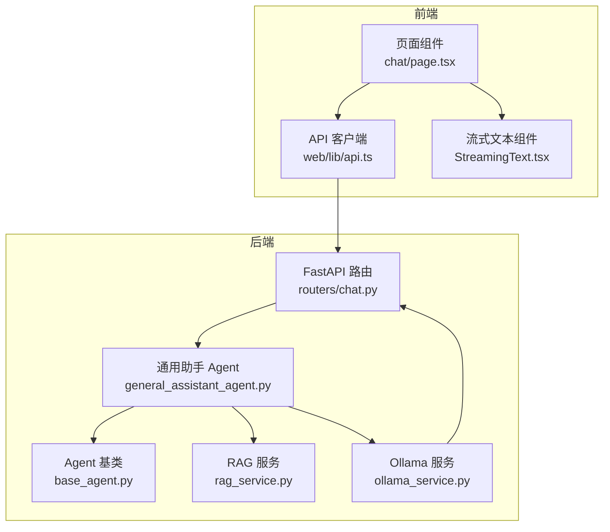
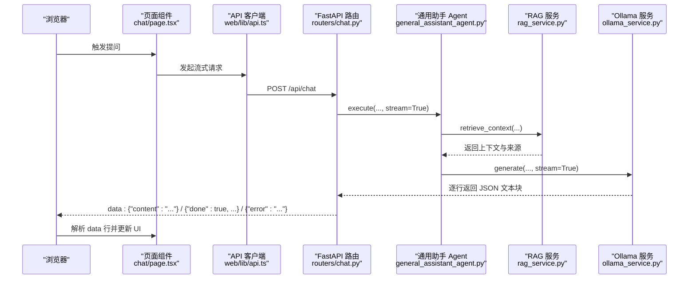
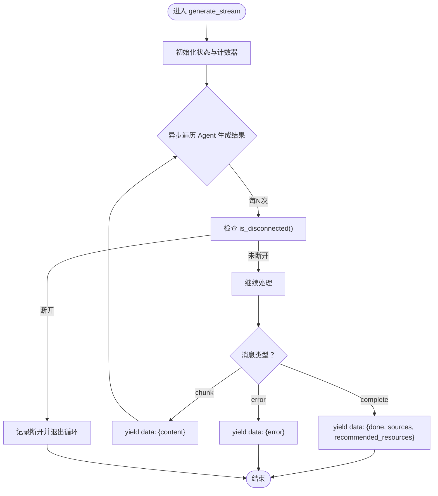
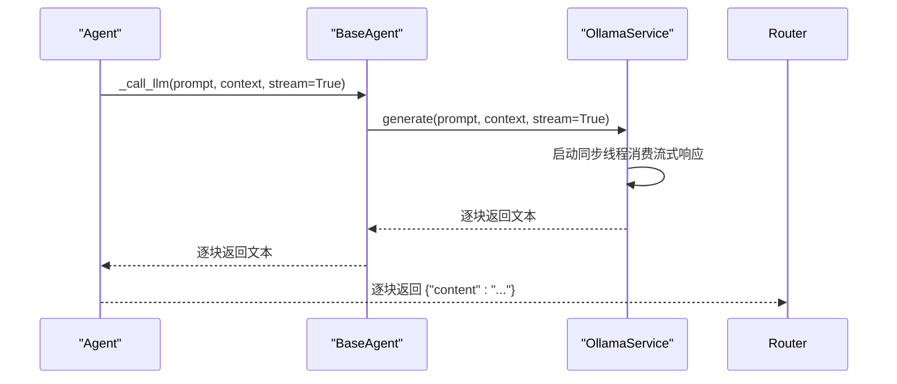
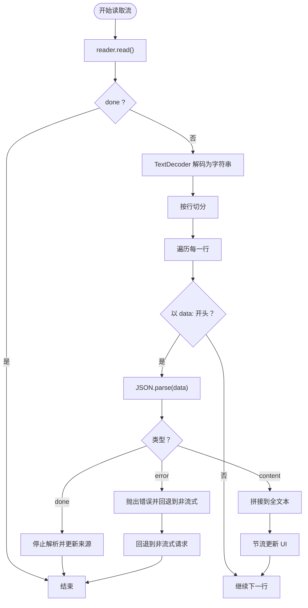
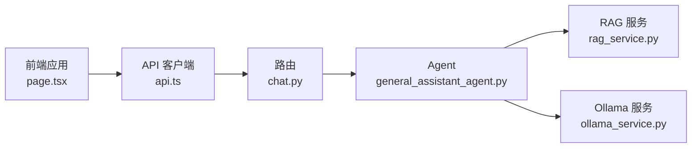

# 流式响应处理

<cite>
**本文引用的文件**
- [chat.py](file://routers/chat.py)
- [ollama_service.py](file://services/ollama_service.py)
- [base_agent.py](file://agents/base/base_agent.py)
- [general_assistant_agent.py](file://agents/general_assistant/general_assistant_agent.py)
- [rag_service.py](file://services/rag_service.py)
- [StreamingText.tsx](file://web/components/message/StreamingText.tsx)
- [page.tsx](file://web/app/chat/page.tsx)
- [api.ts](file://web/lib/api.ts)
</cite>

## 目录
1. [简介](#简介)
2. [项目结构](#项目结构)
3. [核心组件](#核心组件)
4. [架构总览](#架构总览)
5. [详细组件分析](#详细组件分析)
6. [依赖分析](#依赖分析)
7. [性能考虑](#性能考虑)
8. [故障排查指南](#故障排查指南)
9. [结论](#结论)
10. [附录](#附录)

## 简介
本文件系统化阐述本项目的流式响应处理机制，重点覆盖：
- SSE（Server-Sent Events）实现与事件流格式
- 数据传输协议与客户端连接管理
- 异步生成器、内存管理与背压处理
- 客户端断开连接检测与资源清理策略
- 流式响应数据格式规范（content chunk、complete 标记、error 处理）
- 前端组件集成指南（EventSource/ReadableStream 使用、消息解析、UI 更新策略）
- 性能优化建议（批量发送、压缩传输、连接复用）

## 项目结构
围绕流式响应的关键模块分布如下：
- 后端路由层：FastAPI 路由负责创建 StreamingResponse，使用 text/event-stream 媒体类型
- 代理与生成层：Agent 负责组织任务与上下文，OllamaService 负责与本地大模型服务交互
- 检索增强层：RAGService 负责并行检索与上下文构建
- 前端层：Next.js 应用通过 ReadableStream/TextDecoder 解析服务端推送，组件负责增量渲染与滚动

图表来源
- [chat.py](file://routers/chat.py)
- [general_assistant_agent.py](file://agents/general_assistant/general_assistant_agent.py)
- [base_agent.py](file://agents/base/base_agent.py)
- [ollama_service.py](file://services/ollama_service.py)
- [rag_service.py](file://services/rag_service.py)
- [page.tsx](file://web/app/chat/page.tsx)
- [StreamingText.tsx](file://web/components/message/StreamingText.tsx)
- [api.ts](file://web/lib/api.ts)

章节来源
- [chat.py](file://routers/chat.py)
- [general_assistant_agent.py](file://agents/general_assistant/general_assistant_agent.py)
- [base_agent.py](file://agents/base/base_agent.py)
- [ollama_service.py](file://services/ollama_service.py)
- [rag_service.py](file://services/rag_service.py)
- [page.tsx](file://web/app/chat/page.tsx)
- [StreamingText.tsx](file://web/components/message/StreamingText.tsx)
- [api.ts](file://web/lib/api.ts)

## 核心组件
- FastAPI 路由与 StreamingResponse
  - 使用 text/event-stream 媒体类型，设置缓存控制与保持连接头
  - 通过异步生成器逐条发送 JSON 字符串，遵循 data: 行格式
- Agent 与 OllamaService
  - Agent 将任务拆解为检索与生成两阶段，生成阶段通过 OllamaService 流式产出
  - OllamaService 在线程池中消费流式响应，将 JSON 行转为文本块
- 前端解析与渲染
  - 使用 ReadableStream + TextDecoder 逐块解码，按行解析 data: JSON
  - 组件按增量更新文本，支持滚动与光标动画

章节来源
- [chat.py](file://routers/chat.py)
- [general_assistant_agent.py](file://agents/general_assistant/general_assistant_agent.py)
- [base_agent.py](file://agents/base/base_agent.py)
- [ollama_service.py](file://services/ollama_service.py)
- [page.tsx](file://web/app/chat/page.tsx)
- [StreamingText.tsx](file://web/components/message/StreamingText.tsx)

## 架构总览
下面的序列图展示从请求到流式输出的关键调用链路。

图表来源
- [chat.py](file://routers/chat.py)
- [general_assistant_agent.py](file://agents/general_assistant/general_assistant_agent.py)
- [rag_service.py](file://services/rag_service.py)
- [ollama_service.py](file://services/ollama_service.py)
- [page.tsx](file://web/app/chat/page.tsx)
- [api.ts](file://web/lib/api.ts)

## 详细组件分析

### 后端路由与 SSE 实现
- 媒体类型与头部
  - 使用 text/event-stream，设置 Cache-Control: no-cache、Connection: keep-alive、X-Accel-Buffering: no
- 异步生成器
  - 逐条 yield data: JSON 行，支持三种消息类型：
    - content 块：{"content": "..."}
    - 完成标记：{"done": true, "sources": [...], "recommended_resources": [...]}
    - 错误消息：{"error": "..."}
- 断开检测与异常处理
  - 每 N 次生成检查客户端连接状态，若断开则停止
  - 捕获取消、管道破裂、连接重置等异常，优雅终止
  - 捕获系统错误时发送 error 消息，随后关闭流

图表来源
- [chat.py](file://routers/chat.py)

章节来源
- [chat.py](file://routers/chat.py)

### Agent 与 OllamaService 的异步生成器
- Agent 层
  - 将任务分为检索与生成两个阶段，生成阶段以流式方式产出文本块
  - 通过 BaseAgent._call_llm 调用 OllamaService.generate
- OllamaService 层
  - 在线程池中发起同步流式请求，按行读取响应
  - 将 JSON 行解析为文本块，遇到 done 标记或异常时结束
  - 通过队列在同步线程与异步事件循环间传递数据，避免阻塞

图表来源
- [general_assistant_agent.py](file://agents/general_assistant/general_assistant_agent.py)
- [base_agent.py](file://agents/base/base_agent.py)
- [ollama_service.py](file://services/ollama_service.py)

章节来源
- [general_assistant_agent.py](file://agents/general_assistant/general_assistant_agent.py)
- [base_agent.py](file://agents/base/base_agent.py)
- [ollama_service.py](file://services/ollama_service.py)

### RAG 检索与上下文构建
- 并行检索多个知识空间集合，聚合结果并去重
- 构建上下文文本与来源信息，供生成阶段使用
- 即使检索失败也允许继续生成，体现健壮性

章节来源
- [rag_service.py](file://services/rag_service.py)

### 前端解析与 UI 更新
- 使用 ReadableStream + TextDecoder 逐块解码
- 按行解析 data: JSON，分别处理 content、done、error 三类消息
- 采用节流与 requestAnimationFrame 优化渲染性能，支持自动滚动与光标动画

图表来源
- [page.tsx](file://web/app/chat/page.tsx)

章节来源
- [page.tsx](file://web/app/chat/page.tsx)
- [StreamingText.tsx](file://web/components/message/StreamingText.tsx)

## 依赖分析
- 组件耦合
  - 路由依赖 Agent 与服务层；Agent 依赖 RAG 与 OllamaService；前端依赖路由返回的 SSE
- 循环依赖
  - 未发现直接循环导入；各层职责清晰，单向依赖
- 外部依赖
  - FastAPI StreamingResponse、Python asyncio、requests、Next.js ReadableStream

图表来源
- [chat.py](file://routers/chat.py)
- [general_assistant_agent.py](file://agents/general_assistant/general_assistant_agent.py)
- [rag_service.py](file://services/rag_service.py)
- [ollama_service.py](file://services/ollama_service.py)
- [page.tsx](file://web/app/chat/page.tsx)
- [api.ts](file://web/lib/api.ts)

章节来源
- [chat.py](file://routers/chat.py)
- [general_assistant_agent.py](file://agents/general_assistant/general_assistant_agent.py)
- [rag_service.py](file://services/rag_service.py)
- [ollama_service.py](file://services/ollama_service.py)
- [page.tsx](file://web/app/chat/page.tsx)
- [api.ts](file://web/lib/api.ts)

## 性能考虑
- 背压与节流
  - 后端每 N 次生成检查连接状态，降低无效写入
  - 前端对频繁更新进行节流与 requestAnimationFrame 合并，减少重排
- 资源释放
  - 断开检测到客户端断开后立即停止生成与流写入
  - 异常路径发送 error 消息后尽快关闭连接
- 连接与传输
  - 设置 Connection: keep-alive 与 X-Accel-Buffering: no，避免代理缓冲
  - 建议在反向代理层禁用 gzip 压缩以保证实时性（视部署环境而定）
- 生成吞吐
  - OllamaService 使用线程池与队列在同步与异步间解耦，避免阻塞事件循环
  - RAG 并行检索多个集合，提升上下文召回质量

[本节为通用性能指导，无需特定文件引用]

## 故障排查指南
- 客户端断开连接
  - 现象：后端日志出现断开连接提示，前端停止更新
  - 处理：确认 is_disconnected() 检测生效；必要时缩短生成间隔以更快感知断开
- 流式解析错误
  - 现象：前端解析 JSON 失败或空白行导致丢帧
  - 处理：确保服务端每条 data: 行后有空行分隔；前端对空行与解析异常进行容错
- 大模型响应慢
  - 现象：等待超时或空闲超时
  - 处理：适当提高超时阈值；检查 Ollama 服务可用性与模型加载状态
- UI 不更新
  - 现象：content 到达但界面无变化
  - 处理：确认节流定时器与 requestAnimationFrame 的调度；检查组件是否正确接收最新文本

章节来源
- [chat.py](file://routers/chat.py)
- [page.tsx](file://web/app/chat/page.tsx)
- [ollama_service.py](file://services/ollama_service.py)

## 结论
本项目通过 FastAPI 的 StreamingResponse 与前端 ReadableStream/TextDecoder 实现了可靠的 SSE 流式通信。后端以 Agent + RAG + OllamaService 的分层设计实现了可扩展的生成链路，前端以节流与增量渲染保障了良好的用户体验。断开检测与异常处理完善，具备生产级可用性。建议在部署层面进一步优化反向代理与网络配置以获得更佳的实时性表现。

[本节为总结性内容，无需特定文件引用]

## 附录

### 流式响应数据格式规范
- content 块
  - 形式：data: {"content": "文本片段"}
  - 语义：增量文本块，前端应拼接并渲染
- complete 标记
  - 形式：data: {"done": true, "sources": [...], "recommended_resources": [...]}
  - 语义：生成完成，sources/recommended_resources 为本次生成的引用信息
- error 消息
  - 形式：data: {"error": "错误描述"}
  - 语义：生成过程发生错误，前端应回退到非流式或提示错误

章节来源
- [chat.py](file://routers/chat.py)

### 前端集成要点（Next.js/React）
- 使用 fetch 获取 ReadableStream，配合 TextDecoder 逐块解析
- 按行解析 data: JSON，分别处理 content/done/error
- 渲染组件应支持增量更新与自动滚动，必要时使用节流与 requestAnimationFrame
- 断流回退：解析到 error 或流异常时，回退到一次性非流式请求

章节来源
- [page.tsx](file://web/app/chat/page.tsx)
- [StreamingText.tsx](file://web/components/message/StreamingText.tsx)
- [api.ts](file://web/lib/api.ts)