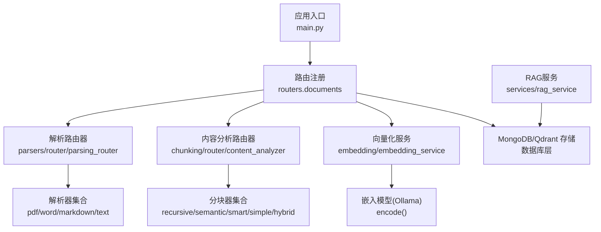
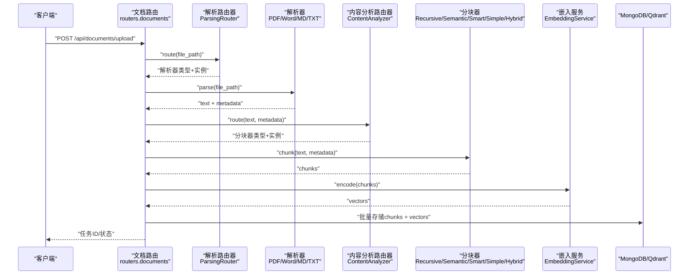
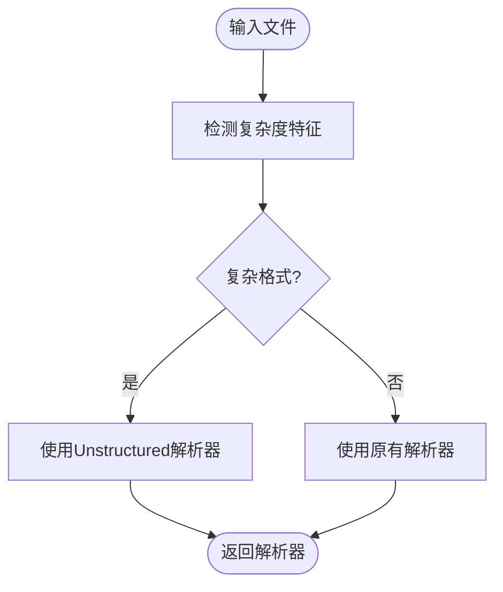
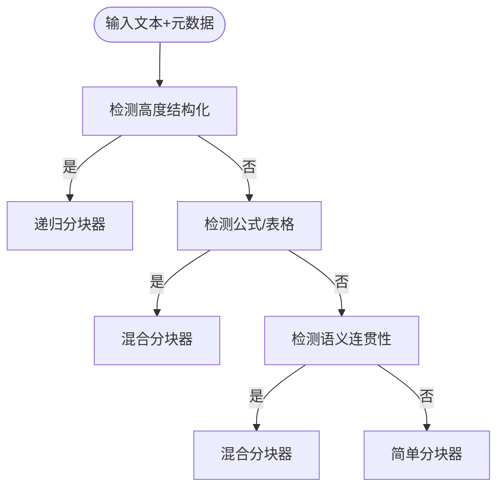
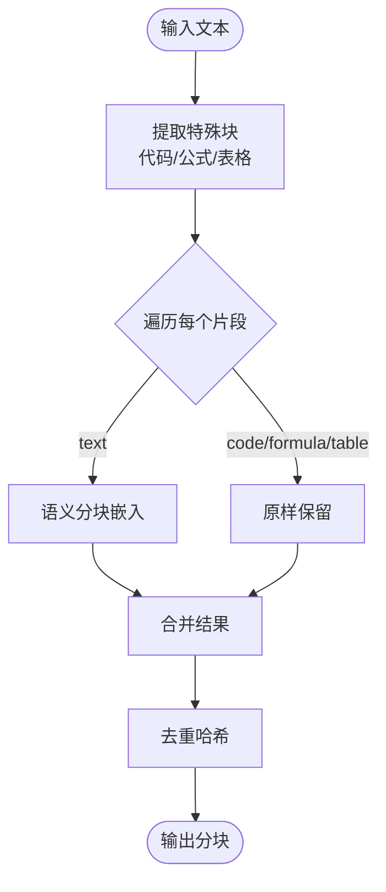
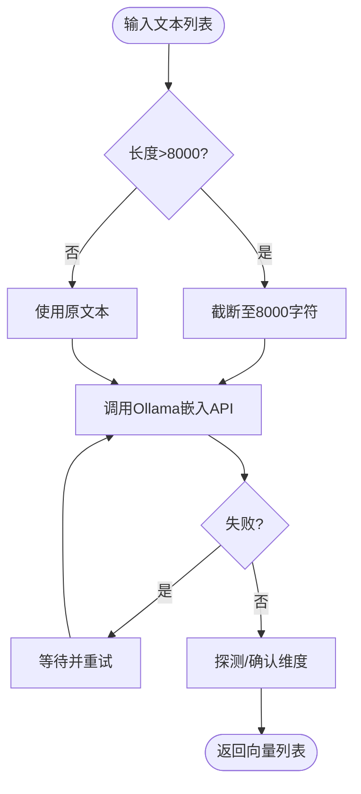
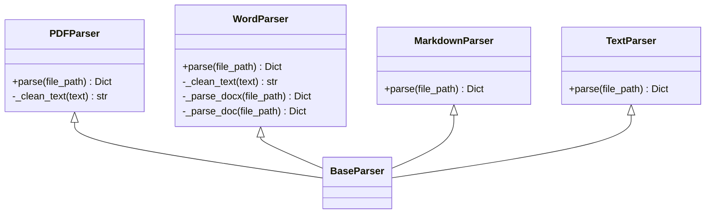
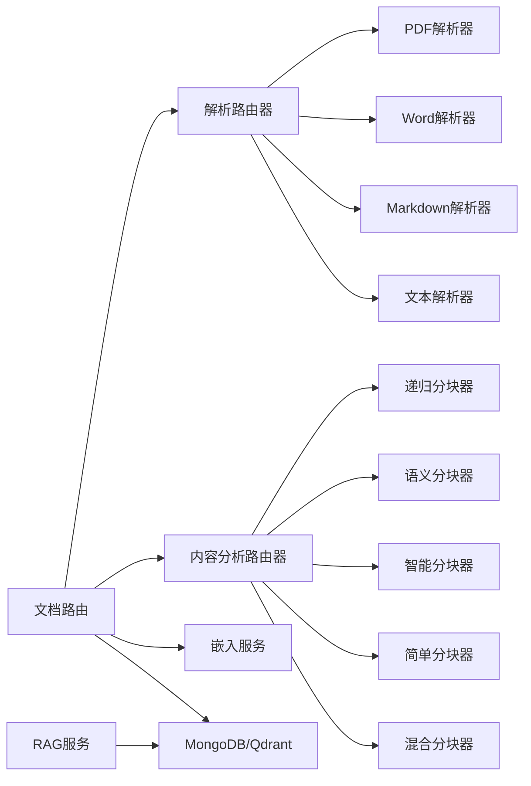

# 文档处理系统

<cite>
**本文档引用的文件**
- [main.py](file://main.py)
- [parsing_router.py](file://parsers/router/parsing_router.py)
- [content_analyzer.py](file://chunking/router/content_analyzer.py)
- [hybrid_chunker.py](file://chunking/hybrid_chunker.py)
- [embedding_service.py](file://embedding/embedding_service.py)
- [pdf_parser.py](file://parsers/pdf_parser.py)
- [word_parser.py](file://parsers/word_parser.py)
- [markdown_parser.py](file://parsers/markdown_parser.py)
- [text_parser.py](file://parsers/text_parser.py)
- [recursive_chunker.py](file://chunking/langchain/recursive_chunker.py)
- [semantic_chunker.py](file://chunking/langchain/semantic_chunker.py)
- [simple_chunker.py](file://chunking/simple_chunker.py)
- [smart_chunker.py](file://chunking/smart_chunker.py)
- [documents.py](file://routers/documents.py)
- [rag_service.py](file://services/rag_service.py)
</cite>

## 目录
1. [简介](#简介)
2. [项目结构](#项目结构)
3. [核心组件](#核心组件)
4. [架构总览](#架构总览)
5. [详细组件分析](#详细组件分析)
6. [依赖关系分析](#依赖关系分析)
7. [性能考量](#性能考量)
8. [故障排除指南](#故障排除指南)
9. [结论](#结论)
10. [附录](#附录)

## 简介
本系统是一个面向高级RAG（检索增强生成）的多格式文档处理平台，支持PDF、Word、Markdown、纯文本等多种格式的自动解析、内容分析、智能分块、向量化与存储。系统通过“解析路由器”根据文档类型与特征选择合适的解析器；通过“内容分析路由器”根据文本内容与元数据特征选择最优分块策略；通过嵌入服务将文本转换为向量并存储到MongoDB与Qdrant中，最终为检索与问答提供高质量上下文。

## 项目结构
系统采用模块化设计，主要模块包括：
- 应用入口与路由：FastAPI应用入口负责加载环境变量、注册中间件与路由。
- 解析层：解析路由器根据文件特征选择解析器，内置PDF、Word、Markdown、文本解析器。
- 内容分析与分块：内容分析路由器根据文本结构与元数据选择分块策略，提供递归、语义、智能、简单与混合分块器。
- 向量化与存储：嵌入服务对接Ollama，提供文本向量化能力，并与MongoDB、Qdrant集成。
- API路由：文档上传、解析状态监控、分块结果获取等接口。
- RAG服务：检索上下文、聚合来源、生成回复。

**图表来源**
- [main.py:55-98](file://main.py#L55-L98)
- [documents.py:723-800](file://routers/documents.py#L723-L800)
- [parsing_router.py:10-246](file://parsers/router/parsing_router.py#L10-L246)
- [content_analyzer.py:11-284](file://chunking/router/content_analyzer.py#L11-L284)
- [embedding_service.py:8-278](file://embedding/embedding_service.py#L8-L278)

**章节来源**
- [main.py:1-157](file://main.py#L1-L157)
- [documents.py:1-800](file://routers/documents.py#L1-L800)

## 核心组件
- 解析路由器：根据文件类型与复杂度特征，选择Unstructured解析器或原有解析器。
- 内容分析路由器：根据文本结构、公式、表格、段落数等特征，选择递归、语义、智能或简单分块器。
- 混合分块器：结合规则分块与语义分块，保证代码、公式、表格完整性的同时提升语义连贯性。
- 向量化服务：对接Ollama嵌入模型，提供文本向量编码与维度探测。
- 文档处理流水线：上传→解析→分块→知识抽取→向量化→存储（MongoDB/Qdrant）→状态更新。
- RAG服务：检索上下文、聚合来源、生成回复。

**章节来源**
- [parsing_router.py:10-246](file://parsers/router/parsing_router.py#L10-L246)
- [content_analyzer.py:11-284](file://chunking/router/content_analyzer.py#L11-L284)
- [hybrid_chunker.py:9-179](file://chunking/hybrid_chunker.py#L9-L179)
- [embedding_service.py:8-278](file://embedding/embedding_service.py#L8-L278)
- [documents.py:274-721](file://routers/documents.py#L274-L721)
- [rag_service.py:7-248](file://services/rag_service.py#L7-L248)

## 架构总览
系统采用“解析-分块-向量化-存储-检索”的端到端流水线，解析与分块均具备超时监控与进度反馈，向量化采用分批处理与并发控制，存储支持MongoDB与Qdrant双写，RAG服务支持多集合并行检索。

**图表来源**
- [documents.py:274-721](file://routers/documents.py#L274-L721)
- [parsing_router.py:209-245](file://parsers/router/parsing_router.py#L209-L245)
- [content_analyzer.py:244-282](file://chunking/router/content_analyzer.py#L244-L282)
- [embedding_service.py:230-259](file://embedding/embedding_service.py#L230-L259)

## 详细组件分析

### 解析路由器（ParsingRouter）
- 功能概述：根据文件类型与复杂度特征（扫描版PDF、大文件、复杂表格/图片/公式等）选择解析器。
- 复杂度特征检测：
  - 扫描版PDF检测：统计前N页平均每页字符数，低于阈值判定为扫描版。
  - 大文件优先：超过阈值（如2MB）优先使用Unstructured。
  - Word复杂度：统计表格数、图片数、段落数等。
  - PDF复杂度：检查前几页是否包含文本，无文本则判定为图片/扫描版PDF。
- 解析器选择：
  - 复杂格式 → Unstructured解析器（延迟初始化，失败则回退）。
  - 标准格式 → 原有解析器工厂（ParserFactory）。
- 输出：返回解析器类型与实例，便于后续统一处理。

**图表来源**
- [parsing_router.py:32-178](file://parsers/router/parsing_router.py#L32-L178)
- [parsing_router.py:209-245](file://parsers/router/parsing_router.py#L209-L245)

**章节来源**
- [parsing_router.py:10-246](file://parsers/router/parsing_router.py#L10-L246)

### 内容分析路由器（ContentAnalyzer）
- 功能概述：根据文本内容与元数据特征选择最优分块策略。
- 特征检测：
  - 高度结构化内容（代码、LaTeX公式、Markdown/HTML结构化标记）→ 递归分块器。
  - 包含公式/表格或需要语义连贯性的长文档 → 混合分块器（替代语义分块器）。
  - 其他通用文档 → 简单分块器。
- 分块器选择：
  - 递归分块器：LangChain RecursiveCharacterTextSplitter，按多种分隔符优先级切分。
  - 语义分块器：LangChain SemanticChunker，基于嵌入相似度断点。
  - 智能分块器：针对公式/表格/标题/段落的智能合并策略。
  - 简单分块器：固定大小+分隔符优先策略。
  - 混合分块器：规则提取代码/公式/表格，普通文本语义分块，去重与元数据增强。

**图表来源**
- [content_analyzer.py:72-242](file://chunking/router/content_analyzer.py#L72-L242)
- [content_analyzer.py:244-282](file://chunking/router/content_analyzer.py#L244-L282)

**章节来源**
- [content_analyzer.py:11-284](file://chunking/router/content_analyzer.py#L11-L284)

### 混合分块器（HybridChunker）
- 核心特性：
  - 规则提取：正则匹配代码块、LaTeX公式、表格，保持完整性。
  - 语义分块：对普通文本使用基于嵌入的语义分块。
  - 去重：按文本哈希去重，避免重复向量。
  - 元数据增强：content_type标注（text/code/formula/table）。
- 参数：chunk_size、chunk_overlap、semantic_threshold。
- 流程：提取特殊块→逐段处理→语义分块或原样保留→去重→输出。

**图表来源**
- [hybrid_chunker.py:52-121](file://chunking/hybrid_chunker.py#L52-L121)
- [hybrid_chunker.py:123-174](file://chunking/hybrid_chunker.py#L123-L174)

**章节来源**
- [hybrid_chunker.py:9-179](file://chunking/hybrid_chunker.py#L9-L179)

### 向量化处理流程（EmbeddingService）
- 模型选择：支持显式指定或自动检测Ollama嵌入模型，支持规范化模型名称（含标签）。
- 编码流程：分批编码（批大小参数保留以兼容），对过长文本进行截断（避免Ollama错误），支持重试与超时控制。
- 维度探测：首次调用时探测向量维度，后续复用。
- 错误处理：连接/超时重试、模型不存在提示、空向量保护。

**图表来源**
- [embedding_service.py:175-228](file://embedding/embedding_service.py#L175-L228)
- [embedding_service.py:230-259](file://embedding/embedding_service.py#L230-L259)

**章节来源**
- [embedding_service.py:8-278](file://embedding/embedding_service.py#L8-L278)

### 多格式解析器
- PDF解析器：支持文本版与扫描版（OCR）、表格提取、公式分析、元数据提取（标题、作者、主题、页数）。
- Word解析器：支持.docx与.doc（doc需系统工具转换），提取段落、表格、图片、公式，编码清洗与格式保护。
- Markdown解析器：提取纯文本，保留表格、代码块、公式分析。
- 文本解析器：自动编码检测与读取。

**图表来源**
- [pdf_parser.py:12-208](file://parsers/pdf_parser.py#L12-L208)
- [word_parser.py:18-353](file://parsers/word_parser.py#L18-L353)
- [markdown_parser.py:11-97](file://parsers/markdown_parser.py#L11-L97)
- [text_parser.py:7-36](file://parsers/text_parser.py#L7-L36)

**章节来源**
- [pdf_parser.py:12-208](file://parsers/pdf_parser.py#L12-L208)
- [word_parser.py:18-353](file://parsers/word_parser.py#L18-L353)
- [markdown_parser.py:11-97](file://parsers/markdown_parser.py#L11-L97)
- [text_parser.py:7-36](file://parsers/text_parser.py#L7-L36)

### 分块器实现要点
- 递归分块器：LangChain递归字符分割，支持中英文标点与空格优先级。
- 语义分块器：基于嵌入相似度断点，失败时回退到简单分块。
- 智能分块器：保护公式完整性、识别段落与标题、按内容类型调整块大小。
- 简单分块器：固定大小+分隔符优先，防止无限循环。
- 混合分块器：规则+语义融合，去重与元数据增强。

**章节来源**
- [recursive_chunker.py:7-110](file://chunking/langchain/recursive_chunker.py#L7-L110)
- [semantic_chunker.py:8-139](file://chunking/langchain/semantic_chunker.py#L8-L139)
- [smart_chunker.py:7-408](file://chunking/smart_chunker.py#L7-L408)
- [simple_chunker.py:7-111](file://chunking/simple_chunker.py#L7-L111)
- [hybrid_chunker.py:9-179](file://chunking/hybrid_chunker.py#L9-L179)

### API接口说明（文档管理）
- 上传文档
  - 路径：POST /api/documents/upload
  - 参数：file（必填，支持PDF/DOCX/DOC/MD/TXT）、assistant_id（可选）、knowledge_space_id（可选）
  - 行为：保存文件→计算哈希→去重检查→后台任务处理（解析→分块→知识抽取→向量化→存储）
  - 返回：任务ID与初始状态
- 解析状态监控
  - 路由内部通过文档仓库更新进度（解析、分块、知识抽取、向量化、存储），前端轮询可基于文档状态查询。
- 分块结果获取
  - 分块完成后，文本块与元数据存储在MongoDB中，可通过查询接口获取（具体接口路径参见路由定义）。

**章节来源**
- [documents.py:723-800](file://routers/documents.py#L723-L800)
- [documents.py:274-721](file://routers/documents.py#L274-L721)

### RAG服务
- 检索上下文：支持多知识空间集合并行检索，聚合来源并按分数去重。
- 生成回复：可选择是否使用上下文，失败时可回退。
- 集合选择：优先使用知识空间集合名称，其次使用助手关联集合，最后使用默认集合。

**章节来源**
- [rag_service.py:10-242](file://services/rag_service.py#L10-L242)

## 依赖关系分析
- 组件耦合：
  - 解析路由器依赖解析器工厂与Unstructured解析器（可选）。
  - 内容分析路由器依赖多种分块器（延迟初始化）。
  - 文档路由依赖解析路由器、内容分析路由器、嵌入服务与数据库客户端。
  - RAG服务依赖检索器与数据库客户端。
- 外部依赖：
  - Ollama嵌入服务、LangChain（递归/语义分块）、PyPDF2、python-docx、requests等。
- 循环依赖：未发现直接循环依赖，模块职责清晰。

**图表来源**
- [parsing_router.py:10-246](file://parsers/router/parsing_router.py#L10-L246)
- [content_analyzer.py:11-284](file://chunking/router/content_analyzer.py#L11-L284)
- [documents.py:274-721](file://routers/documents.py#L274-L721)
- [rag_service.py:10-242](file://services/rag_service.py#L10-L242)

**章节来源**
- [parsing_router.py:10-246](file://parsers/router/parsing_router.py#L10-L246)
- [content_analyzer.py:11-284](file://chunking/router/content_analyzer.py#L11-L284)
- [documents.py:274-721](file://routers/documents.py#L274-L721)
- [rag_service.py:10-242](file://services/rag_service.py#L10-L242)

## 性能考量
- 并发与限流：
  - 应用启动时设置多worker（生产环境），限制并发连接数，增加keep-alive超时以支持大文件上传。
- 分块与向量化：
  - 分块与向量化均采用超时监控与进度更新，避免长时间阻塞。
  - 向量化分批处理（批大小可调），降低内存峰值。
- 存储策略：
  - MongoDB批量写入，Qdrant批量插入并重试，失败计数与健康检查。
- 模型与网络：
  - 嵌入服务支持重试与超时，自动检测模型，避免单点失败。
- 最佳实践：
  - 大文件（>2MB）优先使用Unstructured解析器。
  - 长文档与报告优先使用混合分块器。
  - 控制单块大小与重叠，平衡召回与上下文成本。

[本节为通用指导，无需列出具体文件来源]

## 故障排除指南
- 解析失败：
  - PDF扫描版：检查OCR与布局分析；必要时转为图像后手动处理。
  - Word.doc：安装antiword或LibreOffice后重试。
  - 文本为空：检查编码检测与清洗逻辑，确认公式保护与空白清理。
- 分块异常：
  - 递归/语义分块失败：回退到简单分块器；检查LangChain安装与版本。
  - 混合分块重复：确认去重哈希逻辑与元数据一致性。
- 向量化失败：
  - Ollama连接/超时：检查服务可达性、模型存在性与超时设置。
  - 空向量：确认文本长度与截断策略。
- 存储失败：
  - MongoDB写入：检查权限与连接；临时ID回退策略。
  - Qdrant写入：检查健康状态与批大小；失败计数与重试。
- API错误：
  - 全局异常处理器统一返回JSON，包含错误详情与CORS头。

**章节来源**
- [pdf_parser.py:103-204](file://parsers/pdf_parser.py#L103-L204)
- [word_parser.py:248-353](file://parsers/word_parser.py#L248-L353)
- [recursive_chunker.py:69-110](file://chunking/langchain/recursive_chunker.py#L69-L110)
- [semantic_chunker.py:81-139](file://chunking/langchain/semantic_chunker.py#L81-L139)
- [embedding_service.py:175-228](file://embedding/embedding_service.py#L175-L228)
- [documents.py:457-721](file://routers/documents.py#L457-L721)
- [main.py:109-126](file://main.py#L109-L126)

## 结论
本系统通过“解析路由器+内容分析路由器+多分块器+嵌入服务+多存储”的完整链路，实现了对多格式文档的自动化处理与高质量RAG检索。其核心优势在于：
- 智能解析与分块：依据文档特征与内容结构自动选择最优策略。
- 稳健的向量化与存储：分批处理、重试与健康检查保障高可用。
- 可扩展的API与RAG服务：支持多知识空间并行检索与灵活上下文生成。

[本节为总结性内容，无需列出具体文件来源]

## 附录
- 环境变量与配置：
  - 环境文件加载顺序与端口、Worker数量、超时与并发限制。
  - Ollama基础URL与嵌入模型名称。
- 数据库与集合：
  - MongoDB集合命名与Qdrant集合创建与健康检查。
- 最佳实践清单：
  - 大文件与复杂格式的处理策略。
  - 向量化批大小与重试策略。
  - 前端轮询与状态展示建议。

**章节来源**
- [main.py:20-52](file://main.py#L20-L52)
- [main.py:128-157](file://main.py#L128-L157)
- [embedding_service.py:21-44](file://embedding/embedding_service.py#L21-L44)
- [documents.py:498-569](file://routers/documents.py#L498-L569)