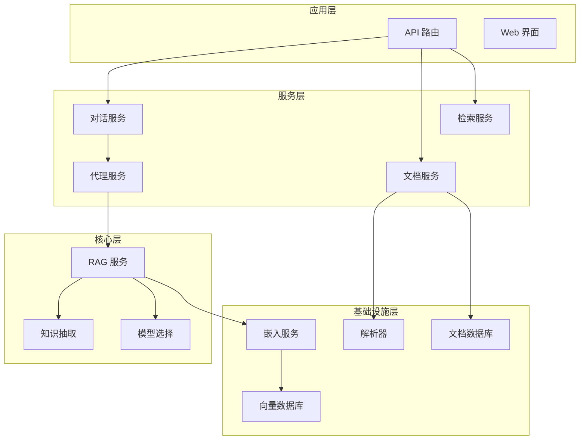
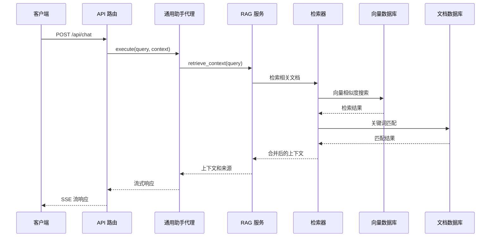
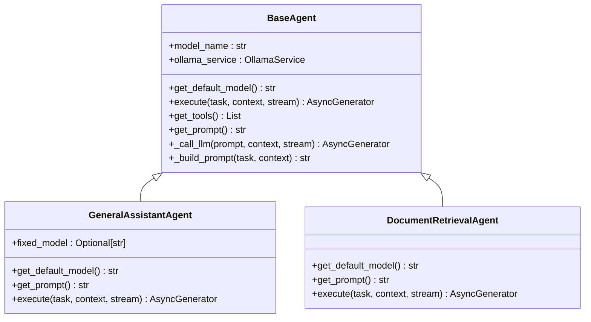
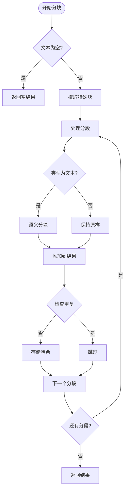
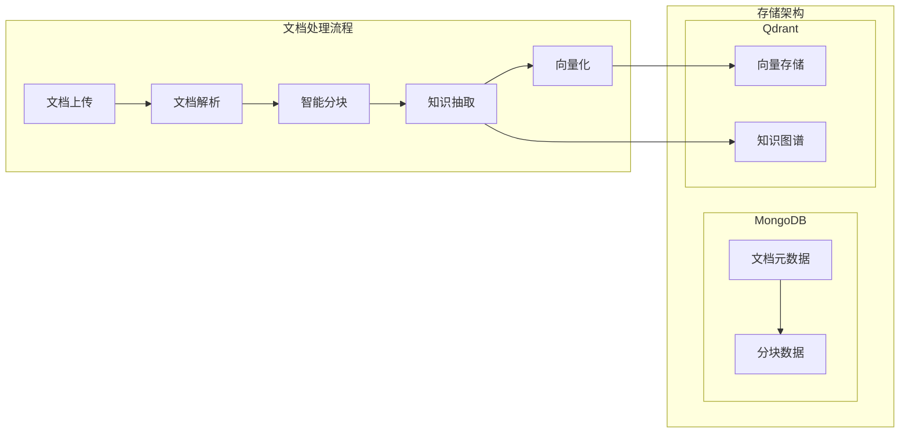
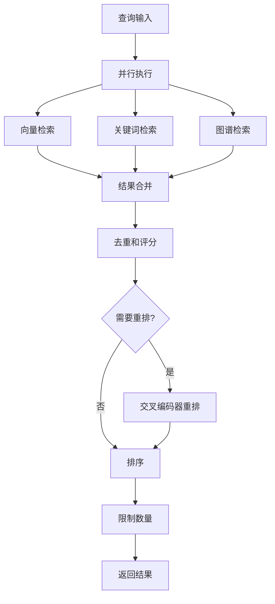
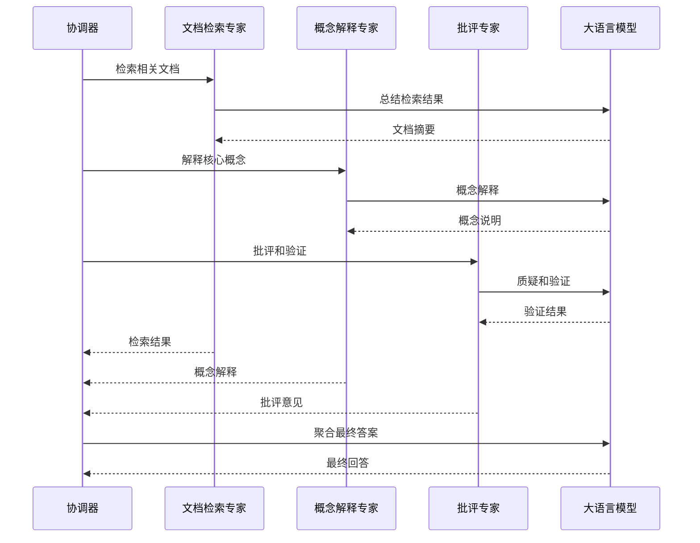
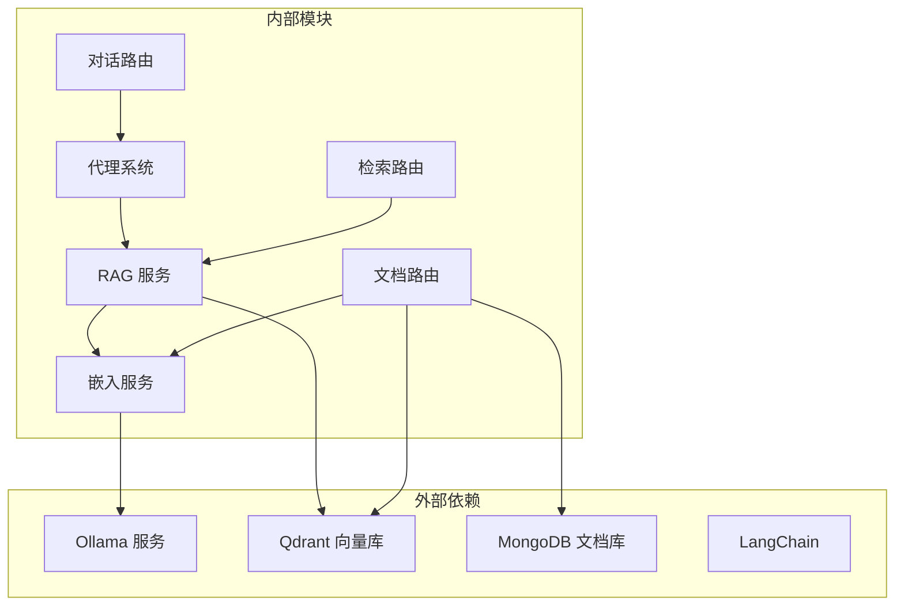
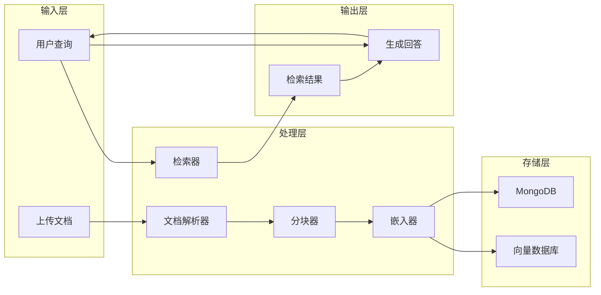

# 核心功能模块

<cite>
**本文档引用的文件**
- [main.py](file://main.py)
- [chat.py](file://routers/chat.py)
- [documents.py](file://routers/documents.py)
- [retrieval.py](file://routers/retrieval.py)
- [base_agent.py](file://agents/base/base_agent.py)
- [general_assistant_agent.py](file://agents/general_assistant/general_assistant_agent.py)
- [document_retrieval_agent.py](file://agents/experts/document_retrieval_agent.py)
- [rag_tool.py](file://agents/tools/rag_tool.py)
- [rag_retriever.py](file://retrieval/rag_retriever.py)
- [rag_service.py](file://services/rag_service.py)
- [model_selector.py](file://services/model_selector.py)
- [embedding_service.py](file://embedding/embedding_service.py)
- [qdrant_client.py](file://database/qdrant_client.py)
- [mongodb.py](file://database/mongodb.py)
- [content_analyzer.py](file://chunking/router/content_analyzer.py)
- [semantic_chunker.py](file://chunking/langchain/semantic_chunker.py)
- [hybrid_chunker.py](file://chunking/hybrid_chunker.py)
</cite>

## 目录
1. [简介](#简介)
2. [项目结构](#项目结构)
3. [核心组件](#核心组件)
4. [架构概览](#架构概览)
5. [详细组件分析](#详细组件分析)
6. [依赖分析](#依赖分析)
7. [性能考虑](#性能考虑)
8. [故障排除指南](#故障排除指南)
9. [结论](#结论)

## 简介
advanced-rag 是一个开源的高级 RAG（检索增强生成）系统，提供完整的对话、文档处理、检索和 AI 代理能力。系统采用模块化设计，支持匿名对话、深度研究模式、混合分块算法和双路索引等特色功能。

## 项目结构
项目采用分层架构设计，主要分为以下层次：

**图表来源**
- [main.py:55-98](file://main.py#L55-L98)
- [chat.py:615-750](file://routers/chat.py#L615-L750)
- [documents.py:723-800](file://routers/documents.py#L723-L800)

**章节来源**
- [main.py:1-157](file://main.py#L1-L157)
- [chat.py:1-800](file://routers/chat.py#L1-L800)
- [documents.py:1-800](file://routers/documents.py#L1-L800)

## 核心组件

### 对话系统
对话系统提供完整的对话管理功能，支持匿名模式和深度研究模式。

**核心特性：**
- 匿名对话支持，无需用户认证
- 流式响应生成，支持断点续传
- 对话历史管理
- 模型自动选择和切换

**章节来源**
- [chat.py:615-750](file://routers/chat.py#L615-L750)
- [general_assistant_agent.py:49-167](file://agents/general_assistant/general_assistant_agent.py#L49-L167)

### 文档处理系统
文档处理系统负责文档的解析、分块、向量化和存储。

**核心特性：**
- 多格式文档支持（PDF、Word、Markdown、TXT）
- 智能分块算法（递归、语义、混合）
- 知识图谱构建
- 双路索引存储（MongoDB + Qdrant）

**章节来源**
- [documents.py:274-722](file://routers/documents.py#L274-L722)
- [content_analyzer.py:244-284](file://chunking/router/content_analyzer.py#L244-L284)

### 检索系统
检索系统提供多维度的检索能力，支持向量检索、关键词检索和图谱检索。

**核心特性：**
- 混合检索策略（向量 + 关键词 + 图谱）
- 实时重排优化
- 多集合检索支持
- 知识空间隔离

**章节来源**
- [rag_retriever.py:22-325](file://retrieval/rag_retriever.py#L22-L325)
- [retrieval.py:82-135](file://routers/retrieval.py#L82-L135)

### AI 代理系统
AI 代理系统提供多专家协作的智能代理能力。

**核心特性：**
- 专家 Agent 协作
- 工作流编排
- 智能任务分配
- 结果聚合和优化

**章节来源**
- [base_agent.py:8-122](file://agents/base/base_agent.py#L8-L122)
- [document_retrieval_agent.py:8-79](file://agents/experts/document_retrieval_agent.py#L8-L79)
- [rag_tool.py:12-58](file://agents/tools/rag_tool.py#L12-L58)

## 架构概览

**图表来源**
- [chat.py:615-750](file://routers/chat.py#L615-L750)
- [general_assistant_agent.py:97-122](file://agents/general_assistant/general_assistant_agent.py#L97-L122)
- [rag_service.py:10-83](file://services/rag_service.py#L10-L83)

## 详细组件分析

### 对话系统详细分析

#### 通用助手代理
通用助手代理是对话系统的核心组件，提供智能对话能力。

**图表来源**
- [base_agent.py:8-122](file://agents/base/base_agent.py#L8-L122)
- [general_assistant_agent.py:9-167](file://agents/general_assistant/general_assistant_agent.py#L9-L167)
- [document_retrieval_agent.py:8-79](file://agents/experts/document_retrieval_agent.py#L8-L79)

**章节来源**
- [base_agent.py:1-122](file://agents/base/base_agent.py#L1-L122)
- [general_assistant_agent.py:1-167](file://agents/general_assistant/general_assistant_agent.py#L1-L167)

#### 匿名对话机制
系统支持完全匿名的对话模式，无需用户认证即可使用。

**核心机制：**
- 对话 ID 自动生成和管理
- 无用户绑定的对话存储
- 自动标题生成
- 断点续传支持

**章节来源**
- [chat.py:97-149](file://routers/chat.py#L97-L149)
- [chat.py:245-348](file://routers/chat.py#L245-L348)

### 文档处理系统详细分析

#### 混合分块算法
系统采用混合分块算法，结合规则分块和语义分块的优势。

**图表来源**
- [hybrid_chunker.py:52-122](file://chunking/hybrid_chunker.py#L52-L122)
- [semantic_chunker.py:81-139](file://chunking/langchain/semantic_chunker.py#L81-L139)

**章节来源**
- [hybrid_chunker.py:1-179](file://chunking/hybrid_chunker.py#L1-L179)
- [semantic_chunker.py:1-139](file://chunking/langchain/semantic_chunker.py#L1-L139)

#### 双路索引存储
系统采用双路索引存储架构，确保检索效率和可靠性。

**图表来源**
- [documents.py:274-722](file://routers/documents.py#L274-L722)
- [qdrant_client.py:18-544](file://database/qdrant_client.py#L18-L544)
- [mongodb.py:315-800](file://database/mongodb.py#L315-L800)

**章节来源**
- [documents.py:274-722](file://routers/documents.py#L274-L722)
- [qdrant_client.py:18-544](file://database/qdrant_client.py#L18-L544)

### 检索系统详细分析

#### 混合检索策略
系统实现多维度检索策略，提供准确和高效的检索结果。

**图表来源**
- [rag_retriever.py:69-101](file://retrieval/rag_retriever.py#L69-L101)
- [rag_retriever.py:262-297](file://retrieval/rag_retriever.py#L262-L297)

**章节来源**
- [rag_retriever.py:22-325](file://retrieval/rag_retriever.py#L22-L325)

#### 模型选择机制
系统提供智能的模型选择机制，根据问题类型自动选择最适合的模型。

**章节来源**
- [model_selector.py:10-206](file://services/model_selector.py#L10-L206)

### AI 代理系统详细分析

#### 专家代理协作
系统支持多专家代理的协作，实现复杂任务的分解和执行。

**图表来源**
- [document_retrieval_agent.py:25-79](file://agents/experts/document_retrieval_agent.py#L25-L79)

**章节来源**
- [document_retrieval_agent.py:1-79](file://agents/experts/document_retrieval_agent.py#L1-L79)
- [rag_tool.py:12-58](file://agents/tools/rag_tool.py#L12-L58)

## 依赖分析

### 组件耦合关系

**图表来源**
- [main.py:15-98](file://main.py#L15-L98)
- [rag_service.py:68-83](file://services/rag_service.py#L68-L83)

### 数据流分析

**图表来源**
- [documents.py:274-722](file://routers/documents.py#L274-L722)
- [rag_service.py:10-83](file://services/rag_service.py#L10-L83)

**章节来源**
- [main.py:15-98](file://main.py#L15-L98)
- [documents.py:274-722](file://routers/documents.py#L274-L722)

## 性能考虑

### 并发处理优化
系统采用异步编程和并发处理技术，提升整体性能：

1. **异步 I/O 操作**：所有数据库和网络操作均采用异步模式
2. **并发检索**：检索过程并行执行多种检索策略
3. **连接池管理**：数据库连接池优化，支持高并发访问
4. **缓存机制**：嵌入向量和检索结果的缓存策略

### 存储优化策略
1. **分层存储**：热数据存储在内存，冷数据存储在磁盘
2. **批量操作**：向量化和存储采用批量处理减少网络往返
3. **索引优化**：针对不同查询模式优化索引策略
4. **压缩存储**：向量数据采用压缩存储减少空间占用

### 模型优化
1. **模型选择**：根据问题类型自动选择最优模型
2. **推理优化**：使用 Ollama 服务进行本地推理加速
3. **资源管理**：模型资源的动态分配和回收

## 故障排除指南

### 常见问题诊断

#### 数据库连接问题
**症状**：系统启动时报数据库连接错误
**解决方案**：
1. 检查数据库连接配置
2. 验证数据库服务状态
3. 检查网络连接和防火墙设置

#### 向量数据库异常
**症状**：向量检索失败或性能下降
**解决方案**：
1. 检查 Qdrant 服务状态
2. 验证集合存在性和配置
3. 检查向量维度匹配
4. 清理无效的向量数据

#### 模型服务问题
**症状**：模型推理失败或响应缓慢
**解决方案**：
1. 检查 Ollama 服务状态
2. 验证模型文件完整性
3. 检查 GPU/CPU 资源使用情况
4. 重启模型服务

### 日志分析
系统提供详细的日志记录，便于问题诊断：

1. **错误级别日志**：记录系统错误和异常
2. **调试级别日志**：记录详细的操作流程
3. **性能日志**：记录关键操作的耗时信息
4. **业务日志**：记录用户操作和系统行为

**章节来源**
- [main.py:109-126](file://main.py#L109-L126)
- [qdrant_client.py:124-139](file://database/qdrant_client.py#L124-L139)

## 结论
advanced-rag 系统通过模块化设计和先进的技术架构，实现了高性能的 RAG 能力。系统的主要优势包括：

1. **完整的功能体系**：涵盖对话、文档处理、检索和代理的完整链路
2. **灵活的架构设计**：支持多种部署模式和扩展需求
3. **优秀的性能表现**：通过并发处理和优化策略确保高效运行
4. **强大的扩展能力**：模块化设计便于功能扩展和技术演进

系统适用于各种 RAG 应用场景，包括智能客服、知识问答、文档分析等，为企业和开发者提供了强大的技术基础。