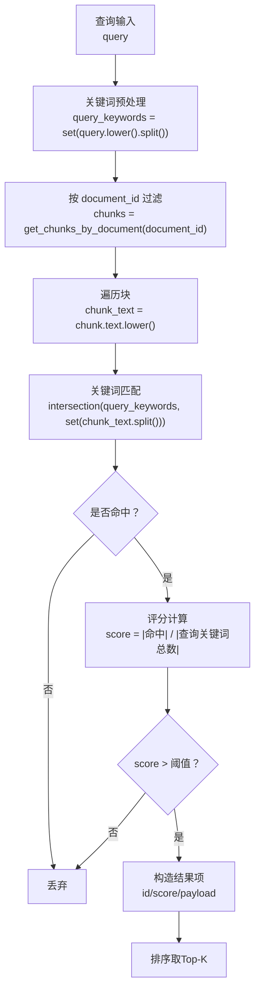
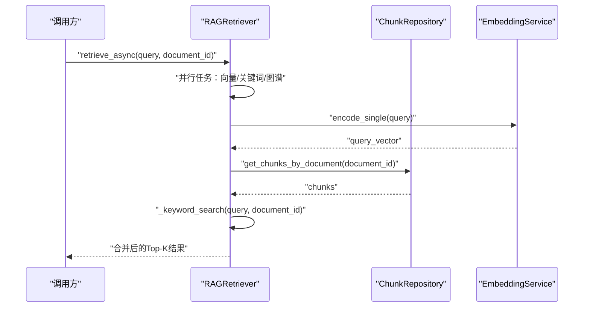
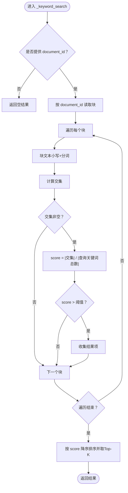
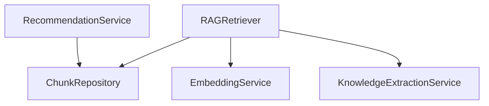

# 关键词检索

<cite>
**本文引用的文件**
- [rag_retriever.py](file://retrieval/rag_retriever.py)
- [mongodb.py](file://database/mongodb.py)
- [embedding_service.py](file://embedding/embedding_service.py)
- [recommendation_service.py](file://services/recommendation_service.py)
- [knowledge_extraction_service.py](file://services/knowledge_extraction_service.py)
- [documents.py](file://routers/documents.py)
</cite>

## 目录
1. [简介](#简介)
2. [项目结构](#项目结构)
3. [核心组件](#核心组件)
4. [架构总览](#架构总览)
5. [详细组件分析](#详细组件分析)
6. [依赖分析](#依赖分析)
7. [性能考虑](#性能考虑)
8. [故障排查指南](#故障排查指南)
9. [结论](#结论)
10. [附录](#附录)

## 简介
本文件聚焦于关键词检索模块的技术实现，系统阐述从查询文本预处理、文档块关键词提取与匹配、到权重评分与过滤控制的完整流程；同时给出性能优化策略（索引、查询与批处理）、以及在不同场景下的匹配策略对比与实践建议。

## 项目结构
关键词检索位于检索子系统中，与向量检索、图谱检索共同构成混合检索管线，并通过合并与重排步骤统一输出最终结果。其核心依赖如下：
- 查询预处理与过滤：将查询按空格切分为关键词集合，并支持按 document_id 进行精确过滤。
- 文档块来源：通过分块仓库按 document_id 获取全部块，再对块文本进行关键词匹配。
- 权重计算：基于查询关键词集合与块内关键词的交集大小与查询关键词总数计算匹配度评分。
- 结果合并：与向量检索结果合并，对命中同一 chunk 的结果进行分数增强。

图表来源
- [rag_retriever.py:140-174](file://retrieval/rag_retriever.py#L140-L174)
- [mongodb.py:799-802](file://database/mongodb.py#L799-L802)

章节来源
- [rag_retriever.py:140-174](file://retrieval/rag_retriever.py#L140-L174)
- [mongodb.py:799-802](file://database/mongodb.py#L799-L802)

## 核心组件
- RAGRetriever：混合检索器，负责并行执行向量检索、关键词检索与图谱检索，并进行结果合并与重排。
- ChunkRepository：提供按 document_id 获取文档块的能力，是关键词检索的底层数据源。
- EmbeddingService：向量检索依赖的嵌入服务，用于将查询文本编码为向量。
- KnowledgeExtractionService：图谱检索依赖的实体抽取服务，用于从查询中提取实体。
- RecommendationService：包含关键词提取与关键词匹配评分逻辑，可作为关键词检索的参考实现与扩展点。

章节来源
- [rag_retriever.py:22-101](file://retrieval/rag_retriever.py#L22-L101)
- [mongodb.py:770-802](file://database/mongodb.py#L770-L802)
- [embedding_service.py:8-44](file://embedding/embedding_service.py#L8-L44)
- [knowledge_extraction_service.py:104-142](file://services/knowledge_extraction_service.py#L104-L142)
- [recommendation_service.py:63-105](file://services/recommendation_service.py#L63-L105)

## 架构总览
关键词检索在混合检索中的位置与与其他模块的交互如下：

图表来源
- [rag_retriever.py:69-101](file://retrieval/rag_retriever.py#L69-L101)
- [rag_retriever.py:110-138](file://retrieval/rag_retriever.py#L110-L138)
- [rag_retriever.py:140-174](file://retrieval/rag_retriever.py#L140-L174)
- [mongodb.py:799-802](file://database/mongodb.py#L799-L802)
- [embedding_service.py:261-263](file://embedding/embedding_service.py#L261-L263)

## 详细组件分析

### 关键词检索实现流程
- 查询预处理：将查询文本转小写并按空格拆分为关键词集合，便于后续集合运算。
- 数据过滤：仅当提供 document_id 时才进行关键词检索；否则直接返回空结果，避免全局扫描。
- 文档块读取：通过分块仓库按 document_id 获取该文档的所有块，按 chunk_index 升序排列。
- 关键词匹配：对每个块文本同样做小写与分词，计算查询关键词集合与块关键词集合的交集。
- 评分与阈值：以交集大小与查询关键词总数之比作为匹配度评分；仅当评分超过阈值时纳入候选。
- 排序与裁剪：按评分降序排序并取 Top-K。

图表来源
- [rag_retriever.py:140-174](file://retrieval/rag_retriever.py#L140-L174)

章节来源
- [rag_retriever.py:140-174](file://retrieval/rag_retriever.py#L140-L174)

### 关键词权重与评分算法
- 匹配度评分：使用查询关键词集合与块关键词集合的交集大小与查询关键词总数之比，作为基础匹配度。
- 阈值过滤：仅保留评分高于设定阈值的结果，减少噪声输出。
- 合并增强：在混合检索中，命中同一 chunk 的关键词结果会与向量结果合并，并对 score 进行一定比例的叠加增强，提升关键词命中对最终排序的影响。

章节来源
- [rag_retriever.py:158-174](file://retrieval/rag_retriever.py#L158-L174)
- [rag_retriever.py:262-297](file://retrieval/rag_retriever.py#L262-L297)

### 文档过滤机制
- document_id 过滤：关键词检索仅在提供 document_id 时生效；未提供时直接跳过，避免全库扫描。
- 图谱检索过滤：在图谱检索中，若存在按 document_id 的过滤条件，会对生成的上下文进行二次校验，确保返回的上下文与目标文档一致。

章节来源
- [rag_retriever.py:145-149](file://retrieval/rag_retriever.py#L145-L149)
- [rag_retriever.py:243-244](file://retrieval/rag_retriever.py#L243-L244)

### 关键词匹配的替代实现与扩展
- 关键词提取：使用 jieba 对文本进行关键词抽取，可用于资源推荐或更复杂的关键词匹配场景。
- 关键词匹配评分：对资源描述与标签分别计算匹配分数，并进行加权融合，作为推荐系统的补充策略。

章节来源
- [recommendation_service.py:63-105](file://services/recommendation_service.py#L63-L105)
- [recommendation_service.py:107-134](file://services/recommendation_service.py#L107-L134)

## 依赖分析
关键词检索的关键依赖关系如下：
- RAGRetriever 依赖 ChunkRepository 获取块数据。
- RAGRetriever 在向量检索阶段依赖 EmbeddingService。
- RAGRetriever 在图谱检索阶段依赖 KnowledgeExtractionService。
- 关键词检索本身不依赖外部 LLM，但可与实体抽取服务配合用于图谱检索。

图表来源
- [rag_retriever.py:39-40](file://retrieval/rag_retriever.py#L39-L40)
- [embedding_service.py:275-276](file://embedding/embedding_service.py#L275-L276)
- [knowledge_extraction_service.py:104-142](file://services/knowledge_extraction_service.py#L104-L142)
- [recommendation_service.py:17-22](file://services/recommendation_service.py#L17-L22)

章节来源
- [rag_retriever.py:39-40](file://retrieval/rag_retriever.py#L39-L40)
- [embedding_service.py:275-276](file://embedding/embedding_service.py#L275-L276)
- [knowledge_extraction_service.py:104-142](file://services/knowledge_extraction_service.py#L104-L142)
- [recommendation_service.py:17-22](file://services/recommendation_service.py#L17-L22)

## 性能考虑
- 查询优化
  - 仅在提供 document_id 时执行关键词检索，避免全库扫描。
  - 使用集合运算（set intersection）进行关键词匹配，时间复杂度近似 O(|Q| + |C|)，其中 Q 为查询关键词数，C 为块关键词数。
- 数据访问优化
  - 通过分块仓库按 document_id 有序读取块，减少不必要的过滤与排序开销。
- 批量处理与并发
  - 检索主流程采用 asyncio.gather 并行执行向量、关键词、图谱三种策略，缩短整体响应时间。
  - 文档入库流程中对向量化与向量插入采用分批（例如每批 50 个）处理，降低内存峰值与网络压力。
- 索引与缓存
  - MongoDB 中按 document_id 与 chunk_index 建立索引可显著提升块读取效率（建议在生产环境中确认索引存在）。
  - 对高频查询的关键词集合可进行缓存，减少重复分词与集合运算成本。
- 重排与阈值
  - 重排器（Cross-Encoder）当前被禁用以避免进程崩溃风险；若启用，需注意其推理成本与吞吐影响。
  - 合理设置 score_threshold 与关键词阈值，可在保证召回的同时降低无效匹配带来的排序成本。

章节来源
- [rag_retriever.py:83-89](file://retrieval/rag_retriever.py#L83-L89)
- [documents.py:466-493](file://routers/documents.py#L466-L493)
- [documents.py:594-640](file://routers/documents.py#L594-L640)

## 故障排查指南
- 关键词检索无结果
  - 确认是否传入了 document_id；未传入将直接返回空结果。
  - 检查查询文本是否过短或仅包含停用词，导致关键词集合为空。
  - 检查块文本是否被正确清洗（小写、分词），避免因大小写或标点差异导致不匹配。
- MongoDB 查询异常
  - 确认分块集合存在且包含目标 document_id 的记录。
  - 检查 ChunkRepository 的查询条件与排序是否正确。
- 向量服务不可用
  - 若向量检索失败，检查 EmbeddingService 的 Ollama 地址与模型配置。
- 图谱检索异常
  - 确认实体抽取服务可用且返回有效实体列表。
  - 检查图数据库连接状态与 Cypher 查询是否正确。

章节来源
- [rag_retriever.py:145-149](file://retrieval/rag_retriever.py#L145-L149)
- [rag_retriever.py:110-138](file://retrieval/rag_retriever.py#L110-L138)
- [embedding_service.py:175-228](file://embedding/embedding_service.py#L175-L228)
- [knowledge_extraction_service.py:104-142](file://services/knowledge_extraction_service.py#L104-L142)

## 结论
关键词检索以“查询关键词集合 + 文档块关键词集合”的集合运算为核心，结合 document_id 过滤与阈值控制，实现了高效、可控的精确匹配。在混合检索中，它作为“增强”策略与向量检索协同，提升对关键词密集场景的召回质量。通过合理的索引、批处理与并发策略，可在大规模文档库上保持良好性能。

## 附录

### 实际示例与策略对比
- 示例场景
  - 场景A：用户查询“机器学习算法”，提供 document_id 限定到某篇论文。
    - 关键词：["机器学习", "算法"]
    - 块匹配：若块包含两个关键词，则 score=1.0；若仅包含一个，则 score=0.5。
  - 场景B：用户查询“深度学习神经网络”，未提供 document_id。
    - 行为：关键词检索直接跳过，仅依赖向量检索与图谱检索。
- 策略对比
  - 精确关键词匹配：适合事实性、术语密集的问答，召回稳定但易受分词与同义词影响。
  - 向量语义匹配：适合语义近似检索，对同义表达更鲁棒，但可能引入噪声。
  - 图谱检索：适合实体关系类问题，能提供上下文增强，但依赖图谱构建质量。
  - 组合策略：在混合检索中，关键词结果对向量结果进行分数增强，兼顾稳定性与语义理解。

章节来源
- [rag_retriever.py:140-174](file://retrieval/rag_retriever.py#L140-L174)
- [rag_retriever.py:262-297](file://retrieval/rag_retriever.py#L262-L297)