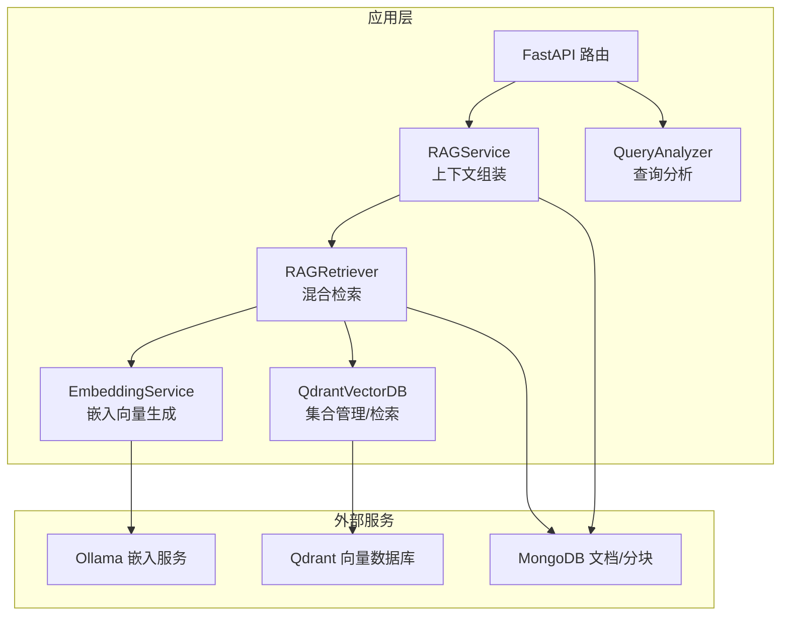
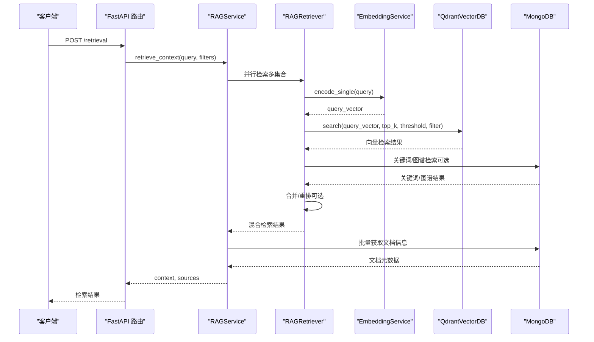
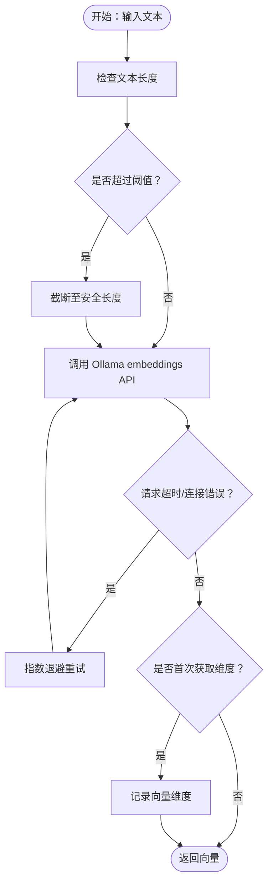
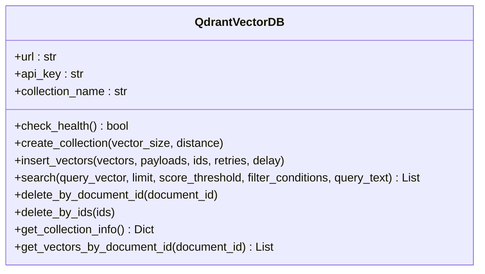
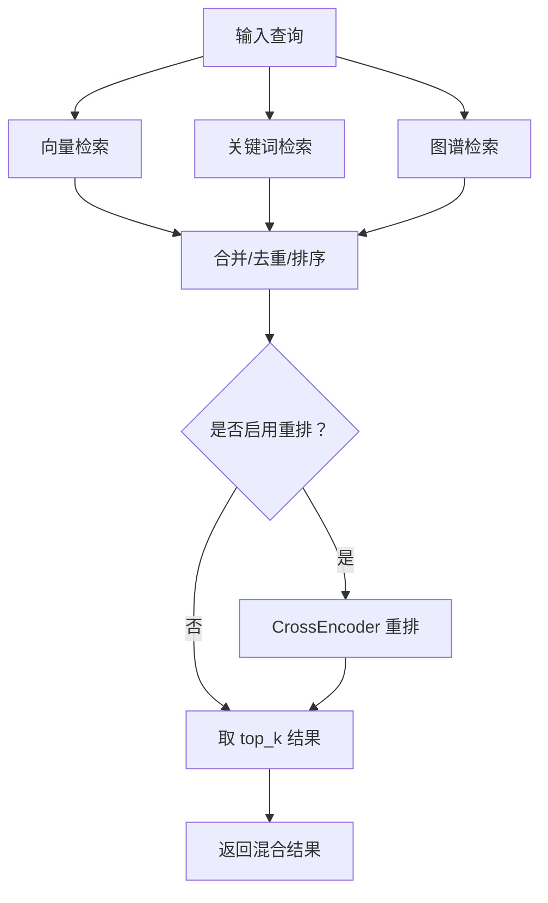
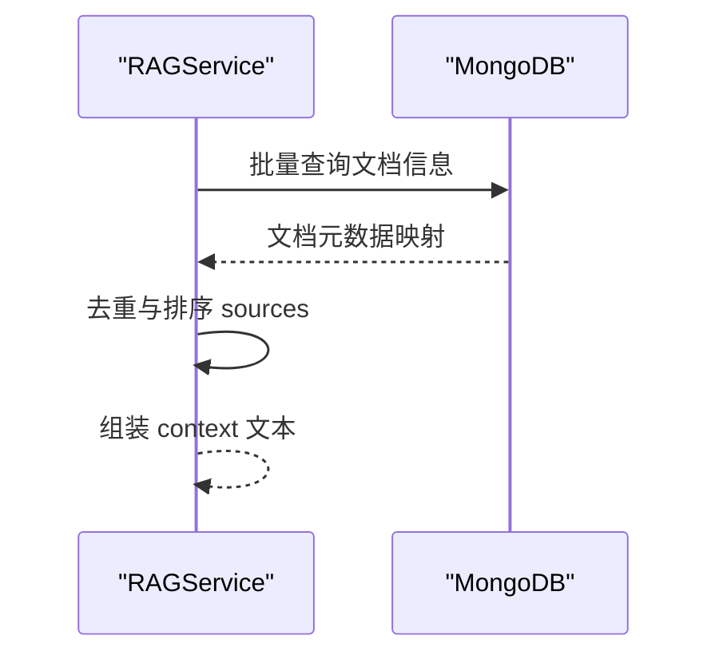
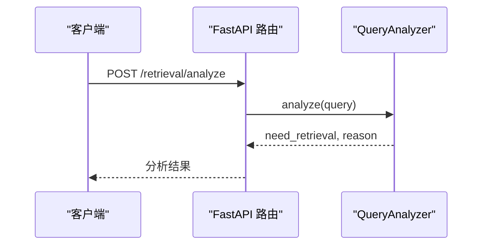
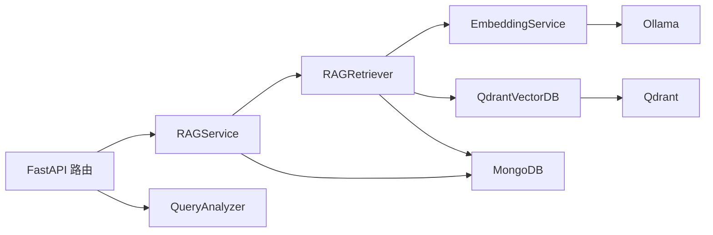

# 向量检索

<cite>
**本文引用的文件**
- [qdrant_client.py](file://database/qdrant_client.py)
- [embedding_service.py](file://embedding/embedding_service.py)
- [rag_retriever.py](file://retrieval/rag_retriever.py)
- [rag_service.py](file://services/rag_service.py)
- [retrieval.py](file://routers/retrieval.py)
- [mongodb.py](file://database/mongodb.py)
- [query_analyzer.py](file://services/query_analyzer.py)
- [rag_tool.py](file://agents/tools/rag_tool.py)
</cite>

## 目录
1. [简介](#简介)
2. [项目结构](#项目结构)
3. [核心组件](#核心组件)
4. [架构总览](#架构总览)
5. [详细组件分析](#详细组件分析)
6. [依赖关系分析](#依赖关系分析)
7. [性能考量](#性能考量)
8. [故障排查指南](#故障排查指南)
9. [结论](#结论)
10. [附录](#附录)

## 简介
本文件面向“向量检索”模块，系统化阐述从查询文本到向量数据库的完整检索链路，包括：
- 嵌入向量的生成与模型选择
- Qdrant 向量数据库的集成与配置
- 相似度计算与检索参数
- 检索实现流程与调优建议
- 查询示例与结果分析

## 项目结构
向量检索相关代码主要分布在以下模块：
- 嵌入服务：负责将文本编码为向量
- Qdrant 客户端：封装向量集合管理、插入与检索
- 检索器：组合向量检索、关键词检索、图谱检索与可选重排
- 服务层：对外提供检索与上下文组装能力
- 路由层：FastAPI 接口，暴露检索与查询分析能力
- MongoDB：存储文档与分块元数据，支撑关键词与来源信息
- 查询分析器：判断是否需要检索上下文

图表来源
- [embedding_service.py:1-278](file://embedding/embedding_service.py#L1-L278)
- [qdrant_client.py:1-544](file://database/qdrant_client.py#L1-L544)
- [rag_retriever.py:1-325](file://retrieval/rag_retriever.py#L1-L325)
- [rag_service.py:1-248](file://services/rag_service.py#L1-L248)
- [retrieval.py:1-135](file://routers/retrieval.py#L1-L135)
- [mongodb.py:1-800](file://database/mongodb.py#L1-L800)
- [query_analyzer.py:1-163](file://services/query_analyzer.py#L1-L163)

章节来源
- [embedding_service.py:1-278](file://embedding/embedding_service.py#L1-L278)
- [qdrant_client.py:1-544](file://database/qdrant_client.py#L1-L544)
- [rag_retriever.py:1-325](file://retrieval/rag_retriever.py#L1-L325)
- [rag_service.py:1-248](file://services/rag_service.py#L1-L248)
- [retrieval.py:1-135](file://routers/retrieval.py#L1-L135)
- [mongodb.py:1-800](file://database/mongodb.py#L1-L800)
- [query_analyzer.py:1-163](file://services/query_analyzer.py#L1-L163)

## 核心组件
- 嵌入服务（EmbeddingService）
  - 使用 Ollama API 将文本编码为向量，支持模型名称规范化与自动检测
  - 支持批量编码与单条编码，具备超时与重试机制
- Qdrant 客户端（QdrantVectorDB）
  - 封装集合创建/重建、向量插入、检索、删除、滚动读取等
  - 优先使用 gRPC 连接，自动处理本地/远程 HTTP 安全警告
  - 检索支持过滤条件、阈值控制与自动集合创建
- 检索器（RAGRetriever）
  - 混合检索：向量检索 + 关键词检索 + 图谱检索（可选重排）
  - 支持 top_k 与 score_threshold 控制返回数量与质量
- 服务层（RAGService）
  - 对外提供检索上下文与来源信息，支持多知识空间并行检索
  - 支持对话附件与普通文档来源去重与排序
- 路由层（FastAPI）
  - 暴露检索接口与查询分析接口，支持多知识空间与助手集合
- 查询分析器（QueryAnalyzer）
  - 判断是否需要检索上下文，支持小模型与关键词回退

章节来源
- [embedding_service.py:1-278](file://embedding/embedding_service.py#L1-L278)
- [qdrant_client.py:1-544](file://database/qdrant_client.py#L1-L544)
- [rag_retriever.py:1-325](file://retrieval/rag_retriever.py#L1-L325)
- [rag_service.py:1-248](file://services/rag_service.py#L1-L248)
- [retrieval.py:1-135](file://routers/retrieval.py#L1-L135)
- [query_analyzer.py:1-163](file://services/query_analyzer.py#L1-L163)

## 架构总览
下图展示从查询到结果的端到端流程，包括嵌入生成、向量检索、结果合并与上下文组装。

图表来源
- [retrieval.py:82-135](file://routers/retrieval.py#L82-L135)
- [rag_service.py:10-248](file://services/rag_service.py#L10-L248)
- [rag_retriever.py:69-101](file://retrieval/rag_retriever.py#L69-L101)
- [embedding_service.py:230-263](file://embedding/embedding_service.py#L230-L263)
- [qdrant_client.py:336-413](file://database/qdrant_client.py#L336-L413)
- [mongodb.py:770-800](file://database/mongodb.py#L770-L800)

## 详细组件分析

### 嵌入向量生成与模型选择
- 模型来源：通过 Ollama API 获取嵌入向量
- 模型选择策略：
  - 显式指定：环境变量或构造函数参数
  - 自动检测：扫描可用模型并匹配 embedding 关键词
  - 名称规范化：处理带标签模型名与 latest 标签
- 编码流程：
  - 单条编码：encode_single
  - 批量编码：encode（逐条调用，内部截断过长文本）
- 超时与重试：针对 Ollama 请求设置超时与指数退避重试
- 维度获取：首次调用时记录向量维度，后续复用

图表来源
- [embedding_service.py:230-263](file://embedding/embedding_service.py#L230-L263)
- [embedding_service.py:175-229](file://embedding/embedding_service.py#L175-L229)

章节来源
- [embedding_service.py:1-278](file://embedding/embedding_service.py#L1-L278)

### Qdrant 向量数据库集成与配置
- 连接与安全：
  - 优先使用 gRPC（端口可配置），避免 HTTP/httpx 导致的 502 问题
  - 本地 HTTP 连接自动忽略 API key，远程 HTTP 连接发出安全警告
  - 超时与重试：连接测试与插入均具备重试与指数退避
- 集合管理：
  - create_collection：自动检测维度一致性，不一致时重建
  - get_collection_info：返回点数与集合名
- 向量插入：
  - insert_vectors：支持 UUID 格式 ID，自动维度校验与重建
  - 重试机制：针对维度错误与临时性错误（502/503/504/超时/连接）进行处理
- 检索：
  - search：支持过滤条件、阈值、limit；自动创建集合（集合不存在时）
  - 结果格式：统一为包含 id/score/payload 的结构
- 其他能力：
  - delete_by_document_id/delete_by_ids：按文档或 ID 删除
  - get_vectors_by_document_id：滚动读取文档相关向量

图表来源
- [qdrant_client.py:18-544](file://database/qdrant_client.py#L18-L544)

章节来源
- [qdrant_client.py:1-544](file://database/qdrant_client.py#L1-L544)

### 检索实现流程与混合策略
- 异步检索：retrieve_async 并行执行向量、关键词、图谱三种策略
- 向量检索：
  - 使用 EmbeddingService 生成查询向量
  - 通过 QdrantVectorDB.search 执行相似度检索
  - 支持按 document_id 过滤与阈值控制
- 关键词检索：
  - 仅在指定 document_id 时执行，避免全局全量扫描
  - 基于词集交集比例评分
- 图谱检索：
  - 从知识抽取服务提取实体，Cypher 查询一跳邻居
  - 将路径转化为文本片段，作为图谱上下文
- 结果合并与重排：
  - 向量结果作为基础，关键词结果提升分数，图谱结果作为补充
  - 可选 CrossEncoder 重排（当前禁用）

图表来源
- [rag_retriever.py:69-101](file://retrieval/rag_retriever.py#L69-L101)
- [rag_retriever.py:110-138](file://retrieval/rag_retriever.py#L110-L138)
- [rag_retriever.py:140-174](file://retrieval/rag_retriever.py#L140-L174)
- [rag_retriever.py:176-260](file://retrieval/rag_retriever.py#L176-L260)
- [rag_retriever.py:262-297](file://retrieval/rag_retriever.py#L262-L297)

章节来源
- [rag_retriever.py:1-325](file://retrieval/rag_retriever.py#L1-L325)

### 上下文组装与来源去重
- 多集合并行检索：支持知识空间与助手集合
- 文档信息批量获取：根据 document_id 批量查询标题、类型、状态
- 来源去重：同一文档仅保留最高分 chunk
- 输出结构：context 文本、sources 列表（含检索类型、分数、标题等）

图表来源
- [rag_service.py:10-248](file://services/rag_service.py#L10-L248)
- [mongodb.py:315-478](file://database/mongodb.py#L315-L478)

章节来源
- [rag_service.py:1-248](file://services/rag_service.py#L1-L248)
- [mongodb.py:315-478](file://database/mongodb.py#L315-L478)

### 查询分析与路由
- 查询分析：使用小模型快速判断是否需要检索，失败时回退关键词匹配
- 路由接口：
  - /retrieval：检索上下文，支持 top_k、document_id、assistant_id、knowledge_space_ids、conversation_id
  - /retrieval/analyze：分析查询是否需要检索

图表来源
- [retrieval.py:44-79](file://routers/retrieval.py#L44-L79)
- [query_analyzer.py:38-106](file://services/query_analyzer.py#L38-L106)

章节来源
- [retrieval.py:1-135](file://routers/retrieval.py#L1-L135)
- [query_analyzer.py:1-163](file://services/query_analyzer.py#L1-L163)

## 依赖关系分析
- 组件耦合
  - RAGRetriever 依赖 EmbeddingService、QdrantVectorDB、ChunkRepository、Neo4j 客户端（可选）
  - RAGService 依赖 RAGRetriever、MongoDB 文档仓库
  - 路由层依赖 RAGService 与 QueryAnalyzer
- 外部依赖
  - Ollama：嵌入向量生成
  - Qdrant：向量检索与集合管理
  - MongoDB：文档与分块元数据
  - Neo4j：图谱检索（当前未启用，保留接口）

图表来源
- [embedding_service.py:1-278](file://embedding/embedding_service.py#L1-L278)
- [qdrant_client.py:1-544](file://database/qdrant_client.py#L1-L544)
- [rag_retriever.py:1-325](file://retrieval/rag_retriever.py#L1-L325)
- [rag_service.py:1-248](file://services/rag_service.py#L1-L248)
- [retrieval.py:1-135](file://routers/retrieval.py#L1-L135)
- [mongodb.py:1-800](file://database/mongodb.py#L1-L800)
- [query_analyzer.py:1-163](file://services/query_analyzer.py#L1-L163)

章节来源
- [rag_retriever.py:1-325](file://retrieval/rag_retriever.py#L1-L325)
- [rag_service.py:1-248](file://services/rag_service.py#L1-L248)
- [retrieval.py:1-135](file://routers/retrieval.py#L1-L135)

## 性能考量
- 连接与协议
  - 优先使用 gRPC（端口可配置），避免 HTTP/httpx 的 502 问题，提升连接复用与吞吐
- 超时与重试
  - Qdrant 插入与健康检查具备指数退避重试，增强稳定性
- 检索参数
  - top_k：控制返回候选数量，建议结合阈值使用
  - score_threshold：过滤低质量结果，提高召回质量
- 模型与编码
  - Ollama 超时与重试，首次调用记录维度，减少后续开销
- 并行与去重
  - 多集合并行检索，来源去重与排序，降低重复内容影响

[本节为通用性能建议，不直接分析具体文件]

## 故障排查指南
- Qdrant 连接问题
  - 本地 HTTP 连接自动忽略 API key；远程 HTTP 连接发出安全警告
  - 连接测试失败时自动重试，必要时切换 127.0.0.1
- 集合维度不匹配
  - 插入时检测到维度不一致会自动重建集合（数据清空）
  - 检索时集合不存在会自动创建，返回空结果
- Ollama 嵌入失败
  - 超时/连接错误自动重试；模型不存在给出明确提示
  - 文本过长自动截断，避免 Ollama 500 错误
- 关键词检索性能
  - 未指定 document_id 时不执行全局关键词检索，避免性能问题
- 图谱检索
  - 当前禁用 CrossEncoder 重排，如需启用需安装依赖并调整配置

章节来源
- [qdrant_client.py:97-123](file://database/qdrant_client.py#L97-L123)
- [qdrant_client.py:247-267](file://database/qdrant_client.py#L247-L267)
- [qdrant_client.py:396-413](file://database/qdrant_client.py#L396-L413)
- [embedding_service.py:175-229](file://embedding/embedding_service.py#L175-L229)
- [embedding_service.py:250-258](file://embedding/embedding_service.py#L250-L258)
- [rag_retriever.py:103-108](file://retrieval/rag_retriever.py#L103-L108)
- [rag_retriever.py:18-21](file://retrieval/rag_retriever.py#L18-L21)

## 结论
本向量检索模块通过“嵌入生成 + Qdrant 检索 + 混合策略”的设计，实现了稳定高效的检索链路。其关键优势在于：
- 使用 Ollama 作为嵌入生成器，易于部署与扩展
- Qdrant 客户端对 gRPC 的优先支持与完善的重试/自动修复机制
- 检索参数（top_k、score_threshold）与过滤条件的灵活配置
- 多策略融合与来源去重，兼顾召回与质量

建议在生产环境中：
- 明确 top_k 与 score_threshold 的调优策略
- 根据业务场景选择合适的嵌入模型
- 监控 Qdrant 集合维度与插入重试情况
- 评估是否启用 CrossEncoder 重排

[本节为总结性内容，不直接分析具体文件]

## 附录

### 配置选项与调优建议
- 嵌入模型
  - OLLAMA_BASE_URL：Ollama 服务地址
  - OLLAMA_EMBEDDING_MODEL：嵌入模型名称（可带标签）
  - OLLAMA_ANALYSIS_MODEL：查询分析小模型（默认 qwen2.5:3b）
- Qdrant
  - QDRANT_URL：Qdrant 服务地址（默认 http://localhost:6333）
  - QDRANT_API_KEY：API 密钥（本地 HTTP 连接自动忽略）
  - QDRANT_TIMEOUT：连接超时（秒）
  - QDRANT_GRPC_PORT：gRPC 端口（默认 6334）
- MongoDB
  - MONGODB_URI/MONGODB_HOST/MONGODB_PORT/MONGODB_USERNAME/MONGODB_PASSWORD/MONGODB_AUTH_SOURCE/MONGODB_DB_NAME
  - 连接池参数：MONGODB_MAX_POOL_SIZE、MONGODB_MIN_POOL_SIZE、MONGODB_MAX_IDLE_TIME_MS、MONGODB_SERVER_SELECTION_TIMEOUT_MS、MONGODB_CONNECT_TIMEOUT_MS、MONGODB_SOCKET_TIMEOUT_MS

调优建议
- top_k：先增大 top_k 再配合 score_threshold，平衡召回与质量
- score_threshold：根据嵌入模型与业务场景逐步下调，观察命中率与误检率
- 过滤条件：按 document_id 过滤可显著提升性能与相关性
- 模型选择：优先选择与业务语料匹配度高的嵌入模型

章节来源
- [embedding_service.py:21-44](file://embedding/embedding_service.py#L21-L44)
- [qdrant_client.py:35-95](file://database/qdrant_client.py#L35-L95)
- [mongodb.py:101-150](file://database/mongodb.py#L101-L150)

### 查询示例与结果分析
- 示例请求
  - 路径：POST /retrieval
  - 参数：query、document_id（可选）、top_k（默认 5）、assistant_id（可选）、knowledge_space_ids（可选）、conversation_id（可选）
- 返回结构
  - context：拼接后的上下文文本
  - sources：去重后的来源列表，包含文档/附件信息、检索类型、分数等
  - retrieval_count：来源数量
- 结果分析
  - 向量检索：基于相似度分数，受嵌入质量与阈值影响
  - 关键词检索：在指定文档内进行词集匹配，适合局部精确匹配
  - 图谱检索：基于实体关系生成上下文，适合推理与关联场景
  - 混合策略：综合三者结果，提升整体召回与准确性

章节来源
- [retrieval.py:14-42](file://routers/retrieval.py#L14-L42)
- [rag_service.py:187-191](file://services/rag_service.py#L187-L191)

### 工具集成（LangChain）
- RAGTool：封装为 LangChain 工具，支持同步与异步执行
- 使用场景：在智能体工作流中调用 RAG 检索能力

章节来源
- [rag_tool.py:1-58](file://agents/tools/rag_tool.py#L1-L58)