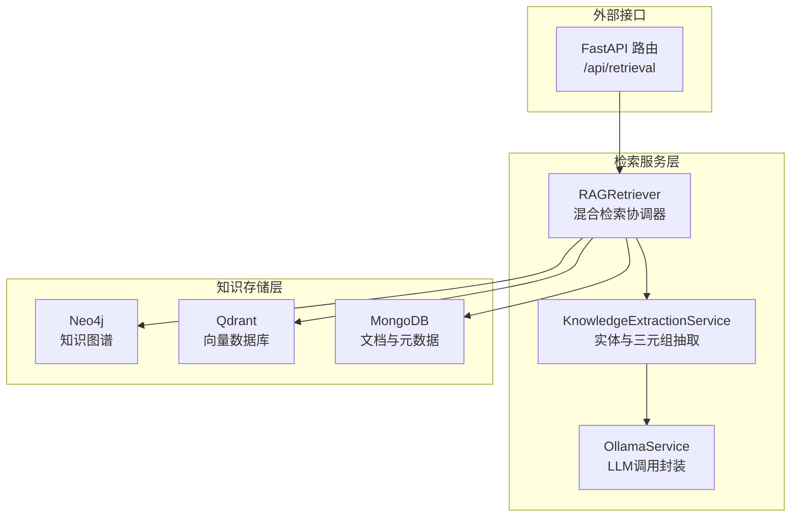
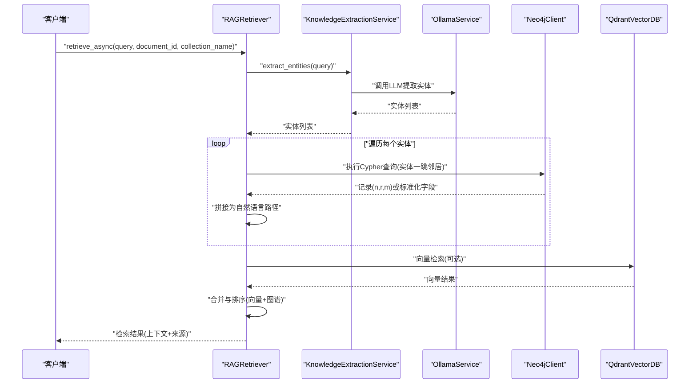
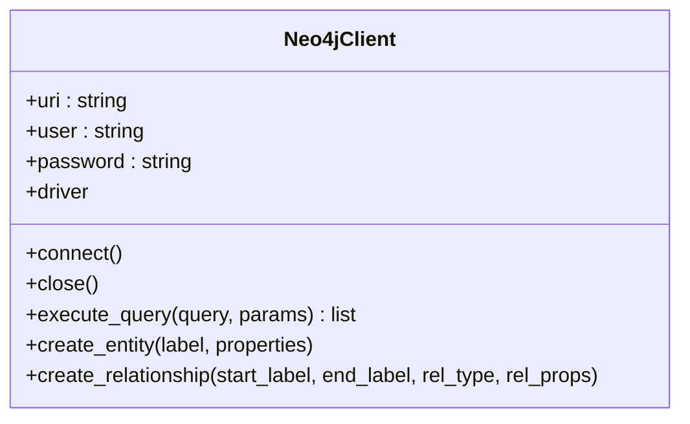
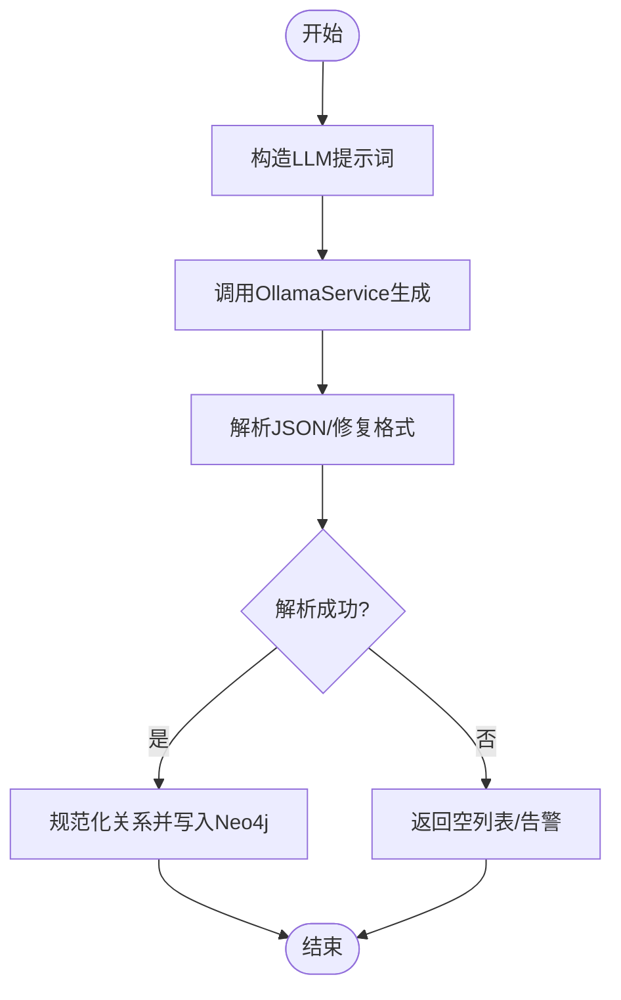
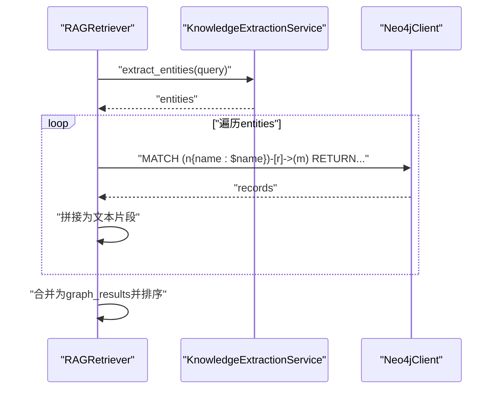
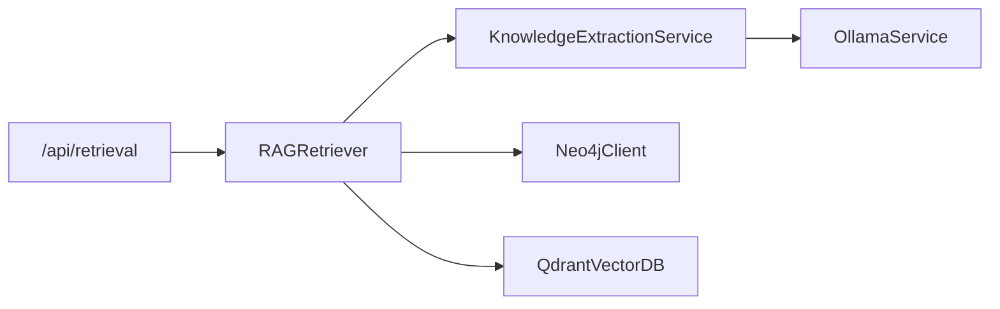

# 图谱检索

<cite>
**本文引用的文件**
- [neo4j_client.py](file://database/neo4j_client.py)
- [knowledge_extraction_service.py](file://services/knowledge_extraction_service.py)
- [rag_retriever.py](file://retrieval/rag_retriever.py)
- [retrieval.py](file://routers/retrieval.py)
- [ollama_service.py](file://services/ollama_service.py)
- [qdrant_client.py](file://database/qdrant_client.py)
- [embedding_service.py](file://embedding/embedding_service.py)
- [README.md](file://README.md)
</cite>

## 目录
1. [简介](#简介)
2. [项目结构](#项目结构)
3. [核心组件](#核心组件)
4. [架构总览](#架构总览)
5. [详细组件分析](#详细组件分析)
6. [依赖分析](#依赖分析)
7. [性能考虑](#性能考虑)
8. [故障排查指南](#故障排查指南)
9. [结论](#结论)
10. [附录](#附录)

## 简介
本文件聚焦“图谱检索模块”的技术实现，系统阐述从查询文本到知识图谱的实体抽取、Neo4j图数据库查询、知识路径构建与结果整合的全流程。文档还涵盖实体提取服务的工作机制（命名实体识别、实体消歧、关系抽取）、图数据库查询优化策略（Cypher设计、索引使用、性能调优）、以及检索配置与使用方法（实体过滤、关系类型限定、结果格式化）。最后提供实际示例，说明从实体到知识图谱路径的转换过程及典型应用场景。

## 项目结构
图谱检索模块位于后端服务中，与向量检索、关键词检索共同构成混合检索体系。其核心文件包括：
- 图数据库客户端：Neo4j 客户端封装，负责连接、Cypher执行、节点与关系创建
- 知识抽取服务：基于 LLM 的三元组抽取与实体提取，支持将文本构建为图谱
- 检索器：RAG 检索器的图谱检索子模块，负责实体提取与图查询
- 路由层：对外暴露检索接口，接收查询参数并返回上下文与来源
- 向量与嵌入：向量检索与嵌入服务，支撑混合检索
- Qdrant 客户端：向量数据库客户端，提供向量搜索与过滤

图表来源
- [retrieval.py:82-135](file://routers/retrieval.py#L82-L135)
- [rag_retriever.py:69-101](file://retrieval/rag_retriever.py#L69-L101)
- [knowledge_extraction_service.py:10-210](file://services/knowledge_extraction_service.py#L10-L210)
- [neo4j_client.py:6-104](file://database/neo4j_client.py#L6-L104)
- [qdrant_client.py:18-544](file://database/qdrant_client.py#L18-L544)

章节来源
- [README.md:11-25](file://README.md#L11-L25)
- [retrieval.py:1-135](file://routers/retrieval.py#L1-L135)
- [rag_retriever.py:22-325](file://retrieval/rag_retriever.py#L22-L325)

## 核心组件
- Neo4j 客户端：提供连接、Cypher 执行、节点与关系创建能力，支持容器环境下的URI适配与连接健康检查
- 知识抽取服务：通过 LLM 提取查询中的关键实体，以及输入文本的“头实体-关系-尾实体”三元组；支持规范化关系类型
- RAG 检索器：混合检索器的图谱检索子模块，负责实体提取、Cypher 查询、路径拼接与结果合并
- 路由层：对外提供检索接口，支持查询分析、检索上下文与来源返回
- 向量与嵌入：向量检索与嵌入服务，支撑向量检索与重排
- Qdrant 客户端：向量数据库客户端，提供向量搜索、过滤与集合管理

章节来源
- [neo4j_client.py:6-104](file://database/neo4j_client.py#L6-L104)
- [knowledge_extraction_service.py:10-210](file://services/knowledge_extraction_service.py#L10-L210)
- [rag_retriever.py:22-325](file://retrieval/rag_retriever.py#L22-L325)
- [retrieval.py:1-135](file://routers/retrieval.py#L1-L135)
- [embedding_service.py:8-277](file://embedding/embedding_service.py#L8-L277)
- [qdrant_client.py:18-544](file://database/qdrant_client.py#L18-L544)

## 架构总览
图谱检索在混合检索中扮演“结构化关联增强”的角色。其工作流如下：
- 输入查询文本
- 使用 LLM 提取关键实体
- 针对每个实体在 Neo4j 中执行 Cypher 查询，获取一跳邻居与关系
- 将图谱路径拼接为自然语言文本，形成“知识图谱上下文”
- 与向量检索、关键词检索结果合并，统一打分与排序

图表来源
- [rag_retriever.py:69-101](file://retrieval/rag_retriever.py#L69-L101)
- [rag_retriever.py:176-260](file://retrieval/rag_retriever.py#L176-L260)
- [knowledge_extraction_service.py:104-142](file://services/knowledge_extraction_service.py#L104-L142)
- [ollama_service.py:9-674](file://services/ollama_service.py#L9-L674)
- [neo4j_client.py:40-101](file://database/neo4j_client.py#L40-L101)
- [qdrant_client.py:336-414](file://database/qdrant_client.py#L336-L414)

## 详细组件分析

### Neo4j 客户端（图数据库访问）
- 连接管理：支持容器环境URI适配（localhost 替换为 host.docker.internal），连接健康检查
- 查询执行：执行 Cypher 语句，返回记录数据列表
- 图谱写入：提供创建实体节点与关系的能力，支持属性合并与规范化关系类型

图表来源
- [neo4j_client.py:6-104](file://database/neo4j_client.py#L6-L104)

章节来源
- [neo4j_client.py:6-104](file://database/neo4j_client.py#L6-L104)

### 知识抽取服务（实体与三元组抽取）
- 实体提取：面向查询的实体列表抽取，返回字符串列表
- 三元组抽取：面向输入文本的“头实体-关系-尾实体”抽取，返回结构化三元组
- JSON 解析：支持从 LLM 返回的 JSON 或 Markdown 代码块中解析
- 关系规范化：将关系名称转换为大写、下划线化，适配 Neo4j 关系类型约束
- 图谱构建：将三元组写入 Neo4j，创建节点与关系，并附加来源文档/块信息

图表来源
- [knowledge_extraction_service.py:32-102](file://services/knowledge_extraction_service.py#L32-L102)
- [knowledge_extraction_service.py:144-195](file://services/knowledge_extraction_service.py#L144-L195)
- [ollama_service.py:9-674](file://services/ollama_service.py#L9-L674)

章节来源
- [knowledge_extraction_service.py:10-210](file://services/knowledge_extraction_service.py#L10-L210)
- [ollama_service.py:9-674](file://services/ollama_service.py#L9-L674)

### RAG 检索器（图谱检索子模块）
- 实体提取：异步调用知识抽取服务，提取查询中的关键实体
- 图查询：对每个实体执行 Cypher 查询，返回一跳邻居与关系信息
- 路径拼接：将图谱记录转换为自然语言路径（实体-关系-实体），并聚合为“知识图谱上下文”
- 结果合并：与向量检索、关键词检索结果合并，统一打分与排序
- 过滤与去重：支持按文档ID过滤，避免跨文档污染；对相同来源按最高分保留

图表来源
- [rag_retriever.py:176-260](file://retrieval/rag_retriever.py#L176-L260)
- [knowledge_extraction_service.py:104-142](file://services/knowledge_extraction_service.py#L104-L142)
- [neo4j_client.py:40-62](file://database/neo4j_client.py#L40-L62)

章节来源
- [rag_retriever.py:22-325](file://retrieval/rag_retriever.py#L22-L325)

### 路由层（检索接口）
- 提供检索接口，支持查询分析、检索上下文与来源返回
- 支持按助手ID、知识空间ID、对话ID等参数控制检索范围
- 返回结构包含上下文文本、来源列表与检索计数

章节来源
- [retrieval.py:1-135](file://routers/retrieval.py#L1-L135)

### 向量与嵌入（对比与补充）
- 向量检索：通过嵌入服务将查询向量化，再在 Qdrant 中进行相似度搜索
- 嵌入服务：封装 Ollama 的嵌入接口，支持模型检测、重试与维度获取
- Qdrant 客户端：提供集合管理、向量插入、搜索与过滤

章节来源
- [embedding_service.py:8-277](file://embedding/embedding_service.py#L8-L277)
- [qdrant_client.py:18-544](file://database/qdrant_client.py#L18-L544)

## 依赖分析
- 组件耦合
  - RAGRetriever 依赖 KnowledgeExtractionService（实体提取）与 Neo4jClient（图查询）
  - KnowledgeExtractionService 依赖 OllamaService（LLM调用）
  - 路由层依赖 RAGRetriever 与 RAGService（高层封装）
- 外部依赖
  - Neo4j：图数据库，用于知识图谱存储与查询
  - Qdrant：向量数据库，用于向量检索
  - Ollama：本地大模型服务，用于实体与三元组抽取

图表来源
- [rag_retriever.py:69-101](file://retrieval/rag_retriever.py#L69-L101)
- [knowledge_extraction_service.py:10-210](file://services/knowledge_extraction_service.py#L10-L210)
- [neo4j_client.py:6-104](file://database/neo4j_client.py#L6-L104)
- [qdrant_client.py:18-544](file://database/qdrant_client.py#L18-L544)
- [retrieval.py:82-135](file://routers/retrieval.py#L82-L135)

章节来源
- [README.md:28-53](file://README.md#L28-L53)

## 性能考虑
- 图查询优化
  - Cypher 设计：返回必要字段（头实体、关系类型、尾实体、来源文档/块ID），避免冗余属性传输
  - 限制返回数量：对每个实体限制一跳邻居数量，防止结果爆炸
  - 过滤策略：支持按文档ID过滤，缩小查询范围
- LLM 调用
  - 实体提取与三元组抽取均使用 LLM，需合理设置超时与重试
  - JSON 解析增强：支持从 Markdown 代码块中提取，提升鲁棒性
- 混合检索
  - 图谱检索结果作为“结构化关联增强”，通常赋予较高初始分，再与向量/关键词结果合并
  - 合并时按来源去重，保留最高分，避免重复文档多次出现

章节来源
- [rag_retriever.py:176-260](file://retrieval/rag_retriever.py#L176-L260)
- [knowledge_extraction_service.py:68-102](file://services/knowledge_extraction_service.py#L68-L102)
- [ollama_service.py:9-674](file://services/ollama_service.py#L9-L674)

## 故障排查指南
- Neo4j 连接失败
  - 检查 URI、用户名与密码配置
  - 容器环境下确认 localhost 是否替换为 host.docker.internal
  - 查看连接健康检查日志
- Cypher 查询异常
  - 确认实体名称与节点属性匹配
  - 检查返回字段映射（头实体、关系类型、尾实体、来源ID）
- LLM 调用失败
  - 检查 Ollama 服务可达性与模型可用性
  - 关注 JSON 解析失败场景，必要时启用告警与回退
- 检索结果为空
  - 确认实体提取是否成功
  - 检查图数据库中是否存在对应实体与关系
  - 验证文档ID过滤是否过于严格

章节来源
- [neo4j_client.py:16-38](file://database/neo4j_client.py#L16-L38)
- [rag_retriever.py:176-260](file://retrieval/rag_retriever.py#L176-L260)
- [knowledge_extraction_service.py:32-66](file://services/knowledge_extraction_service.py#L32-L66)
- [ollama_service.py:9-674](file://services/ollama_service.py#L9-L674)

## 结论
图谱检索模块通过“实体提取 + Neo4j 查询 + 路径拼接”的方式，将结构化知识与向量检索有机结合，显著提升了检索结果的可解释性与准确性。其设计强调异步化、可扩展与可维护性，适合在混合检索体系中作为“结构化关联增强”模块使用。未来可在 Cypher 优化、索引策略与缓存机制方面进一步深化，以应对更大规模的知识图谱与更高并发的检索需求。

## 附录

### 使用方法与配置
- 环境变量
  - Neo4j：NEO4J_URI、NEO4J_USER、NEO4J_PASSWORD
  - Ollama：OLLAMA_BASE_URL、OLLAMA_MODEL、OLLAMA_EMBEDDING_MODEL
  - Qdrant：QDRANT_URL、QDRANT_API_KEY
- 检索接口
  - POST /api/retrieval：支持查询分析、检索上下文与来源返回
  - 支持参数：query、document_id、assistant_id、knowledge_space_ids、conversation_id 等
- 结果格式
  - context：拼接后的上下文文本
  - sources：来源列表，包含文档/附件信息与得分
  - retrieval_count：来源数量

章节来源
- [retrieval.py:14-42](file://routers/retrieval.py#L14-L42)
- [retrieval.py:82-135](file://routers/retrieval.py#L82-L135)
- [README.md:125-166](file://README.md#L125-L166)

### 实际示例
- 示例场景：用户查询“量子计算中的纠缠态与测量原理”
  - 实体提取：得到“量子计算”“纠缠态”“测量原理”等实体
  - 图查询：对每个实体执行一跳查询，返回相关节点与关系
  - 路径拼接：将“量子计算-包含-纠缠态”“纠缠态-涉及-测量原理”等路径拼接为自然语言
  - 结果合并：与向量检索结果合并，统一排序后返回

章节来源
- [rag_retriever.py:176-260](file://retrieval/rag_retriever.py#L176-L260)
- [knowledge_extraction_service.py:104-142](file://services/knowledge_extraction_service.py#L104-L142)