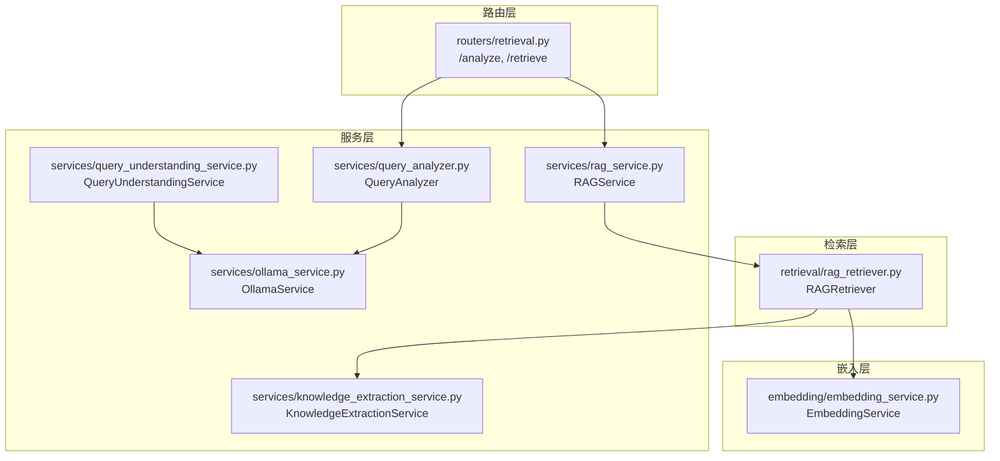
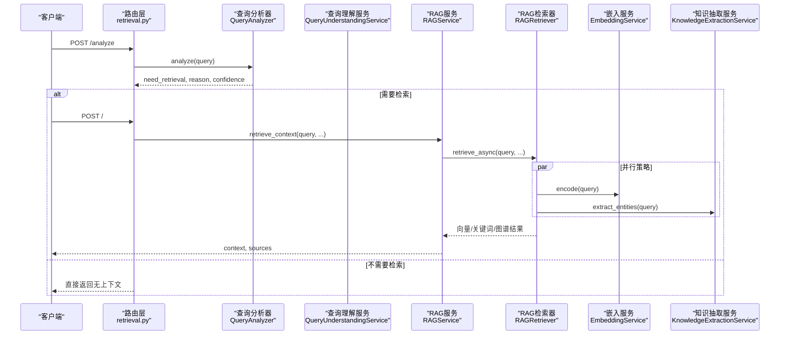
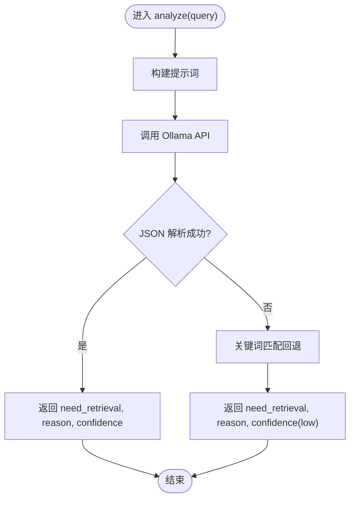
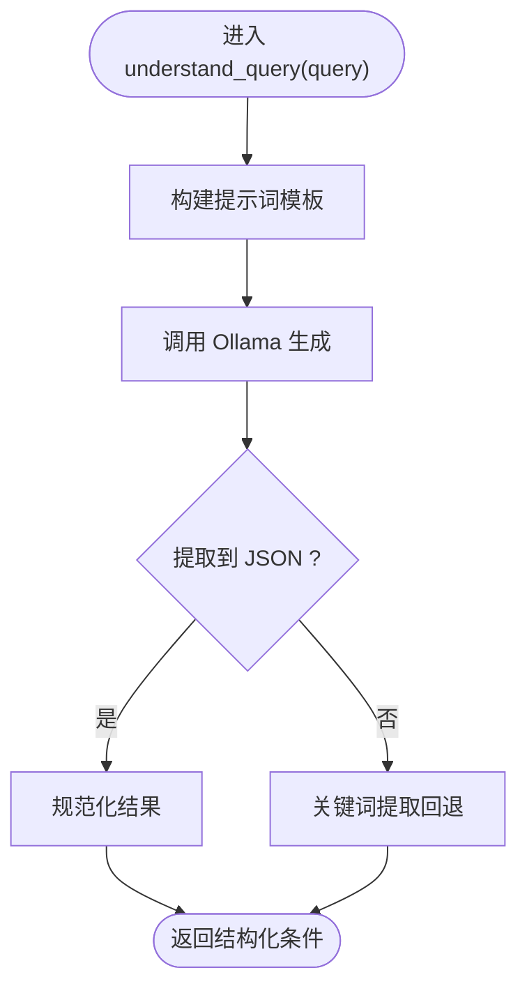
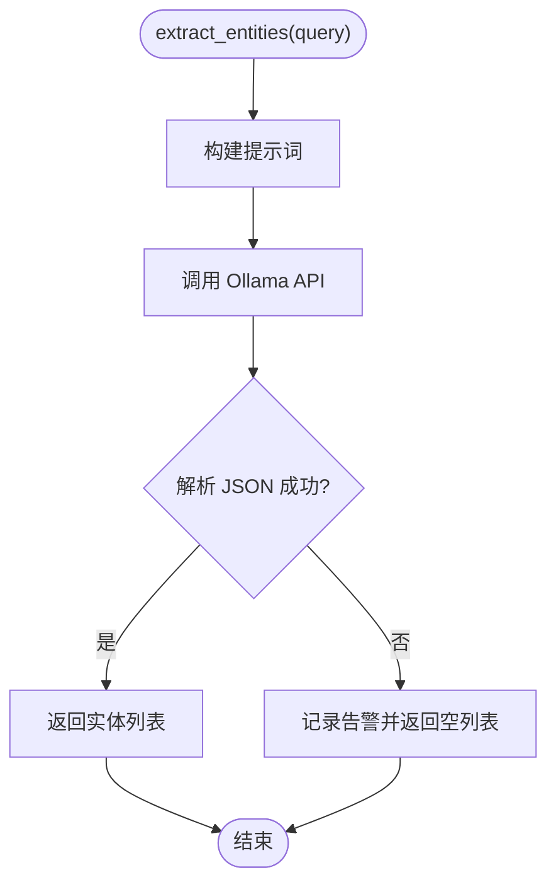
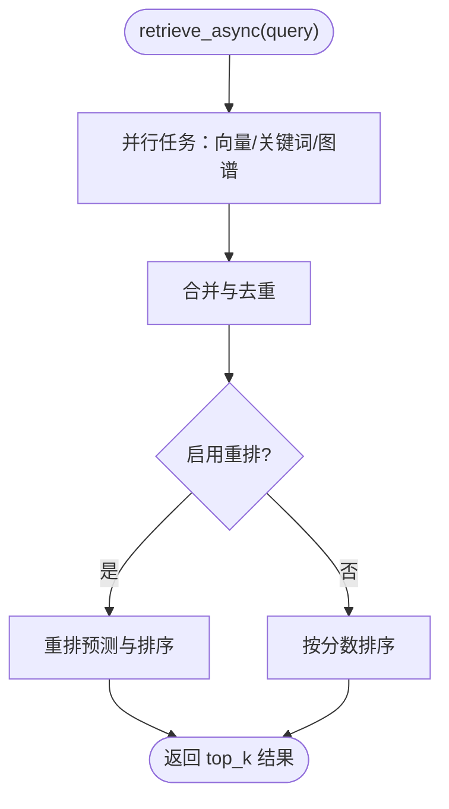
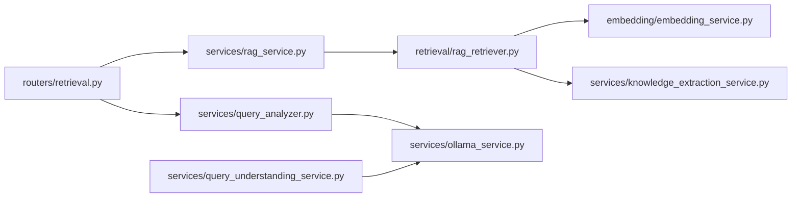

# 查询分析

<cite>
**本文引用的文件**
- [services/query_analyzer.py](file://services/query_analyzer.py)
- [routers/retrieval.py](file://routers/retrieval.py)
- [services/query_understanding_service.py](file://services/query_understanding_service.py)
- [services/knowledge_extraction_service.py](file://services/knowledge_extraction_service.py)
- [retrieval/rag_retriever.py](file://retrieval/rag_retriever.py)
- [services/ollama_service.py](file://services/ollama_service.py)
- [embedding/embedding_service.py](file://embedding/embedding_service.py)
- [services/rag_service.py](file://services/rag_service.py)
- [README.md](file://README.md)
</cite>

## 目录
1. [简介](#简介)
2. [项目结构](#项目结构)
3. [核心组件](#核心组件)
4. [架构总览](#架构总览)
5. [详细组件分析](#详细组件分析)
6. [依赖分析](#依赖分析)
7. [性能考量](#性能考量)
8. [故障排查指南](#故障排查指南)
9. [结论](#结论)
10. [附录](#附录)

## 简介
本文件聚焦于查询分析模块的技术实现，涵盖查询意图识别、查询优化与查询转换的完整流程。系统通过“查询分析器”对用户输入进行快速判断，决定是否需要检索上下文；随后通过“查询理解服务”将自然语言转换为结构化搜索条件；在检索阶段结合向量检索、关键词检索与图谱检索，并辅以可选的重排策略，最终形成高质量的检索上下文。文档还提供配置项说明、流程图与常见问题排查建议。

## 项目结构
查询分析相关的核心文件分布如下：
- 路由层：提供对外接口，接收查询并调用分析器与检索器
- 服务层：包含查询分析器、查询理解服务、知识抽取服务、RAG服务与Ollama服务
- 检索层：实现混合检索与结果合并
- 配置与环境：通过环境变量控制模型与服务行为

图表来源
- [routers/retrieval.py:44-79](file://routers/retrieval.py#L44-L79)
- [services/query_analyzer.py:9-161](file://services/query_analyzer.py#L9-L161)
- [services/query_understanding_service.py:9-248](file://services/query_understanding_service.py#L9-L248)
- [services/knowledge_extraction_service.py:10-211](file://services/knowledge_extraction_service.py#L10-L211)
- [retrieval/rag_retriever.py:22-325](file://retrieval/rag_retriever.py#L22-L325)
- [services/ollama_service.py:9-33](file://services/ollama_service.py#L9-L33)
- [embedding/embedding_service.py:8-157](file://embedding/embedding_service.py#L8-L157)

章节来源
- [routers/retrieval.py:1-135](file://routers/retrieval.py#L1-L135)
- [services/query_analyzer.py:1-163](file://services/query_analyzer.py#L1-L163)
- [services/query_understanding_service.py:1-248](file://services/query_understanding_service.py#L1-L248)
- [services/knowledge_extraction_service.py:1-211](file://services/knowledge_extraction_service.py#L1-L211)
- [retrieval/rag_retriever.py:1-325](file://retrieval/rag_retriever.py#L1-L325)
- [services/ollama_service.py:1-33](file://services/ollama_service.py#L1-L33)
- [embedding/embedding_service.py:1-157](file://embedding/embedding_service.py#L1-L157)

## 核心组件
- 查询分析器（QueryAnalyzer）：基于小模型快速判断是否需要检索，失败时回退到关键词匹配策略
- 查询理解服务（QueryUnderstandingService）：将自然语言转换为结构化搜索条件，包含规范化与关键词回退
- 知识抽取服务（KnowledgeExtractionService）：从文本或查询中抽取实体与三元组，支撑图谱检索
- RAG检索器（RAGRetriever）：混合检索（向量/关键词/图谱），结果合并与可选重排
- RAG服务（RAGService）：协调多集合检索与上下文构建
- Ollama服务（OllamaService）：统一的模型调用封装
- 嵌入服务（EmbeddingService）：向量化服务

章节来源
- [services/query_analyzer.py:9-161](file://services/query_analyzer.py#L9-L161)
- [services/query_understanding_service.py:9-248](file://services/query_understanding_service.py#L9-L248)
- [services/knowledge_extraction_service.py:10-211](file://services/knowledge_extraction_service.py#L10-L211)
- [retrieval/rag_retriever.py:22-325](file://retrieval/rag_retriever.py#L22-L325)
- [services/rag_service.py:7-247](file://services/rag_service.py#L7-L247)
- [services/ollama_service.py:9-33](file://services/ollama_service.py#L9-L33)
- [embedding/embedding_service.py:8-157](file://embedding/embedding_service.py#L8-L157)

## 架构总览
查询分析模块的端到端流程如下：

图表来源
- [routers/retrieval.py:44-79](file://routers/retrieval.py#L44-L79)
- [services/query_analyzer.py:38-105](file://services/query_analyzer.py#L38-L105)
- [services/query_understanding_service.py:87-134](file://services/query_understanding_service.py#L87-L134)
- [services/rag_service.py:10-191](file://services/rag_service.py#L10-L191)
- [retrieval/rag_retriever.py:69-101](file://retrieval/rag_retriever.py#L69-L101)
- [embedding/embedding_service.py:1-157](file://embedding/embedding_service.py#L1-L157)
- [services/knowledge_extraction_service.py:104-142](file://services/knowledge_extraction_service.py#L104-L142)

## 详细组件分析

### 查询分析器（QueryAnalyzer）
职责与流程
- 使用小模型快速判断是否需要检索，返回布尔结果与理由
- 若模型调用失败或JSON解析失败，回退到关键词匹配策略
- 关键词集合覆盖问候、系统操作、计算/编程/时间/天气等无需检索场景，以及传感器/原理/应用/文档/课程/选型等需要检索场景

图表来源
- [services/query_analyzer.py:38-105](file://services/query_analyzer.py#L38-L105)
- [services/query_analyzer.py:107-157](file://services/query_analyzer.py#L107-L157)

章节来源
- [services/query_analyzer.py:9-161](file://services/query_analyzer.py#L9-L161)

### 查询理解服务（QueryUnderstandingService）
职责与流程
- 将自然语言转换为结构化搜索条件（研究领域、用户类型、技能、学院、专业、兴趣、意图）
- 通过LLM生成JSON，失败时使用关键词提取作为回退
- 对结果进行规范化处理，保证字段类型与取值范围

图表来源
- [services/query_understanding_service.py:87-134](file://services/query_understanding_service.py#L87-L134)
- [services/query_understanding_service.py:136-204](file://services/query_understanding_service.py#L136-L204)
- [services/query_understanding_service.py:206-246](file://services/query_understanding_service.py#L206-L246)

章节来源
- [services/query_understanding_service.py:1-248](file://services/query_understanding_service.py#L1-L248)

### 知识抽取服务（KnowledgeExtractionService）
职责与流程
- 从文本中抽取“实体-关系-实体”三元组，支持Neo4j存储
- 从查询中提取关键实体，供图谱检索使用
- 提供JSON解析与修复逻辑，增强鲁棒性

图表来源
- [services/knowledge_extraction_service.py:104-142](file://services/knowledge_extraction_service.py#L104-L142)
- [services/knowledge_extraction_service.py:68-102](file://services/knowledge_extraction_service.py#L68-L102)

章节来源
- [services/knowledge_extraction_service.py:1-211](file://services/knowledge_extraction_service.py#L1-L211)

### RAG检索器（RAGRetriever）
职责与流程
- 并行执行向量检索、关键词检索与图谱检索
- 合并结果并进行初步去重与打分融合
- 支持可选重排（Cross-Encoder），当前实现受条件限制

图表来源
- [retrieval/rag_retriever.py:69-101](file://retrieval/rag_retriever.py#L69-L101)
- [retrieval/rag_retriever.py:262-297](file://retrieval/rag_retriever.py#L262-L297)
- [retrieval/rag_retriever.py:299-324](file://retrieval/rag_retriever.py#L299-L324)

章节来源
- [retrieval/rag_retriever.py:1-325](file://retrieval/rag_retriever.py#L1-L325)

### RAG服务（RAGService）
职责与流程
- 协调多知识空间集合的并行检索
- 构建上下文与来源信息，支持对话附件与普通文档
- 提供回退机制，保障服务稳定性

章节来源
- [services/rag_service.py:7-247](file://services/rag_service.py#L7-L247)

### Ollama服务（OllamaService）
职责与流程
- 统一封装Ollama调用，支持自定义基础URL与模型名称
- 提供会话与超时配置，适配不同模型与负载

章节来源
- [services/ollama_service.py:1-33](file://services/ollama_service.py#L1-L33)

### 嵌入服务（EmbeddingService）
职责与流程
- 通过Ollama模型进行文本向量化
- 支持模型名称规范化与自动检测，确保可用性

章节来源
- [embedding/embedding_service.py:1-157](file://embedding/embedding_service.py#L1-L157)

## 依赖分析
- 路由层依赖查询分析器与RAG服务
- RAG服务依赖RAG检索器
- RAG检索器依赖嵌入服务与知识抽取服务
- 查询理解服务与查询分析器均依赖Ollama服务
- 系统整体通过环境变量控制Ollama地址、模型与超时

图表来源
- [routers/retrieval.py:1-135](file://routers/retrieval.py#L1-L135)
- [services/query_analyzer.py:1-163](file://services/query_analyzer.py#L1-L163)
- [services/query_understanding_service.py:1-248](file://services/query_understanding_service.py#L1-L248)
- [services/knowledge_extraction_service.py:1-211](file://services/knowledge_extraction_service.py#L1-L211)
- [retrieval/rag_retriever.py:1-325](file://retrieval/rag_retriever.py#L1-L325)
- [services/ollama_service.py:1-33](file://services/ollama_service.py#L1-L33)
- [embedding/embedding_service.py:1-157](file://embedding/embedding_service.py#L1-L157)

章节来源
- [routers/retrieval.py:1-135](file://routers/retrieval.py#L1-L135)
- [services/query_analyzer.py:1-163](file://services/query_analyzer.py#L1-L163)
- [services/query_understanding_service.py:1-248](file://services/query_understanding_service.py#L1-L248)
- [services/knowledge_extraction_service.py:1-211](file://services/knowledge_extraction_service.py#L1-L211)
- [retrieval/rag_retriever.py:1-325](file://retrieval/rag_retriever.py#L1-L325)
- [services/ollama_service.py:1-33](file://services/ollama_service.py#L1-L33)
- [embedding/embedding_service.py:1-157](file://embedding/embedding_service.py#L1-L157)

## 性能考量
- 查询分析器使用小模型与低温度、短输出长度配置，确保快速响应
- RAG检索器采用并行策略与结果合并，提升吞吐
- 嵌入服务与Ollama服务支持超时与模型规范化，增强稳定性
- 可选重排模块当前被条件禁用，避免潜在性能瓶颈

章节来源
- [services/query_analyzer.py:52-61](file://services/query_analyzer.py#L52-L61)
- [retrieval/rag_retriever.py:82-89](file://retrieval/rag_retriever.py#L82-L89)
- [embedding/embedding_service.py:30-44](file://embedding/embedding_service.py#L30-L44)
- [services/ollama_service.py:31-33](file://services/ollama_service.py#L31-L33)

## 故障排查指南
- 查询分析失败
  - 现象：模型调用异常或JSON解析失败
  - 处理：自动回退到关键词匹配；检查Ollama服务连通性与模型可用性
- 查询理解失败
  - 现象：LLM未返回有效JSON
  - 处理：使用关键词提取回退；检查提示词模板与模型输出格式
- 检索失败
  - 现象：向量/关键词/图谱检索异常
  - 处理：查看嵌入服务与知识抽取服务日志；确认数据库与图数据库连接
- 重排不可用
  - 现象：重排模块未生效
  - 处理：确认重排模块加载状态与依赖可用性

章节来源
- [services/query_analyzer.py:95-105](file://services/query_analyzer.py#L95-L105)
- [services/query_understanding_service.py:124-134](file://services/query_understanding_service.py#L124-L134)
- [retrieval/rag_retriever.py:136-138](file://retrieval/rag_retriever.py#L136-L138)
- [services/rag_service.py:225-236](file://services/rag_service.py#L225-L236)

## 结论
查询分析模块通过“快速判断 + 结构化解析 + 混合检索”的组合，实现了从自然语言到结构化上下文的高效转换。其设计强调快速响应与稳健回退，既满足实时性需求，又具备良好的容错能力。后续可在重排策略、关键词规则与提示词模板上持续优化，以进一步提升检索质量与用户体验。

## 附录

### 配置选项与环境变量
- Ollama基础配置
  - OLLAMA_BASE_URL：Ollama服务地址（默认 http://localhost:11434）
  - OLLAMA_MODEL：默认模型名称（用于通用生成）
  - OLLAMA_EMBEDDING_MODEL：嵌入模型名称（用于向量化）
  - OLLAMA_TIMEOUT：Ollama调用超时（秒）
- 查询分析器
  - OLLAMA_ANALYSIS_MODEL：分析用小模型名称（默认 qwen2.5:3b）
- 数据库与服务
  - MONGODB_URI/MONGODB_DB_NAME：MongoDB连接
  - QDRANT_URL/QDRANT_API_KEY：Qdrant配置
  - NEO4J_URI/NEO4J_USER/NEO4J_PASSWORD：Neo4j配置
  - REDIS_*：Redis缓存配置（可选）

章节来源
- [services/ollama_service.py:24-33](file://services/ollama_service.py#L24-L33)
- [embedding/embedding_service.py:21-44](file://embedding/embedding_service.py#L21-L44)
- [services/query_analyzer.py:12-20](file://services/query_analyzer.py#L12-L20)
- [README.md:125-166](file://README.md#L125-L166)

### 实际示例与优化建议
- 示例类型
  - 一般性对话/系统操作：无需检索（问候、帮助、时间、天气等）
  - 传感器/技术/课程/文档类问题：需要检索（原理、应用、参数、选型等）
- 优化建议
  - 扩展关键词规则库，覆盖更多领域与场景
  - 调整提示词模板，提升查询理解的准确性
  - 在稳定环境下启用重排模块，提高最终排序质量
  - 针对高频查询建立规则缓存，降低LLM调用成本

章节来源
- [services/query_analyzer.py:115-157](file://services/query_analyzer.py#L115-L157)
- [services/query_understanding_service.py:21-85](file://services/query_understanding_service.py#L21-L85)